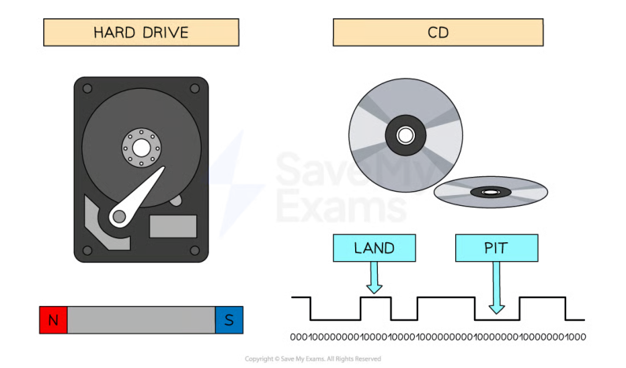
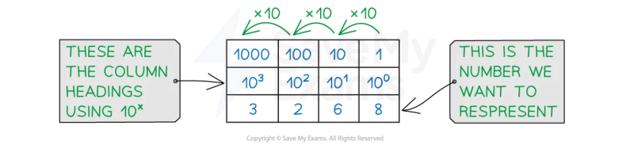
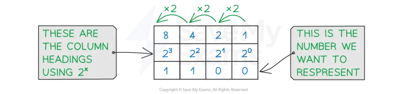
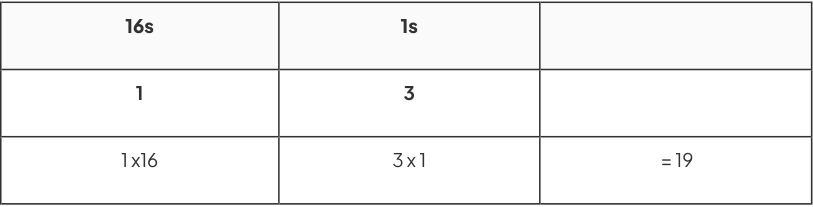
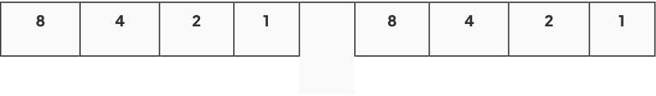
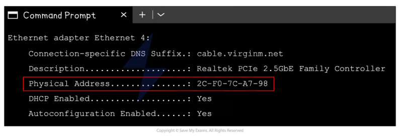
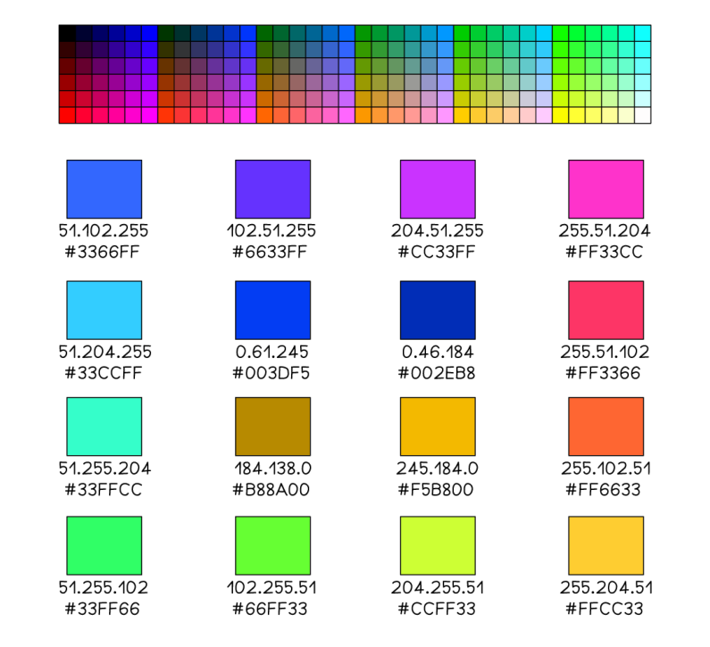
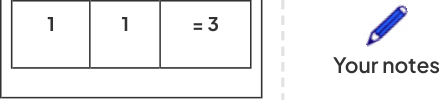

# CAIE Computer Science IGCSE — Chapter ?: Cambridge (CIE) IGCSE Computer Science

---

Your notes 

## Number Systems 

## Contents 

- Computers & Binary Number Systems Converting Between Binary & Denary 

- Converting Between Hexadecimal & Denary 

- Converting Between Hexadecimal & Binary 

- Uses of Hexadecimal 

- Binary Addition Binary Shifts 

- Two's Complement 

© 2026 Save My Exams, Ltd. Get more and ace your exams at savemyexams.com 

**1** 

Computers & Binary 

Your notes 

## Why Computers Use Binary 

## Examiner Tips and Tricks 

This note covers exactly what Cambridge 0478 expects you to know about binary processing—nothing more, nothing less. 

## Why does data have to be converted to binary to be processed by a computer? 

Data is processed in a computer using logic gates that only have two states 

- The binary number system only has two digits (1/0), which means each digit can represent a different state (1 = on, 0 = off) 

All data must be converted to binary before a computer can understand and process it 

- Converting data to binary allows computers to process it at an incredible speed, perform complex calculations and store vast amounts of data efficiently 

Secondary storage is a great example of the process 

- Magnetic hard drives use North and South polarity to represent a 1 or a 0 

- In Optical disks, light hitting a flat area (land) is interpreted as a 1 and light hitting a bump (pit) is interpreted as a 0 

© 2026 Save My Exams, Ltd. 

Get more and ace your exams at savemyexams.com 

**2** 

Take an example of driving a car 

When driving a car the accelerator pedal is used to increase the cars speed 

Your notes 

If a car was accelerating from 50mph to 100mph the increase would be gradual 

In a computer system, the car is doing either 50mph (0) or 100mph (1), there is no inbetween 

Trying to change the computer system so that it has more options would be less efficient and require more complex parts for the computer to understand 

## Worked Example 

Explain why computers process data in binary format [2] 

## Answer 

Computers process data using logic gates... [1] ... that can only have two states (1/0) [1] 

## Examiner Tips and Tricks 

Mark schemes expect: logic gates + two states (1/0). Phrases like “computers understand binary” don’t get the mark, this does. 

© 2026 Save My Exams, Ltd. 

Get more and ace your exams at savemyexams.com 

**3** 

Number Systems 

Your notes 

## The Denary, Binary & Hexadecimal Number Systems 

## Examiner Tips and Tricks 

All conversions here are capped at 16 bits because that’s Cambridge’s limit. No distractions, just the format you’ll see in Paper 1. 

## What is denary? 

- Denary is a number system that is made up of 10 digits (0−9) 

- Denary is referred to as a base-10 number system 

- Each digit has a weight factor of 10 raised to a power, the rightmost digit is 1s (100), the next digit to the left 10s (10 ) and so on1 

- Humans use the denary system for counting, measuring and performing maths calculations 

Using combinations of the 10 digits we can represent any number 

- In this example, (3 x 1000) + (2 x 100) + (6 x 10) + (8 x 1) = 3268 

- To represent a bigger number we add more digits 

## What is binary? 

Binary is a number system that is made up of two digits (1 and 0) 

- Binary is referred to as a base-2 number system 

- Each digit has a weight factor of 2 raised to a power, the rightmost digit is 1s (20), the next digit to the left 2s (2 ) and so on1 

Each time a new digit is added, the column value is multiplied by 2 

Using combinations of the 2 digits we can represent any number 

© 2026 Save My Exams, Ltd. 

Get more and ace your exams at savemyexams.com 

**4** 

Your notes 

In this example, Binary 1100 = (1 x 8) + (1 x 4) = 12 

To represent bigger numbers we add more binary digits (bits) 

|32,768|16,384|8,192|4,096|2,048|1,024|512|256|128|64|32|16|8|4|
|---|---|---|---|---|---|---|---|---|---|---|---|---|---|
|2 15|2 14|2 13|2 12|2 11|2 10|2 9|2 8|2 7|2 6|2 5|2 4|2 3|2 2|

## Examiner Tips and Tricks 

The largest denary number that can be represented using 16 bits is: 

65,535 (Binary 1111111111111111) 

## What is hexadecimal? 

Hexadecimal is a number system that is made up of 16 digits, 10 numbers (0−9) and 6 letters (A-F) 

|0|1|2|3|4|5|6|7|8|9|10|11|12|13|14|15|
|---|---|---|---|---|---|---|---|---|---|---|---|---|---|---|---|
|0|1|2|3|4|5|6|7|8|9|A|B|C|D|E|F|

Hexadecimal is referred to as a base-16 number system 

Each digit has a weight factor of 16 raised to a power, the rightmost digit is 1s (16^0), the next digit to the left 16s (16^1) 

In GCSE you are required to work with up to and including 2 digit hexadecimal values 

© 2026 Save My Exams, Ltd. 

Get more and ace your exams at savemyexams.com 

**5** 

A quick comparison table demonstrates a relationship between hexadecimal and a binary nibble 

Your notes 

One hexadecimal digit can represent four bits of binary data 

|Examiner Tips and Tricks You must be able to convert binary to hex and back using nibbles. Write out the hex digits (0–F) during the exam to avoid confusion—it’s a top tip that examiners mention every year.|Examiner Tips and Tricks You must be able to convert binary to hex and back using nibbles. Write out the hex digits (0–F) during the exam to avoid confusion—it’s a top tip that examiners mention every year.|Examiner Tips and Tricks You must be able to convert binary to hex and back using nibbles. Write out the hex digits (0–F) during the exam to avoid confusion—it’s a top tip that examiners mention every year.|
|---|---|---|
|Denary|Binary|Hexadecimal|
|0|0000|0|
|1|0001|1|
|2|0010|2|
|3|0011|3|
|4|0100|4|
|5|0101|5|
|6|0110|6|
|7|0111|7|
|8|1000|8|
|9|1001|9|
|10|1010|A|
|11|1011|B|
|12|1100|C|
|13|1101|D|
|14|1110|E|

© 2026 Save My Exams, Ltd. 

Get more and ace your exams at savemyexams.com 

**6** 

15 1111 

F 

Your notes 

© 2026 Save My Exams, Ltd. 

Get more and ace your exams at savemyexams.com 

**7** 

Your notes 

## Converting Between Binary & Denary 

## Denary to Binary Conversion 

## Examiner Tips and Tricks 

Every method and number line on this page follows the exact rules and bit limits used in the Cambridge IGCSE 0478 exam. No extras. No guesswork. 

## How do you convert denary to binary? 

It is important to know the process of converting from denary to binary to understand how computers interpret and process data 

To convert from denary to binary you must start by writing out a binary number line 

- Find the first column heading with a value larger than the denary value you are converting 

Write down each column heading to the right (not including the largest heading) until you reach 1 

32,768 16,384 8,192 4,096 2,048 1,024 512 256 128 64 32 16 8 4 2 

## Example 1 

To convert the denary number 45 to binary, start by writing out the binary number line 

The first column heading larger than 45 is 64, so the number line would be: 

32 16 8 4 2 1 

## Start at the leftmost empty column heading (32) 

Divide column heading into denary number (how many times does 32 fit into 45?) 

1 time with 13 remaining 

|13||||||
|---|---|---|---|---|---|
|32|16|8|4|2|1|
|1||||||

© 2026 Save My Exams, Ltd. 

Get more and ace your exams at savemyexams.com 

**8** 

Repeat with next column heading (how many times does 16 fit into 13?) 

0 times with 13 remaining 

Your notes 

|13|13|||||
|---|---|---|---|---|---|
|32|16|8|4|2|1|
|1|0|||||

Repeat until all columns have a binary value 

|13|13|5|1|1|0|
|---|---|---|---|---|---|
|32|16|8|4|2|1|
|1|0|1|1|0|1|

Denary 45 is 101101 in binary (6 bits) 

## Examiner Tips and Tricks 

Cambridge often asks for a specific number of bits—if the question says “8−bit answer,” you must pad your binary result with leading 0s. Always double-check the number of bits or you’ll lose a mark. 

## Example 2 

To convert the denary number 3059 to binary, start by writing out the binary number line 

The first column heading larger than 3059 is 4096, so the number line would be: 

|2,048|1,024|512|256|128|64|32|16|8|4|2|1|
|---|---|---|---|---|---|---|---|---|---|---|---|
|||||||||||||
|Start at theleftmost empty column heading(2048) Dividecolumn heading into denary number(how many times does 1 time with 1011 remaining||||||||2048 ft into 3059?)||||
|1011||||||||||||
|2,048|1,024|512|256|128|64|32|16|8|4|2|1|

© 2026 Save My Exams, Ltd. 

Get more and ace your exams at savemyexams.com 

**9** 

1 

Your notes 

Repeat with next column heading (how many times does 1024 fit into 1011?) 

0 times with 1011 remaining 

|1011|1011|||||||||||
|---|---|---|---|---|---|---|---|---|---|---|---|
|2,048|1,024|512|256|128|64|32|16|8|4|2|1|
|1|0|||||||||||

Repeat until all columns have a binary value 

|1011|1011|499|243|115|51|19|3|3|3|1|0|
|---|---|---|---|---|---|---|---|---|---|---|---|
|2,048|1,024|512|256|128|64|32|16|8|4|2|1|
|1|0|1|1|1|1|1|1|0|0|1|1|

Denary 3059 is 101111110011 in binary (12 bits) 

## Binary to Denary Conversion 

To convert from binary to denary, count how many bits make up the value 

Write out the column headings for the number of bits given from right to left 

Add together any column heading with a value of 1 in the column 

## Example 1 (4 bits) 

To convert the binary number 1011 to denary, start by writing out the binary headings from right to left 

|8|4|2|1|
|---|---|---|---|
|||||
|Write in the binary digits under the headings from left to right||||
|8|4|2|1|
|1|0|1|1|

Add together any column heading with a 1 under it 

© 2026 Save My Exams, Ltd. 

Get more and ace your exams at savemyexams.com 

**10** 

(1 x 8) + (1 x 2) + (1 x 1) = 11 

Binary 1011 is 11 in denary 

Your notes 

## Examiner Tips and Tricks 

If a binary number ends in 1, the denary result must be odd. Use this as a quick logic check during the exam—examiners love to test basic number sense. 

## Example 2 (8 bits) 

To convert the binary number 01100011 to denary, start by writing out the binary headings from right to left 

128 64 32 16 8 4 2 1 

Write in the binary digits under the headings from left to right 

|128|64|32|16|8|4|2|1|
|---|---|---|---|---|---|---|---|
|0|1|1|0|0|0|1|1|

Add together any column heading with a 1 under it 

- (1 x 64) + (1 x 32) + (1 x 2) + (1 x 1) = 99 

Binary 01100011 is 99 in denary 

## Example 3 (14 bits) 

To convert the binary number 01110001110100 to denary, start by writing out the binary headings from right to left 

|8,192|4,096|2,048|1,024|512|256|128|64|32|16|8|4|2|1|
|---|---|---|---|---|---|---|---|---|---|---|---|---|---|
|0|1|1|1|0|0|0|1|1|1|0|1|0|0|

Add together any column heading with a 1 under it 

(1 x 4096) + (1 x 2048) + (1 x 1024) + (1 x 64) + (1 x 32) + (1 x 16) + (1 x 4) = 7284 Binary 01110001110100 is 7284 in denary 

© 2026 Save My Exams, Ltd. 

Get more and ace your exams at savemyexams.com 

**11** 

Your notes 

## Converting Between Hexadecimal & Denary 

## Denary to Hexadecimal Conversion 

## How do you convert denary to hexadecimal? 

## Examiner Tips and Tricks 

Cambridge IGCSE 0478 requires you to convert between denary and hex without a calculator. Every method shown here is designed to match exam conditions exactly. 

## Method 1 (denary to binary to hexadecimal) 

To convert the denary number 28 to hexadecimal, start by converting the denary number to binary 

|128|64|32|16|8|4|2|1|
|---|---|---|---|---|---|---|---|
|0|0|0|1|1|1|0|0|

Split the 8 bit binary number into two nibbles as shown below 

|8|4|2|1||8|4|2|1|
|---|---|---|---|---|---|---|---|---|
|0|0|0|1||1|1|0|0|

Convert each nibble to its denary value 

## 0001 = 1 and 1100 = 12 

- Using the comparison table, the denary value 1 is also 1 in hexadecimal whereas denary value 12 is represented in hexadecimal as C 

Denary 28 is 1C in hexadecimal 

## Method 2 (divide by 16) 

To convert the denary number 163 to hexadecimal, start by dividing the denary value by 16 and recording the whole times the number goes in and the remainder 

163 �16 = 10 remainder 3 

In hexadecimal the whole number = digit 1 and the remainder = digit 2 

- Digit 1 = 10 (A) 

- Digit 2 = 3 

© 2026 Save My Exams, Ltd. 

Get more and ace your exams at savemyexams.com 

**12** 

Denary 163 is A3 in hexadecimal 

Your notes 

## Hexadecimal to Denary Conversion 

# How do you convert hexadecimal to denary? 

## Method 1 (hexadecimal to binary to denary) 

## Examiner Tips and Tricks 

If you're not confident multiplying or dividing by 16, always fall back on binary conversion. It’s fool proof, and examiners accept either method. 

To convert the hexadecimal number B9 to denary, take each hexadecimal digit and convert it from its denary value to 4 bit binary (nibble) 

||B (11)|B (11)||||9|9||
|---|---|---|---|---|---|---|---|---|
|8|4|2|1||8|4|2|1|
|1|0|1|1||1|0|0|1|

Join the two nibbles to make an 8 bit number (byte) 

## Convert from binary to denary 

|128|64|32|16|8|4|2|1|
|---|---|---|---|---|---|---|---|
|1|0|1|1|1|0|0|1|

(1 x 128) + (1 x 32) + (1 x 16) + (1 x 8) + (1 x 1) = 185 

Hexadecimal B9 is 185 in denary 

## Method 2 (multiply by 16) 

To convert the hexadecimal number 79 to denary, start by multiplying the first hexadecimal digit by 16 

## 7 ✖ 16 = 112 

Add digit 2 to the result 

- 112 + 9 = 121 

Hexadecimal 79 is 121 in denary 

© 2026 Save My Exams, Ltd. 

Get more and ace your exams at savemyexams.com 

**13** 

## Examiner Tips and Tricks 

Remember that the exam is non-calculator, if you are not confident multiplying and dividing by 16 then use method 1 on both conversions 

Your notes 

© 2026 Save My Exams, Ltd. 

Get more and ace your exams at savemyexams.com 

**14** 

Converting Between Hexadecimal & Binary 

Your notes 

## Binary to Hexadecimal Conversion 

## How do you convert from binary to hexadecimal? 

## Examiner Tips and Tricks 

Cambridge IGCSE 0478 expects all conversions to use 8−bit binary and 2−digit hex where possible. These examples follow the exam format exactly—so you’re revising the right way. 

It is important before revising how to convert from binary to hexadecimal and vice versa that you fully understand the binary and hexadecimal number systems. 

|0|1|2|3|4|5|6|7|8|9|10|11|12|13|14|15|
|---|---|---|---|---|---|---|---|---|---|---|---|---|---|---|---|
|0|1|2|3|4|5|6|7|8|9|A|B|C|D|E|F|

## Example 1 

To convert the binary number 10110111 to hexadecimal, first split the 8 bit number into 2 binary nibbles 

|8|4|2|1||8|4|2|1|
|---|---|---|---|---|---|---|---|---|
|1|0|1|1||0|1|1|1|

For each nibble, convert the binary to it’s denary value 

- (1 x 8) + (1 x 2) + (1 x 1) = 11 (B) 

- (1 x 4) + (1 x 2) + (1 x 1) = 7 

Join them together to make a 2 digit hexadecimal number 

Binary 10110111 is B7 in hexadecimal 

## Example 2 

To convert the binary number 00111001 to hexadecimal, first split the 8 bit number into 2 binary nibbles 

© 2026 Save My Exams, Ltd. 

Get more and ace your exams at savemyexams.com 

**15** 

0 0 1 1 1 0 0 1 

For each nibble, convert the binary to it’s denary value 

- (1 x 2) + (1 x 1) = 3 

- (1 x 8) + (1 x 1) = 9 

- Join them together to make a 2 digit hexadecimal number 

Binary 00111001 is 39 in hexadecimal 

## Hexadecimal to Binary Conversion How do you convert from hexadecimal to binary? 

## Example 1 

To convert the hexadecimal number 5F to binary, first split the digits apart and convert each to a binary nibble 

|8||4|||2||1||
|---|---|---|---|---|---|---|---|---|
|0||1|||0||1|= 5|
||||||||||
|8||4||2|1||||
|1||1||1|1|||= 15 (F)|

Join the 2 binary nibbles together to create an 8 bit binary number 

|128|64|32|16|8|4|2|1|
|---|---|---|---|---|---|---|---|
|0|1|0|1|1|1|1|1|

Hexadecimal 5F is 01011111 in binary 

## Examiner Tips and Tricks 

You might see methods that skip writing out the full 8−bit binary number—especially in textbooks. In this course, we stick to examiner-approved formatting, so your answers never fall short. 

## Example 2 

© 2026 Save My Exams, Ltd. 

Get more and ace your exams at savemyexams.com 

**16** 

To convert the hexadecimal number 26 to binary, first split the digits apart and convert each to a binary nibble 

Your notes 

|8|4|2|1||
|---|---|---|---|---|
|0|0|1|0|= 2|
||||||
|8|4|2|1||
|0|1|1|0|= 6|

Join the 2 binary nibbles together to create an 8 bit binary number 

|128|64|32|16|8|4|2|1|
|---|---|---|---|---|---|---|---|
|0|0|1|0|0|1|1|0|

Hexadecimal 26 is 00100110 in binary 

© 2026 Save My Exams, Ltd. 

Get more and ace your exams at savemyexams.com 

**17** 

Uses of Hexadecimal 

Your notes 

## Uses of Hexadecimal 

## Examiner Tips and Tricks 

Cambridge IGCSE 0478 specifically requires you to explain why hexadecimal is used instead of binary—especially for things like MAC addresses, colour codes, and URLs. Everything on this page comes straight from the spec. 

## Why is hexadecimal used? 

In Computer Science hexadecimal is often preferred when working with large values 

- It takes fewer digits to represent a given value in hexadecimal than in binary 

1 hexadecimal digit corresponds 4 bits (one nibble) and can represent 16 unique values (0−F) 

It is beneficial to use hexadecimal over binary because: 

The more bits there are in a binary number, the harder it makes for a human to read 

Numbers with more bits are more prone to errors when being copied 

## Examiner Tips and Tricks 

In the exam, don’t just say “hex is shorter” or “hex is easier.” Use phrases like “fewer digits = easier for humans to read” or “less chance of copying errors”—these match the mark scheme language. 

Examples of where hexadecimal can be seen: 

MAC addresses 

- Colour codes 

URLs 

## MAC addresses 

MAC address are covered here in full 

A typical MAC address consists of 12 hexadecimal digits, equivalent to 48 digits in in binary 

AA:BB:CC:DD:EE:FF 

© 2026 Save My Exams, Ltd. 

Get more and ace your exams at savemyexams.com 

**18** 

   - 10101010:10111011:11001100:11011101:11101110:11111111 

- Writing down or performing calculations with 48 binary digits makes it very easy to make a mistake 

Your notes 

## Colour codes 

- A typical hexadecimal colour code consists of 6 hexadecimal digits, equivalent to 24 digits in binary 

   - #66FF33 (green) 

   - 01000010:11111111:00110011 

© 2026 Save My Exams, Ltd. 

Get more and ace your exams at savemyexams.com **19** 

Your notes 

## URL's 

- A URL can only contain standard characters (a-z and A-Z), numbers (0−9) and some special symbols which is enough for basic web browsing 

- If a URL needs to include a character outside of this set, they are converted into a hexadecimal code 

Hexadecimal codes included in a URL are prefixed with a % sign 

## Examiner Tips and Tricks 

You might see other uses of hex online (like memory dumps or debug screens). For your exam, stick to the three covered here: MAC addresses, colour codes, and URLs —they're the only ones that come up in past papers. 

© 2026 Save My Exams, Ltd. 

Get more and ace your exams at savemyexams.com 

**20** 

Your notes 

## Binary Addition 

## Adding Positive 8-bit Binary Integers 

## Examiner Tips and Tricks 

Cambridge IGCSE 0478 expects you to add 8−bit binary values using clear working, with carries shown. These examples match the style and format used in the real exam. 

## What is binary addition? 

Binary addition is the process of adding together two binary integers (up to and including 8 bits) 

To be successful there are 5 golden rules to apply: 

|Binary Addition|Binary Answer|||Working|Working|Working|
|---|---|---|---|---|---|---|
|0 + 0 =|0||1s||||
||||0|||= 0|
||||||||
|0 + 1 =|1|||||= 1|
||||1s||||
||||1|||= 1|
||||||||
|1 + 0 =|1|||||= 1|
||||1s||||
||||1|||= 1|
||||||||
|1 + 1 =|10|||||= 2|
||||2s||1s||
||||1||0|= 2|
||||||||
|1 + 1 + 1 =|11||2s||1s||
||||||||

© 2026 Save My Exams, Ltd. 

Get more and ace your exams at savemyexams.com 

**21** 

Like denary addition, start from the rightmost digit and move left 

- Carrying over occurs when the sum of a column is greater than 1, passing the excess to the next left column 

## Example 1 

Add together the binary values 1001 and 0100 

|8|4|2|1|+|
|---|---|---|---|---|
|1|0|0|1||
|0|1|0|0||
|||||C|
||||||

- Starting from right to left, add the two binary values together applying the 5 golden rules 

- If your answer has 2 digits, place the rightmost digit in the column and carry the remaining digit to the next column on the left 

In this example, start with 1+0, 1+0 = 1, so place a 1 in the column 

|8|4|2|1|+|
|---|---|---|---|---|
|1|0|0|1||
|0|1|0|0||
|||||C|
||||1||

Repeat until all columns have a value 

|8|4|2|1|+|
|---|---|---|---|---|
|1|0|0|1||
||||||

© 2026 Save My Exams, Ltd. 

Get more and ace your exams at savemyexams.com 

**22** 

|0|1|0|0||
|---|---|---|---|---|
||||||
|||||C|
|1|1|0|1||

The sum of adding together binary 1001 (9) and 0100 (4) is 1101 (13) 

## Examiner Tips and Tricks 

You can earn marks just for showing carries correctly, even if your final answer is wrong. Always show your carry bits clearly above or below your sum—examiner reports say it matters. 

## Example 2 

Add together the binary values 00011001 and 10001001 

|128|64|32|16|8|4|2|1|+|
|---|---|---|---|---|---|---|---|---|
|0|0|0|1|1|0|0|1||
|1|0|0|0|1|0|0|1||
|||||||||C|
||||||||||

Starting from right to left, add the two binary values together applying the 5 golden rules 

If your answer has 2 digits, place the rightmost digit in the column and carry the remaining digit to the next column on the left 

In this example, start with 1+1, 1+1 = 10, so place a 0 in the column and carry the 1 to the next column 

|128|64|32|16|8|4|2|1|+|
|---|---|---|---|---|---|---|---|---|
|0|0|0|1|1|0|0|1||
|1|0|0|0|1|0|0|1||

© 2026 Save My Exams, Ltd. 

Get more and ace your exams at savemyexams.com 

**23** 

||1||C||||
|---|---|---|---|---|---|---|
||||||Your|notes|
|||0|||||

Repeat until all columns have a value 

|128|64|32|16|8|4|2|1|+|
|---|---|---|---|---|---|---|---|---|
|0|0|0|1|1|0|0|1||
|1|0|0|0|1|0|0|1||
|||1|1|||1||C|
|1|0|1|0|0|0|1|0||

The sum of adding together binary 00011001 (25) and 10001001 (137) is 10100010 (162) 

## Overflow & Binary Addition 

## What is an overflow error? 

An overflow error occurs when the result of a binary addition exceeds the available bits 

For example, if you took binary 11111111 (255) and tried to add 00000001 (1) this would cause an overflow error as the result would need a 9th bit to represent the answer (256) 

|256|128|64|32|16|8|4|2|1|+|
|---|---|---|---|---|---|---|---|---|---|
||1|1|1|1|1|1|1|1||
||0|0|0|0|0|0|0|1||
|1|1|1|1|1|1|1|1||C|
||0|0|0|0|0|0|0|0||

## Examiner Tips and Tricks 

If the next question asks what error has occurred, it's probably testing overflow. Look for sums that go over 255—Cambridge loves this trick. 

© 2026 Save My Exams, Ltd. 

Get more and ace your exams at savemyexams.com 

**24** 

Binary Shifts 

Your notes 

## Binary Shifts 

## What is a logical binary shift? 

## Examiner Tips and Tricks 

Cambridge IGCSE 0478 expects you to perform binary shifts on 8−bit values and explain how the result changes (×2, ÷2). Every example here mirrors the real exam format. 

A logical binary shift is how a computer system performs basic multiplication and division on non-negative values (0 and positive numbers) 

Binary digits are moved left or right a set number of times 

A left shift multiplies a binary number by 2 (x2) 

A right shift divides a binary number by 2 (/2) 

A shift can move more than one place at a time, the principle remains the same 

A left shift of 2 places would multiply the original binary number by 4 (x4) 

## How do you perform a logical left shift of 1? 

Here is the binary representation of the denary number 40 

|128|64|32|16|8|4|2|1|
|---|---|---|---|---|---|---|---|
|0|0|1|0|1|0|0|0|

To perform a left logical binary shift of 1, we move each bit 1 place to the left 

Since the most significant bit is 0, there is no overflow 

The 1 column becomes empty so is filled with a 0 

|128|64|32|16|8|4|2|1||
|---|---|---|---|---|---|---|---|---|
||0|1|0|1|0|0|0|= 40|
|0|1|0|1|0|0|0|0|= 80|

The original binary representation of denary 40 (32+8)  was multiplied by 2 and became 80 (64+16) 

© 2026 Save My Exams, Ltd. 

Get more and ace your exams at savemyexams.com 

**25** 

Your notes 

## How do you perform a logical left shift of 2? 

Here is the binary representation of the denary number 28 

|128|64|32|16|8|4|2|1|
|---|---|---|---|---|---|---|---|
|0|0|0|1|1|1|0|0|

To perform a left binary shift of 2, we move each bit 2 places to the left 

Since the two leftmost bits are 0, nothing important is lost and no overflow occurs 

The 1 and 2 column become empty so are filled with a 0 

|128|64|32|16|8|4|2|1||
|---|---|---|---|---|---|---|---|---|
|||0|1|1|1|0|0|= 28|
|0|1|1|1|0|0|0|0|= 112|

The original binary representation of denary 28 (16+8+4)  was multiplied by 4 and became 112 (64+32+16) 

## Examiner Tips and Tricks 

Your textbook might show shifts with longer binary values—but in IGCSE exams, you’ll only ever be asked about 8−bit unsigned integers. That’s why all our examples are capped at 8 bits. 

## How do you perform a logical right shift of 1? 

Here is the binary representation of the denary number 40 

|128|64|32|16|8|4|2|1|
|---|---|---|---|---|---|---|---|
|0|0|1|0|1|0|0|0|

To perform a right binary shift of 1, we move each bit 1 place to the right 

The bit in the 1 column (LSB) is shifted out and lost 

The 128 column becomes empty so is filled with a 0 

128 64 32 16 8 4 2 1 

© 2026 Save My Exams, Ltd. 

Get more and ace your exams at savemyexams.com 

**26** 

|0|0|1|0|1|0|0||= 40||Your notes|
|---|---|---|---|---|---|---|---|---|---|---|
|0|0|0|1|0|1|0|0|= 20|||

The original binary representation of denary 40 (32+8)  was divided by 2 and became 20 (16+4) 

## How do you perform a logical right shift of 2? 

Here is the binary representation of the denary number 200 

|128|64|32|16|8|4|2|1|
|---|---|---|---|---|---|---|---|
|1|1|0|0|1|0|0|0|

To perform a right binary shift of 2, we move each bit 2 places to the right 

- The bits in the 1 and 2 columns are shifted out and lost 

The 128 and 64 columns become empty so are filled with a 0 

|128|64|32|16|8|4|2|1||
|---|---|---|---|---|---|---|---|---|
|1|1|0|0|1|0|||= 200|
|0|0|1|1|0|0|1|0|= 50|

The original binary representation of denary 200 (128+64+8) was divided by 4 and became 50 (32+16+2) 

## Overflow in binary shifts 

Overflow happens when a 1 is shifted out of the most significant bit (MSB) on the left in a logical left shift 

This means important data is lost, which can seriously change the number’s value 

## Examiner Tips and Tricks 

In IGCSE Computer Science, you usually only need to spot an overflow when a 1 is shifted out on the left. You don’t need to worry about underflow in this context! 

© 2026 Save My Exams, Ltd. 

Get more and ace your exams at savemyexams.com 

**27** 

Two's Complement 

Your notes 

## Two's Complement 

## What is two's complement? 

## Examiner Tips and Tricks 

Cambridge IGCSE 0478 requires you to represent signed binary values using 8−bit two’s complement only. This page follows the exact bit structure and method examiners expect to see. 

In IGCSE Computer Science, two's complement is a method of using signed binary values to represent negative numbers 

Using two's complement the left most bit is designated the most significant bit (MSB) 

In two’s complement, if the MSB is 1, it represents a negative number 

- In 8−bit, the MSB column has a weight of -128, while the remaining columns keep their positive values 

|-128|64|32|16|8|4|2|1||
|---|---|---|---|---|---|---|---|---|
|1|1|1|1|1|1|1|1|= -1|

- In the example above, to find the value, add together the column values where there is a 1 

- Here, all columns are 1, so the sum is -128 + 64 + 32 + 16 + 8 + 4 + 2 + 1 = -1 

The two's complement representation of -1 is 11111111 

## Quick two's complement conversion 

To represent -76 

Write out the positive version of the number 

|128|64|32|16|8|4|2|1||
|---|---|---|---|---|---|---|---|---|
|0|1|0|0|1|1|0|0|= 76|

- Starting from the least significant bit (right most column), copy out the binary values up to and including the first 1 

© 2026 Save My Exams, Ltd. 

Get more and ace your exams at savemyexams.com 

**28** 

|-128|64|32|16|8|4|2|1|
|---|---|---|---|---|---|---|---|
||||||1|0|0|
|For the remaining digits,invert them(0s to 1s/1s to 0s)||||||||
|-128|64|32|16|8|4|2|1|
|1|0|1|1|0|1|0|0|

## -128 + 32 + 16 + 4 = -76 

The two's complement representation of -76 is 10110100 

## Examiner Tips and Tricks 

The “flip and add 1” trick isn’t shown here, but the method above is what examiners prefer: copy from the right, then invert. It’s reliable, repeatable, and rewarded in papers. 

© 2026 Save My Exams, Ltd. 

Get more and ace your exams at savemyexams.com 

**29** 

