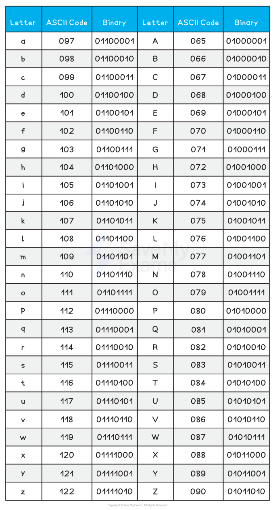
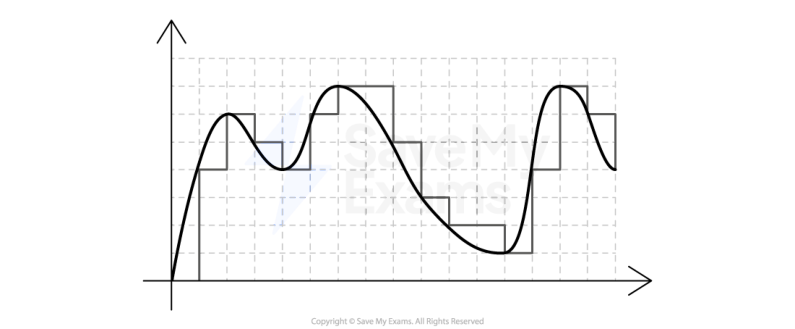
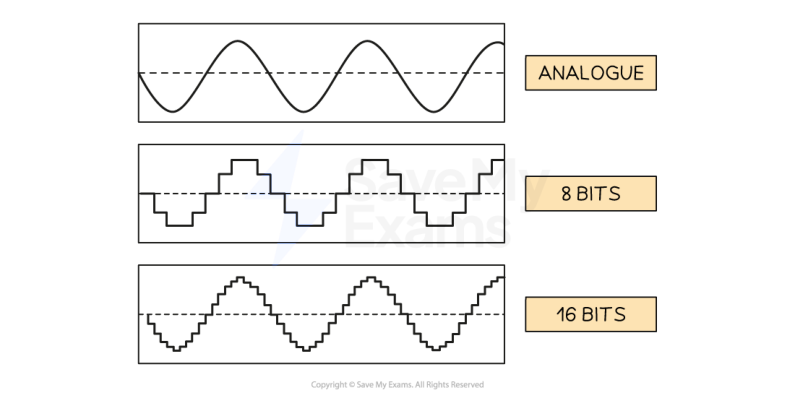
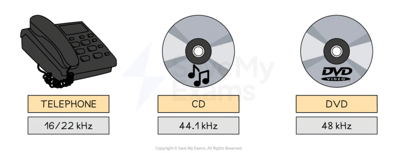
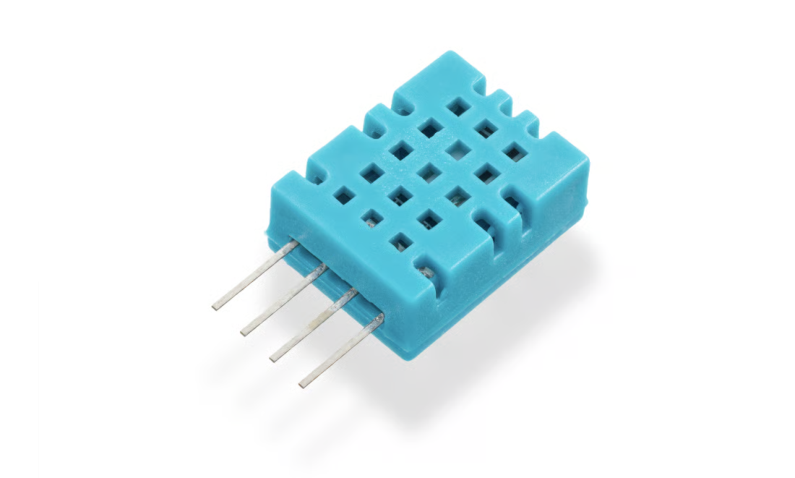
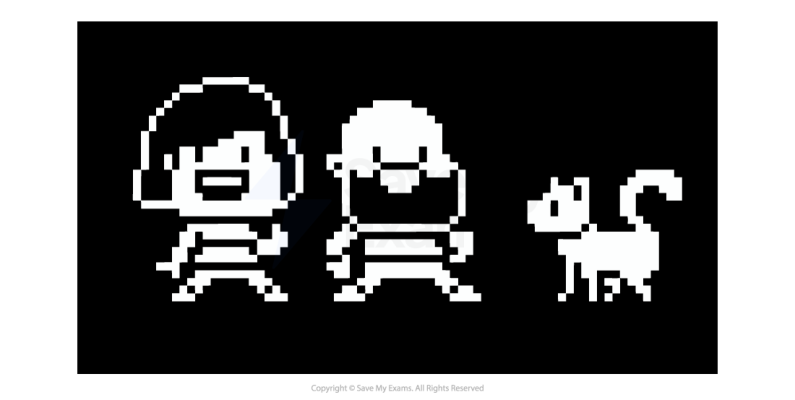
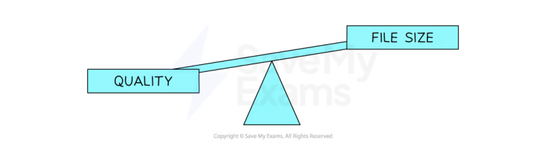

# CAIE Computer Science IGCSE — Chapter ?: Cambridge (CIE) IGCSE Computer Science

---

Your notes 

## Text, Sound & Images 

## Contents 

Character Sets Representing Sound Representing Images 

© 2026 Save My Exams, Ltd. 

Get more and ace your exams at savemyexams.com 

**1** 

Character Sets 

Your notes 

## Character Sets 

## What is a character set? 

- A character set is all the characters and symbols that can be represented by a computer system 

- Each character is given a unique binary code 

- Character sets are ordered logically, the code for ‘B’ is one more than the code for ‘A’ 

- A character set provides a standard for computers to communicate and send/receive information 

- Without a character set, one system might interpret 01000001 differently from another 

- The number of characters that can be represented is determined by the number of bits used by the character set 

Two common character sets are: 

- American Standard Code for Information Interchange (ASCII) 

- Universal Character Encoding (UNICODE) 

## ASCII 

## What is ASCII? 

- ASCII is a character set and was an accepted standard for information interchange 

- ASCII uses 7 bits, providing 27 unique codes (128) or a maximum of 128 characters it can represent 

© 2026 Save My Exams, Ltd. 

Get more and ace your exams at savemyexams.com 

**2** 

Your notes 

© 2026 Save My Exams, Ltd. 

Get more and ace your exams at savemyexams.com 

**3** 

- ASCII only represents basic characters needed for English, limiting its use for other languages 

## Extended ASCII 

- Extended ASCII uses 8 bits, providing 256 unique codes (28 = 256) or a maximum of 256 characters it can represent 

Extended ASCII provides essential characters such as mathematical operators and more recent symbols such as © 

## Limitations of ASCII & extended ASCII 

ASCII has a limited number of characters which means it can only represent the English alphabet, numbers and some special characters 

- A, B, C, ………, Z 

- a, b, c ,.............,z 

- 0, 1, 2,........, 9 

- !, @, #, ….. 

ASCII cannot represent characters from languages other than English 

- ASCII does not include modern symbols or emojis common in today's digital communication 

## UNICODE 

## What is UNICODE? 

UNICODE is a character set and was created as a solution to the limitations of ASCII 

- UNICODE uses a minimum of 16 bits, providing 216  unique codes (65,536) or a minimum of 65,536 characters it can represent 

UNICODE can represent characters from all the major languages around the world 

## Examiner Tips and Tricks 

Exam questions often ask you to compare ASCII & UNICODE, for example the number of bits, number of characters and what they store 

## ASCII vs UNICODE 

||ASCII|UNICODE|
|---|---|---|
|Number of bits|7−bits|16−bits|

© 2026 Save My Exams, Ltd. 

Get more and ace your exams at savemyexams.com 

**4** 

|Number of characters|128 characters|65,536 characters||Your notes|
|---|---|---|---|---|
|Uses|Used to represent characters in the English language.|Used to represent characters across the world.|||
|Benefts|It uses a lot less storage space than UNICODE.|It can represent more characters than ASCII. It can support all common characters across the world. It can represent special characters such as emoji's.|||
|Drawbacks|It can only represent 128 characters. It cannot store special characters such as emoji's.|It uses a lot more storage space than ASCII.|||

## Worked Example 

The computer stores text using the ASCII character set. 

Part of the ASCII character set is shown: 

|Character|ASCII Denary Code|
|---|---|
|E|69|
|F|70|
|G|71|
|H|72|

## (a) 

Identify the character that will be represented by the ASCII denary code 76 [1] 

## (b) 

Identify a second character set [1] 

## Answers 

(a) L (must be a capital) 

© 2026 Save My Exams, Ltd. 

Get more and ace your exams at savemyexams.com 

**5** 

(b) UNICODE 

Your notes 

© 2026 Save My Exams, Ltd. 

Get more and ace your exams at savemyexams.com 

**6** 

Representing Sound 

Your notes 

## How Sound is Sampled & Stored 

## How is sound sampled & stored? 

- Measurements of the original sound wave are captured and stored as binary on secondary storage 

- Sound waves begin as analogue and for a computer system to understand them they must be converted into a digital form 

This process is called Analogue to Digital conversion (A2D) 

- The process begins by measuring the amplitude of the analogue sound wave at a point in time, called samples 

- Each measurement (sample) generates a value which can be represented in binary and stored 

- Using the samples, a computer is able to create a digital version of the original analogue wave 

The digital wave is stored on secondary storage and can be played back at any time by reversing the process 

- In this example, the grey line represents the digital wave that has been created by taking samples of the original analogue wave 

- In order for the digital wave to look more like the analogue wave the sample rate and bit depth can be changed 

## Sample Rate & Sample Resolution 

## What is sample rate? 

Sample rate is the amount of samples taken per second of the analogue wave 

© 2026 Save My Exams, Ltd. 

Get more and ace your exams at savemyexams.com 

**7** 

- Samples are taken each second for the duration of the sound 

- The sample rate is measured in Hertz (Hz) 

Your notes 

In this example you can see that the higher the sample rate, the closer to the original sound wave the digital version looks 

- The sampling rate of a typical audio CD is 44.1kHz (44,100 Hertz or 44,100 samples per second) 

- Using the graphic above helps to answer the question, “Why does telephone hold music sound so bad?” 

## What is sample resolution? 

- Sample resolution is the number of bits stored per sample of sound 

- Sample resolution is closely related to the colour depth of a bitmap image, they measure the same thing in different contexts 

© 2026 Save My Exams, Ltd. 

Get more and ace your exams at savemyexams.com 

**8** 

## What effect do sample rate and sample resolution have? 

Your notes 

||Sample rate|Sample rate|Sample resolution|Sample resolution|
|---|---|---|---|---|
||High|Low|High|Low|
|Playback quality|⇑|⇓|⇑|⇓|
|File size|⇑|⇓|⇑|⇓|

© 2026 Save My Exams, Ltd. 

Get more and ace your exams at savemyexams.com 

**9** 

Your notes 

## Representing Images 

## Bitmap Images 

## What is a bitmap? 

- A bitmap image is made up of squares called pixels 

- A pixel is the smallest element of a bitmap image 

- Each pixel is stored as a binary code 

Binary codes are unique to the colour in each pixel 

A typical example of a bitmap image is a photograph 

The more colours and more detail in the image, the higher the quality of the image and the more binary that needs to be stored 

## Resolution & Colour Depth 

## Examiner Tips and Tricks 

Cambridge IGCSE 0478 expects you to define resolution and colour depth, explain how both affect file size, and use formulas like width × height × colour depth to calculate storage needs. This page keeps everything focused on exam-ready phrasing and examples. 

© 2026 Save My Exams, Ltd. 

Get more and ace your exams at savemyexams.com 

**10** 

## What is resolution? 

- Resolution is the total number of pixels that make up a bitmap image 

Your notes 

- It is calculated by multiplying the image's width and height in pixels 

- In general, higher resolution means more detail and better image quality 

- Display resolution is often described by the vertical pixel count, for example: 

   - Computer monitors: 1440p has 1440 pixels vertically (2560×1440), while 4K has 2160 pixels vertically (3840×2160) 

The "4K" name comes from its horizontal resolution of roughly 4,000 pixels 

- TVs: HD channels are 1080p (1080 pixels vertically), while UHD/4K channels are 2160p (2160 pixels vertically, or 3840×2160) 

YouTube: the quality selector lets you choose playback resolution from 144p (144 pixels vertically) up to 4K (2160p) 

## What is colour depth? 

- Colour depth is the number of bits stored per pixel in a bitmap image 

- The colour depth is dependent on the number of colours needed in the image 

- In general, the higher the colour depth the more detail in the image (higher quality) 

- In a black & white image the colour depth would be 1, meaning 1 bit is enough to create a unique binary code for each colour in the image (1=white, 0=black) 

- In an image with a colour depth of 2, you would have 00, 01, 10 & 11 available binary codes, so 4 colours 

© 2026 Save My Exams, Ltd. 

Get more and ace your exams at savemyexams.com 

**11** 

Your notes 

As colour depth increases, so does the amount of colours available in an image 

The amount of colours can be calculated as 2n (n = colour depth) 

|Colour Depth|Amount of Colours|
|---|---|
|1 bit|2 (B&W)|
|2 bit|4|
|4 bit|16|
|8 bit|256|
|24 bit|16,777,216 (True Colour)|

## What is the impact of resolution and colour depth? 

- As the resolution and/or colour depth increases, the bigger the size of the file becomes on secondary storage 

The higher the resolution, the more pixels are in the image, the more bits are stored 

- The higher the colour depth, the more bits per pixel are stored 

Striking a balance between quality and file size is always a consideration 

## Examiner Tips and Tricks 

In casual use, people say "higher resolution = better quality". But in the exam, focus on what it actually means: 

“Resolution is the number of pixels in an image” 

© 2026 Save My Exams, Ltd. 

Get more and ace your exams at savemyexams.com 

**12** 

Your notes 

Avoid vague terms like “better” and give technical impact: “more bits needed = larger file size.” 

## Worked Example 

1. Define the term Pixel [1] 

2. If an image has a colour depth of 2 bits, how many colours can the image represent? 

- [1] 

3. Describe the impact of changing an images resolution from 500×500 to 1000×1000 [2] 

## Answers 

1. The smallest element of a bitmap image (1 square) 

2. 4 

3. The image quality would be higher [1] the file size would be larger [1] 

© 2026 Save My Exams, Ltd. 

Get more and ace your exams at savemyexams.com 

**13** 

