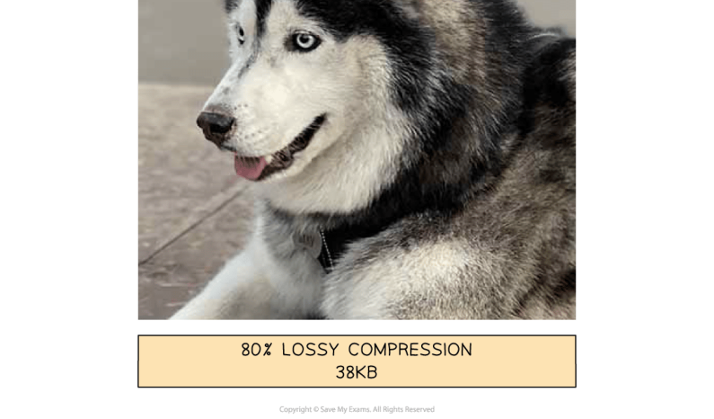
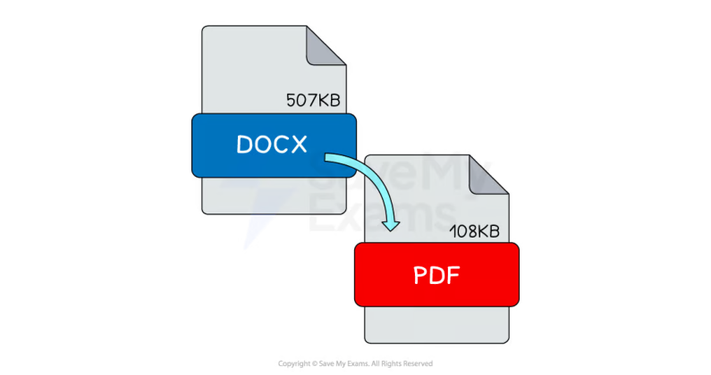

# CAIE Computer Science IGCSE — Chapter 1: Cambridge (CIE) IGCSE Computer Science

---

Your notes 

## Data Storage & Compression 

## Contents 

Units of Data Storage Calculating File Sizes Compression 

© 2026 Save My Exams, Ltd. 

Get more and ace your exams at savemyexams.com 

**1** 

Units of Data Storage 

Your notes 

## Units of Data Storage 

## What are units of data storage? 

- A unit of data is a term given to describe different amounts of binary digits stored on a digital device 

These are the units you need to know for IGCSE: 

|Unit|Symbol|Value|
|---|---|---|
|Bit|b|1 or 0|
|Nibble||4 b|
|Byte|B|8 b|
|Kibibyte|KiB|1,024 B (2 ) 10|
|Mebibyte|MiB|1,024 KiB (2 ) 20|
|Gibibyte|GiB|1.024 MiB (2 ) 30|
|Tebibyte|TiB|1,024 GiB (2 ) 40|
|Pebibyte|PiB|1,024 TiB (2 ) 50|
|Exbibyte|EiB|1,024 PiB (2 ) 60|

## Megabyte vs Mebibyte 

1 kibibyte (1KiB) = 1024 bytes (1024 B) - binary prefixes (to the power of 2) 

1 kilobyte (1KB) = 1000 bytes (1000 B) - decimal prefixes (to the power of 10) 

## Converting between units 

It is often a requirement of the exam to be able to convert between different units of data, for example bytes to mebibytes (larger) or kibibytes to bytes (smaller) 

- This process involves division, moving up in size of unit and multiplication, moving down in size of unit 

When dealing with all units bigger than a byte we use multiples of 1024 (210) 

© 2026 Save My Exams, Ltd. 

Get more and ace your exams at savemyexams.com 

**2** 

- For example, 2000 kibibytes in mebibytes would be 2000 / 1024 = 1.95 MiB and 2 tebibytes in gibibytes would be 2 * 1024 = 2048 GiB 

Your notes 

- When dealing with bits and bytes the same process is used with the value 8 as there are 8 bits in a byte 

- For example, 24 bits in bytes would be 24 / 8 = 3 B and 10 bytes in bits would be 10 * 8 = 80 b 

The same multiply or divide by 1024 rule applies when converting beyond TiB to PiB and EiB 

||Unit||
|---|---|---|
|Multiply by 8⇑|Bit|Divide by 8⇓|
||Byte||
|Multiply by 1024⇑|Kibibyte|Divide by 1024⇓|
||Mebibyte||
||Gibibyte||
||Tebibyte||
||Pebibyte||
||Exbibyte||
||||
|Worked Example Convert1 PiBtoGiB Answer 1 PiB = 1024 TiB 1 TiB = 1024 GiB So: 1 PiB = 1024 × 1024 GiB [1 mark] 1 PiB =1,048,576 GiB[1 mark]||[2]|

© 2026 Save My Exams, Ltd. 

Get more and ace your exams at savemyexams.com 

**3** 

Your notes 

## Calculating File Sizes 

## Calculating File Sizes 

## How do you calculate the size of a bitmap image? 

Calculating the size of a bitmap image can be carried out with either of the following formulas: 

Resolution x colour depth 

Image width x image height x colour depth 

## Example 

|||Image Files|Image Files|
|---|---|---|---|
|||(Resolution)x(Colour Depth)||
||||Resolution = width x height 24 bits = 3 bytes 6,000,000 bits 750,000 bytes 732 KiB 750,000 bytes 732 KiB|
||Size of bitmap image =|||
||Resolution|250,000|Resolution = width x height|
||Colour Depth|24 bits (3 bytes)|24 bits = 3 bytes|
||250,000 x 24|= (bit to bytes) /8 (bytes to KiB) /1024|6,000,000 bits 750,000 bytes 732 KiB|
||250000 x 3|= (bytes to KiB) /1024|750,000 bytes 732 KiB|
|||||

||OR|OR|OR|
|---|---|---|---|
||Image Files|||
||(Image width)x(Image height)x(Colour Depth)|||
|||||
||Size of bitmap image =|||
||Image width|500||
|||||

© 2026 Save My Exams, Ltd. 

Get more and ace your exams at savemyexams.com 

**4** 

||Image height|500||
|---|---|---|---|
||Colour Depth|24 bits|24 bits = 3 bytes|
||(500 x 500 x 24)|= (bit to bytes) /8 (bytes to KiB) /1024|6,000,000 bits 750,000 bytes 732 KiB|
||(500 x 500 x 3)|= (bytes to KiB) /1024|750,000 bytes 732 KiB|
|||||

## How do you calculate the size of a sound file? 

Calculating the size of a sound file is carried out with the following formula: 

Sample rate x duration x sample resolution 

## Example 

|||Sound Files|Sound Files|
|---|---|---|---|
||(Sample|Rate)x(Duration in seconds)x(Sample Resolution)||
||||Samples per second Seconds Number of bits stored per sample 144,000 bits 18,000 bytes 18 KiB|
||Size of sound fle =|||
||Sample rate|100|Samples per second|
||Duration|60|Seconds|
||Sample resolution|24|Number of bits stored per sample|
||100 x 60 x 24|= (bit to bytes) /8 (bytes to KiB) /1024|144,000 bits 18,000 bytes 18 KiB|
|||||

© 2026 Save My Exams, Ltd. 

Get more and ace your exams at savemyexams.com **5** 

Your notes 

## Compression 

## The Need For Compression 

## What is compression? 

- Compression is reducing the size of a file so that it takes up less space on secondary storage 

The impact of compression is: 

- Less storage space required 

- Less bandwidth required 

- Shorter transmission time 

Compression can be achieved using two methods, lossy and lossless 

## Lossy Compression 

## What is lossy compression? 

Lossy compression is when data is lost in order to reduce the size on secondary storage 

Lossy compression is irreversible 

Lossy can greatly reduce the size of a file but at the expense of losing quality 

Lossy is only suitable for data where reducing quality is acceptable, for example images, video and sound 

In photographs, lossy compression will try to group similar colours together, reducing the amount of colours in the image without compromising the overall quality of the image 

© 2026 Save My Exams, Ltd. 

Get more and ace your exams at savemyexams.com 

**6** 

Your notes 

© 2026 Save My Exams, Ltd. 

Get more and ace your exams at savemyexams.com 

**7** 

- In the images above, lossy compression is applied to a photograph and dramatically reduces the file size 

- Data has been removed and the overall quality has been reduced, however it is acceptable as it is difficult to visually see a difference 

- Lossy compressed photographs take up less storage space which means you can store more and they are quicker to share across a network 

## Lossless Compression 

## What is lossless compression? 

- Lossless compression is when data is encoded in order to reduce the size on secondary storage 

- Lossless compression is reversible, the file can be returned to its original state 

- Lossless can reduce the size of a file but not as dramatically as lossy 

- Lossless can be used on all data but is more suitable for data where a loss in quality is unacceptable, for example documents 

- In a document, lossless compression algorithms such as run length encoding (RLE) can be used to analyse the contents looking for patterns and repetition. 

## What is run length encoding? 

Run length encoding (RLE) is a form of lossless data compression that condenses identical elements into a single value with a count 

For a text file, "AAAABBBCCDAA" is compressed to "4A3B2C1D2A" 

- The string has four 'A's, followed by three 'B's, two 'C's, one 'D', and two 'A's 

- RLE is used in bitmap images to compress sequences of the same colour 

© 2026 Save My Exams, Ltd. 

Get more and ace your exams at savemyexams.com 

**8** 

For example, a line in an image with 5 red pixels followed by 3 blue pixels could be represented as "5R3B" 

## Lossless file formats 

Your notes 

- In the image above, lossless compression is automatically applied to document formats such as DOCX and PDF with a different rate of success 

- When you open a lossless compressed document the decompression process reverses the algorithms and returns the data back to its original state 

- Lossless compressed documents take up less storage space which means you can store more and they are quicker to share across a network 

## Worked Example 

An email is sent containing a sound file. 

Lossy compression is used to compress the sound file. 

- Explain two reasons why using lossy compression is beneficial. [4] 

How to answer this question 

What are the differences between lossy and lossless? Can you state two differences? [2 marks] Can you say why each point is a benefit? [2 marks] 

- Answer 

Lossy will decrease the file size [1] ...so it can sent via email quicker [1] Lossy means data is lost [1] 

- ...the difference is unlikely to be noticed by humans [1] 

© 2026 Save My Exams, Ltd. 

Get more and ace your exams at savemyexams.com 

**9** 

