# CAIE Computer Science IGCSE — Chapter ?: Cambridge (CIE) IGCSE Computer Science

---

Your notes 

## Boolean Logic 

## Contents 

Logic Gates Logic Circuits Truth Tables Logic Expressions 

© 2026 Save My Exams, Ltd. 

Get more and ace your exams at savemyexams.com 

**1** 

Logic Gates 

Your notes 

## Logic gates 

## What is Boolean logic? 

## Examiner Tips and Tricks 

Cambridge IGCSE 0478 expects you to identify logic gates, write Boolean expressions, and interpret simple logic circuits. This page covers exactly the gates and formats examiners use—nothing more, nothing less. 

Boolean logic is used in computer science and electronics to make logical decisions 

Boolean operators are either TRUE or FALSE, often represented as 1 or 0 

Inputs and outputs are given letters to represent them 

To define Boolean logic we use special symbols to make writing expressions much easier 

## What are logic gates? 

Logic gates are a visual way of representing a Boolean expression 

The logic gates covered in this course are: 

AND OR NOT XOR 

NAND NOR 

## AND 

Expression Circuit symbol Explanation operator 

© 2026 Save My Exams, Ltd. 

Get more and ace your exams at savemyexams.com 

**2** 

|(AANDB)|||Returns TRUE only ifbothinputs are TRUE TRUEANDTRUE=TRUE Otherwise = FALSE|Returns TRUE only ifbothinputs are TRUE TRUEANDTRUE=TRUE Otherwise = FALSE|
|---|---|---|---|---|
|OR|||||
|Expression operator||Circuit symbol||Explanation|
|(AORB)||||Returns TRUE ifeitherinput is TRUE TRUEORFALSE=TRUE FALSEORFALSE=FALSE|

## NOT 

|NOT|||
|---|---|---|
|Expression operator|Circuit symbol|Explanation|
|(NOTA)||Reversesthe input value NOTTRUE=FALSE NOTFALSE=TRUE|

## XOR (exclusive OR) 

|Expression operator|Circuit symbol|Explanation|
|---|---|---|
|(AXORB)||Returns TRUE ifeitherinput is TRUE but NOTboth TRUEORFALSE=TRUE FALSEORFALSE=FALSE TRUEORTRUE=FALSE|

© 2026 Save My Exams, Ltd. 

Get more and ace your exams at savemyexams.com 

**3** 

## Examiner Tips and Tricks 

The most common exam mistake is confusing OR and XOR . Remember: XOR is only true if exactly one input is true. It’s false if both are true or both are false. 

Your notes 

## NAND (not and) 

|Expression operator|Circuit symbol|Explanation|Explanation|
|---|---|---|---|
|(ANANDB)||Returns TRUE ifeither or bothinputs are FALSE TRUEORFALSE=TRUE FALSEORFALSE=TRUE TRUEORTRUE=FALSE||
|NOR (not OR)||||
|Expression operator|Circuit symbol||Explanation|
|(ANORB)|||Returns TRUE ifboth inputs are FALSE TRUEORFALSE=FALSE FALSEORFALSE=TRUE TRUEORTRUE=FALSE|

## Examiner Tips and Tricks 

“Draw the logic circuit for the expression (A AND B) OR (NOT C)” Tip: Draw from left to right, and label all inputs clearly. Mislabelled inputs = lost marks 

© 2026 Save My Exams, Ltd. 

Get more and ace your exams at savemyexams.com 

**4** 

Logic Circuits 

Your notes 

## Logic Circuits 

## What is a logic circuit? 

- A logic circuit performs logical operations on binary information 

- Logic gates are core components of logic circuits 

- Based on the arrangement of logic gates and the input signals, the circuit performs a specific function 

- A logic diagram is a visual representation of a combinations of logic gates within a logic circuit 

- Brackets are used to clarify the order of operations 

An example logic diagram for the Boolean expression Q = NOT(A OR B) would be: 

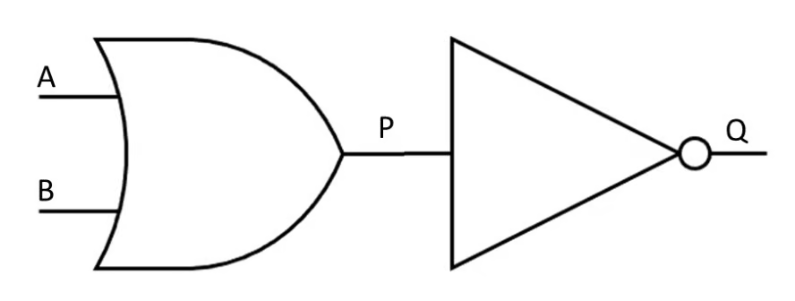

- In the logic diagram above, the inputs are represented by A and B 

- P is the output of the OR gate on the left and becomes the input of the NOT gate 

- Q is the final output of the logic circuit 

## Examiner Tips and Tricks 

You may be asked to draw a logic circuit from a logic statement or a Boolean expression OR write the logical expression that is expressed in the logic diagram using Boolean expression operators 

Logic circuits will be limited to a maximum of three inputs and one output 

## Example of combining logic gates 

© 2026 Save My Exams, Ltd. 

Get more and ace your exams at savemyexams.com 

**5** 

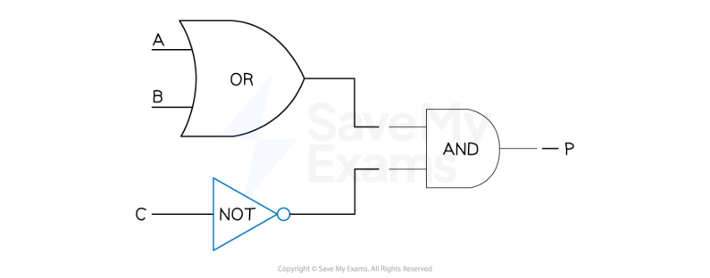

Your notes 

P = (A OR B) AND NOT C 

## Worked Example 

A sprinkler system switches on if it is not daytime (input A) and the temperature is greater than 40 (input B) 

Draw a logic circuit to represent the problem statement above 

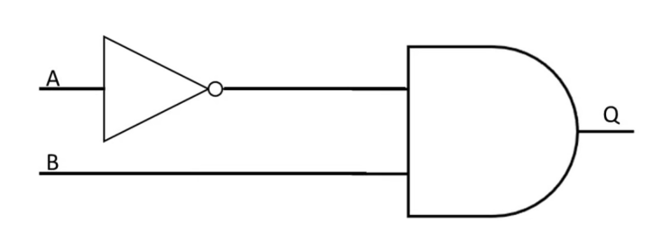

© 2026 Save My Exams, Ltd. 

Get more and ace your exams at savemyexams.com 

**6** 

Your notes 

## Truth Tables 

## Truth Tables 

## What is a truth table? 

- A truth table is a tool used in logic and computer science to visualise the results of Boolean expressions 

- They represent all possible inputs and the associated outputs for a given Boolean expression 

## AND 

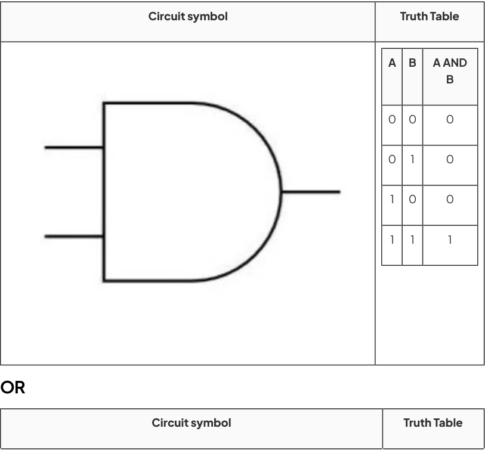

© 2026 Save My Exams, Ltd. 

Get more and ace your exams at savemyexams.com 

**7** 

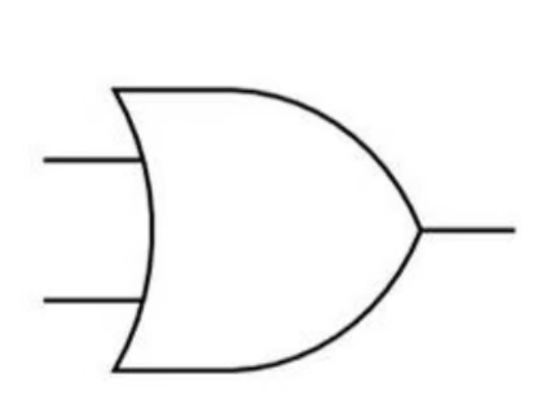

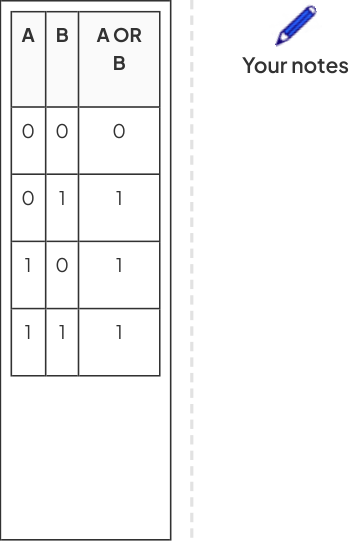

## NOT 

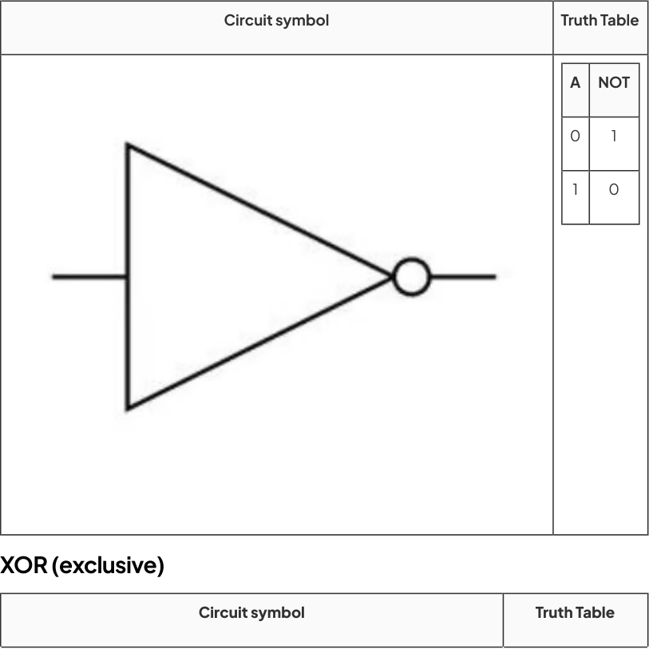

© 2026 Save My Exams, Ltd. 

Get more and ace your exams at savemyexams.com 

**8** 

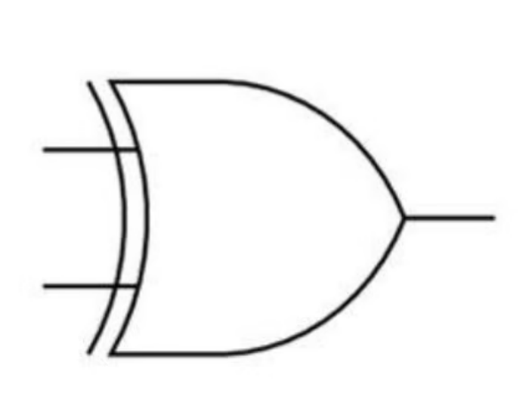

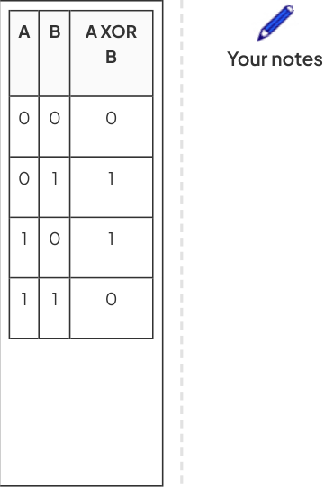

## NAND (not and) 

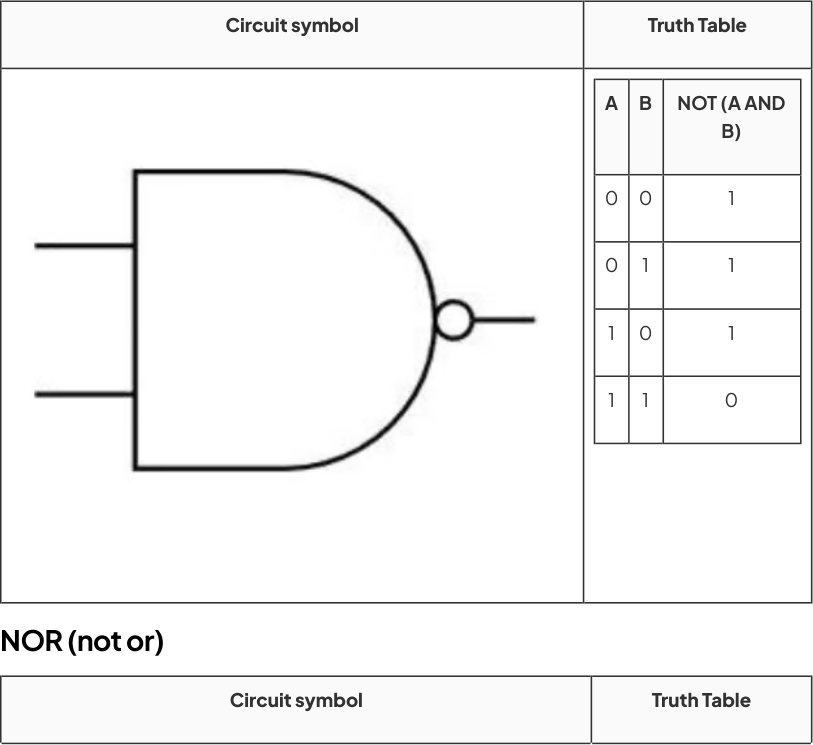

© 2026 Save My Exams, Ltd. Get more and ace your exams at savemyexams.com 

**9** 

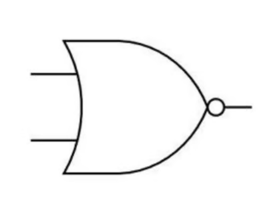

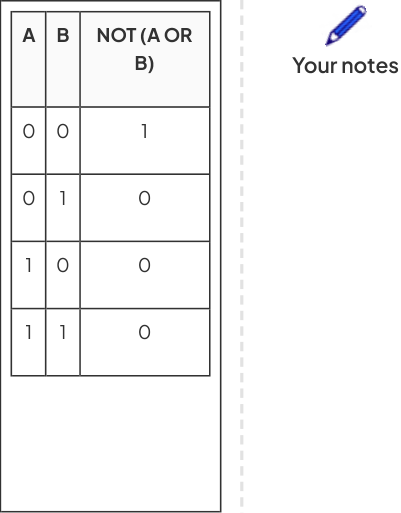

## Truth Tables for Logic Circuits 

## How do you create truth tables for logic circuits? 

To create a truth table for the expression P = (A AND B) AND NOT C 

Calculate the numbers of rows needed (2number of inputs) 

- In this example there are 3 inputs (A, B, C) so a total of 8 rows are needed (23) 

To not miss any combination of inputs, start with 000 and count up in 3−bit binary (0−7) 

|A|B|C|
|---|---|---|
|0|0|0|
|0|0|1|
|0|1|0|
|0|1|1|
|1|0|0|
|1|0|1|
|1|1|0|

© 2026 Save My Exams, Ltd. 

Get more and ace your exams at savemyexams.com 

**10** 

Your notes 

1 1 1 

Add a new column to show the results of the brackets first (A AND B) 

|A|B|C|A AND B|
|---|---|---|---|
|0|0|0|0|
|0|0|1|0|
|0|1|0|0|
|0|1|1|0|
|1|0|0|0|
|1|0|1|0|
|1|1|0|1|
|1|1|1|1|

Add a new column to show the results of NOT C 

|A|B|C|A AND B|NOT C|
|---|---|---|---|---|
|0|0|0|0|1|
|0|0|1|0|0|
|0|1|0|0|1|
|0|1|1|0|0|
|1|0|0|0|1|
|1|0|1|0|0|
|1|1|0|1|1|
|1|1|1|1|0|

© 2026 Save My Exams, Ltd. 

Get more and ace your exams at savemyexams.com 

**11** 

The last column shows the result of the Boolean expression (P) by comparing (A AND B) AND NOT C // (A.B) .C 

Your notes 

|A|B|C|A AND B|NOT C|P|
|---|---|---|---|---|---|
|0|0|0|0|1|0|
|0|0|1|0|0|0|
|0|1|0|0|1|0|
|0|1|1|0|0|0|
|1|0|0|0|1|0|
|1|0|1|0|0|0|
|1|1|0|1|1|1|
|1|1|1|1|0|0|

## Examiner Tips and Tricks 

It is possible to create a truth table when combining expressions that show only the inputs and the final outputs. 

The inclusion of the extra columns supports the process but can be skipped if you feel able to do those in your head as you go. 

## How do you create logic circuits from a truth table? 

To create a logic circuit from a truth table you need to: 

Find the rows where the output = 1 

Build a logic branch for each of the rows 

Combine the branches 

Determine the gates needed 

Construct a logic expression 

Create the logic circuit 

## Example 

© 2026 Save My Exams, Ltd. 

Get more and ace your exams at savemyexams.com 

**12** 

|A|B|C|X||Your notes|
|---|---|---|---|---|---|
|0|0|0|0|||
|0|0|1|0|||
|0|1|0|0|||
|0|1|1|0|||
|1|0|0|1|||
|1|0|1|0|||
|1|1|0|0|||
|1|1|1|1|||

Look at the truth table and find the rows where X = 1 

This happens when: 

A = 1, B = 0, C = 0 

A = 1, B = 1, C = 1 

Build a logic branch: 

A = 1, B = 0, C = 0 

Use a NOT gate on B Use a NOT gate on C 

AND A, NOT B, and NOT C together This gives output = 1 for that row 

A = 1, B = 1, C = 1 

Just AND A, B, and C together 

Combine the branches 

Use an OR gate to combine the two outputs 

This way, X = 1 if either input combination happens 

Determine the gates needed: 

NOT gates: 

NOT B 

© 2026 Save My Exams, Ltd. 

Get more and ace your exams at savemyexams.com 

**13** 

Your notes 

NOT C 

## AND gates: 

A AND NOT B → first AND 

that result AND NOT C → second AND 

A AND B → third AND 

that result AND C → fourth AND 

## OR gate: 

Combines the outputs of the second and fourth AND gates Construct the logic expression 

Final logic: 

(A AND NOT B AND NOT C) OR (A AND B AND C) 

Create the logic circuit 

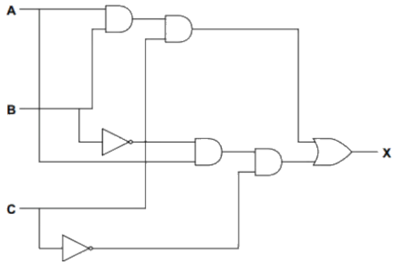

© 2026 Save My Exams, Ltd. 

Get more and ace your exams at savemyexams.com 

**14** 

Logic Expressions 

Your notes 

## Logic Expressions 

A logic expression is a way of expressing a logic gate or logic circuit as an equation 

The output appears on the left of the equals sign with the inputs and logic gates on the right 

|Gate|Symbol||Truth|Truth|Table|Table|Logic Expression|
|---|---|---|---|---|---|---|---|
|NOT|||A||Z||Z = NOT A|
||||0||1|||
||||1||0|||
|||||||||
|AND|||A|B||Z|Z = A AND B|
||||0|0||0||
||||0|1||0||
||||1|0||0||
||||1|1||1||

© 2026 Save My Exams, Ltd. 

Get more and ace your exams at savemyexams.com 

**15** 

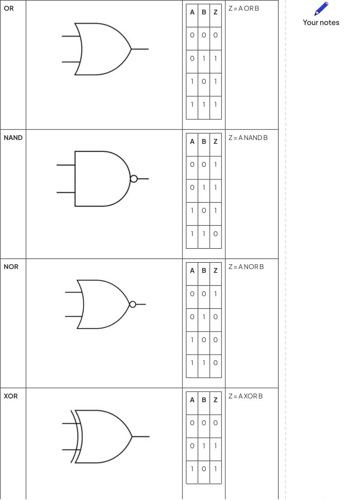

© 2026 Save My Exams, Ltd. 

Get more and ace your exams at savemyexams.com **16** 

Logic circuits containing multiple gates can also be expressed as logic expressions/statements 

An example logic circuit containing two inputs 

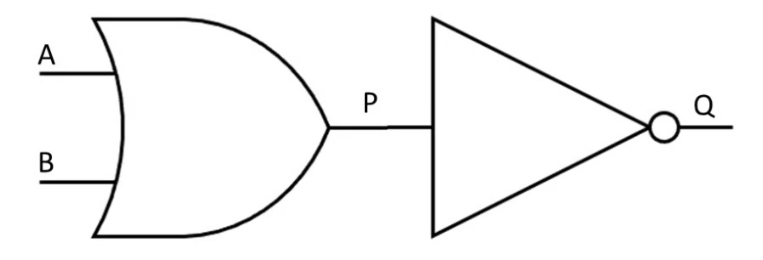

The logic circuit above can be expressed as the logic expression Q= NOT(A OR B) 

An example logic circuit containing two inputs 

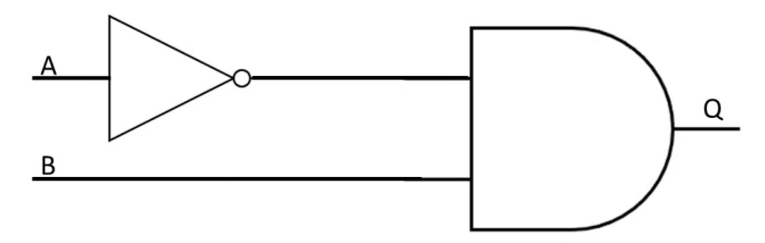

The logic circuit above can be expressed as the logic expression Q= (NOT A) AND B 

An example logic circuit containing three inputs 

The logic circuit above can be expressed as the logic expression P = ((NOT A) OR B) NAND C 

An example logic circuit containing three inputs 

© 2026 Save My Exams, Ltd. 

Get more and ace your exams at savemyexams.com 

**17** 

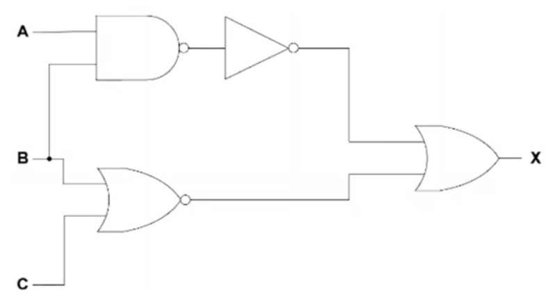

Your notes 

This logic circuit above can be expressed as X = NOT (A NAND B) OR (B NOR C) 

## Examiner Tips and Tricks 

You may be required to write a logic expression/statement from a truth table or a logic circuit. You may also have to do the opposite - draw a logic circuit and complete a truth table for a logic expression 

## Worked Example 

Consider the logic statement: X = (((A AND B) OR (C AND NOT B)) XOR NOT C) 

- a. Draw a logic circuit to represent the given logic statement. [6] 

Answer 

© 2026 Save My Exams, Ltd. 

Get more and ace your exams at savemyexams.com 

**18** 

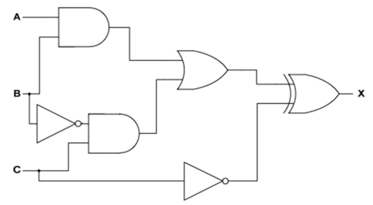

Your notes 

© 2026 Save My Exams, Ltd. 

Get more and ace your exams at savemyexams.com 

**19** 

