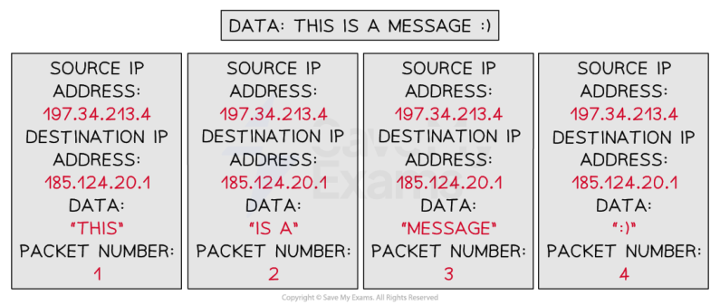
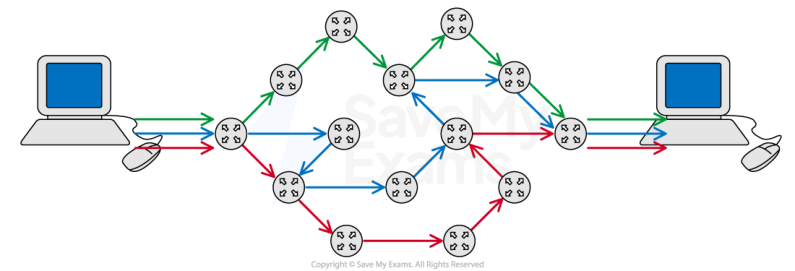
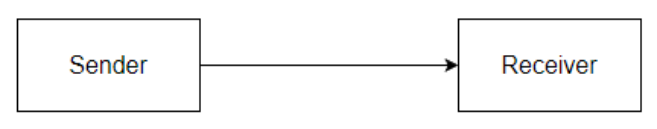
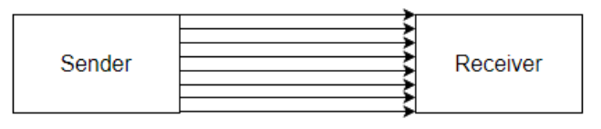
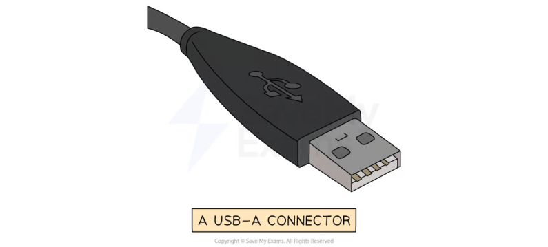
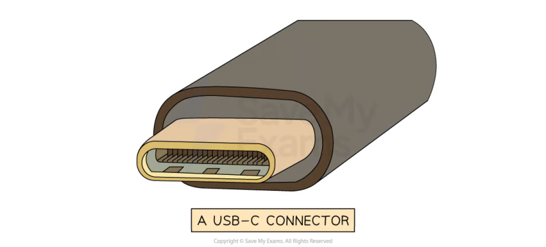
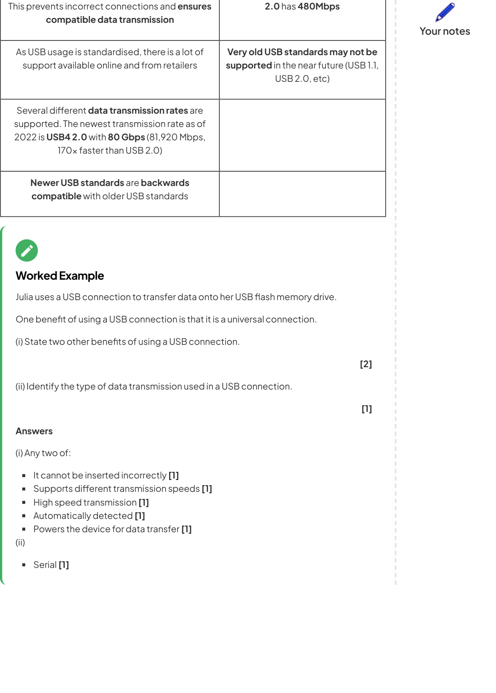

# CAIE Computer Science IGCSE — Chapter ?: Cambridge (CIE) IGCSE Computer Science

---

Your notes 

## Types & Methods of Data Transmission 

## Contents 

Data Packets Packet Switching Data Transmission Universal Serial Bus (USB) 

© 2026 Save My Exams, Ltd. 

Get more and ace your exams at savemyexams.com 

**1** 

Data Packets 

Your notes 

## Data Packets 

## What are packets? 

- Packets are small 'chunks' of data that make up a larger piece of data that has been broken down by the TCP protocol so that it can be transmitted over the internet 

- TCP stands for Transmission Control Protocol and is used for organising data transmission over networks 

- Small 'chunks' of data are easier and quicker to route over the internet than big 'chunks' of data 

Routing involves finding the most optimal path over a network 

- Data can include anything from text, images, audio, video, animations, etc, or any combination of these 

## What do packets contain? 

A packet consists of: 

|Header|Payload|Trailer|
|---|---|---|
|Source IP address|Actual data being transported|Additional security information (less common)|
|Destination IP address||End of packet notifcation|
|Packet number (1 of 5 etc.)|||

- To transmit the message “This is a message :)”over the internet, TCP might break the message down into 4 packets 

© 2026 Save My Exams, Ltd. 

Get more and ace your exams at savemyexams.com 

**2** 

Your notes 

Each packet contains a: 

   - source IP address 

   - destination IP address 

   - payload (the data) 

   - a packet number 

- Error checks make sure that when a packet is received there is minimal or no corruption of the data 

- Corruption is where packet data is changed or lost in some way, or data is gained that originally was not in the packet 

- Read error detection methods for more detail on how data packets can be checked to ensure corruption is avoided/minimised 

© 2026 Save My Exams, Ltd. 

Get more and ace your exams at savemyexams.com 

**3** 

Packet Switching 

Your notes 

## Packet Switching 

## What is packet switching? 

Packet switching is a method of sending and receiving data (packets) across a network 

Packet switching can be broken down into five stages: 

|Stage|Overview|Detail|
|---|---|---|
|1|Data is broken down into packets|Learn more by reading ourdata packetsrevision note|
|2|Packets are assigned a header||
|3|Each packet makes its way to the destination|Like normal car trafc, data trafc builds up on the internet Routers can see this and decide to send a packet down a diferent route that avoids trafc|
|4|Routers control the routes taken for each packet|Routers know which nearby router is closer to the destination device|
|5|Packets arrive and are reordered correctly|If a packet does not reach its destination the receiver can send a resend request to the sender to resend the packet|

## What are the advantages of packet switching? 

© 2026 Save My Exams, Ltd. 

Get more and ace your exams at savemyexams.com **4** 

- Interference and corruption are minimal as individual packets can be resent if they are lost or damaged 

Your notes 

- The whole file doesn’t need to be resent if a corruption occurs, this saves time and internet bandwidth 

- Packet switching is quicker than sending a large packet as each packet finds the quickest way around the network 

It's harder to hack an individual's data as each packet contains minimal data, and travels through the network separately 

## Worked Example 

A local market shop wishes to arrange a delivery of goods from a supplier. Anna, the shop owner, decides to send an email to request the delivery of the goods at a certain date and time. 

Describe how packet switching is used to send this email and how it can be protected from corruption. 

[8] 

## Answer 

- The business email is first broken down into packets which are given a source address (where it's come from) and a destination address (where it's going to) [1] Each packet receives a packet number so that the email can be reassembled when it reaches its destination  [1] 

- Each packet also receives an error check such as a parity bit. A parity bit checks whether any bits have been flipped due to corruption  [1] 

- Each packet is sent over the internet via routers. Routers contain routing tables that determine the next closest router to the destination  [1] 

- Packets may take different routes depending on internet traffic and arrive at their destination in any order  [1] 

- Packets are checked for errors using the error checks and missing packets can be requested to be resent [1] 

- Once all packets have been received then they can be put together in order using the packet numbers [1] 

Once assembled the original email can be read by the other business [1] 

## Examiner Tips and Tricks 

For high marks make sure your answer is coherent, that is it follows logically from one point to the next. 

Some marks depend on previous points you have made. 

© 2026 Save My Exams, Ltd. 

Get more and ace your exams at savemyexams.com 

**5** 

Explaining parity bits without mentioning error checking first may not gain you additional marks 

Your notes 

© 2026 Save My Exams, Ltd. 

Get more and ace your exams at savemyexams.com 

**6** 

Data Transmission 

Your notes 

## What is data transmission? 

- Data transmission is the process of transferring data from one device to another using a wired or wireless connection 

- Wired data transmission can be completed in two ways: 

Serial 

Parallel 

## Serial & Parallel Transmission 

## What is serial & parallel transmission? 

- Serial and parallel are methods of transmitting data (bits) from a sender to a receiver 

- Each method determines how many bits can be transmitted at once 

## Serial transmission 

- A stream of bits is sent in sequence, one after the other, along a single wire 

- USB is an example of a wired serial connection 

## Parallel transmission 

- Multiple bits are sent simultaneously, with each bit travelling on its own separate wire 

- Parallel transmission is usually synchronous, using a clock signal to keep data aligned 

- However, bits can arrive at slightly different times due to skew (timing differences between wires) 

- A traditional printer cable is an example of a wired parallel connection 

© 2026 Save My Exams, Ltd. 

Get more and ace your exams at savemyexams.com 

**7** 

## Advantages and disadvantages of serial & parallel transmission 

Your notes 

|Transmission|Advantages|Disadvantages|
|---|---|---|
|Serial|Reliable over longer distance Cheaper to setup Low interference|Slow transmission speed|
|Parallel|Very fast transmission speed|Only used on short distances Prone to high interference|

## Simplex, Half-Duplex & Full-Duplex Transmission 

## What is simplex, half-duplex & full-duplex transmission? 

- Simplex, half-duplex and full-duplex describe the direction in which data can be transmitted between a sender and receiver 

## Simplex transmission 

Data travels in only one direction 

Sending data from a computer to a monitor is an example of simplex transmission 

## Half-duplex transmission 

Data can travel in both directions, but only one direction at a time 

- A printer cable which waits for the data to be received before sending back a ‘low ink’ message is an example of half-duplex transmission 

## Full-duplex transmission 

Data can travel in both directions at the same time 

- Network cables can send and receive data at the same time and are examples of fullduplex data transmission 

Full-duplex is used in local and wide area networks 

## Advantages and disadvantages of simplex, halfduplex & full-duplex transmission 

© 2026 Save My Exams, Ltd. 

Get more and ace your exams at savemyexams.com 

**8** 

|Transmission|Advantages|Disadvantages||Your notes|
|---|---|---|---|---|
|Simplex|Simple and low-cost for one-way communication|Cannot support two-way communication|||
|Half-duplex|Cheaper than full-duplex for two- way communication|Slower due to one- direction-at-a-time|||
|Full-duplex|Fast, supports simultaneous two- way data transfer|More expensive to implement|||

Wires can be combinations of serial, parallel, simplex, half-duplex and full-duplex 

||Simplex|Half-duplex|Full-duplex|
|---|---|---|---|
|Serial|Serial-Simplex|Serial-Half-duplex|Serial-Full-duplex|
|Parallel|Parallel-Simplex|Parallel-Half-duplex|Parallel-Full-duplex|

## Serial-Simplex 

Data is transmitted one bit at a time in one direction only on a single wire 

## Serial-Half-duplex 

Data is transmitted one bit at a time, and can flow in both directions, but not at the same time 

This typically uses a single shared wire. 

## Serial-Full-duplex 

Data is transmitted one bit at a time in both directions simultaneously, but this requires two wires, one for each direction. 

## Parallel-Simplex 

Multiple bits are transmitted simultaneously in one direction only, using multiple wires 

## Parallel-Half-duplex 

Multiple wires send multiple bits of data in both directions, but only one direction at a time 

Parallel-Full-duplex 

Multiple wires send multiple bits of data in both directions simultaneously 

© 2026 Save My Exams, Ltd. Get more and ace your exams at savemyexams.com 

**9** 

## Worked Example 

A company has a website that is stored on a web server 

Your notes 

The company uses parallel half-duplex data transmission to transmit the data for the new videos to the web server. 

Explain why parallel half-duplex data transmission is the most appropriate method. 

[6] 

## Answer 

Parallel would allow for the fastest transmission [1] as large amounts of data [1] 

can be uploaded and downloaded [1] but this does not have to be at the same time [1] Data is not required to travel a long distance [1] Therefore, skewing is not a problem [1] 

## Examiner Tips and Tricks 

Any four of these points qualifies as a full answer, however make sure your answer is cohesive. 

Saying “Parallel would allow for the fastest transmission but this does not have to be at the same time” would qualify as one mark as only the first part makes sense and follows logically 

© 2026 Save My Exams, Ltd. 

Get more and ace your exams at savemyexams.com 

**10** 

Universal Serial Bus (USB) 

Your notes 

## Universal Serial Bus (USB) 

## What is USB? 

- The Universal Serial Bus (USB) is a widely used standard for transmitting data between devices 

- It is a serial communication method, and it operates asynchronously 

- Many devices use USB such as: 

Keyboards 

Mice 

Video cameras 

   - Printers 

   - Portable media players 

   - Mobile phone 

   - Disk drives 

   - Network adapters 

- Different USB connector types exist for different devices 

- The letters refer to the physical shape and design of the USB connector: 

   - USB-A - Commonly used for flash drives, mice, keyboards, external HDD 

   - USB-B - Found in printers, scanners, and older external storage devices 

   - USB-C - Latest standard, known for it's small size, transfer speeds, and it's ability to carry power 

- The term USB can also be followed by numbers (USB 2.0, 3.0, 4 etc.) 

- The numbers refer to the generation of USB technology, which determines the speed and performance: 

   - USB 1.1 - 12 Mbps (very slow) 

   - USB 2.0 - 480 Mbps (very common but slower compared to modern versions) 

   - USB 3.0/3.1/3.2 - 5 Gbps to 20 Gbps (much faster, used for external HDDs and gaming devices) 

   - USB4/ USB4 2.0 - Up to 80 Gbps (the latest and fastest, used for high speed data transfer) 

- When a device is connected to a USB port the computer: 

© 2026 Save My Exams, Ltd. 

Get more and ace your exams at savemyexams.com 

**11** 

Automatically detects that the device has been connected 

Looks for the correct driver: 

Your notes 

If the driver is already installed, the appropriate device driver is loaded so that the device can communicate with the computer 

If the device is new, the computer will look for a compatible device driver 

If one cannot be found, the user must download and install an appropriate driver manually 

## Advantages and disadvantages of USB 

|Advantages|Disadvantages|
|---|---|
|Devices areautomatically detectedanddrivers are automatically loadedfor communication|Themaximumcable length isroughly 5 metresmeaning it cannot be used over long distances,limiting its use|
|Cable connectors ft in only one way.|Older versions of USB havelimited transmission ratesfor exampleUSB|

© 2026 Save My Exams, Ltd. 

Get more and ace your exams at savemyexams.com 

**12** 

© 2026 Save My Exams, Ltd. 

Get more and ace your exams at savemyexams.com 

**13** 

