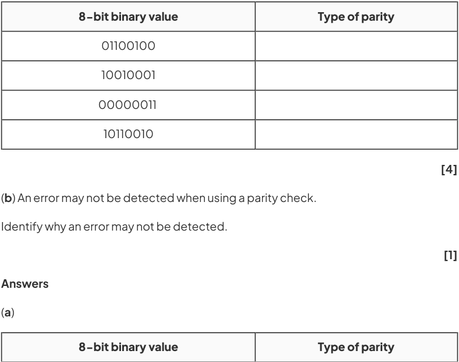

# CAIE Computer Science IGCSE — Chapter ?: Cambridge (CIE) IGCSE Computer Science

---

Your notes 

## Methods of Error Detection 

## Contents 

Error Checking Error Detection Methods Check Digits Automatic Repeat Query (ARQ) 

© 2026 Save My Exams, Ltd. 

Get more and ace your exams at savemyexams.com 

**1** 

Error Checking 

Your notes 

## Why Errors Occur 

## Why do errors occur? 

- Errors can occur using wired or wireless technology due to interference 

- Examples of interference include wire degradation or electrical fields changing the signal 

Results of interference include: 

Data loss - data is lost in transmission 

Data gain - additional data is received 

Data change - some bits have been changed or flipped 

- Wireless technology uses radio signals or other electromagnetic signals to transmit data 

   - These signals can be blocked by physical barriers such as buildings, walls, cars or other objects 

   - Interference can be caused by bad weather such as rain or clouds, or by other wireless signals or electromagnetic radiation 

- Wired technology carries more chance of causing an error as physical components can be damaged, degrade or receive interference from outside signals 

   - Data loss can also occur from interruptions to data transmission such as a blocked signal or if the transmission is intermittent 

## Why check for errors? 

Computers expect data in certain formats 

- A format is a way of arranging the data so that it can be easily understood by people and by computers 

People agree to certain formats so that systems work more efficiently and there is little chance of misunderstanding each other 

- An example of a format is date and time 

- Date and time can have multiple formats such as: 

13/04/14 (DD/MM/YY) 

12/31/2020 (MM/DD/YYYY) 

Jul-04−16 (MMM/DD/YY) 

- If data is not as expected, things can go wrong 

© 2026 Save My Exams, Ltd. 

Get more and ace your exams at savemyexams.com 

**2** 

For example, if a receiver expected to receive a date in format DD/MM/YY as 03/04/17 but received 04/03/17, did the sender mean 3rd April 2017 or 4th March 2017? 

Your notes 

An error or corruption occurs when data received is not as expected and therefore is difficult or impossible to process 

## Worked Example 

Alex receives an email over a wireless connection from a work colleague containing an important document. 

Identify what interference Alex could experience when sending this email and identify the outcomes of interference. 

Further explain why Alex should check to make sure the document contains no errors. 

[4] 

## Answer 

Weather conditions or physical barriers such as building can affect signals, for example bits could be flipped in the document making it hard to understand the original meaning [1] 

Alex should be aware that interference can cause wirelessly received data to contain errors or corruption [1] 

Data could be lost, additional data could be gained or data could be changed [1] As Alex received an important work document they need to check for errors so that their work is unaffected and they do not receive incorrect information [1] 

© 2026 Save My Exams, Ltd. 

Get more and ace your exams at savemyexams.com 

**3** 

Error Detection Methods 

Your notes 

## Parity Check 

## What is a parity check? 

- A parity check determines whether bits in a transmission have been corrupted 

- Every byte transmitted has one of its bits allocated as a parity bit 

- The sender and receiver must agree before transmission whether they are using odd or even parity 

- If odd parity is used then there must be an odd number of 1’s in the byte, including the parity bit 

- If even parity is used then there must be an even number of 1’s in the byte, including the parity bit 

- The value of the parity bit is determined by counting the number of 1’s in the byte, including the parity bit 

If the number of 1’s does not match the agreed parity then an error has occurred 

- Parity checks only check that an error has occurred, they do not reveal where the error(s) occurred 

## Even parity 

Below is an arbitrary binary string 

|EVEN Parity bit||||Byte||||
|---|---|---|---|---|---|---|---|
|0|1|0|1|1|0|1|0|

- If an even parity bit is used then all bits in the byte, including the parity bit, must add up to an even number 

There are four 1’s in the byte 

This means the parity bit must be 0 otherwise the whole byte, including the parity bit, would add up to five which is an odd number 

## Odd parity 

Below is an arbitrary binary string 

ODD Byte Parity bit 

© 2026 Save My Exams, Ltd. 

Get more and ace your exams at savemyexams.com 

**4** 

1 1 0 1 1 0 1 0 

Your notes 

If an odd parity bit is used then all bits in the byte, including the parity bit, must add up to an odd number 

There are four 1’s in the byte. This means the parity bit must be a 1 otherwise the whole byte, including the parity bit, would add up to four which is an even number 

The table below shows a number of examples of the agreed parity between a sender and receiver and the parity bit used for each byte 

|Example #|Agreed parity|Parity bit|Main bit string|Main bit string|Main bit string|Main bit string|Main bit string|Main bit string|Main bit string|Total number of 1’s|
|---|---|---|---|---|---|---|---|---|---|---|
|#1|ODD|0|1|1|0|1|0|1|1|5|
|#2|EVEN|1|0|0|0|1|0|0|0|2|
|#3|EVEN|1|0|1|0|1|1|1|1|6|
|#4|ODD|1|0|1|1|1|0|0|1|5|
|#5|ODD|1|1|0|1|0|1|0|1|5|
|#6|EVEN|0|1|0|0|1|1|1|0|4|

- Example #1: The agreed parity is odd. All of the 1’s in the main bit string are added (5). As this number is odd already the parity bit is set to 0 so the whole byte stays odd 

Example #2: The agreed parity is even. All of the 1’s in the main bit string are added (1). As this number is odd the parity bit is set to 1 to make the total number of 1’s even (2) 

Example #6: The agreed parity is even. All of the 1’s in the main bit string are added (4). As this number is even already the parity bit is set to 0 so the whole byte stays even 

## How do errors occur? 

- When using parity bits, an error occurs when the number of total bits does not match the agreed parity 

Bits can be flipped or changed due to interference on a wire or wirelessly due to weather or other signals 

|Example #|Agreed parity|Parity bit|Main bit string|Main bit string|Main bit string|Main bit string|Main bit string|Main bit string|Main bit string|Total number of 1’s|Error|
|---|---|---|---|---|---|---|---|---|---|---|---|
|#1|ODD|1|1|1|0|1|0|1|1|6|Error|

© 2026 Save My Exams, Ltd. 

Get more and ace your exams at savemyexams.com 

**5** 

|#2|EVEN|1|0|0|0|1|0|0|0|2|No error|
|---|---|---|---|---|---|---|---|---|---|---|---|
|#3|EVEN|1|0|1|1|1|1|1|1|7|Error|
|#4|ODD|1|0|1|1|1|0|0|1|5|No error|
|#5|ODD|1|1|0|1|0|1|1|1|6|Error|
|#6|EVEN|0|1|0|0|0|1|1|0|3|Error|

Your notes 

Parity checks are quick and easy to implement but fail to detect bit swaps that cause the parity to remain the same 

## Parity Byte & Block Check 

## What are parity byte & block checks? 

- Parity blocks and parity bytes can be used to check an error has occurred and where the error is located 

- Parity checks on their own do not pinpoint where errors in data exist, only that an error has occurred 

- A parity block consists of a block of data with the number of 1’s totalled horizontally and vertically 

- A parity byte is also sent with the data which contains the parity bits from the vertical parity calculation 

Below is a parity block with a parity byte at the bottom and a parity bit column in the second column 

|ODD|Parity bit|Bit 2|Bit 3|Bit 4|Bit 5|Bit 6|Bit 7|Bit 8|
|---|---|---|---|---|---|---|---|---|
|Byte 1|0|1|1|0|1|0|1|1|
|Byte 2|0|0|0|0|1|0|0|0|
|Byte 3|1|0|1|0|1|1|1|1|
|Byte 4|1|0|1|1|1|0|0|1|
|Byte 5|1|1|0|1|0|1|0|1|

© 2026 Save My Exams, Ltd. 

Get more and ace your exams at savemyexams.com 

**6** 

|Byte 6|1|1|0|0|1|1|1|0||Your notes|
|---|---|---|---|---|---|---|---|---|---|---|
|Byte 7|0|0|1|1|1|1|1|0|||
|Byte 8|0|1|0|1|1|0|0|0|||
|Parity byte|0|1|1|1|1|1|1|1|||

The above table uses odd parity 

Each byte row calculates the horizontal parity as a parity bit as normal 

Each bit column calculates the vertical parity for each row, the parity byte 

It is calculated before transmission and sent with the parity block 

- Each parity bit tracks if a flip error occurred in a byte while the parity byte calculates if an error occurred in a bit column 

- By cross referencing both horizontal and vertical parity values the error can be pinpointed 

In the above example the byte 3 / bit 5 cell is the error and should be a 0 instead 

- The error could be fixed automatically or a retransmission request could be sent to the sender 

## Checksum 

## What is a checksum? 

- A checksum is a value that can be used to determine if data has been corrupted or altered 

It indicates whether data differs from its original form but does not specify where 

- Checksums are calculated using an algorithm and the value is added to the transmission 

The receiving device re-calculates the checksum and compares to the original 

If the checksums do not match, it is assumed an error has occurred 

## Worked Example 

Describe the process a checksum algorithm uses to determine if an error has occurred 

[5] 

Answer 

© 2026 Save My Exams, Ltd. 

Get more and ace your exams at savemyexams.com 

**7** 

Before data is transmitted a checksum value is calculated [1] 

- The checksum value is transmitted with the data  [1] 

- The receiver calculates the checksum value using the received data  [1] The calculated checksum is compared to the transmitted checksum [1] 

Your notes 

- If they are the same then there is no error otherwise an error has occurred [1] 

## Echo Check 

## What is an echo check? 

An echo checks involve transmitting the received data back to the sender 

The sender then checks the data to see if any errors occurred during transmission 

This method isn’t reliable as an error could have occurred when the sender transmits the data or when the receiver transmits the data 

If an error does occur the sender will retransmit the data 

## Worked Example 

Four 7−bit binary values are transmitted from one computer to another. 

A parity bit is added to each binary value creating 8−bit binary values. All the binary values are transmitted and received correctly. 

(a) Identify whether each 8−bit binary value has been sent using odd or even parity by writing odd or even in the type of parity column. 

© 2026 Save My Exams, Ltd. 

Get more and ace your exams at savemyexams.com 

**8** 

|01100100|Odd  [1]|
|---|---|
|10010001|Odd  [1]|
|00000011|Even [1]|
|10110010|Even [1]|

Your notes 

(b) 

Any one from: 

there is a transposition of bits [1] 

it does not check the order of the bits (just the sum of 1s/0s) [1] even number of bits change [1] incorrect bits still add up to correct parity [1] 

© 2026 Save My Exams, Ltd. 

Get more and ace your exams at savemyexams.com **9** 

Check Digits 

Your notes 

## Check Digits 

## What is a check digit? 

- A check digit is the last digit included in a code or sequence, used to detect errors in numeric data entry 

- Examples of errors that a check digit can help to identify are: 

   - Incorrect digits entered 

   - Omitted or extra digits 

   - Phonetic errors 

- Added to the end of a numerical sequence they ensure validity of the data 

- Calculated using standardised algorithms to ensure widespread compatibility 

- Examples of where check digits can be used include: 

   - ISBN book numbers 

   - Barcodes 

## ISBN book numbers 

- Each book has a unique ISBN number that identifies the book 

- A standard ISBN number may be ten digits, for example, 965−448−765−9 

- The check digit value is the final digit (9 in this example). 

- This number is chosen specifically so that when the algorithm is completed the result is a whole number (an integer) with no remainder parts 

- A check digit algorithm is performed on the ISBN number and if the result is a whole number, then the ISBN is valid 

## Barcodes 

- Barcodes consist of black and white lines which can be scanned using barcode scanners 

- Barcode scanners shine a laser on the black and white lines which reflect light into the scanner 

- The scanner reads the distance between these lines as numbers and can identify the item 

- Barcodes also use a set of digits to uniquely identify each item 

- The final digit on a barcode is usually the check digit, this can be used to validate and authenticate an item 

© 2026 Save My Exams, Ltd. 

Get more and ace your exams at savemyexams.com 

**10** 

Your notes 

## Worked Example 

Check digit algorithms are used to determine whether an error has occurred in transmitted data. 

State the names of two examples of a check digit algorithm. 

[2] ISBN [1] Barcode [1] 

## Answer 

© 2026 Save My Exams, Ltd. 

Get more and ace your exams at savemyexams.com 

**11** 

Your notes 

## Automatic Repeat Query (ARQ) 

## Automatic Repeat reQuests(ARQ) 

## What is an automatic repeat request(ARQ)? 

An automatic repeat request is a protocol that notifies the sender that an error has occurred and that the data received is incorrect 

It works as follows: 

If an error is detected the receiver sends a negative acknowledgement transmission to indicate the data is corrupted 

If no error is detected the receiver sends a positive acknowledgement transmission meaning the data is correct 

If the receiver does not send any acknowledgement transmission then the sender waits for a certain time period known as a time-out before automatically resending the data 

This process is repeated until all data has been received and acknowledged 

## Examiner Tips and Tricks 

In this specification ARQ is referred to as Automatic Repeat Query but in past exam questions it has been referred to as Automatic Repeat reQuests 

Both words are interchangeable and should not cause any confusion! 

## Worked Example 

Explain how Automatic Repeat reQuests (ARQ) are used in data transmission and storage 

[2] 

## Answer 

Any two from: 

Set of rules for controlling error checking/detection // it’s an error detection method // used to detect errors 

Uses acknowledgement and timeout Request is sent (with data) requiring acknowledgement If no response/acknowledgment within certain time frame data package is resent 

© 2026 Save My Exams, Ltd. 

Get more and ace your exams at savemyexams.com 

**12** 

- When data received contains an error a request is sent (automatically) to resend the data 

- The resend request is repeatedly sent until packet is received error free/limit is reached/acknowledgement received 

Your notes 

© 2026 Save My Exams, Ltd. 

Get more and ace your exams at savemyexams.com 

**13** 

