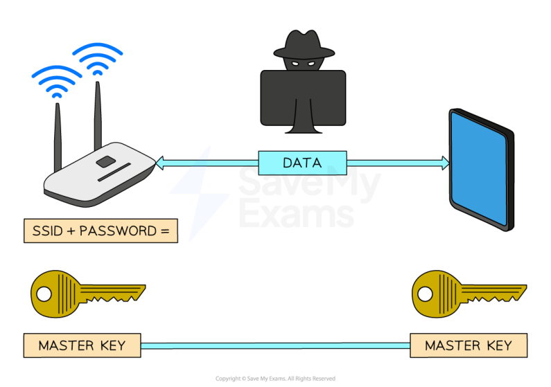

# CAIE Computer Science IGCSE — Chapter ?: Cambridge (CIE) IGCSE Computer Science

---

Your notes 

## Encryption 

Contents Encryption 

© 2026 Save My Exams, Ltd. 

Get more and ace your exams at savemyexams.com 

**1** 

Encryption 

Your notes 

## Encryption 

## What is encryption? 

## Examiner Tips and Tricks 

Cambridge IGCSE 0478 expects you to define encryption, distinguish between symmetric and asymmetric encryption, and describe how data is protected on wired and wireless networks. This page includes all examinable content—clearly explained and ready for marks. 

Encryption is a method of scrambling data before being transmitted across a network 

Encryption helps to protect the contents from unauthorised access by making data meaningless 

While encryption is important on both wired and wireless networks, it's even more critical on wireless networks due to the data being transmitted over radio waves, making it easy to intercept 

## How is wireless data encrypted? 

Wireless networks are identified by a 'Service Set Identifier' (SSID) which along with a password is used to create a 'master key' 

When devices connect to the same wireless network using the SSID and password they are given a copy of the master key 

The master key is used to encrypt data into 'cipher text', before being transmitted 

The receiver uses the same master key to decrypt the cipher text back to 'plain text' 

To guarantee the security of data, the master key is never transmitted. Without it, any intercepted data is rendered useless 

Wireless networks use dedicated protocols like WPA2 specifically designed for Wi-Fi security 

© 2026 Save My Exams, Ltd. 

Get more and ace your exams at savemyexams.com 

**2** 

## How is wired data encrypted? 

- Wired networks are encrypted in a very similar way to a wireless network, using a master key to encrypt data and the same key to decrypt data 

- Encryption on a wired network differs slightly as it is often left to individual applications to decide how encryption is used, for example HTTPS 

## Examiner Tips and Tricks 

In the exam, don’t just say “encryption keeps data safe.” You must mention: 

Plaintext becomes ciphertext 

Only authorised users with the correct key can decrypt it 

That’s where the marks come from. 

## Symmetric & Asymmetric Encryption 

- Encryption relies on the use of a key 

- A key is a binary string of a certain length that when applied to an encryption algorithm can encrypt plaintext information and decrypt ciphertext 

   - Plaintext is the name for data before it is encrypted 

   - Ciphertext is the name for data after it is encrypted 

- Keys can vary in size and act like passwords, enabling people to protect information 

© 2026 Save My Exams, Ltd. 

Get more and ace your exams at savemyexams.com 

**3** 

## What is symmetric encryption? 

- Symmetric encryption is when both the sender and receiver are given an identical secret key which can be used to encrypt or decrypt information 

Your notes 

- If a hacker gains access to the key, then they can decrypt intercepted information 

- The secret key can be shared with the receiver without sending it electronically: 

   - Both parties could verbally share the key in person 

Both parties may use standard postage mail to share the key 

- An algorithm may be used to calculate the key by sharing secret non-key information 

## What is asymmetric encryption? 

- Asymmetric encryption is when two keys are used, a public and private key 

   - Public key: a key known to everyone 

   - Private key: a key known only to the receiver 

- Both keys are needed to encrypt and decrypt information 

- Asymmetric encryption works as follows: 

Person A uses a public key to encrypt their message 

Person A sends their message over the network or internet 

Person B decrypts the message using their secret private key 

- Only one private key can be used to decrypt a message and it is not sent over the internet like a symmetric key 

- Keys can be large, a key using 100 bits would generate 1,267,650,600,228,229,401,496,703,205,376 different combinations 

- Large keys are near impossible for a hacker to guess 

## Examiner Tips and Tricks 

Many students incorrectly say asymmetric encryption uses “a private key and password.” Don’t confuse the public key (used to encrypt) with a generic “password.” They are not the same. 

## Worked Example 

© 2026 Save My Exams, Ltd. 

Get more and ace your exams at savemyexams.com 

**4** 

Complete the sentences about symmetric encryption. Use the terms from the list. Some of the terms in the list will not be used. You should only use a term once. 

Your notes 

algorithm cipher copied delete key plain private public standard stolen understood unreadable 

The data before encryption is known as ______ text. To scramble the data, an encryption ______, which is a type of ______, is used. The data after encryption is known as ______ text. Encryption prevents the data from being ______ by a hacker. 

[5] 

## Answer 

One mark for each correct term in the correct place: 

The data before encryption is known as plain text. To scramble the data, an encryption algorithm/key, which is a type of key/algorithm, is used. The data after encryption is known as cipher text. Encryption prevents the data from being understood by a hacker. 

© 2026 Save My Exams, Ltd. 

Get more and ace your exams at savemyexams.com 

**5** 

