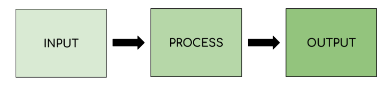
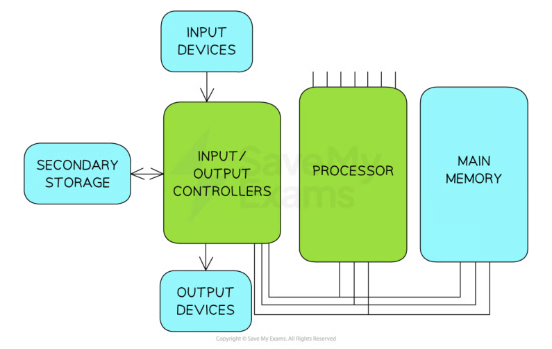
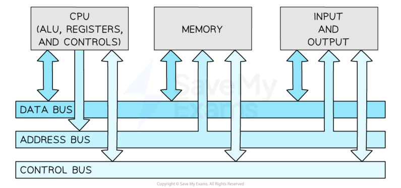
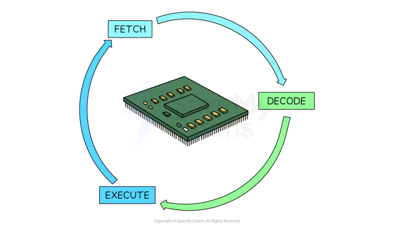
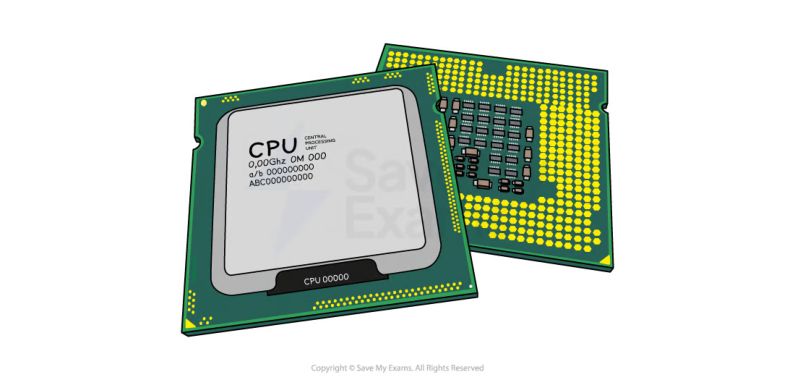
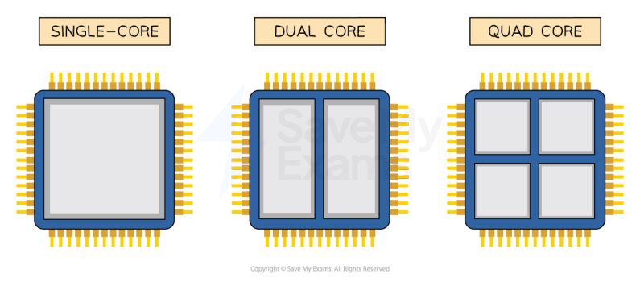
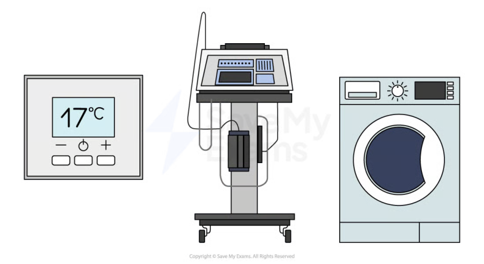

# CAIE Computer Science IGCSE — Chapter 3: Cambridge (CIE) IGCSE Computer Science

---

Your notes 

## Computer Architecture 

## Contents 

The CPU & Microprocessors Von Neumann Architecture The Fetch-Decode-Execute Cycle Characteristics of the CPU CPU Instruction Sets Embedded Systems 

© 2026 Save My Exams, Ltd. 

Get more and ace your exams at savemyexams.com 

**1** 

Your notes 

## The CPU & Microprocessors 

## The CPU & Microprocessors 

## What is the purpose of the CPU? 

The purpose of the Central Processing Unit (CPU) is to fetch, decode and execute instructions 

## Examiner Tips and Tricks 

To earn marks, don’t just say “the CPU processes data.” You need to use keywords like fetch, decode, and execute—these match the language in the mark scheme. 

The CPU is the brain of the computer and its job is to take an input, process data and produce an output 

It is central to all devices including: 

Laptops 

Desktops 

Games-Consoles 

Mobile Devices 

Data and commands are inputted by the user using an input device, the central processing unit (CPU) processes data by executing instructions and the results are outputted to an output device 

Below is an example of data being inputted, processed and the results being outputted 

|Step|Example|
|---|---|
|Input|A keyboard is used to input a number|
|Process|If the instruction being executed is ADD, the inputted value is added to an existing value|
|Output|The result of the calculation is outputted to the user via the monitor|

© 2026 Save My Exams, Ltd. 

Get more and ace your exams at savemyexams.com 

**2** 

A diagram showing the input, process, output sequence followed by computer systems 

## Microprocessors 

A microprocessor is a type of integrated circuit that is contained on a single chip 

It contains the CPU and sometimes other components such as: 

Memory controllers 

I/O interfaces 

It is a hardware chip that houses the CPU 

## Examiner Tips and Tricks 

Examiners sometimes test the difference between a CPU and a microprocessor. The CPU is a component. The microprocessor is the chip that may include the CPU and other parts like memory and I/O controllers. 

© 2026 Save My Exams, Ltd. 

Get more and ace your exams at savemyexams.com 

**3** 

Von Neumann Architecture 

Your notes 

## Von Neumann Architecture 

## What is the Von Neumann architecture? 

## Examiner Tips and Tricks 

Cambridge IGCSE 0478 regularly tests your ability to describe the purpose of CPU components and registers in the Von Neumann architecture. Every explanation on this page is written in the format examiners expect—no waffle, no brand names, just markready definitions. 

The Von Neumann Architecture is a design of the CPU which was proposed by Mathematician John Von Neumann in the 1940s, which most general-purpose computers are built upon 

The Von Neumann Architecture outlines how the computer memory, input/output devices and processor all work together 

## The Von-Neumann architecture 

The Von Neumann architecture consists of: 

Control unit (CU) 

Arithmetic logic unit (ALU) 

Registers 

© 2026 Save My Exams, Ltd. 

Get more and ace your exams at savemyexams.com 

**4** 

Buses 

Your notes 

## What is the function of each component? Arithmetic logic unit (ALU) 

- Performs arithmetic operations 

- Performs logical decisions 

IF X > 5 THEN DO ………. 

## Control unit (CU) 

- Coordinates how data moves around the CPU by sending a signal to control the movement of the data 

- Decodes the instructions fetched from memory 

## Registers 

Extremely small, extremely fast memory located in the CPU 

- Hold small amounts of data needed as part of the fetch-execute cycle 

- Each register has its own specific purpose 

It consists of 5 main registers 

The Program Counter (PC) 

The Memory Address Register (MAR) 

The Memory Data Register (MDR) 

The Accumulator (ACC) 

Current Instruction Register (CIR) 

For each of the registers you must know 

The name of the register 

Its acronym 

The purpose of the register 

## Examiner Tips and Tricks 

When describing registers like the PC, MAR, or MDR, don’t just name what they “store”, you must also explain why they store it and how it’s used in the fetchexecute cycle. The how is where marks are gained or lost. 

© 2026 Save My Exams, Ltd. 

Get more and ace your exams at savemyexams.com 

**5** 

|Name|Acronym|Purpose|
|---|---|---|
|Program Counter|PC|Holds the memory addressof thenext instructionsto be executed Increments by 1as the fetch-decode-execute cycle runs|
|Memory Address Register|MAR|Holds the memory addressof where data or instructions areto be fetched from memory|
|Memory Data Register|MDR|Stores the data or instructionwhich has been fetched from memory|
|Current Instruction Register|CIR|Stores the instructionthe CPU is currently decoding or executing|
|Accumulator|ACC|Stores the resultsof any calculations that have taken place in the Arithmetic Logic Unit (ALU)|

Your notes 

## Examiner Tips and Tricks 

To earn both marks for a register question, use this structure: 

“[Register] holds [what], which is used to [why/how it's used].” 

Example: “The MAR holds the memory address of data to be fetched, which is sent via the address bus.” 

## Buses 

Components within the CPU and wider computer system are connected by buses 

A bus is a set of parallel wires through which data/signals are transmitted from one component to another 

There are 3 types of bus: 

Address - unidirectional, carries location data (addresses), data is written to/read from 

Data - bidirectional, carries data or instructions 

Control - bidirectional, carries commands and control signals to tell components when they should be receiving reads or writes etc.. 

© 2026 Save My Exams, Ltd. 

Get more and ace your exams at savemyexams.com 

**6** 

Your notes 

## Examiner Tips and Tricks 

Students often confuse the data and address bus. Remember: the address bus only carries memory locations (it’s unidirectional), while the data bus carries actual data or instructions (it’s bidirectional). 

## Worked Example 

Describe the role of the control unit, the control bus, the data bus and the address bus when fetching an instruction from memory [4] 

## Answer 

The address of memory (holding instruction) is placed on the address bus (1) The control unit sends a signal (1) on the control bus (to start a read operation) (1) The instruction is/the contents of the memory are placed on the data bus (1) 

© 2026 Save My Exams, Ltd. 

Get more and ace your exams at savemyexams.com 

**7** 

The Fetch-Decode-Execute Cycle 

Your notes 

## Fetch-Decode-Execute Cycle (FDE) 

## What is the purpose of the CPU? 

- The purpose of the Central Processing Unit (CPU) is to fetch, decode and execute instructions 

- The CPU is the brain of the computer and its job is to take an input, process data and produce an output 

## What is the Fetch-Decode-Execute cycle? 

- The Fetch-Decode-Execute Cycle is the cycle that the central processing unit (CPU) runs through billions of times per second to make a computer work 

A computer takes an input, processes the input and then delivers an output for the user 

Input: Clicking a button on the gamepad 

Process: The CPU inside the console follows a set of instructions to carry out the task 

Output: The player moving on screen 

## The Fetch-Decode-Execute cycle stages 

## Fetch stage 

- During the fetch stage of the cycle, the program counter holds the address of the next instruction to be fetched from memory 

© 2026 Save My Exams, Ltd. 

Get more and ace your exams at savemyexams.com 

**8** 

- The address of the next instruction or data to be fetched is copied into the memory address register (MAR) 

Your notes 

The address of the instruction or data is then sent along the address bus and awaits a signal from the control bus 

The signal sent along the control bus is sent from the control unit (CU) to the main memory 

- The data or instructions received from main memory is fetched to the memory data register (MDR) via the data bus 

A copy of the instruction or data is stored in the current instruction register (CIR) 

The program counter (PC) increments by 1 so it is pointing to the next instruction to be executed 

## Decode stage 

- During the decode stage of the cycle, the CPU needs to work out what is required from the instruction 

This is done as the instruction is split into two parts: 

Opcode - what the instruction is 

Operand - what to do it to 

This could be either data or an address where the data is stored 

## Execute stage 

- During the execute stage of the cycle, the CPU will carry out the instruction that was fetched 

Some examples that would take place at this stage are 

Performing a calculation 

- Storing a result or data back in main memory (RAM) 

Going to main memory to fetch data from a different location 

## The important things to remember are: 

An instruction or data is fetched from memory 

- The instruction is decoded 

- The instruction is executed 

The cycle repeats billions of times per second 

## Examiner Tips and Tricks 

© 2026 Save My Exams, Ltd. 

Get more and ace your exams at savemyexams.com 

**9** 

Your notes 

Make sure you read the question carefully and look at the number of marks allocated to judge the level of detail required. Often questions on the fetch-decode-execute cycle only require you to describe the steps rather than explain how the registers and buses are used during each step 

## Worked Example 

Explain how an instruction is fetched using Von Neumann architecture 

[6] 

## Answer 

The Program Counter (PC) holds the address/location of the next instruction to be fetched [1] 

- The address held in the PC is sent to the Memory Address Register (MAR) [1] The memory address is sent using the address bus [1] 

The Program Counter is incremented [1] 

- The instruction is sent from the address in memory to the Memory Data Register (MDR) [1] 

The instruction is transferred using the data bus [1] 

The instruction is sent to the Current Instruction Register (CIR) [1] 

© 2026 Save My Exams, Ltd. 

Get more and ace your exams at savemyexams.com 

**10** 

Characteristics of the CPU 

Your notes 

## Characteristics of the CPU 

## What are the common characteristics of the CPU? 

There are 3 common characteristics 

   - Clock Speed 

   - Cache Size 

   - Number of Cores 

- Each of these characteristics has a significant impact on the performance of the CPU 

## How do the characteristics of the CPU affect performance? 

## Clock speed 

- The clock speed is measured in Hertz (Hz) 

- The clock speed measures the number of fetch-decode-execute cycles that can take place in 1 second 

- The faster the clock speed, the more instructions can be fetched and executed per second 

- Modern computers have a clock speed in Gigahertz (GHz), meaning billion 

- A clock speed of 3.5GHz can perform up to 3.5 billion instructions per second 

## Cache size 

© 2026 Save My Exams, Ltd. 

Get more and ace your exams at savemyexams.com 

**11** 

- Cache is very small, very fast memory on or close to the CPU 

- Cache is used as temporary storage to provide quick access to a copy of frequently used instructions and data 

Your notes 

- The larger the cache size, the more frequently used instructions or data can be stored 

- This results in the CPU having to complete fewer fetch cycles from memory (RAM), speeding up the performance 

- Cache also has a significantly faster read/write speed than RAM, making it much quicker to retrieve instructions from there instead of from memory (RAM) 

## Number of cores 

- A core works like it is its own CPU 

- Multiple core processors mean they have multiple separate processing units that can fetch, decode and execute instructions at the same time 

- For example, a dual-core processor would have 2 processing units, each with their own 

   - Control Unit (CU) 

   - Arithmetic Logic Unit (ALU) 

   - Accumulator (ACC) 

   - Registers 

- Multi-core processors can run more powerful programs with greater ease 

- Multiple cores increase the performance of the CPU by working with the clock speed 

   - Example: A quad-core CPU (4 cores), running at a clock speed of 3Ghz 

© 2026 Save My Exams, Ltd. 

Get more and ace your exams at savemyexams.com 

**12** 

Your notes 

## Worked Example 

One computer has a single core processor and the other has a dual core processor. 

Explain why having a dual core processor might improve the performance of the computer 

[2] 

## Answer 

Any 2 from: 

- The computer with the dual core processor has two cores/double the amount of cores [1] 

Parallel processing can take place [1] 

Each core can execute a separate instruction at the same time [1] Each core can process instructions independently of each other [1] 

© 2026 Save My Exams, Ltd. 

Get more and ace your exams at savemyexams.com 

**13** 

CPU Instruction Sets 

Your notes 

## CPU Instruction Sets 

## What is an Instruction set? 

- An instruction set is a list of all the commands that can be processed by a CPU 

- Each command has a binary code which is called machine code 

- The table below shows an example instruction set 

- Each instruction has a mnemonic that indicates what the instruction does alongside an example binary code 

- After an instruction is decoded, the CPU matches it to an instruction in its instruction set 

It then knows what operation to perform when executing the instruction 

|Instruction|Mnemonic|Binary code|Command|
|---|---|---|---|
|Add|ADD|10100001|Addsa value to the value currently stored in the accumulator (ACC)|
|Subtract|SUB|00100010|Subtracta value from the values stored in the accumulator|
|Load|LDA|10111111|Loadthe value stored in a memory location into the accumulator|
|Store|STA|01100000|Storethe value in the accumulator in a specifc location in memory|
|Stop|HLT|00000000|Stopthe program|

Instruction lists are machine-specific 

- A program created using one computer’s instruction set would not run on a computer containing a processor made by a different manufacturer 

For example, a computer program created using Intel’s instruction set would not run on a device containing an ARM processor 

## Worked Example 

Using the instruction set in the table above, what operation would be performed if the instruction was 00100010 00000010? 

© 2026 Save My Exams, Ltd. 

Get more and ace your exams at savemyexams.com 

**14** 

Answer 

[1] 

Your notes 

Either of: 

The operation would be SUB [1] 

This instruction subtracts a value from the value stored in the accumulator [1] 

© 2026 Save My Exams, Ltd. 

Get more and ace your exams at savemyexams.com 

**15** 

Embedded Systems 

Your notes 

## Embedded Systems 

## What is an embedded system? 

- An embedded system is a computer system which is used to perform a dedicated function, inside a larger mechanical unit 

Examples of embedded systems include 

- Heating thermostats 

- Hospital equipment 

- Washing machines 

- Dishwashers 

- Coffee machines 

- Satellite navigation systems 

- Factory equipment 

- Security systems 

- Traffic lights 

## What are the properties of an embedded system? 

They are small in size 

- They use less power than a general-purpose computer 

- They have a lower cost 

© 2026 Save My Exams, Ltd. 

Get more and ace your exams at savemyexams.com 

**16** 

Your notes 

## Examiner Tips and Tricks 

Always use key examples from the list above and don’t try to use different examples such as a fridge or kettle as these will not appear on mark schemes because although they have a single purpose, most fridges and kettles do not have a CPU. 

## Worked Example 

- 1)    Tick two boxes below to show which are an example of an embedded system 

[2] Is it an example of an embedded system Laptop Washing Machine Mobile Phone Car Engine Management System 

- 2)    Justify your choice to question 1 

[2] 

## Answers 

- 1)    Tick two boxes below to show which are an example of an embedded system.  [2] 

||Is it an example of an embedded system|
|---|---|
|Laptop||
|Washing Machine|✓|
|Mobile Phone||
|Car Engine Management System|✓|

- 2)    Justify your choice to question 1 [2] 

## Any two of: 

- A washing machine and car engine management system are not general-purpose computers [1] 

- A washing machine and car engine management system have a single purpose and are both housed inside a larger mechanical unit [1] 

© 2026 Save My Exams, Ltd. 

Get more and ace your exams at savemyexams.com 

**17** 

A washing machine and car engine management system have a microprocessor [1] 

Your notes 

© 2026 Save My Exams, Ltd. 

Get more and ace your exams at savemyexams.com 

**18** 

