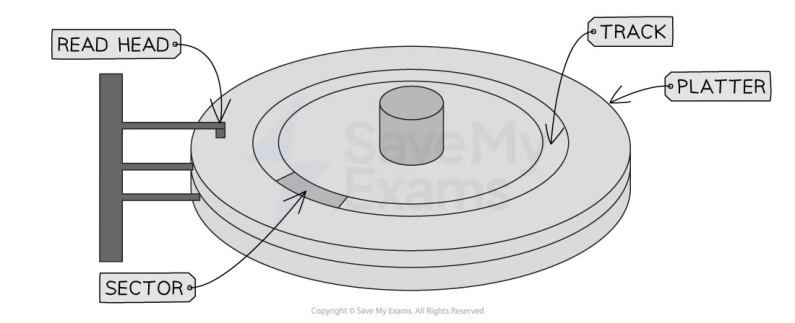
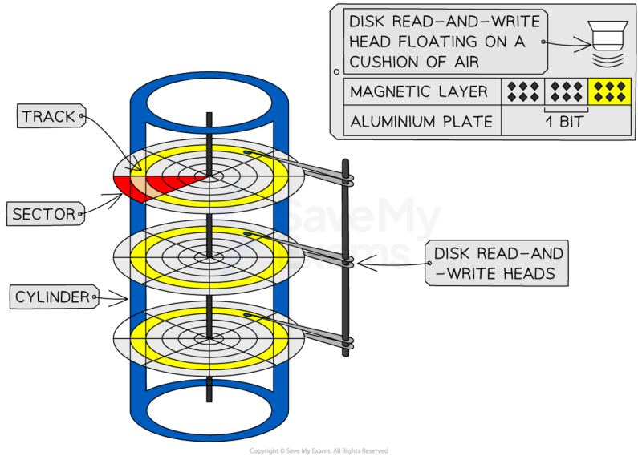
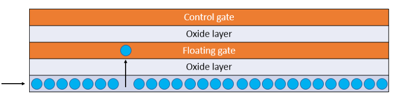
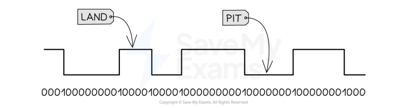
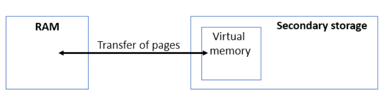
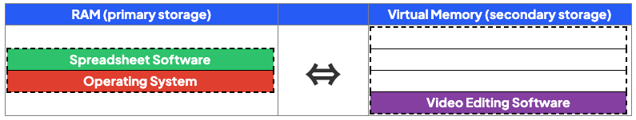
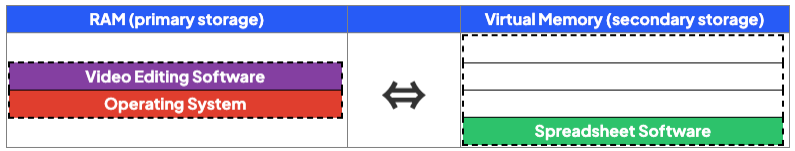
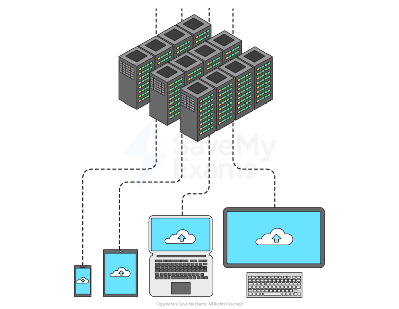

# CAIE Computer Science IGCSE — Chapter ?: Cambridge (CIE) IGCSE Computer Science

---

Your notes 

## Data Storage 

## Contents 

Primary Storage Secondary Storage Virtual Memory Cloud Storage 

© 2026 Save My Exams, Ltd. 

Get more and ace your exams at savemyexams.com 

**1** 

Primary Storage 

Your notes 

## Primary Storage 

## Examiner Tips and Tricks 

Cambridge IGCSE 0478 expects you to describe RAM, ROM, and other forms of primary storage, compare them to secondary storage, and apply your knowledge to real-world devices. This page covers the examinable content only—clearly, accurately, and in the language used by examiners. 

Primary storage is directly accessed by the CPU 

Computer systems need both primary and secondary storage to operate 

Both types of storage play a crucial role in the operation of a computer system 

A quick comparison of primary and secondary storage shows: 

|Primary|Secondary|
|---|---|
|Volatile(with the exception of ROM)|Non-volatile|
|Small capacity|Large capacity|

## Why do you need primary storage? 

- A computer needs primary storage because access times are considerably faster than secondary 

- This means the time taken to complete operations such as the Fetch-Execute Cycle is dramatically reduced 

- Primary storage holds the data and instructions that the CPU needs to access whilst the computer is turned on 

- Due to the fast access times, primary storage is used as short-term, working memory, in hardware that is directly connected to the CPU such as RAM, and components that reside inside the CPU such as Cache and Registers 

- Performance of primary storage means a much higher cost which limits the amount that is used 

- For example, RAM is commonly purchased in 16 or 32 gigabytes whereas secondary storage such as a hard drive is in terabytes 

## RAM 

© 2026 Save My Exams, Ltd. 

Get more and ace your exams at savemyexams.com 

**2** 

## What is RAM? 

RAM (Random Access Memory) is primary storage that is directly connected to the CPU and holds the data and instructions that are currently in use 

Your notes 

RAM is volatile which means the contents of RAM are lost when the power is turned off 

For the CPU to access the data and instructions they must be copied from secondary storage 

RAM is very fast working memory, much faster than secondary storage 

RAM is read/write which means data can be read from and written to 

In comparison to ROM, it has a much larger capacity 

## Examiner Tips and Tricks 

Without the mention of current use or CPU access, you’ll lose a mark. 

IGCSE may ask you to explain how RAM is used in a real product like a smart TV or games console. 

Example: 

“RAM stores the current video stream or active game state, allowing smooth performance and fast switching between tasks.” 

## Worked Example 

A smart television allows the user to search the Internet and watch videos online. 

The smart television uses RAM 

Give two examples of data that the smart television could store in RAM [2] 

How to answer this question 

- Think about the main function of a smart television, watch channels, use apps to stream content and browse the web etc 

For each function, try to think of what data would have to be in the RAM whilst you were actually doing it (in use!) 

## Possible answers 

Current channel being watched 

- Current volume Current video/file/tv program being watched 

- Web browser/applications that are running Data being downloaded/buffered 

© 2026 Save My Exams, Ltd. 

Get more and ace your exams at savemyexams.com 

**3** 

## ROM 

Your notes 

## What is ROM? 

- ROM (Read Only Memory) is primary storage that holds the first instructions a computer needs to start up (Bootstrap) 

ROM contains the BIOS (Basic Input Output System) 

ROM is a small memory chip located on the computers motherboard 

ROM is fast memory, much faster than secondary storage but slower than RAM 

- ROM is non-volatile which means the contents of ROM are not lost when the power is turned off 

ROM is read only which means data can only be read from 

In comparison to RAM, it has a much smaller capacity 

## Examiner Tips and Tricks 

RAM & ROM are examples of primary storage, they can be referred to as Main Memory or Primary Memory in the exam 

## Worked Example 

Quinn has 512 kilobytes of ROM and 16 gigabytes of RAM in her computer 

1. Describe the purpose of the ROM in Quinn's computer [2] 

2. Describe the purpose of the RAM in Quinn's computer [2] 

- Answer 

1. ROM 

Store start-up instructions/bootstrap Used to start the computer 

2. RAM 

Stores the parts of the OS / programs that are running Stores data currently in use ...for access by the CPU 

## Guidance 

Do not confuse the purpose with characteristics, describe what it does, not what it is 

© 2026 Save My Exams, Ltd. 

Get more and ace your exams at savemyexams.com 

**4** 

## Examiner Tips and Tricks 

Many students confuse RAM with secondary storage. Remember: RAM is volatile and loses data when power is off Secondary storage is non-volatile and holds data permanently 

Your notes 

© 2026 Save My Exams, Ltd. 

Get more and ace your exams at savemyexams.com 

**5** 

Secondary Storage 

Your notes 

## Secondary Storage 

- Storage devices are non-volatile secondary storage, that retain digital data within a computer system 

- They provide a means of storing, accessing, and retrieving data, which can include software applications, documents, images, videos, and more 

There are 3 types of storage: 

## Magnetic 

- Solid-state (flash memory) 

## Optical 

- Computer systems need both primary and secondary storage to operate 

- Both types of storage play a crucial role in the operation of a computer system 

- A quick comparison of primary and secondary storage shows: 

|Primary|Secondary|
|---|---|
|Volatile(with the exception of ROM)|Non-volatile|
|Small capacity|Large capacity|

## Why do you need secondary storage? 

- A computer needs secondary storage for long term storage of programs and data that are currently not in use 

- Secondary storage is needed as ROM is read only and RAM is volatile 

- Secondary storage holds the programs and data whilst the computer is turned off (nonvolatile) 

- Performance of secondary storage is slower than primary storage but capacity is much higher which makes it perfect for backup & archive of data files 

## What are the characteristics of secondary storage? 

Capacity - What is the maximum amount of data that can be stored? 

- Speed - How fast can data be read from and written to? (R/W) 

- Cost - How much does it cost? 

- Portability - How easy is it to move around? What is the physical size? Weight? 

© 2026 Save My Exams, Ltd. 

Get more and ace your exams at savemyexams.com 

**6** 

Durability - How robust is the storage? 

- Reliability - What is the probability that the device will consistently perform its function? 

Your notes 

## Worked Example 

A games console has secondary storage. 

State, using an example, why the games console needs secondary storage [2] 

## How to answer this question 

   - They keyword is 'why', why does a games console need secondary storage? give an example, do not just describe what secondary storage is! 

- Answer 

To store data once the power is turned off / permanently // for non-volatile 

- storage 

- Examples could include: 

   - Storing games Save games User data/profiles Downloaded content/applications/updates 

## Magnetic Storage 

## What is magnetic storage? 

- Magnetic storage is a type of non-volatile media that uses magnets (polarity) to store binary 0s and 1s 

- A magnetic hard disk is made up of several metal discs coated with a magnetic material 

   - These are called platters 

Iron particles on each platter are magnetised to represent a 0 or 1 

© 2026 Save My Exams, Ltd. 

Get more and ace your exams at savemyexams.com 

**7** 

- Each platter is divided by concentric circles creating several tracks and wedge shaped sectors 

Where they intersect is a track sector 

- The hard drive spins the metal disk(s) at a high speed (typically around 5400−7200 RPM) using a motor 

- A read/write arm, controlled by an actuator, moves the head over the surface of the disc to the location of the data 

The data is read/written using electromagnets 

|Advantages|Disadvantages|
|---|---|
|Capacity- High storage|Durability- Moving parts can get damaged if dropped|
|Cost- Low per gigabyte|Portability- Heavy & bulky making them less convenient for transport|
|Speed- Moderate read/write access|Reliability- Prone to mechanical failure|
||Noise- Loud (spinning disks)|

## Solid-state (Flash Memory) 

© 2026 Save My Exams, Ltd. 

Get more and ace your exams at savemyexams.com 

**8** 

## What is solid state (flash memory)? 

Solid-state (flash memory) storage is a type of non-volatile media that uses electronic circuits to store binary 0s and 1s 

Your notes 

Examples of solid state storage devices include: 

Solid state drives (SSD) - replacing magnetic hard drives as a computers primary secondary storage device as capacity increases and cost decreases 

USB flash memory - most common form of portable storage device 

- It uses NAND and NOR gates in electrical circuits to persistently control the flow of electrons 

- Solid-state (flash memory) is memory made up of tiny cells that can contain one bit of data (1 or 0) 

Each cell contains a transistor that acts as a switch that can be turned on or off 

The transistor contains two main parts: 

   - Control gate - top layer of transistor, connects to circuit and controls if current can flow through the transistor 

   - Floating gate - can hold a charge (like a tiny rechargeable battery) and is sandwiched between two layers of insulating material (Oxide) 

- To store data a charge is placed on the floating gate 

   - A high voltage is applied to the control gate, which allows electrons to be pushed through the oxide layer and onto the floating gate 

To remove data, a high voltage charge is applied in the opposite direction, pulling the electrons off the floating gate 

|Advantages|Disadvantages|
|---|---|
|Capacity- Medium/high storage|Cost- Very high per gigabyte|
|Speed- Very fast read/write access|Reliability- Limited read/write cycles|
|Durability- No moving parts||

© 2026 Save My Exams, Ltd. 

Get more and ace your exams at savemyexams.com 

**9** 

Portability - Small and no moving parts 

Your notes 

Noise - Silent 

## Optical Storage 

## What is optical storage? 

Optical storage is a type of non-volatile media that uses lasers to burn the surface of a disk, creating pits and lands suitable for storing binary 0s and 1s 

Examples of optical storage include: 

Blu-rays have the largest capacity 

CDs have the lowest capacity 

CD-R are read-only (you cannot save data on to them) 

- CD-RW can be written to and read from 

DVD-RW can be written to and read from 

All optical devices work by shining a laser at the disk and processing the reflection 

- An arm moves the laser across the surface of the disk 

- In CD-Rs a laser burns the data, permanently on to the disk, by creating pits and lands 

- The laser is also used to read the data from the pits and lands 

When the laser light hits the point where the pit changes into a land or vice versa the light scatters and is not reflected back as well. 

- This is captured by a sensor and can be interpreted as a change in the binary value 

## Examiner Tips and Tricks 

Optical storage devices contain moving parts because the disk spins and the laser mechanism moves, but there is no physical contact with the disk surface 

© 2026 Save My Exams, Ltd. 

Get more and ace your exams at savemyexams.com 

**10** 

|Advantages|Disadvantages||Your notes|
|---|---|---|---|
|Cost- Very low per gigabyte|Capacity- Very low|||
|Durability- No physical contact between the laser and the disk surface|Speed- Very slow read/write access|||
|Portability- Small and lightweight|Reliability- Prone to scratches|||
|Noise- Silent||||

## Worked Example 

Zarmeen has purchased a new tablet computer. The tablet has an internal secondary storage device. 

The storage device is a solid state device. 

1. Give three benefits of the tablet having a solid state device instead of a magnetic device [3] 

2. Give two drawbacks of the tablet having a solid state device instead of a magnetic device [2] 

- Answers 

- Benefits 

- Faster access / read/write speeds Smaller in physical size More durable // no moving parts 

- Drawbacks 

More expensive (per gigabyte) Smaller capacity (usually) Limited number of read/write cycles Guidance 

Portable is not enough on it's own No moving parts is not enough on it's own 

© 2026 Save My Exams, Ltd. 

Get more and ace your exams at savemyexams.com 

**11** 

Virtual Memory 

Your notes 

## Virtual Memory 

## What is virtual memory? 

## Examiner Tips and Tricks 

Cambridge IGCSE 0478 requires you to explain what virtual memory is, when it is used, and how it affects performance. This page is written using the structure and phrasing examiners expect in 2–4 mark answers. 

- Virtual memory is an extension of primary storage (RAM) located on secondary storage 

- In situations where RAM is close to being full, virtual memory can be used so that the computer remains operational 

Programs and data not currently being executed are transferred to virtual memory 

- Programs and data are transferred back to RAM when they are needed 

- Programs are stored as pages of data 

- Pages of data are transferred between RAM and virtual memory when needed 

- Virtual memory is much slower than RAM and its use will impact negatively on system performance 

To avoid the use of virtual memory, increase the size of the RAM 

## Examiner Tips and Tricks 

Virtual memory does not increase the actual size of RAM. It creates temporary space on secondary storage. It makes the system usable, not faster. 

## Example 

© 2026 Save My Exams, Ltd. 

Get more and ace your exams at savemyexams.com 

**12** 

Your notes 

- In the example above, the computer is turned on and the elements of the operating system are loaded into RAM 

- The user opens some spreadsheet and video editing software but RAM is full 

- The program not currently being used (video editing) is transferred to virtual memory 

- When the user wants to use the video editing software again, it is transferred back from virtual memory to RAM 

## Case Study 

A student uses software to create 3D models. 

- 3D modelling often means processing large amounts of data This takes up a large amount of RAM If there is not enough physical RAM, virtual memory is used to: 

   - Extend the RAMs capacity 

   - Ensure the software does not freeze/crash when RAM gets full 

## Worked Example 

A computer only has 4GB of RAM, Fynn says that virtual memory can be used instead of adding more RAM. 

1. Explain how virtual memory can compensate for the lack of RAM in Fynn's computer [3] 

2. Explain why it would be beneficial for Fynn to get more RAM instead of relying on virtual memory [2] 

- How to answer these questions 

© 2026 Save My Exams, Ltd. 

Get more and ace your exams at savemyexams.com 

**13** 

Your notes 

1. What is the definition of virtual memory? how does it work? 

2. What is the downside of using virtual memory? turn this into an advantage of adding more RAM 

Answers 

How can Virtual Memory compensate 

Virtual Memory is used when RAM is full ...part of the secondary storage used as (temporary) RAM 

Data from RAM is moved to the secondary storage/Virtual Memory (to make space in RAM) 

RAM can then be filled with new data 

- When data in Virtual Memory is needed it is moved back to RAM 

- Benefit of more RAM 

More RAM will improve the performance of the computer // More RAM will speed up the access to data 

Virtual Memory is slower to access than RAM direct (because it has to go back to RAM first) 

Moving data between RAM and VM takes processor time 

© 2026 Save My Exams, Ltd. 

Get more and ace your exams at savemyexams.com 

**14** 

Cloud Storage 

Your notes 

## Cloud Storage 

## What is cloud storage? 

- Cloud storage is a term to describe long-term (secondary) storage of data that resides in a remote location, accessible only via a wide area network (Internet) 

Data is stored on remote servers, typically using magnetic storage (HDD), but increasingly using solid state (SSD) 

|Advantages|Disadvantages|
|---|---|
|Reliability-  Access data anywhere, any time, from any device|Cost- Typically a monthly/yearly subscription plan|
|Security- Automatic backups|Availability- No access without an internet connection|
|Capacity- Endless storage space (cost permitting), uses less space on own device||
|Collaboration- Multiple people can access the same fle at the same time||

© 2026 Save My Exams, Ltd. 

Get more and ace your exams at savemyexams.com 

**15** 

Your notes 

## Advantages of Cloud Storage 

Cloud storage offers several advantages over storing data on a local secondary storage device 

|Beneft|Explanation|
|---|---|
|Accessibility|Data can beaccessed from anywhere Data can be accessed by anyone with therelevant permissions, making itquick to share flesand collaborate with others Data can beaccessed on any devicewith an internet connection|
|Scalability|Cloud storage providers allow customers toincreaseor decrease their storage capacityas needed|
|Reliability|Cloud storage providers often usemultiple serversto store and backup data, reducing the risk of data loss due to hardware failure|

© 2026 Save My Exams, Ltd. 

Get more and ace your exams at savemyexams.com 

**16** 

|Security|||Cloud storage providers oferadvanced security features, such as dataencryptionandmulti-factor authentication, to protect user data from unauthorised access||Your notes|
|---|---|---|---|---|---|
||||There isno need to hire specialist stafas IT services being provided|||
||||by the cloud storage provider|||
|You also do not need to purchase local secondary storage devices||||||
|One cloud|storage centre is moreenvironmentally friendlythan millions of individual|||||
|servers||||||
|There are some drawbacks to using cloud storage||||||
|If the user|||has a slow orunreliable internet connectionthey would have problems|||
|accessingtheir fles||||||
|If you are||storing a lot of data it can beexpensive||||
|You have to pay the cloud storage provider||||||
|You may need to commit to an annual subscription||||||
|You may have to pay for high download and upload data transfer limits||||||
|Data being sent over the internet has the potential to beintercepted||||||
|Security is managed by the cloud storage provider which means the userdoes not||||||
|have complete controlover it but is still legally responsible for ensuring any||||||
|personal||and sensitive datais secure||||

## Worked Example 

A school currently stores all of their data on local servers. They are considering upgrading their system to utilise cloud storage. 

Explain two disadvantages to the school of storing their data in the cloud. 

[4] 

You need a constant internet connection [1] 

if the internet connection failed, teachers would not be able to access lesson files [1] if the internet connection failed, teachers would not be able to access student data/take electronic registers [1] if the internet connection failed, students would not be able to access their work/coursework [1] Reliant on third party to carry out security procedures [1] but the school is still legally responsible if data is accessed by unauthorised people [1] Data stored on the cloud could be hacked or intercepted [1] 

© 2026 Save My Exams, Ltd. 

Get more and ace your exams at savemyexams.com 

**17** 

Explain two advantages to the school of storing their data in the cloud. 

[4] 

Your notes 

Additional storage can be purchased if needed [1] 

The cloud hosting company provides back up [1] 

The cloud hosting company provides security [1] 

- Data can be accessed from anywhere and from any device provided there is an internet connection [1] 

So teachers would be able to access data from home [1] 

- So students would be able to access work from home [1] 

© 2026 Save My Exams, Ltd. 

Get more and ace your exams at savemyexams.com 

**18** 

