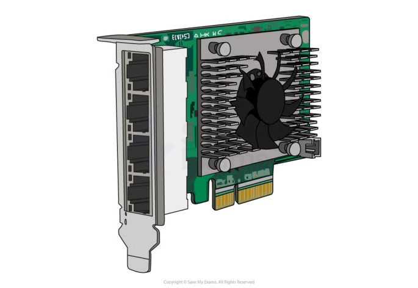
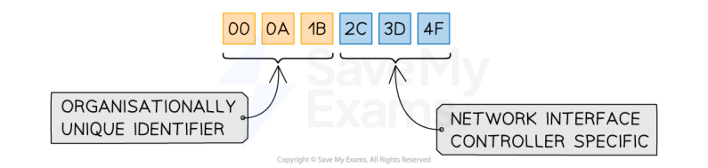
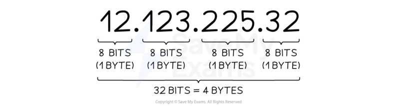
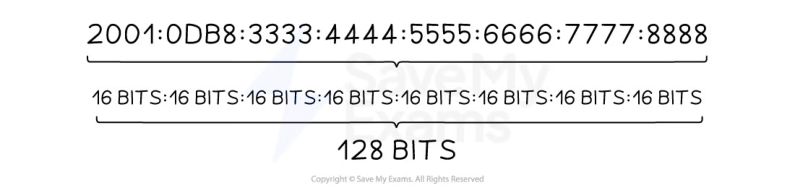
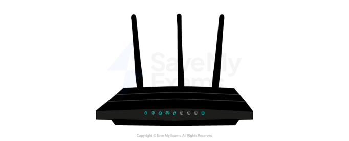
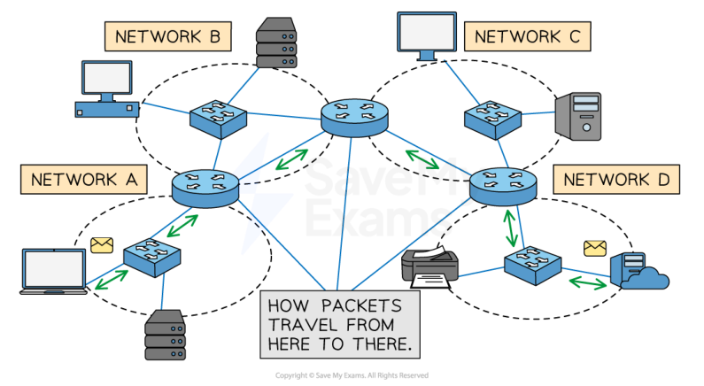

# CAIE Computer Science IGCSE — Chapter ?: Cambridge (CIE) IGCSE Computer Science

---

Your notes 

## Network Hardware 

## Contents 

Network Interface Card (NIC) MAC Addresses & IP Addresses Router 

© 2026 Save My Exams, Ltd. 

Get more and ace your exams at savemyexams.com 

**1** 

Network Interface Card (NIC) 

Your notes 

## Local Area Network Hardware: Network Interface Card (NIC) 

- Network hardware is a selection of essential components that enable the connectivity and communication of devices within computer networks 

- Networks use a variety of hardware to function, some of which include: 

Router 

Wireless access point (WAP) 

Switch 

Transmission media 

Network interface card (NIC) 

- The exam requires you to understand the purpose of the network interface card (NIC) 

## What is a network interface card (NIC)? 

- The Network Interface Card (NIC) is required for a computer to connect to a network 

- A NIC can be both wired and wireless and allows your computer to send and receive data over a network 

© 2026 Save My Exams, Ltd. 

Get more and ace your exams at savemyexams.com 

**2** 

## MAC Addresses & IP Addresses 

Your notes 

- Devices on a network send and receive data, a device needs an address to ensure it sends data to the correct place 

- There are two types of network address systems: 

MAC Address 

IP Address 

## MAC Addresses 

## What is a MAC address? 

- A MAC (Media Access Control) address is a unique identifier given to devices which communicate over a local area network (LAN) 

- A network interface card is given a MAC address at the point of manufacture 

- MAC addresses are static, meaning they can never change 

- MAC addresses make it possible for switches to efficiently forward data to the intended recipient 

- Any device that contains a Network Interface Card (NIC) has a MAC address assigned during manufacturing 

- A device connecting to a local network already has a MAC address, if it moves to a different network then the MAC address will stay the same 

- A MAC address is represented as 12 hexadecimal digits (48 bits), usually grouped in pairs 

- The first three pairs are the manufacturer ID number (OUI) and the last three pairs are the serial number of the network interface card (NIC) 

- There are enough unique MAC addresses for roughly 281 trillion devices 

## IP Addresses 

## What is an IP address? 

© 2026 Save My Exams, Ltd. 

Get more and ace your exams at savemyexams.com 

**3** 

- An IP (Internet Protocol) address is a unique identifier given to devices which communicate over the Internet (WAN) 

Your notes 

- IP addresses can be static, meaning they stay the same or dynamic, meaning they can change 

- Static IP addresses are commonly used for servers and websites so they can always be found at the same address 

- Dynamic IP addresses are assigned automatically by a DHCP server (Dynamic Host Configuration Protocol) 

- IP addresses make it possible to deliver data to the right device 

- A device connecting to a network will be given an IP address, if it moves to a different network then the IP address will change 

## IPv4 

- Internet Protocol version 4 is represented as 4 blocks of denary numbers between 0 and 255, separated by full stops 

Each block is one byte (8 bits), each address is 4 bytes (32 bits) 

- IPv4 provides over 4 billion unique addresses (232), however, with over 7 billion people and countless devices per person, a solution was needed 

## IPv6 

- Internet Protocol version 6 is represented as 8 blocks of 4 hexadecimal digits, separated by colons 

Each block is 2 bytes (16 bits), each address is 16 bytes (128 bits) 

- IPv6 could provide over one billion unique addresses for every person on the planet (2128) 

© 2026 Save My Exams, Ltd. 

Get more and ace your exams at savemyexams.com 

**4** 

Your notes 

## Worked Example 

Computers in a network can be identified using both IP addresses and MAC addresses. 

Describe two differences between IP addresses and MAC addresses [2] 

## Answer 

IP address is dynamic/can change // MAC address is static/cannot change IP address is used to communicate on a WAN/Internet // MAC address is used to communicate on a LAN 

© 2026 Save My Exams, Ltd. 

Get more and ace your exams at savemyexams.com 

**5** 

Your notes 

## Router 

## Router 

## What is a router? 

The router is responsible for routing data packets between different networks 

An example of data the router can direct is, sending internet traffic to the correct destination/devices in your home network 

The router connects networks together, local area networks (LAN) to the wider internet which is a type of wide area network (WAN) 

The router can manage and prioritise data traffic, which can help to keep connections stable 

The router will assign IP addresses to the devices on the network 

Image of a router 

Image of how a router connects LANs to other networks 

© 2026 Save My Exams, Ltd. 

Get more and ace your exams at savemyexams.com 

**6** 

Your notes 

## Worked Example 

State 3 tasks carried out by a router [3] 

To answer the question you must simply identify 3 tasks a router does 

1 mark each to max 3 e.g. 

Send and Receive packets of data Connect a local network to the internet Assign IP addresses to nodes/devices Converts packets from one protocol to another 

© 2026 Save My Exams, Ltd. 

Get more and ace your exams at savemyexams.com 

**7** 

