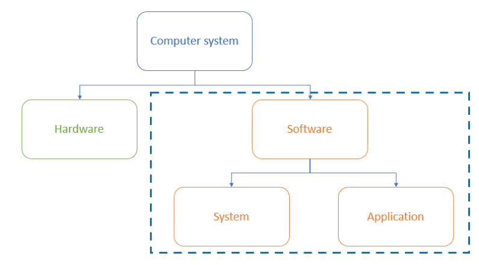
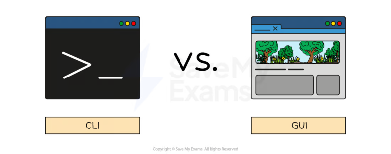
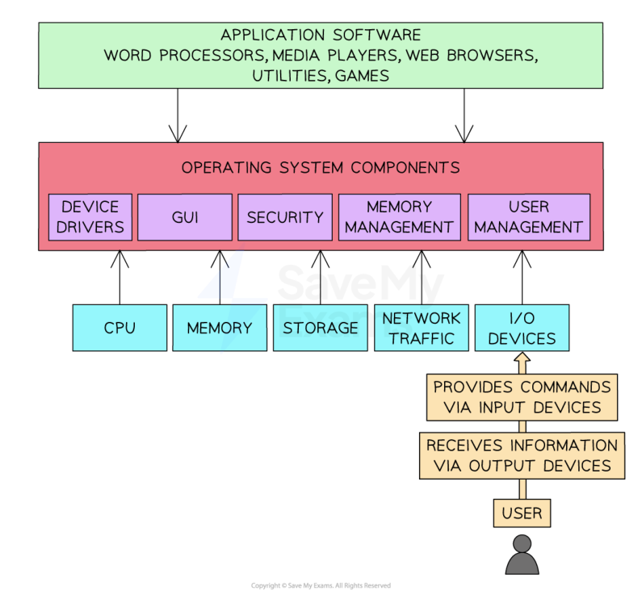
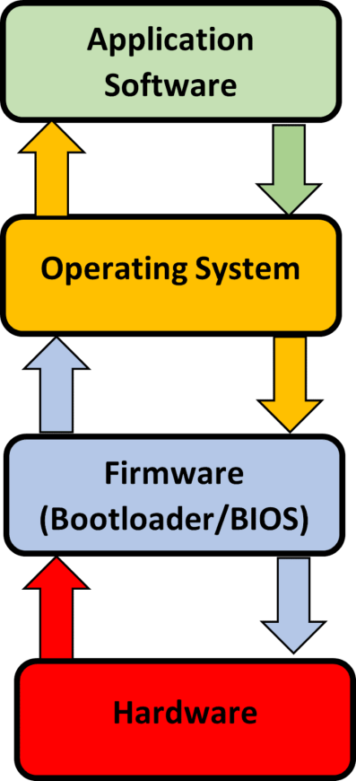

# CAIE Computer Science IGCSE — Chapter ?: Cambridge (CIE) IGCSE Computer Science

---

Your notes 

## Types of Software & Interrupts 

## Contents 

System Software & Application Software The Purpose & Functionality of Operating Systems Hardware, Firmware & the Operating System Interrupts 

© 2026 Save My Exams, Ltd. 

Get more and ace your exams at savemyexams.com 

**1** 

System Software & Application Software 

Your notes 

## System Software & Application Software 

Software can be broken down in to two categories, system and application software 

## Examiner Tips and Tricks 

Cambridge IGCSE 0478 expects you to distinguish clearly between system and application software. This revision note uses only the categories and terms examiners reward, no off-spec extras. 

## What is system software? 

System software is software essential for the operation of the computer system 

- It gives users a platform to run applications and carry out tasks 

- Examples of system software include: 

The operating system 

Utility software 

## Utility software 

- Utility software is software designed to help maintain, enhance and troubleshoot/repair a computer system 

- Designed to perform a limited number of tasks 

© 2026 Save My Exams, Ltd. 

Get more and ace your exams at savemyexams.com 

**2** 

Interacts with the computers hardware, for example, secondary storage devices 

Some utility software comes installed with the operating system 

Examples of utility software and their function are: 

Defragmentation (maintain) 

Compression (enhance) 

Encryption (enhance) 

Task manager (troubleshoot/repair) 

## Examiner Tips and Tricks 

For 2−mark questions on software types, give the category (e.g. utility software) and a matching function (e.g. defragmentation to maintain disk performance). That’s how you hit both marks. 

## What is application software? 

- Application software (abbreviated 'apps') is software chosen by a user to help them carry out a specific task 

- Installed on top of system software and is user-chosen to best suit individual requirements 

Common categories of application software include: 

- Productivity - get things done efficiently (word processors, spreadsheets & presentation) 

Communication - stay connected (email, browser, messaging) 

Entertainment - Watch movies, play games or listen to music 

## Examiner Tips and Tricks 

Marks aren’t given for brand names like “Microsoft Word” or “Google Chrome.” Always use generic software types like word processor, browser, or email client, that’s what examiners look for. 

© 2026 Save My Exams, Ltd. 

Get more and ace your exams at savemyexams.com 

**3** 

Your notes 

## The Purpose & Functionality of Operating Systems 

## What is an operating system? 

## Examiner Tips and Tricks 

Cambridge IGCSE 0478 expects you to describe the functions of an operating system, with clear examples. This page follows the structure used in past paper questions and mark schemes, so you’re only learning what gets you marks. 

An operating system (OS) is software that manages computer hardware and provides a platform for running applications 

- It provides an interface between the user and the hardware in a computer system 

It hides the complexities of the hardware from the user, for example: 

A user does not need to know 'where' on secondary storage data is kept, just that it is saved for when they want it again 

An operating systems main functions can be divided in to eight key areas 

## Examiner Tips and Tricks 

In the exam, you’re often asked to name and describe two functions of an OS. Don’t waffle. Say what the OS does and why, for example: 

“Memory management [1] allocates RAM between programs so they run efficiently [1].” 

## File Management 

## What is file management? 

File management is a process carried out by the operating system creating, organising, manipulating and accessing files and folders on a computer system 

The OS manages where data is stored in both primary and secondary storage 

File management gives the user the ability to: 

Create files/folders 

Name files/folders 

- Rename files/folders 

© 2026 Save My Exams, Ltd. 

Get more and ace your exams at savemyexams.com 

**4** 

Copy files/folders 

Move files/folders 

Your notes 

Delete files/folders 

- The OS allows users to control who can access, modify and delete files/folders (permissions) 

- The OS provides a search facility to find specific files based on various criteria 

## Handling Interrupts 

## What is interrupt handling? 

- Interrupt events require the immediate attention of the central processing unit 

- In order to maintain the smooth running of the system, interrupts need to be handled and processed in a timely manner 

- For example, if a user clicks cancel on a file conversion process, a signal is sent from the 

- mouse, interrupts the processor, and the operating system will trigger the cancellation routine 

## User Interface 

## What is a user interface? 

- A user interface is how the user interacts with the operating system 

- Examples of user interfaces include: 

Command Line Interface (CLI) 

Graphical User Interface (GUI) 

- Menu 

- Natural language (NLI) 

## What is a command line interface? 

© 2026 Save My Exams, Ltd. 

Get more and ace your exams at savemyexams.com 

**5** 

- A Command Line Interface (CLI) requires users to interact with the operating system using text based commands 

Your notes 

CLIs are more commonly used by advanced users 

- Examples of CLIs are MSDOS (Microsoft Disk Operating System) and Raspbian (for Raspberry Pi) 

## What is a graphical user interface? 

- A Graphical User Interface (GUI) requires users to interact with the operating system using visual elements such as windows, icons, menus & pointers (WIMP) 

GUIs are optimised for mouse and touch gesture input 

Examples of GUIs are Windows, Android and MAC OS 

## What is a menu interface? 

- A menu interface is successive menus presented to a user with a single option at each stage 

- Often performed with buttons or a keypad 

- Examples include 

   - Chip and pin machines 

   - Vending machines 

   - Entertainment streaming services 

## What is a natural language interface? 

- A natural language interface (NLI) uses the spoken word to respond to spoken or textual inputs from a user 

Examples include 

Virtual assistants - Amazon Alexa, Google Assistant, Siri 

- Search engines 

Smart home devices 

## Advantages and disadvantages of user interfaces 

|Interface|Advantages|Disadvantages|
|---|---|---|
|Command line (CLI)|Uses less system resources Useful for automation of tasks Commands are often faster to type than navigating menus|Requires users to remember commands Typing errors are common Less intuitive than GUI|

© 2026 Save My Exams, Ltd. 

Get more and ace your exams at savemyexams.com 

**6** 

|Graphical (GUI)|Intuitive and user-friendly Requires no previous knowledge to use Information is visual, making it easier to understand|Uses more system resources Can be slower to fnd and execute commands Can be frustrating when doing repetitive tasks||Your notes|
|---|---|---|---|---|
|Menu|Simplicity Efciency|Limited fexibility Accessibility issues|||
|Natural language (NLI)|Can be used by people with disabilities Intuitive|Not always reliable Privacy concerns|||

## Peripheral Management & Device Drivers 

## What is peripheral management? 

- Peripheral management is a process carried out by the operating system managing the way peripherals (hardware) interact with software 

- The OS allocates system resources to peripherals to ensure efficient operation 

- Peripheral management makes plug-and-play (PnP) functionality possible, automatically detecting and configuring new peripherals without the need for manually installing device drivers or power cycling the system 

## What is a device driver? 

- A device driver is a piece of software used to control a piece of hardware 

- Peripherals require device drivers in order to be used by the operating system 

- The OS has generic device drivers built in which makes basic compatibility possible and enables plug-and-play (PnP) 

- In order for hardware to be used to its maximum capacity, often a separate device driver must be downloaded from the manufacturer 

Device drivers are OS specific and are regularly updated 

## Memory Management & Multitasking 

## What is memory management? 

- Memory management is a process carried out by the operating system allocating main memory (RAM) between different programs that are open at the same time 

© 2026 Save My Exams, Ltd. 

Get more and ace your exams at savemyexams.com 

**7** 

Your notes 

The OS is responsible for copying programs and data from secondary to primary storage as it is needed 

- Programs and data require different amounts of RAM to operate efficiently and the OS manages this process 

RAM is allocated based on priority and fairness, for example, system applications (essential) may have a higher priority than user applications 

The OS dynamically manages the memory, adjusting allocation as needed to maintain optimal system performance 

Memory management makes multitasking possible 

## What is multitasking? 

Multitasking is a process made possible by the OS simultaneously managing system resources (memory, CPU etc) to give a user the perception of being able to use multiple programs at the same time 

The OS splits tasks and allocates system resources based on a priority 

- The CPU can only execute one instruction at a time, it can can execute billions of them in one second. 

This makes it appear that multiple programs are running at the same time 

## Examiner Tips and Tricks 

Just naming functions (e.g. “File management, memory management…”) won’t earn full marks. You must explain each one using exam-friendly language like “allocates,” “controls,” or “manages.” 

## Providing a Platform for Running Applications 

Operating systems provide a platform on which application software can run, this is mainly by allowing software access to system resources 

For example, if a computer game has intensive graphics and online play, the operating system will grant it access to the GPU and the network card 

© 2026 Save My Exams, Ltd. 

Get more and ace your exams at savemyexams.com 

**8** 

Your notes 

Organisation of application layer, operating system components, and input/output 

## Providing System Security 

## What is system security? 

Operating systems provide various security features such as password-protected system accounts, a firewall, virus scanning and file encryption 

Password-protected system accounts are a very common feature in operating systems 

System accounts can also be restricted from performing certain actions, e.g. editing network settings, installing unapproved software, changing the account settings of other users 

## User Management 

## What is user management? 

User management is a process carried out by the operating system enabling different users to log onto a computer 

© 2026 Save My Exams, Ltd. 

Get more and ace your exams at savemyexams.com 

**9** 

The OS is able to maintain settings for individual users, such as desktop backgrounds, icons and colour schemes 

Your notes 

- A system administrator is able to allocate different access rights for different users on a network 

## Worked Example 

Ella uses her computer to create artwork for a magazine 

Ella makes use of system software. 

One type of system software is the operating system. 

Identify and describe two functions of an operating system [6] 

How to answer this question 

Break down the 6 marks, 1 mark each for identifying a function of the operating system. For each function you need to make 2 points about how they work 

Answer 

Memory management 

Allocates memory to programs currently in use Gets data from RAM Stores data in RAM 

File management 

Creating/editing/renaming files Creating/editing/renaming folders Movement of files/folders 

© 2026 Save My Exams, Ltd. Get more and ace your exams at savemyexams.com 

**10** 

Hardware, Firmware & the Operating System 

Your notes 

## Hardware, Firmware & the Operating System 

How does application software, the operating system and hardware communicate? 

## Examiner Tips and Tricks 

Cambridge IGCSE 0478 expects you to explain how application software, the operating system, and hardware interact, and describe the role of firmware during startup. This page is focused only on what’s required for the exam—nothing extra. 

Application software talks to the operating system, this allows it to interact with the hardware 

The hardware processes and sends the information to the operating system which talks directly to the applications software 

This process is repeated while application software is in use 

© 2026 Save My Exams, Ltd. 

Get more and ace your exams at savemyexams.com 

**11** 

Your notes 

## Examiner Tips and Tricks 

Always describe the communication flow as: 

Application software → Operating System → Hardware. The OS acts as a bridge. Saying software “talks to hardware” without the OS in between will lose you marks. 

## What is firmware? 

Firmware is embedded directly in to the hardware of a device, to make them function 

When a computer is turned on, it has to explore the ROM for its initial boot-up instructions, these are contained in a Bootstrap loader 

© 2026 Save My Exams, Ltd. 

Get more and ace your exams at savemyexams.com 

**12** 

Your notes 

- The initial process is handled by the basic input/output system (BIOS) which is known as firmware 

- Once start-up is complete, instructions are sent to RAM to be processed by the operating system 

This layer ensures that hardware devices e.g. keyboard and mouse are available and can be communicated directly by the operating system 

Firmware translates between the hardware and the software 

## Examiner Tips and Tricks 

Students often confuse firmware with device drivers. Firmware is permanently stored in ROM and controls basic hardware functions. Drivers are OS-level software that allow hardware to communicate with applications. 

© 2026 Save My Exams, Ltd. 

Get more and ace your exams at savemyexams.com 

**13** 

Interrupts 

Your notes 

## Interrupts 

## What is an interrupt? 

## Examiner Tips and Tricks 

Cambridge IGCSE 0478 expects you to describe what an interrupt is, explain why they occur, and understand the role of the ISR and stack in managing them. This page focuses only on examinable concepts and uses the terminology seen in real mark schemes. 

An interrupt is a signal for the CPU to stop what it is currently doing and do something else as a higher priority 

The CPU is in a continuous loop of carrying out the fetch-decode-execute cycle, however there are occasions when this needs to be interrupted 

## How is an interrupt generated? 

An interrupt can be generated by hardware and software: 

Hardware - this is caused by a hardware device such as a hardware failure 

Software - this occurs when an application stops or requests services from the OS 

Interrupts are added to an area called the interrupt service routine 

The interrupt service routine holds instructions that will need to be fetched, decoded and executed to complete the commands of the interrupt 

The contents of the registers within the CPU cannot be lost by an interrupt, so contents are copied to a reserved area in RAM called a stack 

Contents are added to the top of the stack, which will save them for later retrieval when the interrupt is complete 

The interrupt will be executed instead of the original instructions 

## Examiner Tips and Tricks 

In exam answers, always mention that the CPU saves the current state to a stack before executing the ISR. Just saying “the CPU stops” won’t earn full marks, you must include the idea of resuming the original task after the interrupt. 

## What are examples of hardware interrupts? 

© 2026 Save My Exams, Ltd. 

Get more and ace your exams at savemyexams.com 

**14** 

## Hardware 

power button may have been pressed 

Your notes 

moving the mouse 

clicking an icon to open a new program 

keyboard presses e.g. ctrl, alt, delete 

## What are examples of software interrupts? 

## Software 

a program is not responding 

division by zero 

two processes trying to access the same memory location 

## Examiner Tips and Tricks 

Students sometimes say the CPU “loses” or “replaces” data when an interrupt occurs. Wrong. 

Correct: CPU copies register values to a stack Incorrect: CPU deletes the program or values 

## Worked Example 

Describe the purpose of an interrupt in a computer system 

[4] 

## Answer 

## Four from: 

Used to attend to certain tasks/issues 

Used to make sure that vital tasks are dealt with immediately The interrupt/signal tells the CPU/processor (that its attention is required) A signal that can be sent from a device (attached to the computer) A signal that can be sent from software (installed on the computer) The interrupt will cause the OS/current process to pause The OS/CPU/ISR will service/handle the interrupt They have different levels of priority After the interrupt is serviced, the (previous) process is continued It enables multi-tasking to be carried out on a computer 

A valid example of an interrupt e.g. ‘out of paper’ message for a printer 

© 2026 Save My Exams, Ltd. Get more and ace your exams at savemyexams.com 

**15** 

