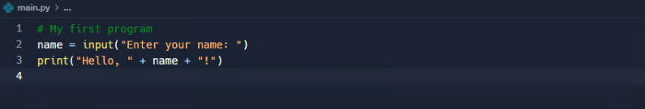
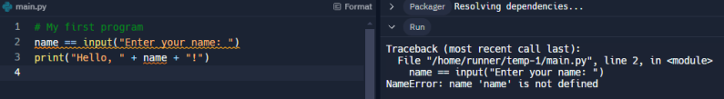
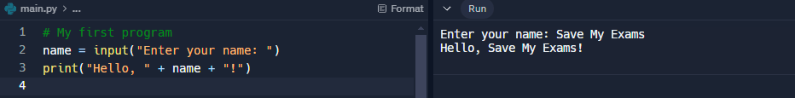

# CAIE Computer Science IGCSE — Chapter ?: Cambridge (CIE) IGCSE Computer Science

---

Your notes 

## Types of Programming Language, Translators & Integrated Development Environments (IDEs) 

## Contents 

Levels of Programming Languages Assembly Language Translators, Compilers & Interpreters Tools & Facilities in IDEs 

© 2026 Save My Exams, Ltd. 

Get more and ace your exams at savemyexams.com 

**1** 

Levels of Programming Languages 

Your notes 

## What is a programming language? 

## Examiner Tips and Tricks 

Cambridge IGCSE 0478 expects you to explain the difference between low-level and high-level languages, and name advantages and disadvantages of each. This page is structured to mirror the format used in real exam questions. 

- A programming language acts as a bridge between what humans understand and what a computer understands 

- Early computers were complex and instructions would have to be in written in binary code, 0s and 1s 

- This process was slow, taking days to program simple tasks 

- Over time, new generations of programming languages have enabled people to become faster and more efficient at writing programs as they resemble human language 

- Generations of programming languages can be split in to two categories: 

   - Low-level 

First generation 

   - Second generation 

- High-level 

Third generation 

## Low-Level Languages What is a low-level language? 

- A low-level language is a programming language that directly translates to machine code understood by the processor 

- Low-level languages allow direct control over hardware components such as memory and registers 

- These languages are written for specific processors to ensure they embed the correct machine architecture 

## First generation 

Machine code is a first-generation language 

© 2026 Save My Exams, Ltd. 

Get more and ace your exams at savemyexams.com 

**2** 

Instructions are directly executable by the processor 

Written in binary code 

Your notes 

## Second generation 

- Assembly code is a second-generation language 

- The code is written using mnemonics, abbreviated text commands such as LDA (Load), STA(Store) 

- Using this language programmers can write human-readable programs that correspond almost exactly to machine code 

One assembly language instruction translates to one machine code instruction 

Needs to be translated into machine code for the computer to be able to execute it 

|Advantages|Disadvantages|
|---|---|
|Complete control over the system components|Difcult to write and understand|
|Occupy less memory and execute faster|Machine dependent|
|Direct manipulation of hardware|More prone to errors|
||Knowledge of computer architecture is key to program efectively|

## Examiner Tips and Tricks 

When describing low-level languages, don’t just say “they are faster” , you must say they allow direct control over hardware or memory, which leads to greater efficiency. Be specific to earn the mark. 

## High-Level Languages 

## What is a high-level language? 

- A high-level programming language uses English-like statements to allow users to program with easy to use code 

- High-level languages allow for clear debugging and once programs are created they are easier to maintain 

- High level languages were needed due to the development of processor speeds and the increase in memory capacity 

© 2026 Save My Exams, Ltd. 

Get more and ace your exams at savemyexams.com 

**3** 

One instruction translates into many machine code instructions 

Needs to be translated into machine code for the computer to be able to execute it Examples of high-level languages include: 

Your notes 

Python Java Basic 

|Advantages|Disadvantages|
|---|---|
|Easier to read and write|The user is not able to directly manipulate the hardware|
|Easier to debug|Needs to be translated to machine code before running|
|Portable so can be used on any computer|The program may be less efcient|
|One line of code can perform multiple commands||

## Examiner Tips and Tricks 

Students sometimes confuse machine code and assembly. Remember: Machine code = binary (1st generation) Assembly = mnemonics (2nd generation, needs assembler) 

© 2026 Save My Exams, Ltd. 

Get more and ace your exams at savemyexams.com 

**4** 

Assembly Language 

Your notes 

## Assembly Language 

## What is assembly language? 

- Assembly language is a second-generation, low-level language designed to simplify the writing of machine code instructions for programmers 

- Programmers use assembly language for the following reasons: 

   - Need to make use of specific hardware or parts of the hardware 

   - To complete specific machine-dependent instructions 

   - To ensure that too much space is not taken up in RAM 

   - To ensure code can be completed much faster 

- Assembly languages allow programmers to program with mnemonics, e.g. 

   - LDA Load - this will ensure a value is added to the accumulator 

   - ADD Addition - this will add the value input or loaded from memory to the value in the accumulator 

   - STO Store - stores the value in the accumulator in RAM 

- Assembly language allowed continuation of working directly with the hardware but removed an element of complexity 

- A mnemonic is received by the computer and it is looked up within a specific table 

- An assembler is needed to check the word so that it can be converted into machine code 

- If a match from the word is found (e.g. STO), the word is replaced with the relevant binary code to match that sequence 

## Worked Example 

Complete the table to identify whether each example of computer code is Highlevel, Assembly language or Machine code 

|Computer code|High-level|Assembly|Machine code|
|---|---|---|---|
|10110111 00110110 11100110||||

© 2026 Save My Exams, Ltd. 

Get more and ace your exams at savemyexams.com 

**5** 

||FOR X = 1 to 10 PRINT x NEXT X||||
|---|---|---|---|---|
||INP X STA X LDA Y||||
||Answer||||
||Computer code|High-level|Assembly|Machine code|
||10110111 00110110 11100110|||X [1 mark]|
||FOR X = 1 to 10 PRINT x NEXT X|X [1 mark]|||
||INP X STA X LDA Y||X [1 mark]||
||||||
||||||

© 2026 Save My Exams, Ltd. 

Get more and ace your exams at savemyexams.com 

**6** 

Translators, Compilers & Interpreters 

Your notes 

## Translators, Compilers & Interpreters 

## What is a translator? 

- A translator is a program that translates program source code into machine code so that it can be executed directly by a processor 

- Low-level languages such as assembly code are translated using an assembler 

- High-level languages such as Python are translated using a compiler or interpreter 

## What is a compiler? 

A compiler translates high-level languages into machine code all in one go 

- Compilers are generally used when a program is finished and has been checked for syntax errors 

- Compiled code can be distributed (creates an executable) and run without the need for translation software 

If compiled code contains any errors, after fixing, it will need re-compiling 

|Advantages|Disadvantages|
|---|---|
|Speed of execution|Can be memory intensive|
|Optimises the code|Difcult to debug|
|Original source code will not be seen|Changes mean it must be recompiled|
||It is designed solely for one specifc processor|

## What is an interpreter? 

An interpreter translates high-level languages into machine code one line at a time 

Each line is executed after translation and if any errors are found, the process stops 

- Interpreters are generally used when a program is being written in the development stage 

- Interpreted code is more difficult to distribute as translation software is needed for it to run 

Advantages Disadvantages 

© 2026 Save My Exams, Ltd. 

Get more and ace your exams at savemyexams.com 

**7** 

|Stops when it fnds a specifcsyntax errorin the code|Slower execution||Your notes|
|---|---|---|---|
|Easier to debug|Every time the program is run it has to be translated|||
|Require less RAM to process the code|Executed as is, no optimisation|||

## Worked Example 

A computer program is written in a high-level programming language. 

- (a) State why the computer needs to translate the code before it is executed.[1] 

- (b) Either a compiler or an interpreter can translate the code. Describe two differences between how a compiler and an interpreter would translate the code.[2] 

## How to answer this question 

   - (a) what time of language does a computer understand? 

- (b) the keyword is 'how' 

- Answer 

## (a) 

To convert it to binary/machine code The processor can only understand machine code 

## (b) 

Compiler translates all the code in one go... ...whereas an interpreter translates one line at a time Compiler creates an executable... ...whereas an interpreter does not/executes one line at a time Compiler reports an error at the end... ...whereas an interpreter stops when it finds an error 

© 2026 Save My Exams, Ltd. 

Get more and ace your exams at savemyexams.com 

**8** 

Tools & Facilities in IDEs 

Your notes 

## Tools & Facilities in IDEs 

## What is an IDE? 

- An Integrated Development Environment (IDE) is software designed to make writing high-level languages more efficient 

- IDEs include tools and facilities to make the process of creating/maintaining code easier, such as: 

Editor 

Error diagnostics 

Run-time environment 

Translators 

## Editor 

An editor gives users an environment to write, edit and maintain high-level code 

Editors can provide: 

- Basic code formatting tools - changing the font, size of the font and making text bold etc 

- Prettyprint - using colour to make it easier to identify keywords, for example ' print ', ' input ' and ' if ' in Python 

- Code editing - auto-completion and auto-correction of code, bracket matching and syntax checks 

- Commenting code - allows sections of code to be commented out easily to stop it from being run or as comments on what the program is doing 

## Error-diagnostics 

© 2026 Save My Exams, Ltd. 

Get more and ace your exams at savemyexams.com 

**9** 

Your notes 

Tools that help to identify, understand and fix errors in code, such as: 

- Identifying errors - highlight particular areas of code or provide direct error messages where the error may have appeared e.g. indentation errors etc 

Debugger -  provide a 'step through' command which provides step by step instructions and shows what is happening to the code line by line, useful for finding logic errors 

## Run-time environment 

Gives users the ability to run and see the corresponding output of a high-level language 

## Translator 

Built in to compile or interpret code without the need for an extra piece of software 

© 2026 Save My Exams, Ltd. 

Get more and ace your exams at savemyexams.com 

**10** 

