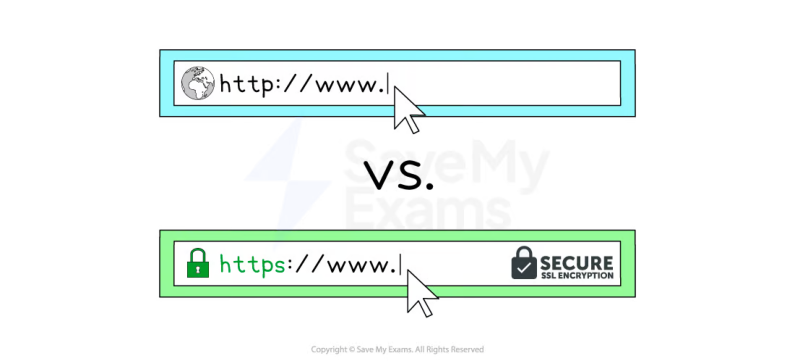

# CAIE Computer Science IGCSE — Chapter ?: Cambridge (CIE) IGCSE Computer Science

---

Your notes 

## The Internet & the World Wide Web 

## Contents 

The Internet & the World Wide Web Network Protocols Web Browser Web Pages Cookies 

© 2026 Save My Exams, Ltd. 

Get more and ace your exams at savemyexams.com 

**1** 

Your notes 

## The Internet & the World Wide Web 

## The Internet & the World Wide Web 

## What is the Internet? 

## Examiner Tips and Tricks 

Cambridge IGCSE 0478 expects you to clearly differentiate between the Internet and the World Wide Web. This page is written to match the definitions and phrasing found in mark schemes. 

The Internet is a global network of networks 

The Internet is the most well-known Wide Area Network (WAN) 

The Internet is the infrastructure used to provide connectivity to the World Wide Web 

## What is the World Wide Web? 

The world wide web, or simply the web, is a collection of websites and web pages that are accessed using the internet 

- It was created in 1989 by Tim Berners-Lee, who envisioned it as a way to share and access information on a global scale 

- The web consists of interconnected documents and multimedia files that are stored on web servers around the world 

- Web pages are accessed using a web browser, which communicates with web servers to retrieve and display the content 

## Examiner Tips and Tricks 

Students often say the web is the Internet. It’s not, the Internet includes email, FTP, VoIP, and other services too, not just websites. 

© 2026 Save My Exams, Ltd. 

Get more and ace your exams at savemyexams.com 

**2** 

Network Protocols 

Your notes 

## HTTP & HTTPS 

## What is HTTP & HTTPS? 

## Examiner Tips and Tricks 

Cambridge IGCSE 0478 expects you to explain the difference between HTTP and HTTPS, including the role of encryption in protecting sensitive data. This page covers only what you need to know to get the marks. 

Hypertext Transfer Protocol (HTTP) allows communication between clients and servers for website viewing 

HTTP & HTTPS are protocols, a set of rules governing communication between devices on a network 

HTTP allows clients to receive data from the server (fetching a webpage) and send data to the server (submitting a form, uploading a file) 

HTTPS works in the same way as HTTP but with an added layer of security 

All data sent and received using HTTPS is encrypted 

HTTPS is used to protect sensitive information such as passwords, financial information and personal data 

## Examiner Tips and Tricks 

© 2026 Save My Exams, Ltd. 

Get more and ace your exams at savemyexams.com 

**3** 

A common 2−mark question is: “Describe one difference between HTTP and HTTPS.” To get both marks, say: 

Your notes 

“HTTPS encrypts the data being transmitted to keep it secure, unlike HTTP.” 

© 2026 Save My Exams, Ltd. 

Get more and ace your exams at savemyexams.com 

**4** 

Your notes 

## Web Browser 

## Web Browser 

## What is a web browser? 

A web browser is a piece of software used to access and display information on the internet 

A web browser displays web pages by rendering hypertext markup language (HTML) 

Web browsers interpret the code in HTML documents and translate it into a visual display for the user 

## Functions of a web browser 

|Function|Description|
|---|---|
|Provide navigation tools|E.g. back/forward buttons and home button, to help users move between pages|
|Storing bookmarks & favourites|Allow users to save links to frequently visited websites and access them easily|
|Storing cookies|Cookies|
|Record user history|Allow users to quickly revisit recently viewed web pages|
|Provide address bar|A place for user to type in the URL (link to URL page) of a web page to visit|
|Multiple tabs|Allow multiple web pages to be open at once so users can quickly switch between them|

## Examiner Tips and Tricks 

Rendering HTML is how a web browser displays web pages, but in CIE IGCSE exams, questions about functions usually expect user-facing features such as navigation tools, bookmarks, tabs, or cookies. 

© 2026 Save My Exams, Ltd. 

Get more and ace your exams at savemyexams.com 

**5** 

Web Pages 

Your notes 

## Loading a Web Page 

## How is a web page loaded? 

- Web pages are held on web servers (1), known as 'hosting' 

- To access a web page on a web server, a web browser is used 

- In the browser, a user enters a web page URL (2) 

- The browser sends the domain name to a DNS (3) 

- The browser connects to the web server and requests to access the page 

- HTML (4) is transferred and rendered by the browser, displaying the web page 

## Web Servers (1) What is a web server? 

- A web server is a remote computer that stores the files needed to display a web page on the Internet 

- Web servers are generally available 24/7 and security is managed by the owner of the hardware 

- Web servers provide access to multiple users at the same time 

## Uniform Resource Locator (URL) (2) 

## What is a URL? 

- A Uniform Resource Locator (URL) is a unique identifier for a web page, known as the website address 

- It is text based to make it easier to remember 

- A user enters a URL into a web browser to view a web page 

- An example of a URL is: 

https://www.savemyexams.com/igcse/computer-science/cie/23/revision-notes/ 

- A URL can typically be split into three parts: 

   - Protocol 

   - Domain name 

Web page/file name 

© 2026 Save My Exams, Ltd. 

Get more and ace your exams at savemyexams.com 

**6** 

Using the example about the URL would be split as follows: 

|Protocol|https|Communication method to transfer data between client and server|
|---|---|---|
|Domain name|www.savemyexams.com|Name of the server where the resource is located|
|Web page/fle name|/igcse/computer- science/cie/23/revision-notes/|Location of the fle or resources on the server|

Your notes 

## Domain Name System (DNS) (3) 

## What is a DNS? 

- The Domain Name System (DNS) can be thought of as the Internet's equivalent to a phone book 

It is essentially a directory of domain names and is used to translate human-readable domain names to the numeric  IP addresses that computers use 

When you type a URL into your browser, the DNS translates the domain name into its associated IP address so your computer can connect to the server hosting the website Without DNS, we would have to remember the IP address of every site we want to visit 

## HTML (4) 

## What is HTML? 

- Hypertext Markup Language (HTML), is the foundational language used to structure and present content on the web 

HTML consists of a series of elements, often referred to as "tags" 

- Most tags are opened and closed e.g. <html> and </html> , whereas some tags are only opened e.g.  and <link> 

## Structure 

HTML is used to define the basic structure of a webpage by organising content into sections such as headers, paragraphs, and footers 

The <html> tag is the root element of an HTML page and includes all other HTML elements used to create a page structure 

<!DOCTYPE html> 

<html> 

<head> <title>My Web Page</title> </head> <body> 

© 2026 Save My Exams, Ltd. 

Get more and ace your exams at savemyexams.com 

**7** 

<header> <h1>Welcome to My Website</h1> </header> <main> <section> <h2>About Me</h2> 
This is a paragraph about me.
 </section> <section> <h2>My Projects</h2> 
This is a paragraph about my projects.
 </section> </main> <footer> 
Contact: myemail@example.com
 </footer> </body> </html> 

Your notes 

- In this example, HTML is used to create a structure with a header, two sections in the main body, and a footer 

Other examples of HTML being used for structure include: 

- Creating lists to structure information 

- Positioning of text on the screen 

Embedding media and interactive elements 

## Present 

HTML is also used to present and display information in a visually meaningful way 

- The content layer of a web page is made up of HTML elements such as headings ( <h1>, <h2> , etc.), paragraphs ( 
 ), links ( <a> ), images (  ), and more 

This layer is mainly handled by CSS (Cascading Style Sheets) 

<!DOCTYPE html> 

<html> 

<body> 

<h1>Welcome to My Website</h1> 

This is a paragraph introducing the content of the website.
 

## <h2>Subheading 1</h2> 

Here is some detailed information under the first subheading.
 

## <h2>Subheading 2</h2> 

Another section with more information.
 

<strong>Bold text</strong> and <em>italic text</em> can emphasise important points.
 </body> 

</html> 

- In this example, headings ( <h1> , <h2> ) and text formatting tags ( <strong> , <em> ) are used to present the content clearly and with emphasis 

Other examples of HTML being used to present information include: 

© 2026 Save My Exams, Ltd. 

Get more and ace your exams at savemyexams.com 

**8** 

Presenting data in a table 

Displaying images with captions 

Your notes 

## Worked Example 

A company sells products over the Internet. 

Explain how the information stored on the company’s website is requested by the customer, sent to the customer’s computer and displayed on the screen. 

[7] 

## Answer 

## Seven from: 

## Requested 

## a web browser is used 

user enters the URL / web address (into the address bar) // clicks a link containing the web address // clicks an element of the webpage 

the URL / web address specifies the protocol 

protocols used are Hyper Text Transfer Protocol (HTTP) / Hyper Text Transfer Protocol Secure (HTTPS) 

## Sent 

the URL / web address contains the domain name 

the domain name is used to look up the IP address of the company the domain name server (DNS) stores an index of domain names and IP addresses web browser sends a request to the web server / IP address 

## Received 

Data for the website is stored on the company’s web server webserver sends the data for the website back to the web browser web server uses the customer’s IP address to return the data the data is transferred into Hyper Text Mark-up Language (HTML) HTML is interpreted/rendered by the web browser (to display the website) 

© 2026 Save My Exams, Ltd. 

Get more and ace your exams at savemyexams.com 

**9** 

Your notes 

## Cookies 

## Cookies 

## What is a cookie? 

A cookie is a tiny data file stored on a computer by browser software that holds information relating to your browsing activity 

- Typically a cookie will contain: 

   - Browsing history - what websites you have visited 

   - Login information - usernames & passwords 

   - Preferences - language/font size/themes 

- The two types of cookie are session cookies and persistent cookies 

## Examiner Tips and Tricks 

Cambridge IGCSE 0478 expects you to describe the purpose of cookies, differentiate between session and persistent types, and explain the legal requirement for user consent. This page covers exactly what examiners test, no extra fluff. 

## Session cookies 

- Stored in RAM 

- Created each time a user visits a website 

- Automatically deleted when the browser is closed 

- Used to track activity during a single browsing session, such as items in a shopping basket 

## Persistent cookies 

- Stored on the hard drive 

- Created the first time a user visits a website 

- Remain on the device until they expire or are manually deleted 

- Used to remember login details and user preferences across multiple visits 

Session cookie Persistent cookie 

© 2026 Save My Exams, Ltd. 

Get more and ace your exams at savemyexams.com 

**10** 

|Where stored|RAM|Hard drive||Your notes|
|---|---|---|---|---|
|When deleted|When browser is closed|When expired or manually deleted|||
|Purpose|Track current session activity|Remember preferences and login details across visits|||

## Examiner Tips and Tricks 

Examiners are looking for what cookies do, not whether you think they are good or bad. Focus on their purpose: storing login info, preferences, and session data, not "tracking users" or "spying." When asked to compare the two types, always reference where they are stored and when they are deleted as these are the details that earn marks. 

© 2026 Save My Exams, Ltd. 

Get more and ace your exams at savemyexams.com 

**11** 

