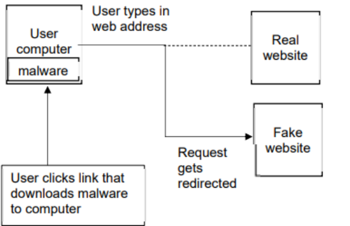
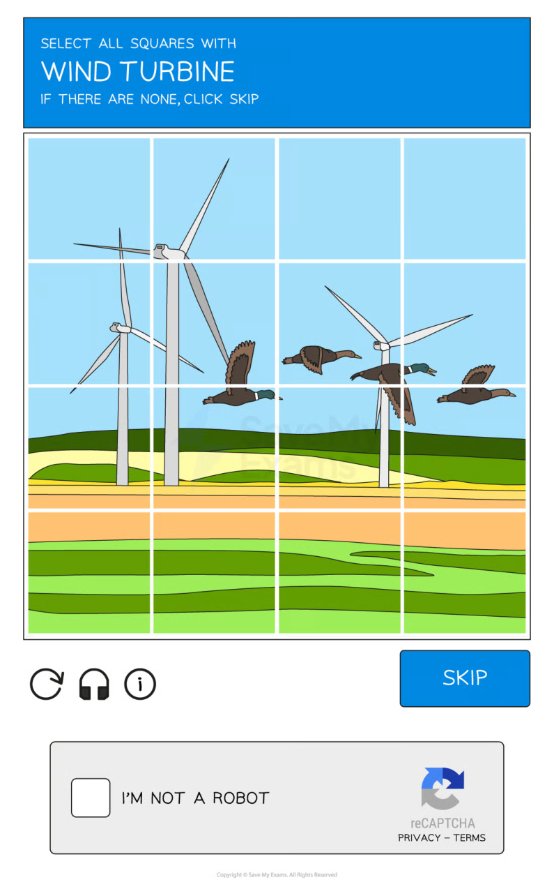

# CAIE Computer Science IGCSE — Chapter ?: Cambridge (CIE) IGCSE Computer Science

---

Your notes 

## Cyber Security 

## Contents 

Cyber Security Threats Keeping Data Safe 

© 2026 Save My Exams, Ltd. 

Get more and ace your exams at savemyexams.com 

**1** 

Cyber Security Threats 

Your notes 

## Forms of cyber security threat 

- Computers face a variety of forms of attack and they can cause a large number of issues for a network and computers 

- The main threats posed are: 

   - Brute-force attacks 

   - Data interception & theft 

   - DDos attack 

   - Hacking 

   - Malware 

   - Pharming 

   - Phishing 

Social engineering 

## Brute Force Attack What is a brute-force attack? 

- A brute force attack works by an attacker repeatedly trying multiple combinations of a user's password to try and gain unauthorised access to their accounts or devices 

- An example of this attack would be an attacker finding out the length of a PIN code, for example, 4−digits 

- They would then try each possible combination until the pin was cracked, for example 

0001 0002 

A second form of this attack, commonly used for passwords is a dictionary attack 

- This method tries popular words or phrases for passwords to guess the password as quickly as possible 

- Popular words and phrases such as 'password', '1234' and 'qwerty' will be checked extremely quickly. 

## Data interception 

## What is data interception & theft? 

© 2026 Save My Exams, Ltd. 

Get more and ace your exams at savemyexams.com 

**2** 

Your notes 

- Data interception and theft is when thieves or hackers can compromise usernames and passwords as well as other sensitive data 

- This is done by using devices such as a packet sniffer 

- A packet sniffer will be able to collect the data that is being transferred on a network 

- A thief can use this data to gain unauthorised access to websites, companies and more 

## DDoS Attack 

## What is a DDoS attack? 

- A Distributed Denial of Service Attack (DDoS attack) is a large scale, coordinated attack designed to slow down a server to the point of it becoming unusable 

- A server is continually flooded with requests from multiple distributed devices preventing genuine users from accessing or using a service 

- A DDoS attack uses computers as 'bots', the bots act as automated tools under the attackers control, making it difficult to trace back to the original source 

- A DDoS attack can result in companies losing money and not being able to carry out their daily duties 

- A DDoS attack can cause damage to a company's reputation 

## Hacking 

## What is hacking? 

- Hacking is the process of identifying and exploiting weaknesses in a computer system or network to gain unauthorised access 

- Access can be for various malicious purposes, such as stealing data, installing malware, or disrupting operations 

- Hackers seek out opportunities that make this possible, this includes: 

Unpatched software 

Out-of-date anti-malware 

## Malware 

## What is malware? 

- Malware (malicious software) is the term used for any software that has been created with malicious intent to cause harm to a computer system 

- Examples of issues caused by malware include 

Files being deleted, corrupted or encrypted 

Internet connection becoming slow or unusable 

© 2026 Save My Exams, Ltd. Get more and ace your exams at savemyexams.com 

**3** 

|||
|---|---|
|Computercrashingorshutting down There are various types of malware and each has slightly diferent issues which they cause||
|Malware|What it Does|
|Virus|Contains code that willreplicateand causeunwanted and unexpected eventsto occur Examples of issues a user may experience are Corruptfles Deletedata Preventapplications from running correctly|
|Worms|Very similar to viruses, main diference being that theyspread to other drivesandcomputerson the network Worms can infect other computers from Infected websites Instant message services Email Network connection|
|Trojan|Sometimes called aTrojan Horse Trojansdisguisethemselves as legitimatesoftware but contain maliciouscode in the background|
|Spyware|Allow a person tospyon the users'activitieson their devices Embedded into other software such as games or programs that have been downloaded fromillegitimate sources Canrecordyour screen, log yourkeystrokesto gain access to passwordsand more|
|Adware|Displaysadvertsto the user Users havelittle or no controlover thefrequencyortypeof ads Canredirect clicksto unsafe sites that contain spyware|
|Ransomware|Locks your computer or device andencryptsyour documents and other important fles Ademand is made for moneyto receive the password that will allow the user to decrypt the fles|

Your notes 

© 2026 Save My Exams, Ltd. 

Get more and ace your exams at savemyexams.com 

**4** 

No guarantee paying the ransom will result in the user getting their data back 

## Pharming 

## What is pharming? 

- Pharming is typing a website address into a browser and it being redirected to a 'fake' website in order to trick a user into typing in sensitive information such as passwords 

- An attacker attempts to alter DNS settings, the directory of websites and their matching IP addresses that is used to access websites on the internet or change a users browser settings 

A user clicks a link which downloads malware 

The user types in a web address which is then redirected to the fake website 

## How can you protect against it? 

To protect against the threat of pharming: 

Keep anti-malware software up to date 

- Check URLs regularly 

Make sure the padlock icon is visible 

## Phishing 

## What is phishing? 

Phishing is the process of sending fraudulent emails/SMS to a large number of people, claiming to be from a reputable company or trusted source 

- Phishing is an attempt to try and gain access to your details, often by coaxing the user to click on a login button/link 

© 2026 Save My Exams, Ltd. 

Get more and ace your exams at savemyexams.com 

**5** 

Your notes 

## Social Engineering 

## What is social engineering? 

Social engineering is exploiting weaknesses in a computer system by targeting the people that use or have access to them 

There are many forms of social engineering, some examples include 

Fraudulent phone calls: pretending to be someone else to gain access to their account or their details 

Pretexting: A scammer will send a fake text message, pretending to be from the government or human resources of a company, this scam is used to trick an individual into giving out confidential data 

People are seen as the weak point in a system because human errors can lead to significant issues, some of which include: 

Not locking doors to computer/server rooms 

Not logging their device when they're not using it 

- Sharing passwords 

- Not encrypting data 

Not keeping operating systems or anti-malware software up to date 

## Worked Example 

A company is concerned about a distributed denial of service (DDoS) attack. 

- (i) Describe what is meant by a DDoS attack. 

[4] 

(ii) Suggest one security device that can be used to help prevent a DDoS attack.[1] 

## Answers 

## (i) Any four from: 

multiple computers are used as bots 

designed to deny people access to a website 

a large number / numerous requests are sent (to a server) … 

- … all at the same time 

the server is unable to respond / struggles to respond to all the requests the server fails / times out as a result. 

## (ii) 

firewall OR proxy server 

© 2026 Save My Exams, Ltd. 

Get more and ace your exams at savemyexams.com 

**6** 

Keeping Data Safe 

Your notes 

## Access Levels 

## What are access levels? 

- Access levels ensure users of a network can access what they need to access and do not have access to information/resources they shouldn't 

Users can have designated roles on a network 

Access levels can be set based on a user's role, responsibility, or clearance level 

Full access - this allows the user to open, create, edit & delete files 

- Read-only access - this only allows the user to open files without editing or deleting 

No access - this hides the file from the user 

Some examples of different levels of access to a school network could include: 

- Administrators: Unrestricted - Can access all areas of the network 

- Teaching Staff: Partially restricted - Can access all student data but cannot access other staff members' data 

Students: Restricted - Can only access their own data and files 

Users and groups of users can be given specific file permissions 

## Anti Malware 

## What is anti-malware software? 

Anti-malware software is a term used to describe a combination of different software to prevent computers from being susceptible to viruses and other malicious software 

The different software anti-malware includes are 

- Anti-virus 

- Anti-spam 

Anti-spyware 

## How does anti-malware work? 

- Anti-malware scans through email attachments, websites and downloaded files to search for issues 

- Anti-malware software has a list of known malware signatures to block immediately if they try to access your device in any way 

© 2026 Save My Exams, Ltd. Get more and ace your exams at savemyexams.com 

**7** 

Your notes 

Anti-malware will also perform checks for updates to ensure the database of known issues is up to date 

## Authentication 

## What is authentication? 

Authentication is the process of ensuring that a system is secure by asking the user to complete tasks to prove they are an authorised user of the system 

Authentication is done because bots can submit data in online forms 

Authentication can be done in several ways, these include 

- Usernames and passwords 

- Multi-factor authentication 

CAPTCHA - see example below 

© 2026 Save My Exams, Ltd. 

Get more and ace your exams at savemyexams.com 

**8** 

Your notes 

Biometrics 

© 2026 Save My Exams, Ltd. 

Get more and ace your exams at savemyexams.com 

**9** 

- Biometrics use biological data for authentication by identifying unique physical characteristics of a human such as fingerprints, facial recognition, or iris scans 

Your notes 

Biometric authentication is more secure than using passwords as: 

- A biometric password cannot be guessed 

- It is very difficult to fake a biometric password 

- A biometric password cannot be recorded by spyware 

A perpetrator cannot shoulder surf to see a biometric password 

## Automating Software Updates 

## What are automatic software updates? 

Automatic software updates take away the need for a user to remember to keep software updated and reduce the risk of software flaws/vulnerabilities being targeted in out of date software 

Automatic updates ensure fast deployment of updates as they release 

## Communication 

## What is communication? 

One way of protecting data is by monitoring digital communication to check for errors in the spelling and grammar or tone of the communication 

Phishing scams often involve communication with users, monitoring it can be effective as: 

Rushed - emails and texts pretending to be from a reputable company are focused on quantity rather than quality and often contain basic spelling and grammar errors 

- Urgency - emails using a tone that creates panic or makes a user feel rushed is often a sign that something is suspicious 

- Professionalism - emails from reputable companies should have flawless spelling and grammar 

## URL 

## How to check a URL? 

Checking the URL attached to a link is another way to prevent phishing attacks 

Hackers often use fake URLs to trick users into visiting fraudulent websites 

## e.g. http://amaz.on.co.uk/ rather than http://amazon.co.uk/ 

If you are unsure, always check the website URL before clicking any links contained in an email 

© 2026 Save My Exams, Ltd. 

Get more and ace your exams at savemyexams.com 

**10** 

Your notes 

## Firewalls 

## What is a firewall? 

- A firewall monitors incoming and outgoing network traffic and uses a set of rules to determine which traffic to allow 

- A firewall prevents unwanted traffic from entering a network by filtering requests to ensure they are legitimate 

- It can be both hardware and software and they are often used together to provide stronger security to a network 

   - Hardware firewalls will protect the whole network and prevent unauthorised traffic 

   - Software firewalls will protect the individual devices on the network, monitoring the data going to and from each computer 

## What form of attack would this prevent? 

- Hackers 

- Malware 

- Unauthorised access to a network 

## Privacy Settings 

## What are privacy settings? 

- Privacy settings are used to control the amount of personal information that is shared online 

- They are an important measure to prevent identity theft and other forms of online fraud 

- Users should regularly review their privacy settings and adjust them as needed 

## Proxy Servers 

## What is a proxy server? 

- A proxy-server is used to hide a user's IP address and location, making it more difficult for hackers to track them 

- They act as a firewall and can also be used to filter web traffic by setting criteria for traffic 

- Malicious content is blocked and a warning message can be sent to the user 

- Proxy-servers are a useful security measure for protecting against external security threats as it can direct traffic away from the server 

## SSL 

© 2026 Save My Exams, Ltd. 

Get more and ace your exams at savemyexams.com 

**11** 

## What is SSL? 

Secure Socket Layer (SSL) is a security protocol which is used to encrypt data transmitted over the internet 

Your notes 

This helps to prevent eavesdropping and other forms of interception 

SSL is widely used to protect online transactions, such as those involving credit card information or other sensitive data 

It works by sending a digital certificate to the user’s browser 

This contains the public key which can be used for authentication 

Once the certificate is authenticated, the transaction will begin 

## Worked Example 

(i) ) Identify a security solution that could be used to protect a computer from a computer virus, hacking and spyware. 

Each security solution must be different 

|Threat|Threat|Security solution|
|---|---|---|
|Computer virus|||
|Hacking|||
|Spyware|||
|[3] (ii) Describe how each security solution you identifed in (i) will help protect the computer. [6] Answers (i)|||
|Threat|Security solution||
|Computer virus|Anti-malware/virus (software) Firewall||
|Hacking|Firewall Passwords Biometrics Two-step verifcation||

© 2026 Save My Exams, Ltd. 

Get more and ace your exams at savemyexams.com 

**12** 

Spyware Anti-malware/virus (software) Two-step verification Your notes Firewall (ii) Two marks for each description Anti-malware/virus (software) Scans the computer system (for viruses) Has a record of known viruses Removes/quarantines any viruses that are found Checks data before it is downloaded … and stops download if virus found/warns user may contain virus Anti-malware/spyware (software) Scans the computer for spyware Removes/quarantines any spyware that is found Can prevent spyware being downloaded Firewall Monitors traffic coming into and out of the computer system Checks that the traffic meets any criteria/rules set Blocks any traffic that does not meet the criteria/rules set // set blacklist/whitelist Passwords Making a password stronger // by example Changing it regularly Lock out after set number of attempts // stops brute force attacks // makes it more difficult to guess Biometrics Data needed to enter is unique to individual … therefore it is very difficult to replicate Lock out after set number of attempts Two-step verification Extra data is sent to device, pre-set by user … making it more difficult for hacker to obtain it Data has to be entered into the same system … so if attempted from a remote location, it will not be accepted 

© 2026 Save My Exams, Ltd. 

Get more and ace your exams at savemyexams.com 

**13** 

