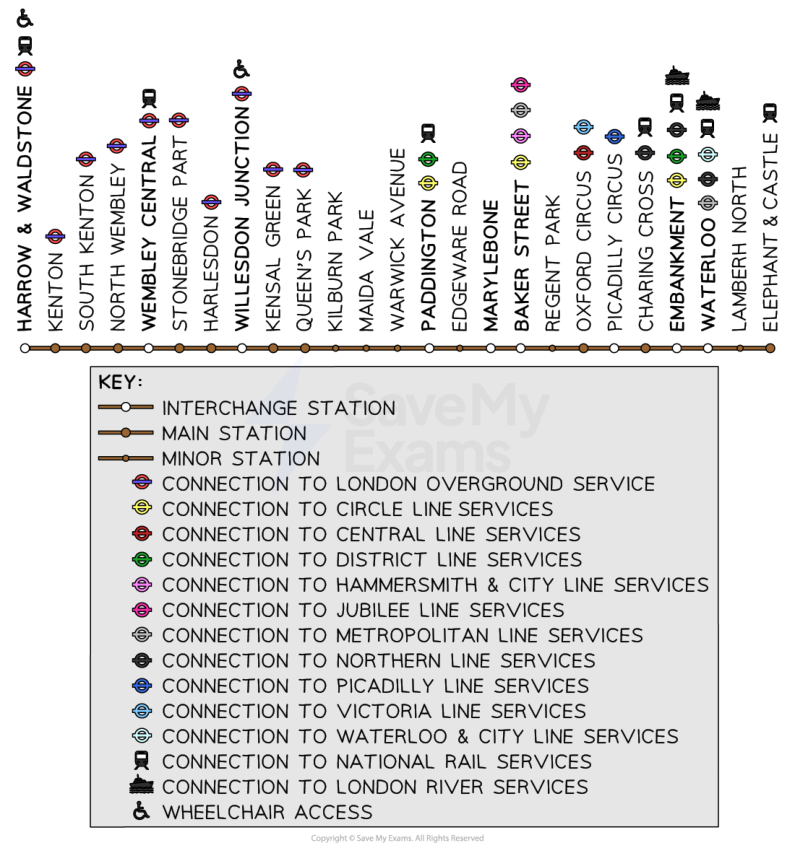
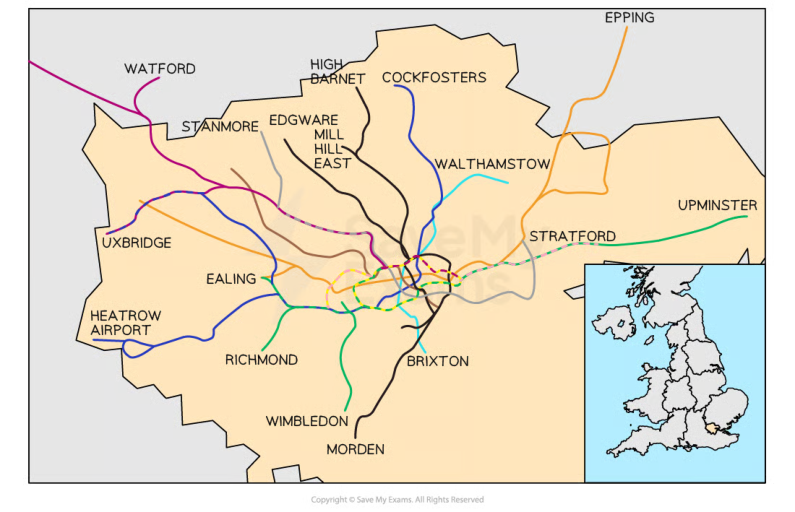

# CAIE Computer Science IGCSE — Chapter ?: Cambridge (CIE) IGCSE Computer Science

---

Your notes 

## Development Life Cycle 

## Contents 

Program Development Life Cycle 

© 2026 Save My Exams, Ltd. 

Get more and ace your exams at savemyexams.com 

**1** 

Your notes 

## Program Development Life Cycle 

## Analysis 

## What is the analysis stage of the program development life cycle? 

The analysis stage of the program development life cycle is to precisely understand the problem the program is intended to solve 

## What role does abstraction play in the analysis? 

Abstraction is the act of removing unimportant details from the problem to focus on important elements such as: 

## Core functionality 

## Requirements 

An example of abstraction would be the London underground train route map; travellers do not need to know the geographical layout of the routes, only that getting on at stop A will eventually transport you to stop B 

© 2026 Save My Exams, Ltd. 

Get more and ace your exams at savemyexams.com 

**2** 

Your notes 

© 2026 Save My Exams, Ltd. 

Get more and ace your exams at savemyexams.com 

**3** 

## Core functionality 

- Using abstraction helps to identify the fundamental components of what the program is going to solve 

Your notes 

- Before tackling a problem, it needs to be clearly understood by everyone working on it 

- The overall goal of the solution needs to be agreed as well as any constraints such as limited resources or requiring a platform specific solution 

## Requirements 

- To create a solution, a requirements document is created to define the problem and break it down into clear, manageable, understandable parts by using abstraction and decomposition 

- A requirements document labels each requirement, gives it a description as well as success criteria which state how we know when the requirement has been achieved 

## Design 

## What is the design stage of the program development life cycle? 

- The design stage of the program development life cycle involves using techniques to come up with a blueprint for a solution 

- Ways the design of a solution to a problem can be presented include: 

Structure diagrams 

- Flowchart 

- Pseudocode 

## Coding 

## What is the coding stage of the program development life cycle? 

- Developers begin programming modules  in a suitable programming language that works together to provide an overall solution to the problem 

- As each developer programs, they perform iterative testing 

   - Iterative testing is where each module is tested and debugged thoroughly to make sure it interacts correctly with other modules and accepts data without crashing or causing any errors 

- Developers may need to retest modules as new modules are created and changed to make sure they continue to interact correctly and do not cause errors 

## Testing 

© 2026 Save My Exams, Ltd. 

Get more and ace your exams at savemyexams.com 

**4** 

Your notes 

## What is the testing stage of the program development life cycle? 

Once the overall program or set of programs is created, they are run many times using varying sets of test data 

This ensures the program or programs work as intended as outlined in the initial requirements specification and design and rejects any invalid data that is input 

Examples of test data include alphanumeric sequences to test password validation routines 

© 2026 Save My Exams, Ltd. 

Get more and ace your exams at savemyexams.com 

**5** 

