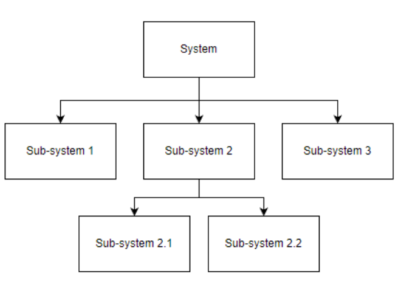
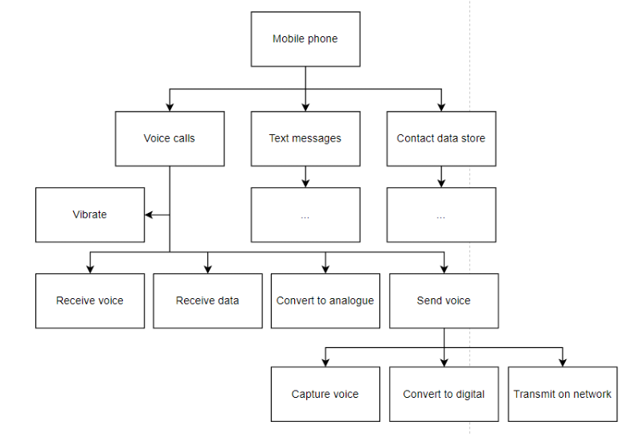
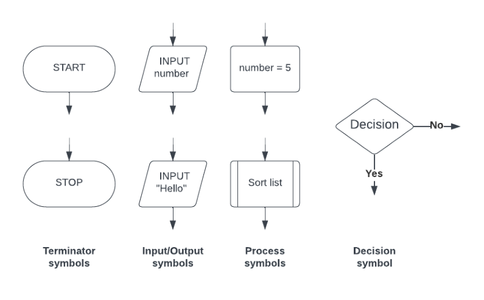
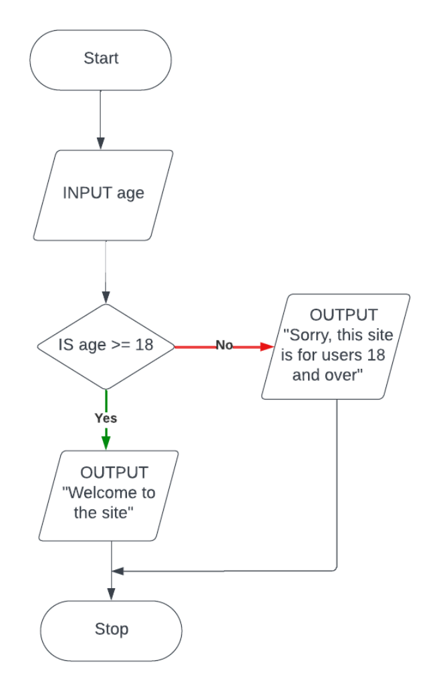
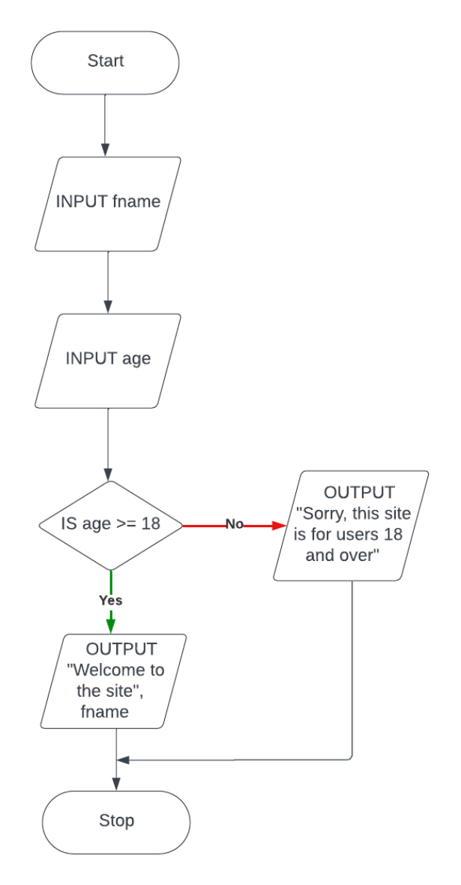

# CAIE Computer Science IGCSE — Chapter ?: Cambridge (CIE) IGCSE Computer Science

---

Your notes 

## Algorithms 

## Contents 

Designing Algorithms Explaining Algorithms 

© 2026 Save My Exams, Ltd. 

Get more and ace your exams at savemyexams.com 

**1** 

Designing Algorithms 

Your notes 

## What is an algorithm? 

## Examiner Tips and Tricks 

Cambridge IGCSE 0478 assesses your ability to understand, write, and interpret algorithms using pseudocode, flowcharts, and structured design. This page gives examples in the format and style seen in Paper 2, focusing only on examinable methods. 

An algorithm is precise set of rules or instructions to solve a specific problem or task 

There are three main ways to design an algorithm 

Structure diagrams 

Flowchart 

Pseudocode 

## Structure Diagrams 

## What is a structure diagram? 

Structure diagrams show hierarchical top-down design in a visual form 

- Each problem is divided into sub-problems and each sub-problem divided into further sub-problems 

At each level the problem is broken down into more detailed tasks that can be implemented using a single subroutine 

© 2026 Save My Exams, Ltd. 

Get more and ace your exams at savemyexams.com 

**2** 

Your notes 

an example of a structure diagram for a mobile application could be: 

## Flowcharts 

## What is a flowchart? 

Flowcharts are a visual tool that uses shapes to represent different functions to describe an algorithm 

© 2026 Save My Exams, Ltd. 

Get more and ace your exams at savemyexams.com 

**3** 

Flowcharts show the data that is input and output, the processes that take place and any decisions or repetition 

Your notes 

Lines are used to show the flow of control 

## Example 

Flowchart 

© 2026 Save My Exams, Ltd. 

Get more and ace your exams at savemyexams.com 

**4** 

Your notes 

The casino would like the algorithm refined so that the user also enters their first name and this is used to greet the user when they access the site 

Flowchart 

© 2026 Save My Exams, Ltd. 

Get more and ace your exams at savemyexams.com 

**5** 

Your notes 

## Pseudocode 

What is pseudocode? 

© 2026 Save My Exams, Ltd. 

Get more and ace your exams at savemyexams.com 

**6** 

Pseudocode is a text-based tool that uses short English words/statements to describe an algorithm 

Your notes 

Pseudocode is more structured than writing sentences in English but is very flexible 

## Example 

A casino would like a program that asks users to enter an age, if they are 18 or over they can enter the site, if not then they are given a suitable message 

Pseudocode 

INPUT Age IF Age >= 18 THEN OUTPUT "Welcome to the site" ELSE OUTPUT "Sorry, this site is for users 18 and over" ENDIF 

## Examiner Tips and Tricks 

Pseudocode is not real code—don’t use syntax like print() or input() with brackets. Stick to simple statements like: 

INPUT Age 

OUTPUT "Welcome" 

Adding actual language syntax can lose you marks. 

The casino would like the algorithm refined so that the user also enters their first name and this is used to greet the user when they access the site 

## Pseudocode 

INPUT FName INPUT Age IF Age >= 18 THEN OUTPUT "Welcome to the site", FName ELSE OUTPUT "Sorry, this site is for users 18 and over" ENDIF 

## Examiner Tips and Tricks 

© 2026 Save My Exams, Ltd. 

Get more and ace your exams at savemyexams.com 

**7** 

If the question asks you to write an algorithm, default to pseudocode. Use flowcharts only when asked or when visual logic helps. Examiners reward clarity, not decoration. 

Your notes 

© 2026 Save My Exams, Ltd. 

Get more and ace your exams at savemyexams.com 

**8** 

Explaining Algorithms 

Your notes 

## Explaining Algorithms 

## How do you explain an algorithm? 

A well designed algorithm should be able to be interpreted by a new user and they should be able to explain what it does 

Algorithms can be written using flowcharts, pseudocode or high-level programming language code such as Python 

The purpose of an algorithm is to solve a problem, if a user does not know the goal of the algorithm, then following the algorithm instructions should make its purpose clear 

If the algorithm is complex then additional ways to understand the problem could be: 

Look for comments in the code 

Consider the context of where the algorithm is being used 

Test the algorithm with different inputs 

Look at the following algorithm, can you explain what it does? 

## Pseudocode 

Count ← 1 Number ← 0 Total ← 0 REPEAT INPUT Number Total ←  Total + Number Count ← Count + 1 UNTIL Count > 10 OUTPUT Total 

The purpose of the algorithm is to add ten user-entered numbers together and output the total 

The processes are: 

initializing three variables (Count, Number, Total) inputting a user number 

adding to two variables (Total, Count) repeating nine more times outputting the final Total value 

© 2026 Save My Exams, Ltd. 

Get more and ace your exams at savemyexams.com 

**9** 

## Worked Example 

The pseudocode algorithm shown has been written by a teacher to enter marks for the students in her class and then to apply some simple processing. 

Your notes 

Count ← 0 REPEAT INPUT Score[Count] IF Score[Count] >= 70 THEN Grade[Count] ← "A" ELSE IF Score[Count] >= 60 THEN Grade[Count] ← "B" ELSE IF Score[Count] >= 50 THEN Grade[Count] ← "C" ELSE IF Score[Count] >= 40 THEN Grade[Count] ← "D" ELSE IF Score[Count] >= 30 THEN Grade[Count] ← "E" ELSE Grade[Count] ← "F" ENDIF ENDIF ENDIF ENDIF ENDIF Count ← Count + 1 UNTIL Count = 30 

Describe what happens in this algorithm. 

[3] 

## Answer 

Any 3 of: 

Inputted marks are stored in the array Score[] [1] Marks are then checked against a range of boundaries [1] A matching grade is assigned to each mark that has been input [1] The grade is then stored in the array Grade[] [1] At the same index as the inputted mark [1] The algorithm finishes after 30 marks have been input [1] 

© 2026 Save My Exams, Ltd. 

Get more and ace your exams at savemyexams.com 

**10** 

