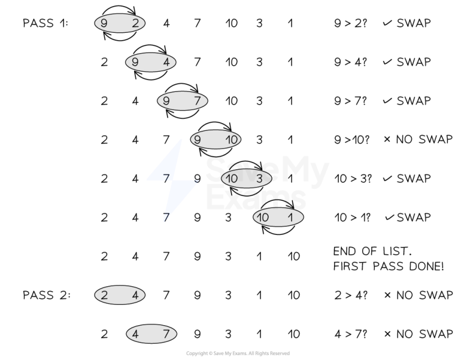
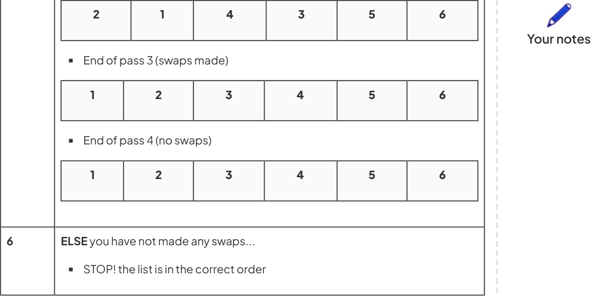

# CAIE Computer Science IGCSE — Chapter ?: Cambridge (CIE) IGCSE Computer Science

---

Your notes 

## Standard Methods of a Solution 

## Contents 

Linear Search & Bubble Sort 

Other Standard Methods of a Solution 

© 2026 Save My Exams, Ltd. 

Get more and ace your exams at savemyexams.com 

**1** 

Linear Search & Bubble Sort 

Your notes 

## Linear Search 

## What is a searching algorithm? 

Searching algorithms are precise step-by-step instructions that a computer can follow to efficiently locate specific data in massive datasets 

## What is a linear search? 

A linear search starts with the first value in a dataset and checks every value one at a time until all values have been checked 

A linear search can be performed even if the values are not in order 

## How do you perform a linear search? 

|Step|Instruction|
|---|---|
|1|Check the frst value|
|2|IFit is the value you are looking for STOP!|
|3|ELSEmove to the next value and check|
|4|REPEAT UNTILyou have checked all values and not found the value you are looking for|

## Examiner Tips and Tricks 

You will not be asked to perform a linear search on a dataset in the exam, you will be expected to understand how to do it and know the advantages and disadvantages of performing it 

## A linear search in Pseudocode 

// Declare variables 

DECLARE data : ARRAY[1:5] OF INTEGER DECLARE target : INTEGER DECLARE found : BOOLEAN 

// Assign values to the array and target 

© 2026 Save My Exams, Ltd. 

Get more and ace your exams at savemyexams.com 

**2** 

Your notes 

data ← [5, 2, 8, 1, 9] target ← 11 found ← FALSE  // Start with the assumption that the target is not found // Loop through each element in the array FOR index ← 1 TO 5 // Check if the current element matches the target IF data[index] = target THEN found ← TRUE OUTPUT "Target found" ENDIF NEXT index 

// After the loop, check if the target was never found IF found = FALSE THEN OUTPUT "Target not found" ENDIF 

## A linear search in Python code 

# Identify the dataset to search, the target value and set the initial flag data = [5, 2, 8, 1, 9] target = 11 found = False 

# Loop through each element in the data for index in range(0, len(data)):  # loop to go through all elements # Check if the current element matches the target if data[index] == target: # If found, output message found = True print("Target found") break  # Exit the loop if the target is found 

# If the target is not found, output a message if not found: print("Target not found") 

## Bubble Sort 

## What is a sorting algorithm? 

Sorting algorithms are precise step-by-step instructions that a computer can follow to efficiently sort data in massive datasets 

## What is a bubble sort? 

A bubble sort is a simple sorting algorithm that starts at the beginning of a dataset and checks values in 'pairs' and swaps them if they are not in the correct order 

One full run of comparisons from beginning to end is called a 'pass', a bubble sort may require multiple 'passes' to sort the dataset 

The algorithm is finished when there are no more swaps to make 

© 2026 Save My Exams, Ltd. 

Get more and ace your exams at savemyexams.com 

**3** 

## How do you perform a bubble sort? 

|Step|Instruction|
|---|---|
|1|Compare the frst two values in the dataset|
|2|IFthey are in the wrong order... Swap them|
|3|Compare the next two values|
|4|REPEATstep 2 & 3 until you reach the end of the dataset (pass 1)|
|5|IFyou have made any swaps... REPEATfrom the start (pass 2,3,4...)|
|6|ELSEyou have not made any swaps... STOP! the list is in the correct order|

Your notes 

## Example 

Perform a bubble sort on the following dataset 

© 2026 Save My Exams, Ltd. 

Get more and ace your exams at savemyexams.com **4** 

|5|||2|2|4|4|1|1|1||6|3|
|---|---|---|---|---|---|---|---|---|---|---|---|---|
||||||||||||||
|Step||Instruction|||||||||||
|1||Compare the frst two values in the dataset||||||||||3|
|||5||2||4|||1||6|3|
||||||||||||||
|2||IFthey are in the wrong order... Swap them||||||||||3|
|||2||5||4|||1||6|3|
||||||||||||||
|3||Compare the next two values||||||||||3|
|||2||5||4|||1||6|3|
||||||||||||||
|4||REPEATstep 2 & 3 until you 5 & 4 SWAP!||||reach the end of the dataset||||||3 3 3 6|
|||2||4||5|||1||6|3|
|||5 & 1 SWAP!|||||||||||
|||2||4||1|||5||6|3|
|||5 & 6 NO||SWAP!|||||||||
|||2||4||1|||5||6|3|
|||6 & 3 SWAP!|||||||||||
|||2||4||1|||5||3|6|
|||End of pass 1|||||||||||
|5||IFyou have made any swaps... REPEATfrom the start End of pass 2 (swaps made)|||||||||||

Your notes 

© 2026 Save My Exams, Ltd. 

Get more and ace your exams at savemyexams.com 

**5** 

## Examiner Tips and Tricks 

In the exam you do not have to show every swap that takes place in a bubble sort. You can show the outcome of a bubble sort at the end of each pass. If you have the outcome of each pass correct then a bubble sort has been implemented correctly and all marks will be given! 

## A bubble sort in Pseudocode 

// Declare the array DECLARE nums : ARRAY[1:11] OF INTEGER nums ← [66, 7, 69, 50, 42, 80, 71, 321, 67, 8, 39] // Store the length of the array DECLARE numlength : INTEGER numlength ← 11 // Set a flag to check if any swaps are made DECLARE swaps : BOOLEAN swaps ← TRUE // Repeat the loop while swaps are being made WHILE swaps = TRUE swaps ← FALSE 

// Loop through the array from the start to the second-last unsorted element FOR y ← 1 TO numlength - 1 

// If the current number is greater than the next number, swap them IF nums[y] > nums[y + 1] THEN DECLARE temp : INTEGER temp ← nums[y] nums[y] ← nums[y + 1] 

© 2026 Save My Exams, Ltd. 

Get more and ace your exams at savemyexams.com 

**6** 

nums[y + 1] ← temp swaps ← TRUE  // A swap was made ENDIF NEXT y 

Your notes 

// Decrease the range as the last value is now sorted numlength ← numlength - 1 ENDWHILE 

// Output the sorted array FOR i ← 1 TO 11 OUTPUT nums[i] NEXT i 

## A bubble sort in Python code 

# Unsorted dataset nums = [66, 7, 69, 50, 42, 80, 71, 321, 67, 8, 39] # Count the length of the dataset numlength = len(nums) # Set a flag to initiate the loop swaps = True 

while swaps:  # While any swap is made, continue swaps = False 

# Loop through the dataset for y in range(numlength - 1):  # Compare adjacent elements if nums[y] > nums[y + 1]:  # If the first number is bigger 

- # Swap the numbers using a temporary variable 

- nums[y], nums[y + 1] = nums[y + 1], nums[y] 

- swaps = True  # Mark that a swap was made 

# Each iteration confirms that the last element is in place numlength -= 1 

# Print the sorted list print(nums) 

## Worked Example 

A program uses a file to store a list of words. 

A sample of this data is shown 

Milk Eggs Bananas Cheese Potatoes Grapes Show the stages of a bubble sort when applied to data shown  [2] 

© 2026 Save My Exams, Ltd. 

Get more and ace your exams at savemyexams.com 

**7** 

How to answer this question 

We need to sort the values in to alphabetical order from A-Z You CAN use the first letter of each word to simplify the process Answer 

Your notes 

E, B, C, M, G, P (pass 1) 

- B, C, E, G, M, P (pass 2) 

© 2026 Save My Exams, Ltd. 

Get more and ace your exams at savemyexams.com 

**8** 

Other Standard Methods of a Solution 

Your notes 

## Totalling & Counting 

## What is totalling? 

Totalling is keeping a running total of values entered into the algorithm 

An example may be totalling a receipt for purchases made at a shop 

- In the example below, the total starts at 0 and adds up the user inputted value for each item in the list 

Pseudocode 

Total ← 0 FOR Count ← 1 TO ReceiptLength INPUT ItemValue Total ← Total + itemValue NEXT Count OUTPUT Total 

## What is counting? 

- Counting is when a count is incremented or decremented by a fixed value, usually 1, each time it iterates 

Counting keeps track of the number of times an action has been performed 

- Many algorithms use counting, including the linear search to track which element is currently being considered 

- In the example below, the count is incremented and each pass number is output until fifty outputs have been produced 

Pseudocode 

Count ← 0 DO OUTPUT “Pass number”, Count Count ← Count + 1 UNTIL Count >= 50 

- In the example below, the count is decremented from fifty until the count reaches zero. An output is produced for each pass 

Pseudocode 

Count ← 50 DO 

© 2026 Save My Exams, Ltd. Get more and ace your exams at savemyexams.com 

**9** 

OUTPUT “Pass number”, Count Count ← Count - 1 UNTIL Count <= 0 

Your notes 

## Maximum, Minimum & Average 

Finding the largest (max), smallest (min) and average (mean) values in a list are frequently used method in algorithms 

Examples could include: 

Calculating the maximum and minimum student grades or scores in a game 

Calculating the average grade of students in a class test 

In the example below, in a list of student test scores, the highest, lowest and average scores are calculated and displayed to the screen 

## Pseudocode 

Total ← 0 Scores ← [25, 11, 84, 91, 27] Highest ← max(Scores) Lowest ← min(Scores) 

# Loop through the scores in the list (indexing starts from 0) FOR Count ← 0 TO LENGTH(Scores) - 1 

# Add score to total Total ← Total + Scores[Count] NEXT Count 

# Calculate average Average ← Total / LENGTH(Scores) 

OUTPUT "The highest score is:", Highest OUTPUT "The lowest score is:", Lowest OUTPUT "The average score is:", Average 

© 2026 Save My Exams, Ltd. 

Get more and ace your exams at savemyexams.com 

**10** 

