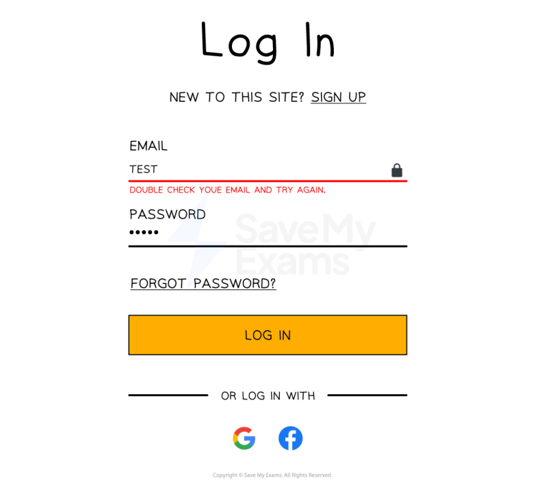
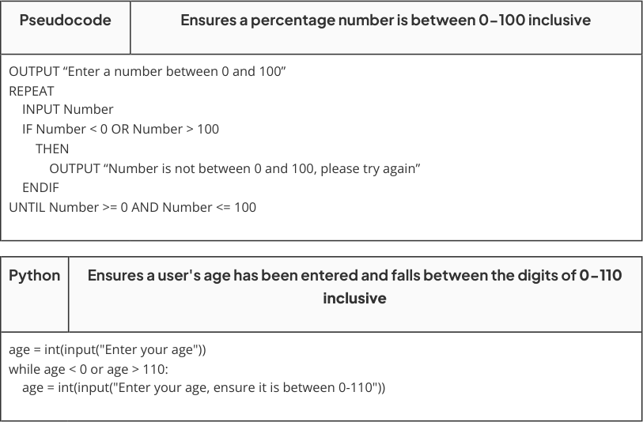
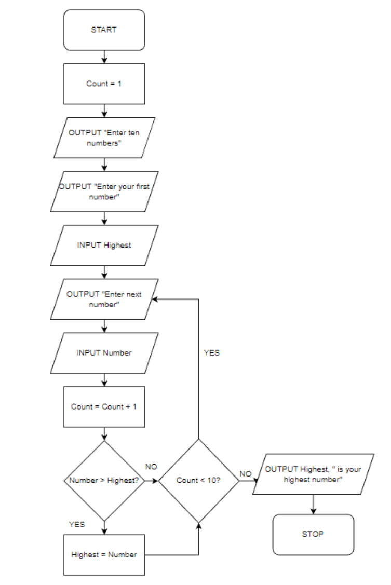
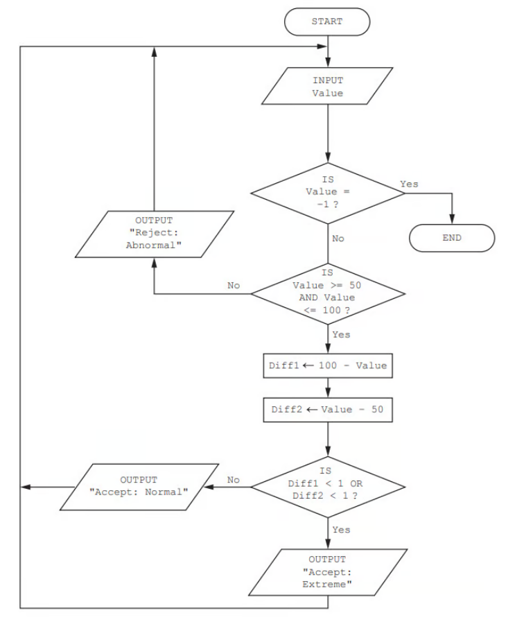

# CAIE Computer Science IGCSE — Chapter 10: Cambridge (CIE) IGCSE Computer Science

---

Your notes 

## Validation & Verification 

## Contents 

Validation & Verification Suitable Test Data Trace Tables 

© 2026 Save My Exams, Ltd. 

Get more and ace your exams at savemyexams.com 

**1** 

Your notes 

## Validation & Verification 

## Validation 

## What is validation? 

- Validation is an automated process where a computer checks if a user input is sensible and meets the program's requirements. 

- There are six categories of validation which can be carried out on fields and data types, these are 

Range check 

- Length check 

- Type check 

- Presence check 

- Format check 

- Check digit 

There can be occasions where more than one type of validation will be used on a field 

- An example of this could be a password field which could have a length, presence and type check on it 

© 2026 Save My Exams, Ltd. 

Get more and ace your exams at savemyexams.com 

**2** 

## Range check 

Ensures the data entered as a number falls within a particular range 

© 2026 Save My Exams, Ltd. 

Get more and ace your exams at savemyexams.com 

**3** 

## Length check 

Checks the length of a string 

Your notes 

|Pseudocode|Pseudocode|Ensures a pin number can only contain 4 digits|
|---|---|---|
|OUTPUT “Please enter your 4 digit bank PIN number” REPEAT INPUT Pin IF LENGTH(Pin) <> 4 THEN OUTPUT “Your pin number must be four characters in length, please try again” ENDIF UNTIL LENGTH(Pin) = 4|||
||||
|Python|Ensures a password is 8 characters or more||
|password_length = len(password) while password_length < 8: password = input("Enter a password which is 8 or more characters")|||

## Type check 

Check the data type of a field 

|Pseudocode|Pseudocode|Ensures an age should be entered as an integer (whole number)|
|---|---|---|
|OUTPUT “Enter an integer number” REPEAT INPUT Number IF Number <> DIV(Number, 1) THEN OUTPUT “Not a whole number, please try again” ENDIF UNTIL Number = DIV(Number , 1)|||
||||
|Python|Ensures an age should be entered as an integer (whole number)||
|age = input("Enter your age") while age.isdigit() == False: print("enter a number") age = input("Enter your age as a number")|||

## Presence check 

Looks to see if any data has been entered in a field 

Pseudocode Ensures username and password are both entered 

© 2026 Save My Exams, Ltd. 

Get more and ace your exams at savemyexams.com 

**4** 

OUTPUT “Enter your username” REPEAT INPUT Username Your notes IF Username = “” THEN OUTPUT “No username entered, please try again” ENDIF UNTIL Username <> “” 

Python Ensures when registering for a website the name field is not left blank name = input("Enter your name") while name == "": name = input("You must enter your name here") 

## Format check 

Ensures that the data has been entered in the correct format 

Format checks are done using pattern matching and string handling 

Pseudocode Ensures a six digit ID number is entered against the format "XX9999" where X is an uppercase alphabetical letter and 9999 is a four digit number INPUT IDNumber IF LENGTH(IDNumber) <> 6 THEN OUTPUT "ID number must be 6 characters long" ENDIF ValidChars ← "ABCDEFGHIJKLMNOPQRSTUVWXYZ" FirstChar ← SUBSTRING(IDNumber, 1, 1) ValidChar ← False Index ← 1 WHILE Index <= LENGTH(ValidChars) AND ValidChar = False DO IF FirstChar = SUBSTRING(ValidChars, Index, 1) THEN ValidChar ← True ENDIF Index ← Index + 1 ENDWHILE IF ValidChar = False THEN OUTPUT "First character is not a valid uppercase alphabetical character" ENDIF SecondChar ← SUBSTRING(IDNumber, 2, 1) ValidChar ← False Index ← 1 WHILE Index <= LENGTH(ValidChars) AND ValidChar = False DO IF SecondChar = SUBSTRING(ValidChars, Index, 1) THEN 

© 2026 Save My Exams, Ltd. 

Get more and ace your exams at savemyexams.com **5** 

ValidChar ← True ENDIF Index ← Index + 1 ENDWHILE IF ValidChar = False THEN OUTPUT "Second character is not a valid uppercase alphabetical character" ENDIF Digits ← INT(SUBSTRING(IDNumber, 3, 4)) IF Digits < 0 OR Digits > 9999 THEN OUTPUT "Digits invalid. Enter four valid digits in the range 0000-9999" ENDIF 

Your notes 

Explanation The first two characters are checked against a list of approved characters The first character is compared one at a time to each valid character in the ValidChars array If it finds a match it stops looping and sets ValidChar to True The second character is then compared one at a time to each valid character in the ValidChars array If it finds a match then it also stops looping and sets ValidChar to True Casting is used on the digits to turn the digit characters into numbers 

Once the digits are considered a proper integer they can be checked to see if they are in the appropriate range of 0−9999 

If any of these checks fail then an appropriate message is output 

Python Ensures an email contains a '@' and ' full stop (.) which follows the format "email@address.com" email = input("Enter your email address") while "@" not in email or "." not in email: email = input("Please enter a valid email address") 

## Check digits 

Check digits are numerical values that are the final digit of a larger code such as a barcode or an International Standard Book Number (ISBN) 

They are calculated by applying an algorithm to the code and are then attached to the overall code 

## Verification 

© 2026 Save My Exams, Ltd. 

Get more and ace your exams at savemyexams.com 

**6** 

## What is verification? 

Verification is the act of checking data is accurate when entered into a system 

Your notes 

Mistakes such as creating a new account and entering a password incorrectly mean being locked out of the account immediately 

Verification methods include: 

double entry checking 

visual checks 

## Double entry checking 

- Double entry checking involves entering the data twice in separate input boxes and then comparing the data to ensure they both match 

If they do not, an error message is shown 

Pseudocode 

REPEAT OUTPUT “Enter your password” INPUT Password OUTPUT “Please confirm your password” INPUT ConfirmPassword IF Password <> ConfirmPassword THEN OUTPUT “Passwords do not match, please try again” ENDIF UNTIL Password = ConfirmPassword 

## Visual checks 

Visual checks involve the user visually checking the data on the screen 

A popup or message then asks if the data is correct before proceeding 

If it isn’t the user then enters the data again 

Pseudocode REPEAT OUTPUT “Enter your name” INPUT Name OUTPUT “Your name is: “, Name, “. Is this correct? (y/n)” INPUT Answer UNTIL Answer = “y” 

© 2026 Save My Exams, Ltd. 

Get more and ace your exams at savemyexams.com 

**7** 

Describe the purpose of validation and verification checks during data entry. Include an example for each. 

[4] 

Answers Validation check 

[1] for description: 

To test if the data entered is possible / reasonable / sensible 

   - A range check tests that data entered fits within specified values 

- [1]  for example: 

Range / length / type / presence / format 

Verification check 

## [1]  for description: 

To test if the data input is the same as the data that was intended to be input A double entry check expects each item of data to be entered twice and compares both entries to check they are the same 

- [1]  for example: 

Visual / double entry 

© 2026 Save My Exams, Ltd. 

Get more and ace your exams at savemyexams.com 

**8** 

Suitable Test Data 

Your notes 

## Suitable Test Data 

## What is suitable test data? 

Suitable test data is specially chosen to test the functionality of a program or design 

Developers or test-users would pick a selection of test data from the following categories 

Normal 

Abnormal 

Extreme 

Boundary 

The results would be compared to the expected results to check if the algorithm/program works as intended 

Each category is explained within the context of a simple Python program below, comments have been added to help explain the processes 

## Python 

# Ask for user's name name = input("What is your name? ") 

# Ask for user's age age = int(input("How old are you? ")) 

# Check if age is between 12 and 18 if age >= 12 and age <= 18: 

print("Welcome, " + name + "! Your age is accepted.") else: 

print("Sorry, " + name + ". Your age is not accepted.") 

## Normal data 

Normal test data is data that should be accepted in the program 

An example would be a user entering their age as 16 into the age field of the program 

## Abnormal data 

Abnormal test data is data that is the wrong data type 

An example would be a user entering their age as "F" into the age field of the program 

## Extreme data 

© 2026 Save My Exams, Ltd. 

Get more and ace your exams at savemyexams.com 

**9** 

Your notes 

- Extreme test data is the maximum and minimum values of normal data that are accepted by the system 

- An example would be a user entering their age as 18 or 12 into the age field of the program 

## Boundary data 

Boundary test data is similar to extreme data except that the values on either side of the maximum and minimum values are tested 

- The largest and smallest acceptable value is tested as well as the largest and smallest unacceptable value 

An example would be a user entering their age as 11 or 19 into the age field of the program 

## Selecting suitable test data 

|Type of Test|Input|Expected Output|
|---|---|---|
|Normal|14|Accepted|
|Normal|16|Accepted|
|Extreme|12|Accepted|
|Extreme|18|Accepted|
|Abnormal|H|Rejected|
|Abnormal|@|Rejected|
|Boundary|11|Rejected|
|Boundary|19|Rejected|

## Worked Example 

A programmer has written an algorithm to check that prices are less than $10.00 

These values are used as test data:     10.00     9.99     ten 

State why each value was chosen as test data. 

[3] 

Answers 

© 2026 Save My Exams, Ltd. 

Get more and ace your exams at savemyexams.com 

**10** 

10.00 is boundary or abnormal data and should be rejected as it is out of range [1] 

9.99 is boundary, extreme and normal data and should be accepted as it is within the normal range [1] 

Your notes 

Ten is abnormal data and should be rejected as it is the wrong value type [1] 

© 2026 Save My Exams, Ltd. 

Get more and ace your exams at savemyexams.com 

**11** 

Trace Tables 

Your notes 

## Trace Tables 

## What is a trace table? 

- A trace table is used to test algorithms and programs for logic errors that appear when an algorithm or program executes 

- Trace tables can be used with flowcharts, pseudocode or program code 

- A trace table can be used to: 

   - Discover the purpose of an algorithm by showing output data and intermediary steps 

Record the state of the algorithm at each step or iteration 

- Each stage of the algorithm is executed step by step. 

- Inputs, outputs, variables and processes can be checked for the correct value when the stage is completed 

## Trace table walkthrough 

- Below is a flowchart to determine the highest number of ten user-entered numbers 

- The algorithm prompts the user to enter the first number which automatically becomes the highest number entered 

- The user is then prompted to enter nine more numbers. 

If a new number is higher than an older number then it is replaced 

- Once all ten numbers are entered, the algorithm outputs which number was the highest 

- Example test data to be used is: 4, 3, 7, 1, 8, 3, 6, 9, 12, 10 

© 2026 Save My Exams, Ltd. 

Get more and ace your exams at savemyexams.com 

**12** 

Your notes 

|||Trace table: Highest number|Trace table: Highest number|
|---|---|---|---|
|Count|Highest|Number|Output|
|1|||Enter ten numbers|

© 2026 Save My Exams, Ltd. 

Get more and ace your exams at savemyexams.com 

**13** 

||4||Enter your frst number||Your notes|
|---|---|---|---|---|---|
|2||3|Enter your next number|||
|3|7|7||||
|4||1||||
|5|8|8||||
|6||3||||
|7||6||||
|8|9|9||||
|9|12|12||||
|10||10|12 is your highest number|||

## Worked Example 

The flowchart represents an algorithm. The algorithm will terminate if –1 is entered. 

© 2026 Save My Exams, Ltd. 

Get more and ace your exams at savemyexams.com 

**14** 

Your notes 

Complete the trace table for the input data: 50, 75, 99, 28, 82, 150, –1, 672, 80 

[4] 

|Value|Value|Dif1|Dif1||Dif2|Output|
|---|---|---|---|---|---|---|
||||||||
||||||||
|Answer [1] for each correct column|||||||
|Value|Dif1||Dif2|||Output|
|50|50||0||Accept: Extreme||

© 2026 Save My Exams, Ltd. 

Get more and ace your exams at savemyexams.com 

**15** 

||75|25|25|Accept: Normal|
|---|---|---|---|---|
||99|1|49|Accept: Normal|
||28|||Reject: Abnormal|
||82|18|32|Accept: Normal|
||150|||Reject: Abnormal|
||-1||||
||||||
||||||

© 2026 Save My Exams, Ltd. 

Get more and ace your exams at savemyexams.com 

**16** 

