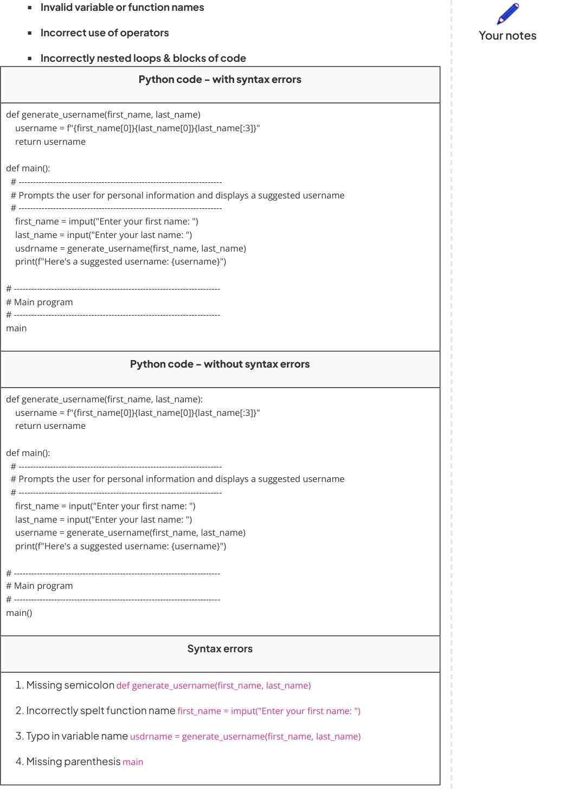

# CAIE Computer Science IGCSE — Chapter ?: Cambridge (CIE) IGCSE Computer Science

---

Your notes 

## Identifying Errors 

## Contents 

Identifying Errors Writing & Amending Algorithms 

© 2026 Save My Exams, Ltd. 

Get more and ace your exams at savemyexams.com 

**1** 

Identifying Errors 

Your notes 

## Identifying errors 

## Examiner Tips and Tricks 

Cambridge IGCSE 0478 regularly assesses your ability to identify, describe, and fix syntax, logic, and runtime errors, especially using trace tables and dry runs. This page mirrors the question style and mark scheme language of Paper 2. 

- Designing algorithms is a skill that must be developed and when designing algorithms, mistakes and issues will occur 

- Trace tables can also help to find any kind of error in a program or algorithm 

- There are three main categories of errors that when designing algorithms a programmer must be able to identify & fix, they are: 

Syntax errors 

Logic errors 

Runtime errors 

## Examiner Tips and Tricks 

When describing an error: 

- Use “prevents the program from running” for syntax Use “produces incorrect output” for logic 

Use “causes the program to crash” for runtime These are the exact phrases that earn marks in the exam. 

## Syntax Errors What is a syntax error? 

- A syntax error is an error that breaks the grammatical rules of a programming language and stops it from running 

- Examples of syntax errors are: 

Typos and spelling errors 

Missing or extra brackets or quotes 

Misplaced or missing semicolons 

© 2026 Save My Exams, Ltd. Get more and ace your exams at savemyexams.com 

**2** 

© 2026 Save My Exams, Ltd. 

Get more and ace your exams at savemyexams.com 

**3** 

Your notes 

## Examiner Tips and Tricks 

Examiners won’t give marks for vague phrases like “the program didn’t work.” You must name the error type, locate it, and explain the impact on the output or execution. 

## Logic Errors 

## What is a logic error? 

- A logic error is where incorrect code is used that causes the program to run, but produces an incorrect output or result 

Logic errors can be difficult to identify by the person who wrote the program, so one method of finding them is to use 'Trace Tables' 

- Examples of logic errors are: 

   - Incorrect use of operators  (< and >) 

   - Logical operator confusion (AND for OR) 

   - Looping one extra time 

   - Indexing arrays incorrectly (arrays indexing starts from 0) 

   - Using variables before they are assigned 

   - Infinite loops 

Python code def calculate_area(length, width): ### Calculates the area of a rectangle Inputs: length (float): The length of the rectangle (positive value) width (float): The width of the rectangle (positive value) Returns: float: The calculated area of the rectangle Raises: ValueError: If either length or width is non-positive ### if length < 0 or width < 0: raise ValueError("Length and width must be positive values.") area = length * width return area def main(): # ----------------------------------------------------------------------Prompts the user for rectangle dimensions and prints the calculated area # ----------------------------------------------------------------------try: 

© 2026 Save My Exams, Ltd. 

Get more and ace your exams at savemyexams.com 

**4** 

length = float(input("Enter the length of the rectangle: ")) width = float(input("Enter the width of the rectangle: ")) 

# Call the area calculation function 

Your notes 

area = calculate_area(length, width) 

print(f"The area of the rectangle is approximately {area:.2f} square units.") except ValueError as error: print(f"Error: {error}") 

# ----------------------------------------------------------------------- 

# Main program 

# ----------------------------------------------------------------------main() 

## Logic errors 

|Test number|Test data|Expected outcome|Actual outcome|Changes needed? (Y/N)|
|---|---|---|---|---|
|1|Length = 5 Width = 5|"The area of the rectangle is approximately 25 square units."|"The area of the rectangle is approximately 25.00 square units."|N|
|2|Length = 10 Width = 0|"Length and width must be positive values."|"The area of the rectangle is approximately 0.00 square units."|Y should not accept 0 input as not positive|

Logic error located on line if length < 0 or width < 0: 

Logic error identified in expression < 0 , should be <= 0 so that 0 is not accepted as valid input for length or width 

## Runtime Errors 

## What is a runtime error? 

A runtime error is where an error causes a program to crash 

Examples of runtime errors are: 

Dividing a number by 0 

Index out of the range of an array 

Unable to read or write a drive 

Python code 

© 2026 Save My Exams, Ltd. 

Get more and ace your exams at savemyexams.com 

**5** 

def calculate_area(length, width): """ Calculates the area of a rectangle Inputs: length (float): The length of the rectangle (positive value) width (float): The width of the rectangle (positive value) Returns: float: The calculated area of the rectangle Raises: ValueError: If either length or width is non-positive """ if length < 0 or width < 0: raise ValueError("Length and width must be positive values.") area = length * width return area def main(): # ----------------------------------------------------------------------Prompts the user for rectangle dimensions and prints the calculated area # ----------------------------------------------------------------------try: length = float(input("Enter the length of the rectangle: ")) width = float(input("Enter the width of the rectangle: ")) # Call the area calculation function area = calculate_area(length, width) print(f"The area of the rectangle is approximately {area:.2f} square units.") except ValueError as error: print(f"Error: {error}") # ----------------------------------------------------------------------# Main program # ----------------------------------------------------------------------main() 

Your notes 

## Runtime errors 

|Test number|Test data|Expected outcome|Actual outcome|Changes needed? (Y/N)|
|---|---|---|---|---|
|1|Length = 10 Width = 10|"The area of the rectangle is approximately 100 square units."|"The area of the rectangle is approximately 100.00 square units."|N|
|2|Length = "abc" Width = 0|"Program could not convert string to foat, try again"|Program crashed|Y should give error message and ask user to enter again|

Runtime error located in 

© 2026 Save My Exams, Ltd. Get more and ace your exams at savemyexams.com 

**6** 

## try: 

length = float(input("Enter the length of the rectangle: ")) width = float(input("Enter the width of the rectangle: ")) 

Your notes 

- # Call the area calculation function 

area = calculate_area(length, width) 

print(f"The area of the rectangle is approximately {area:.2f} square units.") except ValueError as error: 

print(f"Error: {error}") 

Runtime error identified as missing iteration (while loop) so program does not ask user to enter width and height again 

Corrected code now includes a while loop 

## while True: 

try: 

length = float(input("Enter the length of the rectangle: ")) width = float(input("Enter the width of the rectangle: ")) 

# Call the area calculation function 

area = calculate_area(length, width) 

print(f"The area of the rectangle is approximately {area:.2f} square units.") break  # Exit the loop if successful 

except ValueError as error: print(f"Error: {error}") 

print("Please enter positive values for length and width.") 

© 2026 Save My Exams, Ltd. Get more and ace your exams at savemyexams.com 

**7** 

Writing & Amending Algorithms 

Your notes 

## Algorithmic Thinking 

## What is algorithmic thinking? 

- Algorithmic thinking is the process of creating step-by-step instructions in order to produce a solution to a problem 

- Algorithmic thinking requires the use of abstraction and decomposition to identify each individual step 

Once each step has been identified, a precise set of rules (algorithm) can be created and the problem will be solved 

An example of algorithmic thinking is following a recipe, if the recipe is followed precisely it should lead to the desired outcome 

A set of traffic lights is an example of how algorithmic thinking can lead to solutions being automated 

## Examiner Tips and Tricks 

Writing algorithms in an exam can be challenging and time consuming. It's important to allocate your time carefully to not spend too little or too long writing an algorithm 

You will likely make mistakes and rewrite your algorithm a few times. Use scrap paper or the back of your exam paper if possible to sketch out your ideas before committing to your answer. This will make your answer clearer, neater and easier to read, follow and understand 

You may wish to chunk your algorithm into parts initially, for example, “This part will enter the grades”, “this part will calculate the total”, and “This part will allocate grades”. You can then put the whole algorithm together in order later 

Make a plan before you start answering the question and writing your algorithm. A plan can be simple but allows you to order your thoughts, for example: 

Part 1: Declare and initialise variables 

Part 2: Allocate marks for each subject 

Part 3: Allocate grades for each student's subject 

Part 4: Include a loop 

Part 5: Output all necessary data 

Pseudocode does not have a syntax, therefore you can write an algorithm in any way which is easily understandable. Caution is advised to stick to IGCSE specification standards to ensure your answer is consistent and easy for examiners to follow 

© 2026 Save My Exams, Ltd. 

Get more and ace your exams at savemyexams.com 

**8** 

Be sure to use variable names and data provided in the question as given. Failure to do so will lose you marks 

Your notes 

Remember to comment on your code. It helps both you and the examiner understand your answer and also awards marks in the mark scheme! 

© 2026 Save My Exams, Ltd. 

Get more and ace your exams at savemyexams.com 

**9** 

