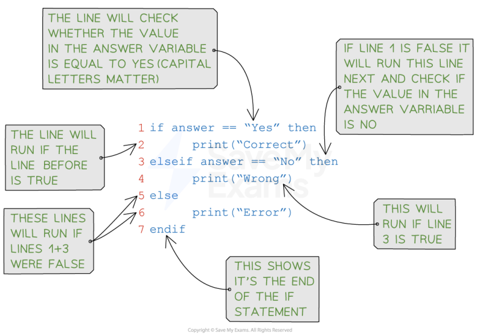
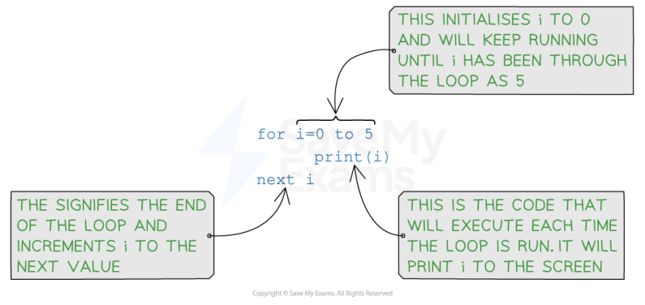
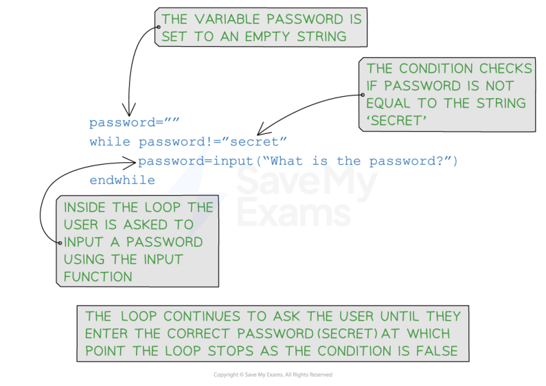
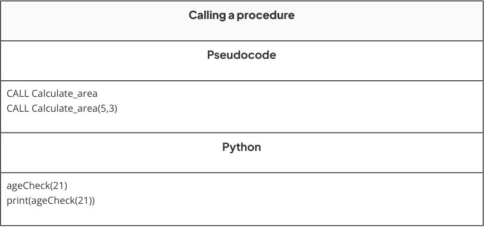

# CAIE Computer Science IGCSE — Chapter ?: Cambridge (CIE) IGCSE Computer Science

---

Your notes 

## Programming Concepts 

## Contents 

- Variables & Constants Data Types Input & Output Sequence Selection Iteration Totalling & Counting String Handling Arithmetic, Logical & Boolean Operators Procedures & Functions Local & Global Variables Library Routines Maintaining Programs 

© 2026 Save My Exams, Ltd. Get more and ace your exams at savemyexams.com 

**1** 

Your notes 

## Variables & Constants 

## Variables & Constants 

## What is a variable? 

A variable is an identifier that can change in the lifetime of a program 

Identifiers should be: 

In mixed case (Pascal case) 

Only contain letters (A-Z, a-z) 

Only contain digits (0−9) 

Start with a capital letter and not a digit 

A variable can be associated a datatype when it is declared 

When a variable is declared, memory is allocated based on the data type indicated 

Pseudocode DECLARE <identifier> : <datatype> DECLARE Age : INTEGER DECLARE Price : REAL DECLARE GameOver : BOOLEAN Python score = int() # whole number cost = float() # decimal number light = bool() # data can only have one or two values 

## What is a constant? 

A constant is an identifier set once in the lifetime of a program 

Constants are generally named in all uppercase characters 

Constants aid the readability and maintainability 

© 2026 Save My Exams, Ltd. 

Get more and ace your exams at savemyexams.com 

**2** 

If a constant needs to be changed, it should only need to be altered in one place in the whole program 

Pseudocode CONSTANT <identifier> ← <value> CONSTANT PI ← 3.142 CONSTANT PASSWORD ← "letmein" CONSTANT HIGHSCORE ← 9999 Python PI = 3.142 VAT = 0.20 PASSWORD = "letmein" 

Your notes 

© 2026 Save My Exams, Ltd. 

Get more and ace your exams at savemyexams.com 

**3** 

Your notes 

## Data Types 

## Data Types 

## What is a data type? 

- A data type is a classification of data into groups according to the kind of data they represent 

- Computers use different data types to represent different types of data in a program 

The basic data types include: 

|Data type|Used for|Pseudocode|Example|
|---|---|---|---|
|Integer|Whole numbers|INTEGER|10, -5, 0|
|Real|Numbers with a fractional part (decimal)|REAL|3.14, -2.5, 0.0|
|Character|Single character|CHAR|'a', 'B', '6', '£'|
|String|Sequence of characters|STRING|"Hello world", "ABC", "@#!%"|
|Boolean|True or false values|BOOLEAN|True, False|

- It is important to choose the correct data type for a given situation to ensure accuracy and efficiency in the program 

Data types can be changed within a program, this is called casting 

## Programming data types 

|Data type|Pseudocode|Python|
|---|---|---|
|Integer|Number←5|number = 5|
|Real|RealNumber←3.14|realNumber = 3.14|
|Character|FirstNameInitial←'a'|frstNameInitial = 'a'|
|String|Password←"letmein"|password = "letmein"|
|Boolean|LightSensor←True|lightSensor = True|

© 2026 Save My Exams, Ltd. 

Get more and ace your exams at savemyexams.com 

**4** 

Your notes 

## Worked Example 

Name and describe the most appropriate programming data type for each of the examples of data given. Each data type must be different 

[6] 

## Data: 83 

Data: myemail@savemyexams.co.uk 

Data: True 

## Answers 

Data type name: Integer [1] 

Data type description: The number is a whole number [1] Data type name: String [1] 

Data type description: It is a group of characters [1] Data type name: Boolean [1] 

Data type description: The value is True (or could be False) [1] 

© 2026 Save My Exams, Ltd. 

Get more and ace your exams at savemyexams.com 

**5** 

Input & Output 

Your notes 

## Input & Output 

## What is an input? 

An input is a value that is read from an input device and then processed by a computer program 

Typical input devices include: 

Keyboards - Typing text 

Mice - Selecting item, clicking buttons 

Sensors - Reading data from sensors such as temperature, pressure or motion 

Microphone - Capturing audio, speech recognition 

Without inputs, programs are not useful as they can't interact with the outside world and always produce the same result 

In programming the keyboard is considered the standard for user input 

- If the command 'INPUT' is executed, a program will wait for the user to type a sequence of characters 

In other programming languages different command words can be used 

## Examples 

|Pseudocode (INPUT <identifer>)|Python|
|---|---|
|INPUT Name IF Name←"James" OR Name←"Rob" THEN...|name=input("Enter your name: ") if name == "James" or name == "Rob":|

## What is an output? 

An output is a value sent to an output device from a computer program 

Typical output devices include: 

Monitor - Displaying text, images or graphics 

Speaker - Playing audio 

Printer - Creating physical copies of documents or images 

In programming the monitor is considered the standard for user output 

If the command 'OUTPUT' is executed, a program will output to the screen 

In other programming languages different command words can be used 

© 2026 Save My Exams, Ltd. 

Get more and ace your exams at savemyexams.com 

**6** 

## Examples 

|Pseudocode (OUTPUT <identifer(s)>)|Python|
|---|---|
|INPUT Name IF Name←"James" OR Name←"Rob" THEN OUTPUT "Great names!"|name=input("Enter your name: ") if name == "James" or name == "Rob": print("Great names!")|
|INPUT Name IF Name←"James" OR Name←"Rob" THEN OUTPUT "Love the name ", Name|name=input("Enter your name: ") if name == "James" or name == "Rob": print("Love the name "+name)|

Your notes 

© 2026 Save My Exams, Ltd. 

Get more and ace your exams at savemyexams.com 

**7** 

Your notes 

## Sequence 

## Sequence 

## What is sequence? 

Sequence refers to lines of code which are run one line at a time 

The lines of code are run in the order that they written from the first line of code to the last line of code 

Sequence is crucial to the flow of a program, any instructions out of sequence can lead to unexpected behaviour or errors 

## Example 1 

A simple program to ask a user to input two numbers, number two is subtracted from number one and the result is outputted 

|Line|Pseudocode|
|---|---|
|01|OUTPUT "Enter the frst number"|
|02|INPUT Num1|
|03|OUTPUT "Enter the second number"|
|04|INPUT Num2|
|05|Result←Num1 - Num2|
|06|OUTPUT Result|

A simple swap of line 01 and line 02 would lead to an unexpected behaviour, the user would be prompted to input information without knowing what they should enter 

## Example 2 

This function calculates the area of a rectangle 

## Inputs: 

length: The length of the rectangle 

width: The width of the rectangle 

## Returns: 

The area of the rectangle 

© 2026 Save My Exams, Ltd. 

Get more and ace your exams at savemyexams.com 

**8** 

Pseudocode FUNCTION CalculateArea(length, width) RETURN area area ← length * width END FUNCTION // Main program length ← 5 width ← 3 correct_area ← CalculateArea(length, width) OUTPUT "Correct area (length * width): ", correct_area Python example def calculate_area(length, width): return area area = length * width # -----------------------------------------------------------------------# Main program # -----------------------------------------------------------------------length = 5 width = 3 correct_area = calculate_area(length, width) print(f"Correct area (length * width): {correct_area}") 

Your notes 

In the example, the sequence of instructions is wrong and would cause a runtime error 

In the calculate_area() function a value is returned before it is assigned The correct sequence is: 

area ← length * width RETURN area OR area = length * width return area 

© 2026 Save My Exams, Ltd. 

Get more and ace your exams at savemyexams.com 

**9** 

Selection 

Your notes 

## What is Selection? 

- Selection is when the flow of a program is changed, depending on a set of conditions 

- The outcome of this condition will then determine which lines or block of code is run next 

- Selection is used for validation, calculation and making sense of a user's choices 

- There are two ways to write selection statements: 

   - if... then... else... 

case... 

## If Statements 

## What is an If statement? 

- As If statements allow you to execute a set of instructions if a condition is true 

- They have the following syntax: 

IF <condition> THEN 

<statement> ENDIF 

- A detailed look at a Python IF statement: 

© 2026 Save My Exams, Ltd. 

Get more and ace your exams at savemyexams.com 

**10** 

Your notes 

## Example 

|Concept|Pseudocode|Python|
|---|---|---|
|IF-THEN-ELSE|IF Answer←"Yes" THEN OUTPUT "Correct" ELSE OUTPUT "Wrong" ENDIF|if answer == "Yes": print("Correct") elif answer == "No": print("Wrong") else: print("Error")|

## Nested Selection 

## What is nested selection? 

Nested selection is a selection statement within a selection statement, e.g. an If inside of another If 

Nested means to be 'stored inside the other' 

## Example 

## Pseudocode 

IF Player2Score > Player1Score THEN IF Player2Score > HighScore THEN 

© 2026 Save My Exams, Ltd. 

Get more and ace your exams at savemyexams.com 

**11** 

OUTPUT Player2, " is champion and highest scorer" ELSE OUTPUT Player2, " is the new champion" ENDIF ELSE OUTPUT Player1, " is still the champion" IF Player1Score > HighScore THEN OUTPUT Player1, " is also the highest scorer" ENDIF ENDIF Python # Prompt the user to enter a number print("Enter a number: ") test_score = int(input()) # Outer statement to check if the test_score is above 40 if test_score > 40: # Inner statement to assign the result from the test if test_score > 70: result = "Distinction" elif test_score > 55: result = "Merit" else: result = "Pass" else: result = "Fail" # Output the result print(result) 

Your notes 

## Case Statements 

## What is a case statement? 

A case statement can mean less code but it only useful when comparing multiple values of the same variable 

If statements are more flexible and are generally used more in languages such as Python 

The format of a CASE statement is: 

CASE OF <identifier> <value 1> : <statement> <value 2>: <statement> .... 

OTHERWISE <statement> ENDCASE 

Concept Pseudocode Python 

© 2026 Save My Exams, Ltd. 

Get more and ace your exams at savemyexams.com 

**12** 

CASE INPUT Move day = "Sat" match day: CASE OF Move case "Sat": Your notes 'W' : Position ← Position - 10 print("Saturday") 'E' : Position ← Position + 10 case "Sun": 'A' : Position ← Position - 1 print("Sunday") 'D' : Position ← Position + 1 case _: OTHERWISE print("Weekday") OUTPUT "Beep" ENDCASE 

## Examiner Tips and Tricks 

Make sure to include all necessary components in the selection statement: 

the condition, 

the statement(s) to execute when the condition is true any optional statements to execute when the condition is false 

Use proper indentation to make the code easier to read and understand 

Be careful with the syntax of the programming language being used, as it may differ slightly between languages 

Make sure to test the selection statement with various input values to ensure that it works as expected 

## Worked Example 

Write an algorithm using pseudocode that: 

Inputs 3 numbers Outputs the largest of the three numbers 

[3] 

## Exemplar answer 

## Pseudocode 

INPUT A INPUT B INPUT C IF A >= B AND A >= C THEN OUTPUT A ELSE IF B >= A AND B >= C THEN OUTPUT B ELSE OUTPUT C ENDIF 

© 2026 Save My Exams, Ltd. 

Get more and ace your exams at savemyexams.com **13** 

Python if A > B and A > C: print(A) elif B > C: print(B) else: print(C) 

Your notes 

© 2026 Save My Exams, Ltd. 

Get more and ace your exams at savemyexams.com 

**14** 

Iteration 

Your notes 

## What is iteration? 

- Iteration is repeating a line or a block of code using a loop 

- Iteration can be: 

Count controlled 

- Condition controlled 

Nested 

## Count Controlled Loops 

## What is a count controlled loop? 

- A count controlled loop is when the code is repeated a fixed number of times (e.g. using a for loop) 

- A count controlled loop can be written as: 

FOR <identifier> ← <value1> TO <value2> 

- <statements> 

- NEXT <identifier> 

- Identifiers must be an integer data type 

- It uses a counter variable that is incremented or decremented after each iteration 

- This can be written as: 

FOR <identifier> ← <value1> TO <value2> STEP <increment> 

- <statements> 

NEXT <identifier> 

A detailed look at a Python FOR statement: 

© 2026 Save My Exams, Ltd. 

Get more and ace your exams at savemyexams.com 

**15** 

## Examples 

|Iteration|Pseudocode|Python|
|---|---|---|
|Count controlled|FOR X←1 TO 10 OUTPUT "Hello" NEXT X|for x in range(10): print("Hello")|
||This will print the word "Hello" 10 times||
||FOR X←2 TO 10 STEP 2 OUTPUT X NEXT X|for x in range(2,12,2): print(x) # Python range function excludes end value|
||This will print the|even numbers from 2 to 10 inclusive|
||FOR X←10 TO 0 STEP -1 OUTPUT X NEXT X|for x in range(10,-1,-1): print(x) # Python range function excludes end value|
||This will print the numbers from 10 to 0 inclusive||

## Condition Controlled Loops 

## What is a condition controlled loop? 

A condition controlled loop is when the code is repeated until a condition is met There are two types of condition controlled loops: Post-condition (REPEAT) Pre-condition (WHILE) 

© 2026 Save My Exams, Ltd. 

Get more and ace your exams at savemyexams.com 

**16** 

## Post-condition loops (REPEAT) 

A post-condition loop is executed at least once 

Your notes 

- The condition must be an expression that evaluates to a Boolean (True/False) 

- The condition is tested after the statements are executed and only stops once the condition is evaluated to True 

It can be written as: 

REPEAT 

<statement> UNTIL <condition> 

|Iteration|Pseudocode|Python|
|---|---|---|
|Post-condition|REPEAT INPUT Colour UNTIL Colour = "red"|# NOT USED IN PYTHON|
||REPEAT INPUT Guess UNTIL Guess = 42|# NOT USED IN PYTHON|

## Pre-condition loops (WHILE) 

The condition must be an expression that evaluates to a Boolean (True/False) 

- The condition is tested and statements are only executed if the condition evaluates to True 

After statements have been executed the condition is tested again 

The loop ends when the condition evaluates to False 

It can be written as: 

WHILE <condition> DO <statements> ENDWHILE 

A detailed look at a Python WHILE statement: 

© 2026 Save My Exams, Ltd. 

Get more and ace your exams at savemyexams.com 

**17** 

Your notes 

|Iteration|Pseudocode|Python|
|---|---|---|
|Pre- condition|WHILE Colour != "Red" DO INPUT Colour ENDWHILE|while colour != "Red": colour = input("New colour")|
||INPUT Temperature WHILE Temperature > 37 DO OUTPUT "Patient has a fever" INPUT temperature ENDWHILE|temperature = foat(input("Enter temperature: ")) while temperature > 37: print("Patient has a fever") temperature = foat(input("Enter temperature: "))|

## Nested Iteration 

## What is nested iteration? 

Nested iteration is a loop within a loop, e.g. a FOR inside of another FOR 

Nested means to be 'stored inside the other' 

## Example 

Pseudocode 

Total ← 0 FOR Row ← 1 TO MaxRow RowTotal ← 0 

© 2026 Save My Exams, Ltd. Get more and ace your exams at savemyexams.com 

**18** 

- FOR Column ← 1 TO 10 RowTotal ← RowTotal + Amount[Row, Column] Your notes NEXT Column OUTPUT "Total for Row ", Row, " is ", RowTotal Total ← Total + RowTotal 

- NEXT Row OUTPUT "The grand total is ", Total Python 

- # Program to print a multiplication table up to a given number # Prompt the user to enter a number number = int(input("Enter a number: ")) # Set the initial value of the counter for the outer loop outer_counter = 1 # Outer loop to iterate through the multiplication table while outer_counter <= number: # Set the initial value of the counter for the inner loop inner_counter = 1 # Inner loop to print the multiplication table for the current number while inner_counter <= 10: # Calculate the product of the outer and inner counters product = outer_counter * inner_counter # Print the multiplication table entry print(outer_counter, "x", inner_counter, "=", product) # Increment the inner counter inner_counter = inner_counter + 1 # Move to the next number in the multiplication table outer_counter = outer_counter + 1 

© 2026 Save My Exams, Ltd. 

Get more and ace your exams at savemyexams.com 

**19** 

Totalling & Counting 

Your notes 

## Totalling & Counting 

## How do you use totalling in a program? 

Totalling involves adding up values, often in a loop 

A total variable is set to 0 at the beginning of the program and then updated within a loop, such as: 

Pseudocode Python Total ← 0 total = 0 FOR I ← 1 to 10 for i in range(1, 11): INPUT Num num = int(input("Enter a number: ")) TOTAL ← TOTAL + Num total = total + num NEXT I print("Total:", total) OUTPUT Total 

## How do you use counting in a program? 

Counting involves keeping track of the number of times a particular event occurs 

A count variable is set to 0 and then updated within a loop, such as: 

Pseudocode Python Count ← 0 count = 0 FOR I ← 1 to 10 for i in range(1, 11): INPUT Num num = int(input("Enter a number: ")) IF Num > 5 if num > 5: THEN count = count + 1 Count ← Count + 1 print("Count:", count) ENDIF NEXT I OUTPUT Count Worked Example Write an algorithm using pseudocode that: Inputs 20 numbers Outputs how many of these numbers are greater than 50 [3] Answer 

© 2026 Save My Exams, Ltd. 

Get more and ace your exams at savemyexams.com 

**20** 

Count ← 0 FOR x ← 1 TO 20  [1] INPUT Number IF Number > 50 THEN Count ← Count + 1  [1] ENDIF NEXT x OUTPUT Count [1] 

Your notes 

© 2026 Save My Exams, Ltd. 

Get more and ace your exams at savemyexams.com 

**21** 

String Handling 

Your notes 

## String Handling 

## What is string manipulation? 

- String manipulation is the use of programming techniques to modify, analyse or extract information from a string 

Examples of string manipulation include: 

- Case conversion (modify) 

- Length (analyse) 

- Substrings (extract) 

## Case conversion 

The ability to change a string from one case to another, for example, lower case to upper case 

|Function|Pseudocode|Python|Output|
|---|---|---|---|
|Uppercase|Name←"Sarah" OUTPUT UCASE(Name)|Name = "Sarah" print(Name.upper())|"SARAH"|
|Lowercase|Name←"SARAH" OUTPUT LCASE(Name)|Name = "SARAH" print(Name.lower())|"sarah"|

## Length 

The ability to count the number of characters in a string, for example, checking a password meets the minimum requirement of 8 characters 

|Pseudocode|Python|Output|
|---|---|---|
|Password←"letmein" OUTPUT LENGTH(Password)|Password = "letmein" print(len(Password))|7|
|Password←"letmein" IF LENGTH(Password) >= 8 THEN OUTPUT "Password accepted" ELSE OUTPUT "Password too short" ENDIF|Password = "letmein" if len(Password) >= 8: print("Password accepted") else: print("Password too short")|"Password too short"|

## Substring 

© 2026 Save My Exams, Ltd. 

Get more and ace your exams at savemyexams.com 

**22** 

- The ability to extract a sequence of characters from a larger string in order to be used by another function in the program, for example, data validation or combining it with other strings 

- Extracting substrings is done by specifying a start position and length in pseudocode, or a start and end index in Python. 

Substring has a start position of 1 in pseudocode and 0 in Python 

|Pseudocode|Python|Output|
|---|---|---|
|Word←"Revision" OUTPUT SUBSTRING(Word, 1, 3)|Word = "Revision" print(Word[0:2])|"Rev"|
|Word←"Revision" OUTPUT SUBSTRING(Word, 3, 6)|Word = "Revision" print(Word[2:5])|"vision"|

## Worked Example 

The function Length(x) finds the length of a string x. The function substring(x,y,z) finds a substring of x starting at position y and z characters long. The first character in x is in position 1. 

Write pseudocode statements to: 

- Store the string “Save my exams” in x 

- Find the length of the string and output it 

- Extract the word exams from the string and output it 

[6] 

## Answer 

X ← "Save my exams" 

- # [1] for storing string in X OUTPUT LENGTH(X) 

- # [1] for calling the function length. [1] for using the correct parameter X 

Y ← 9 Z ← 5 OUTPUT SUBSTRING(X,Y,Z) 

- # [1] for using the substring function. 

- # [1] for correct parameters 

- # [1] for outputting length and substring return values 

© 2026 Save My Exams, Ltd. 

Get more and ace your exams at savemyexams.com 

**23** 

Arithmetic, Logical & Boolean Operators 

Your notes 

## What is an operator? 

An operator is a symbol used to instruct a computer to perform a specific operation on one or more values 

Examples of common operators include: 

Arithmetic 

Logical 

Boolean 

## Arithmetic Operators 

|Operator|Pseudocode|Python|
|---|---|---|
|Addition|+|+|
|Subtraction|-|-|
|Multiplication|*|*|
|Division|/|/|
|Modulus (remainder after division)|MOD|%|
|Quotient (whole number division)|DIV|//|
|Exponentiation (to the power of)|^|**|

To demonstrate the use of common arithmetic operators, three sample programs written in Python are given below 

- Comments have been included to help understand how the arithmetic operators are being used 

   - Arithmetic operators #1 - a simple program to calculate if a user entered number is odd or even 

   - Arithmetic operators #2 - a simple program to calculate the area of a circle from a user inputted radius 

   - Arithmetic operators #3 - a simple program that generates 5 maths questions based on user inputs and gives a score of how many were correctly answered at the end 

© 2026 Save My Exams, Ltd. 

Get more and ace your exams at savemyexams.com 

**24** 

Python code Your notes # ----------------------------------------------------------------------# Arithmetic operators #1 # ----------------------------------------------------------------------# Get the user to input a number user_input = int(input("Enter a number: ")) # If the remainder of the number divided by 2 is 0, the number is even if user_input % 2 == 0: print("The number is even.") else: print("The number is odd.") # ----------------------------------------------------------------------# Arithmetic operators #2 # ----------------------------------------------------------------------# Get the radius from the user radius = float(input("Enter the radius of the circle: ")) # Calculate the area of the circle area = 3.14159 * radius ** 2 # Display the calculated area print("The area of the circle with radius", radius, "is", area) # -----------------------------------------------------------------------# Arithmetic operators #3 # -----------------------------------------------------------------------# Set the score to 0 score = 0 # Loop 5 times for x in range(5): num1 = int(input("Enter the first number: ")) operator = input("Enter the operator (+, -, *): ") num2 = int(input("Enter the second number: ")) user_answer = int(input("What is " + str(num1) + " " + str(operator) + " " + str(num2) + "? ")) # Check the answer and update the score if operator == '+': correct_answer = num1 + num2 elif operator == '-': correct_answer = num1 - num2 elif operator == '*': correct_answer = num1 * num2 else: print("Invalid operator!") continue if user_answer == correct_answer: score = score + 1 else: print("Sorry, that's incorrect.") 

© 2026 Save My Exams, Ltd. 

Get more and ace your exams at savemyexams.com 

**25** 

# Display the final score print("Your score is:", score) 

Your notes 

## Logical Operators 

|Operator|Pseudocode|Python|
|---|---|---|
|Equal to|==|==|
|Not equal to|<>|!=|
|Less than|<|<|
|Less than or equal to|<=|<=|
|Greater than|>|>|
|Greater than or equal to|>=|>=|

## Boolean Operators 

- A Boolean operators is a logical operator that can be used to compare two or more values and return a Boolean value (True or False) based on the comparison 

- There are 3 main Boolean values: 

   - AND: Returns True if both conditions are True 

   - OR: Returns True if one or both conditions are True 

   - NOT: Returns the opposite of the condition (True if False, False if True) 

- To demonstrate the use of common Boolean operators, three sample programs written in Python are given below 

- Comments have been included to help understand how the Boolean operators are being used 

   - Common Boolean operators #1 - a simple program that assigns Boolean values to two variables and outputs basic comparisons 

   - Common Boolean operators #2 - a simple program to output a grade based on a users score 

   - Common Boolean operators #3 - a simple program reads a text files and searches for an inputted score 

Python code 

© 2026 Save My Exams, Ltd. 

Get more and ace your exams at savemyexams.com 

**26** 

# ----------------------------------------------------------# Common Boolean operators #1 # ----------------------------------------------------------# Assign a Boolean value to a and b a = True b = False # Print the result of a and b print("a and b:", a and b) # Print the result of a or b print("a or b:", a or b) # Print the result of not a print("not a:", not a) # ----------------------------------------------------------# Common Boolean operators #2 # ----------------------------------------------------------# Take input for the score from the user score = int(input("Enter the score: ")) 

Your notes 

# Compare the score and output the corresponding grade if score >= 90 and score <= 100: print("Grade: A") elif score >= 80 and score < 90: print("Grade: B") elif score >= 70 and score < 80: print("Grade: C") elif score < 70: print("Fail") 

# ----------------------------------------------------------# Common Boolean operators #3 # ----------------------------------------------------------# Open the file for reading try: file = open("scores.txt", "r") # Set flags to false end_of_file = False found = False score = input("Enter a score: ") 

# While it's not the end of the file and the score has not been found while not end_of_file and not found: # Read the line scores = file.readline().strip() # If the line equals the score if score == str(scores): found = True print("Score found") # If the line is empty (i.e., end of file) if scores == "": end_of_file = True if not found: 

© 2026 Save My Exams, Ltd. Get more and ace your exams at savemyexams.com 

**27** 

Your notes 

print("Score not found") 

# Close the file after reading file.close() 

except FileNotFoundError: print("The file 'scores.txt' was not found.") 

## Examiner Tips and Tricks 

- Boolean operators are often used in conditional statements such as if, while, and for loops 

Boolean operators can be combined with comparison operators 

- Be careful when using the NOT operator, as it can sometimes lead to unexpected results 

It is always a good idea to test your code with different inputs to ensure that it works as expected 

© 2026 Save My Exams, Ltd. 

Get more and ace your exams at savemyexams.com 

**28** 

Your notes 

## Procedures & Functions 

## What are functions and procedures? 

## Examiner Tips and Tricks 

IGCSE 0478 Paper 2 assesses your ability to define, use, and explain functions, 

procedures, and parameters using both pseudocode and Python. This page shows only examinable structures, phrasing, and examples—no fluff. 

- Functions and procedures are a type of sub program, a sequence of instructions that perform a specific task or set of tasks 

- Procedures and functions are defined at the start of the code 

- Sub programs are often used to simplify a program by breaking it into smaller, more manageable parts 

- Sub programs can be used to: 

Avoid duplicating code and can be reused throughout a program 

Improve the readability and maintainability of code 

Perform calculations, to retrieve data, or to make decisions based on input 

- Parameters are values that are passed into a sub program 

   - Parameters can be variables or values and they are located in brackets after the name of the sub program 

Example: FUNCTION TaxCalculator(pay,taxcode) OR PROCEDURE TaxCalculator(pay,taxcode) 

- Sub programs can have multiple parameters 

To use a sub program you 'call' it from the main program 

## What's the difference between a function and procedure? 

A Function returns a value whereas a procedure does not 

## Procedures 

- Procedures are defined using the PROCEDURE keyword in pseudocode or def keyword in Python 

- A procedure can be written as: 

PROCEDURE <identifier> 

© 2026 Save My Exams, Ltd. Get more and ace your exams at savemyexams.com 

**29** 

<statements> ENDPROCEDURE 

Your notes 

Or if parameters are being used: 

PROCEDURE <identifier>(<param1>:<data type>, <param2>:<data type>...) <statements> ENDPROCEDURE 

Creating a procedure 

Pseudocode 

PROCEDURE calculate_area(length: INTEGER, width: INTEGER) area ← length * width OUTPUT "The area is ",area END PROCEDURE Python def ageCheck(age): if age > 18: print("You are old enough") else: print("You are too young") 

To call a procedure, it can be written as: 

CALL <identifier> CALL <identifier>(Value1,Value2...) 

## Examples 

A Python program using procedures to display a menu and navigate between them 

Procedures are defined at the start of the program and the main program calls the first procedure to start 

© 2026 Save My Exams, Ltd. 

Get more and ace your exams at savemyexams.com 

**30** 

In this example, no parameters are needed 

## Procedures 

Your notes 

# Procedure definition for the main menu def main_menu(): # Outputs the options print("1. Addition") print("2. Subtraction") print("3. Multiplication") print("4. Division") print("5. Exit") # Asks the user to enter their choice choice = int(input("Enter your choice: ")) if choice == 1: addition() elif choice == 2: subtraction() elif choice == 3: multiplication() elif choice == 4: division() elif choice == 5: exit_program() # Procedure definition for addition def addition(): num1 = int(input("Enter the first number: ")) num2 = int(input("Enter the second number: ")) print("Result:", num1 + num2) # Procedure definition for subtraction def subtraction(): num1 = int(input("Enter the first number: ")) num2 = int(input("Enter the second number: ")) print("Result:", num1 - num2) # Procedure definition for multiplication def multiplication(): num1 = int(input("Enter the first number: ")) num2 = int(input("Enter the second number: ")) print("Result:", num1 * num2) # Procedure definition for division def division(): num1 = int(input("Enter the first number: ")) num2 = int(input("Enter the second number: ")) if num2 != 0: print("Result:", num1 / num2) else: print("Error: Division by zero is not allowed.") # Procedure to exit the program def exit_program(): print("Exiting the program. Goodbye!") exit() 

© 2026 Save My Exams, Ltd. 

Get more and ace your exams at savemyexams.com 

**31** 

# Main program 

while True:  # Loop to continuously show the menu until the user chooses to exit main_menu() 

Your notes 

## Functions 

Functions are defined using the FUNCTION keyword in pseudocode or def keyword in Python 

Functions always return a value so they do not use the CALL function, instead they are called within an expression 

A function can be written as: 

FUNCTION <identifier> RETURNS <data type> <statements> ENDFUNCTION 

Or if parameters are being used: 

FUNCTION <identifier>(<param1>:<data type>, <param2>:<data type>...) RETURNS <data type> 

<statements> ENDFUNCTION 

## Examiner Tips and Tricks 

In pseudocode, never write CALL calculate_area() for a function. Functions are called in expressions like: OUTPUT calculate_area(5,3) 

Use CALL only with procedures that do not return a value. 

## Creating and using a function 

## Pseudocode 

FUNCTION calculate_area(length: INTEGER, width: INTEGER) area ← length * width RETURN area ENDFUNCTION 

# Output the value returned from the function OUTPUT(calculate_area(5,3)) 

Python 

© 2026 Save My Exams, Ltd. 

Get more and ace your exams at savemyexams.com 

**32** 

def squared(number): squared = number^2 return squared 

Your notes 

# Output the value returned from the function print(squared(4)) 

## Examples 

A Python program using a function to calculate area and return the result 

Two options for main program are shown, one which outputs the result (# 1) and one which stores the result so that it can be used at a later time (# 2) 

## Functions 

# Function definition, length and width are parameters def area(length, width): 

area = length * width  # Calculate area return area  # Return area 

# Main program #1 length = int(input("Enter the length: ")) width = int(input("Enter the width: ")) 

print(area(length, width))  # Calls the area function and prints the result 

## # Main program #2 

length = int(input("Enter the length: "))  # Input for length width = int(input("Enter the width: "))  # Input for width calculated_area = area(length, width)  # Stores the result of the function in a variable print("The area is " + str(calculated_area) + " cm^2")  # Outputs the result with a message 

## Worked Example 

An economy-class airline ticket costs £199. A first-class airline ticket costs £595. 

(A) Create a function, flightCost(), that takes the number of passengers and the type of ticket as parameters, calculates and returns the price to pay. 

You do not have to validate these parameters 

You must use : 

a high-level programming language that you have studied [4] (B) Write program code, that uses flightCost() , to output the price of 3 passengers flying economy. 

You must use : 

a high-level programming language that you have studied [3] How do I answer this question? 

© 2026 Save My Exams, Ltd. 

Get more and ace your exams at savemyexams.com 

**33** 

(A) Define the function, what parameters are needed? where do they go? How do you calculate the price? Return the result (B) How do you call a function? What parameters does the function need to return the result? 

Your notes 

Answers 

|Part|Python|
|---|---|
|A|def fightCost(passengers, type): if type == "economy": cost = 199 * passengers elif type == "frst": cost = 595 * passengers return cost|
|B|print(fightCost("economy", 3) OR x = fightCost("economy", 3) print(x)|

## Examiner Tips and Tricks 

in pseudocode, you can get marks just for using the correct structure: 

Starts with FUNCTION or PROCEDURE [1 mark] 

Correct use of parameters and RETURN (functions) or OUTPUT (procedures) [1 mark] 

Called correctly from main program [1 mark] 

© 2026 Save My Exams, Ltd. 

Get more and ace your exams at savemyexams.com 

**34** 

Your notes 

## Local & Global Variables 

## Local Variables 

## What is a local variable? 

- A local variable is a variable declared within a specific scope, such as a function or a code block 

- Local variables are accessible only within the block in which they are defined, and their lifetime is limited to that particular block 

- Once the execution of the block ends, the local variable is destroyed, and its memory is released 

## Python example 

- In this python code, you can see that the localVariable (with the value 10) is declared inside of the function printValue 

- This means that only this function can access and change the value in the local variable 

- It cannot be accessed by other modules in the program 

## Local variables 

## def printValue(): 

localVariable = 10  # Defines a local variable inside the function print("The value of the local variable is:", localVariable) 

printValue()  # Call the function 

## Global Variables 

## What is a global variable? 

- A global variable is a variable declared at the outermost level of a program. 

- They are declared outside any modules such as functions or procedures 

- Global variables have a global scope, which means they can be accessed and modified from any part of the program 

## Python example 

- In this python code, you can see that the globalVariable (with the value 10) is declared outside of the function printValue 

- This means that this function and any other modules can access and change the value in the global variable 

© 2026 Save My Exams, Ltd. 

Get more and ace your exams at savemyexams.com 

**35** 

## Global variables 

Your notes 

globalVariable = 10 # Defines a global variable 

def printValue(): global globalVariable print("The value into the variable is:", globalVariable) printValue() # Call the function 

© 2026 Save My Exams, Ltd. 

Get more and ace your exams at savemyexams.com 

**36** 

Library Routines 

Your notes 

## Library Routines 

## What are library routines? 

A library routine is reusable code that can be used throughout a program 

The code has been made public through reusable modules or functions 

- Using library routines saves programmers time by using working code that has already been tested 

Some examples of pre-existing libraries are: 

Random 

Round 

## Random 

- The random library is a library of code which allows users to make use of 'random' in their programs 

Examples of random that are most common are: 

- Random choices 

- Random numbers 

Random number generation is a programming concept that involves a computer generating a random number to be used within a program to add an element of unpredictability 

Examples of where this concept could be used include: 

- Simulating the roll of a dice 

- Selecting a random question (from a numbered list) 

- National lottery 

- Cryptography 

|Concept|Pseudocode|Python|
|---|---|---|
|Random numbers|RANDOM(1,6)|import random number = random.randint(1,10) number = random.randint(-1.0,10.0)|

© 2026 Save My Exams, Ltd. 

Get more and ace your exams at savemyexams.com 

**37** 

Random choice import random choice = random.choice() 

## Examples 

## Random number 

||Pseudocode|Python|
|---|---|---|
||// (In pseudocode we just use the RANDOM() function, so no import is needed)|# importing random libr|
|||import random|
||// Ask user to enter a username and password||
||OUTPUT "Enter a username: "|# asking user to enter a|
||INPUT User|user = input("Enter a use|
||OUTPUT "Enter a password: "|pw = input("Enter a pass|
||INPUT Pw||
|||# checking if the user an|
||// Check if the user and password are correct|if user == "admin" and pw|
||IF User = "admin" AND Pw = "1234" THEN|# generating a random|
||// Generate a random 4-digit code|code = random.randin|
||Code←ROUND((RANDOM() * 9000) + 1000, 0)||
||// Print the code|# printing the code|
||OUTPUT "Your code is ", Code|print("Your code is", co|
||ELSE|else:|
||OUTPUT "Invalid username or password."|print("Invalid usernam|
||ENDIF||

## National lottery 

|Pseudocode|Python|
|---|---|
|// Create a list of numbers for the national lottery|import random|
|DECLARE LotteryNumbers : ARRAY[1:49] OF INTEGER||
|FOR Index←1 TO 49|# Create a list of numbers for the na|
|LotteryNumbers[Index]←Index|lottery_numbers = list(range(1, 50))|
|NEXT Index||
||# Create an empty list to store the c|
|// Create an empty list to store the chosen numbers|chosen_numbers = []|
|DECLARE ChosenNumbers : ARRAY[1:6] OF INTEGER||
||# Loop to pick 6 numbers from the|
|// Loop to pick 6 numbers from the list|for _ in range(6):|
|FOR Count←1 TO 6|# Use random.choice to pick a nu|
|// Use RANDOM to pick a number from the remaining list|number = random.choice(lottery_|
|RandomIndex←ROUND((RANDOM() * (50 - Count)), 0)||
|IF RandomIndex = 0 THEN|# Add the chosen number to the|
|RandomIndex←1|chosen_numbers.append(numbe|
|ENDIF||
||# Remove the chosen number fro|
|Number←LotteryNumbers[RandomIndex]|lottery_numbers.remove(number|
|// Add the chosen number to the list of chosen numbers|# Sort the chosen numbers in ascen|
|ChosenNumbers[Count]←Number|chosen_numbers.sort()|

© 2026 Save My Exams, Ltd. 

Get more and ace your exams at savemyexams.com 

**38** 

// Remove the chosen number from the list of available numbers # Output the chosen numbers FOR i ← RandomIndex TO 48 print("The winning numbers are:", c LotteryNumbers[i] ← LotteryNumbers[i + 1] Your notes NEXT i NEXT Count // Sort the chosen numbers in ascending order FOR i ← 1 TO 5 FOR j ← i + 1 TO 6 IF ChosenNumbers[i] > ChosenNumbers[j] THEN Temp ← ChosenNumbers[i] ChosenNumbers[i] ← ChosenNumbers[j] ChosenNumbers[j] ← Temp ENDIF NEXT j NEXT i // Output the chosen numbers OUTPUT "The winning numbers are: " FOR i ← 1 TO 6 OUTPUT ChosenNumbers[i] NEXT i 

## Round 

- The round library is a library of code which allows users to round numerical values to a set amount of decimal places 

- An example of rounding is using REAL values and rounding to 2 decimal places 

- The round library can be written as: 

## ROUND(<identifier>, <places>) 

|Concept|Pseudocode|Python|
|---|---|---|
|Round|Cost←1.9556 OUTPUT ROUND(Cost,2) # Outputs 1.96|number = 3.14159 rounded_number = round(number, 2) print(rounded_number) # Outputs 3.14|

## Example 

// Example using the ROUND function 

DECLARE Price : REAL DECLARE RoundedPrice : REAL 

Price ← 12.6789 

// Round the value of Price to 2 decimal places RoundedPrice ← ROUND(Price, 2) 

OUTPUT "The rounded price is ", RoundedPrice 

© 2026 Save My Exams, Ltd. 

Get more and ace your exams at savemyexams.com 

**39** 

So if the variable Price was 12.6789 , the output would be: 

The rounded price is 12.68 

Your notes 

© 2026 Save My Exams, Ltd. 

Get more and ace your exams at savemyexams.com 

**40** 

Your notes 

## Maintaining Programs 

## Maintaining Programs 

## How do you write programs that are easy to maintain? 

Easy to maintain programs are written using techniques that make code easy to read 

Programmers should be consistent with the use of techniques such as: 

Layout - spacing between sections Indentation - clearly defined sections of code Comments - explaining key parts of the code Meaningful variable names - describe what is being stored White space - adding suitable spaces to make it easy to read Sub-programs - Functions or procedures used where possible 

When consistency is applied, programs are easy to maintain 

## Example easy to-maintain program 

## Python code 

Calculates the area of a triangle given its base and height 

## Inputs: 

base (float): The length of the triangle's base (positive value) height (float): The height of the triangle from the base (positive value) Returns: 

The calculated area of the triangle (float) 

## Raises: 

ValueError: If either base or height is non-positive 

def calculate_area_of_triangle(base, height): if base <= 0 or height <= 0: raise ValueError("Base and height must be positive values.") area = 0.5 * base * height  # Corrected multiplication syntax return area def main(): # ----------------------------------------------------------------------# Prompts the user for triangle base and height, calculates and prints the area 

© 2026 Save My Exams, Ltd. 

Get more and ace your exams at savemyexams.com 

**41** 

# ----------------------------------------------------------------------try: base = float(input("Enter the base of the triangle: ")) Your notes height = float(input("Enter the height of the triangle: ")) # Call the area calculation function area = calculate_area_of_triangle(base, height) print(f"The area of the triangle is approximately {area:.2f} square units.") except ValueError as error: print(f"Error: {error}") # -----------------------------------------------------------------------# Main program # -----------------------------------------------------------------------main() 

© 2026 Save My Exams, Ltd. 

Get more and ace your exams at savemyexams.com 

**42** 

