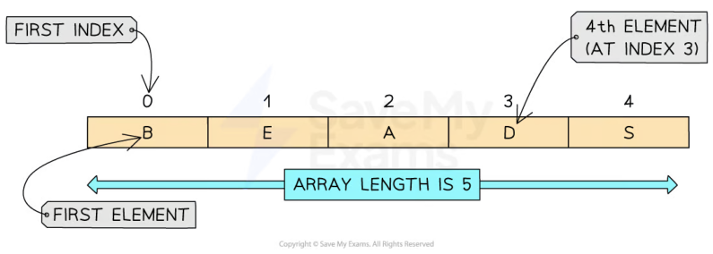
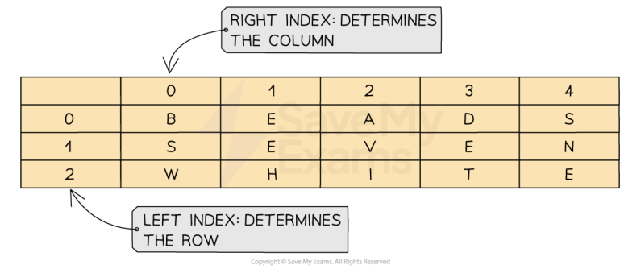

# CAIE Computer Science IGCSE — Chapter ?: Cambridge (CIE) IGCSE Computer Science

---

Your notes 

## Arrays 

## Contents 

Arrays 

© 2026 Save My Exams, Ltd. 

Get more and ace your exams at savemyexams.com 

**1** 

Your notes 

## Arrays 

## 1-Dimensional Arrays 

## What is an array? 

An array is an ordered, static set of elements in a fixed-size memory location 

An array can only store 1 data type 

A 1D array is a linear array 

In languages such as Python, indexes start at 0, known as zero-indexed 

In CIE pseudocode, index's start at 1 

|Concept|Pseudocode|Python|
|---|---|---|
|Create|DECLARE scores: ARRAY[1:5]OF INTEGER|scores = []|
||Creates a blank array with 5 elements (1−5)|Creates a blank array|
||scores←[12, 10, 5, 2, 8]|scores = [12, 10, 5, 2, 8]|
||Creates an array called scores with values assigned||
|Assignment|colours[4]←"Red"|colours[4] = "Red"|
||Assigns the colour "Red" to index 4 (4th element)|Assigns the colour "Red" to index 4 (5th element)|

## Examples 

Creating a one-dimensional array called ‘array’ which contains 5 integers. 

© 2026 Save My Exams, Ltd. 

Get more and ace your exams at savemyexams.com 

**2** 

Create the array with the following syntax: 

|Pseudocode|Python|
|---|---|
|DECLARE MyArray : ARRAY[1:5] OF INTEGER|array = [1, 2, 3, 4, 5]|

Your notes 

Access the individual elements of the array by using the following syntax: 

|Pseudocode|Python|
|---|---|
|MyArray[1]←1|array[index]|

Modify the individual elements by assigning new values to specific indexes using the following syntax: 

|Pseudocode|Python|
|---|---|
|MyArray[index]←newValue|array[index] = newValue|

Use the len function to determine the length of the array by using the following syntax: 

|Pseudocode|Python|
|---|---|
|There is no built-in length function in CIE pseudocode. The array length is known from the declaration or stored in a variable.|len(array)|

In the example the array has been iterated through to output each element within the array 

A for loop has been used for this 

Pseudocode // Creating a one-dimensional array DECLARE MyArray : ARRAY[1:5] OF INTEGER MyArray[1] ← 1 MyArray[2] ← 2 MyArray[3] ← 3 MyArray[4] ← 4 MyArray[5] ← 5 // Accessing elements of the array OUTPUT MyArray[1]          // Output: 1 OUTPUT MyArray[3]          // Output: 3 // Modifying elements of the array MyArray[2] ← 10 // MyArray is now: [1, 10, 3, 4, 5] 

© 2026 Save My Exams, Ltd. 

Get more and ace your exams at savemyexams.com 

**3** 

// Iterating over the array DECLARE Index : INTEGER FOR Index ← 1 TO 5 OUTPUT MyArray[Index] NEXT Index // Output: // 1 // 10 // 3 // 4 // 5 // Length of the array DECLARE Length : INTEGER Length ← 5 OUTPUT Length               // Output: 5 

Your notes 

Python # Creating a one-dimensional array array = [1, 2, 3, 4, 5] # Accessing elements of the array print(array[0])   # Output: 1 print(array[2])   # Output: 3 # Modifying elements of the array array[1] = 10 print(array)      # Output: [1, 10, 3, 4, 5] # Iterating over the array for element in array: print(element) # Output: # 1 # 10 # 3 # 4 # 5 # Length of the array length = len(array) print(length)     # Output: 5 

## 2-Dimensional Arrays 

## What is a 2-dimensional array? 

A 2D array extends the concept on a 1D array by adding another dimension 

A 2D array can be visualised as a table with rows and columns 

© 2026 Save My Exams, Ltd. 

Get more and ace your exams at savemyexams.com 

**4** 

When navigating through a 2D array you first have to go down the rows and then across the columns to find a position within the array 

|Concept|Pseudocode|Python|
|---|---|---|
|Create|Declare a 2D array with name and number for 3 people|Creates a 3×2 blank array (3 people, each with name and number)|
||DECLARE NamesAndNumbers : ARRAY[1:3, 1:2] OF STRING 1:3= 3rows →one for each person 1:2= 2columns →one forname, one fornumber OF STRING →both names and phone numbers are stored as strings|NamesANDNumbers = [[None, None], [None, None], [None, None]]|
||Declare a 2D array calledplayerswith (Alice, Bob, Charlie & Daisy)|nameandscoreassigned for 4 people|
||// Declare a 2D array with 4 rows and 2 columns (name and score) DECLARE players : ARRAY[1:4, 1:2] OF STRING // Assign values to each player players[1,1]←"Alice" players[1,2]←"25" players[2,1]←"Bob" players[2,2]←"30" players[3,1]←"Charlie"|# Each player has a name and a score players = [ ["Alice", 25], ["Bob", 30], ["Charlie", 22], ["Daisy", 28] ]|

Your notes 

© 2026 Save My Exams, Ltd. 

Get more and ace your exams at savemyexams.com 

**5** 

players[3,2] ← "22" players[4,1] ← "Daisy" players[4,2] ← "28" Assignment Assigning the name Holly to replace the name Charlie players[3,1] ← "Holly" players[2][0] = "Holly" # Charlie is at index 2 (third row), name is at index 0 

Your notes 

## Examples 

Initialising a 2D array with 3 rows and 3 columns, with the specified values 

## Pseudocode 

DECLARE Array2D : ARRAY[1:3, 1:3] OF INTEGER Array2D[1,1] ← 1 Array2D[1,2] ← 2 Array2D[1,3] ← 3 Array2D[2,1] ← 4 Array2D[2,2] ← 5 Array2D[2,3] ← 6 Array2D[3,1] ← 7 Array2D[3,2] ← 8 Array2D[3,3] ← 9 

// Accessing elements in the 2D array OUTPUT Array2D[1,1]       // Output: 1 OUTPUT Array2D[2,3]       // Output: 6 

## Python 

array_2d = [[1, 2, 3], [4, 5, 6], [7, 8, 9]] 

# Accessing elements in the 2D array print(array_2d[0][0])  # Output: 1 print(array_2d[1][2])  # Output: 6 

## Iterating through a 2-dimensions array 

When iterating through a 2D array, a nested FOR...NEXT loop can be used 

Nested iteration to access items in the 2D array 

Pseudocode 

© 2026 Save My Exams, Ltd. 

Get more and ace your exams at savemyexams.com 

**6** 

Your notes 

DECLARE Row : INTEGER DECLARE Col : INTEGER FOR Row ← 1 TO 3 FOR Col ← 1 TO 3 OUTPUT Array2D[Row, Col] NEXT Col NEXT Row 

## Python 

for row in array_2d: for item in row: print(item, end=" ") print() # Print a newline after each row 

## Examiner Tips and Tricks 

In the exam, the question will always give an example to demonstrate which order the array is being read from. 

Some questions can be X,Y and others can be Y, X. Always refer to the example before giving your answer! 

## Worked Example 

A parent records the length of time being spent watching TV by 4 children 

Data for one week (Monday to Friday) is stored in a 2D array with the identifier minsWatched . 

The following table shows the array 

|||Quinn|Lyla|Harry|Elias|
|---|---|---|---|---|---|
|||0|1|2|3|
|Monday|0|34|67|89|78|
|Tuesday|1|56|43|45|56|
|Wednesday|2|122|23|34|45|
|Thursday|3|13|109|23|90|
|Friday|4|47|100|167|23|

Elias watched 78 minutes of TV on Monday: 

© 2026 Save My Exams, Ltd. 

Get more and ace your exams at savemyexams.com 

**7** 

Your notes 

Identify the row for Monday: Row 0 . 

Identify the column for Elias: Column 3 . 

Find the value at minsWatched[0][3] : The value is 78 

Write a line of code to output the number of minutes that Lyla watched TV on Tuesday [1] 

Write a line of code to output the number of minutes that Harry watched TV on Friday [1] 

Write a line of code to output the number of minutes that Quinn watched TV on Wednesday [1] 

## Answers 

print(minsWatched[1][1] OR print(minsWatched[1,1] print(minsWatched[4][2] OR print(minsWatched[4,2] print(minsWatched[2][0] OR print(minsWatched[2,0] 

© 2026 Save My Exams, Ltd. 

Get more and ace your exams at savemyexams.com 

**8** 

