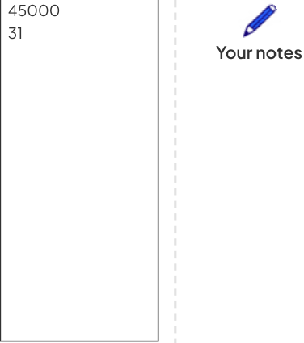

# CAIE Computer Science IGCSE — Chapter ?: Cambridge (CIE) IGCSE Computer Science

---

Your notes 

## File Handling 

## Contents 

File Handling 

© 2026 Save My Exams, Ltd. 

Get more and ace your exams at savemyexams.com 

**1** 

Your notes 

## File Handling 

## File Handling 

## What is file handling? 

File handling is the use of programming techniques to work with information stored in text files 

Examples of file handing techniques are: 

- opening text files 

reading text files 

writing text files 

closing text files 

|Concept|OCR exam reference|Python|
|---|---|---|
|Open|OPENFILE "fruit.txt" FOR READ|fle = open("fruit.txt","r")|
|Close|CLOSEFILE "fruit.txt"|fle.close()|
|Read line|READFILE "fruit.txt", LineOfText|fle.readline()|
|Write line|OPENFILE "fruit.txt" FOR WRITE WRITEFILE "fruit.txt", "Oranges"|fle = open("fruit.txt","w") fle.write("Oranges")|
|Append a fle|OPENFILE "fruit.txt" FOR APPEND|fle = open("fruit.txt","a")|

## Pseudocode example (reading data) 

|Employees|Text fle|
|---|---|
|OPENFILE "employees.txt" FOR READ endOfFile←FALSE  // Set end of fle fag to false WHILE NOT endOfFile DO READFILE "employees.txt", name  // Read line 1 (name) name←TRIM(name)  // Remove extra spaces/newlines READFILE "employees.txt", department  // Read line 2 (department) department←TRIM(department)  // Remove extra spaces/newlines READFILE "employees.txt", salary  // Read line 3 (salary) salary←TRIM(salary)  // Remove extra spaces/newlines|Greg Sales 39000 43 Lucy Human resources 26750 28 Jordan Payroll|

© 2026 Save My Exams, Ltd. 

Get more and ace your exams at savemyexams.com 

**2** 

READFILE "employees.txt", age  // Read line 4 (age) age ← TRIM(age)  // Remove extra spaces/newlines 

IF name = "" THEN  // If name is empty (end of file) endOfFile ← TRUE  // Set end of file flag to true ELSE OUTPUT "Name: " & name  // Print name OUTPUT "Department: " & department  // Print department OUTPUT "Salary: " & salary  // Print salary OUTPUT "Age: " & age  // Print age OUTPUT ""  // Add a blank line for readability ENDIF ENDWHILE 

CLOSEFILE "employees.txt" 

## Python example (reading data) 

Employees Text file # Open file in read mode Greg file = open("employees.txt", "r") Sales 39000 endOfFile = False  # Set end of file flag to false 43 while not endOfFile:  # While not end of file Lucy name = file.readline().strip()  # Read line 1 and remove extra spaces/newlines Human resources department = file.readline().strip()  # Read line 2 26750 salary = file.readline().strip()  # Read line 3 28 age = file.readline().strip()  # Read line 4 Jordan Payroll if name == "":  # If name is empty (end of file) 45000 endOfFile = True  # Set end of file flag to true else: 31 print("Name: ", name)  # Print name print("Department: ", department)  # Print department print("Salary: ", salary)  # Print salary (fixed typo) print("Age: ", age)  # Print age print()  # Add a blank line for readability 

# Close the file file.close() 

## Pseudocode example (writing new data) 

|Employees|Text fle|
|---|---|
|OPENFILE "employees.txt" FOR APPEND // Write employee details to the fle WRITEFILE "employees.txt", "Polly"  // Name WRITEFILE "employees.txt", NEWLINE WRITEFILE "employees.txt", "Sales"  // Department|Greg Sales 39000 43 Lucy|

© 2026 Save My Exams, Ltd. 

Get more and ace your exams at savemyexams.com 

**3** 

WRITEFILE "employees.txt", NEWLINE WRITEFILE "employees.txt", "26000"  // Salary WRITEFILE "employees.txt", NEWLINE WRITEFILE "employees.txt", "32"  // Age WRITEFILE "employees.txt", NEWLINE 

CLOSEFILE "employees.txt" 

Human resources 26750 28 Your notes Jordan Payroll 45000 31 Polly Sales 26000 32 

## Python example (writing new data) 

|Employees|Text fle|
|---|---|
|# Open fle in append mode fle = open("employees.txt", "a") # Write employee details to the fle fle.write("Polly\n")        # Name fle.write("Sales\n")        # Department fle.write("26000\n")        # Salary fle.write("32\n")           # Age # Close the fle fle.close()|Greg Sales 39000 43 Lucy Human resources 26750 28 Jordan Payroll 45000 31 Polly Sales 26000 32|

## Examiner Tips and Tricks 

When opening files it is really important to make sure you use the correct letter in the open command 

- "r" is for reading from a file only 

- "w" is for writing to a new file, if the file does not exist it will be created. If a file with the same name exists the contents will be overwritten 

- "a" is for writing to the end of an existing file only 

Always make a backup of text files you are working with, one mistake and you can lose the contents! 

© 2026 Save My Exams, Ltd. 

Get more and ace your exams at savemyexams.com 

**4** 

Your notes 

## Worked Example 

Use pseudocode to write an algorithm that does the following : 

Inputs the title and year of a book from the user. 

Permanently stores the book title and year to the existing text file books.txt [4] 

How to answer this question 

Write two input statements (title and year of book) Open the file Write inputs to file Close the file 

Example answer 

title = input("Enter title") year = input("Enter year") file = open("books.txt") file.writeline(title) file.writeline(year) file.close() 

## Guidance 

|title = input("Enter title")|1 mark|
|---|---|
|year = input("Enter year")||
|fle = open("books.txt")|1 mark|
|fle.writeline(title)|1 mark|
|fle.writeline(year)||
|fle.close()|1 mark|

© 2026 Save My Exams, Ltd. 

Get more and ace your exams at savemyexams.com 

**5** 

