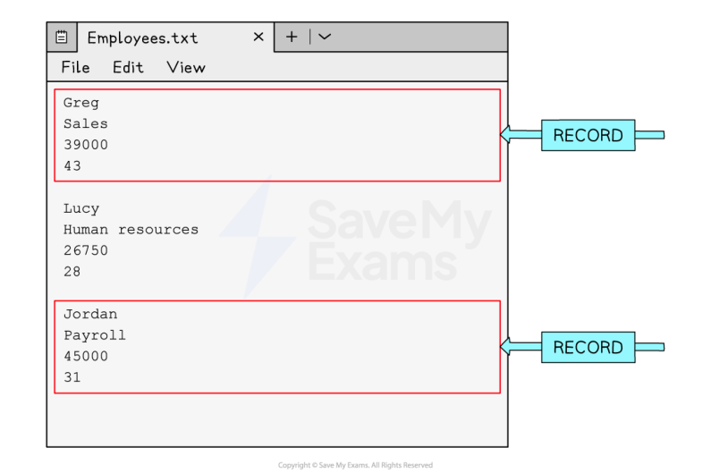

# CAIE Computer Science IGCSE — Chapter ?: Cambridge (CIE) IGCSE Computer Science

---

Your notes 

## Databases 

## Contents 

Single Table Databases Primary Keys 

© 2026 Save My Exams, Ltd. 

Get more and ace your exams at savemyexams.com 

**1** 

Your notes 

## Single Table Databases 

## What is a database? 

- A Database is an organised collection of data 

- A database is made up of either one or multiple tables which are made up of fields and records to organise how it stores data 

It allows easy storage, retrieval, and management of information 

- A database is useful when working with large amounts of data, databases are stored on secondary storage 

- A database is often stored on remote servers so multiple users can access it at the same time, useful for online systems 

- Data can be sorted and searched efficiently, making use of more advanced structures 

They are more secure than text files 

## Fields & records 

## What are fields & records? 

- A field is one piece of information relating to one person, item or object 

- A field is represented in a database by a column, 

- A record is a collection of fields relating to one person, item or object 

- A record is represented in a database by a row 

## Text files 

- A text file is useful when working with small amounts of data, text files are stored on secondary storage and 'read' into a program when being used 

They are used to store information when the application is closed 

- Each entry is stored on a new line or separated with a special identifier, for example, a comma (',') 

It can be difficult in text files to know where a record begins and ends 

© 2026 Save My Exams, Ltd. 

Get more and ace your exams at savemyexams.com 

**2** 

## Validation 

When a table is created, validation rules can be assigned to the different fields 

A validation rule controls what data can be entered into that field 

There are different types of validation checks used to limit what data can be entered into each field 

The validation checks that are used are the same as those that appear in section 7: Algorithm Design & Problem-Solving 

|Type|Description|
|---|---|
|Length Check|This type of validation checks the number ofcharactersthat have been entered into a feld. For example, you might make phone numbers entered have to be eleven characters long|
|Format Check|This type of validation checks data entered meets an exact format. For example, a product code might have to be two letters followed by fve numbers|
|Range Check|A range check will check the number entered is within a specifc range. For example, the age of a dog would be between 0 - 40. Any other number would be disallowed|
|Presence Check|A presence check can be added to felds which cannot be left blank|

© 2026 Save My Exams, Ltd. 

Get more and ace your exams at savemyexams.com 

**3** 

|Type Check|A type check will allow data with a specifc data type to be entered into a feld. For example, if text was entered into a feld which is supposed to contain the date of birth of a person it would not be allowed|
|---|---|
|Check Digits|Check digit validation is a process used to verify the accuracy of numbers such as credit card numbers. A check digit is a single digit added to the end of the number, which is calculated based on a specifc algorithm applied to the other digits in the number. When the data is re-entered the same algorithm can be applied, and if it produces a diferent result the code is incorrect|

Your notes 

## Examiner Tips and Tricks 

You will likely be presented with an example database table and identify either how many fields there are or how many records there are so make sure you remember a record is a row and a field is a column. 

## Worked Example 

A Database Table Containing Student Grades 

|StudentID|FirstName|LastName|MarkSubmitted|Percentage|
|---|---|---|---|---|
|1483792|Shanay|Giles|Y|55|
|1498378|Poppy|Petit|N|20|
|1500121|Diya|Dinesh|Y|74|
|1382972|Joe|Swaile|Y|68|
|1598264|Anton|Smith|Y|34|
|1548282|Felicity|Hall|N|47|

Describe two validation checks that could be used to check data being inputted into the table above [4] 

How to answer this question 

This 

## Answer 

StudentID could have a length check to ensure 7 characters are entered [2] 

FirstName and LastName could have a presence check to make a record cannot be entered without entering the name of the student [2] 

© 2026 Save My Exams, Ltd. 

Get more and ace your exams at savemyexams.com 

**4** 

A type check of boolean could be applied to the Mark Submitted field so that only Y or N are entered [2] 

A range check could be assigned to the Mark column to ensure only numbers between 0 and 100 are entered [2] 

## Data types 

## What is a data type? 

A data type is the type of data that can be held in a field and is defined when designing a table 

Examples of common datatypes are: 

Integer - whole number 

Real - decimal number 

Text/alphanumeric - text data 

Character - single 

Date/Time 

Boolean - true or false values 

In the table cars below, the following datatypes would be used: 

car_id: integer 

make: text/alphanumeric 

model: text/alphanumeric 

colour: text/alphanumeric 

price: real 

## cars 

|car_id|make|model|colour|price|
|---|---|---|---|---|
|1|Peugeot|2008|Red|24950|
|2|Mazda|MX5|Blue|17995|
|3|Citroen|DS4|Black|21450|
|4|Ford|Puma|White|19500|

© 2026 Save My Exams, Ltd. 

Get more and ace your exams at savemyexams.com 

**5** 

Your notes 

## Primary Keys 

## Primary Keys 

## What is a primary key? 

- A primary key is a unique field that can be used to identify a record in a table 

customer_id is the primary key for the customers table below 

Other examples of primary keys in database tables would include: 

- Student_ID in a school database 

Car_Registration in a car database 

Product_ID in a shop database 

|CustomerID|FirstName|LastName|DOB|PhoneNumber|
|---|---|---|---|---|
|001|Andrea|Bycroft|05031976|0746762883|
|002|Melissa|Langler|22012001|0756372892|
|003|Amy|George|22111988|074637|

## Key database terminology 

|Term|Defnition|
|---|---|
|Table|A collection of records with a similar structure|
|Record|A group of related felds, representing one data entry|
|Field|A single piece of data in a record|
|Data type|Type of data held in a feld|
|Primary key|A unique identifer for each record in a table, usually an ID number|

Worked Example 

© 2026 Save My Exams, Ltd. 

Get more and ace your exams at savemyexams.com 

**6** 

Your notes 

A database has been developed for a dance club to store information about their members. 

The database contains one table: Members 

Figure A shows some data from the table. 

## Members 

|MemberID|FirstName|LastName|DateJoined|
|---|---|---|---|
|1|Zarmeen|Hussain|2024−01−19|
|2|Fyn|Ball|2024−02−01|
|3|George|Johnson|2024−02−25|
|4|Ella|Franks|2024−03−04|

State the name of the field from the Members table that is the most suitable to use as the primary key [1] 

## Answer 

(a) MemberID 

© 2026 Save My Exams, Ltd. 

Get more and ace your exams at savemyexams.com 

**7** 

