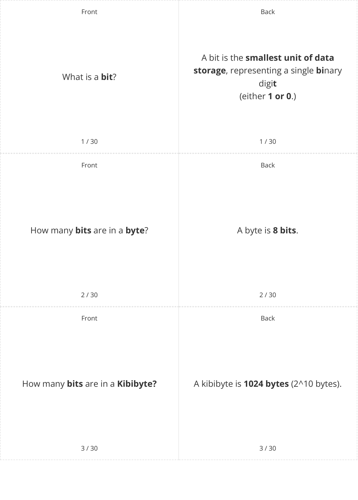
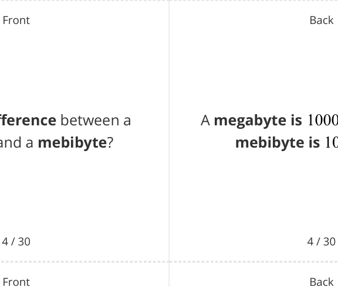
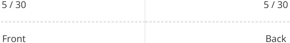
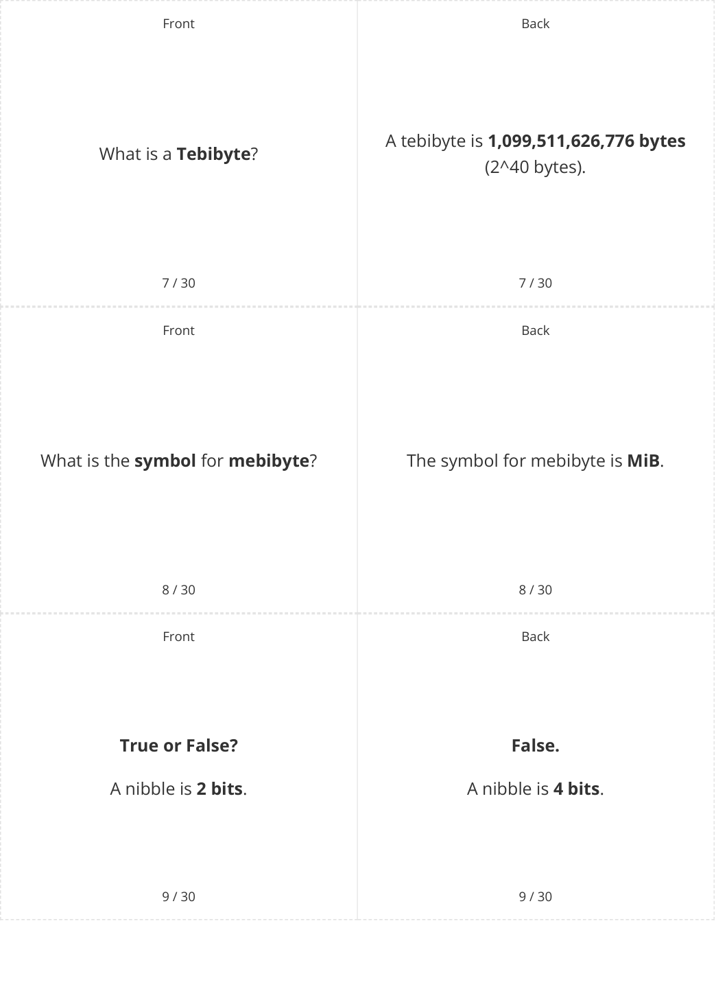

# CAIE Computer Science IGCSE — Chapter ?: Unknown Chapter

---

## **IGCSE Cambridge (CIE) Computer Science** 

30 flashcards 

Flashcards 

## **Data Storage & Compression** 

## **How to use these Flashcards** 

Print single-sided 

Cut along the **dashed** lines 

Fold each card in half 

Test yourself, then flip to check answer 

Scan the QR code for revision help 

**Scan here for revision help** or visit savemyexams.com 

© 2026 Save My Exams, Ltd. 

Get more and ace your exams at savemyexams.com 

**1** 

© 2026 Save My Exams, Ltd. 

Get more and ace your exams at savemyexams.com 

**2** 

What is the between a **difference megabyte** and a **mebibyte** ? 

A **megabyte is** 1000[2] bytes, while a **mebibyte is** 1024[2] **bytes** . 

## **True or False?** 

When converting between units larger than a byte, we use **multiples of 1000** . 

## **False.** 

When converting between units larger than a byte, we use **multiples of 1024** (2^10). 

How do you **convert** from **bytes** to **bits** ? 

To convert from bytes to bits, **multiply by 8** . 

6 / 30 6 / 30 

© 2026 Save My Exams, Ltd. Get more and ace your exams at savemyexams.com 

**3** 

© 2026 Save My Exams, Ltd. Get more and ace your exams at savemyexams.com **4** 

Back 

Front 

How do you convert from **kibibytes** to **bytes** ? 

To convert from kibibytes to bytes, **multiply by 1024** . 

10 / 30 10 / 30 Front Back The size of a bitmap image is calculated by: What is the **formula for calculating Resolution x colour depth** the size of a **bitmap image** ? or **Image width x image height x colour depth** 

||11 / 30|11 / 30|
|---|---|---|
||Front|Back|
|||Resolution is the**total number of**|
|Defne|**resolution**.|**pixels in an image**, calculated by multiplying the image width by the|
|||image height.|
||12 / 30|12 / 30|

© 2026 Save My Exams, Ltd. Get more and ace your exams at savemyexams.com **5** 

Front Back Colour depth is the **number of bits** Define **colour depth** . used to represent the colour of each pixel. 13 / 30 13 / 30 Front Back **True or False? True** . A colour depth of **24 bits** is equal to **3** A colour depth of 24 bits is equal to 3 **bytes** . bytes. 14 / 30 14 / 30 Front Back The size of a sound file is calculated by 

What is the f **ormula for calculating** the size of a ? **Sample rate x duration x sample sound file resolution** . 

15 / 30 15 / 30 

© 2026 Save My Exams, Ltd. 

Get more and ace your exams at savemyexams.com **6** 

|Front|Back|
|---|---|
||Sample rate is the**number of samples**|
|Defne**sample rate**.|**taken per second**in a digital audio|
||recording.|
|16 / 30|16 / 30|
|Front|Back|
||Sample resolution is the**number of**|
|Defne**sample resolution.**|**bits stored per sample**in a digital|
||audio recording.|

||||17 / 30|17 / 30|
|---|---|---|---|---|
||||Front|Back|
|How|do|you|convert fle size from**bits**|To convert fle size from bits to bytes,|
||||**to bytes**?|**divide by 8.**|
||||18 / 30|18 / 30|

© 2026 Save My Exams, Ltd. 

Get more and ace your exams at savemyexams.com **7** 

Back 

Front Back How do you convert file size from **bytes** To convert file size from bytes to **to kibibytes** ? kibibytes, **divide by 1024** . 

19 / 30 19 / 30 Front Back **True or False? False.** The resolution of an image is **measured** The resolution of an image is measured **in bits** . in pixels ( **width x height** ). 20 / 30 20 / 30 Front Back Compression is **reducing the size of a** Define **compression** . **file** so that it takes up less space on secondary storage. 21 / 30 21 / 30 

© 2026 Save My Exams, Ltd. Get more and ace your exams at savemyexams.com **8** 

|Sta|Front 22 / 30 te**three benefts**of compression.|Back 22 / 30 Three benefts of compression are: **Less storage space required** **Less bandwidth required** **Shorter transmission time**||
|---|---|---|---|
||Front 23 / 30 Defne**lossy** **compression**.|Back 23 / 30 Lossy compression is a method of data compression where**data is lost**in order to reduce fle size, resulting in a **loss of quality**but smaller fle sizes.||
||Front 24 / 30 Defne**lossless** **compression**.|Back 24 / 30 Lossless compression is a method of data compression where data is **encoded**to reduce fle size**without** **losing any information**, allowing the **original data to be perfectly** **reconstructed**.||

State **three benefits** of compression. 

© 2026 Save My Exams, Ltd. Get more and ace your exams at savemyexams.com **9** 

## **True or False?** 

Lossy compression is **reversible** . 

25 / 30 Front 

What are suitable for **types of files lossy** compression? 

26 / 30 

Front 

How does **lossy compression** work on **photographs** ? 

## **False.** 

Lossy compression is **irreversible** . 

25 / 30 

Back 

Files suitable for lossy compression are those where **reducing quality is acceptable** , such as **images** , **video** , and **sound** files. 

26 / 30 

Back 

In photographs, lossy compression tries to **group similar colours** together, reducing the number of colours in the image without significantly compromising the overall visual quality. 

27 / 30 

27 / 30 

© 2026 Save My Exams, Ltd. Get more and ace your exams at savemyexams.com **10** 

Back 

Front 

## **True or False?** 

## **True.** 

Lossless compression can be used **on all types** of data. 

Lossless compression can be used **on all types** of data. 

28 / 30 

28 / 30 

Front 

Back 

How does **lossless compression** work on **documents** ? 

In documents, lossless compression **uses algorithms** to analyse the contents, looking for **patterns and repetition** , such as **replacing repeating characters** with a single character and the number of occurrences. 

29 / 30 29 / 30 Front Back 

29 / 30 

What is an **advantage** of **lossless compression** over lossy compression? 

An advantage of lossless compression is **can be returned to its** that the file **original** state without any loss of data quality. 

30 / 30 30 / 30 

© 2026 Save My Exams, Ltd. 

Get more and ace your exams at savemyexams.com **11** 

