# CAIE Computer Science IGCSE — Chapter ?: Unknown Chapter

---

**IGCSE Cambridge (CIE) Computer Science** 

40 flashcards 

Flashcards 

## **Types & Methods of Data Transmission** 

## **How to use these Flashcards** 

Print single-sided 

Cut along the **dashed** lines 

Fold each card in half 

Test yourself, then flip to check answer 

Scan the QR code for revision help 

**Scan here for revision help** or visit savemyexams.com 

© 2026 Save My Exams, Ltd. 

Get more and ace your exams at savemyexams.com **1** 

Front Back Packets are **small 'chunks' of data** that make up a larger piece of data that has What are **packets** ? been **broken down by the TCP protocol** so that it can be **transmitted over the internet.** 

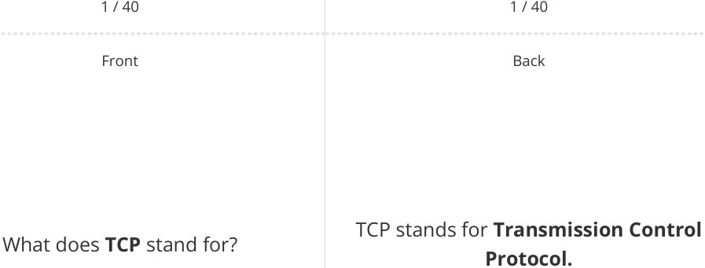

2 / 40 2 / 40 

© 2026 Save My Exams, Ltd. 

Get more and ace your exams at savemyexams.com **2** 

|Front 3 / 40 What are the**three main components** of a**packet**?|Back 3 / 40 The three main components of a packet are**header**,**payload**, and**trailer.**|
|---|---|
|Front 4 / 40 **Payload**|Back 4 / 40 The**actual data being transported**in a packet.|
|||

© 2026 Save My Exams, Ltd. 

Get more and ace your exams at savemyexams.com **3** 

Front 

Back 

What **information** is typically included in a **packet's header** ? 

A packet's header typically includes the **source IP address** , **destination IP address** , and **packet number.** 

5 / 40 5 / 40 Front Back The purpose of error checking in What is the **purpose** of **error checking** packets is to **ensure that when a** in packets? **packet is received there is minimal or no corruption of the data.** 

6 / 40 

6 / 40 

© 2026 Save My Exams, Ltd. Get more and ace your exams at savemyexams.com 

**4** 

|Front 7 / 40 **Parity bit**|Back 7 / 40 **A bit added to a packet**to**check that** **no bits have been fipped**from 0 to 1 or vice versa.|
|---|---|
|Front 8 / 40 **Checksum**|Back 8 / 40 **A calculation performed on packet** **data**to**detect corruption**by comparing the result to a stored checksum value.|
|||

© 2026 Save My Exams, Ltd. 

Get more and ace your exams at savemyexams.com **5** 

Front 

## **True or False?** 

## **False.** 

Packets **always** arrive at their destination **in the correct order** . 

Packets can arrive at their destination **in any order** and need to be reassembled. 

9 / 40 Front 

Corruption is where **packet data is** What is **corruption** in the context of **changed or lost in some way** , or **data data packets** ? **is gained that originally was not in the packet.** 

10 / 40 

10 / 40 

© 2026 Save My Exams, Ltd. Get more and ace your exams at savemyexams.com 

**6** 

Front What is **packet switching** ? 

11 / 40 Front 

How many **stages** are there in **packet switching** ? 

12 / 40 

Packet switching is **a method of sending and receiving data** (packets) **across a network,** the packs of data are sent via **different routes.** 

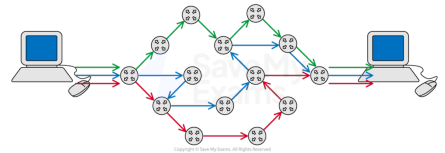

11 / 40 Back 

There are **five stages** in packet switching. 

12 / 40 

© 2026 Save My Exams, Ltd. 

Get more and ace your exams at savemyexams.com **7** 

Front 

What is the **role of routers** in **packet switching** ? 

13 / 40 

Front 

## **True or False?** 

In packet switching, **all packets must** 

**take the same route** to the destination. 

14 / 40 

Back 

Routers **control the routes taken for each packet** and **decide which nearby router is closer to the destination device.** 

13 / 40 

Back 

**False.** 

In packet switching, **packets can take** to reach the **different routes** destination. 

14 / 40 

© 2026 Save My Exams, Ltd. 

Get more and ace your exams at savemyexams.com 

**8** 

Front 

Back 

What happens if a **packet does not reach its destination** ? 

15 / 40 

Front 

What is **one advantage** of packet switching in terms of **data security** ? 

16 / 40 

If a packet does not reach its destination, **the receiver can send a resend request to the sender** to **resend the packet.** 

15 / 40 

Back 

One advantage of packet switching in terms of data security is that it's **harder to hack an individual's data as each packet contains minimal data** and **travels through the network separately.** 

16 / 40 

© 2026 Save My Exams, Ltd. 

Get more and ace your exams at savemyexams.com 

**9** 

Why is packet switching **generally faster** than **sending a large packet** ? 

Packet switching is generally faster because **each packet finds the quickest way around the network.** 

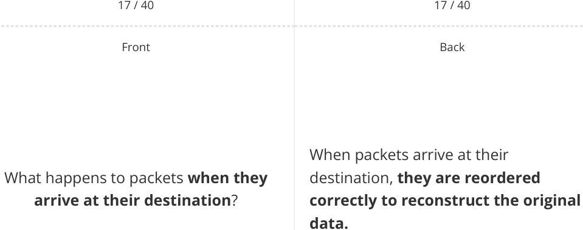

18 / 40 18 / 40 

© 2026 Save My Exams, Ltd. 

Get more and ace your exams at savemyexams.com 

**10** 

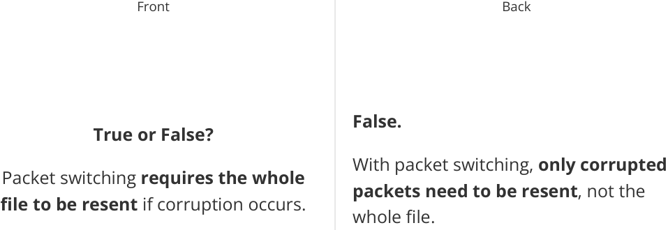

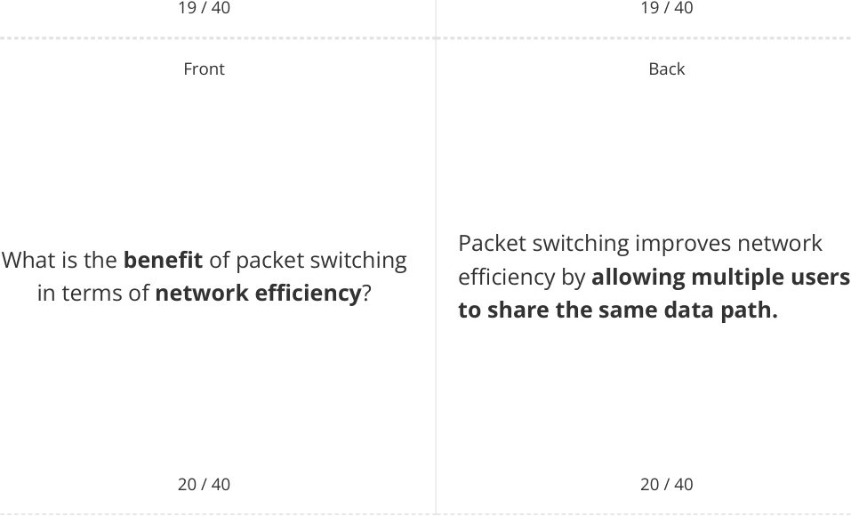

© 2026 Save My Exams, Ltd. Get more and ace your exams at savemyexams.com 

**11** 

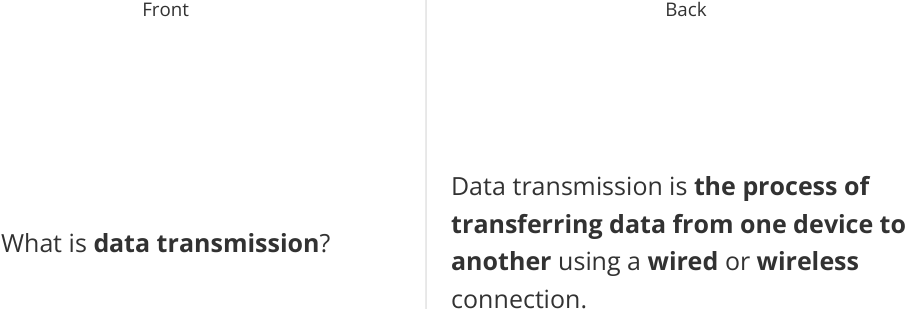

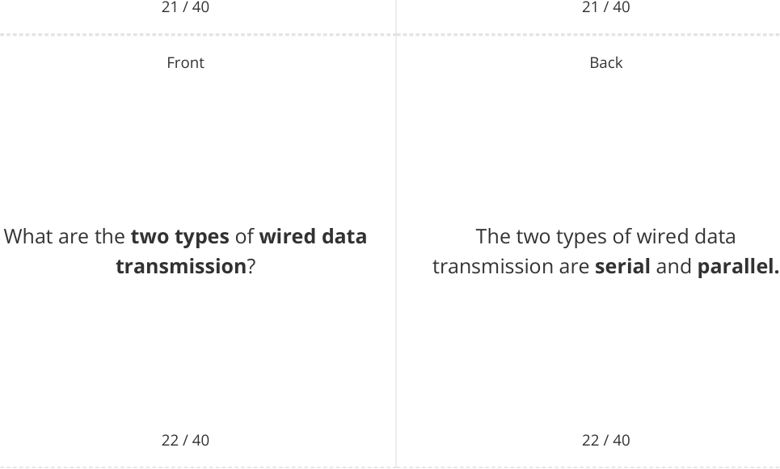

© 2026 Save My Exams, Ltd. 

Get more and ace your exams at savemyexams.com 

**12** 

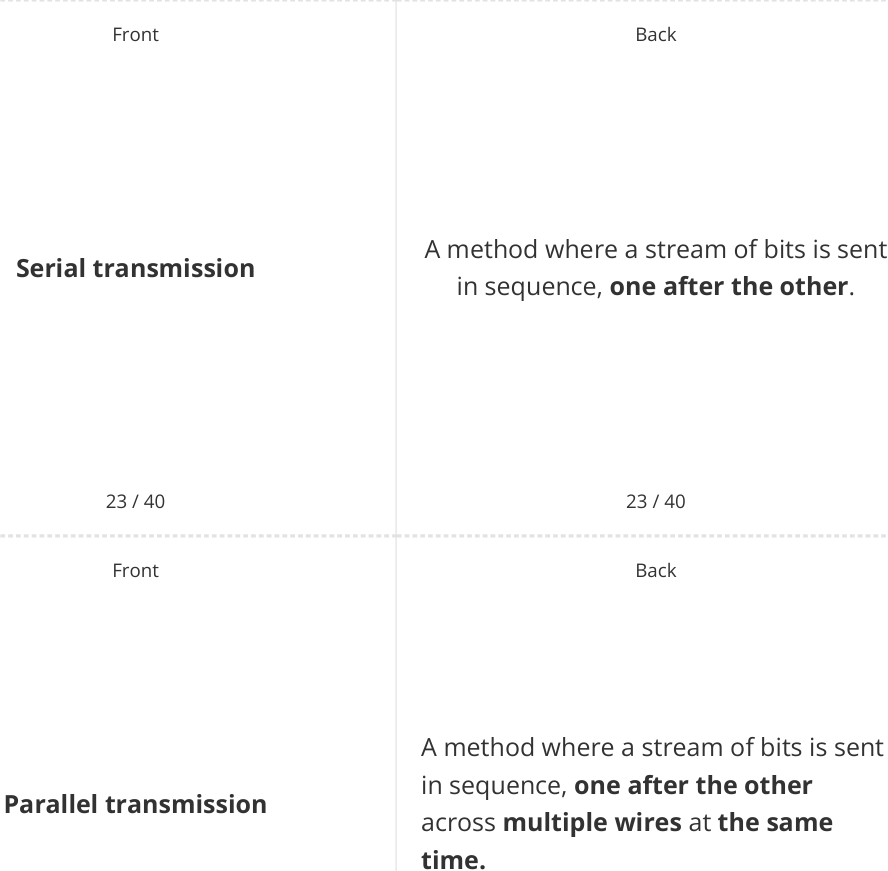

© 2026 Save My Exams, Ltd. 

Get more and ace your exams at savemyexams.com 

**13** 

Front Back A skew is caused by **data arriving out** What is a **skew** in **parallel of order** in **asynchronous parallel transmission** ? **transmission.** 

25 / 40 25 / 40 Front Back **True or False? False. Serial** transmission is **faster than Parallel** transmission **is generally parallel** transmission. **faster than serial** transmission. 

26 / 40 26 / 40 

© 2026 Save My Exams, Ltd. Get more and ace your exams at savemyexams.com 

**14** 

Front Back What is an **advantage** of **serial** An advantage of serial transmission is **transmission** over **parallel** that it is **more reliable over longer transmission** ? **distances.** 

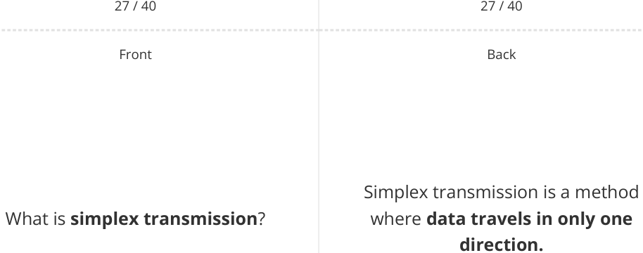

28 / 40 28 / 40 

© 2026 Save My Exams, Ltd. 

Get more and ace your exams at savemyexams.com 

**15** 

Front Back Half-duplex transmission is a method What is **half-duplex transmission** ? where **data can travel in both directions** , but **not simultaneously.** 

29 / 40 29 / 40 Front Back Full-duplex transmission is a method What is **full-duplex transmission** ? where **data can travel in both directions at the same time.** 

30 / 40 

30 / 40 

© 2026 Save My Exams, Ltd. 

Get more and ace your exams at savemyexams.com 

**16** 

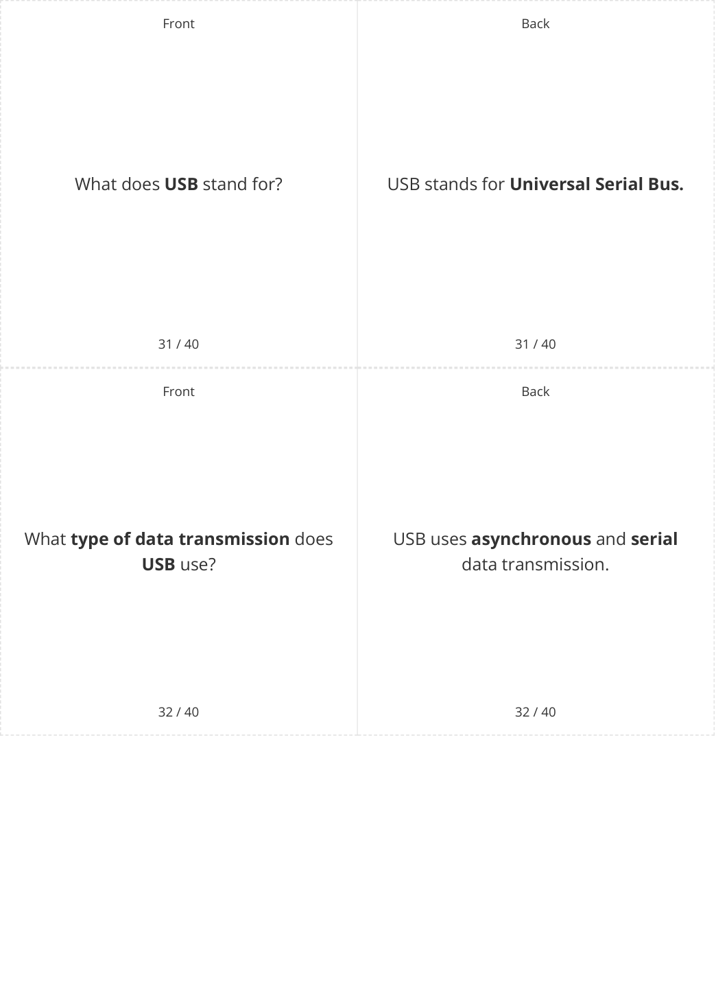

© 2026 Save My Exams, Ltd. 

Get more and ace your exams at savemyexams.com 

**17** 

Back 

Front 

Three types of USB connectors are **USBA** , **USB-B** , and **USB-C.** 

Name **three types** of **USB connectors** . 

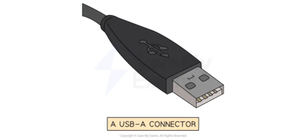

33 / 40 Front 

When a device is connected to a USB What happens when **a device is** port, the **computer automatically connected to a USB port** ? **detects the device** and **loads the appropriate driver.** 

34 / 40 

34 / 40 

© 2026 Save My Exams, Ltd. 

Get more and ace your exams at savemyexams.com **18** 

Front Back A device driver is **software that allows** What is a **device driver** ? **a device to communicate** with the computer. 

35 / 40 35 / 40 Front Back **True or False? False.** 

USB cables can be connected **in any** USB cables ( **except USB-C** ) can only be **orientation** . connected **in one orientation** . 

36 / 40 36 / 40 

© 2026 Save My Exams, Ltd. Get more and ace your exams at savemyexams.com 

**19** 

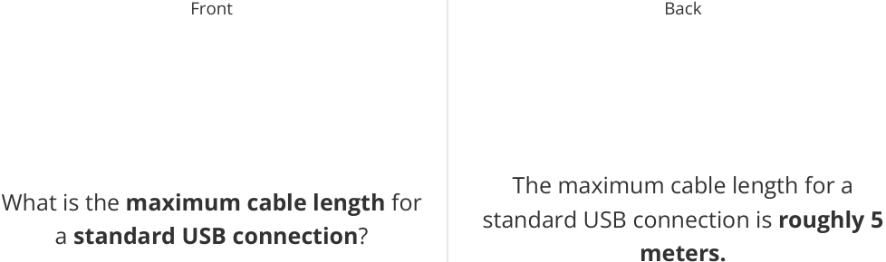

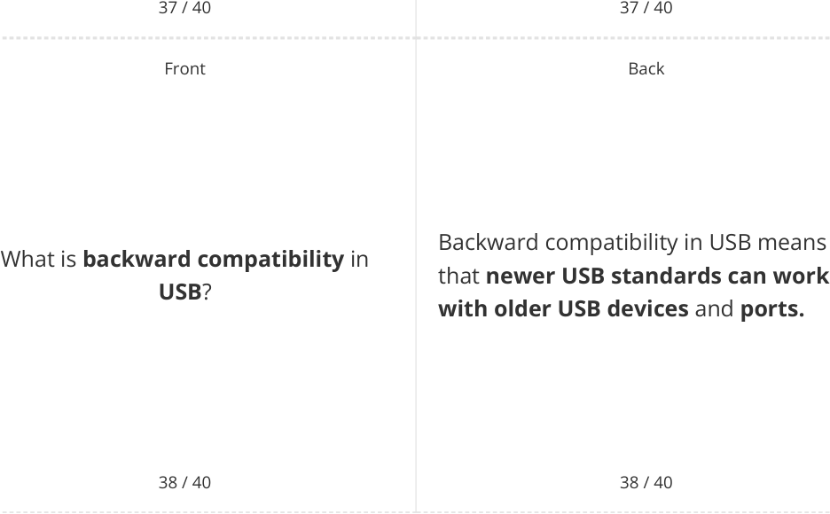

© 2026 Save My Exams, Ltd. 

Get more and ace your exams at savemyexams.com 

**20** 

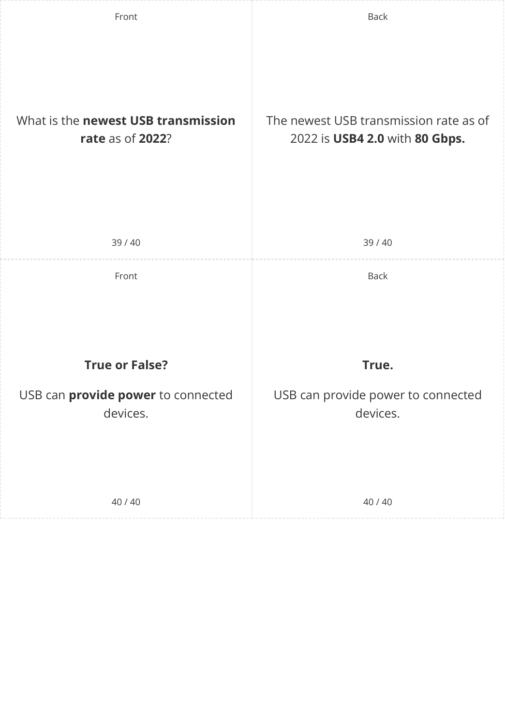

© 2026 Save My Exams, Ltd. 

Get more and ace your exams at savemyexams.com 

**21** 

