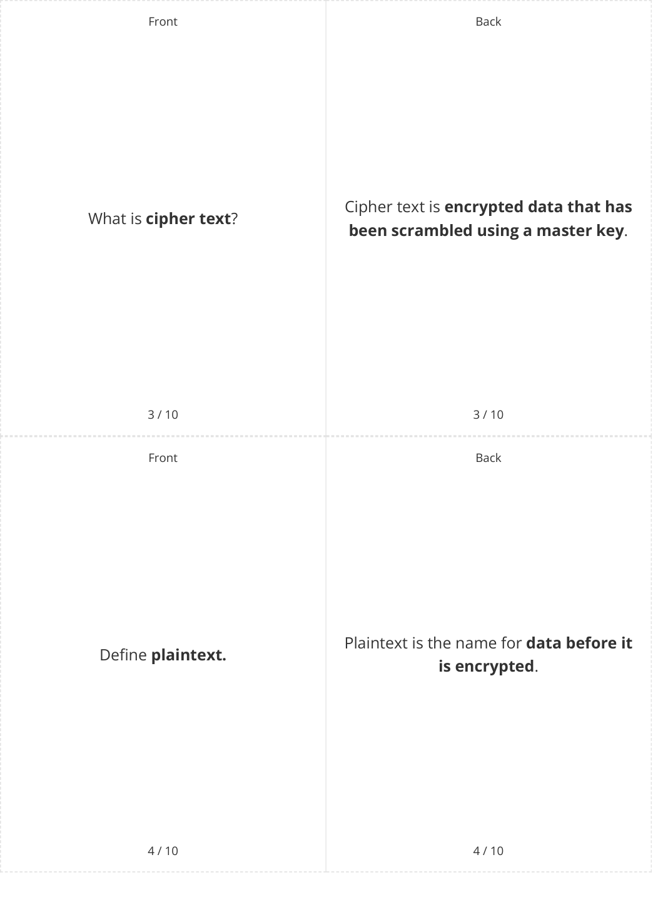
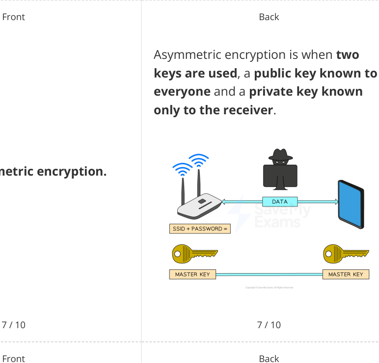
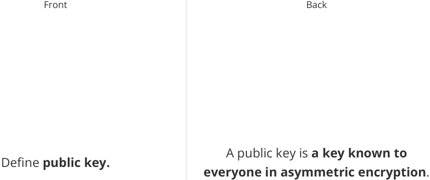
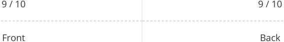

# CAIE Computer Science IGCSE — Chapter ?: Unknown Chapter

---

## **IGCSE Cambridge (CIE) Computer Science** 

10 flashcards 

Flashcards 

## **Encryption** 

## **How to use these Flashcards** 

Print single-sided **Scan here for revision help** Cut along the **dashed** lines or visit savemyexams.com 

Fold each card in half 

Test yourself, then flip to check answer 

Scan the QR code for revision help 

© 2026 Save My Exams, Ltd. 

Get more and ace your exams at savemyexams.com 

**1** 

|Front What is**encryption**?|Back Encryption is**a method of scrambling** **data before being transmitted across** **a network**in order to**protect the** **contents from unauthorised access**.|
|---|---|

|1 / 10|1 / 10|
|---|---|
|Front|Back|
||SSID is**Service Set Identifer**, which|
|Defne**SSID.**|along with a password is**used to** **create a 'master key' for wireless**|
||**network encryption**.|

2 / 10 2 / 10 

© 2026 Save My Exams, Ltd. 

Get more and ace your exams at savemyexams.com 

**2** 

© 2026 Save My Exams, Ltd. 

Get more and ace your exams at savemyexams.com **3** 

Front Back **True or False? True.** The master key **is never transmitted** The master key **is never transmitted in wireless** network encryption. **in wireless** network encryption. 

5 / 10 5 / 10 Front Back 

Symmetric encryption is when **both the sender and receiver are given an** What is **symmetric encryption** ? **identical secret key** which can be used **to encrypt or decrypt** information. 

© 2026 Save My Exams, Ltd. 

Get more and ace your exams at savemyexams.com 

**4** 

Define **asymmetric encryption.** 

What **protocol** is specifically **designed WPA2** is specifically designed for Wi-Fi **for Wi-Fi security** ? security. 

© 2026 Save My Exams, Ltd. 

Get more and ace your exams at savemyexams.com **5** 

## **True or False?** 

## **False.** 

In asymmetric encryption, **only the** In asymmetric encryption, **both the public key is needed** to encrypt and **public and private keys are needed** to decrypt information. encrypt and decrypt information. 

© 2026 Save My Exams, Ltd. 

Get more and ace your exams at savemyexams.com 

**6** 

