# CAIE Computer Science IGCSE — Chapter 7: Unknown Chapter

---

## **IGCSE Cambridge (CIE) Computer Science** 

54 flashcards 

Flashcards 

## **Computer Architecture** 

## **How to use these Flashcards** 

Print single-sided **Scan here for revision help** Cut along the **dashed** lines or visit savemyexams.com 

Fold each card in half 

Test yourself, then flip to check answer 

Scan the QR code for revision help 

© 2026 Save My Exams, Ltd. 

Get more and ace your exams at savemyexams.com 

**1** 

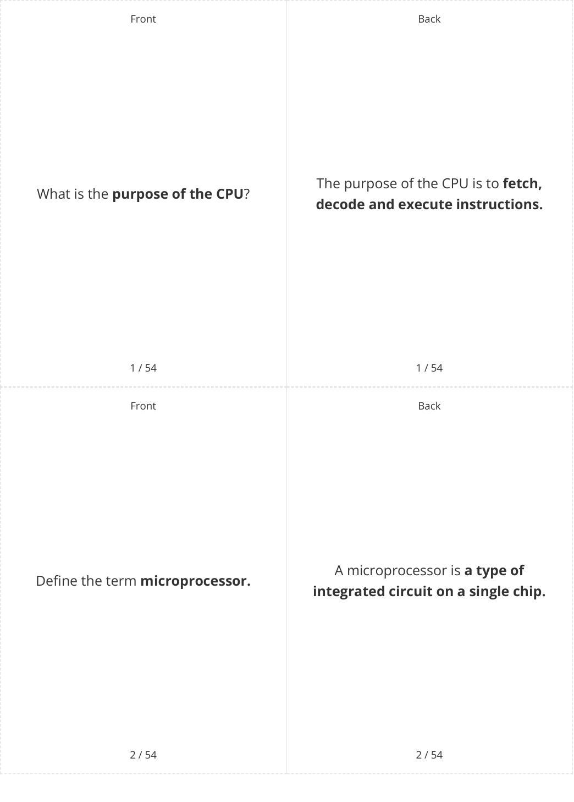

© 2026 Save My Exams, Ltd. 

Get more and ace your exams at savemyexams.com 

**2** 

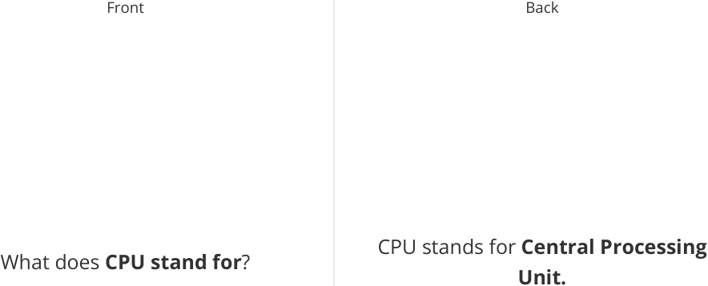

3 / 54 3 / 54 Front Back 

## **True or False?** 

The CPU is only used in desktop computers. 

## **False.** 

The CPU is used in various devices including laptops, desktops, games consoles, and mobile devices. 

4 / 54 4 / 54 

© 2026 Save My Exams, Ltd. 

Get more and ace your exams at savemyexams.com 

**3** 

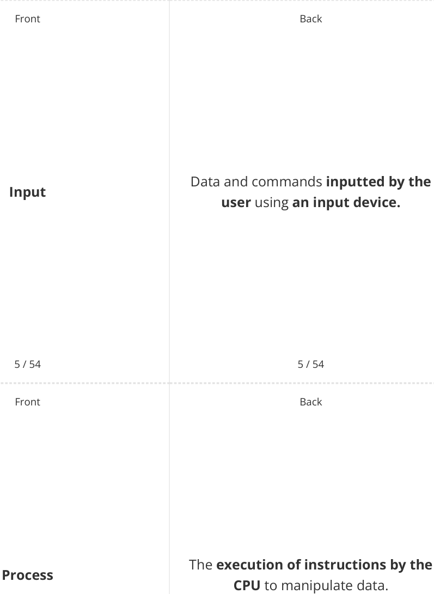

© 2026 Save My Exams, Ltd. 

Get more and ace your exams at savemyexams.com **4** 

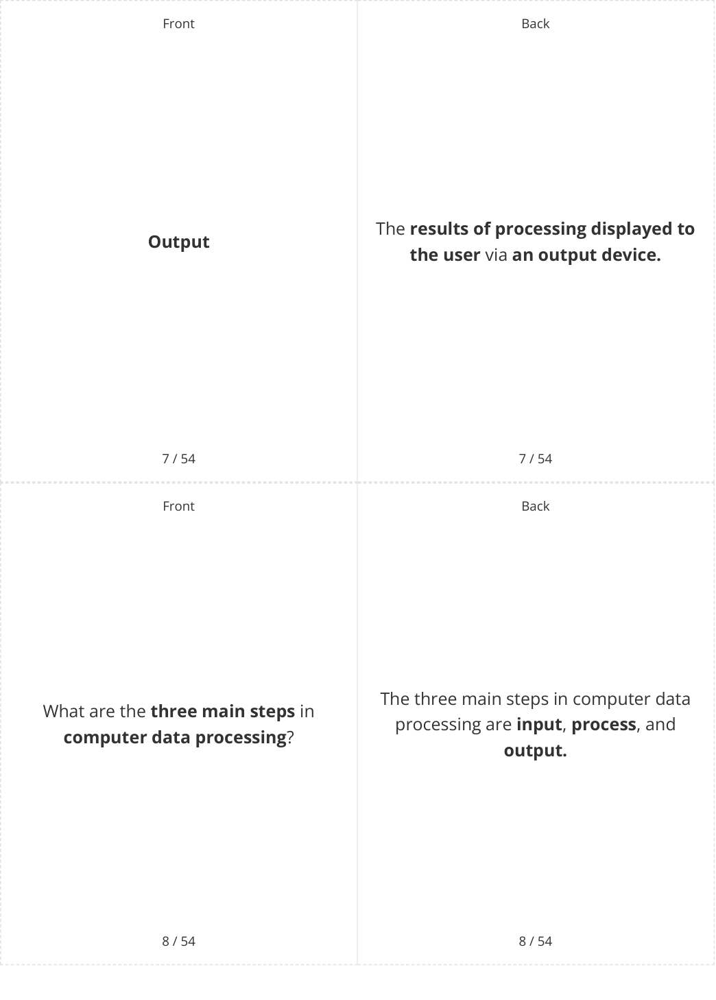

© 2026 Save My Exams, Ltd. 

Get more and ace your exams at savemyexams.com **5** 

## **True or False?** 

## **True** . 

The terms **CPU** and **microprocessor** The terms CPU and microprocessor can can be used **interchangeably** . be used interchangeably. 

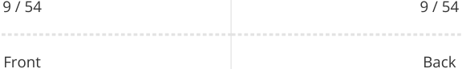

The Von Neumann Architecture is **a design of the CPU** proposed by John Von Neumann in the 1940s, which **most general-purpose computers are built upon.** 

What is the **Von Neumann Architecture** ? 

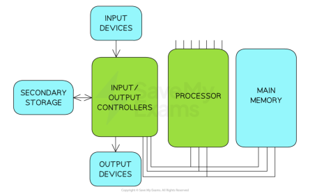

© 2026 Save My Exams, Ltd. 

Get more and ace your exams at savemyexams.com 

**6** 

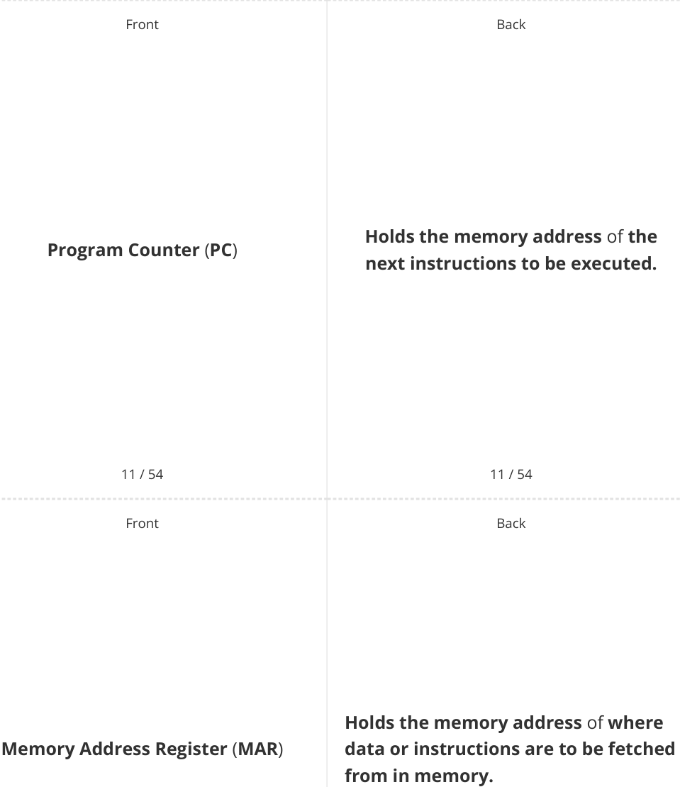

© 2026 Save My Exams, Ltd. 

Get more and ace your exams at savemyexams.com **7** 

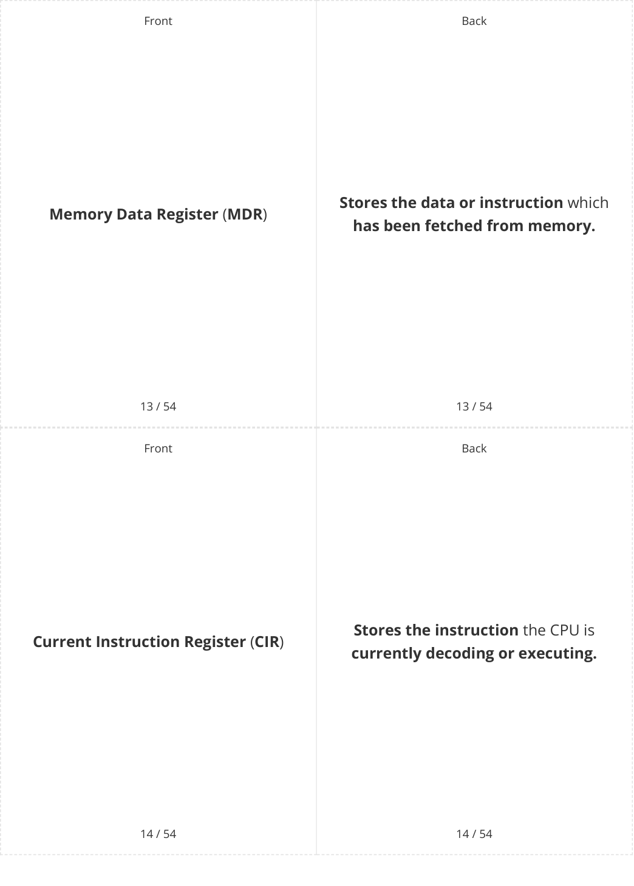

© 2026 Save My Exams, Ltd. 

Get more and ace your exams at savemyexams.com 

**8** 

|Front **Accumulator**(**ACC**)|Back **Stores the results of any calculations** that have taken place**in the Arithmetic** **Logic Unit**(**ALU**).|
|---|---|

|15 / 54|15 / 54|
|---|---|
|Front|Back|
||A bus is**a set of parallel wires**|
|What is a**bus**in**computer**|**through which data/signals are**|
|**architecture**?|**transmitted**from**one component to**|
||**another**.|

16 / 54 16 / 54 

© 2026 Save My Exams, Ltd. Get more and ace your exams at savemyexams.com 

**9** 

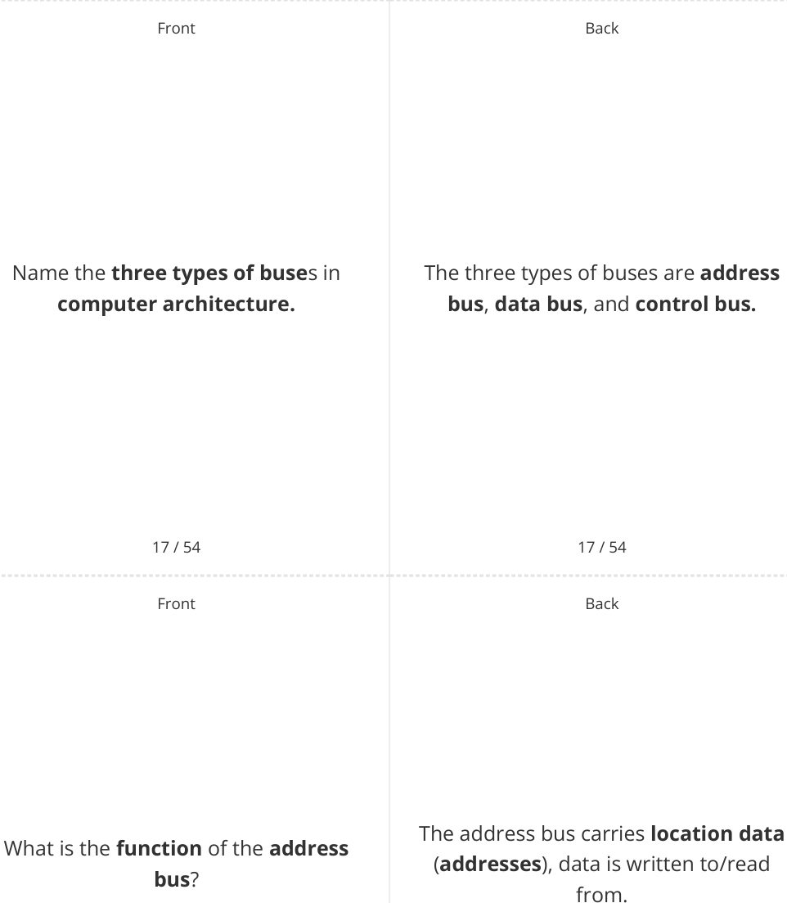

© 2026 Save My Exams, Ltd. 

Get more and ace your exams at savemyexams.com 

**10** 

Front Back **False. True or False?** The **data bus is bidirectional** , carrying The **data bus** is **unidirectional** . data or instructions in both directions. 

19 / 54 19 / 54 Front Back 

The Fetch-Decode-Execute Cycle is **the** What is the **Fetch-Decode-Execute cycle that the central processing unit Cycle** ? **(CPU) runs through billions of times per second** to make a computer work. 

20 / 54 20 / 54 

© 2026 Save My Exams, Ltd. 

Get more and ace your exams at savemyexams.com **11** 

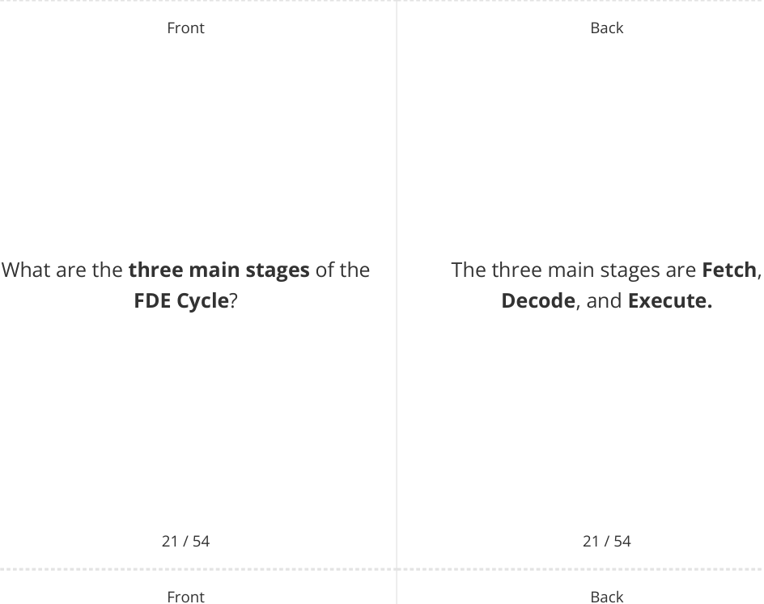

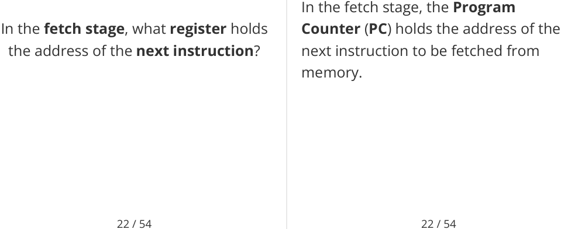

© 2026 Save My Exams, Ltd. Get more and ace your exams at savemyexams.com 

**12** 

Front Back The Program Counter **increments by 1** What happens to the **Program Counter** so it is **pointing to the next after an instruction is fetched** ? **instruction** to be executed. 

23 / 54 23 / 54 Front Back The **part of an instruction** that **Opcode specifies what operation to perform.** 

24 / 54 24 / 54 

© 2026 Save My Exams, Ltd. 

Get more and ace your exams at savemyexams.com **13** 

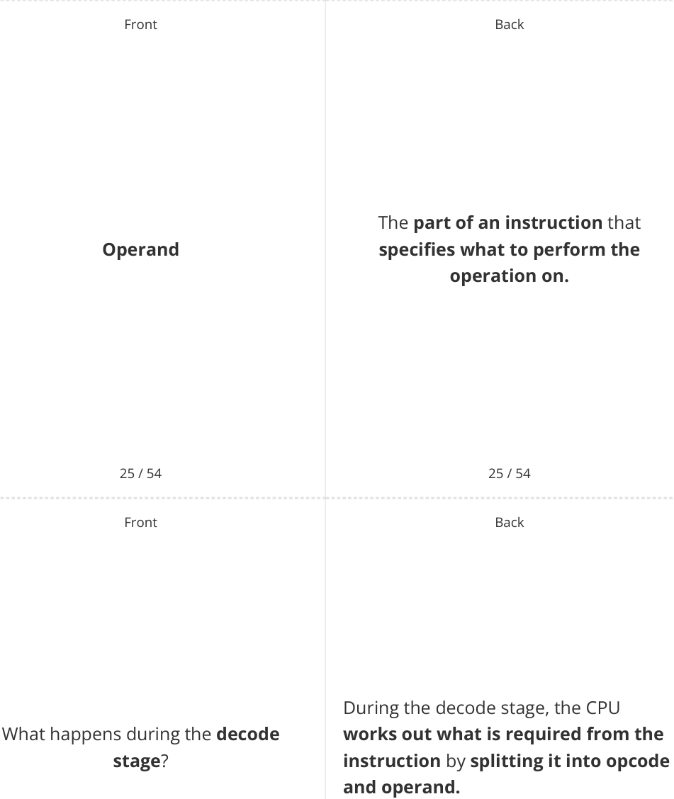

© 2026 Save My Exams, Ltd. 

Get more and ace your exams at savemyexams.com 

**14** 

Front Back **False. True or False?** The execute stage can involve The execute stage **always** involves **performing a calculation** , **storing a** performing a calculation. **result** , or **fetching data from memory** , depending on the instruction. 

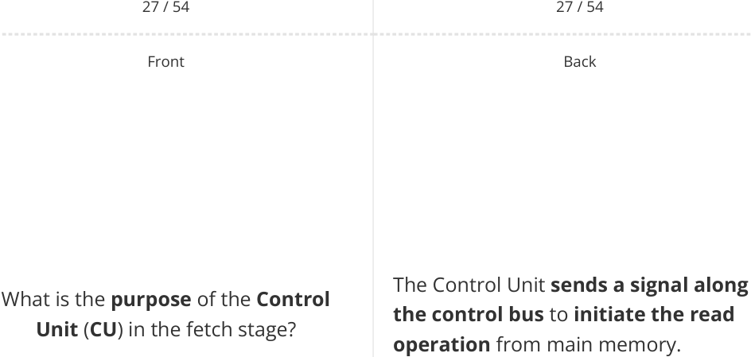

© 2026 Save My Exams, Ltd. Get more and ace your exams at savemyexams.com **15** 

Front Back How many **times per second** does a A modern CPU typically performs the modern CPU typically **perform the** Fetch-Decode-Execute cycle **billions of Fetch-Decode-Execute cycle** ? **times per second.** 

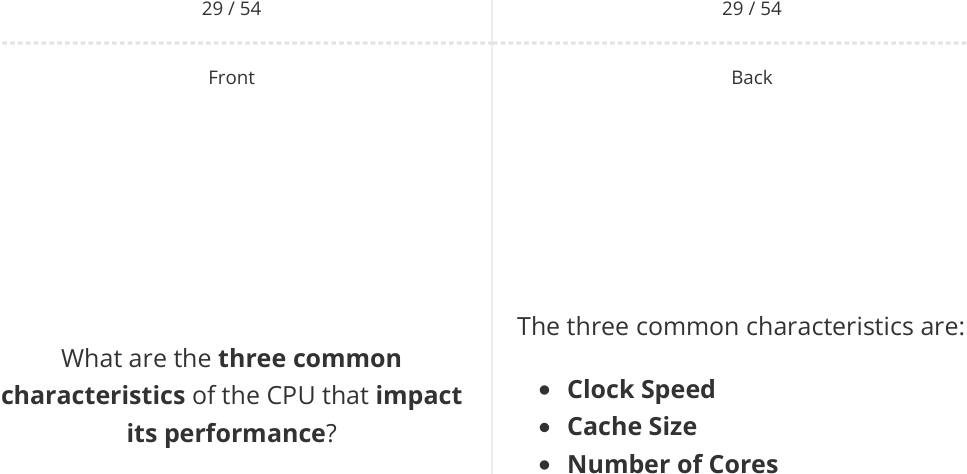

© 2026 Save My Exams, Ltd. Get more and ace your exams at savemyexams.com **16** 

Front Back Clock speed is **measured in Hertz** (Hz) and measures the **number of fetch-** Define **clock speed** . **decode-execute cycles** that can take place **in 1 second** . 

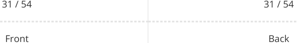

## **True or False?** 

## **True.** 

Modern computers have a **clock speed measured in Gigahertz** ( **GHz** ), meaning billions of cycles per second. 

Modern computers have a **clock speed in Gigahertz** ( **GHz** ), meaning billions of cycles per second. 

© 2026 Save My Exams, Ltd. 

Get more and ace your exams at savemyexams.com **17** 

Front Back The **faster the Clock Speed** , the **more** What is the **impact** of a **faster clock instructions can be fetched and speed** ? **executed** per second. 

33 / 54 33 / 54 Front Back A **Clock Speed of 3.5GHz** means it can What does a **Clock Speed** of **3.5GHz** perform **up to 3.5 billion instructions mean** ? **per second** . 

© 2026 Save My Exams, Ltd. 

Get more and ace your exams at savemyexams.com **18** 

Front Back **Cache** is used as **temporary storage** to What is **cache** used for? provide **quick access to frequently used instructions** and **data** . 

35 / 54 35 / 54 Front Back 

The **larger the Cache Size** , the **more frequently used instructions or data** What is the **benefit** of a **larger cache can be stored** , resulting in **fewer fetch size** ? **cycles from RAM** and improved performance. 

36 / 54 36 / 54 

© 2026 Save My Exams, Ltd. 

Get more and ace your exams at savemyexams.com **19** 

Front 

Back 

Each **core** works like **its own CPU** , so multiple cores allow multiple processing units to **fetch, decode and execute instructions simultaneously** . 

**number of cores** . Define 

37 / 54 

Front 

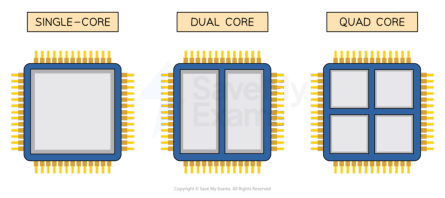

37 / 54 

Back 

## **False.** 

## **True or False?** 

A **dual-core** CPU with a Clock Speed of **3.6GHz** can fetch, decode & execute more instructions in 1 second that a **quad-core** CPU with a Clock Speed of **2.5GHz** ? 

A dual-core CPU (2 cores) running at 3.6GHz can perform 2 x 3.6 billion instructions = **7.2 billion instructions per second** . 

A quad-core CPU (4 cores) running at 2.5GHz can perform 4 x 2.5 billion instructions = **10 billion instructions per second** . 

38 / 54 

38 / 54 

© 2026 Save My Exams, Ltd. 

Get more and ace your exams at savemyexams.com 

**20** 

Front Back For a dual-core processor, "dual-core" For a **dual-core** 2.5GHz processor, what means there are **two cores** (processing does " **dual-core** " mean? units) that can fetch, decode and execute instructions. 

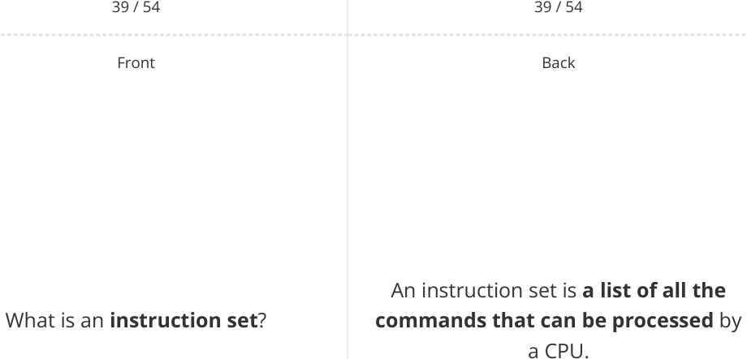

© 2026 Save My Exams, Ltd. 

Get more and ace your exams at savemyexams.com **21** 

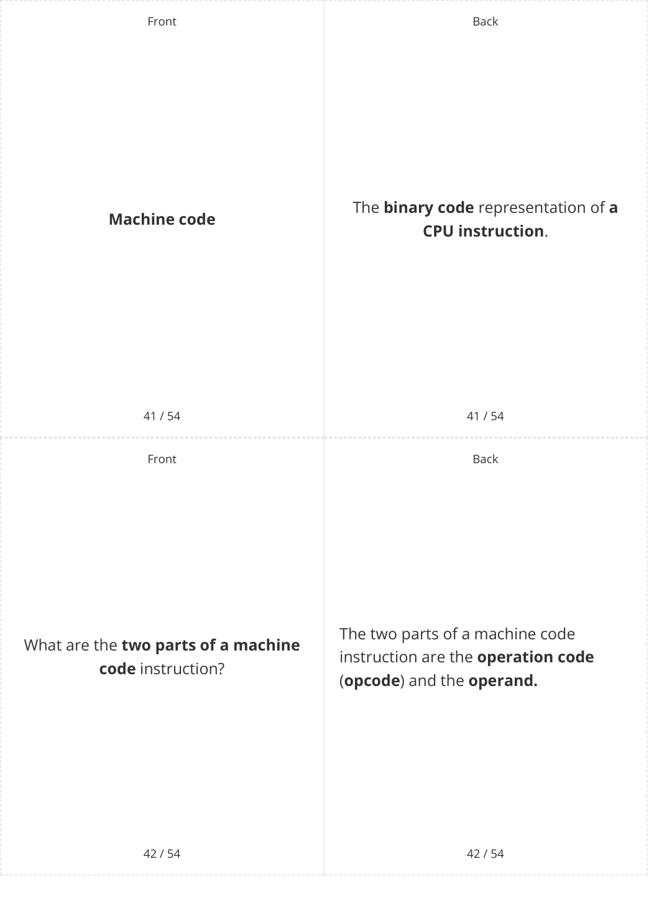

© 2026 Save My Exams, Ltd. Get more and ace your exams at savemyexams.com **22** 

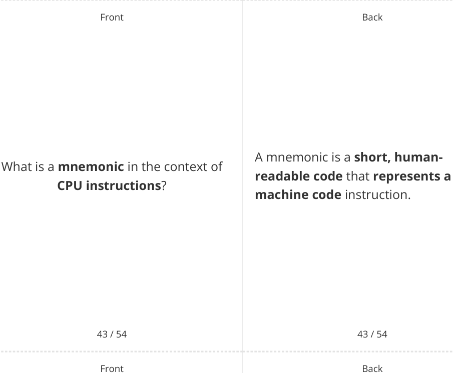

## **True or False?** 

**False.** 

Instruction sets **are machine-specific** CPU instruction sets are **universal** and can vary between different across all processors. processor manufacturers. 

© 2026 Save My Exams, Ltd. 

Get more and ace your exams at savemyexams.com 

**23** 

Front Back The ADD instruction typically **adds a** What does the **ADD instruction value to the value currently stored in** typically do? **the accumulator** ( **ACC** ). 

45 / 54 45 / 54 Front Back The LDA instruction typically **loads the** What does the **LDA instruction value stored in a memory location** typically do? **into the accumulator.** 

© 2026 Save My Exams, Ltd. 

Get more and ace your exams at savemyexams.com **24** 

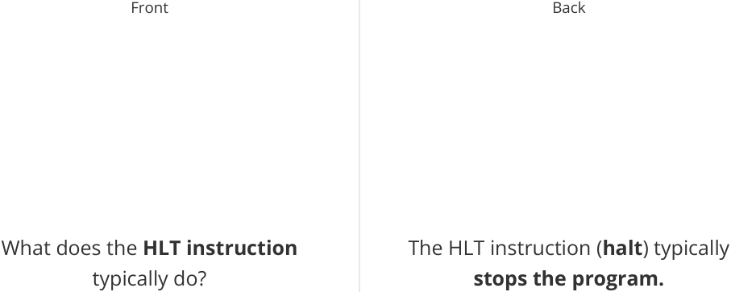

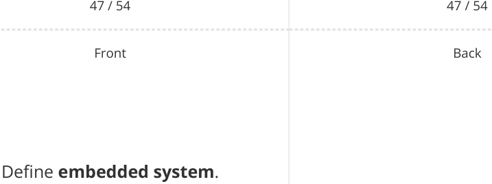

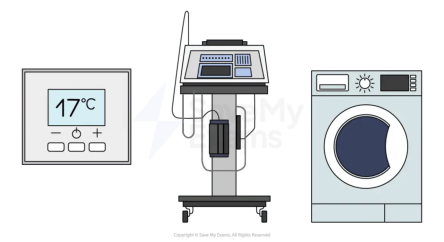

An **embedded system** is a computer system with a single function, inside a larger mechanical unit. 

© 2026 Save My Exams, Ltd. 

Get more and ace your exams at savemyexams.com **25** 

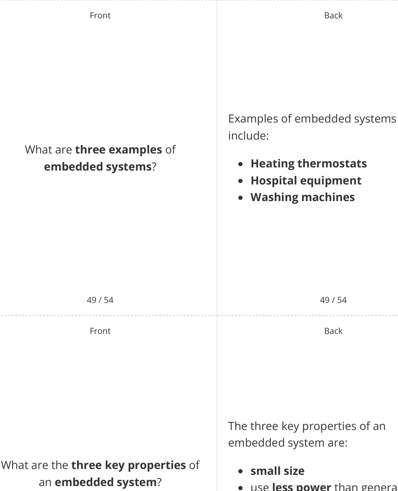

use **less power** than generalpurpose computers **lower cost** 

© 2026 Save My Exams, Ltd. Get more and ace your exams at savemyexams.com **26** 

Front Back **False. True or False?** A laptop is not an example of an A **laptop** is an example of an **embedded system** . A laptop is an **embedded system** . example of a general-purpose computer. 

51 / 54 51 / 54 Front Back They have a **single dedicated function** Why do embedded systems **use less** rather than being general-purpose **power** ? computers. 

© 2026 Save My Exams, Ltd. Get more and ace your exams at savemyexams.com **27** 

Front Back **False. True or False?** While a fridge has a single main function, **it does not contain a CPU** , so A **fridge** is an **embedded system** . it is not considered an embedded system. 

53 / 54 53 / 54 Front Back **No.** Are **mobile phones** considered Mobile phones are **general-purpose embedded systems** ? **computing devices** , not single-function embedded systems. 

© 2026 Save My Exams, Ltd. 

Get more and ace your exams at savemyexams.com **28** 

