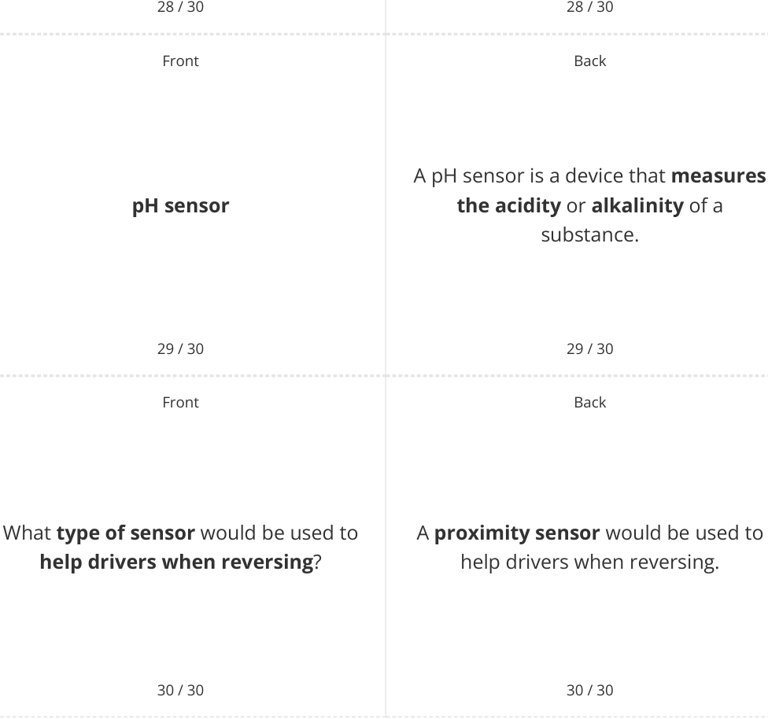

# CAIE Computer Science IGCSE — Chapter ?: Unknown Chapter

---

30 flashcards 

## **IGCSE Cambridge (CIE) Computer Science** 

Flashcards 

## **Input & Output Devices** 

## **How to use these Flashcards** 

Print single-sided 

Cut along the **dashed** lines 

Fold each card in half 

Test yourself, then flip to check answer 

Scan the QR code for revision help 

**Scan here for revision help** or visit savemyexams.com 

© 2026 Save My Exams, Ltd. 

Get more and ace your exams at savemyexams.com **1** 

|Front 1 / 30 What is an**input device**?|Back 1 / 30 An input device is**a hardware** **component**that**allows users to** **interact with a computer system**by **inputting data or commands**.|
|---|---|
|Front 2 / 30 **Keyboard**|Back 2 / 30 A keyboard is**an input device**that **allows users to input text and** **commands**by**pressing keys**.|
|Front 3 / 30 What is the**primary function**of a **mouse**?|Back 3 / 30 The primary function of a mouse is**to** **navigate the computer screen**and **click on items**.|
|||

© 2026 Save My Exams, Ltd. Get more and ace your exams at savemyexams.com 

**2** 

|Front 4 / 30 **Touchscreen**|Back 4 / 30 A touchscreen is an input device that **allows users to interact with the** **device by touching the screen**, commonly found on**smartphones and** **tablets**.|
|---|---|
|Front 5 / 30 What is the**main purpose**of a **scanner**?|Back 5 / 30 The main purpose of a scanner is to **digitise physical documents or** **images**,**converting them**into a format that the computer can process.|
|Front 6 / 30 **Biometric device**|Back 6 / 30 A biometric device is an input device **used for security purposes to verify a** **user's identity**, such as**fngerprint** **scanners**or**facial recognition** **systems**.|
|||

© 2026 Save My Exams, Ltd. Get more and ace your exams at savemyexams.com 

**3** 

|Front 7 / 30 What is a**graphics tablet**used for?|Back 7 / 30 A graphics tablet is used to**allow** **artists and designers to draw or** **sketch directly onto a computer**, particularly useful for**graphic design** and**3D modelling**.|
|---|---|
|Front 8 / 30 **True or False?** A**joystick**is primarily used for**word** **processing**.|Back 8 / 30 **False.** A joystick is primarily**used for** **computer games**, especially fight simulators, allowing users to control movement more fuidly than with a keyboard or mouse.|
|Front 9 / 30 **Barcode scanner**|Back 9 / 30 A barcode scanner is an input device that**scans barcodes**, typically used in **retail and inventory management**.|
|||

© 2026 Save My Exams, Ltd. Get more and ace your exams at savemyexams.com 

**4** 

|Front|Back|
|---|---|
||The main function of a microphone as|
|What is the**main function**of a **microphone**as an input device?|an input device is to**capture audio** **input**, which can be**used for voice** **commands**,**recording audio**, or**video**|
||**conferencing**.|
|10 / 30|10 / 30|
|Front|Back|
||An output device is**a hardware**|
||**component**that**receives information**|
|What is an**output device**?|**from a computer system**and|
||**presents it to the user**in a|
||comprehensible form.|

|11 / 30|11 / 30|
|---|---|
|Front|Back|
||A monitor is an output device that|
|**Monitor**|**displays visual output from the** **computer**, including**text**,**images**, and|
||**videos**.|
|12 / 30|12 / 30|

© 2026 Save My Exams, Ltd. Get more and ace your exams at savemyexams.com 

**5** 

|Front 13 / 30 What is the**primary function**of a **printer**?|Back 13 / 30 The primary function of a printer is to **produce a hard copy of digital** **documents**or**images**.|
|---|---|
|Front 14 / 30 **Speakers**|Back 14 / 30 Speakers are output devices that **output audio from the computer**, such as**music**,**sound efects**, or**voice**.|
|Front 15 / 30 What is a**Braille display**used for?|Back 15 / 30 A Braille display is used to**output** **information in Braille**, allowing **visually impaired users to read text** from the computer.|
|||

© 2026 Save My Exams, Ltd. Get more and ace your exams at savemyexams.com **6** 

|Front 16 / 30 **Plotter**|Back 16 / 30 A plotter is an output device used for **printing large, high-quality diagrams** **and designs**, often used in**engineering** or**architecture**.|
|---|---|
|Front 17 / 30 What is the**main purpose**of a **projector**?|Back 17 / 30 The main purpose of a projector is to **project the computer's display onto a** **large screen or wall**, useful for **presentations**or**movie viewing**.|
|Front 18 / 30 **True or False?** Headphones are considered input devices.|Back 18 / 30 **False.** Headphones are considered output devices that output audio directly to the user, providing a more personal and potentially immersive experience.|
|||

© 2026 Save My Exams, Ltd. 

Get more and ace your exams at savemyexams.com **7** 

Front Back A Virtual Reality (VR) Headset is an output device that **provides an Virtual Reality (VR) Headset immersive visual and audio output** , primarily used for **gaming** and virtual **simulations** . 

19 / 30 19 / 30 Front Back 

An example of a computer-controlled What is an example of a **computer-** machinery output device is an **controlled machinery output device** ? **actuator** . 

20 / 30 20 / 30 Front Back A sensor is **an input device** that **measures a physical property of its** What is a **sensor** ? **environment** such as **light levels** , **temperature** , or **movement** . 

21 / 30 21 / 30 

© 2026 Save My Exams, Ltd. 

Get more and ace your exams at savemyexams.com **8** 

|Front|Back|
|---|---|
||A monitoring system is**a system that**|
|**Monitoring system**|**tracks the state of a system**,**gathers** **data**, and**may issue warning**|
||**messages**.|
|22 / 30|22 / 30|
|Front|Back|
||A control system is**a system that**|
||**controls based upon the input from**|
|What is a**control system**?|**sensors**, such as starting a heater when|
||water temperature falls below an|
||acceptable level.|

|23 / 30|23 / 30|
|---|---|
|Front|Back|
||A feedback loop is**a process where**|
|**Feedback loop**|**outputs are recycled and used as**|
||**inputs,**creating a continuous cycle.|
|24 / 30|24 / 30|

© 2026 Save My Exams, Ltd. Get more and ace your exams at savemyexams.com **9** 

Front Back What does an **acoustic sensor** An acoustic sensor measures **sound measure** ? **levels** . 

25 / 30 25 / 30 Front Back 

An accelerometer is **a sensor that Accelerometer measures acceleration rate** , **tilt** , and **vibration** . 

26 / 30 26 / 30 Front Back What is the **typical use of a humidity** A humidity sensor is typically used to **sensor** ? **monitor humidity in greenhouses** . 

27 / 30 27 / 30 

© 2026 Save My Exams, Ltd. 

Get more and ace your exams at savemyexams.com **10** 

Front Back **True or False? True.** An infra-red sensor is used to **detect** An infra-red sensor is used to detect **motion** or a **heat source** . motion or a heat source. 

© 2026 Save My Exams, Ltd. 

Get more and ace your exams at savemyexams.com **11** 

