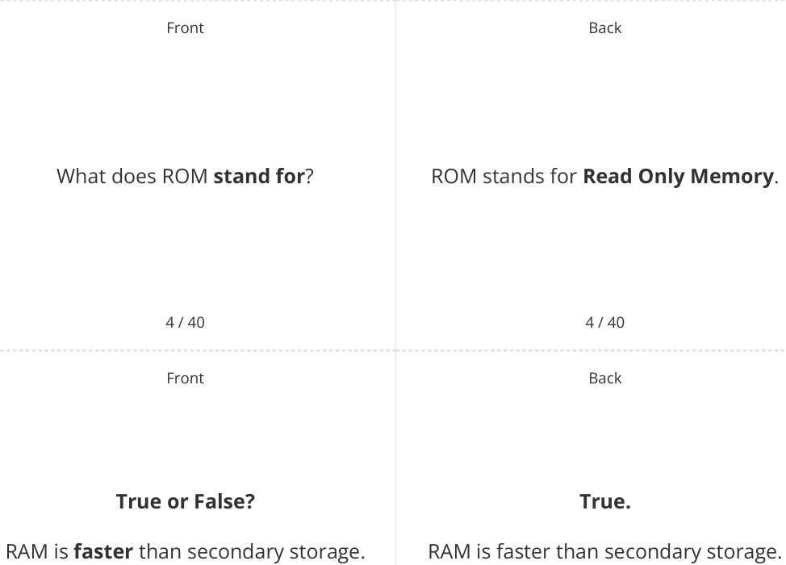

# CAIE Computer Science IGCSE — Chapter ?: Unknown Chapter

---

## **IGCSE Cambridge (CIE) Computer Science** 

40 flashcards 

Flashcards 

## **Data Storage** 

## **How to use these Flashcards** 

Print single-sided **Scan here for revision help** Cut along the **dashed** lines or visit savemyexams.com 

Cut along the **dashed** lines Fold each card in half Test yourself, then flip to check answer 

Scan the QR code for revision help 

© 2026 Save My Exams, Ltd. 

Get more and ace your exams at savemyexams.com 

**1** 

Front 

Back 

What is **primary storage** ? 

Primary storage is **directly accessed by the CPU** and **holds the data and instructions that the CPU needs** to access while the computer is turned on. 

1 / 40 Front 

1 / 40 

Back 

## **True or False?** 

Primary storage is always **volatile** . 

## **False.** 

Primary storage is volatile with the **exception of ROM** . 

2 / 40 2 / 40 

Front Back 

## **RAM** 

RAM is Random Access Memory, a type of primary storage that **holds data and instructions currently in use** , is **volatile** , and has **fast access times** . 

3 / 40 

3 / 40 

© 2026 Save My Exams, Ltd. Get more and ace your exams at savemyexams.com 

**2** 

5 / 40 5 / 40 Front Back ROM stores the **first instructions a computer needs to start up** What is **stored** in **ROM** ? ( **Bootstrap** ) and the **BIOS** (Basic Input Output System). 

© 2026 Save My Exams, Ltd. Get more and ace your exams at savemyexams.com 

**3** 

Front Back **True or False? False.** ROM is volatile. ROM is non-volatile. 

7 / 40 7 / 40 Front Back What is the between **RAM is volatile** and **loses its contents main difference RAM** and **ROM** in terms of **data ROM is** when power is turned off, while **persistence** ? **non-volatile** and **retains its contents** . 

8 / 40 8 / 40 Front Back BIOS is the **Basic Input Output System BIOS** stored in **ROM** . 

9 / 40 9 / 40 

© 2026 Save My Exams, Ltd. Get more and ace your exams at savemyexams.com **4** 

Front Back **True or False? True.** RAM has a **larger capacity** than ROM. RAM has a larger capacity than ROM. 

10 / 40 10 / 40 Front Back Secondary storage is **non-volatile storage** that **retains digital data** within What is **secondary storage** ? a computer system **when the power is** . **turned off** 

11 / 40 11 / 40 Front Back Name the **three types** of **secondary** The three types of secondary storage **storage** . are **magnetic** , **solid state** , and **optical** . 

12 / 40 12 / 40 

© 2026 Save My Exams, Ltd. 

Get more and ace your exams at savemyexams.com **5** 

|Front|Back|
|---|---|
|**True or False?**|**False.**|
|Secondary storage has**a smaller**|Secondary storage has**a larger**|
|**capacity**than primary storage.|**capacity**than primary storage.|
|13 / 40|13 / 40|
|Front|Back|
||Magnetic storage is a type of**non-**|
|**Magnetic storage**|**volatile media**that**uses magnets**|
||(**polarity**) to store binary 0s and 1s.|

||14 / 40|14 / 40|
|---|---|---|
||Front|Back|
|||Solid state storage is a type of**non-**|
|**Solid**|**state storage**|**volatile media**that**uses electronic**|
|||**circuits**to store binary 0s and 1s.|
||15 / 40|15 / 40|

© 2026 Save My Exams, Ltd. Get more and ace your exams at savemyexams.com **6** 

Front Back Optical storage is a type of **non-volatile media** that **uses lasers to burn the Optical storage surface of a disk** , creating **pits and lands** suitable for storing binary 0s and 1s. 

16 / 40 16 / 40 Front Back The main advantage of solid state of **solid** storage over magnetic storage is **faster magnetic** storage? **read/write access speeds** . 

What is the **main advantage** of **solid state** storage over **magnetic** storage? 

17 / 40 17 / 40 Front Back 

## **True or False?** 

## **False.** 

**Optical** storage has **the highest** Optical storage typically has **the lowest capacity** among secondary storage **capacity** among secondary storage types. types. 

18 / 40 18 / 40 

© 2026 Save My Exams, Ltd. 

Get more and ace your exams at savemyexams.com **7** 

Front Back The main disadvantage of magnetic What is the **main disadvantage** of storage is its **susceptibility to magnetic storage** ? **mechanical failure** due to **moving parts** . 

19 / 40 19 / 40 Front Back **True or False? True. Solid state** storage **is more expensive** Solid state storage is more expensive per gigabyte than **magnetic storage** . per gigabyte than magnetic storage. 

20 / 40 20 / 40 Front Back Virtual memory is **an extension of primary storage** ( **RAM** ) located **on** What is **virtual memory** ? **secondary storage** , used when RAM is close to being full. 

21 / 40 21 / 40 

© 2026 Save My Exams, Ltd. Get more and ace your exams at savemyexams.com 

**8** 

Front 

## **True or False?** 

Virtual memory **improves** system performance. 

## **False.** 

Virtual memory is **much slower than RAM** and its use will impact **negatively** on system performance. 

22 / 40 Front 

22 / 40 Back 

What are **pages** in the context of **virtual memory** ? 

Pages are **units of data** that **programs are stored as** and transferred between RAM and virtual memory. 

23 / 40 23 / 40 Front Back 

**True or False?** Virtual memory is **faster** than **RAM** . 

## **False.** 

Virtual memory is **much slower** than **RAM** . 

24 / 40 24 / 40 

© 2026 Save My Exams, Ltd. Get more and ace your exams at savemyexams.com **9** 

Front 

Back 

What happens **when RAM is full** and **virtual memory is used** ? 

When RAM is full, **programs and data not currently being executed** are **transferred to virtual memory** . 

25 / 40 25 / 40 Front Back The use of virtual memory can be How can the use of **virtual memory be** avoided by **increasing the size of the avoided** ? **RAM** . 

26 / 40 26 / 40 Front Back **False. True or False?** Virtual memory is **an extension of** Virtual memory is **a type of primary primary** storage **located on secondary** storage. storage. 

27 / 40 27 / 40 

© 2026 Save My Exams, Ltd. Get more and ace your exams at savemyexams.com 

**10** 

Front 

Back 

What **triggers** the use of **virtual memory** ? 

Virtual memory is used in situations **where RAM is close to being full** . 

28 / 40 28 / 40 Front Back 

## **True or False?** 

**Programs** in virtual memory are **immediately accessible** to the **CPU** . 

## **False.** 

Programs in virtual memory **must be transferred back to RAM** when they are needed by the CPU. 

29 / 40 29 / 40 Front Back 

The main purpose of virtual memory is What is the **main purpose** of virtual to **allow the computer to remain** memory? **operational** when **RAM is close to being full** . 

30 / 40 30 / 40 

© 2026 Save My Exams, Ltd. 

Get more and ace your exams at savemyexams.com **11** 

Back 

Front 

What is **cloud storage** ? 

31 / 40 Front 

## **True or False?** 

Cloud storage **requires a constant internet connection** for access. 

32 / 40 Front 

Cloud storage is **long-term (secondary) storage of data** that **resides in a remote location** , accessible only via a wide area network (Internet). 

31 / 40 

Back 

## **True.** 

- Cloud storage requires a constant internet connection for access. 

32 / 40 

Back 

Two advantages of cloud storage are: 

Name **two advantages** of cloud storage. 

1. **Accessibility** - data can be **accessed from anywhere** 

2. **Scalability** - storage **capacity can be easily increased or decreased** as needed. 

33 / 40 

33 / 40 

© 2026 Save My Exams, Ltd. 

Get more and ace your exams at savemyexams.com **12** 

Front Back A potential security risk of cloud storage What is **a potential security risk** of is that **data being sent over the** cloud storage? **internet** has the **potential to be intercepted** . 

34 / 40 34 / 40 Front Back **False. True or False?** Cloud storage often requires payment, Cloud storage is always **free** . typically through **a monthly or yearly subscription plan.** 

|35 / 40|35 / 40|
|---|---|
|Front|Back|
||A beneft of cloud storage for|
|What is a**beneft**of cloud storage**for**|collaboration is that**multiple people**|
|**collaboration**?|**can access the same fle at the same**|
||**time**.|

36 / 40 36 / 40 

© 2026 Save My Exams, Ltd. Get more and ace your exams at savemyexams.com 

**13** 

Back 

Front 

Two disadvantages of cloud storage are: 

Name **two disadvantages** of cloud storage. 

1. **Reliance on internet connection for access** 

2. **Potential costs for large amounts of data storage.** 

37 / 40 Front 

37 / 40 Back 

## **False.** 

## **True or False?** 

Users have **complete control over security** in cloud storage. 

Security is **managed by the cloud storage provider** , which means the user does not have complete control over it. 

38 / 40 38 / 40 Front Back 

What is an of **environmental benefit** cloud storage? 

An environmental benefit of cloud storage is that **one cloud storage centre** is more environmentally friendly than **millions of individual servers** . 

39 / 40 

39 / 40 

© 2026 Save My Exams, Ltd. 

Get more and ace your exams at savemyexams.com 

**14** 

Back 

Front 

## **True or False?** 

Cloud storage providers often **use multiple servers** to store and backup data. 

40 / 40 

## **True.** 

Cloud storage providers often use multiple servers to store and backup data, **reducing the risk of data loss** due to hardware failure. 

40 / 40 

© 2026 Save My Exams, Ltd. 

Get more and ace your exams at savemyexams.com 

**15** 

