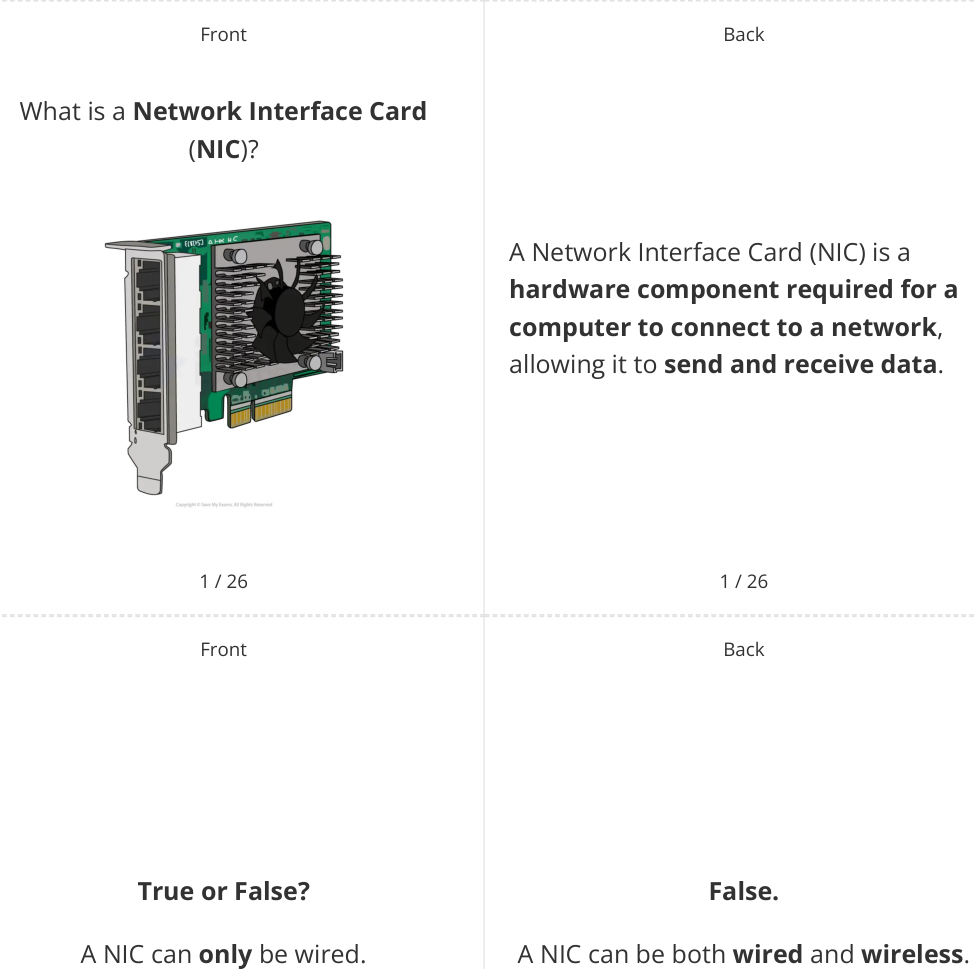
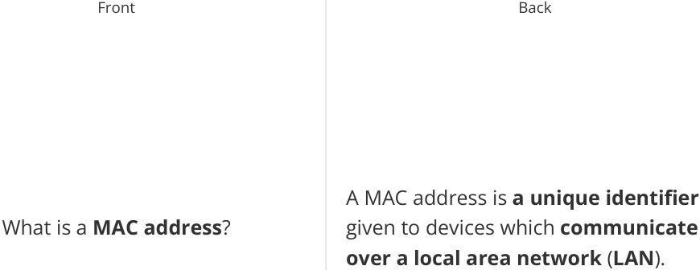
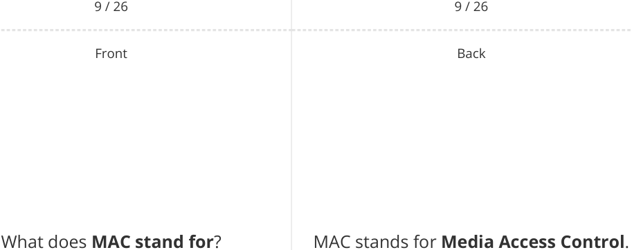
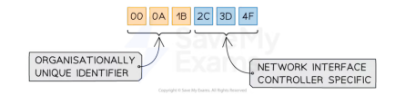
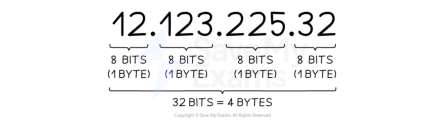
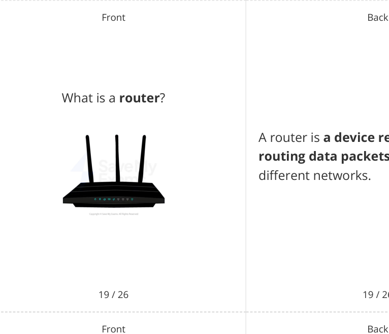

# CAIE Computer Science IGCSE — Chapter ?: Unknown Chapter

---

## **IGCSE Cambridge (CIE) Computer Science** 

26 flashcards 

Flashcards 

## **Network Hardware** 

## **How to use these Flashcards** 

Print single-sided **Scan here for revision help** Cut along the **dashed** lines or visit savemyexams.com 

Fold each card in half 

Test yourself, then flip to check answer 

Scan the QR code for revision help 

© 2026 Save My Exams, Ltd. 

Get more and ace your exams at savemyexams.com 

**1** 

© 2026 Save My Exams, Ltd. 

Get more and ace your exams at savemyexams.com 

**2** 

|Front **Network hardware**|Back Network hardware is**a selection of** **essential components**that enable the **connectivity and communication of** **devices**within**computer networks**.|
|---|---|

|3 / 26|3 / 26|
|---|---|
|Front|Back|
||Three examples of network hardware|
||are:|

List **three examples** of network hardware. 

1. **Router** 

2. **Wireless access point (WAP)** 

3. **Switch.** 

4 / 26 4 / 26 

© 2026 Save My Exams, Ltd. 

Get more and ace your exams at savemyexams.com 

**3** 

Front Back The primary function of a NIC is to What is the **primary function** of a NIC? **allow a computer to send and receive data** over a network. 

5 / 26 5 / 26 Front Back **True or False? True.** Every computer needs a NIC to connect Every computer needs a NIC to connect to a network. to a network. 

6 / 26 6 / 26 

© 2026 Save My Exams, Ltd. Get more and ace your exams at savemyexams.com 

**4** 

Back 

Front Back Transmission media is a **type of Transmission media network hardware used for data transmission** in computer networks. 

7 / 26 7 / 26 Front Back 

What **type of network** does a **NIC** A NIC typically connects to a **Local Area** typically connect to? **Network** ( **LAN** ). 

8 / 26 8 / 26 

© 2026 Save My Exams, Ltd. 

Get more and ace your exams at savemyexams.com **5** 

10 / 26 10 / 26 

© 2026 Save My Exams, Ltd. 

Get more and ace your exams at savemyexams.com **6** 

Front Back **False. True or False?** MAC addresses are **static** and **cannot** MAC addresses **can change** . **change** . 

11 / 26 11 / 26 Front Back A MAC address is represented as **12 hexadecimal digits** ( **48 bits** ), usually **grouped in pairs** . How is a MAC address **represented** ? 

© 2026 Save My Exams, Ltd. 

Get more and ace your exams at savemyexams.com **7** 

Front Back An IP address is **a unique identifier** What is an **IP address** ? given to devices which **communicate over the Internet** ( **WAN** ). 

13 / 26 13 / 26 Front Back **True or False? True.** IP addresses can be both **static** and IP addresses can be both static and **dynamic** . dynamic. 

14 / 26 14 / 26 

© 2026 Save My Exams, Ltd. Get more and ace your exams at savemyexams.com 

**8** 

Front Back IPv4 is Internet Protocol version 4, represented as **4 blocks of denary numbers between 0 and 255** , separated by **full stops** . **IPv4** 

|15 / 26|15 / 26|
|---|---|
|Front|Back|
||IPv6 is Internet Protocol version 6,|
|**IPv6**|represented as**8 blocks of 4** **hexadecimal digits**, separated by|
||**colons**.|

16 / 26 16 / 26 

© 2026 Save My Exams, Ltd. 

Get more and ace your exams at savemyexams.com **9** 

How many **unique addresses** does IPv4 provides **over 4 billion** unique **IPv4** provide? addresses (2^32). 

17 / 26 17 / 26 Front Back 

What is the between **main difference MAC** and **IP** addresses in terms of network scope? 

MAC addresses are used for **communication on a LAN** , while IP addresses are used for **communication on a WAN/Internet** . 

18 / 26 18 / 26 

© 2026 Save My Exams, Ltd. 

Get more and ace your exams at savemyexams.com 

**10** 

A router is **a device responsible for routing data packets** between different networks. 

## 19 / 26 

What **type of networks** does a router connect? 

A router connects **local area networks** ( **LAN** ) to the **wider internet** , which is a type of **wide area network** ( **WAN** ). 

20 / 26 20 / 26 

© 2026 Save My Exams, Ltd. 

Get more and ace your exams at savemyexams.com 

**11** 

Front 

## **True or False?** 

A router can **assign IP addresses** to devices on the network. 

21 / 26 

Front 

What is **one example of data** a router can direct? 

22 / 26 

Back 

## **True.** 

A router can assign IP addresses to devices on the network. 

## 21 / 26 

Back 

One example of data a router can direct is **sending internet traffic to the correct destination/devices** in your **home network** . 

22 / 26 

© 2026 Save My Exams, Ltd. 

Get more and ace your exams at savemyexams.com 

**12** 

Front State **three tasks** carried out by a **router** . 

Three tasks carried out by a router are: 

1. **Send and receive packets of data** 

2. **Connect a local network to the internet** 

3. **Assign IP addresses to nodes/devices.** 

23 / 26 23 / 26 Front Back 

**True or False? True.** A router can **manage** and **prioritise** A router can manage and prioritise data data traffic. traffic. 

24 / 26 24 / 26 

© 2026 Save My Exams, Ltd. Get more and ace your exams at savemyexams.com 

**13** 

Front Back A router helps maintain stable How does a router help **maintain** connections by **managing and stable connections** ? . **prioritising data traffic** 

25 / 26 25 / 26 Front Back The role of a router in IP address What is the **role** of a router in **IP** management is to **assign IP addresses address management** ? **to the devices on the network** . 

26 / 26 26 / 26 

© 2026 Save My Exams, Ltd. Get more and ace your exams at savemyexams.com **14** 

