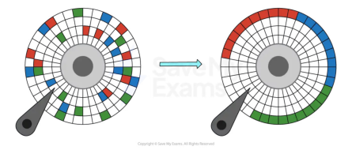
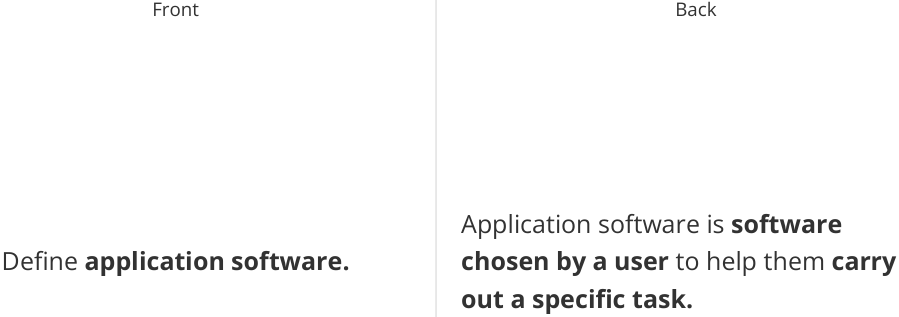
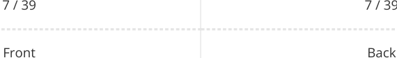
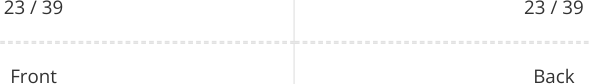
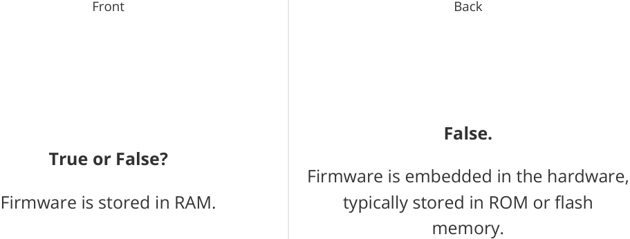

# CAIE Computer Science IGCSE — Chapter ?: Unknown Chapter

---

39 flashcards 

**IGCSE Cambridge (CIE) Computer Science** 

Flashcards 

## **Types of Software & Interrupts** 

## **How to use these Flashcards** 

Print single-sided 

Cut along the **dashed** lines 

Fold each card in half 

Test yourself, then flip to check answer 

Scan the QR code for revision help 

**Scan here for revision help** or visit savemyexams.com 

© 2026 Save My Exams, Ltd. 

Get more and ace your exams at savemyexams.com 

**1** 

Front Back System software is **software essential** What is **system software** ? **for the operation** of the computer system. 1 / 39 1 / 39 Front Back Utility software is **software designed to help maintain** , **enhance** and Define **utility software. troubleshoot/repair** a computer system. 

2 / 39 2 / 39 

© 2026 Save My Exams, Ltd. 

Get more and ace your exams at savemyexams.com 

**2** 

Back 

Front 

Defragmentation is the **process of grouping fragmented files back together** in order to **improve access speed.** 

What is **defragmentation** ? 

3 / 39 

## **True or False?** 

Lossy compression allows the original file to be recreated. 

4 / 39 

3 / 39 Back 

## **False.** 

Lossy compression physically removes data from the original file, so it cannot be recreated. 

4 / 39 

© 2026 Save My Exams, Ltd. 

Get more and ace your exams at savemyexams.com 

**3** 

Back 

Front Back Encryption is the **process of scrambling data** using an algorithm What is **encryption** ? from plain-text into cipher-text to **make it unreadable to users without the master key.** 

5 / 39 5 / 39 Front Back 

The purpose of task manager is to **allow users to monitor system** What is the **purpose** of **task manager** ? **resources** in order to **help troubleshoot** potential problems. 

6 / 39 

6 / 39 

© 2026 Save My Exams, Ltd. Get more and ace your exams at savemyexams.com 

**4** 

## **True or False?** 

## **True.** 

System software gives users a platform System software gives users a platform to run applications and carry out tasks. to run applications and carry out tasks. 

8 / 39 

8 / 39 

© 2026 Save My Exams, Ltd. 

Get more and ace your exams at savemyexams.com 

**5** 

Front 

What are the **three common categories** of application software? 

9 / 39 

Front 

What is the between **difference system** software and **application** software? 

10 / 39 

Back 

The three common categories of application software are **productivity** , **communication** , and **entertainment.** 

9 / 39 

Back 

System software **is essential** for the operation of the computer system, while application software **is chosen by users** to carry out specific tasks. 

10 / 39 

© 2026 Save My Exams, Ltd. 

Get more and ace your exams at savemyexams.com 

**6** 

Back 

Front Back An operating system is s **oftware that provides an interface between the** What is an **operating system** ? **user and the hardware** in a computer system. 

11 / 39 11 / 39 Front Back File management is **a process** carried out by the operating system **creating** , Define **file management. organising** , **manipulating** and on a **accessing files and folders** computer system. 

12 / 39 12 / 39 

© 2026 Save My Exams, Ltd. Get more and ace your exams at savemyexams.com **7** 

Front 

What is **interrupt handling** ? 

Back Interrupt handling is the **process of managing events** that require the **immediate attention of the central processing unit.** 

13 / 39 

13 / 39 

Front 

Back 

## **True or False?** 

## **False.** 

A GUI is more commonly used by A Command Line Interface (CLI) is more advanced users than a CLI. commonly used by advanced users. 

14 / 39 

14 / 39 

© 2026 Save My Exams, Ltd. 

Get more and ace your exams at savemyexams.com 

**8** 

Front What is **peripheral management** ? 

Peripheral management is a **process** carried out by the operating system **managing the way peripherals** (hardware) **interact** with software. 

15 / 39 15 / 39 Front Back 

**device driver.** Define 

A device driver is a piece of **software used to control a piece of hardware.** 

16 / 39 

16 / 39 

© 2026 Save My Exams, Ltd. 

Get more and ace your exams at savemyexams.com **9** 

Front 

What is **multitasking** ? 

17 / 39 

Front 

## **True or False?** 

The operating system provides a platform on which application software can run. 

18 / 39 

Back 

Multitasking is a **process** made possible by the OS **simultaneously managing system resources** to give a user the **perception of being able to use multiple programs at the same time.** 

17 / 39 

Back 

## **True.** 

The operating system provides a platform on which application software can run. 

18 / 39 

© 2026 Save My Exams, Ltd. 

Get more and ace your exams at savemyexams.com 

**10** 

|Front What is**user management**?|Back User management is a**process**carried out by the operating system**enabling** **diferent users to log onto a** **computer and maintain individual** **settings.**|
|---|---|

|||19 / 39|19 / 39|
|---|---|---|---|
|||Front|Back|
||||The four types of user i|
|What|are|the**four types**of user|1.**Command Line In**|
|||interfaces?|2.**Graphical User In**|
||||3.**Menu Interface**|
||||4.**Natural Language**|
|||20 / 39|20 / 39|

The four types of user interfaces are: 

1. **Command Line Interface (CLI)** 2. **Graphical User Interface (GUI)** 3. **Menu Interface** 4. **Natural Language Interface (NLI)** 

© 2026 Save My Exams, Ltd. 

Get more and ace your exams at savemyexams.com **11** 

|Front 21 / 39 What is**frmware**?|Back 21 / 39 Firmware is**software embedded** **directly into the hardware**of a device to**make it function.**|
|---|---|
|Front 22 / 39 Defne**BIOS.**|Back 22 / 39 BIOS (Basic Input/Output System) is **frmware that handles the initial** **process of booting up a computer.**|
|||

© 2026 Save My Exams, Ltd. 

Get more and ace your exams at savemyexams.com **12** 

Front Back **translate** The purpose of firmware is to What is the **purpose** of **firmware** ? **between the hardware and the software.** 

**False.** 

**True or False?** Application software communicates Application software communicates with the operating system, which then directly with hardware. interacts with the hardware. 

24 / 39 

24 / 39 

© 2026 Save My Exams, Ltd. Get more and ace your exams at savemyexams.com 

**13** 

Front Back A bootstrap loader **contains the initial** What is a **bootstrap loader** ? **boot-up instructions** that a computer explores in ROM when turned on. 

25 / 39 25 / 39 Front Back A stack is a **reserved area in RAM** Define a **stack.** where the **contents of CPU registers are copied during an interrupt.** 

26 / 39 26 / 39 

© 2026 Save My Exams, Ltd. 

Get more and ace your exams at savemyexams.com **14** 

27 / 39 27 / 39 Front Back After the start-up process is complete, What happens **after the start-up instructions are sent to RAM to be process** is complete? **processed by the operating system.** 

28 / 39 28 / 39 

© 2026 Save My Exams, Ltd. Get more and ace your exams at savemyexams.com 

**15** 

Back 

Front 

What is the **relationship** between **firmware** and the **operating system** ? 

29 / 39 Front 

What is an **interrupt** ? 

30 / 39 

Firmware provides the **initial instructions for booting up the computer** and communicating with hardware, while the operating system **takes over once the start-up process is complete.** 

29 / 39 

Back 

An interrupt is **a signal for the CPU to stop what it is currently doing** and do something else as a higher priority. 

30 / 39 

© 2026 Save My Exams, Ltd. Get more and ace your exams at savemyexams.com 

**16** 

Front 

Define **interrupt service routine.** 

An interrupt service routine is an **area that holds instructions** that will need to be **fetched** , **decoded** and **executed** to complete the **commands of the interrupt.** 

31 / 39 Front 

31 / 39 

Back 

The two types of interrupts are What are the **two types of interrupts** ? **hardware** interrupts and **software** interrupts. 

32 / 39 

32 / 39 

© 2026 Save My Exams, Ltd. Get more and ace your exams at savemyexams.com 

**17** 

Front Back **False. True or False?** The contents of CPU registers are The contents of CPU registers are lost copied to a reserved area in RAM called during an interrupt. a stack during an interrupt. 

33 / 39 33 / 39 Front Back A hardware interrupt is **an interrupt** What is a **hardware interrupt** ? **caused by a hardware device** , such as a **hardware failure** or **user input.** 

34 / 39 34 / 39 

© 2026 Save My Exams, Ltd. Get more and ace your exams at savemyexams.com 

**18** 

Front 

Define **software interrupt.** 

Back A software interrupt is **an interrupt that occurs when an application stops** or **requests services from the operating system.** 

35 / 39 

## 35 / 39 

Front 

Back 

The purpose of the stack in interrupt What is the **purpose of the stack** in handling is to **save the contents of** interrupt handling? **CPU registers for later retrieval** when the interrupt is complete. 

36 / 39 

36 / 39 

© 2026 Save My Exams, Ltd. Get more and ace your exams at savemyexams.com 

**19** 

## **True or False?** 

Interrupts allow for multitasking in a computer system. 

37 / 39 Front 

Give **an example** of a hardware interrupt. 

38 / 39 

## **True.** 

Interrupts allow for multitasking in a computer system. 

## 37 / 39 

Back 

An example of a hardware interrupt is **moving the mouse** or **pressing a key** on the keyboard. 

38 / 39 

© 2026 Save My Exams, Ltd. 

Get more and ace your exams at savemyexams.com 

**20** 

Front Back An example of a software interrupt is **a** Give **an example** of a software **program not responding** or **a division** interrupt. **by zero error.** 

39 / 39 39 / 39 

© 2026 Save My Exams, Ltd. 

Get more and ace your exams at savemyexams.com 

**21** 

