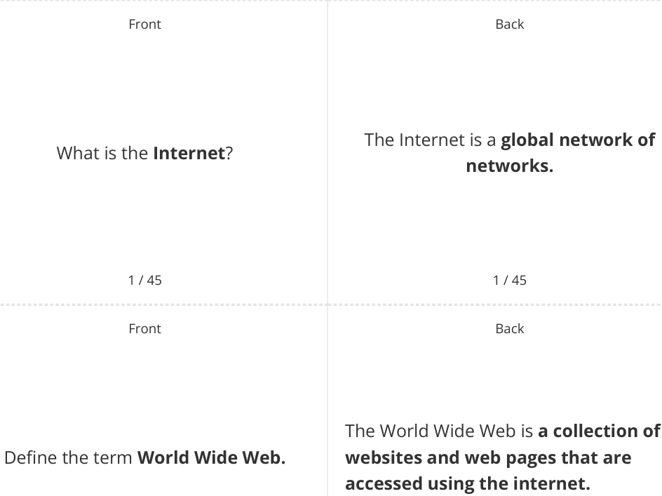
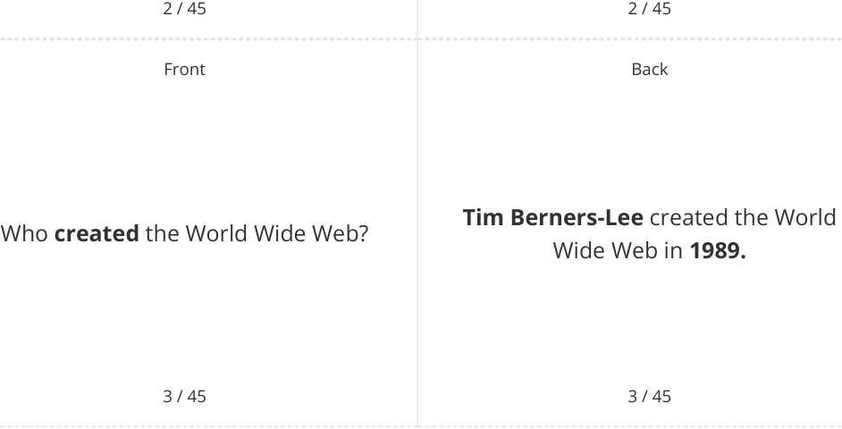
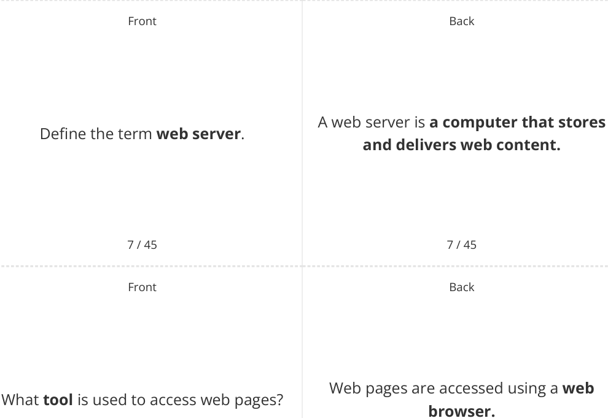
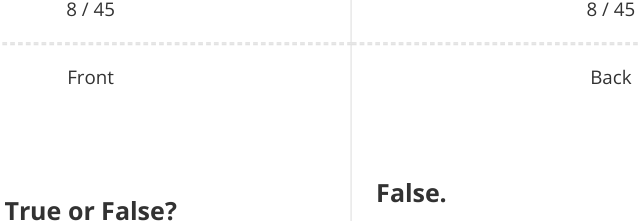
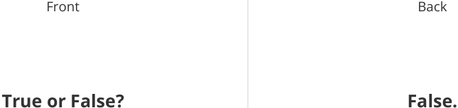

# CAIE Computer Science IGCSE — Chapter ?: Unknown Chapter

---

## **IGCSE Cambridge (CIE) Computer Science** 

45 flashcards 

Flashcards 

## **The Internet & the World Wide Web** 

## **How to use these Flashcards** 

Print single-sided 

Cut along the **dashed** lines 

Fold each card in half 

Test yourself, then flip to check answer 

Scan the QR code for revision help 

**Scan here for revision help** or visit savemyexams.com 

© 2026 Save My Exams, Ltd. 

Get more and ace your exams at savemyexams.com **1** 

© 2026 Save My Exams, Ltd. 

Get more and ace your exams at savemyexams.com **2** 

Front 

What does **WAN** stand for? 

4 / 45 

Front 

## **True or False?** 

The Internet is the most well-known Wide Area Network (WAN) 

5 / 45 

Front 

What is the **purpose** of the World Wide Web? 

WAN stands for **Wide Area Network.** 

4 / 45 

Back 

## **True.** 

The Internet is the most well-known Wide Area Network (WAN) 

5 / 45 

Back 

The purpose of the World Wide Web is to **share and access information** on a global scale. 

6 / 45 

6 / 45 

© 2026 Save My Exams, Ltd. 

Get more and ace your exams at savemyexams.com **3** 

The Internet is the **infrastructure** that The **Internet** and the **World Wide Web** provides **connectivity** to the World are the same thing. Wide Web 

© 2026 Save My Exams, Ltd. Get more and ace your exams at savemyexams.com **4** 

Front Back The World Wide Web consists of What does the **World Wide Web interconnected documents and consist** of? stored **on web multimedia files servers around the world.** 

10 / 45 10 / 45 Front Back HTTP stands for **Hypertext Transfer** What does **HTTP** stand for? **Protocol.** 

11 / 45 11 / 45 

Front Back 

A protocol is **a set of rules** governing Define the term **protocol.** communication between devices on a network. 

12 / 45 12 / 45 

© 2026 Save My Exams, Ltd. Get more and ace your exams at savemyexams.com 

**5** 

Front 

Back 

What is the **main difference** between HTTPS works in the same way as HTTP **HTTP** and **HTTPS** ? but with **an added layer of security.** 

13 / 45 13 / 45 Front Back **True or False? True.** HTTPS **encrypts** all data sent and HTTPS encrypts all data sent and received received 

14 / 45 14 / 45 Front Back HTTPS is used to protect **sensitive** What type of information is **typically information** such as **passwords** , **protected** by **HTTPS** ? **financial information** , and **personal data.** 

15 / 45 

15 / 45 

© 2026 Save My Exams, Ltd. 

Get more and ace your exams at savemyexams.com 

**6** 

Front Back Encryption is the process of **encoding** Define the term **encryption. information to protect it from unauthorised access.** 

16 / 45 16 / 45 Front Back What is the **primary purpose** of **HTTP** ? 

The primary purpose of HTTP is to **allow communication between clients and servers for website viewing.** 

17 / 45 17 / 45 Front Back 

Two examples of data sent to servers What are **two examples of data** sent using HTTP are **submitting a form** and to servers using **HTTP** ? **uploading a file.** 

18 / 45 

18 / 45 

© 2026 Save My Exams, Ltd. 

Get more and ace your exams at savemyexams.com **7** 

Front Back A web browser is a piece of **software** What is a **web browser** ? **used to access and display information** on the **internet.** 

|19 / 45|19 / 45|
|---|---|
|Front|Back|
||The primary purpose of a web browser|
|What is the**primary purpos**e of a web|is to**render hypertext markup**|
|browser?|**language**(HTML) and**display web**|
||**pages.**|

20 / 45 20 / 45 Front Back To render is to **interpret code and render.** Define the term **translate it** into a visual display. 21 / 45 21 / 45 

© 2026 Save My Exams, Ltd. 

Get more and ace your exams at savemyexams.com **8** 

Web browsers can only display **one** web page at a time. 

Web browsers can display **multiple** web pages at once using tabs. 

22 / 45 22 / 45 Front Back 

What is the **function of bookmarks** in a web browser? 

Bookmarks allow users to **save links to frequently visited websites** and access them easily. 

23 / 45 23 / 45 Front Back 

What is the **purpose of the address** The address bar is a place for users to **bar** in a web browser? **type in the URL** of a web page to visit. 

24 / 45 

24 / 45 

© 2026 Save My Exams, Ltd. 

Get more and ace your exams at savemyexams.com **9** 

Front 

Back 

A URL ( **Uniform Resource Locator** ) is a Define the term **URL. unique identifier for a web page** , also known as the website address. 

25 / 45 

25 / 45 

Front 

Back 

What is the **function of navigation tools** in a web browser? 

Navigation tools, such as **back/forward** buttons and **home** button, **help users move between pages.** 

26 / 45 

26 / 45 

Front 

Back 

## **True.** 

## **True or False?** 

Web browsers store user history. 

Web browsers store user history to allow users to quickly revisit recently viewed web pages. 

27 / 45 

27 / 45 

© 2026 Save My Exams, Ltd. 

Get more and ace your exams at savemyexams.com 

**10** 

|Front What is a**web server**?|Back A web server is**a remote computer** that**stores the fles needed to display** **a web page**on the Internet.|
|---|---|

|Front 28 / 45 What is a**web server**?|Front 28 / 45 What is a**web server**?|Back 28 / 45 A web server is**a remote computer** that**stores the fles needed to display** **a web page**on the Internet.|Back 28 / 45 A web server is**a remote computer** that**stores the fles needed to display** **a web page**on the Internet.|
|---|---|---|---|
||28 / 45|28 / 45||
||Front 29 / 45 What are the**three typical parts**of a URL?|Back 29 / 45 The three typical parts of a URL are **protocol**,**domain name**, and**web** **page/fle name.**||
||Front 30 / 45 What is**DNS**?|Back 30 / 45 DNS (Domain Name System) is a **directory that translates human-** **readable domain names to numeric** **IP addresses.**||

© 2026 Save My Exams, Ltd. Get more and ace your exams at savemyexams.com **11** 

Front Back **True or False? True.** HTML is the **foundational language** HTML is the foundational language used used to structure content on the web. to structure content on the web. 

31 / 45 31 / 45 Front Back An HTML element is **a component of** Define the term **HTML element. HTML** , often referred to as a " **tag** ," used to **structure and format** a webpage. 

32 / 45 32 / 45 Front Back What is the **root element** of an HTML The root element of an HTML page is page? the <html>tag. 33 / 45 33 / 45 

© 2026 Save My Exams, Ltd. 

Get more and ace your exams at savemyexams.com **12** 

Back 

Front 

## **False.** 

## **True or False?** 

All HTML tags **must** be closed. 

Most HTML tags are opened and closed, but some tags are only opened (e.g.,  and <link>). 

34 / 45 34 / 45 Front Back 

Name **three examples of HTML elements** used in the **content layer** of a web page. 

Three examples of HTML elements used in the content layer of a web page are **headings** (<h1>, <h2>), **paragraphs** (
), and **links** (<a>). 

35 / 45 35 / 45 Front Back 

What is a **cookie** ? 

A cookie is stored on a **a tiny data file** computer by browser software that **holds information relating to your browsing activity.** 

36 / 45 

36 / 45 

© 2026 Save My Exams, Ltd. Get more and ace your exams at savemyexams.com 

**13** 

Back 

Front Back Three types of information typically Name **three types of information** contained in a cookie are **browsing** typically contained in a **cookie. history** , **login information** , and **user preferences.** 

37 / 45 37 / 45 Front Back The two types of cookies are **session** What are the **two types** of cookies? cookies and **persistent** cookies. 

38 / 45 38 / 45 Front Back A session cookie is **created and** Define the term **session cookie. replaced every time a user visits** a website. 

39 / 45 39 / 45 

© 2026 Save My Exams, Ltd. 

Get more and ace your exams at savemyexams.com **14** 

Front Back A persistent cookie is **created and** Define the term **persistent cookie. saved the first time a user visits a website** and **retained until it expires.** 

40 / 45 40 / 45 Front Back The Privacy and Electronic What is the **Privacy and Electronic** Communications Regulations (2003) is **a Communications Regulations** (2003)? **law that governs the use of cookies.** 

41 / 45 41 / 45 Front Back **True or False? True.** Websites **must** obtain user consent to Websites must obtain user consent to store cookies. store cookies. 

42 / 45 42 / 45 

© 2026 Save My Exams, Ltd. 

Get more and ace your exams at savemyexams.com **15** 

Back 

Front 

The three requirements are: 

What are the **three requirements** for websites storing cookies under the **Privacy and Electronic Communications Regulations** (2003)? 

1. **Tell users the cookies are there** 

2. **Explain what the cookies are doing** 

3. **Obtain users' consent to store the cookie.** 

43 / 45 Front 

Back 

## **True or False?** 

**True.** 

Cookies can **store user preferences** such as language and font size. 

Cookies can store user preferences such as language and font size. 

44 / 45 44 / 45 Front Back 

What is the between **main difference session** and **persistent** cookies? 

**session** The main difference is that **cookies are temporary** and replaced each visit, while **persistent cookies are saved and retained** across multiple visits. 

45 / 45 

45 / 45 

© 2026 Save My Exams, Ltd. 

Get more and ace your exams at savemyexams.com **16** 

