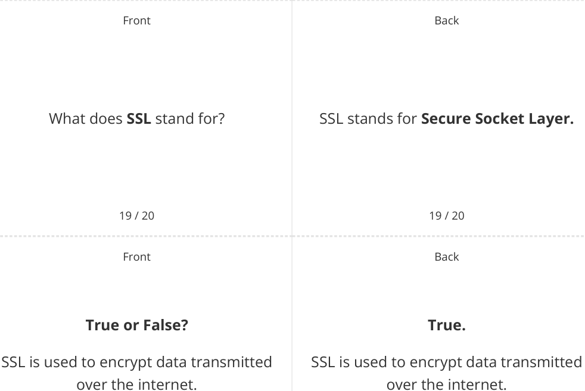

# CAIE Computer Science IGCSE — Chapter ?: Unknown Chapter

---

## **IGCSE Cambridge (CIE) Computer Science** 

20 flashcards 

Flashcards 

## **Cyber Security** 

## **How to use these Flashcards** 

Print single-sided **Scan here for revision help** Cut along the **dashed** lines or visit savemyexams.com 

Cut along the **dashed** lines Fold each card in half 

Test yourself, then flip to check answer 

Scan the QR code for revision help 

© 2026 Save My Exams, Ltd. 

Get more and ace your exams at savemyexams.com 

**1** 

|Front 1 / 20 What is a**brute-force attack**?|Back 1 / 20 A brute-force attack is when**an** **attacker repeatedly tries multiple** **combinations of a user's password**to gain unauthorised access to their accounts or devices.|
|---|---|
|Front 2 / 20 Defne the term**DDoS attack.**|Back 2 / 20 A DDoS (**Distributed Denial of Service**) attack is a**large scale**,**coordinated** attack**designed to slow down a server** to the point of it becoming**unusable.**|
|Front 3 / 20 What is**data interception**?|Back 3 / 20 Data interception is when thieves or hackers**compromise usernames,** **passwords, and other sensitive data** by**collecting data transferred on a** **network.**|
|||

© 2026 Save My Exams, Ltd. Get more and ace your exams at savemyexams.com **2** 

||Front|Back|
|---|---|---|
|||**False.**|
||**True or False?**|Hacking can involve various malicious|
|Hacking|**always**involves stealing data.|purposes, such as**stealing data**, **installing malware**, or**disrupting**|
|||**operations**.|
||4 / 20|4 / 20|
||Front|Back|
|||Malware is**any software created with**|
||What is**malware**?|**malicious intent to cause harm**to a|
|||computer system.|

|||5 / 20|5 / 20|
|---|---|---|---|
|||Front|Back|
||||Pharming is**redirecting a user to a**|
||||**fake website**when they type a|
|Defne|the|term**pharming.**|legitimate website address, in order to|
||||**trick them into entering sensitive**|
||||**information.**|
|||6 / 20|6 / 20|

© 2026 Save My Exams, Ltd. 

Get more and ace your exams at savemyexams.com 

**3** 

|Front|Back|
|---|---|
||Phishing is the process of**sending**|
||**fraudulent emails/SMS to a large**|
|What is**phishing**?|**number of people**, claiming to be from|
||a reputable company or trusted source,|
||**to gain access to their details.**|
|7 / 20|7 / 20|
|Front|Back|
||Social engineering is**exploiting**|
|What is**social engineering**?|**weaknesses in a computer system**by **targeting the people**that use or have|
||access to them.|

|||8 / 20|8 / 20|
|---|---|---|---|
|||Front|Back|
|||**True or False?**|**True.**|
|A virus|can|**replicate itself**on a user's|A virus can replicate itself on a user's|
|||computer.|computer.|
|||9 / 20|9 / 20|

© 2026 Save My Exams, Ltd. Get more and ace your exams at savemyexams.com **4** 

|||Front|Back|
|---|---|---|---|
||||The main diference is that**worms will**|
|What|is|the**main diference**between a **virus**and a**worm**?|**spread to other drives and** **computers on the network**, while viruses**typically remain on a single**|
||||**computer.**|
|||10 / 20|10 / 20|
|||Front|Back|
||||Access levels are**permissions**that|
||||ensure users of a network can**access**|
|||What are**access levels**?|**what they need**and**do not have**|
||||**access to information/resources they**|
||||**shouldn't.**|

||11 / 20|11 / 20|
|---|---|---|
||Front|Back|
|||Anti-malware software is**a**|
|||**combination of diferent software**to|
|Defne|**anti-malware software.**|**prevent computers from being**|
|||**susceptible**to viruses and other|
|||malicious software.|
||12 / 20|12 / 20|

© 2026 Save My Exams, Ltd. Get more and ace your exams at savemyexams.com **5** 

Back 

Front 

## What is **authentication** ? 

13 / 20 Front 

## **True or False?** 

Biometric authentication **uses biological data** for identification. 

14 / 20 Front 

What is the purpose of **automatic software updates** ? 

Authentication is the process of **ensuring that a system is secure** by asking the user to **complete tasks to prove they are an authorised user** of the system. 

13 / 20 Back 

## **True.** 

Biometric authentication uses biological data for identification. 

14 / 20 Back 

Automatic software updates **take away the need for a user to remember** to keep software updated and **reduce the risk of software flaws/vulnerabilities being targeted.** 

15 / 20 

15 / 20 

© 2026 Save My Exams, Ltd. 

Get more and ace your exams at savemyexams.com **6** 

|Front 16 / 20 Defne the term**frewall.**|Back 16 / 20 A frewall is a security system that **monitors incoming and outgoing** **network trafc**and**uses a set of** **rules**to determine which trafc to allow.|
|---|---|
|Front 17 / 20 What are**privacy settings**?|Back 17 / 20 Privacy settings are**controls**used to **manage the amount of personal** **information**that is shared online.|
|Front 18 / 20 What is a**proxy server**?|Back 18 / 20 A proxy server is**a server**that acts as an intermediary between a user's device and the internet,**hiding the** **user's IP address and location**.|
|||

© 2026 Save My Exams, Ltd. 

Get more and ace your exams at savemyexams.com **7** 

20 / 20 20 / 20 

© 2026 Save My Exams, Ltd. 

Get more and ace your exams at savemyexams.com 

**8** 

