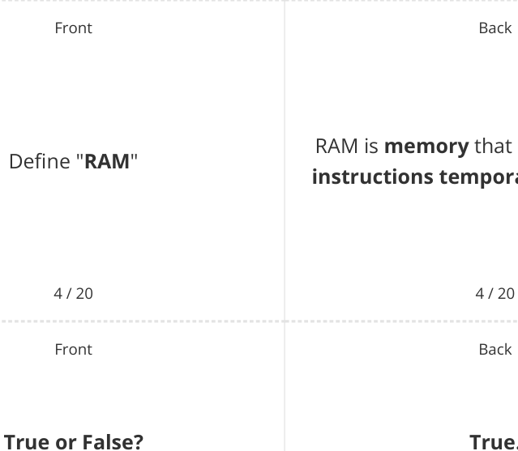

# CAIE Computer Science IGCSE — Chapter ?: Unknown Chapter

---

20 flashcards 

## **IGCSE Cambridge (CIE) Computer Science** 

Flashcards 

## **Computer Sub-Systems** 

## **How to use these Flashcards** 

Print single-sided **Scan here for revision help** Cut along the **dashed** lines or visit savemyexams.com 

Fold each card in half 

Test yourself, then flip to check answer 

Scan the QR code for revision help 

© 2026 Save My Exams, Ltd. 

Get more and ace your exams at savemyexams.com 

**1** 

Back 

Front 

A sub-system is **a smaller part of a** Define " **sub-system** " **computer system** that works **together with other sub-systems** to create a **fully functional** computer system. 

1 / 20 Front 

1 / 20 Back 

The five main sub-systems in computers What are the **five** main **sub-systems** in are: **Central Processing Unit** (CPU), computers? **Memory** , **Storage** , **Input devices** , and **Output devices** . 

2 / 20 Front 

2 / 20 Back 

What is the **function** of the **CPU subsystem** ? 

The CPU sub-system **executes instructions** . 

3 / 20 

3 / 20 

© 2026 Save My Exams, Ltd. 

Get more and ace your exams at savemyexams.com **2** 

RAM is **memory** that **stores data and instructions temporarily** for the CPU. 

**True.** 

**Storage** sub-systems store data and Storage sub-systems store data and software **permanently** . software permanently. 

5 / 20 5 / 20 Front Back 

What is the **purpose** of **input devices** ? 

Input devices **allow a user to enter information** into the computer. 

6 / 20 6 / 20 

© 2026 Save My Exams, Ltd. 

Get more and ace your exams at savemyexams.com **3** 

Front Back ALU stands for **ALU** " Define " 

ALU stands for **Arithmetic Logic Unit** , which is a component of the **CPU subsystem** . 

7 / 20 7 / 20 Front Back What are **two examples** of output Two examples of output devices are devices? **monitors** and **printers** . 

8 / 20 8 / 20 Front Back 

One advantage of using sub-systems is What is one **advantage** of using **sub-** that it **allows for troubleshooting systems** in computer design? **problems** by **isolating the sub-system** that could be causing the issue. 

9 / 20 9 / 20 

© 2026 Save My Exams, Ltd. 

Get more and ace your exams at savemyexams.com **4** 

|Front|Back|
|---|---|
||HDD stands for**Hard Disk Drive**, which|
|Defne "**HDD**"|is a type of**storage sub-system**that|
||stores data and software**permanently**.|
|10 / 20|10 / 20|
|Front|Back|
||Decomposition is the process of|
|Defne "**decomposition**"|**breaking down a large problem into a**|
||**set of smaller problems**.|

11 / 20 11 / 20 Front Back What are the **four key areas** to The four key areas to consider when consider when **decomposing a** decomposing a problem are: **inputs** , **problem** ? **processes** , **outputs** , and **storage** . 

12 / 20 12 / 20 

© 2026 Save My Exams, Ltd. 

Get more and ace your exams at savemyexams.com **5** 

Back 

Front 

## **True or False?** 

Smaller problems resulting from decomposition can be **tested independently** . 

13 / 20 

Front 

What does the term " **inputs** " refer to in **problem decomposition** ? 

14 / 20 Front 

How does decomposition **benefit game development** ? 

## **True.** 

Smaller problems resulting from decomposition can be tested independently. 

## 13 / 20 

Back 

In problem decomposition, inputs refer to **data entered into the system** . 

14 / 20 Back 

Decomposition benefits game development by **breaking down the complexity of the problem** into more manageable 'chunks', such as **levels** , **characters** , and **landscape** . 

15 / 20 15 / 20 

© 2026 Save My Exams, Ltd. Get more and ace your exams at savemyexams.com **6** 

Front 

Back 

Define " **processes** " in the context of **problem decomposition.** 

16 / 20 

Front 

What is an example of " **storage** " in a **simple area calculation program** ? 

17 / 20 Front 

## **True or False?** 

Decomposition makes solving large problems **more challenging** and . **inefficient** 

Processes are **subroutines** and **algorithms that turn inputs and stored data into outputs** . 

16 / 20 

Back 

In a simple area calculation program, storage refers to **width** , **height** , and **area stored temporarily in memory** . 

17 / 20 Back 

## **False.** 

Decomposition makes **solving large problems easier** and **more efficient** by breaking them down into smaller, more manageable problems. 

18 / 20 

18 / 20 

© 2026 Save My Exams, Ltd. 

Get more and ace your exams at savemyexams.com **7** 

Front 

Back 

Outputs are **data that is produced by** What are " **outputs** " in **problem the system** , such as **information on a decomposition** ? **screen** or **printed** information. 

19 / 20 

Front 

19 / 20 Back 

How does decomposition help with **testing** in software development? 

Decomposition helps with testing in software development by **allowing smaller problems to be tested independently** before being combined into the full solution. 

20 / 20 

20 / 20 

© 2026 Save My Exams, Ltd. 

Get more and ace your exams at savemyexams.com 

**8** 

