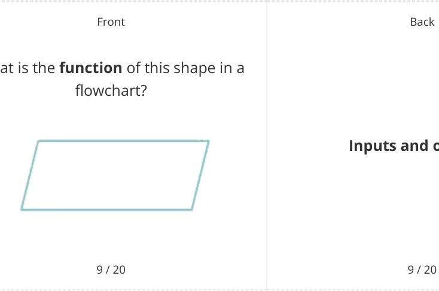

# CAIE Computer Science IGCSE — Chapter ?: Unknown Chapter

---

**IGCSE Cambridge (CIE) Computer Science** 

20 flashcards 

Flashcards 

## **Algorithms** 

## **How to use these Flashcards** 

Print single-sided **Scan here for revision help** Cut along the **dashed** lines or visit savemyexams.com 

Fold each card in half 

Test yourself, then flip to check answer 

Scan the QR code for revision help 

© 2026 Save My Exams, Ltd. 

Get more and ace your exams at savemyexams.com 

**1** 

Front Back An algorithm is **a precise set of rules** Define " **algorithm** " **or instructions** to **solve a specific problem** or **task** . 

1 / 20 1 / 20 Front Back 

What are the **three main ways** to **design** an algorithm? 

The three main ways to design an algorithm are **structure diagrams** , **flowcharts** , and **pseudocode** . 

2 / 20 

2 / 20 

Front Back 

What is a **structure diagram** ? 

A structure diagram shows **hierarchical top-down design in a visual form** , dividing problems into sub-problems. 

3 / 20 

3 / 20 

© 2026 Save My Exams, Ltd. 

Get more and ace your exams at savemyexams.com 

**2** 

Front 

## **True or False?** 

Flowcharts **use shapes** to represent different functions in an algorithm. 

4 / 20 Front 

What does pseudocode use **to describe an algorithm** ? 

5 / 20 

Front 

" Define " **flowchart** 

6 / 20 

Back 

## **True.** 

Flowcharts **use shapes** to represent different functions to describe an algorithm. 

4 / 20 

Back 

Pseudocode uses **short English words/statements** to describe an algorithm. 

5 / 20 

Back 

**a visual tool** that **uses** A flowchart is **shapes to represent different functions** to describe an algorithm. 

6 / 20 

© 2026 Save My Exams, Ltd. 

Get more and ace your exams at savemyexams.com **3** 

Front 

What do **lines** represent in a ? **flowchart** 

In a flowchart, lines represent the **flow of control** . 

7 / 20 Front 

Back 

## **True or False?** 

Pseudocode is **less structured** than writing sentences in English. 

## **False.** 

Pseudocode is **more structured** than writing sentences in English but is very flexible. 

8 / 20 Front 

What is the **function** of this shape in a flowchart? 

**Inputs and outputs.** 

© 2026 Save My Exams, Ltd. 

Get more and ace your exams at savemyexams.com **4** 

Front 

Back 

What is the **function** of this shape in a flowchart? 

10 / 20 

Front 

What are **three ways** algorithms can be written? 

11 / 20 

Front 

## **True or False?** 

A well-designed algorithm should be **interpretable by a new user** who can explain what it does. 

12 / 20 

## **Sub-process.** 

10 / 20 

Back 

Algorithms can be written using **flowcharts** , **pseudocode** , or **high-level programming language** code such as Python. 

11 / 20 

Back 

## **True.** 

A well-designed algorithm **should be interpretable by a new user** who can explain what it does. 

12 / 20 

© 2026 Save My Exams, Ltd. 

Get more and ace your exams at savemyexams.com **5** 

Back 

Front Back The purpose of an algorithm is to **solve** What is the **purpose** of an algorithm? **a problem** . 

13 / 20 13 / 20 Front Back Pseudocode is **a method of writing algorithms** using **short English** Define " **pseudocode** " **words/statements** that is more structured than plain English but less formal than actual programming code. 

14 / 20 14 / 20 Front Back 

What are **three ways** to **understand** a **complex** algorithm? 

Three ways to understand a complex algorithm are: look for **comments in the code** , consider the **context of where the algorithm is being used** , and **test the algorithm** with different inputs. 

15 / 20 15 / 20 

© 2026 Save My Exams, Ltd. 

Get more and ace your exams at savemyexams.com 

**6** 

Front 

What does the term " **initialisation** " mean in the context of **algorithms** ? 

16 / 20 Front 

## **True or False?** 

The purpose of an algorithm should **always be explicitly stated** at the beginning. 

What is the **function** of an **array** in an algorithm? 

Back 

Initialisation refers to **setting initial values for variables** at the beginning of an algorithm. 

## **False.** 

The purpose of an algorithm should 

**become clear by following its instructions** , even if not explicitly stated. 

An array in an algorithm **is used to store multiple values under a single variable name** , typically accessed by an index. 

© 2026 Save My Exams, Ltd. 

Get more and ace your exams at savemyexams.com **7** 

Back 

Front Back In pseudocode, "REPEAT...UNTIL" What does the term " **REPEAT...UNTIL** " **represents a loop** that continues to represent in **pseudocode** ? execute **until a specified condition is met** . 

19 / 20 19 / 20 Front Back The "IF...THEN...ELSE" structure in What is the purpose of the algorithms **is used for decision-** " **IF...THEN...ELSE** " structure in **making** , allowing **different actions to** algorithms? **be taken based on whether a condition is true or false** . 

20 / 20 20 / 20 

© 2026 Save My Exams, Ltd. Get more and ace your exams at savemyexams.com 

**8** 

