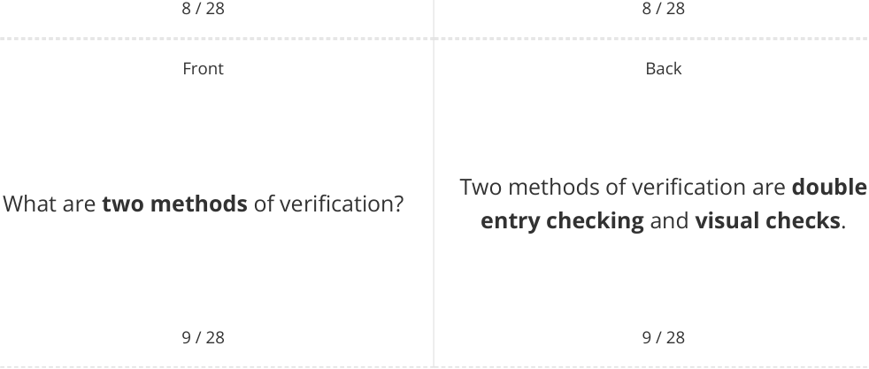
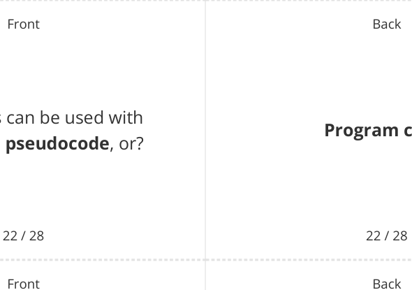

# CAIE Computer Science IGCSE — Chapter ?: Unknown Chapter

---

## **IGCSE Cambridge (CIE) Computer Science** 

28 flashcards 

Flashcards 

## **Validation & Verification** 

## **How to use these Flashcards** 

Print single-sided **Scan here for revision help** Cut along the **dashed** lines or visit savemyexams.com 

Fold each card in half 

Test yourself, then flip to check answer 

Scan the QR code for revision help 

© 2026 Save My Exams, Ltd. 

Get more and ace your exams at savemyexams.com 

**1** 

|Front 1 / 28 Defne "**validation**" in the context of data input.|Back 1 / 28 Validation is a method used to**check** **that an input from a user is** **acceptable**and**matches the** **requirements**of the program.|
|---|---|
|Front 2 / 28 What are the**six categories**of validation?|Back 2 / 28 The six categories of validation are: **range**check,**length**check,**type**check, **presence**check,**format**check, and **check digit**.|
|Front 3 / 28 What is a**range check**?|Back 3 / 28 A range check**ensures the data** **entered**as a number**falls within a** **particular range**.|
|||

© 2026 Save My Exams, Ltd. 

Get more and ace your exams at savemyexams.com 

**2** 

|Front 4 / 28 Defne "**length check**"|Back 4 / 28 A length check**verifes that the length** **of a string meets specifc criteria**, such as a minimum or maximum number of characters.|
|---|---|
|Front 5 / 28 What does a**type check**do?|Back 5 / 28 A type check**verifes that the data** **entered matches the expected data** **type**, such as ensuring an age is entered as an integer.|
|Front 6 / 28 What is the purpose of a**presence** **check**?|Back 6 / 28 A presence check**looks to see if any** **data has been entered in a feld**, ensuring that required felds**are not** **left blank**.|
|||

© 2026 Save My Exams, Ltd. Get more and ace your exams at savemyexams.com 

**3** 

|Front Defne "**format check**"|Back A format check**ensures that the data** **has been entered in the correct** **format**, often using pattern matching and string handling.|
|---|---|

7 / 28 7 / 28 Front Back Verification is the **act of checking that** What is **verification** in data entry? **data is accurate when entered into a system** . 

© 2026 Save My Exams, Ltd. Get more and ace your exams at savemyexams.com 

**4** 

Back 

Front 

What is the purpose of a **check digit** ? 

A check digit is **a numerical value** , usually the final digit of a larger code, **calculated by applying an algorithm** to the code to **verify its accuracy** . 

10 / 28 10 / 28 Front Back Suitable test data is **specially chosen** Define " **suitable test data** " **data** to **test the functionality of a program** or design. 

11 / 28 11 / 28 Front Back The four categories of suitable test data What are the **four categories** of are: **normal** , **abnormal** , **extreme** , and suitable test data? **boundary** . 

12 / 28 

12 / 28 

© 2026 Save My Exams, Ltd. 

Get more and ace your exams at savemyexams.com 

**5** 

Front 

Back 

What is **normal** test data? 

Normal test data is **data that should be accepted** in the program. 

13 / 28 13 / 28 Front Back Abnormal test data is **abnormal test data** " Define " 

Abnormal test data is **data that is the** . **wrong data type for the input field** 

14 / 28 14 / 28 Front Back Extreme test data is **the maximum and** What is **extreme** test data? **minimum values of normal data** that **are accepted** by the system. 

15 / 28 

15 / 28 

© 2026 Save My Exams, Ltd. 

Get more and ace your exams at savemyexams.com 

**6** 

Back 

Front 

How does **boundary** test data differ from **extreme** test data? 

16 / 28 

Front 

## **True or False?** 

Suitable test data is only used to check if a program works correctly. 

17 / 28 Front 

What is the **purpose** of using different categories of test data? 

18 / 28 

Boundary test data tests values **on either side of the maximum and minimum acceptable values** , including the largest and smallest **unacceptable values** . 

16 / 28 

Back 

**False.** 

Suitable test data is used to test both **correct functionality** and **how the program handles incorrect inputs** . 

17 / 28 Back 

The purpose of using different categories of test data is to **thoroughly test various aspects of the program** , including **its ability to handle both valid and invalid inputs** . 

18 / 28 

© 2026 Save My Exams, Ltd. 

Get more and ace your exams at savemyexams.com 

**7** 

|Front|Back|
|---|---|
||Boundary test data would include ages:|
|rogram to check age is**between 18**||
|**25**, what would be an example of|**18,25**-smallest & largest**accepted**data|
|**ndary test data**?|**17 & 26**- data falling just**below**&|
||**exceeding**|
|19 / 28|19 / 28|
|Front|Back|
||It's important to test with abnormal|
|Why is it**important**to test with **abnormal data**?|data to**ensure the program can** **handle incorrect input types**and **doesn't crash or behave**|
||**unexpectedly**when given invalid data.|

Boundary test data would include ages: **18,25** -smallest & largest **accepted** data **17 & 26** - data falling just **below** & **exceeding** 

A program to check age is **between 18 and 25** , what would be an example of **boundary test data** ? 

||20 / 28|20 / 28|
|---|---|---|
||Front|Back|
|||A trace table is used to**test algorithms**|
|Defne|"**trace table**"|**and programs for logic errors**that appear when an algorithm or program|
|||executes.|
||21 / 28|21 / 28|

© 2026 Save My Exams, Ltd. 

Get more and ace your exams at savemyexams.com 

**8** 

Trace tables can be used with **flowcharts** , **pseudocode** , or? 

**Program code** . 

What are **two purposes** of using a trace table? 

Two purposes of using a trace table are: **discover the purpose of an algorithm** and **record the state of the algorithm at each step or iteration** . 

23 / 28 23 / 28 Front Back A trace table is executed by **following** How is a trace table **executed** ? **each stage of the algorithm step by step** . 

24 / 28 

24 / 28 

© 2026 Save My Exams, Ltd. Get more and ace your exams at savemyexams.com **9** 

Back 

Front 

## **True or False?** 

Trace tables can **only** be used with program code. 

## **False.** 

Trace tables can be used with flowcharts, pseudocode, or program code. 

25 / 28 25 / 28 Front Back 

## **Inputs** , **outputs** , **variables** , and 

What can be **checked** using a trace table? 

**processes** can be checked for the correct value at each completed stage using a trace table. 

26 / 28 26 / 28 Front Back 

In a trace table, what does **each row** typically represent? 

In a trace table, each row typically represents **a single step or iteration** of the algorithm. 

27 / 28 

27 / 28 

© 2026 Save My Exams, Ltd. 

Get more and ace your exams at savemyexams.com **10** 

Back 

Front Back Trace tables are particularly useful for What **type of errors** are trace tables identifying **logic errors** that appear particularly useful for identifying? when an algorithm or program executes. 

28 / 28 

28 / 28 

© 2026 Save My Exams, Ltd. 

Get more and ace your exams at savemyexams.com 

**11** 

