# CAIE Computer Science IGCSE — Chapter ?: Unknown Chapter

---

**IGCSE Cambridge (CIE) Computer Science** 12 flashcards 

Flashcards 

## **Arrays** 

## **How to use these Flashcards** 

Print single-sided **Scan here for revision help** Cut along the **dashed** lines or visit savemyexams.com 

Fold each card in half 

Test yourself, then flip to check answer 

Scan the QR code for revision help 

© 2026 Save My Exams, Ltd. 

Get more and ace your exams at savemyexams.com 

**1** 

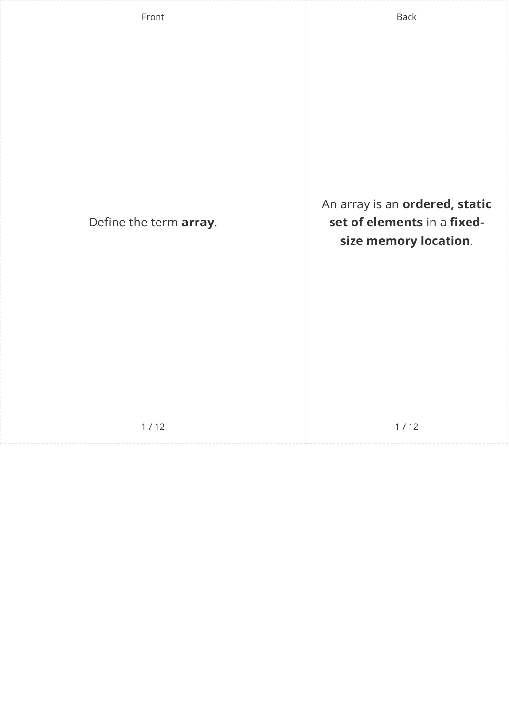

© 2026 Save My Exams, Ltd. 

Get more and ace your exams at savemyexams.com 

**2** 

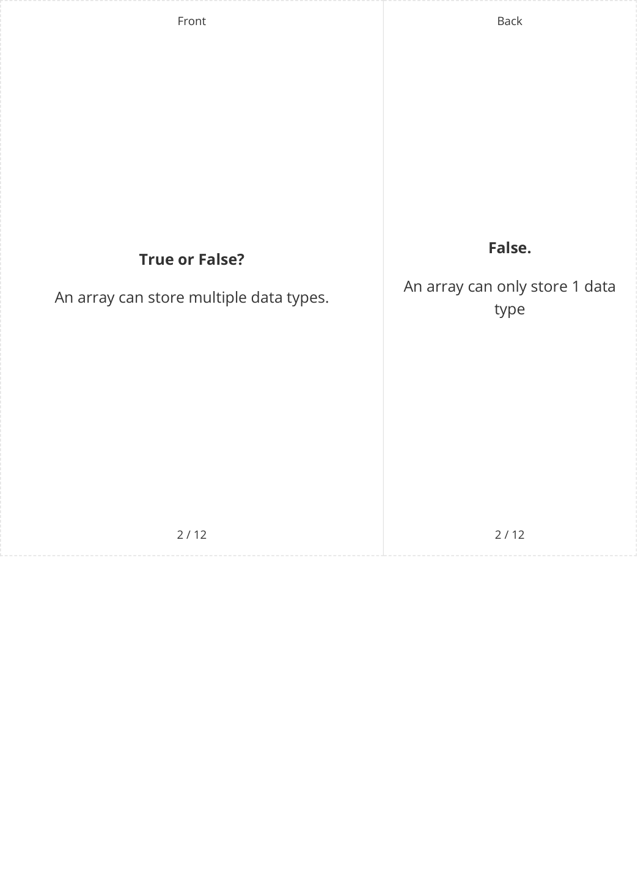

© 2026 Save My Exams, Ltd. 

Get more and ace your exams at savemyexams.com 

**3** 

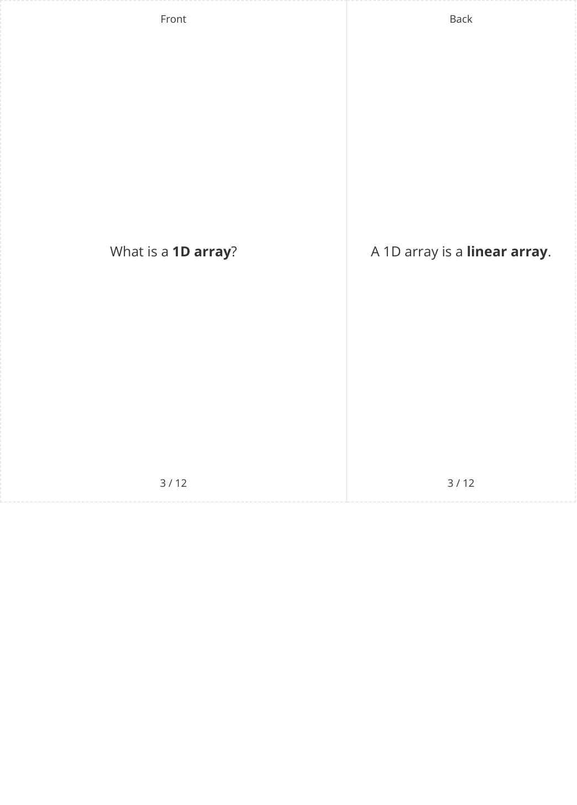

© 2026 Save My Exams, Ltd. 

Get more and ace your exams at savemyexams.com 

**4** 

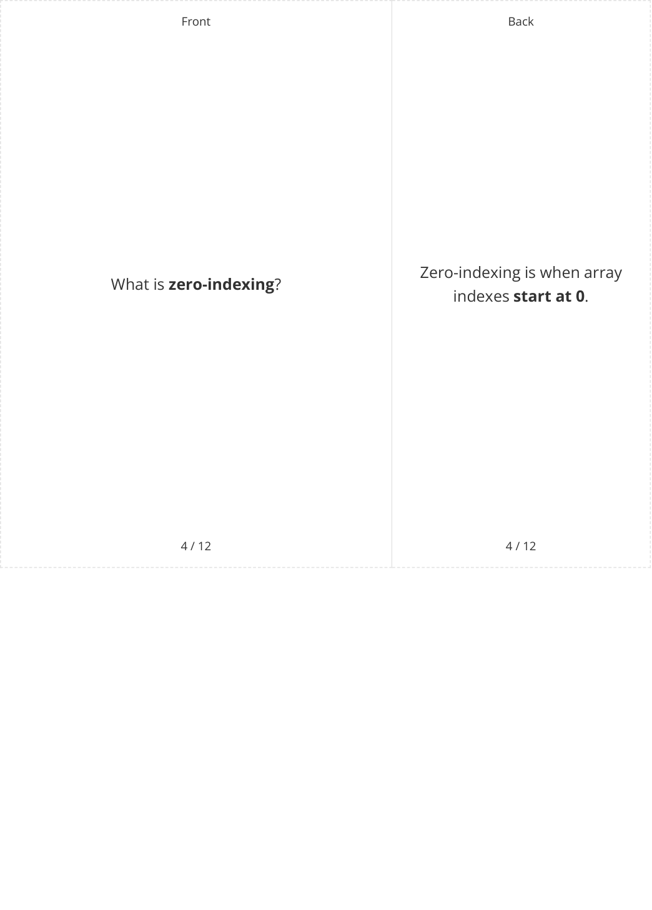

© 2026 Save My Exams, Ltd. 

Get more and ace your exams at savemyexams.com 

**5** 

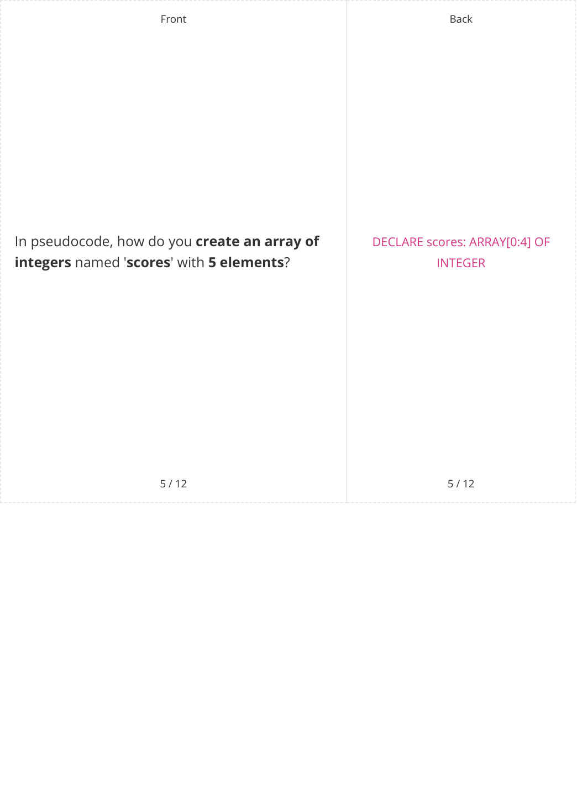

© 2026 Save My Exams, Ltd. 

Get more and ace your exams at savemyexams.com 

**6** 

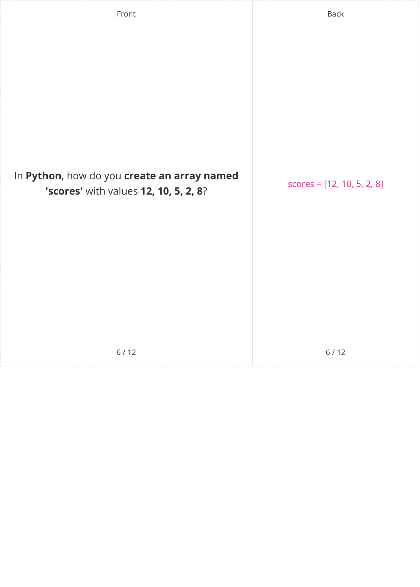

© 2026 Save My Exams, Ltd. 

Get more and ace your exams at savemyexams.com 

**7** 

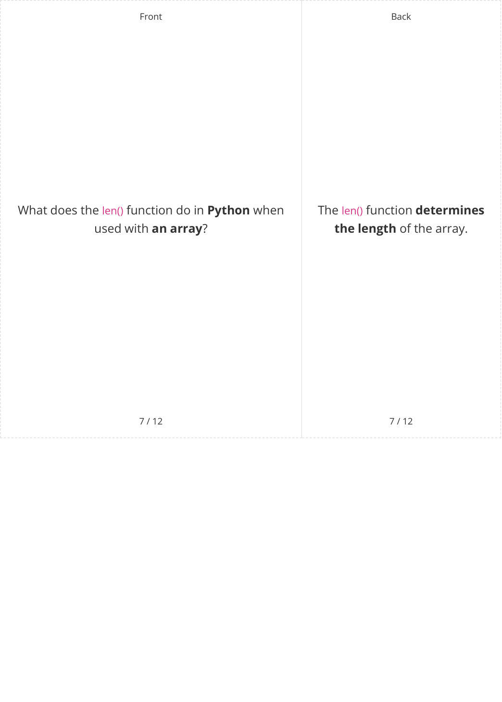

© 2026 Save My Exams, Ltd. 

Get more and ace your exams at savemyexams.com 

**8** 

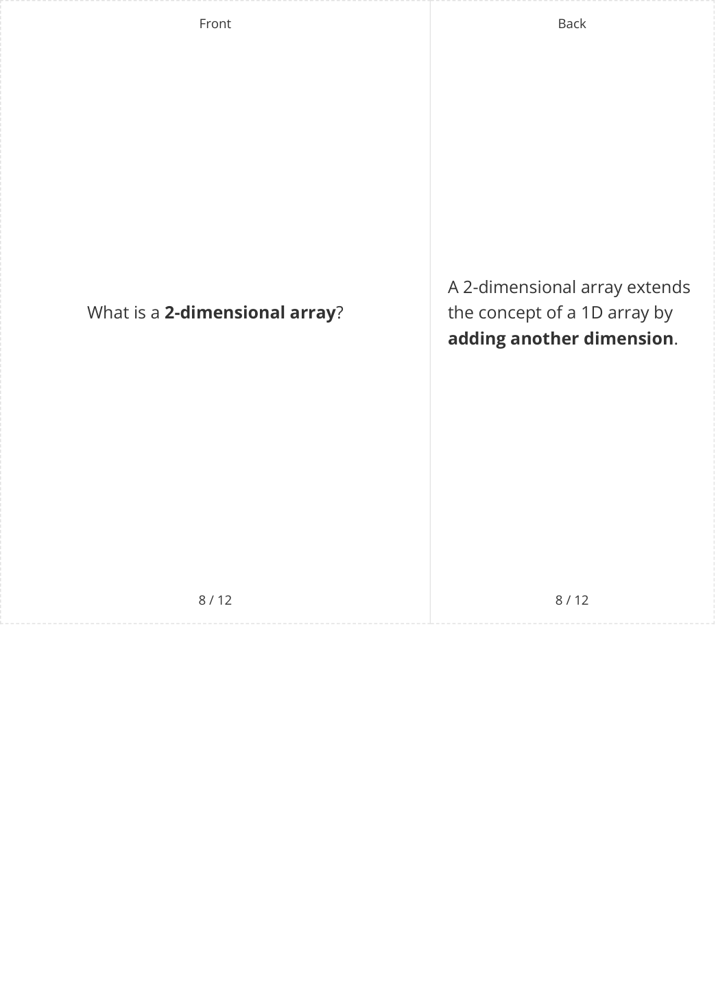

© 2026 Save My Exams, Ltd. 

Get more and ace your exams at savemyexams.com 

**9** 

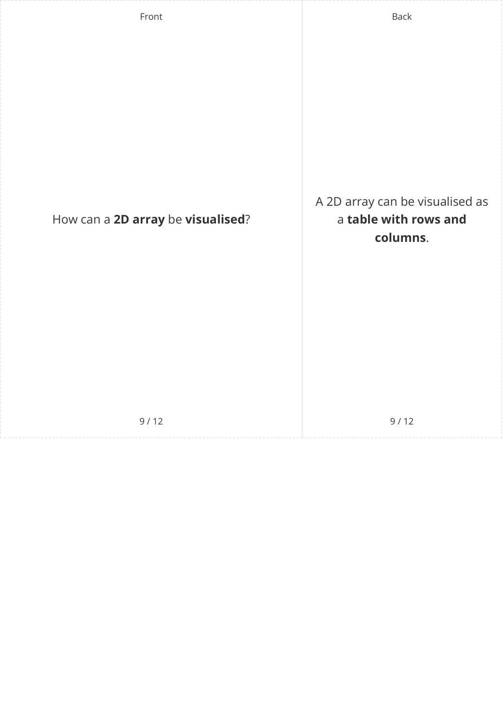

© 2026 Save My Exams, Ltd. 

Get more and ace your exams at savemyexams.com 

**10** 

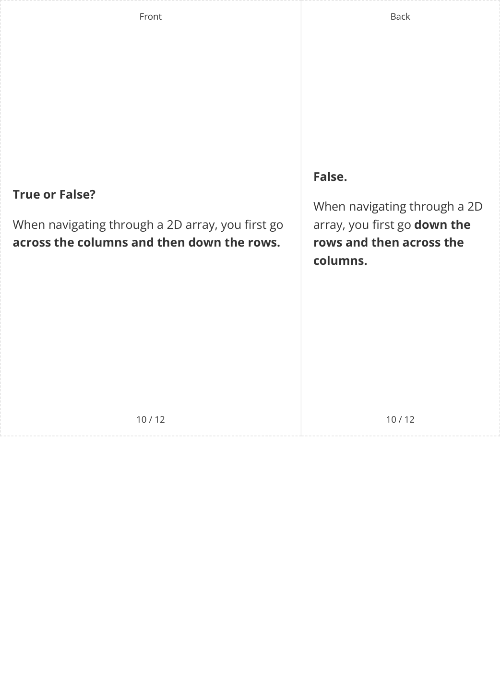

© 2026 Save My Exams, Ltd. 

Get more and ace your exams at savemyexams.com 

**11** 

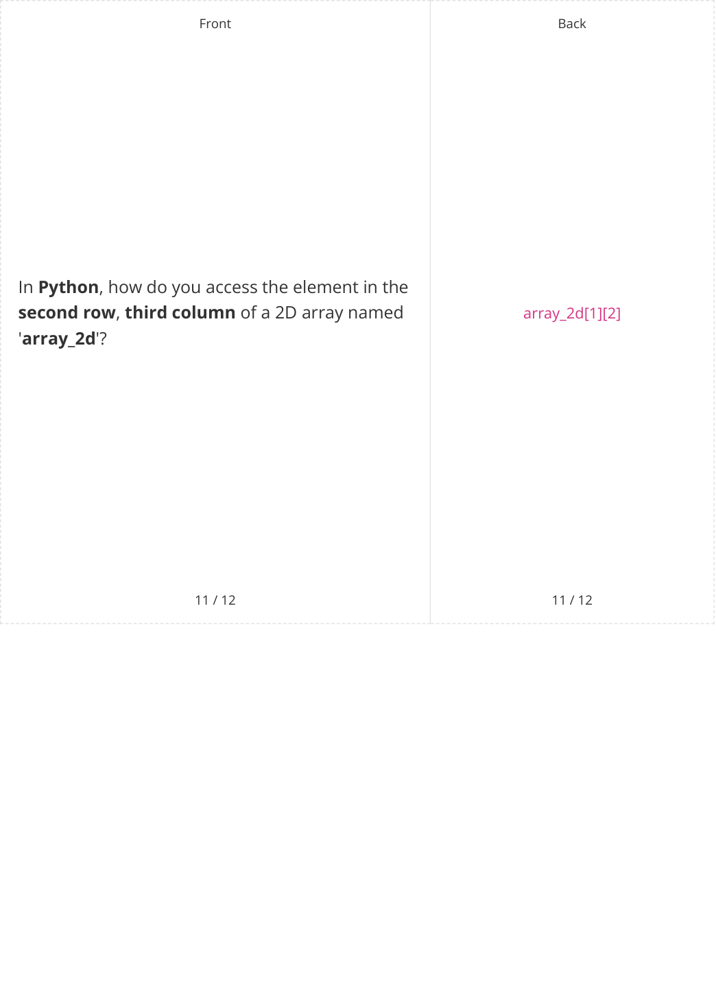

© 2026 Save My Exams, Ltd. 

Get more and ace your exams at savemyexams.com 

**12** 

||Front 12 / 12 What doesminsWatched[1][1]represent in the worked example? **Quinn** **Lyla** **Harry** **Elias** **0** **1** **2** **3** **Monday** **0** 34 67 89 78 **Tuesday** **1** 56 43 45 56 **Wednesday** **2** 122 23 34 45 **Thursday** **3** 13 109 23 90 **Friday** **4** 47 100 167 23|Front 12 / 12 What doesminsWatched[1][1]represent in the worked example? **Quinn** **Lyla** **Harry** **Elias** **0** **1** **2** **3** **Monday** **0** 34 67 89 78 **Tuesday** **1** 56 43 45 56 **Wednesday** **2** 122 23 34 45 **Thursday** **3** 13 109 23 90 **Friday** **4** 47 100 167 23|Front 12 / 12 What doesminsWatched[1][1]represent in the worked example? **Quinn** **Lyla** **Harry** **Elias** **0** **1** **2** **3** **Monday** **0** 34 67 89 78 **Tuesday** **1** 56 43 45 56 **Wednesday** **2** 122 23 34 45 **Thursday** **3** 13 109 23 90 **Friday** **4** 47 100 167 23|Front 12 / 12 What doesminsWatched[1][1]represent in the worked example? **Quinn** **Lyla** **Harry** **Elias** **0** **1** **2** **3** **Monday** **0** 34 67 89 78 **Tuesday** **1** 56 43 45 56 **Wednesday** **2** 122 23 34 45 **Thursday** **3** 13 109 23 90 **Friday** **4** 47 100 167 23|Front 12 / 12 What doesminsWatched[1][1]represent in the worked example? **Quinn** **Lyla** **Harry** **Elias** **0** **1** **2** **3** **Monday** **0** 34 67 89 78 **Tuesday** **1** 56 43 45 56 **Wednesday** **2** 122 23 34 45 **Thursday** **3** 13 109 23 90 **Friday** **4** 47 100 167 23|Front 12 / 12 What doesminsWatched[1][1]represent in the worked example? **Quinn** **Lyla** **Harry** **Elias** **0** **1** **2** **3** **Monday** **0** 34 67 89 78 **Tuesday** **1** 56 43 45 56 **Wednesday** **2** 122 23 34 45 **Thursday** **3** 13 109 23 90 **Friday** **4** 47 100 167 23|Back 12 / 12 minsWatched[1][1]represents **the number of minutes that** **Lyla watched TV**on**Tuesday** (43).||
|---|---|---|---|---|---|---|---|---|
||||**Quinn**|**Lyla**|**Harry**|**Elias**|||
||||**0**|**1**|**2**|**3**|||
||**Monday**|**0**|34|67|89|78|||
||**Tuesday**|**1**|56|43|45|56|||
||**Wednesday**|**2**|122|23|34|45|||
||**Thursday**|**3**|13|109|23|90|||
||**Friday**|**4**|47|100|167|23|||
||||12 / 12||||||

© 2026 Save My Exams, Ltd. 

Get more and ace your exams at savemyexams.com 

**13** 

