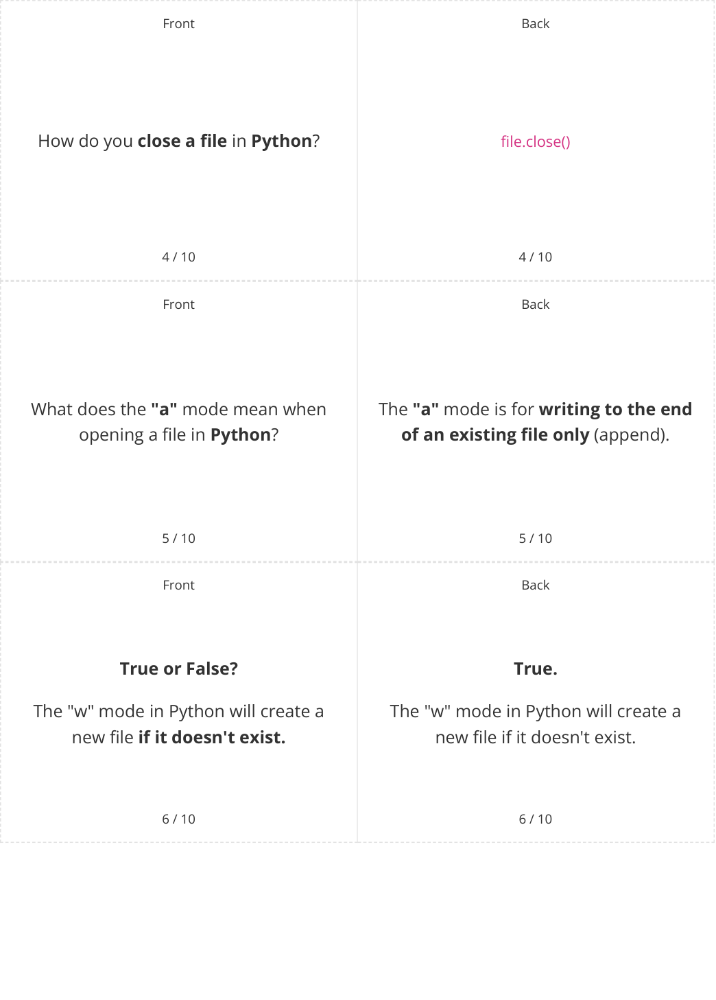

# CAIE Computer Science IGCSE — Chapter ?: Unknown Chapter

---

## **IGCSE Cambridge (CIE) Computer Science** 

10 flashcards 

Flashcards 

## **File Handling** 

## **How to use these Flashcards** 

Print single-sided **Scan here for revision help** Cut along the **dashed** lines or visit savemyexams.com 

Cut along the **dashed** lines Fold each card in half 

Test yourself, then flip to check answer 

Scan the QR code for revision help 

© 2026 Save My Exams, Ltd. 

Get more and ace your exams at savemyexams.com 

**1** 

Front Back File handling is the use of programming What is **file handling** ? techniques to **work with information stored in text files.** 1 / 10 1 / 10 Front Back 1. **Opening** text files List **four examples** of file handling 2. **Reading** text files techniques. 3. **Writing** text files 4. **Closing** text files. 

2 / 10 2 / 10 Front Back In **Python** , how do you **open a file** file = open("fruit.txt","r") named " **fruit.txt** " in **read mode** ? 3 / 10 3 / 10 

© 2026 Save My Exams, Ltd. 

Get more and ace your exams at savemyexams.com 

**2** 

© 2026 Save My Exams, Ltd. 

Get more and ace your exams at savemyexams.com **3** 

Front 

Back 

What is the **purpose** of the readline() function in **Python** ? 

The readline() function is used to **read a single line** from a file. 

7 / 10 7 / 10 Front Back How do you write **a new line** to a file in file.write("New line content\n") **Python** ? 

8 / 10 8 / 10 Front Back What does the following **code** do: It checks if the **end of the file has been reached** by seeing if the 'name' endOfFile = name == "" **variable is empty.** 

9 / 10 9 / 10 

© 2026 Save My Exams, Ltd. Get more and ace your exams at savemyexams.com **4** 

Back 

Front 

10 / 10 

## **True.** 

## **True or False?** 

It's important to always make a backup of text files you are working with. 

It's important to always make a backup of text files you are working with, as one mistake can cause you to lose the contents. 

10 / 10 

© 2026 Save My Exams, Ltd. 

Get more and ace your exams at savemyexams.com 

**5** 

