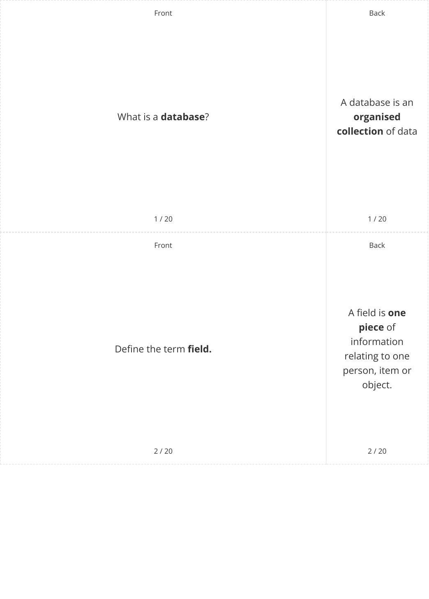
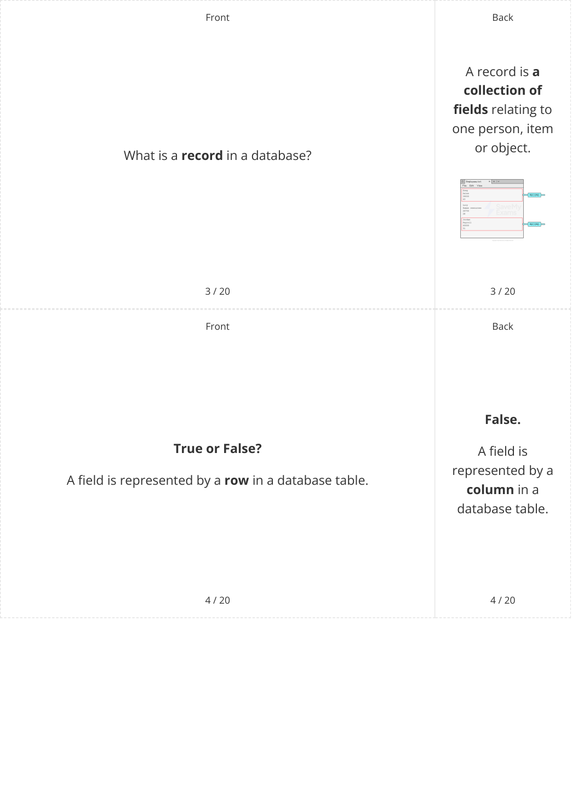
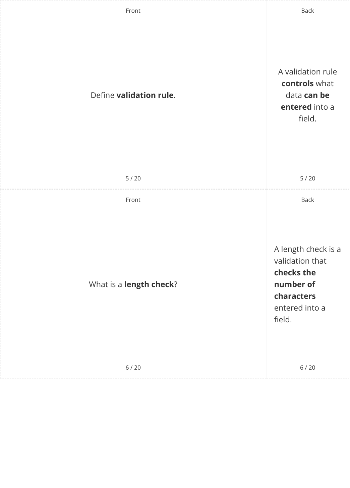
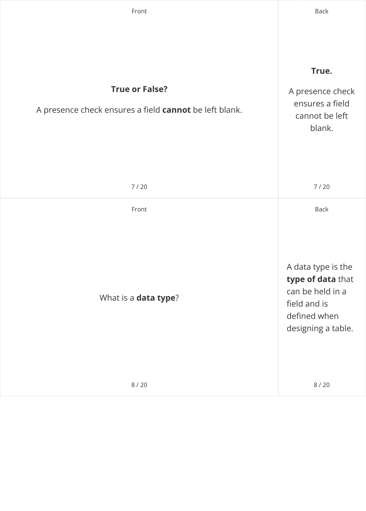
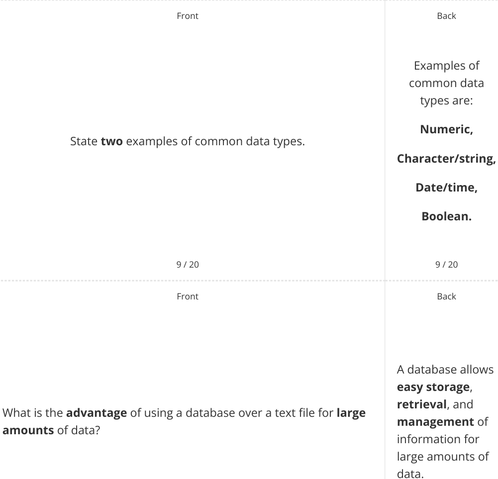
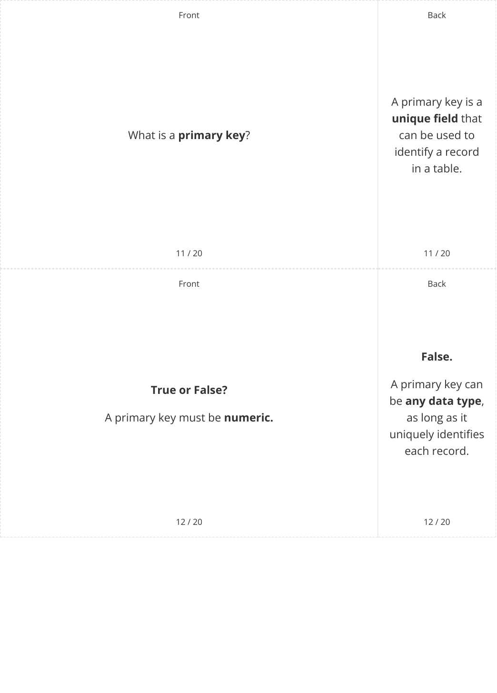
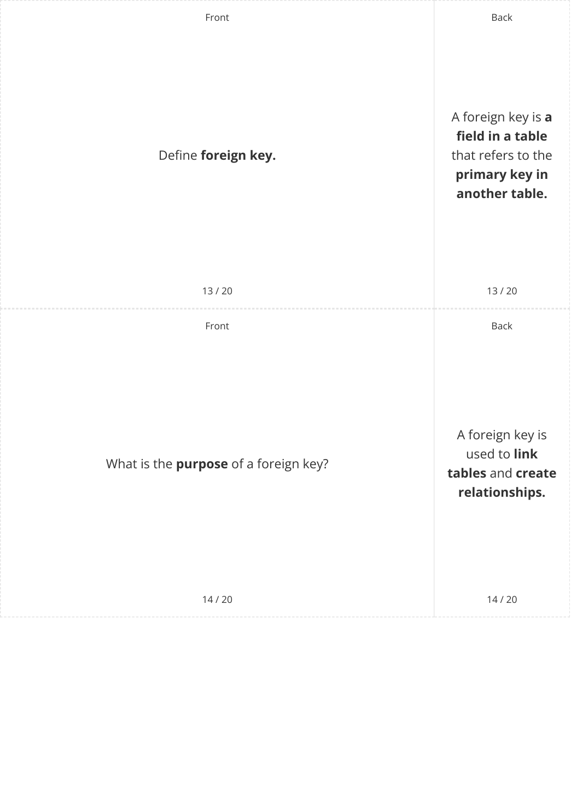
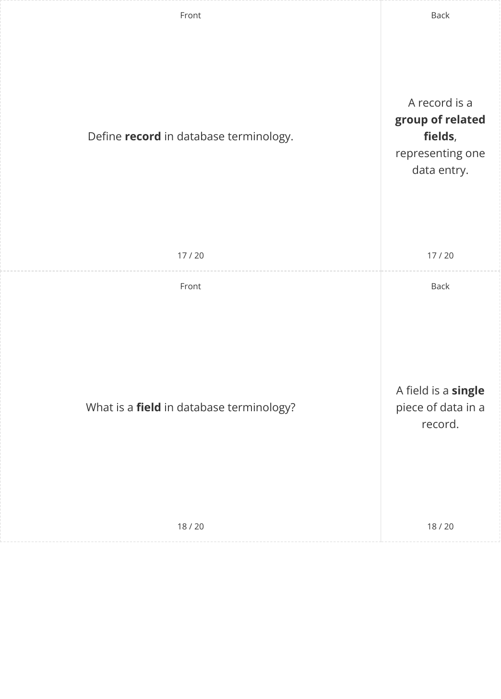
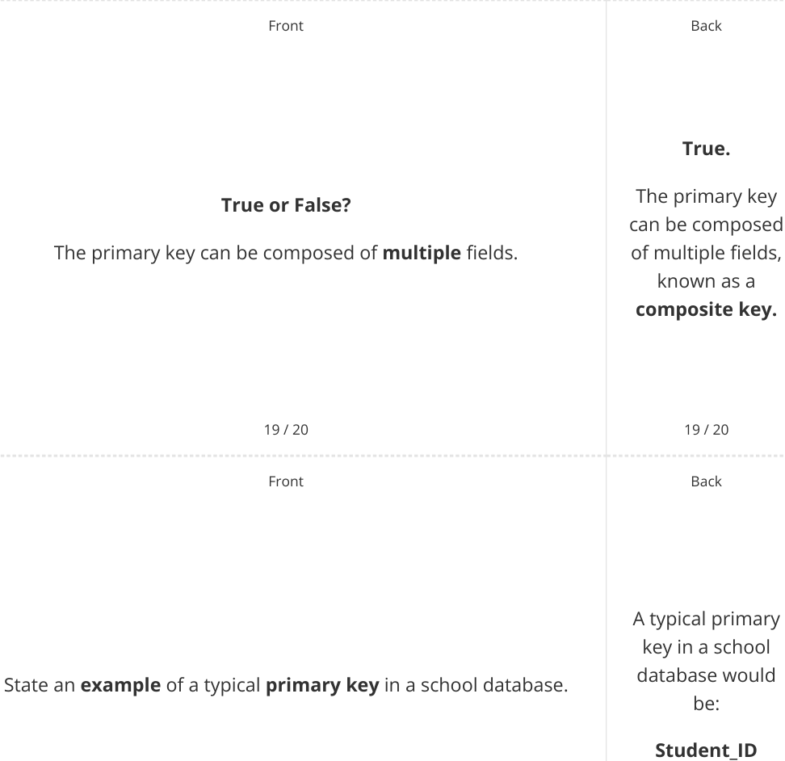

# CAIE Computer Science IGCSE — Chapter ?: Unknown Chapter

---

**IGCSE Cambridge (CIE) Computer Science** 

20 flashcards 

Flashcards 

## **Databases** 

## **How to use these Flashcards** 

- Print single-sided 

Cut along the **dashed** lines 

Fold each card in half 

Test yourself, then flip to check answer 

Scan the QR code for revision help 

**Scan here for revision help** or visit savemyexams.com 

© 2026 Save My Exams, Ltd. 

Get more and ace your exams at savemyexams.com 

**1** 

© 2026 Save My Exams, Ltd. 

Get more and ace your exams at savemyexams.com 

**2** 

© 2026 Save My Exams, Ltd. 

Get more and ace your exams at savemyexams.com 

**3** 

© 2026 Save My Exams, Ltd. 

Get more and ace your exams at savemyexams.com 

**4** 

© 2026 Save My Exams, Ltd. 

Get more and ace your exams at savemyexams.com 

**5** 

© 2026 Save My Exams, Ltd. 

Get more and ace your exams at savemyexams.com 

**6** 

© 2026 Save My Exams, Ltd. 

Get more and ace your exams at savemyexams.com 

**7** 

© 2026 Save My Exams, Ltd. 

Get more and ace your exams at savemyexams.com 

**8** 

Front 

Every table **must True or False?** have a primary Every table **must** have a primary key. key to uniquely identify each record 15 / 20 15 / 20 Front Back What **field** would make a good primary key? 

|**CustomerID**|**FirstName**|**LastName**|**DOB**|**PhoneNum**|
|---|---|---|---|---|
|**001**|Andrea|Bycroft|05031976|0746762883|
|**002**|Melissa|Langler|22012001|0756372892|
|**003**|Amy|George|22111988|074637|
|||16 / 20|||

© 2026 Save My Exams, Ltd. 

Get more and ace your exams at savemyexams.com **9** 

© 2026 Save My Exams, Ltd. 

Get more and ace your exams at savemyexams.com 

**10** 

© 2026 Save My Exams, Ltd. Get more and ace your exams at savemyexams.com 

**11** 

