# CAIE Computer Science IGCSE — Chapter 1: Data representation

---

**1** 

## **In this chapter you will learn about:** 

- ★ number systems 

   - how and why computers use binary to represent data 

   - the denary, binary and hexadecimal number systems 

   - converting numbers between denary, binary and hexadecimal 

   - how and why hexadecimal is used for data representation 

   - how to add two positive 8-bit numbers 

   - overflow when performing binary addition 

   - logical binary shifts on positive 8-bit integers 

   - two’s complement notation to represent positive and negative binary numbers 

- ★ text, sound and images 

   - how and why a computer represents text 

   - the use of character sets including ASCII and Unicode 

   - how and why a computer represents sound 

   - sound sample rate and sample resolution 

   - how and why a computer represents an image 

   - the effects of the resolution and colour depth on images 

- ★ data storage and compression 

   - how data storage is measured 

   - calculating the file size of an image and sound file 

   - the purpose of and need for data compression 

   - lossy and lossless compression. 

This chapter considers the three key number systems used in computer science, namely binary, denary and hexadecimal. It also discusses how these number systems are used to measure the size of computer memories and storage devices, together with how sound and images can be represented digitally. 

## 1.1 Number systems

### 1.1.1 Binary represents data

As you progress through this book you will begin to realise how complex computer systems really are. By the time you reach Chapter 10 you should have a better understanding of the fundamentals behind computers themselves and the software that controls them. 

You will learn that any form of data needs to be converted into a binary format so that it can be processed by the computer. 

However, no matter how complex the system, the basic building block in all computers is the binary number system. This system is chosen because it only consists of 1s and 0s. Since computers contain millions and millions of tiny ‘switches’, which must be in the ON or OFF position, they can be represented by the binary system. A switch in the ON position is represented by 1; a switch in the OFF position is represented by 0. 

2 

Switches used in a computer make use of logic gates (see Chapter 10) and are used to store and process data. 

### 1.1.2 Binary, denary and hexadecimal systems

## **The binary system** 

We are all familiar with the denary number system which counts in multiples of 10. This gives us the well-known headings of units, 10s, 100s, 1000s, and so on: 

|**(104)** **10 000**|**(103)** **1000**|**(102)** **100**|**(101)** **10**|**(100)** **1**|
|---|---|---|---|---|
|2|5|1|7|7|

Denary uses ten separate digits, 0-9, to represent all values. Denary is known as a base 10 number system. 

The **binary number system** is a base 2 number system. It is based on the number 2. Thus, only the two ‘values’ 0 and 1 can be used in this system to represent all values. Using the same method as denary, this gives the headings 2[0] , 2[1] , 2[2] , 2[3] , and so on. The typical headings for a binary number with eight digits would be: 

|**(27)** **128**|**(26)** **64**|**(25)** **32**|**(24)** **16**|**(23)** **8**|**(22)** **4**|**(21)** **2**|**(20)** **1**|
|---|---|---|---|---|---|---|---|
|1|1|1|0|1|1|1|0|

A typical binary number would be: 11101110. 

## **Converting from binary to denary** 

The conversion from binary to denary is a relatively straightforward process. Each time a 1-value appears in a binary number column, the column value (heading) is added to a total. This is best shown by three examples which use 8-bit, 12-bit and 16-bit binary numbers: 

## **Example 1** 

Convert the binary number, 11101110, into a denary number. 

128 64 32 16 8 4 2 1 1 1 1 0 1 1 1 0 

The equivalent denary number is 128 + 64 + 32 + 8 + 4 + 2 = 238 

## **Example 2** 

Convert the following binary number, 011110001011, into a denary number. 

|2048 1024 512 256 128 64 32 16 8 4 2 1|2048 1024 512 256 128 64 32 16 8 4 2 1|2048 1024 512 256 128 64 32 16 8 4 2 1|2048 1024 512 256 128 64 32 16 8 4 2 1|2048 1024 512 256 128 64 32 16 8 4 2 1|2048 1024 512 256 128 64 32 16 8 4 2 1|2048 1024 512 256 128 64 32 16 8 4 2 1|2048 1024 512 256 128 64 32 16 8 4 2 1|2048 1024 512 256 128 64 32 16 8 4 2 1|2048 1024 512 256 128 64 32 16 8 4 2 1|2048 1024 512 256 128 64 32 16 8 4 2 1|2048 1024 512 256 128 64 32 16 8 4 2 1|
|---|---|---|---|---|---|---|---|---|---|---|---|
|0|1|1|1|1|0|0|0|1|0|1|1|

The equivalent denary number is 1024 + 512 + 256 + 128 + 8 + 2 + 1 = 1931 

3 

## **Example 3** 

Convert the following binary number, 0011000111100110, into a denary number. 

|32768 16384 8192 4096 2048 1024 512 256 128 64 32 16 8 4 2 1|32768 16384 8192 4096 2048 1024 512 256 128 64 32 16 8 4 2 1|32768 16384 8192 4096 2048 1024 512 256 128 64 32 16 8 4 2 1|32768 16384 8192 4096 2048 1024 512 256 128 64 32 16 8 4 2 1|32768 16384 8192 4096 2048 1024 512 256 128 64 32 16 8 4 2 1|32768 16384 8192 4096 2048 1024 512 256 128 64 32 16 8 4 2 1|32768 16384 8192 4096 2048 1024 512 256 128 64 32 16 8 4 2 1|32768 16384 8192 4096 2048 1024 512 256 128 64 32 16 8 4 2 1|32768 16384 8192 4096 2048 1024 512 256 128 64 32 16 8 4 2 1|32768 16384 8192 4096 2048 1024 512 256 128 64 32 16 8 4 2 1|32768 16384 8192 4096 2048 1024 512 256 128 64 32 16 8 4 2 1|32768 16384 8192 4096 2048 1024 512 256 128 64 32 16 8 4 2 1|32768 16384 8192 4096 2048 1024 512 256 128 64 32 16 8 4 2 1|32768 16384 8192 4096 2048 1024 512 256 128 64 32 16 8 4 2 1|32768 16384 8192 4096 2048 1024 512 256 128 64 32 16 8 4 2 1|32768 16384 8192 4096 2048 1024 512 256 128 64 32 16 8 4 2 1|
|---|---|---|---|---|---|---|---|---|---|---|---|---|---|---|---|
|0|0|1|1|0|0|0|1|1|1|1|0|0|1|1|0|

As with the two examples above, to convert this number to denary, each time a 1 appears in a column the column value is added to the total: 

8192 + 4096 + 256 + 128 + 64 + 32 + 4 + 2 = 12 774 

The same method can be used for a binary number of any size. 

## **Activity 1.1** 

|**Activity 1.1**|**Activity 1.1**|**Activity 1.1**|**Activity 1.1**|
|---|---|---|---|
|Convert the following binary numbers into denary:||||
|**a**|0  0  1  1  0  0  1  1|**k**|0 0 0 1   1 1 1 0   0 1 1 1|
|**b**|0  1  1  1  1  1  1  1|**l**|0 1 0 1   0 1 0 1   0 1 0 0|
|**c**|1  0  0  1  1  0  0  1|**m**|1 1 1 1   0 0 0 0   1 1 1 1|
|**d**|0  1  1  1  0  1  0  0|**n**|0 1 1 1   1 1 0 0   1 0 0 0|
|**e**|1  1  1  1  1  1  1  1|**o**|0 1 1 1   1 1 1 1   1 1 1 1|
|**f**|0  0  0  0  1  1  1  1|**p**|0 1 1 1   1 1 0 0   1 1 1 1   0 0 0 0|
|**g**|1  0  0  0  1  1  1  1|**q**|0 0 1 1   1 1 1 1   0 0 0 0   1 1 0 1|
|**h**|1  0  1  1  0  0  1  1|**r**|1 1 0 0   0 0 1 1   0 0 1 1   1 1 1 1|
|**i**|0  1  1  1  0  0  0  0|**s**|1 0 0 0   1 0 0 0   1 0 0 0   1 0 0 0|
|**j**|1  1  1  0  1  1  1  0|**t**|0 1 1 1   1 1 1 1   1 1 1 1   1 1 1 1|

## **Converting from denary to binary** 

The conversion from denary numbers to binary numbers can be done in two different ways. The first method involves successive subtraction of powers of 2 (that is, 128, 64, 32, 16, and so on); whilst the second method involves successive division by 2 until the value “0” is reached. This is best shown by two examples: 

## **Example 1** 

Consider the conversion of the denary number, 142, into binary: 

## Method 1 

The denary number 142 is made up of 128 + 8 + 4 + 2 (that is, 142 – 128 = 14; 14 – 8 = 6; 6 – 4 = 2; 2 – 2 = 0; in each stage, subtract the largest possible power of 2 and keep doing this until the value 0 is reached.  This will give us the following 8-bit binary number: 

128 64 32 16 8 4 2 1 1 0 0 0 1 1 1 0 

4 

## Method 2 

This method involves successive division by 2. Start with the denary number, 142, and divide it by 2. Write the result of the division including the remainder (even if it is 0) under the 142 (that is, 142 ÷ 2 = 71 remainder 0); then divide again by 2 (that is, 71 ÷ 2 = 35 remainder 1) and keep dividing until the result is zero. Finally write down all the remainders in reverse order: 

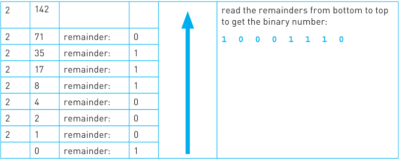

▲ **Figure 1.1** 

We end up with an 8-bit binary number which is the same as that found by Method 1. 

## **Example 2** 

Consider the conversion of the denary number, 59, into binary: 

## Method 1 

The denary number 59 is made up of 32 + 16 + 8 + 2 + 1 (that is, 59 – 32 = 27; 27 – 16 = 11; 11 – 8 = 3; 3 – 2 = 1; 1 – 1 = 0; in each stage, subtract the largest possible power of 2 and keep doing this until the value 0 is reached.  This will give us the following 8-bit binary number: 

|128|64|32|16|8|4|2|1|
|---|---|---|---|---|---|---|---|
|0|0|1|1|1|0|1|1|

## Method 2 

This method involves successive division by 2. Start with the denary number, 59, and divide it by 2. Write the result of the division including the remainder (even if it is 0) under the 59 (that is, 59 ÷ 2 = 29 remainder 1); then divide again by 2 (that is, 29 ÷ 2 = 14 remainder 1) and keep dividing until the result is zero. Finally write down all the remainders in reverse order: 

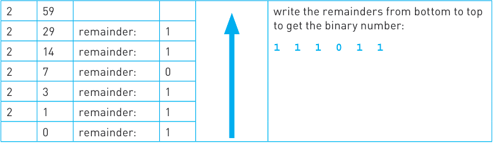

▲ **Figure 1.1b** 

5 

If we want to show this as an 8-bit binary number (as shown in Method 1), we now simply add two 0’s from the left-hand side to give the result: 0 0 1 1 1 0 1 1. The two results from both methods clearly agree. 

Both the above examples use 8-bit binary numbers. This third example shows how the method can still be used for any size of binary number; in this case a 16-bit binary number. 

## **Example 3** 

Consider the conversion of the denary number, 35 000, into a 16-bit binary number: 

## Method 1 

The denary number 35 000 is made up of 32 768 + 2048 + 128 + 32 + 16 + 8 (that is, 35 000 – 32 768 = 2232; 2232 – 2048 = 184; 184 – 128 = 56; 56 – 32 = 24; 24 – 16 = 8; 8 – 8 = 0; in each stage, subtract the largest possible power of 2 and keep doing this until the value 0 is reached.  This will give us the following 16-bit binary number: 

|Method 1 The denary number 35 000 is made up of32 768+2048+128+32+16+8(that is, 35 000 –32 768= 2232; 2232 –2048= 184; 184 –128= 56; 56 –32= 24; 24 –16= 8; 8 –8= 0; in each stage, subtract the largest possible power of 2 and keep doing this until the value 0 is reached.  This will give us the following 16-bit binary number:|Method 1 The denary number 35 000 is made up of32 768+2048+128+32+16+8(that is, 35 000 –32 768= 2232; 2232 –2048= 184; 184 –128= 56; 56 –32= 24; 24 –16= 8; 8 –8= 0; in each stage, subtract the largest possible power of 2 and keep doing this until the value 0 is reached.  This will give us the following 16-bit binary number:|Method 1 The denary number 35 000 is made up of32 768+2048+128+32+16+8(that is, 35 000 –32 768= 2232; 2232 –2048= 184; 184 –128= 56; 56 –32= 24; 24 –16= 8; 8 –8= 0; in each stage, subtract the largest possible power of 2 and keep doing this until the value 0 is reached.  This will give us the following 16-bit binary number:|Method 1 The denary number 35 000 is made up of32 768+2048+128+32+16+8(that is, 35 000 –32 768= 2232; 2232 –2048= 184; 184 –128= 56; 56 –32= 24; 24 –16= 8; 8 –8= 0; in each stage, subtract the largest possible power of 2 and keep doing this until the value 0 is reached.  This will give us the following 16-bit binary number:|Method 1 The denary number 35 000 is made up of32 768+2048+128+32+16+8(that is, 35 000 –32 768= 2232; 2232 –2048= 184; 184 –128= 56; 56 –32= 24; 24 –16= 8; 8 –8= 0; in each stage, subtract the largest possible power of 2 and keep doing this until the value 0 is reached.  This will give us the following 16-bit binary number:|Method 1 The denary number 35 000 is made up of32 768+2048+128+32+16+8(that is, 35 000 –32 768= 2232; 2232 –2048= 184; 184 –128= 56; 56 –32= 24; 24 –16= 8; 8 –8= 0; in each stage, subtract the largest possible power of 2 and keep doing this until the value 0 is reached.  This will give us the following 16-bit binary number:|Method 1 The denary number 35 000 is made up of32 768+2048+128+32+16+8(that is, 35 000 –32 768= 2232; 2232 –2048= 184; 184 –128= 56; 56 –32= 24; 24 –16= 8; 8 –8= 0; in each stage, subtract the largest possible power of 2 and keep doing this until the value 0 is reached.  This will give us the following 16-bit binary number:|Method 1 The denary number 35 000 is made up of32 768+2048+128+32+16+8(that is, 35 000 –32 768= 2232; 2232 –2048= 184; 184 –128= 56; 56 –32= 24; 24 –16= 8; 8 –8= 0; in each stage, subtract the largest possible power of 2 and keep doing this until the value 0 is reached.  This will give us the following 16-bit binary number:|Method 1 The denary number 35 000 is made up of32 768+2048+128+32+16+8(that is, 35 000 –32 768= 2232; 2232 –2048= 184; 184 –128= 56; 56 –32= 24; 24 –16= 8; 8 –8= 0; in each stage, subtract the largest possible power of 2 and keep doing this until the value 0 is reached.  This will give us the following 16-bit binary number:|Method 1 The denary number 35 000 is made up of32 768+2048+128+32+16+8(that is, 35 000 –32 768= 2232; 2232 –2048= 184; 184 –128= 56; 56 –32= 24; 24 –16= 8; 8 –8= 0; in each stage, subtract the largest possible power of 2 and keep doing this until the value 0 is reached.  This will give us the following 16-bit binary number:|Method 1 The denary number 35 000 is made up of32 768+2048+128+32+16+8(that is, 35 000 –32 768= 2232; 2232 –2048= 184; 184 –128= 56; 56 –32= 24; 24 –16= 8; 8 –8= 0; in each stage, subtract the largest possible power of 2 and keep doing this until the value 0 is reached.  This will give us the following 16-bit binary number:|Method 1 The denary number 35 000 is made up of32 768+2048+128+32+16+8(that is, 35 000 –32 768= 2232; 2232 –2048= 184; 184 –128= 56; 56 –32= 24; 24 –16= 8; 8 –8= 0; in each stage, subtract the largest possible power of 2 and keep doing this until the value 0 is reached.  This will give us the following 16-bit binary number:|Method 1 The denary number 35 000 is made up of32 768+2048+128+32+16+8(that is, 35 000 –32 768= 2232; 2232 –2048= 184; 184 –128= 56; 56 –32= 24; 24 –16= 8; 8 –8= 0; in each stage, subtract the largest possible power of 2 and keep doing this until the value 0 is reached.  This will give us the following 16-bit binary number:|Method 1 The denary number 35 000 is made up of32 768+2048+128+32+16+8(that is, 35 000 –32 768= 2232; 2232 –2048= 184; 184 –128= 56; 56 –32= 24; 24 –16= 8; 8 –8= 0; in each stage, subtract the largest possible power of 2 and keep doing this until the value 0 is reached.  This will give us the following 16-bit binary number:|Method 1 The denary number 35 000 is made up of32 768+2048+128+32+16+8(that is, 35 000 –32 768= 2232; 2232 –2048= 184; 184 –128= 56; 56 –32= 24; 24 –16= 8; 8 –8= 0; in each stage, subtract the largest possible power of 2 and keep doing this until the value 0 is reached.  This will give us the following 16-bit binary number:|Method 1 The denary number 35 000 is made up of32 768+2048+128+32+16+8(that is, 35 000 –32 768= 2232; 2232 –2048= 184; 184 –128= 56; 56 –32= 24; 24 –16= 8; 8 –8= 0; in each stage, subtract the largest possible power of 2 and keep doing this until the value 0 is reached.  This will give us the following 16-bit binary number:|
|---|---|---|---|---|---|---|---|---|---|---|---|---|---|---|---|
|32768 16384 8192 4096 2048 1024 512 256 128 64 32 16 8 4 2 1||||||||||||||||
|1|0|0|0|1|0|0|0|1|0|1|1|1|0|0|0|

## Method 2 

This method involves successive division by 2. Start with the denary number, 35000, and divide it by 2. Write the result of the division including the remainder (even if it is 0) under the 35 000 (that is, 35 000 ÷ 2 = 17 500 remainder 0); then divide again by 2 (that is, 17 500 ÷ 2 = 8750 remainder 0) and keep dividing until the result is zero. Finally write down all the remainders in reverse order: 

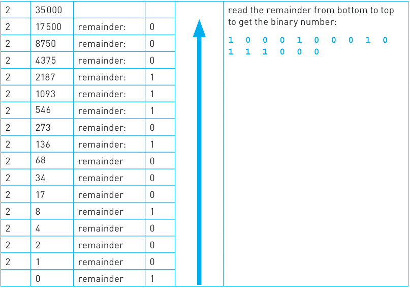

▲ **Figure 1.1c** 

6 

## **Activity 1.2** 

|**Activity 1.2**|**Activity 1.2**|**Activity 1.2**||||||
|---|---|---|---|---|---|---|---|
|Convert the following denary|||numbers into binary (using both||||methods):|
|**a**4 1|**d**|1 0 0|**g**|1 4 4|**j**|2 5 5|**m**4 0 9 5|
|**b**6 7|**e**|1 1 1|**h**|1 8 9|**k**|3 3 0 0 0|**n**1 6 4 0 0|
|**c**8 6|**f**|1 2 7|**i**|2 0 0|**l**|8 8 8|**o**6 2 3 0 7|

## **The hexadecimal system** 

The **hexadecimal number system** is very closely related to the binary system. Hexadecimal (sometimes referred to as simply ‘hex’) is a base 16 system and therefore needs to use 16 different ‘digits’ to represent each value. 

Because it is a system based on 16 different digits, the numbers 0 to 9 and the letters A to F are used to represent each hexadecimal (hex) digit. A in hex = 10 in denary, B = 11, C = 12, D = 13, E = 14 and F = 15. 

Using the same method as for denary and binary, this gives the headings 16[0] , 16[1] , 16[2] , 16[3] , and so on. The typical headings for a hexadecimal number with five digits would be: 

|**(164)** **65 536**|**(163)** **4096**|**(162)** **256**|**(161)** **16**|**(160)** **1**|
|---|---|---|---|---|
|2|1|F|3|A|

A typical example of hex is 2 1 F 3 A. 

Since 16 = 2[4] this means that FOUR binary digits are equivalent to each hexadecimal digit. The following table summarises the link between binary, hexadecimal and denary: 

## ▼ **Table 1.1** 

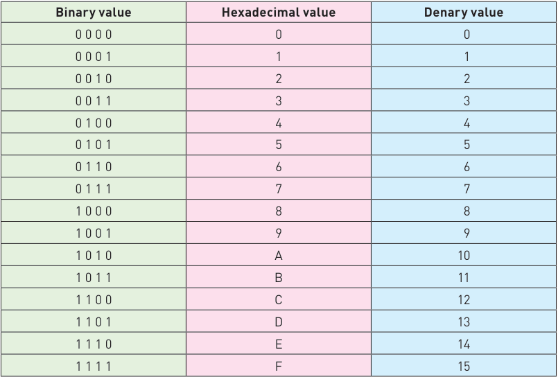

7 

## **Converting from binary to hexadecimal and from hexadecimal to binary** 

Converting from binary to hexadecimal is a fairly easy process. Starting from the right and moving left, split the binary number into groups of 4 bits. If the last group has less than 4 bits, then simply fill in with 0s from the left. Take each group of 4 bits and convert it into the equivalent hexadecimal digit using Table 1.1. Look at the following two examples to see how this works. 

## **Example 1** 

1 0 1 1 1 1 1 0 0 0 0 1 

First split this up into groups of 4 bits: 

1 0 1 1          1 1 1 0            0 0 0 1 

Then, using Table 1.1, find the equivalent hexadecimal digits: 

B                    E                     1 

## **Example 2** 

1 0 0 0 0 1 1 1 1 1 1 1 0 1 

First split this up into groups of 4 bits: 

1 0               0 0 0 1            1 1 1 1            1 1 0 1 

The left group only contains 2 bits, so add in two 0s: 

0 0 1 0         0 0 0 1            1 1 1 1            1 1 0 1 

Now use Table 1.1 to find the equivalent hexadecimal digits: 

2                   1                     F                    D 

8 

**Activity 1.3** Convert the following binary numbers into hexadecimal: **a** 1  1  0  0  0  0  1  1 **b** 1  1  1  1  0  1  1  1 **c** 1  0  0  1  1  1  1  1  1  1 **d** 1  0  0  1  1  1  0  1  1  1  0 **e** 0  0  0  1  1  1  1  0  0  0  0  1 **f** 1  0  0  0  1  0  0  1  1  1  1  0 **g** 0  0  1  0  0  1  1  1  1  1  1  1  0 **h** 0  1  1  1  0  1  0  0  1  1  1  0  0 **i** 1  1  1  1  1  1  1  1  0  1  1  1  1  1  0  1 **j** 0  0  1  1  0  0  1  1  1  1  0  1  0  1  1  1  0 

Converting from hexadecimal to binary is also very straightforward. Using the data in Table 1.1, simply take each hexadecimal digit and write down the 4-bit code which corresponds to the digit. 

## **Example 3** 

4                        5                          A 

Using Table 1.1, find the 4 bit code for each digit: 

0  1  0  0          0  1  0  1               1  0  1  0 

Put the groups together to form the binary number: 

0  1  0  0  0  1  0  1  1  0  1  0 

## **Example 4** 

B                          F                       0                          8 Again just use Table 1.1: 1  0  1  1             1  1  1  1            0  0  0  0             1  0  0  0 Then put all the digits together: 1  0  1  1  1  1  1  1  0  0  0  0  1  0  0  0 

9 

## **Activity 1.4** 

Convert the following hexadecimal numbers into binary: **a** 6  C **f** B  A  6 **b** 5  9 **g** 9  C  C **c** A  A **h** 4  0  A  A **d** A  0  0 **i** D  A  4  7 **e** 4  0  E **j** 1  A  B  0 

## **Converting from hexadecimal to denary and from denary to hexadecimal** 

To _**convert hexadecimal numbers into denary**_ involves the value headings of each hexadecimal digit; that is, 4096, 256, 16 and 1. 

Take each of the hexadecimal digits and multiply it by the heading values. Add all the resultant totals together to give the denary number. Remember that the hex digits A → F need to be first converted to the values 10 → 15 before carrying out the multiplication. This is best shown by two examples: 

## **Example 1** 

Convert the hexadecimal number, 4 5 A, into denary. 

First of all we have to multiply each hex digit by its heading value: 

256                              16                           1 4 5 A (4 × 256 = 1024)   (5 × 16 = 80)   (10 × 1 = 10)           (NOTE:  A = 10) 

Then we have to add the three totals together (1024 + 80 + 10) to give the denary number: 

1  1  1  4 

## **Example 2** 

Convert the hexadecimal number, C 8 F, into denary. 

First of all we have to multiply each hex digit by its heading value: 

256                              16                             1 C                                 8                              F (12 × 256 = 3072)   (8 × 16 = 128)   (15 × 1 = 15)     (NOTE:  C = 12, F = 15) 

Then we have to add the three totals together (3072 + 128 + 15) to give the denary number: 

3  2  1  5 

## **Activity 1.5** 

Convert the following hexadecimal numbers into denary: **a** 6  B **f** A  0  1 **b** 9  C **g** B  B  4 **c** 4  A **h** C  A  8 **d** F  F **i** 1  2  A  E **e** 1  F  F **j** A  D  8  9 

To _**convert from denary to hexadecimal**_ involves successive division by 16 until the value “0” is reached. This is best shown by two examples: 

## **Example 1** 

Convert the denary number, 2004, into hexadecimal. 

This method involves successive division by 16 until the value 0 is reached. We start by dividing the number 2004 by 16. The result of the division including the remainder (even if it is 0) is written under 2004 and then further divisions by 16 are carried out (that is, 2004 ÷ 16 = 125 remainder 4; 125 ÷ 16 = 7 remainder 13; 7 ÷ 16 = 0 remainder 7). The hexadecimal number is obtained from the remainders written in reverse order: 

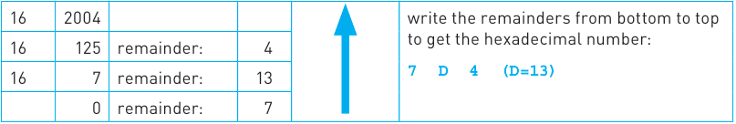

- **Figure 1.2a** 

## **Example 2** 

Convert the denary number, 8463, into hexadecimal. 

We start by dividing the number 8463 by 16. The result of the division including the remainder (even if it is 0) is written under 8463 and then further divisions by 16 are carried out (that is, 8463 ÷ 16 = 528 remainder 15; 528 ÷ 16 = 33 remainder 0; 33 ÷ 16 = 2 remainder 1; 2 ÷ 16 = 0 remainder 2). The hexadecimal number is obtained from the remainders written in reverse order: 

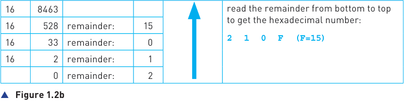

## **Activity 1.6** 

|**Activity 1.6**|**Activity 1.6**||
|---|---|---|
|Convert the following denary numbers into||hexadecimal:|
|**a**9  8|**f**|1  0  0  0|
|**b**2  2  7|**g**|2  6  3  4|
|**c**4  9  0|**h**|3  7  4  3|
|**d**5  1  1|**i**|4  0  0  7|
|**e**8  2  6|**j**|5  0  0  0|

### 1.1.3 Use of the hexadecimal system

As we have seen, a computer can only work with binary data. Whilst computer scientists can work with binary, they find hexadecimal to be more convenient to use. This is because one hex digit represents four binary digits. A complex binary number, such as 1101001010101111 can be written in hex as D2AF. The hex number is far easier for humans to remember, copy and work with. This section reviews four uses of the hexadecimal system: 

- **»** error codes 

- **»** MAC addresses 

- **»** IPv6 addresses 

- **»** HTML colour codes 

The information in this section gives the reader sufficient grounding in each topic at this level. Further material can be found by searching the internet, but be careful that you don’t go off at a tangent. 

## **Error codes** 

**Error codes** are often shown as hexadecimal values. These numbers refer to the memory location of the error and are usually automatically generated by the computer. The programmer needs to know how to interpret the hexadecimal error codes. Examples of error codes from a Windows system are shown below: 

> **Find out more:** Another method used to trace errors during program development is to use memory dumps, where the memory contents are printed out either on screen or using a printer. Find examples of memory dumps and find out why these are a very useful tool for program developers. 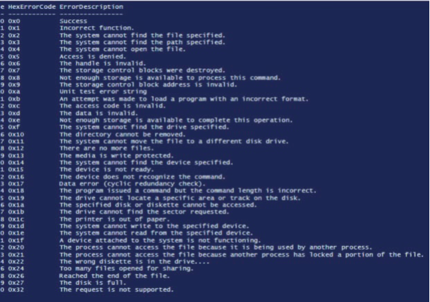 ▲ **Figure 1.3** Example of error codes 12 _1.1 Number systems_

## **Media Access Control (MAC) addresses** 

**Media Access Control (MAC) address** refers to a number which uniquely identifies a device on a network. The MAC address refers to the network interface card (NIC) which is part of the device. The MAC address is rarely changed so that a particular device can always be identified no matter where it is. 

A MAC address is usually made up of 48 bits which are shown as 6 groups of two hexadecimal digits (although 64-bit addresses also exist): 

NN – NN – NN – DD – DD – DD 

## or 

NN:NN:NN:DD:DD:DD 

where the first half (NN – NN – NN) is the identity number of the manufacturer of the device and the second half (DD – DD – DD) is the serial number of the device. For example: 

## **Link** 

Refer to Chapter 3 for more detail on MAC addresses. 

> **Find out more:** Try to find the MAC addresses of some of your own devices (e.g. mobile phone and tablet) and those found in the school.

## **Link** 

Refer to Chapter 3 for more detail on IP addresses. 

00 – 1C – B3 – 4F – 25 – FE is the MAC address of a device produced by the Apple Corporation (code: 001CB3) with a serial number of: 4F25FE. Very often lowercase hexadecimal letters are used in the MAC address: 00-1c-b3-4f-25-fe. Other manufacturer identification numbers include: 

00 – 14 – 22  which identifies devices made by Dell 

00 – 40 – 96  which identifies devices made by Cisco 

00 – a0 – c9  which identifies devices made by Intel, and so on. 

## **Internet Protocol (IP) addresses** 

Each device connected to a network is given an address known as the **Internet Protocol (IP) address** . An IPv4 address is a 32-bit number written in denary or hexadecimal form: e.g. 109.108.158.1 (or 77.76.9e.01 in hex). IPv4 has recently been improved upon by the adoption of IPv6. An IPv6 address is a 128-bit number broken down into 16-bit chunks, represented by a hexadecimal number. For example: 

a8fb:7a88:fff0:0fff:3d21:2085:66fb:f0fa 

Note IPv6 uses a colon (:) rather than a decimal point (.) as used in IPv4. 

> **Find out more:** Try to find the IPv4 and IPv6 addresses of some of your own devices (e.g. mobile phone and tablet) and those found in the school.

## **HyperText Mark-up Language (HTML) colour codes** 

**HyperText Mark-up Language (HTML)** is used when writing and developing web pages. HTML isn’t a programming language but is simply a mark-up language. A mark-up language is used in the processing, definition and presentation of text (for example, specifying the colour of the text). 

HTML uses **<tags>** which are used to bracket a piece of text for example, <h1> and </h1> surround a top-level heading. Whatever is between the two tags has been defined as heading level 1. Here is a short example of HTML code: 

<h1 style="color:#FF0000;">This is a red heading</h1> 

<h2 style="color:#00FF00;">This is a green heading</h2> <h3 style="color:#0000FF;">This is a blue heading</h3> 

▲ **Figure 1.4** 

HTML is often used to represent colours of text on the computer screen. All colours can be made up of different combinations of the three primary colours (red, green and blue). The different intensity of each colour (red, green and blue) is determined by its hexadecimal value. This means different hexadecimal values represent different colours. For example: 

**»** # FF 00 00  represents primary colour red 

**»** # 00 FF 00 represents primary colour green 

**»** # 00 00 FF represents primary colour blue 

**»** # FF 00 FF represents fuchsia 

**»** # FF 80 00 represents orange 

**»** # B1 89 04 represents a tan colour, 

and so on producing almost any colour the user wants. The following diagrams show the various colours that can be selected by altering the hex ‘intensity’ of red, green and blue primary colours. The colour _**‘FF9966’**_ has been chosen as an example: 

**FF 99 66** 

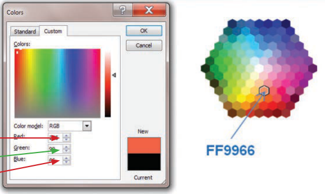

▲ **Figure 1.5** Examples of HTML hex colour codes 

The # symbol always precedes hexadecimal values in HTML code. The colour codes are always six hexadecimal digits representing the red, green and blue components. There are a possible 256 values for red, 256 values for green and 256 values for blue giving a total of 256 × 256 × 256 (i.e. 16 777 216) possible colours. 

## **Activity 1.7** 

**a** Red 53 **b** Red 201 **c** Red 12 Green 55 Green 122 Green 111 Blue 139 Blue 204 Blue 81 

### 1.1.4 Addition of binary numbers

This section will look at the addition of two 8-bit positive binary numbers. Note the following key facts when carrying out _**addition**_ of two binary digits: 

|**binary addition**|**carry**|**sum**|
|---|---|---|
|0+0|0|0|
|0+1|0|1|
|1+0|0|1|
|1+1|1|0|

This can then be extended to consider the addition of three binary digits: 

|**binary digit**|**carry**|**sum**|
|---|---|---|
|0+0+0|0|0|
|0+0+1|0|1|
|0+1+0|0|1|
|0+1+1|1|0|
|1+0+0|0|1|
|1+0+1|1|0|
|1+1+0|1|0|
|1+1+1|1|1|

For comparison: if we add 7 and 9 in denary the result is: carry = 1 and sum = 6; if we add 7, 9 and 8 the result is: carry = 2 and sum = 4, and so on. 

## **Advice** 

Here’s a quick recap on the role of carry and sum. If we want to add the numbers 97 and 64 in decimal, we: 

l add the numbers in the right hand column first 

l if the sum is greater than 9 then we carry a value to the next column 

l we continue moving left, adding any carry values to each column until we are finished. For instance: 

9 7 +  6 4 

1 1 CARRY VALUES 

1 6 1 SUM VALUES 

Adding in binary follows the same rules except that we carry whenever the sum is greater than 1. 

## **Example 1** 

## Add 00100111 + 01001010 

We will set this out showing carry and sum values: 

0 0 1 0 0 1 1 1 column 1: 1 + 0 = 1 no carry + column 2: 1 + 1 = 0 carry 1 0 1 0 0 1 0 1 0 column 3: 1 + 0 + 1 = 0 carry 1 column 4: 0 + 1 + 1 = 0 carry 1 **1 1 1** ~~**c**~~ **arry values** column 5: 0 + 0 + 1 = 1 no carry **0 1 1 1 0 0 0 1 sum values** column 6: 1 + 0  = 1 no carry column 7: 0 + 1  = 1 no carry Answer: **01110001** column 8: 0 + 0  = 0 no carry 

## **Example 2** 

- **a** Convert 126 and 62 into binary. 

- **b** Add the two binary values in part **a** and check the result matches the addition of the two denary numbers 

**a** 126 = 0 1 1 1 1 1 1 0     and      62 = 0 0 1 1 1 1 1 0 column 1: 0 + 0 = 0 no carry **b** 0 1 1 1 1 1 1 0 column 2: 1 + 1 = 0 carry 1 + column 3: 1 + 1 + 1 = 1 carry 1 0 0 1 1 1 1 1 0 column 4: 1 + 1 + 1 = 1 carry 1 column 5: 1 + 1 + 1 = 1 carry 1 **1 1 1 1 1 1 carry values** column 6: 1 + 1 + 1 = 1 carry 1 column 7: 1 + 0 + 1 = 0 carry 1 **1 0 1 1 1 1 0 0 s** ~~**u**~~ **m values** column 8: 0 + 0 + 1 = 1 no carry 

Answer: **10111100** 

1 0 1 1 1 1 0 0 has the equivalent denary value of 128 + 32 + 16 + 8 + 4 = 188 which is the same as 126 + 62. 

## **Activity 1.8** 

|Carry out the following binary additions:|||
|---|---|---|
|**a**0 0 0 1 1 1 0 1 + 0 1 1 0 0 1 1 0|**f**|0 0 1 1 1 1 0 0 + 0 1 1 1 1 0 1 1|
|**b**0 0 1 0 0 1 1 1 + 0 0 1 1 1 1 1 1|**g**|0 0 1 1 1 1 1 1 + 0 0 1 1 1 1 1 1|
|**c**0 0 1 0 1 1 1 0 + 0 1 0 0 1 1 0 1|**h**|0 0 1 1 0 0 0 1 + 0 0 1 1 1 1 1 1|
|**d**0 1 1 1 0 1 1 1 + 0 0 1 1 1 1 1 1|**i**|0 1 1 1 1 1 1 1 + 0 1 1 1 1 1 1 1|
|**e**0 0 1 1 1 1 0 0 + 0 0 1 1 0 0 1 1|**j**|1 0 1 0 0 0 1 0 + 0 0 1 1 1 0 1 1|

## **Activity 1.9** 

Convert the following denary numbers into binary and then carry out the binary addition of the two numbers and check your answer against the equivalent denary sum: 

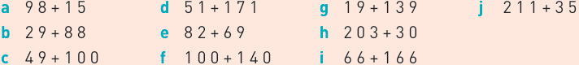

## **Overflow** 

Now consider the following example: 

## **Example 3** 

Add 0 1 1 0 1 1 1 0 and 1 1 0 1 1 1 1 0 (using 8 bits) 

0 1 1 0 1 1 1 0 + 1 1 0 1 1 1 1 0 9[th] bit **1 1 1 1 1 1 1** ~~**c**~~ **arry ) 1 0 1 0 0 1 1 0 0 sum )** 

This addition has generated a 9th bit. The 8 bits of the answer are 0 1 0 0 1 1 0 0 – this gives the denary value (64 + 8 + 4) of 76 which is incorrect because the denary value of the addition is 110 + 222 = 332. 

The maximum denary value of an 8-bit binary number is 255 (which is 2[8] – 1). The generation of a 9th bit is a clear indication that the sum has exceeded this value. This is known as an **overflow error** and in this case is an indication that a number is too big to be stored in the computer using 8 bits. 

The greater the number of bits which can be used to represent a number then the larger the number that can be stored. For example, a 16-bit register would allow a maximum denary value of 65 535 (i.e. 2[16] – 1) to be stored, a 32-bit register would allow a maximum denary value of 4 294 967 295 (i.e. 2[32] – 1), and so on. 

## **Activity 1.10** 

- **1** Convert the following pairs of denary numbers to 8-bit binary numbers and then add the binary numbers. Comment on your answers in each case: **a** 89 + 175 **b** 168 + 99 **c** 88 + 215 

- **2** Carry out the following 16-bit binary additions and comment on your answers: **a** 0111 1111 1111 0001 + 0101 1111 0011 1001 **b** 1110 1110 0000 1011 + 1111 1101 1101 1001 

### 1.1.5 Logical binary shifts

Computers can carry out a **logical shift** on a sequence of binary numbers. The logical shift means moving the binary number to the _**left**_ or to the _**right**_ . Each shift _**left**_ is equivalent to _**multiplying**_ the binary number by 2 and each shift _**right**_ is equivalent to _**dividing**_ the binary number by 2. 

As bits are shifted, any empty positions are replaced with a zero – see examples below. There is clearly a limit to the number of shifts which can be carried out if the binary number is stored in an 8-bit register. Eventually after a number of shifts the register would only contain zeros. For example, if we shift 01110000 (denary value 112) five places left (the equivalent to multiplying by 2[5] , i.e. 32), in an 8-bit register we would end up with 00000000. This makes it seem as though 112 × 32 = 0! This would result in the generation of an error message. 

## **Example 1** 

The denary number 21 is 00010101 in binary. If we put this into an 8-bit register: 

The left-most bit is often referred to as the MOST SIGNIFICANT BIT 

128 64 32 16 8 4 2 1 0 0 0 1 0 1 0 1 

If we now shift the bits in this register one place to the left, we obtain: 

128 64 32 16 8 4 2 1 Note how the empty right-most bit position 0 0 1 0 1 0 1 0 is now filled with a 0 

The left-most bit is now lost following a The value of the binary bits is now 21 × 2[1] i.e. 42. We can see this is correct if we left shift calculate the denary value of the new binary number 101010 (i.e. 32 + 8 + 2). 

Suppose we now shift the original number two places left: 

|128 64 32 16 8 4 2 1|128 64 32 16 8 4 2 1|128 64 32 16 8 4 2 1|128 64 32 16 8 4 2 1|128 64 32 16 8 4 2 1|128 64 32 16 8 4 2 1|128 64 32 16 8 4 2 1|128 64 32 16 8 4 2 1|
|---|---|---|---|---|---|---|---|
|0|1|0|1|0|1|0|0|

The binary number 1010100 is 84 in denary – this is 21 × 2[2] . 

And now suppose we shift the original number three places left: 

1 0 1 0 1 0 0 0 

The binary number 10101000 is 168 in denary – this is 21 × 2[3] . 

So, let us consider what happens if we shift the original binary number 00010101 four places left: 

|| our places left:| our places left:| our places left:| our places left:| our places left:| our places left:| our places left:| our places left:|
|---|---|---|---|---|---|---|---|---|
||128 64 32 16 8 4 2 1||||||||
|0|0|1|0|1|0|0|0|0|
||||||||||

Losing 1 bit 0 1 0 1 0 0 0 0 following a shift operation will cause an error The left-most 1-bit has been lost. In our 8-bit register the result of 21 × 2[4] is 80 which is clearly incorrect. This error is because we have exceeded the maximum number of left shifts possible using this register. 

## **Example 2** 

The denary number 200 is 11001000 in binary. Putting this into an 8-bit register gives: 

|128 1|64 1|32 0|16 0|8 1|4 0|2 0|1 0|The right-most bit is often referred to as the LEAST|
|---|---|---|---|---|---|---|---|---|
|||||||||SIGNIFICANT BIT|

If we now shift the bits in this register one place to the right: 

Note how the leftmost bit position is now filled with a 0 

|128 64 32 16 8 4 2 1|128 64 32 16 8 4 2 1|128 64 32 16 8 4 2 1|128 64 32 16 8 4 2 1|128 64 32 16 8 4 2 1|128 64 32 16 8 4 2 1|128 64 32 16 8 4 2 1|128 64 32 16 8 4 2 1|
|---|---|---|---|---|---|---|---|
|0|1|1|0|0|1|0|0|

The value of the binary bits is now 200 ÷ 2[1] i.e. 100. We can see this is correct by converting the new binary number 01100100 to denary (64 + 32 + 4). 

Suppose we now shift the original number two places to the right: 

128 64 32 16 8 4 2 1 0 0 1 1 0 0 1 0 

The binary number 00110010 is 50 in denary – this is 200 ÷ 2[2] . 

And suppose we now shift the original number three places to the right: 

Notice the 1-bit from the rightmost bit position is now lost causing an error 

128 64 32 16 8 4 2 1 0 0 0 1 1 0 0 1 

The binary number 00011001 is 25 in denary – this is 200 ÷ 2[3] . Now let us consider what happens if we shift four places right: 

128 64 32 16 8 4 2 1 0 0 0 0 1 1 0 0 

The right-most 1-bit has been lost. In our 8-bit register the result of 200 ÷ 2[4] is 12, which is clearly incorrect. This error is because we have therefore exceeded the maximum number of right shifts possible using this 8-bit register. 

## **Example 3** 

- **a** Write 24 as an 8-bit register. 

- **b** Show the result of a logical shift 2 places to the left. 

- **c** Show the result of a logical shift 3 places to the right. 

|**a** **b** **c**|128 64 32 16 8 4 2 1 0 0 0 1 1 0 0 0 128 64 32 16 8 4 2 1 0 1 1 0 0 0 0 0 24 × 2 2= 96 128 64 32 16 8 4 2 1 0 0 0 0 0 0 1 1 24 ÷ 2 3= 3|128 64 32 16 8 4 2 1 0 0 0 1 1 0 0 0 128 64 32 16 8 4 2 1 0 1 1 0 0 0 0 0 24 × 2 2= 96 128 64 32 16 8 4 2 1 0 0 0 0 0 0 1 1 24 ÷ 2 3= 3|128 64 32 16 8 4 2 1 0 0 0 1 1 0 0 0 128 64 32 16 8 4 2 1 0 1 1 0 0 0 0 0 24 × 2 2= 96 128 64 32 16 8 4 2 1 0 0 0 0 0 0 1 1 24 ÷ 2 3= 3|128 64 32 16 8 4 2 1 0 0 0 1 1 0 0 0 128 64 32 16 8 4 2 1 0 1 1 0 0 0 0 0 24 × 2 2= 96 128 64 32 16 8 4 2 1 0 0 0 0 0 0 1 1 24 ÷ 2 3= 3|128 64 32 16 8 4 2 1 0 0 0 1 1 0 0 0 128 64 32 16 8 4 2 1 0 1 1 0 0 0 0 0 24 × 2 2= 96 128 64 32 16 8 4 2 1 0 0 0 0 0 0 1 1 24 ÷ 2 3= 3|128 64 32 16 8 4 2 1 0 0 0 1 1 0 0 0 128 64 32 16 8 4 2 1 0 1 1 0 0 0 0 0 24 × 2 2= 96 128 64 32 16 8 4 2 1 0 0 0 0 0 0 1 1 24 ÷ 2 3= 3|128 64 32 16 8 4 2 1 0 0 0 1 1 0 0 0 128 64 32 16 8 4 2 1 0 1 1 0 0 0 0 0 24 × 2 2= 96 128 64 32 16 8 4 2 1 0 0 0 0 0 0 1 1 24 ÷ 2 3= 3|128 64 32 16 8 4 2 1 0 0 0 1 1 0 0 0 128 64 32 16 8 4 2 1 0 1 1 0 0 0 0 0 24 × 2 2= 96 128 64 32 16 8 4 2 1 0 0 0 0 0 0 1 1 24 ÷ 2 3= 3|
|---|---|---|---|---|---|---|---|---|
||0|0|0|0|0|0|1|1|

## **Example 4** 

**a** Convert 19 and 17 into binary. 

- **b** Carry out the binary addition of the two numbers. 

- **c** Shift your result from part **b** two places left and comment on the result. 

- **d** Shift your result from part **b** three places right and comment on the result. 

|**a**|128 64 32 16 8 4 2 1 0 0 0 1 0 0 1 1 19 0 0 0 1 0 0 0 1 17|128 64 32 16 8 4 2 1 0 0 0 1 0 0 1 1 19 0 0 0 1 0 0 0 1 17|128 64 32 16 8 4 2 1 0 0 0 1 0 0 1 1 19 0 0 0 1 0 0 0 1 17|128 64 32 16 8 4 2 1 0 0 0 1 0 0 1 1 19 0 0 0 1 0 0 0 1 17|128 64 32 16 8 4 2 1 0 0 0 1 0 0 1 1 19 0 0 0 1 0 0 0 1 17|128 64 32 16 8 4 2 1 0 0 0 1 0 0 1 1 19 0 0 0 1 0 0 0 1 17|128 64 32 16 8 4 2 1 0 0 0 1 0 0 1 1 19 0 0 0 1 0 0 0 1 17|128 64 32 16 8 4 2 1 0 0 0 1 0 0 1 1 19 0 0 0 1 0 0 0 1 17|
|---|---|---|---|---|---|---|---|---|
||0|0|0|1|0|0|1|1|
||0|0|0|1|0|0|0|1|

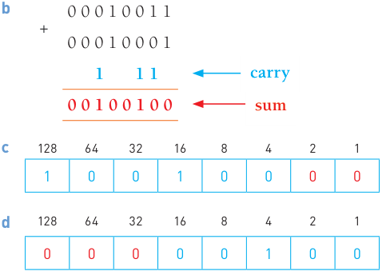

In **c** the result is 36 × 2[2] = 144 (which is correct). 

In **d** the result of the right shift gives a value of 4, which is incorrect since 36 ÷ 2[3] is not 4; therefore, the number of possible right shifts has been exceeded. You can also see that a 1 has been lost from the original binary number, which is another sign that there have been too many right shifts. 

## **Activity 1.11** 

- **1 a** Write down the denary value of the following binary number. 

   - **b** Shift the binary number three places to the right and comment on your result. 

   - **c** Write down the denary value of the following binary number. 

0 0 0 0 1 1 1 1 

   - **d** Shift the binary number four places to the left and comment on your result. 

- **2 a** Convert 29 and 51 to 8-bit binary numbers. 

   - **b** Add the two binary numbers in part **a** . 

   - **c** Shift the result in part **b** three places to the right. 

   - **d** Convert 75 to an 8-bit binary number. 

   - **e** Add the two binary numbers from parts **c** and **d** . 

   - **f** Shift your result from part **e** one place to the left. 

### 1.1.6 Two’s complement (binary numbers)

Up until now, we have assumed all binary numbers are positive integers. To allow the possibility of representing negative integers we make use of **two’s complement** . In this section we will again assume 8-bit registers are being used. Only one minor change to the binary headings needs to be introduced here: 

In two’s complement the left-most bit is changed to a negative value. For instance, for an 8-bit number, the value 128 is now changed to −128, but all the other headings remain the same. This means the new range of possible numbers is: −128 (10000000) to +127 (01111111). 

It is important to realise when applying two’s complement to a binary number that the left-most bit always determines the sign of the binary number. A 1-value in the left-most bit indicates a negative number and a 0-value in the leftmost bit indicates a positive number (for example, 00110011 represents 51 and 11001111 represents −49). 

## **Writing positive binary numbers in two’s complement format** 

## **Example 1** 

The following two examples show how we can write the following positive binary numbers in the two’s complement format 19 and 4: 

|−128 64 32 16 8 4 2 1|−128 64 32 16 8 4 2 1|−128 64 32 16 8 4 2 1|−128 64 32 16 8 4 2 1|−128 64 32 16 8 4 2 1|−128 64 32 16 8 4 2 1|−128 64 32 16 8 4 2 1|−128 64 32 16 8 4 2 1|
|---|---|---|---|---|---|---|---|
|0|0|0|1|0|0|1|1|
|0|0|0|0|0|1|0|0|

As you will notice, for positive binary numbers, it is no different to what was done in Section 1.1.2. 

## **Converting positive denary numbers to binary numbers in the two’s complement format** 

If we wish to convert a positive denary number to the two’s complement format, we do exactly the same as in Section 1.1.2: 

## **Example 2** 

Convert **a** 38 **b** 125 to 8-bit binary numbers using the two’s complement format. **a** Since this number is positive, we must have a zero in the –128 column. It is then a simple case of putting 1-values into their correct positions to make up the value of 38: 

|−128 64 32 16 8 4 2 1|−128 64 32 16 8 4 2 1|−128 64 32 16 8 4 2 1|−128 64 32 16 8 4 2 1|−128 64 32 16 8 4 2 1|−128 64 32 16 8 4 2 1|−128 64 32 16 8 4 2 1|−128 64 32 16 8 4 2 1|
|---|---|---|---|---|---|---|---|
|0|0|1|0|0|1|1|0|

**b** Again, since this is a positive number, we must have a zero in the –128 column. As in part **a** , we then place 1-values in the appropriate columns to make up the value of 125: 

|−128 64 32 16 8 4 2 1|−128 64 32 16 8 4 2 1|−128 64 32 16 8 4 2 1|−128 64 32 16 8 4 2 1|−128 64 32 16 8 4 2 1|−128 64 32 16 8 4 2 1|−128 64 32 16 8 4 2 1|−128 64 32 16 8 4 2 1|
|---|---|---|---|---|---|---|---|
|0|1|1|1|1|1|0|1|

## **Converting positive binary numbers in the two’s complement format to positive denary numbers** 

## **Example 3** 

Convert 01101110 in two’s complement binary into denary: 

|−128 64 32 16 8 4 2 1|−128 64 32 16 8 4 2 1|−128 64 32 16 8 4 2 1|−128 64 32 16 8 4 2 1|−128 64 32 16 8 4 2 1|−128 64 32 16 8 4 2 1|−128 64 32 16 8 4 2 1|−128 64 32 16 8 4 2 1|
|---|---|---|---|---|---|---|---|
|0|1|1|0|1|1|1|0|

As in Section 1.1.2, each time a 1 appears in a column, the column value is added to the total. For example, the binary number (01101110) above has the following denary value: 64 + 32 + 8 + 4 +2 = 110. 

## **Example 4** 

Convert 00111111 in two’s complement binary into denary: 

|−128 64 32 16 8 4 2 1|−128 64 32 16 8 4 2 1|−128 64 32 16 8 4 2 1|−128 64 32 16 8 4 2 1|−128 64 32 16 8 4 2 1|−128 64 32 16 8 4 2 1|−128 64 32 16 8 4 2 1|−128 64 32 16 8 4 2 1|
|---|---|---|---|---|---|---|---|
|0|0|1|1|1|1|1|1|

As above, each time a 1 appears in a column, the column value is added to the total. For example, the binary number (00111111) above has the following denary value: 32 + 16 + 8 + 4 +2 + 1 = 63. 

## **Activity 1.12** 

|**1**|Convert the|Convert the|Convert the|following positive denary numbers|following positive denary numbers|following positive denary numbers|following positive denary numbers|following positive denary numbers|following positive denary numbers|following positive denary numbers|following positive denary numbers|following positive denary numbers|following positive denary numbers|following positive denary numbers|into 8-bit binary numbers in the|into 8-bit binary numbers in the|into 8-bit binary numbers in the|into 8-bit binary numbers in the|into 8-bit binary numbers in the|
|---|---|---|---|---|---|---|---|---|---|---|---|---|---|---|---|---|---|---|---|
||two’s||complement format:|||||||||||||||||
||**a**39||||**c**|88|||**e**||111|||||**g**|77|**i**|49|
||**b**66||||**d**|102|||**f**||125|||||**h**|20|**j**|56|
|**2**|Convert the|||following binary||||numbers (written|||||||in two’s complement||||format)|
||into positive|||denary||numbers:||||||||||||||
||||−128||64|32||16||8|||4||2||1|||
||**a**||0||1|0||1||0|||1||0||1|||
||**b**||0||0|1||1||0|||0||1||1|||
||**c**||0||1|0||0||1|||1||0||0|||
||**d**||0||1|1||1||1|||1||1||0|||
||**e**||0||0|0||0||1|||1||1||1|||
||**f**||0||1|1||1||1|||1||0||1|||
||**g**||0||1|0||0||0|||0||0||1|||
||**h**||0||0|0||1||1|||1||1||0|||
||**i**||0||1|1||1||0|||0||0||1|||
||**j**||0||1|1||1||1|||0||0||0|||

**Writing negative binary numbers in two’s complement format and converting to denary** 

## **Example 1** 

The following three examples show how we can write negative binary numbers in the two’s complement format: 

| two’s complement format:| two’s complement format:| two’s complement format:| two’s complement format:| two’s complement format:| two’s complement format:| two’s complement format:| two’s complement format:|
|---|---|---|---|---|---|---|---|
|−128 64 32 16 8 4 2 1||||||||
|1|0|0|1|0|0|1|1|

By following our normal rules, each time a 1 appears in a column, the column value is added to the total. So, we can see that in denary this is: −128 + 16 + 2 + 1 = −109. 

−128 64 32 16 8 4 2 1 1 1 1 0 0 1 0 0 

Similarly, in denary this number is −128 + 64 + 32 + 4 = −28. 

||−128|64|32|16|8||4|2|1||
|---|---|---|---|---|---|---|---|---|---|---|
||1|1|1|1|0||1|0|1||
|This number is equivalent|||||to −128||+ 64 + 32 + 16 +|||4 + 1 = −11.|

Note that a two’s complement number with a 1-value in the −128 column must represent a negative binary number. 

## **Converting negative denary numbers into binary numbers in two’s complement format** 

Consider the number +67 in 8-bit (two’s complement) binary format: 

|−128 64 32 16 8 4 2 1|−128 64 32 16 8 4 2 1|−128 64 32 16 8 4 2 1|−128 64 32 16 8 4 2 1|−128 64 32 16 8 4 2 1|−128 64 32 16 8 4 2 1|−128 64 32 16 8 4 2 1|−128 64 32 16 8 4 2 1|
|---|---|---|---|---|---|---|---|
|0|1|0|0|0|0|1|1|

## Method 1 

Now let’s consider the number −67. One method of finding the binary equivalent to −67 is to simply put 1s in their correct places: 

| to−67 is to simply put 1s in their correct places:| to−67 is to simply put 1s in their correct places:| to−67 is to simply put 1s in their correct places:| to−67 is to simply put 1s in their correct places:| to−67 is to simply put 1s in their correct places:| to−67 is to simply put 1s in their correct places:| to−67 is to simply put 1s in their correct places:| to−67 is to simply put 1s in their correct places:|
|---|---|---|---|---|---|---|---|
|−128 64 32 16 8 4 2 1 1 0 1 1 1 1 0 1 −128 + 32 + 16 + 8 + 4 + 1 = −67||||||||
|1|0|1|1|1|1|0|1|

## Method 2 

However, looking at the two binary numbers above, there is another possible way to find the binary representation of a negative denary number: 

| o find the binary representation of a negative denary number:||
|---|---|
|first write the number as a positive binary value – in this case 67:|0 1 0 0 0 0 1 1|
|we then invert each binary value, which means swap the 1s and 0s around:|1 0 1 1 1 1 0 0|
|then add 1 to that number:|1|
|this gives us the binary for −67:|1 0 1 1 1 1 0 1|

## **Example 2** 

Convert −79 into an 8-bit binary number using two’s complement format. 

## Method 1 

As it is a negative number, we need a 1-value in the −128 column. 

−79 is the same as −128 + 49 

We can make up 49 from 32 + 16 + 1; giving: 

|−128 64 32 16 8 4 2 1|−128 64 32 16 8 4 2 1|−128 64 32 16 8 4 2 1|−128 64 32 16 8 4 2 1|−128 64 32 16 8 4 2 1|−128 64 32 16 8 4 2 1|−128 64 32 16 8 4 2 1|−128 64 32 16 8 4 2 1|
|---|---|---|---|---|---|---|---|
|1|0|1|1|0|0|0|1|

## Method 2 

|Method 2|Method 2|Method 2|Method 2|Method 2|Method 2|||
|---|---|---|---|---|---|---|---|
|write 79 in binary:||||||0 1 0 0 1 1 1 1||
|invert the binarydigits:||||||1 0 1 1 0 0 0 0||
|add 1 to the inverted number||||||1||
|thusgiving−79:||||||1 0 1 1 0 0 0 1||
|−128 64 32 16 8 4 2 1 **1** 0 1 1 0 0 0 1||||||||
|**1**|0|1|1|0|0|0|1|

It is a good idea to practise both methods. 

When applying two’s complement, it isn’t always necessary for a binary number to have 8 bits: 

## **Example 3** 

The following 4-bit binary number represents denary number 6: 

−8 4 2 1 0 1 1 0 

Applying two’s complement (1 0 0 1 + 1) would give: 

|−8 4 2 1|−8 4 2 1|−8 4 2 1|−8 4 2 1|
|---|---|---|---|
|1|0|1|0|

in other words: −6 

## **Example 4** 

The following 12-bit binary number represents denary number 1676: 

|−20481024 512 256 128 64 32 16 8 4 2 1|−20481024 512 256 128 64 32 16 8 4 2 1|−20481024 512 256 128 64 32 16 8 4 2 1|−20481024 512 256 128 64 32 16 8 4 2 1|−20481024 512 256 128 64 32 16 8 4 2 1|−20481024 512 256 128 64 32 16 8 4 2 1|−20481024 512 256 128 64 32 16 8 4 2 1|−20481024 512 256 128 64 32 16 8 4 2 1|−20481024 512 256 128 64 32 16 8 4 2 1|−20481024 512 256 128 64 32 16 8 4 2 1|−20481024 512 256 128 64 32 16 8 4 2 1|−20481024 512 256 128 64 32 16 8 4 2 1|
|---|---|---|---|---|---|---|---|---|---|---|---|
|0|1|1|0|1|0|0|0|1|1|0|0|
|Applying two’s complement (1 0 0 1 0 1 1 1 0 0 1 1 + 1) would gi  −20481024 512 256 128 64 32 16 8 4 2 1||||||||||||
|1|0|0|1|0|1|1|1|0|1|0|0|

Applying two’s complement (1 0 0 1 0 1 1 1 0 0 1 1 + 1) would give: 

In other words: −1676 

## **Activity 1.13** 

Convert the following negative denary numbers into binary numbers using the two’s complement format: 

|**a**|−18|**c**|−47|**e**|−88|**g**|−100|**i**|−16|
|---|---|---|---|---|---|---|---|---|---|
|**b**|−31|**d**|−63|**f**|−92|**h**|−1|**j**|−127|

## **Activity 1.14** 

Convert the following negative binary numbers (written in two’s complement format) into negative denary numbers: 

|**a** **b** **c** **d** **e** **f** **g** **h** **i** **j**|1|1|0|0|1|1|0|1|
|---|---|---|---|---|---|---|---|---|
||1|0|1|1|1|1|1|0|
||1|1|1|0|1|1|1|1|
||1|0|0|0|0|1|1|1|
||1|0|1|0|0|0|0|0|
||1|1|1|1|1|0|0|1|
||1|0|1|0|1|1|1|1|
||1|1|1|1|1|1|1|1|
||1|0|0|0|0|0|0|1|
||1|1|1|1|0|1|1|0|

## 1.2 Text, sound and images

### 1.2.1 Character sets – ASCII code and Unicode

The **ASCII code** system (American Standard Code for Information Interchange) was set up in 1963 for use in communication systems and computer systems. A newer version of the code was published in 1986. The standard ASCII code **character set** consists of 7-bit codes (0 to 127 in denary or 00 to 7F in 

hexadecimal) that represent the letters, numbers and characters found on a standard keyboard, together with 32 control codes (that use codes 0 to 31 (denary) or 00 to 19 (hexadecimal)). 

Table 1.2 shows part of the standard ASCII code table (only the control codes have been removed). 

▼ **Table 1.2** Part of the ASCII code table 

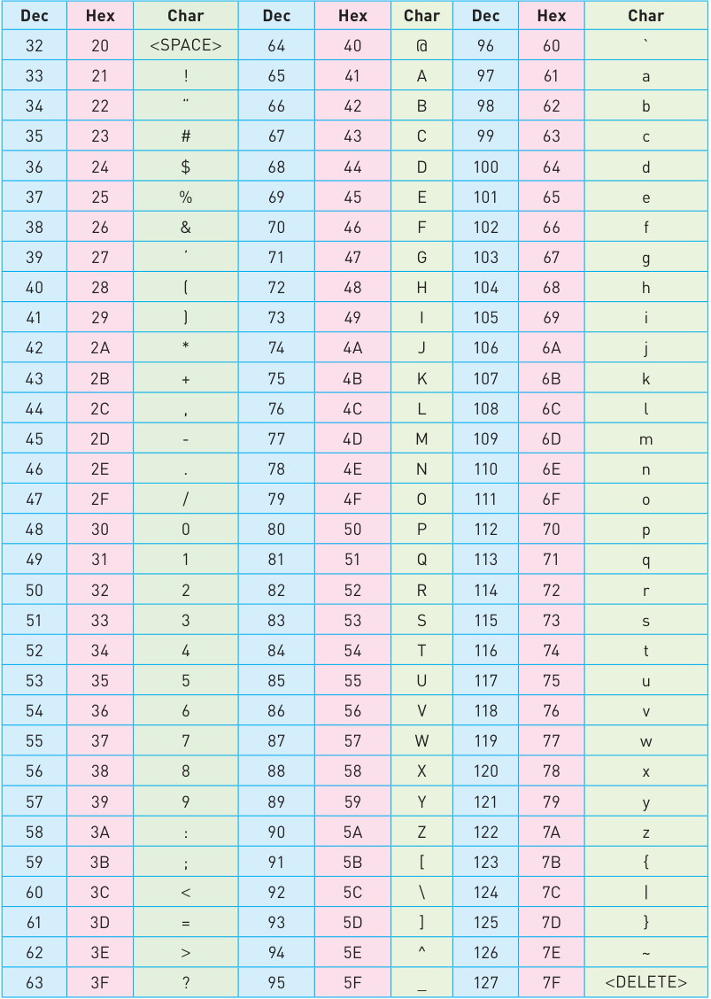

Consider the uppercase and lowercase codes in binary of characters. For example, 

|‘a’ ‘A’ ‘y’ ‘Y’|1|1|0|0|0|0|1|hex 61 (lower case) hex 41 (upper case) hex 79 (lower case) hex 59 (upper case)|
|---|---|---|---|---|---|---|---|---|
||1|0|0|0|0|0|1||
||1|1|1|1|0|0|1||
||1|0|1|1|0|0|1||

The above examples show that the sixth bit changes from 1 to 0 when comparing the lowercase and uppercase of a character. This makes the conversion between the two an easy operation. It is also noticeable that the character sets (e.g. a to z, 0 to 9, etc.) are grouped together in sequence, which speeds up usability. 

**Extended** ASCII uses 8-bit codes (0 to 255 in denary or 0 to FF in hexadecimal). This gives another 128 codes to allow for characters in non-English alphabets and for some graphical characters to be included: 

**Figure 1.6** Extended ASCII code table 

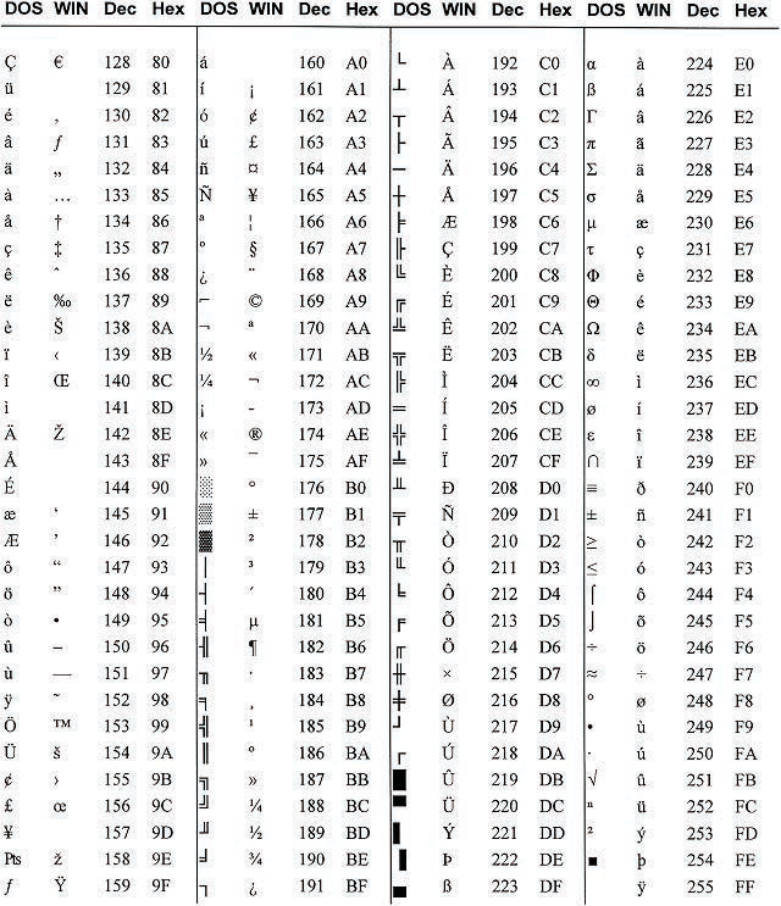

ASCII code has a number of disadvantages. The main disadvantage is that it does not represent characters in non-Western languages, for example Chinese characters. As can be seen in Figure 1.6 where DOS and Windows use different characters for some ASCII codes. For this reason, different methods of coding have been developed over the years. One coding system is called **Unicode** . Unicode can represent all languages of the world, thus supporting many operating systems, search engines and internet browsers used globally. There is overlap with standard ASCII code, since the first 128 (English) characters are the same, but Unicode can support several thousand different characters in total. As can be seen in Table 1.2 and Figure 1.6, ASCII uses one byte to represent a character, whereas Unicode will support up to four bytes per character. 

The Unicode consortium was set up in 1991. Version 1.0 was published with five goals; these were to: 

- **»** create a universal standard that covered all languages and all writing systems 

> **Find out more:** DOS appears in the ASCII extended code table. Find out what is meant by DOS and why it needs to have an ASCII code value. - **»** produce a more efficient coding system than ASCII - **»** adopt uniform encoding where each character is encoded as 16-bit or 32-bit code - **»** create unambiguous encoding where each 16-bit and 32-bit value always represents the same character - **»** reserve part of the code for private use to enable a user to assign codes for their own characters and symbols (useful for Chinese and Japanese character sets, for example). A sample of Unicode characters are shown in Figure 1.7. As can be seen from the figure, characters used in languages such as Russian, Romanian and Croatian can now be represented in a computer). 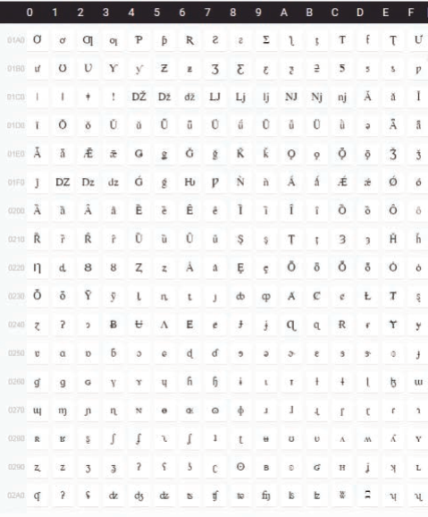 - **Figure 1.7** Sample of Unicode characters 28 _1.2 Text, sound and images_

### 1.2.2 Representation of sound

Soundwaves are vibrations in the air. The human ear senses these vibrations and interprets them as sound. 

Each sound wave has a frequency, wavelength and amplitude. The amplitude specifies the loudness of the sound. 

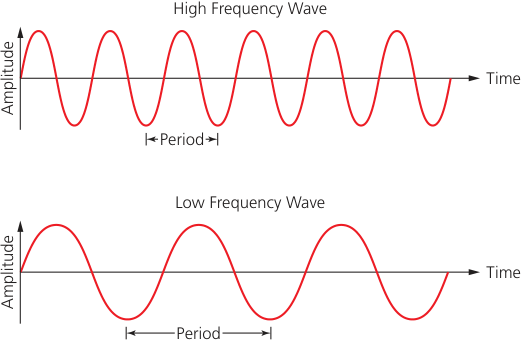

- **Figure 1.8** High and low frequency wave signals 

Sound waves vary continuously. This means that sound is analogue. Computers cannot work with analogue data, so sound waves need to be sampled in order to be stored in a computer. Sampling means measuring the amplitude of the sound wave. This is done using an analogue to digital converter (ADC). 

To convert the analogue data to digital, the sound waves are sampled at regular time intervals. The amplitude of the sound cannot be measured precisely, so approximate values are stored. 

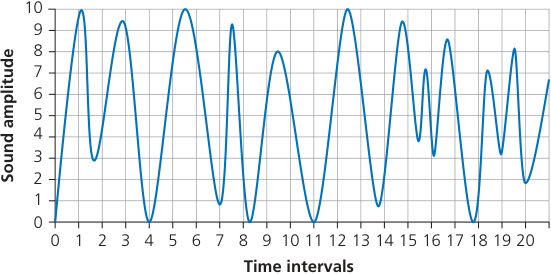

- **Figure 1.9** A sound wave being sampled 

Figure 1.9 shows a sound wave. The x-axis shows the time intervals when the sound was sampled (1 to 21), and the y-axis shows the amplitude of the sampled sound to 10. 

At time interval 1, the approximate amplitude is 10; at time interval 2, the approximate amplitude is 4, and so on for all 20 time intervals. Because the amplitude range in Figure 1.9 is 0 to 10, then 4 binary bits can be used to represent each amplitude value (for example, 9 would be represented by the 

binary value 1001). Increasing the number of possible values used to represent sound amplitude also increases the accuracy of the sampled sound (for example, using a range of 0 to 127 gives a much more accurate representation of the sound sample than using a range of, for example, 0 to 10). The number of bits per sample is known as the **sampling resolution** (also known as the **bit depth** ). So, in our example, the sampling resolution is 4 bits. 

**Sampling rate** is the number of sound samples taken per second. This is measured in hertz (Hz), where 1 Hz means ‘one sample per second’. 

So how is sampling used to record a sound clip? 

- **»** the amplitude of the sound wave is first determined at set time intervals (the sampling rate) 

- **»** this gives an approximate representation of the sound wave 

- **»** each sample of the sound wave is then encoded as a series of binary digits. 

Using a higher sampling rate or larger resolution will result in a more faithful representation of the original sound source. However, the higher the sampling rate and/or sampling resolution, the greater the file size. 

- **Table 1.3** The benefits and drawbacks of using a larger sampling resolution when recording sound 

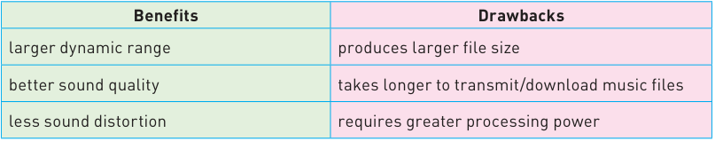

## **Link** 

See Section 1.3 for a calculation of file sizes. 

CDs have a 16-bit sampling resolution and a 44.1 kHz sample rate – that is 44 100 samples every second. This gives high-quality sound reproduction. 

### 1.2.3 Representation of (bitmap) images

**Bitmap images** are made up of **pixels** (picture elements); an image is made up of a two-dimensional matrix of pixels. Pixels can take different shapes such as: 

## ▲ **Figure 1.10** 

Each pixel can be represented as a binary number, and so a bitmap image is stored in a computer as a series of binary numbers, so that: 

- **»** a black and white image only requires 1 bit per pixel – this means that each pixel can be one of two colours, corresponding to either 1 or 0 

- **»** if each pixel is represented by 2 bits, then each pixel can be one of four colours (2[2] = 4), corresponding to 00, 01, 10, or 11 

- **»** if each pixel is represented by 3 bits then each pixel can be one of eight colours (2[3 ] = 8), corresponding to 000, 001, 010, 011, 100, 101, 110, 111. 

The number of bits used to represent each colour is called the **colour depth** . An 8 bit colour depth means that each pixel can be one of 256 colours (because 

2[8] = 256). Modern computers have a 24 bit colour depth, which means over 16 million different colours can be represented With x pixels, 2[x] colours can be represented as a generalisation. Increasing colour depth also increases the size of the file when storing an image. 

**Image resolution** refers to the number of pixels that make up an image; for example, an image could contain 4096 × 3072 pixels (12 582 912 pixels in total). 

The resolution can be varied on many cameras before taking, for example, a digital photograph. Photographs with a lower resolution have less detail than those with a higher resolution. For example, look at Figure 1.11: 

- **Figure 1.11** Five images of the same car wheel using different resolutions 

Image ‘A’ has the highest resolution and ‘E’ has the lowest resolution. ‘E’ has become pixelated (‘fuzzy’). This is because there are fewer pixels in ‘E’ to represent the image. 

The main drawback of using high resolution images is the increase in file size. As the number of pixels used to represent the image is increased, the size of the file will also increase. This impacts on how many images can be stored on, for example, a hard drive. It also impacts on the time to download an image from the internet or the time to transfer images from device to device. A certain amount of reduction in resolution of an image is possible before the loss of quality becomes noticeable. 

## **Activity 1.15** 

- **1** Explain each of the following terms: 

   - **i** colour depth 

   - **ii** ASCII code and Extended ASCII code 

   - **iii** Unicode 

   - **iv** sampling rate 

   - **v** bitmap image 

- **2** A colour image is made up of red, green and blue colour combinations. 8 bits are used to represent each of the colour components. 

   - **i** How many possible variations of red are there? 

   - **ii** How many possible variations of green are there? 

   - **iii** How many possible variations of blue are there? 

   - **iv** How many different colours can be made by varying the red, green and blue values? 

- **3** Describe the effect of increasing resolution and sampling rate on the size of a file being stored in a computer. 

## 1.3 Data storage and file compression

### 1.3.1 Measurement of data storage

A **bit** is the basic unit of all computing memory storage terms and is either 1 or 0. The word comes from **b** inary dig **it** . The byte is the smallest unit of memory in a computer. 1 byte is 8 bits. A 4-bit number is called a nibble – half a byte. 

1 byte of memory wouldn’t allow you to store very much information so memory size is measured in the multiples shown in Table 1.4: 

- **Table 1.4** Memory size using denary values 

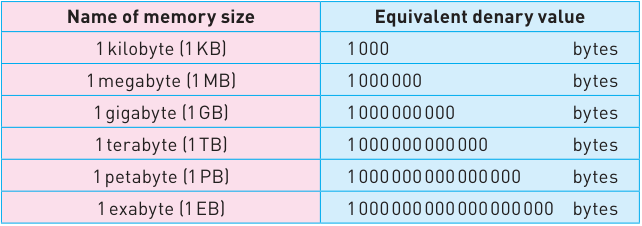

The above system of numbering now only refers to some storage devices but is technically inaccurate. It is based on the SI (base 10) system of units where 1 kilo is equal to 1000. 

A 1 TB hard disk drive would allow the storage of 1 × 10[12] bytes according to this system. 

However, since memory size is actually measured in terms of powers of 2, another system has been adopted by the IEC (International Electrotechnical Commission) that is based on the binary system (Table 1.5): 

- **Table 1.5** IEC memory size system 

## **Advice** 

Only the IEC system is covered in the syllabus. 

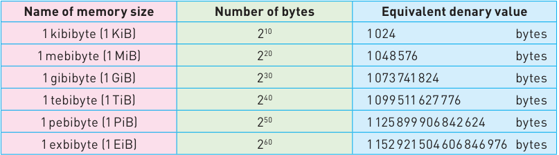

This system is more accurate. Internal memories (such as RAM and ROM) should be measured using the IEC system. A 64 GiB RAM could, therefore, store 64 × 2[30 ] bytes of data (68 719 476 736 bytes). 

### 1.3.2 Calculation of file size

In this section we will look at the calculation of the file size required to hold a bitmap image and a sound sample. 

The file size of an image is calculated as: 

image resolution (in pixels) × colour depth (in bits) 

The size of a mono sound file is calculated as: 

sample rate (in Hz) × sample resolution (in bits) × length of sample (in seconds) 

For a stereo sound file, you would then multiply the result by two. 

## **Example 1** 

A photograph is 1024 × 1080 pixels and uses a colour depth of 32 bits. How many photographs of this size would fit onto a memory stick of 64 GiB? 

- **1** Multiply number of pixels in vertical and horizontal directions to find total number of pixels = (1024 × 1080) = 1 105 920 pixels 

- **2** Now multiply number of pixels by colour depth then divide by 8 to give the number of bytes = 1 105 920 × 32 = 35 389 440/8 bytes = 4 423 680 bytes 

- **3** 64 GiB = 64 × 1024 × 1024 × 1024 = 68 719 476 736 bytes 

- **4** Finally divide the memory stick size by the files size = 68 719 476 736/4 423 680 = 15 534 photos. 

## **Example 2** 

A camera detector has an array of 2048 by 2048 pixels and uses a colour depth of 16. Find the size of an image taken by this camera in MiB. 

- **1** Multiply number of pixels in vertical and horizontal directions to find total number of pixels = (2 048 × 2 048) = 4 194 304 pixels 

- **2** Now multiply number of pixels by colour depth = 4 194 304 × 16 = 67 108 864 bits 

- **3** Now divide number of bits by 8 to find the number of bytes in the file = (67 108 864)/8 = 8 388 608 bytes 

- **4** Now divide by 1024 × 1024 to convert to MiB = (8 388 608)/(1 048 576) = 8 MiB. 

## **Example 3** 

An audio CD has a sample rate of 44 100 and a sample resolution of 16 bits. The music being sampled uses two channels to allow for stereo recording. Calculate the file size for a 60-minute recording. 

- **1** Size of file = 

sample rate (in Hz) × sample resolution (in bits) × length of sample (in seconds) 

- **2** Size of sample = (44 100 × 16 × (60 × 60)) = 2 540 160 000 bits 

- **3** Multiply by 2 since there are two channels being used = 5 080 320 000 bits 

- **4** Divide by 8 to find number of bytes = (5 080 320 000)/8 = 635 040 000 

- **5** Divide by 1024 × 1024 to convert to MiB = 635 040 000 / 1 048 576 = 605 MiB. 

## **Activity 1.16** 

- **1** A camera detector has an array of 1920 by 1536 pixels. A colour depth of 16 bits is used. Calculate the size of a photograph taken by this camera, giving your answer in MiB. 

- **2** Photographs have been taken by a smartphone which uses a detector with a 1024 × 1536 pixel array. The software uses a colour depth of 24 bits. How many photographs could be stored on a 16 GiB memory card? 

- **3** Audio is being sampled at the rate of 44.1 kHz using 8 bits. Two channels are being used. Calculate: 

   - **a** the size of a one second sample, in bits 

   - **b** the size of a 30-second audio recording in MiB. 

- **4** The typical song stored on a music CD is 3 minutes and 30 seconds. Assuming each song is sampled at 44.1 kHz (44 100 samples per second) and 16 bits are used per sample. Each song utilises two channels. 

   - Calculate how many typical songs could be stored on a 740 MiB CD. 

### 1.3.3 Data compression

The calculations in Section 1.3.2 show that sound and image files can be very large. It is therefore necessary to reduce (or **compress** ) the size of a file for the following reasons: 

- **»** to save storage space on devices such as the hard disk drive/solid state drive 

- **»** to reduce the time taken to stream a music or video file 

- **»** to reduce the time taken to upload, download or transfer a file across a network 

- **»** the download/upload process uses up network **bandwidth** – this is the maximum rate of transfer of data across a network, measured in bits per second. This occurs whenever a file is downloaded, for example, from a server. Compressed files contain fewer bits of data than uncompressed files and therefore use less bandwidth, which results in a faster data transfer rate. 

- **»** reduced file size also reduces costs. For example, when using cloud storage, the cost is based on the size of the files stored. Also an internet service provider (ISP) may charge a user based on the amount of data downloaded. 

### 1.3.4 Lossy and lossless file compression

File compression can either be **lossless** or **lossy** . 

## **Lossy file compression** 

With this technique, the file compression algorithm eliminates unnecessary data from the file. This means the original file cannot be reconstructed once it has been compressed. 

Lossy file compression results in some loss of detail when compared to the original file. The algorithms used in the lossy technique have to decide which parts of the file need to be retained and which parts can be discarded. 

For example, when applying a lossy file compression algorithm to: 

- **»** an image, it may reduce the resolution and/or the bit/colour depth 

- **»** a sound file, it may reduce the sampling rate and/or the resolution. 

Lossy files are smaller than lossless files which is of great benefit when considering storage and data transfer rate requirements. 

Common lossy file compression algorithms are: 

- **»** MPEG-3 (MP3) and MPEG-4 (MP4) **»** JPEG. 

## MPEG-3 (MP3) and MPEG-4 (MP4) 

**MP3** files are used for playing music on computers or mobile phones. This compression technology will reduce the size of a normal music file by about 90%. While MP3 music files can never match the sound quality found on a DVD or CD, the quality is satisfactory for most general purposes. 

But how can the original music file be reduced by 90% while still retaining most of the music quality? Essentially the algorithm removes sounds that the human ear can’t hear properly. For example: 

- **»** removal of sounds outside the human ear range 

- **»** if two sounds are played at the same time, only the louder one can be heard by the ear, so the softer sound is eliminated. This is called perceptual music shaping. 

**MP4** files are slightly different to MP3 files. This format allows the storage of multimedia files rather than just sound – music, videos, photos and animation can all be stored in the MP4 format. As with MP3, this is a lossy file compression format, but it still retains an acceptable quality of sound and video. Movies, for example, could be streamed over the internet using the MP4 format without losing any real discernible quality. 

## JPEG 

When a camera takes a photograph, it produces a raw bitmap file which can be very large in size. These files are temporary in nature. **JPEG** is a lossy file compression algorithm used for bitmap images. As with MP3, once the image is subjected to the JPEG compression algorithm, a new file is formed and the original file can no longer be constructed. 

The JPEG file reduction process is based on two key concepts: 

- **»** human eyes don’t detect differences in colour shades quite as well as they detect differences in image brightness (the eye is less sensitive to colour variations than it is to variations in brightness) 

- **»** by separating pixel colour from brightness, images can be split into 8 × 8 pixel blocks, for example, which then allows certain ‘information’ to be discarded from the image without causing any real noticeable deterioration in quality. 

## **Lossless file compression** 

With this technique, all the data from the original uncompressed file can be reconstructed. This is particularly important for files where any loss of data would be disastrous (e.g. when transferring a large and complex spreadsheet or when downloading a large computer application). 

Lossless file compression is designed so that none of the original detail from the file is lost. 

**Run-length encoding (RLE)** can be used for lossless compression of a number of different file formats: 

- **»** it is a form of lossless/reversible file compression 

- **»** it reduces the size of a string of adjacent, identical data (e.g. repeated colours in an image) 

- **»** a repeating string is encoded into two values: 

   - the first value represents the number of identical data items (e.g. characters) in the run 

   - the second value represents the code of the data item (such as ASCII code if it is a keyboard character) 

- **»** RLE is only effective where there is a long run of repeated units/bits. 

## Using RLE on text data 

Consider the following text string: ‘aaaaabbbbccddddd’. Assuming each character requires 1 byte then this string needs 16 bytes. If we assume ASCII code is being used, then the string can be coded as follows: 

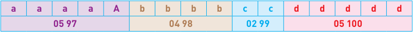

This means we have five characters with ASCII code 97, four characters with ASCII code 98, two characters with ASCII code 99 and five characters with ASCII code 100. Assuming each number in the second row requires 1 byte of memory, the RLE code will need 8 bytes. This is half the original file size. 

One issue occurs with a string such as ‘cdcdcdcdcd’ where RLE compression isn’t very effective. To cope with this, we use a flag. A flag preceding data indicates that what follows are the number of repeating units (for example, 255 05 97 where 255 is the flag and the other two numbers indicate that there are five items with ASCII code 97). When a flag is not used, the next byte(s) are taken with their face value and a run of 1 (for example, 01 99 means one character with ASCII code 99 follows). 

Consider this example: 

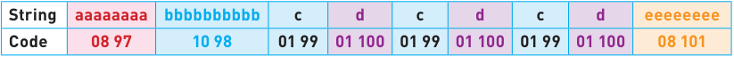

The original string contains 32 characters and would occupy 32 bytes of storage. 

The coded version contains 18 values and would require 18 bytes of storage. Introducing a flag (255 in this case) produces: 

**255 08 97** •• **255 10 98** •• **99 100 99 100 99 100** •• **255 08 101** 

This has 15 values and would, therefore, require 15 bytes of storage. This is a reduction in file size of about 53% when compared to the original string. 

Using RLE with images 

## **Example 1: Black and white image** 

Figure 1.12 shows the letter ‘F’ in a grid where each square requires 1 byte of storage. A white square has a value 1 and a black square a value of 0: 

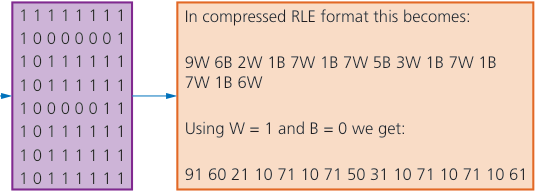

- **Figure 1.12** Using RLE with a black and white image 

The 8 × 8 grid would need 64 bytes; the compressed RLE format has 30 values, and therefore needs only 30 bytes to store the image. 

## **Example 2: Coloured images** 

Figure 1.13 shows an object in four colours. Each colour is made up of red, green and blue (RGB) according to the code on the right. 

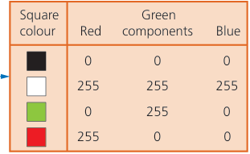

- **Figure 1.13** Using RLE with a coloured image 

This produces the following data: 2 0 0 0 4 0 255 0 3 0 0 0 6 255 255 255 1 0 0 0 2 0 255 0 4 255 0 0 4 0 255 0 1 255 255 255 2 255 0 0 1 255 255 255 4 0 255 0 4 255 0 0 4 0 255 0 4 255 255 255 2 0 255 0 1 0 0 0 2 255 255 255 2 255 0 0 2 255 255 255 3 0 0 0 4 0 255 0 2 0 0 0. 

The original image (8 × 8 square) would need 3 bytes per square (to include all three RGB values). Therefore, the uncompressed file for this image is 8 × 8 × 3 = 192 bytes. 

The RLE code has 92 values, which means the compressed file will be 92 bytes in size. This gives a file reduction of about 52%. It should be noted that the file reductions in reality will not be as large as this due to other data which needs to be stored with the compressed file (e.g. a file header). 

## **Extension** 

For those students considering the study of this subject at A Level, the following section gives some insight into further study on data representation. 

The following two exercises are designed to help students thinking of furthering their study in Computer Science at A Level standard. The two topics here are not covered in the syllabus and merely show how some of the topics in this chapter can be extended to this next level. The two topics extend uses of the binary number system and using two’s complement format to do binary addition. 

## Topic 1: Binary Coded Decimal (BCD) 

The **Binary Coded Decimal (BCD)** system uses a 4-bit code to represent each denary digit, i.e.: 

|0|0|0|0|=|0|0|1|0|1|=|5|
|---|---|---|---|---|---|---|---|---|---|---|---|
|0|0|0|1|=|1|0|1|1|0|=|6|
|0|0|1|0|=|2|0|1|1|1|=|7|
|0|0|1|1|=|3|1|0|0|0|=|8|
|0|1|0|0|=|4|1|0|0|1|=|9|

Therefore, the denary number, 3 1 6 5, would be 0 0 1 1   0 0 0 1   0 1 1 0   0 1 0 1 in BCD format. 

## Uses of BCD 

The most obvious use of BCD is in the representation of digits on a calculator or clock display. For example: 

## 180.3 

Each denary digit will have a BCD equivalent value which makes it easy to convert from computer output to denary display. 

## Questions to try 

- **1** Convert the following denary numbers into BCD format: **a** 2 7 1 **b** 5 0 0 6 **c** 7 9 9 0 

- **2** Convert the following BCD numbers into denary numbers: 

   - **a** 1 0 0 1   0 0 1 1   0 1 1 1 

   - **b** 0 1 1 1   0 1 1 1   0 1 1 0   0 0 1 0 

## Topic 2: Subtraction using two’s complement notation 

To carry out subtraction in binary, we convert the number being subtracted into its negative equivalent using two’s complementation and then **add** the two numbers. 

## **Example 1** 

Carry out the subtraction 95 – 68 in binary. 

95  =   0   1  0  1  1  1   1  1 68  =  0   1  0  0   0  1  0   0 

First convert the two numbers into binary: 

Now find the two’s complement of 68: 1   0  1  1  1  0   1  1 +                                         1 −68  =   1  0   1  1  1  1   0   0 

Then add 95 and −68: 

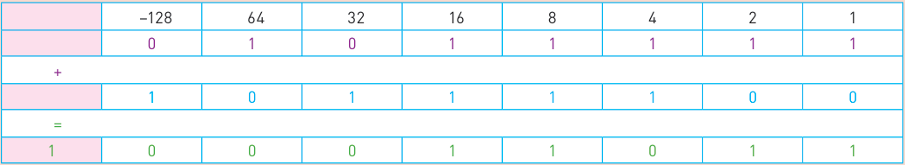

The additional ninth bit is simply ignored leaving the binary number: 0 0 0 1 1 0 1 1 (denary equivalent of 27 which is the correct result of the subtraction). 

## **Example 2** 

|Carry out the subtraction 49 – 80 in binary. First convert the two numbers into binary:  49  =  0  0  1  1  0  0  0  1 80  =  0  1  0  1  0  0  0  0 Now find the two’s complement of 68:                               1  0  1  0  1  1  1  1 +                                      1 −80  =  1  0  1  1  0  0  0  0 Now add 49 and −80:|Carry out the subtraction 49 – 80 in binary. First convert the two numbers into binary:  49  =  0  0  1  1  0  0  0  1 80  =  0  1  0  1  0  0  0  0 Now find the two’s complement of 68:                               1  0  1  0  1  1  1  1 +                                      1 −80  =  1  0  1  1  0  0  0  0 Now add 49 and −80:|Carry out the subtraction 49 – 80 in binary. First convert the two numbers into binary:  49  =  0  0  1  1  0  0  0  1 80  =  0  1  0  1  0  0  0  0 Now find the two’s complement of 68:                               1  0  1  0  1  1  1  1 +                                      1 −80  =  1  0  1  1  0  0  0  0 Now add 49 and −80:|Carry out the subtraction 49 – 80 in binary. First convert the two numbers into binary:  49  =  0  0  1  1  0  0  0  1 80  =  0  1  0  1  0  0  0  0 Now find the two’s complement of 68:                               1  0  1  0  1  1  1  1 +                                      1 −80  =  1  0  1  1  0  0  0  0 Now add 49 and −80:|Carry out the subtraction 49 – 80 in binary. First convert the two numbers into binary:  49  =  0  0  1  1  0  0  0  1 80  =  0  1  0  1  0  0  0  0 Now find the two’s complement of 68:                               1  0  1  0  1  1  1  1 +                                      1 −80  =  1  0  1  1  0  0  0  0 Now add 49 and −80:|Carry out the subtraction 49 – 80 in binary. First convert the two numbers into binary:  49  =  0  0  1  1  0  0  0  1 80  =  0  1  0  1  0  0  0  0 Now find the two’s complement of 68:                               1  0  1  0  1  1  1  1 +                                      1 −80  =  1  0  1  1  0  0  0  0 Now add 49 and −80:|Carry out the subtraction 49 – 80 in binary. First convert the two numbers into binary:  49  =  0  0  1  1  0  0  0  1 80  =  0  1  0  1  0  0  0  0 Now find the two’s complement of 68:                               1  0  1  0  1  1  1  1 +                                      1 −80  =  1  0  1  1  0  0  0  0 Now add 49 and −80:|Carry out the subtraction 49 – 80 in binary. First convert the two numbers into binary:  49  =  0  0  1  1  0  0  0  1 80  =  0  1  0  1  0  0  0  0 Now find the two’s complement of 68:                               1  0  1  0  1  1  1  1 +                                      1 −80  =  1  0  1  1  0  0  0  0 Now add 49 and −80:|
|---|---|---|---|---|---|---|---|
|−128|64|32|16|8|4|2|1|
|0|0|1|1|0|0|0|1|
|+ +||||||||
|1|0|1|1|0|0|0|0|
|=                                                                                              =||||||||
|1|1|1|0|0|0|0|1|

This gives us 1 1 1 0 0 0 0 1 which is −31 in denary; the correct answer. 

Questions to try 

In this chapter, you have learnt how to: 

- ✔ use the binary and hexadecimal number systems 

- ✔ convert numbers between the binary, denary and hexadecimal numbers systems 

- ✔ add together two binary numbers 

- ✔ carry out a logical shift 

- ✔ store negative binary numbers using two’s complement 

- ✔ interpret ASCII and Unicode character tables 

- ✔ understand the way a computer stores image and sound files 

- ✔ represent the size of a computer memory using KiB, GiB, and so on 

- ✔ calculate the size of an image and sound file taking into account a number of factors 

- ✔ understand the effect of sampling rates and resolution on the size of a sound file 

- ✔ understand the effect of resolution and colour depth on the size of an image file 

- ✔ understand the advantages and disadvantages of reducing the size of a file 

- ✔ apply lossless and lossy file reduction techniques. 

## **Key terms used throughout this chapter** 

**bit** – the basic computing element that is either 0 or 1, and is formed from the words **Bi** nary digi **t** 

– **binary number system** a number system based on 2 and can only use the values 0 and 1 

**hexadecimal number system** – a number system based on the value 16 which uses denary digits 0 to 9 and letters A to F **error code** – an error message generated by the computer 

**MAC address** – standing for Media Access Control, this address (given in hexadecimal) uniquely identifies a device on the internet; it takes the form: NN-NN-NN-DD-DD-DD, where NN-NN-NN is the manufacturer code and DD-DD-DD is the device code NN-NN-NN-DD-DD-DD 

**IP address** – _**Internet Protocol**_ identified either as IPv4 or IPv6; it gives a unique address to each device connected to a network identifying their location 

**HTML** – _**HyperText Mark-up Language**_ is used in the design of web pages and to write, for example, http(s) protocols; in the context of this chapter, colours used in web pages are assigned a hexadecimal code based on red, green and blue colours 

**overflow error** – the result of carrying out a calculation that produces a value that is too large for the computer’s allocated word size (8-bit, 16-bit, 32-bit, and so on) 

– **logical shift** an operation that shifts bits to the left or right in a register; any bits shifted out of a register (left or right) are replaced with zeroes 

**two’s complement** – a method of representing negative numbers in binary; when applied to an 8-bit system, the left-most bit (most significant bit) is given the value –128 

**ASCII code** – _a character set_ for all the characters on a standard keyboard and control codes 

**character set** – a list of characters that have been defined by computer hardware and software. The character set is necessary so that the computer can understand human characters 

**Unicode** – _a character set_ which represents all the languages of the world (the first 128 characters are the same as ASCII code) **sampling resolution** – the number of bits used to represent sound amplitude in digital sound recording (also known as bit depth) **bit depth** – the number of bits used to represent the smallest unit in a sound file 

**colour depth** – the number of bits used to represent the colours of a pixel 

**sampling rate** – the number of sound samples taken per second in digital sound recording 

**bitmap image** – an image made up of pixels 

**pixel** – derived from the term 'picture element', this is the smallest element used to make up an image on a display 

**image resolution** – the number of pixels in the X–Y direction of an image, for example, 4096 × 3192 pixels 

**pixelated (image)** – this is the result of zooming into a bitmap image; on zooming out the pixel density can be diminished to such a degree that the actual pixels themselves can be seen 

**pixel density** – number of pixels per square inch 

**compression** – reduction of the size of a file by removing repeated or redundant pieces of data; this can be lossy or lossless 

**bandwidth** – the maximum rate of transfer of data across a network, measured in kilobits per second (kbps) or megabits per second (Mbps) 

**lossy (file compression)** – a file compression method in which parts of the original file cannot be recovered during the decompression process for example, JPEG, mp3 

**lossless (file compression)** – a file compression method that allows the original file to be fully restored during the decompression process, for example, run length encoding (RLE) 

**audio compression** – a method used to reduce the size of a sound file using perceptual music shaping 

**MP3** – a lossy file compression method used for music files 

**MP4** – a lossy file compression method used for multimedia files 

**JPEG** – from Joint Photographic Expert Group; a form of lossy file compression used with image files which relies on the inability of the human eye to distinguish certain colour changes and hues 

**run length encoding (RLE)** – a lossless file compression technique used to reduce the size of text and photo files in particular 

## Exam-style questions 

- **1** A software developer is using a microphone to collect various sounds for his new game. He is also using a sound editing app. 

|| new game. He is also using a sound editing app.||
|---|---|---|
||When collecting sounds, the software developer can decide on the sampling||
||resolution he wishes to use.||
||**a i**What is meant by**_sampling resolution_**?|[1]|
||**ii**Describe how sampling resolution will affect how accurate||
||the stored digitised sound will be.|[3]|
||The software developer will include images in his new game.||
||**b i**Explain the term**_image resolution_**.|[1]|
||**ii**The software developer is using 16-colour bitmap images.||
||How many bits would be used to encode data for**one**pixel||
||of his image?|[1]|
||**iii**One of his images is 16 384 pixels wide and 512 pixels high.||
||He decides to save it as a 256-colour bitmap image.||
||Calculate the size of the image file in gibibytes.|[3]|
||**iv**Describe any file compression techniques the developer||
||may use.|[3]|
|**2**|The editor of a movie is finalising the music score. He will send||
||the final version of his score to the movie producer by email||
||attachment.||
||**a**Describe how**_sampling_**is used to record the music sound clips.|[3]|
||**b**The music sound clips need to undergo some form of data||
||compression before the music editor can send them via email.||
||Which type of compression,**_lossy_**or**_lossless_**, should he use?||
||Give a justification for your answer.|[3]|
||**c**One method of data compression is known as**_run length_**||
||**_encoding (RLE)_**.||
||**i**What is meant by RLE?|[3]|

**ii** The following image is being developed: 

Show how RLE would be used to produce a compressed file for the above image. Write down the data you would expect to see in the RLE compressed format (you may assume that the grey squares have a code value of 0 and the white squares have a code value of 1). [4] 

|**3**|An 8-bit binary register contains the value:|||||
|---|---|---|---|---|---|
||**0** **0** **1** **1** **0** **1** **1** **0**|||||
||**a**Write down the denary value of this register.||||[1]|
||**b**The contents of this register undergo a logical|||shift**_one place_**||
||to the right.|||||
||**i**Show the result of this right shift.|||||
||**ii**Write down the denary value following this|||right shift.|[2]|
||**c**The contents of this register, at the start of the question, now|||||
||undergo a logical shift**_two places_**to the||left.|||
||**i**Show the contents of the register after this left shift|||||
||operation.||||[1]|
||**ii**State, with reasons, the effect of this||shift|on the denary||
||value in**_parta_**.||||[2]|
|**4**|**a**Convert the following denary numbers into 8-bit binary numbers:|||||
||**i**123**ii**55**iii**180||||[3]|
||**b**Carry out the following additions using your binary values|||||
||from**_parta_**:|||||
||**i**123 + 55**ii**123 + 180||||[4]|
||**c** **i**Write down the two’s complement value of:|||0 1 1 1 0 1 0 0|[2]|
||**ii**Write down the binary value of−112 using two’s complement|||||
||notation.||||[1]|
||**iii**Write down the denary value of the following binary number,|||||
||which is using two’s complement notation:||||[1]|
||**1** **0** **1** **1** **1** **0** **0**||**1**|||
||**d** **i**Convert the following denary number|into an 8-bit binary||||
||number using two’s complement notation: 104.|||||
||**ii**Use two’s complement notation to find the|||8-bit binary||
||value of−104.||||[2]|
|**5**|A bitmap image has the following resolution: 1140 × 1080 pixels.|||||
||The image uses a colour depth of 24 bits.|||||
||**a**Explain the term**pixel**.||||[1]|
||**b**Explain the term**colour depth**.||||[1]|
||**c**Calculate how many of these images could be stored on a 32-GiB|||||
||memory stick.||||[3]|
||**d**Describe how it would be possible to increase the number of|||||
||these images which could be stored on this memory stick.||||[3]|
|**6**|**a**Nancy has captured images of her holiday with her camera.|||||
||The captured images are stored as digital photo files on her camera.|||||
||Explain how the captured images are converted to digital photo|||||
||files.||||[4]|
||**b**Nancy wants to email photos to Nadia.|||||
||Many of the photos are very large files, so Nancy needs to reduce|||||
||their file size as much as possible.|||||
||Identify which type of file compression would|||be most suitable||
||for Nancy to use. Explain your choice.||||[4]|

- **7** A stopwatch uses six digits to store hours, minutes and seconds. The stopwatch stopped at: 

**02   :   31   :   58** 

## **Hours    Minutes   Seconds** 

- An 8-bit register is used to store each pair of digits. 

- **a** Write the 8-bit binary numbers that are currently stored for the **Hours, Minutes** and **Seconds** . 

Hours Minutes Seconds 

[3] 

- **b** The stopwatch is started again and then stopped. When the watch is stopped, the 8-bit binary registers show: 

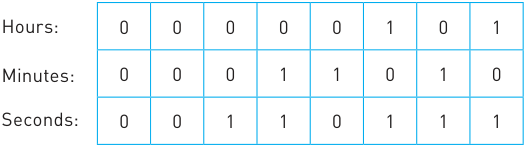

- Write the denary values that will now be shown on the stopwatch. 

**:         :** 

**Hours    Minutes   Seconds** [3] 

- **8** A memory stick is advertised as having a capacity of 64 GiB. 

   - **a** How many photographs of size 10 KiB could be stored on this memory stick? 

- **b** John wants to store 400 photographs in a folder on his solid state drive (SSD). Each photograph is 10 KiB in size. 

   - **i** Name _**one**_ way of reducing the size of this file. [1] 

   - **ii** Give _**two**_ advantages of reducing the size of his photography files. [2] 

   - **iii** Give _**one**_ disadvantage of reducing files using the method named in _**part b i**_ . [1] 

- **c** The original photographs were stored as bitmap images. 

   - **i** Explain why 3 bytes of data would be needed to store each pixel in the bitmap image. [2] 

   - **ii** Calculate how many different pixel colours could be formed if one of the bytes gives the intensity of the red colour, one of the bytes gives the intensity of the green colour and one of the bytes gives the intensity of the blue colour. [3] 

- **9** Six calculations are shown on the left and eleven denary values are shown on the right. 

   - By drawing arrows, connect each calculation to its correct denary value. 

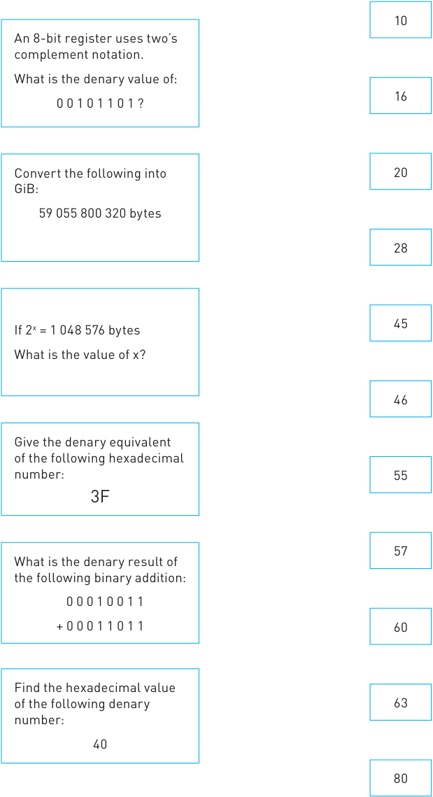

[6] 

