# CAIE Computer Science IGCSE — Chapter 6: Automated and emerging technologies

---

## **In this chapter, you will learn about:** 

- ★ automated systems 

   - the use of sensors, microprocessors and actuators in automated systems 

   - the advantages and disadvantages of using automated systems in given scenarios 

- ★ robotics 

   - what is meant by robotics 

   - the characteristics of a robot 

   - the roles, advantages and disadvantages of robots 

- ★ artificial intelligence 

   - what is meant by artificial intelligence (AI) 

   - the main characteristics of AI 

   - the basic operation and components of AI systems to simulate intelligent behaviour. 

Whether it’s robots welding cars in a factory, autonomous grass cutters or smart road signs, the effects of automated systems can be seen all around us. These automated systems are becoming increasingly sophisticated and complex. This chapter will consider examples of automated systems, robotics and artificial intelligence (AI) and how they affect our everyday lives. This is by no means an exhaustive list and the reader is advised to try to keep up to date with all the latest developments. 

## 6.1 Automated systems

### 6.1.1 Sensors, microprocessors and actuators

An **automated system** is a combination of software and hardware (for example, sensors, microprocessors and actuators) that is designed and programmed to work automatically without the need of any human intervention. However, such systems often involve human monitoring. 

## **Link** 

See Section 3.2 for more details on sensors, microprocessors and actuators. 

The role of sensors, microprocessors and actuators was discussed at great length in Section 3.2. It may be worth the reader revisiting this part of the book before continuing with this chapter; you should remember that: 

- **»** Sensors are input devices that take readings from their surroundings and send this data to a microprocessor or computer. If the data is analogue, it is first converted into a digital format by an analogue-digital converter (ADC). 

- **»** The microprocessor will process the data and take the necessary action based on programming. 

- **»** This will involve some form of output, usually involving signals sent to actuators to control motors, wheels, solenoids, and so on. 

## **Advice** 

- **»** On first sight, all of the examples in 6.1 will appear very complicated. 

- **»** However, you will not learn any of the industrial or scientific processes described fully in this chapter. Any processes used in any questions will be fully described to you (possibly including a diagram). 

- **»** You basically need to go through each example carefully and understand the processes taking place. In other words, what is the interaction between the sensors, actuators and microprocessor/computer to allow the process to take place. 

- **»** On completion of Section 6.1 the important learning process is to understand the sensor, actuator and microprocessor interaction; to this end, you need to do two things: 

   - for each example, complete a table as follows: 

|**Example**|**Which sensors** **are used?**|**What is the** **function of the** **actuators?**|**What is the** **function of the** **computer?**|**Additional** **notes**|
|---|---|---|---|---|
||||||
|– then try the activities 6.1 to 6.7 to make sure you fully understand the processes going on.|||||

- You will then find out that the examples were much easier than they appeared at first. 

### 6.1.2 Advantages and disadvantages of automated

## systems 

In this section, a number of examples will be used to show the advantages and disadvantages of using automated systems. This list is by no means exhaustive, and simply intends to show the role of sensors, microprocessors (or computers) and actuators in the following application areas: 

- **»** industrial 

- **»** transport 

- **»** agriculture 

- **»** weather 

- **»** gaming 

- **»** lighting 

- **»** science. 

## **Industrial applications** 

Automated systems are used in a number of industrial applications. Many of the automated systems involve robotics, which is covered in more depth in Section 6.2. 

In recent years, the focus on increased automation has led to improved quality and flexibility. For example, in the manufacture of car engines, when done manually, the installation of pistons into the engine had an error-rate of ~1.5%; with automated systems, the error-rate has fallen to 0.00001%. 

We will now consider two very different industrial applications. 

## **Example 1: A nuclear power station** 

A key use of automated systems is in the control and monitoring of a nuclear power station. This is a good example, since automation gives increased safety both in the process itself and to the workforce. At the centre of the system is a **distributed control system (DCS)** . DCS is essentially a powerful computer that has been programmed to monitor and control the whole process with no human interaction required: 

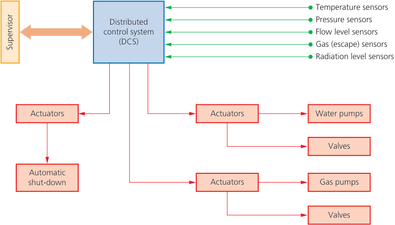

- **Figure 6.1** Nuclear power station (automated system) 

Data from a number of sensors is sent to a DCS (computer) – if the data is analogue, it must first be converted into digital format using an ADC. The DCS will have access to a large database containing operational data and parameters. If any action needs to be taken, then signals will be sent to the appropriate actuators to operate pumps, valves or even an emergency shutdown system. The key here is that the system is fully automated. A human operator (the supervisor) will sit in a remote control room where a schematic of the process will show on a large screen. While the process is fully automatic, the supervisor can still override the DCS and shut down the process. 

The main advantages of this automated system are: 

- **»** much faster than a human operator to take any necessary action 

- **»** much safer (an automated system is more likely to make timely interventions than a human; it also keeps humans away from a dangerous environment) 

- **»** the process is more likely to run under optimum conditions since any small changes needed can be identified very quickly and action taken 

- **»** in the long run, it is less expensive (an automatic system replaces most of the workforce who would need to monitor the process 24 hours a day). 

The main disadvantages of this automated system are: 

- **»** expensive to set up in the first place and needs considerable testing 

- **»** always possible for a set of conditions to occur that were never considered during testing which could have safety implications (hence the need for a supervisor) 

- **»** any computerised system is subject to cyberattacks no matter how good the system (one way round this is to have no external links to the DCS; although the weak link could potentially be the connection to the supervisor) 

- **»** automated systems always need enhanced maintenance which can be expensive. 

## **Example 2: Manufacture of paracetamol** 

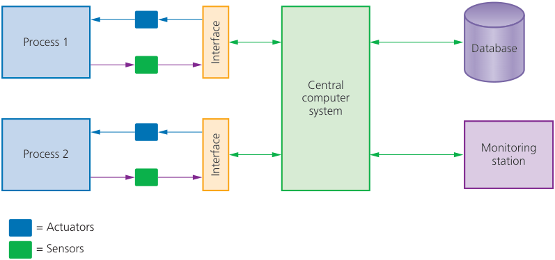

- **Figure 6.2** Manufacture of paracetamol (automated system) 

This automated system also depends on sensors, a computer, actuators and software. Process 1 is the manufacture of the paracetamol. Process 2 is the making of the solid tablets. Both processes are monitored by a number of sensors that send their data back to a central computer. The computer consults its database to ensure both processes are operating within correct parameters. Any necessary action is taken by the computer, sending signals to the appropriate actuator to operate pumps, valves, heaters, stirrers or pistons to ensure both processes can operate without any human intervention. Again, this system uses a remote monitoring station manned by an operator. The system is fully automated, but the operator can override the central computer system if necessary. 

The main advantages of this automated system are: 

- **»** much faster than a human operator to take any necessary action 

- **»** much safer (an automated system is more likely to make timely interventions than a human if necessary; it also keeps humans away from a potentially dangerous environment) 

- **»** the process is more likely to run under optimum conditions since any small changes needed can be identified very quickly and action taken 

- **»** in the long run, it is less expensive (an automatic system replaces most of the workforce who would need to monitor the process 24 hours a day) 

- **»** more efficient use of materials 

- **»** higher productivity 

- **»** more consistent results. 

The main disadvantages of this automated system are: 

- **»** expensive to set up in the first place and needs considerable testing 

- **»** always possible for a set of conditions to occur that were never considered during testing which could have safety implications (hence the need for a monitoring station) 

- **»** automated systems always need enhanced maintenance which can be expensive 

- **»** any computerised system is subject to cyberattacks no matter how good the system. 

There are many other examples; the above two examples can be applied to many other industrial processes. 

## **Activity 6.1** 

A company manufactures fizzy drinks that are then labelled and bottled: 

- **a** Describe how the sensors, actuators and central computer would be used to monitor and control this bottling plant automatically. You may wish to add/show sensors and actuators in the diagram given above. 

The system is fully automatic. Sensors are used to ensure the correct amount of each ingredient is added. A stirrer is activated whenever ingredients are added. The bottling plant is again monitored by sensors to ensure the correct amount of drink is added to each bottle, and that the right amount of carbon dioxide gas is added to each bottle. The whole process is computer-controlled and is totally automatic. 

- **b** Finally, describe the advantages and disadvantages of fully automating this bottling plant (you can assume that none of the ingredients used in making the drink are harmful). 

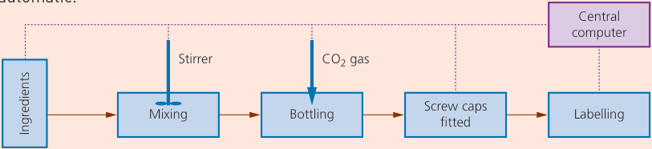

▲ **Figure 6.3** 

> **Find out more:** Find out: - **i** which sensors are used in modern aircraft when using auto pilot - **ii** how sensors and actuators are used to control the flaps, throttle and rudder - **iii** why airplanes use the ‘three computer system’.

## **Transport** 

As with industrial processes, many of the automated systems in transport refer to robotic systems (for example, autonomous buses/cars, autonomous trains and unpiloted aircraft). These will be considered in Section 6.2. 

But automated systems are still used in manually controlled transport, which includes cars, buses/lorries, trains and aircraft. (Examples 3 and 4 which follow, will use cars as the application.) 

For example, modern trains will use an automatic signal control system. If the driver of the train goes through a red (stop) light, then the computer will automatically stop the train. This will make use of sensors at the side of the track sending signals to the on-board computer; actuators will be used to apply the brakes. Airplanes extensively use automatic pilots, which control the wing flaps, throttle and rudder to maintain the correct height, speed and direction. 

**Example 3: Self-parking cars** 

The driver goes along the row of parked cars. On-board sensors and cameras gauge the size of any parking spaces, and the on-board computer warns the driver if a suitable space has been found. The driver then selects auto-parking and the on-board computer takes over. Actuators are used to operate the steering rack, brakes and throttle under the full control of the computer. This allows the car in Figure 6.4 to go from Step 1 to Step 2 automatically and complete the parking manoeuvre with no driver intervention. 

Sensors in the bumpers of the car are both transmitters and receivers. The sensors transmit signals that bounce off objects and are reflected back. The car’s on-board computer uses the amount of time it takes for the signal to return to the sensor to calculate the position of any objects. The sensors give the computer a 3D image of its surroundings. This allows the car to fit into its parking space automatically with no driver intervention. (Note: cheaper and older self-parking systems are not fully automatic; they require the driver to operate the brakes and throttle manually and only control the steering.) 

The main advantages of this automated system are: 

- **»** allows the same number of cars to use fewer parking spaces 

- **»** avoids traffic disruption in cities (a manually controlled car takes several seconds to fit into a parking space) 

- **»** cars can fit into smaller spaces 

- **»** fewer dents and scratches to cars (reduced insurance claims) 

- **»** safer system since sensors monitor all objects, including young children (the car’s manoeuvre will be stopped if any new object is encountered) 

- **»** very consistent results. 

The main disadvantages of this automated system are: 

- **»** over-reliance on automated systems by the driver (loss of skills) 

- **»** faulty/dirty sensors or cameras can send false data/images to the on-board computer which could lead to a malfunction 

- **»** kerbing of wheels is a common problem since the sensors may not pick-up low kerbs 

- **»** expensive option that doesn’t really save the driver any money 

- **»** requires additional maintenance to ensure it functions correctly at all times. 

## **Activity 6.2** 

This time the driver needs to reverse in between two other cars and park at 90° to the direction of travel. 

Describe what additional information is needed to allow the car to park between two cars within the parallel lines. 

What extra sensor device(s) might be needed to give this additional information? 

## **Example 4: Adaptive cruise control** 

- **Figure 6.6** Adaptive cruise control 

**Adaptive cruise control** makes use of sensors, an on-board computer and actuators to allow a car to remain a safe distance from another vehicle. 

The driver will set a cruising speed (for example, 100 kph) on his touch screen Receive signals in the car. Lasers (set into the bumpers of the car) are used to send out signals constantly. The lasers bounce off Signals sent to actuators to the vehicle in front of the car and are Calculate distance apply brakes/reduce throttle reflected back to the car’s sensors. The time taken for the signal to bounce back Yes is used by the on-board computer to calculate the distance between the two vehicles. If the car is getting too close is distance < safe to the vehicle in front, the computer will distance? send signals to slow the car down. This is done by actuators applying the brakes and/or reducing the throttle. If the disNo tance between vehicles is greater than the safe distance, the computer will Signals sent to check to see if the current speed equals actuators to No Yes is speed = set value? the value set by the driver. If the speed decrease or is different to the set speed, the comincrease throttle puter sends signals to the actuators to increase or decrease the throttle. 

- **Figure 6.7** Flowchart showing how adaptive cruise control works 

## **Activity 6.3** 

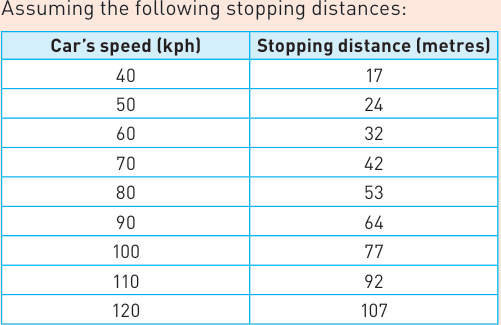

Using figure 6.7 and the data in the table above, explain how the on-board computer would calculate if a car was too close to the vehicle in front and apply the brakes if necessary. (It is not necessary to show all the maths, it is sufficient to explain what would need to be done. However, this could be a class exercise using a spreadsheet or small computer program). 

## **Agriculture** 

There are many examples of the use of automated systems in agriculture. Again, many of the systems involve robotics, which is fully described in Section 6.2. We will now consider one important example that is being used in Brazil to irrigate crops automatically. 

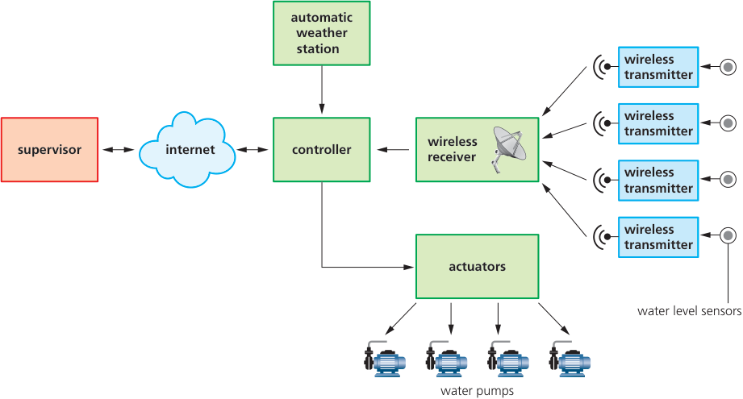

- **Figure 6.8** Automatic irrigation system 

The watering of crops (irrigation) is fully automatic and also involves considerable amounts of wireless transmission. This allows the system to be used in very remote areas that are vast in size – some of the fields are more than 10 km[2] in area. 

Data from an automatic weather station (see next example) is received by the **controller** (a computer system) every ten minutes. This is particularly important if very wet or very dry conditions are being predicted or detected by the weather station. Ultrasonic water level sensors are used in the crop fields that measure the amount of water in the irrigation channels. The sensors send their data back via wireless transmitters. This data is then picked up by the wireless receiver, which sends the data back to the controller. The controller then uses this data, together with the data from the weather station, to decide whether it is necessary to stop or start a series of water pumps. This is done by sending signals to actuators, which operate the pumps. Although the whole system is fully automatic, a supervisor still monitors the process remotely. Using a schematic of a number of processes on a computer screen and via internet links to the controllers, the supervisor can oversee several irrigation processes from one central point. If the supervisor wishes to further increase or reduce the water supply in any of the irrigation systems, they can override the controller if necessary. 

The main advantages of this automated system are: 

- **»** reduced labour costs since the system only needs a supervisor to monitor vast areas (if any maintenance is needed, then a dedicated team can cover all of the irrigation systems rather than having a separate team for each system) 

- **»** better and more efficient control of the irrigation process 

- **»** better control of precious resources, such as water 

- **»** faster response than a human having to manually check many kilometres of irrigation channels 

- **»** safer (temperatures in the fields could be 40°C and other risks could exist) 

- **»** different crops may require different irrigation requirements (for example, rice crops need flooding conditions, whereas orange trees like dry conditions); it is possible to program the controllers so that different growing conditions can be maintained simultaneously. 

The main disadvantages of this automated system are: 

- **»** expensive to set up initially (expensive equipment needs to be bought) 

- **»** very high maintenance costs are associated with automated systems (also require specialist technicians if a fault occurs, which could be a problem in some remote areas of the world) 

- **»** increased need to maintain the water channels to ensure the system works correctly at all times (a blocked or collapsed channel wouldn’t be picked up by the automated system, which could result in some areas being over-watered and some areas being starved of water). 

## **Weather (stations)** 

Automated weather stations are designed to save labour and to gather information from remote regions or where constant weather data is a requirement. Automated weather stations require a microprocessor, storage (database), battery (usually with solar-powered charging) and a range of sensors: 

- **»** thermometer (to measure temperature) 

- **»** anemometer (to measure wind speed) 

- **»** hygrometer (to measure humidity) 

- **»** barometer (to measure air pressure) 

- **»** level sensor (to measure rain fall) 

- **»** light sensor (to measure hours of daylight). 

The data from sensors is all sent to a microprocessor; any calculations are then done (for example, calculate hours of daylight, actual rainfall and wind direction). The data from the sensors and the calculated values are then stored on a central database. Some automated weather stations are sited near airports, where reports are sent out automatically every five minutes to pilots in the vicinity of the airport. 

The only part of the weather station that needs to use actuators is the ‘tipping bucket rain gauge’. At a pre-determined time interval, a signal is sent from the microprocessor to an actuator to operate a piston, which tips a bucket that was collecting rain water. The water is tipped into a vessel where level sensors are then used to measure the amount of rainfall that fell during the required time interval. 

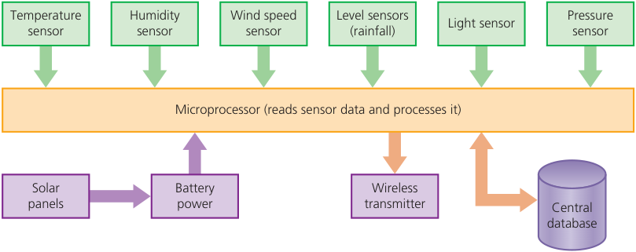

- **Figure 6.9** Automated weather station 

## **Activity 6.4** 

Find out all of the advantages and disadvantages of using automated weather stations. 

Gather all the results from the whole class, and put your results into a table as follows: 

**Advantages Disadvantages** 

## **Activity 6.5** 

- **1** Describe how automated weather stations can be used in the fight against climate change. 

- **2** A large greenhouse is being used to grow tomatoes under controlled conditions. 

   - For optimum growth, the tomatoes require the right lighting levels, correct temperature and regular watering. Describe how automated systems could be used to ensure the correct growing conditions are maintained. The only human involvement would be as a remote supervisor. (You might find it useful to draw a diagram of your automated system showing sensors, microprocessor and any actuators.) 

- **3** A new car being developed utilises many automated systems. In particular: 

   - **i** the ability to recognise road signs **ii** the ability to predict when to change to the correct gear for the road condition. 

   - Describe how sensors, actuators and an on-board computer allow the car to take the necessary action automatically if: 

   - it encounters road works with a speed limit of 60 kph so that the car maintains the correct speed 

   - the car is on a very twisty road where the correct gear is needed for optimum performance. 

- **4** One example of an automated system is the control of entry and exit to a car park. Cameras take a photograph of a car’s number plate on entry before opening a barrier. At the exit, another camera captures a car’s number plate before raising the barrier. Describe how sensors, cameras, actuators and a microprocessor can be used to: 

   - **i** control the raising and lowering of the entry and exit barriers 

   - **ii** ensure that the car exiting the car park has paid the correct parking fee before it can exit 

   - **iii** describe the advantages and disadvantages of this car parking system. 

## **Gaming** 

Gaming devices involve sensors to give a degree of realism to games: 

- **» accelerometers** (these measure acceleration and deceleration and therefore measure and respond to tilting the gaming device forward/backward and side to side) 

- **»** proximity sensors (used in smart touch pads; here electrodes are embedded in touch pads that can detect hand/finger position thus increasing user awareness). 

Embedded accelerometers and proximity sensors (together with a microcontroller) in games consoles allow increased human interaction with the game. This allows players to take actions that simulate real events happening, giving a more immersive games experience. 

## **Activity 6.6** 

What are the advantages and disadvantages of using these immersive games consoles? 

Are any other sensors used in games consoles other than accelerometers and proximity sensors? 

## **Lighting** 

Microprocessor-controlled lighting was discussed in Section 3.1.5 (Embedded systems). The example used in Chapter 3 was the control of lighting in an office using: 

- **»** light sensors (to automatically switch lights on or off depending on the ambient lighting) 

- **»** motion sensors (to automatically turn lights on in a room when somebody enters) 

- **»** infrared sensors (to be used either as a motion detector or as part of the security system). 

## **Example 6: Lighting system in a house** 

The example we will consider here is used in a house: 

- **»** where lights in the garden are turned on automatically when someone enters the garden or it turns dark 

- **»** where a lighting show is part of a microprocessor-controlled water fountain display; the lighting only comes on when it becomes dark. 

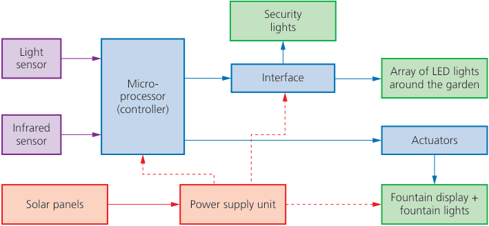

- **Figure 6.10** Automatic lighting system 

As it becomes dark, the light sensor value will change, and the microprocessor will send signals to the interface to control the array of LED lights around the garden. Data from the infrared sensor would also be used (during day and night) as a security device whenever the house is unoccupied. 

Also, as it becomes dark, the lighting show in the fountain could also be initiated. This could involve a pre-programmed display involving changing colours under the control of the microprocessor. The fountain display itself will also be under microprocessor control with signals being sent to actuators to turn water pumps on and off according to the installed program. The whole system will be fully automated. 

The main advantages of this automated system are: 

- **»** it is possible to control light sources automatically 

- **»** a reduced energy consumption (since lights are only turned on when necessary) 

- **»** wireless connections can be chosen which are much safer (no trailing wires) 

- **»** longer bulb life (due to dimming or switching off when not in use) 

- **»** possible to program new light displays for various occasions. 

The main disadvantages of this automated system are: 

- **»** expensive to set the system up in the first place 

- **»** if wireless connections chosen (for safety reasons), they can be less reliable than wired systems 

- **»** to ensure consistent performance, the automated system will require more maintenance (which can be expensive). 

## **Science** 

Automated systems in scientific research are widely used. There are literally thousands of possible applications. The example we will use here is the automatic control of a laboratory experiment which requires accuracy and repeatability. 

## **Example 7: Chemical process in a laboratory** 

Imagine an experiment in a pharmaceutical laboratory where two chemicals are reacted together in a vessel. One of the chemicals is being added from a piece of equipment (‘A’) known as a **burette** (which has a tap to control the flow of liquid; the tap is operated automatically using a small actuator) to a reaction vessel (‘B’). Once the reaction is complete, it turns a bright orange colour (see Figure 6.11). The whole process is under microprocessor control: 

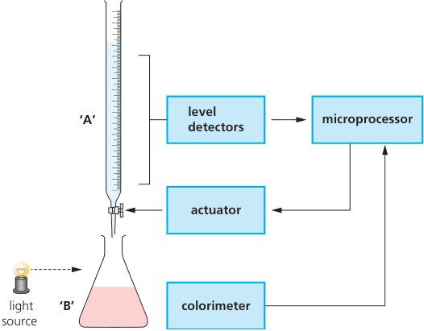

▲ **Figure 6.11** Pharmaceutical laboratory experiment 

The level sensors measure how much liquid is being added from ‘A’; this data is sent to a microprocessor. Readings are also sent to the microprocessor from a colorimeter next to vessel ‘B’ (this instrument checks the colour of the chemical produced). The microprocessor controls the opening and closing of the tap in ‘A’; this is done by sending signals to an actuator that operates the tap. This means the microprocessor has automatic control of the experiment with no human interaction needed. This type of automated system is of great benefit to pharmaceutical companies when developing new drugs and vaccines (several experiments can be carried out at the same time with only one person needed to monitor the system). 

The main advantages of this automated system are: 

- **»** more consistent (repeatable) results 

- **»** less dangerous (especially if the chemicals used are hazardous) 

- **»** faster results (several different experiments can be done simultaneously) 

- **»** automatic analysis of the results is possible 

- **»** fewer highly trained staff needed for each experiment 

- **»** results/experiments can be monitored anywhere in the world in real time. 

The main disadvantages of this automated system are: 

**»** less flexible than when using human technicians 

**»** security risks are always present if the data is being shared globally 

**»** equipment can be expensive to buy and set up in the first place. 

Finally, there are many automated systems being used in both industry and scientific research that incorporate artificial intelligence (AI). It is therefore worth considering the generic advantages of using AI in these automated systems (also refer to Section 6.3): 

- **»** ability to access and store vast amounts of facts (very important in research) 

- **»** they are able to learn from huge amounts of available data that would overwhelm humans (or at the very least take them many months/years to do the same analysis) 

- **»** they are able to see patterns in results that could be missed by humans. 

While all of this is positive, there are a few disadvantages in this approach: 

- **»** a change in skills set (is it the human or the AI that controls the research?) **»** AI is dependent on the data which trains it. 

## **Activity 6.7** 

- **1 a** Name suitable sensors for each of the following automated systems. 

   - **i** Manufacture of a new vaccine that requires the mixing of four liquids in the ratio 1:2:3:4 as a single batch. The four liquids must be totally mixed and the temperature must be maintained at 35°C (+/- 1°C) which is a critical temperature. 

   - **ii** A lighting display has been set up in one room of an art gallery. A random sequence of different coloured lights is under microprocessor control. The display in the room only switches on when visitors walk into the room; at the same time, the room lights are also dimmed to give the most dramatic effect of the light display. 

      - **iii** A train uses automatic twin-doors. Both doors open automatically when the train stops. Both doors close again when no-one is still boarding or leaving the train. The doors have a safety mechanism so that a passenger cannot become trapped between the two closing doors. The train can only move off when every door on the train has been safely closed. 

   - **b** For **each** application in **part a** , give **two** advantages and **two** disadvantages of using automated systems. 

- **2** The eight statements on the left-hand side of the table are either true or false. Tick (✓) the appropriate box to indicate which statements are true and which statements are false. 

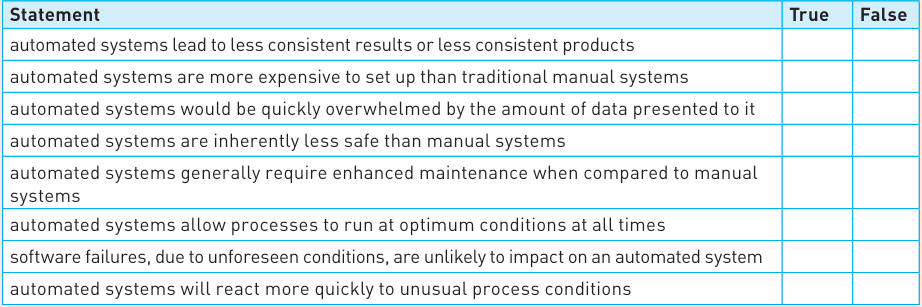

## 6.2 Robotics

### 6.2.1 What is robotics?

The word **robot** comes from the Czech word _**robota**_ (which means ‘forced labour’) and the term was first used in the 1920s play ‘Rossum’s Universal Robots’. The concept of the robot has fired the imagination of science fiction writers for countless years; indeed Isaac Asimov even composed his _**three laws of robotics**_ : 

- **»** a robot may not injure a human through action or inaction 

- **»** a robot must obey orders given by humans, unless it comes into conflict with law 1 

- **»** a robot must protect itself, unless this conflicts with law 1. 

So what is a robot in the real world? **Robotics** is a branch of (computer) science that brings together the design, construction and operation of robots. Robots can be found in: 

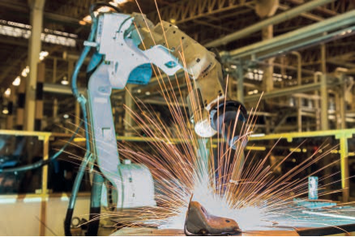

▲ **Figure 6.12** Robot welder 

## **»** in the home 

- **autonomous** floor sweepers (see Figure 6.13) 

- autonomous lawn mower 

- ironing robots (for example, ‘dressman’) 

- pool cleaning 

- automatic window cleaners 

- entertainment (‘friend’ robots) 

- **»** factories 

   - welding parts together 

   - spray-painting panels on a car 

   - fitting windscreens to cars 

   - cutting out metal parts to a high precision 

   - bottling and labelling plants 

   - warehouses (automatic location of items) 

▲ **Figure 6.13** Robot carpet sweeper 

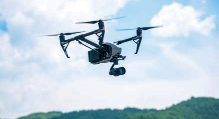

- **»** drones 

   - unmanned aerial vehicles (UAVs) are drones that are either remotely controlled or totally autonomous using embedded systems 

   - can be used in reconnaissance (for example, taking aerial photographs) 

   - can be used to make parcel deliveries (for example, Amazon). 

▲ **Figure 6.14** Reconnaissance drone 

### 6.2.2 Characteristics of a robot

To be correctly called a robot, they need to have the following characteristics: 

- **1** Ability to sense their surroundings: 

   - this is done via sensors (such as light, pressure, temperature, acoustic, and so on) 

   - sensors allow a robot to recognise its immediate environment and gives it the ability to determine things like size, shape or weight of an object, detect if something is hot or cold, and so on; all sensor data is sent to a microprocessor or computer. 

- **2** Have a degree of movement: 

   - they can make use of wheels, cogs, pistons, gears (etc.) to carry out functions such as turning, twisting, moving backwards/forwards, gripping or lifting 

   - they are **mechanical structures** made up of many parts (for example, motors, hydraulic pipes, actuators and circuit boards) 

   - they contain many **electrical components** to allow them to function 

   - can make use of **end effectors** (different attachments to allow them to carry out specific tasks such as welding, spraying, cutting or lifting). 

- **3** Programmable: 

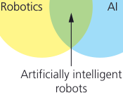

- **Figure 6.15** Robots and AI 

- they have a ‘brain’ known as a **controller** that determines the action to be taken to perform a certain task (the controller relies on data sent from sensors or cameras, for example) 

- controllers are **programmable** to allow the robots to do certain tasks. 

It is important to realise that robotics and artificial intelligence (AI) are almost two entirely different fields: 

## TWO IMPORTANT NOTES: 

- **1** Many robots don’t possess artificial intelligence (AI) since they tend to do repetitive tasks rather than requiring adaptive human characteristics. 

- **2** It is important not to confuse _physical robots_ with _software robots_ such as: 

   - search engine _**bots**_ or _**WebCrawlers**_ (these ‘robots’ roam the internet scanning websites, categorising them for search purposes) 

   - chat bots (these are programs that _pop up_ on websites that seem to enter some form of conversation with the web user – see Section 6.3) 

According to our definition above, software robots are not true robots. 

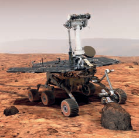

▲ **Figure 6.16** Independent robot 

Physical robots can be classified as **independent** or **dependent** : 

**»** Independent robots: 

   - have no direct human control (they are said to be **autonomous** , for example, an **autonomous** vehicle) 

   - can replace the human activity totally (no human interaction is required for the robot to function fully). 

- **»** Dependent robots: 

   - have a human who is interfacing directly with the robot (the human interface may be a computer or a control panel) 

   - can supplement, rather than totally replace, the human activity (for example, in a car assembly plant where both humans and robots work together to produce a car). 

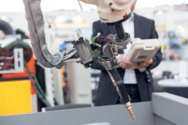

- **Figure 6.17** Dependent robot 

### 6.2.3 The role of robots and their advantages and disadvantages

We will now consider the use of robots in a number of areas, together with the advantages and disadvantages of using robots in each of these areas: 

- **»** industry 

- **»** transport 

- **»** agriculture 

- **»** medicine 

- **»** domestic (home) use 

- **»** entertainment. 

## **Industry** 

Robots are used in many areas of industry, from heavy lifting work right through to delicate procedures. Examples include: paint spraying of car bodies, welding bodywork on cars, manufacturing of microchips, manufacturing electrical goods and automatic warehouses. 

Control of robots is either through embedded (built-in) microprocessors or directly linked to a computer system. Programming of the robot to do a series of tasks is generally done in two ways: 

- **1** The robot is programmed with a sequence of instructions which allow it to carry out the series of tasks (for example, spraying a car body with paint). 

- **2** Alternatively, a human operator manually carries out the series of tasks; this can be done in two ways. In our example, we will assume an object is being painted using a robot arm. 

   - Figure 6.18 shows a robot arm equipped with a spray gun end-effector. Different **end-effectors** allow the robot arm to carry out many different tasks: 

   - **i** the robot arm is guided manually by a worker when spraying the object; each movement of the arm is stored as an instruction on the computer; **or** 

   - **ii** the worker straps sensors to his own arm and sprays the object; each movement is stored as a set of instructions on a computer; the sensors send back information such as position relative to the object, arm rotation and so on – this information forms part of the instructions stored on the computer. 

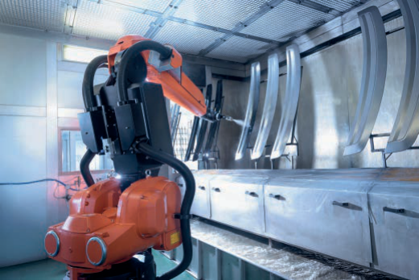

Whichever method is used, once the instructions have been saved, each series of tasks can then be carried out by a robot arm automatically. Each instruction will be carried out identically every time (for example, assembling parts in a television) giving a consistent product. 

Robots are equipped with sensors so they can gather important information about their surroundings and also preventing them from doing ‘stupid things’; for example, stopping a robot spraying a car if no car is present, or stop the spraying operation if the supply of paint has run out, and so on. 

▲ **Figure 6.18** Robot with spray gun end-effector 

Robots are very good at repetitive tasks. However, if there are specialist tasks that require ‘thinking’ to cope with variable circumstances, (for example, making specialist glassware for some scientific work) then it is often better to still use human operators. 

Table 6.1 shows the relevant advantages and disadvantages of using robots in industrial applications: 

- **Table 6.1** Advantages and disadvantages of using robots 

|**Advantages**|**Disadvantages**|
|---|---|
|||
|robots are capable of working in conditions that may be hazardous to humans|robots can find it difficult to do ‘non-standard’ tasks (for example, windscreen being fitted to a car is cracked)|
|robots work 24/7 without the need to stop||
|robots are less expensive in the long run (since there will be fewer salaries to pay)|robots can lead to higher unemployment amongst manual labour tasks|
|robots are more productive than humans (higher productivity)|there is a risk of deskilling when robots take over certain tasks (for example, welding and paint spraying)|
|although not necessarily more accurate, robots are more consistent||
|robots are better suited to boring, repetitive tasks than humans (therefore less likely to make mistakes)|factories can now be moved to anywhere in the world where operation costs are lower (leading again to unemployment in some countries)|
|there will be less cost in heating and lighting (robots don’t need good light or warmth)|robots are expensive to buy and set up in the first place|

## **Transport** 

Driverless vehicles are increasing in number every year. These are very complex robots, but the big problem is not really the technology (since problems will be ironed out through time), it is human perception. It will take a large leap of faith for humans to ride in a driverless car or an airplane with no pilot. We are already used to autonomous trains since these are used in many cities throughout the world. These systems have been generally accepted; but that is probably because trains don’t overtake other trains and have a very specific track to follow (see notes later). 

## Autonomous cars and buses 

In this section, we will consider autonomous cars as our example. Autonomous cars use sensors, cameras, actuators and microprocessors (together with very complex algorithms) to carry out their actions safely. Sensors (radar and ultrasonics) and cameras allow the control systems in cars to perform critical functions by sensing the dynamic conditions on a road. They act as the ‘eyes’ and ‘ears’ of the car. 

Microprocessors process the data received from cameras and sensors and send signals to actuators to perform physical actions, such as: 

- **»** change gear 

- **»** apply the brakes 

- **»** turn the steering wheel. 

Cameras catch visual data from the surroundings, while radar and ultrasonics allow the vehicle to build up a 3D image of its surroundings (very important when visibility is poor, such as heavy rain, fog or at night). Suppose an autonomous car is approaching a set of traffic lights that are showing red. The first thing is the control system in the car needs to recognise the road 

sign and then check its database as to what action to take. Since the traffic light shows red, the microprocessor must send signals to actuators to apply brakes and put the gear into ‘park’. Constant monitoring must take place until the light changes to green. When this happens, the microprocessor will again instruct actuators to put the car into first gear, release the brakes and operate the throttle (accelerator). This is a very complex set of operations since the microprocessor must constantly check all sensors and cameras to ensure moving off is safe (for example, has the car in front of it broken down or has a pedestrian started to cross the road, and so on). To go any further is outside the scope of this book. 

Let us now consider some of the advantages and disadvantages specific to autonomous vehicles: 

## ▼ **Table 6.2** Advantages and disadvantages of autonomous vehicles 

|**Advantages of autonomous vehicles**|**Disadvantages of autonomous vehicles**|
|---|---|
|||
|safer since human error is removed leading to fewer accidents|very expensive system to set up in the first place (high technology requirements)|
|better for the environment since vehicles will operate more efficiently|the ever-present fear of hacking into the vehicle’s control system|
|reduced traffic congestion (humans cause ‘stop-and-go’ traffic known as**_‘the phantom traffic jam’_**, autonomous vehicles will be better at smoothing out traffic flow reducing congestion in cities)|security and safety issues (software glitches could be catastrophic; software updates would need to be carefully controlled to avoid potential disasters)|
|increased lane capacity (research shows autonomous vehicles will increase lane capacity by 100% and increase average speeds by 20%, due to better braking and acceleration responses together with optimized distance between vehicles)|the need to make sure the system is well-maintained at all times; cameras need to be kept clean so that they don’t give false results; sensors could fail to function in heavy snowfall or blizzard conditions (radar or ultrasonic signals could be deflected by heavy snow particles)|
|reduced travel times (for the reasons above) therefore less commuting time|driver and passenger reluctance to use the new technology|
|stress-free parking for motorists (the car will find car parking on its own and then self-park)|reduction in the need for taxis could lead to unemployment (imagine New York without its famous yellow cabs!)|

## Autonomous trains 

As mentioned earlier, autonomous (driverless) trains have been around for a number of years in a number of large cities. As with other autonomous vehicles, driverless trains make considerable use of sensors, cameras, actuators and on-board computers/microprocessors. Autonomous trains make use of a system called **LiDaR** (Light Detection and Ranging); LiDaR uses lasers which build up a 3D image of the surroundings. Other sensors (such as proximity sensors on train doors) and cameras (including infrared cameras) are all used for various purposes to help control the train and maintain safety. The control system in the train also makes use of global positioning satellite (GPS) technology, which allows accurate changes in speed and direction to be calculated. Again, actuators pay a huge role here in controlling the train’s speed, braking and the opening and closing of the train doors. 

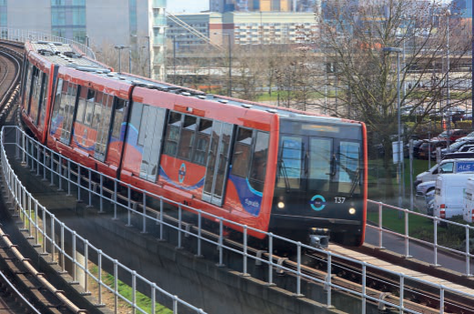

- **Figure 6.19** Autonomous train (London Transport) 

Let us now consider some of the advantages and disadvantages specific to autonomous trains: 

## ▼ **Table 6.3** Advantages and disadvantages of autonomous trains 

|**Advantages of autonomous trains**|**Disadvantages of autonomous trains**|
|---|---|
|||
|this improves the punctuality of the trains|the ever-present fear of hacking into the vehicle’s control system|
|reduced running costs (fewer staff are required)|system doesn’t work well with very busy services (at the moment)|
|improves safety since human error is removed|high capital costs and operational costs initially (that is, buying the trains, expensive signalling and control equipment and the need to train staff)|
|minimises energy consumption since there is better control of speed and an optimum service requires less energy (trains stuck in stations still use energy)|ensuring passenger behaviour is acceptable particularly during busy times (for example, jamming doors open on trains, standingtoo near the edge of platforms and so on)|
|it is possible to increase the frequency of trains (automated systems allow for shorter times between trains)|passenger reluctance to use the new technology|
|it is easier to change train scheduling (for example, more trains duringbusier times)|no drivers mean there will be a need for CCTV to monitor railway stations|

## Autonomous (unpiloted) airplanes 

Airplanes have used auto-pilots for many years to control flights. Human pilots only take over during take-off and landing. Autonomous (pilotless) airplanes would make even more extensive use of sensors, actuators and microprocessors to control all stages of the flight. Some of the main features of a control system on a pilotless airplane would include: 

- **»** sensors to detect turbulence to ensure smooth flights 

- **»** an increase in self-testing of all circuits and systems 

- **»** sensors that would automatically detect depressurisation in the cabin; thus allowing for quick stabilisation of the airplane 

- **»** use of GPS for navigation and speed calculations 

- **»** use of actuators to control, for example, throttle, flaps (on the wings) and the rudder. 

Let us now consider some of the advantages and disadvantages specific to pilotless airplanes: 

- **Table 6.4** Advantages and disadvantages of pilotless airplanes 

|**Advantages of pilotless airplanes**|**Disadvantages of pilotless airplanes**|
|---|---|
|||
|improvement in passenger comfort (reasons given earlier)|security aspects if no pilots on-board (for example, handlingterrorist attacks)|
|reduced running costs (fewer staff are required)|emergency situations during the flight may be difficult to deal with|
|improved safety (most crashes of airplanes have been attributed to pilot-induced errors)|hacking into the system (it might be possible to access flight controls)|
|improved aerodynamics at the front of the airplane since there would no longer be the need to include a cockpit for the pilots|passenger reluctance to use the new technology|
||software glitches (recent software issues with modern airplanes have highlighted that software glitches can have devastating results)|

## **Agriculture** 

With the world’s population predicted to reach nine billion by the year 2050, more efficient agriculture via increased use of robotics is inevitable. Robots could replace slow, repetitive and dull tasks allowing farmers to concentrate on improving production yields. We will consider the following five areas where robotics could play a big role: 

- **»** harvesting/picking of vegetables and fruit 

- **»** weed control 

- **»** phenotyping (plant growth and health) 

- **»** seed-planting and fertiliser distribution 

- **»** autonomous labour-saving devices. 

## Harvesting and picking 

- **»** robots have been designed to do this labour-intensive work; they are more accurate (only pick ripe fruit, for example) and much faster at harvesting 

- **»** for the reasons above, this leads to higher yields and reduces waste (for example, **vegebot** (Cambridge University) uses cameras to scan, for example, a lettuce and decide whether or not it is ready to be harvested 

- **»** a second camera in **vegebot** (near the cutting blades) guides an arm to remove the lettuce from its stalk with no damage. 

## Weed control 

- **»** weed management robots can distinguish between a weed and crop using AI (see Section 6.3) 

- **»** examples of weed control robots are being used in France (by MoutonRothschild) to remove weeds between grape vines in their vineyards; this saves considerably on labour costs and improves vine growth 

- **»** weed control robots use GPS tracking to stay on course to move along the rows of vines and remove the weeds; a weed removal blade is operated by an actuator under the control of the controller (microprocessor) in the robot 

- **»** very often a **drone** (flying robot) is used first to do an aerial view of the vineyard, so that a programmed course of action can be produced, which is then sent to the weed control robot’s memory. 

## Phenotyping 

- **» phenotyping** is the process of observing physical characteristics of a plant in order to assess its health and growth 

- **»** robots designed to do phenotyping are equipped with sensors (including spectral sensors and thermal cameras) that can create a 3D image/model of the plant, thus allowing it to be monitored for health and growth 

- **»** machine learning (see Section 6.3) is used to recognise any issues with leaves (for example, if they have a blight or have the wrong colour) so that the robot can convey this back to the farmer 

- **»** these robots are much more accurate and faster at predicting problems than when done manually. 

## Seed-planting drones and fertiliser distribution 

- **»** drones (flying robots) can produce an aerial image of a farm sending back a ‘bird’s eye view’ of the crops and land 

- **»** they allow seed-planting to be done far more accurately 

- **»** they also allow for more efficient fertiliser-spreading to reduce waste and improve coverage (this is much more efficient than conventional crop spraying) 

- **»** drones can also be used in cloud seeding where the drone can add silver iodide crystals to a cloud forcing it to give up its rainwater 

- **»** the drones use a very complex camera system to target seeding and allow fertiliser spraying. 

## Autonomous agriculture devices 

Several of the devices described above could be referred to as autonomous. The following list summarises some of the devices that can work independently of humans: 

- **»** grass mowers/cutters 

- **»** weeding, pruning and harvesting robots 

- **»** seeding robots 

- **»** fertiliser spraying 

- **»** all of these devices use sensors and cameras to go around obstacles, or they can even be programmed to ‘go to sleep’ if the weather turns bad. 

## **Activity 6.8** 

Look through all the notes on use of robots in agriculture, and make a table showing all the advantages and disadvantages of using robots. 

## **Activity 6.9** 

- **1** Describe three areas where robots can be used in agriculture to increase efficiency and reduce labour requirements. For each example, write down the advantages and disadvantages of using robots. 

- **2** Five statements are shown on the left and five computer terms are shown on the right. 

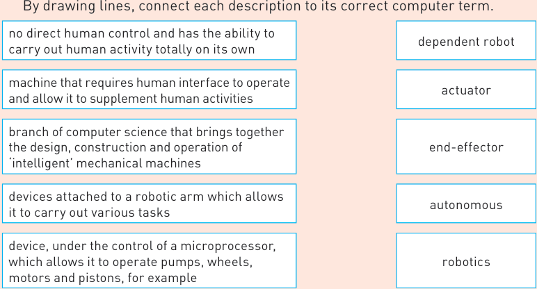

## **Medicine** 

- **»** robots are used in surgical procedures, which makes the operation safer and also makes the procedures quicker and less costly 

- **»** robots can be used from monitoring patients to doing actual minor surgery 

- **»** the disinfecting of rooms and operating theatres can all be done by autonomous robots (similar to the types described in agriculture) 

- **»** robots can take blood samples from patients: 

   - less painful to patients since the robot is better at determining a ‘good vein’ 

   - safer to doctors and nurses if the patient has an infectious disease 

   - doctors and nurses can be freed up to do more skilled work 

- **»** microbots can be used in target therapy: 

   - these use microscopic mechanical components (including microprocessor) to localise a drug or other therapy to target a specific site causing less damage to surrounding tissue 

- **»** prosthetic limbs are now mini robots in their own right (since they meet the three characterisations of what defines a robot) 

   - bionic skins and neural implants that interface with the human nervous system (of the damaged limb) giving feedback to allow for better control of the prosthetic limb (again sensors and actuators are used to give humanlike responses, such as grip). 

## **Domestic robots** 

Robots used around the house vary from devices to carry out household chores through to devices used to entertain people. For example: 

- **»** autonomous vacuum cleaners: 

   - these use proximity sensors and cameras to avoid bumping into obstacles and allows them to cover a whole room automatically 

- **Figure 6.20** Vector robot (personal assistant) 

   - these robots have a microprocessor to control the overall operation of the device; this also allows the user to program the device 

   - actuators are used to control motors which allow movement forward/ backward and from side to side 

- **»** autonomous grass cutters (mowers): 

   - these use the same type of sensor, camera, microprocessor and actuator set up as vacuum cleaners 

- **»** personal assistants (such as ‘Vector’) 

   - this is a robot controlled by a micro-processor that also uses cloud connectivity to connect to the internet 

   - it understands voice commands (using a microphone) and will answer any questions it is asked 

   - it also makes use of an HD camera, utilising computer vision, allowing it to recognise somebody’s face as well as navigate a room (using proximity sensors and actuators) to steer around objects in its way. 

## **Robots used in entertainment** 

The use of robots in the entertainment industry is increasing. They are now found in areas such as: 

- **»** entertainment parks and arenas/venues 

- **»** the film and TV industry. 

The following examples indicate where robots are being used in the world of entertainment. The reader is advised to research the ever-increasing number of examples. 

- **»** theme parks are now using autonomous robots to entertain visitors to the park; these robots (often dressed as cartoon characters) can interact with visitors to allow them to engage safely with the theme park attractions and make the whole experience ‘more realistic’ 

- **»** music festivals are much more immersive for the audience; robotic methods are used to control lighting (including laser displays), visual effects and animation (e.g. superimposing an actor’s image onto a robotic caricature and synchronising mouth movements); the visual performances can be fully synchronised with the music 

- **»** use of robots to control cameras; for example, keeping them steady and autofocusing when moving around a scene; the movie _Gravity_ used many robots to operate cameras, props and the actors (for example, to give an actor the appearance of moving around in the vacuum of space uncontrollably, robot arms were used to simulate human behaviour and produce life-like moving images) 

- **»** humanoid robots (either remote-controlled or pre-programmed) can perform ‘stunt’ action in movies/ television by performing tasks impossible for a human to do; they use CGI (computer-generated imagery) and image capture techniques to generate special effects 

- **»** robots are capable of producing special effects with a precision, speed and coordination which is beyond human capabilities; actions and special effects can be synchronised to within a millisecond and produce fully coordinated/ synchronised sound effects (e.g. movement of the mouth to match the sounds produced in a realistic manner). 

## **Activity 6.10** 

Research five robots used as entertainment. 

- **a** Give the names of these five robots. 

- **b** Write down the advantages and disadvantages of the five robots you chose. 

## **Activity 6.11** 

- **1** Write down **four** advantages and **four** disadvantages of using robots in the manufacturing industry. 

- **2** To be referred to as a robot, it needs to be demonstrated that it has the following three characteristics: 

   - ability to sense its surroundings 

   - ability to move in some way 

   - a perceived intelligence. 

   - For **each** of these **three** characteristics, describe **two** features you could use to demonstrate that a device could be called a robot. 

- **3** Choose suitable words/phrases from the following list to correctly complete the paragraph that follows: Word list: activators lasers 

activators lasers actuators light detection and ranging autonomous primary vision cameras radar and ultrasonics lane assist sensors 

Driverless cars are described as ………………………..; these vehicles use …………………….., ……………………., microprocessors, software and …………………….. to allow them to function. A 3D image of the surroundings is produced by using ………………………. . Parking and nose to tail driving is achieved by using ………………………….. in the bumpers. 

   - Robots can collect data from their surroundings by using …………… . The data is then sent to a …………… to allow the robot to build up an image of its …………… Robots can perform various tasks by using different …………… . The ‘brain’ of the robot is often called a …………… which contains …………… to allow it carry out various tasks automatically. Many robots are not (artificially) intelligent, since they only do …………… tasks rather than requiring …………… human characteristics. 

- **5** Autonomous robots are used in space exploration and in undersea exploration. These robots have to either work in the near vacuum of space or the very high-water pressures under the oceans. They need to be equipped with many sensors and cameras to carry out their remote tasks. 

   - **a** Undersea robots are being used to investigate shipwrecks. Describe how the sensors and cameras could be used to photograph the shipwrecks. Also describe the role of the microprocessor and actuators in taking photographs and any samples needed from the shipwreck for further investigation. 

   - **b** A space exploration robot has been sent on a mission to Mars. The robot needs to move around the surface of the planet safely 

taking photographs and also taking soil/rock samples for later analysis. 

**i** Describe how sensors, actuators and a microprocessor can be used to take samples from the planet’s surface. 

**ii** Describe three uses of the cameras on this autonomous robot. 

**c** Describe the advantages and disadvantages of using autonomous robots in both undersea and outer space exploration. 

**d** Give two other examples of where autonomous robots could be used. 

## 6.3 Artificial intelligence (AI)

### 6.3.1 Introduction

**Artificial intelligence (AI)** is a branch of computer science dealing with the simulation of intelligent human behaviour by a computer. This is often referred to as the **cognitive** functions of the human brain (that is, the mental process of acquiring knowledge and understanding through thought, experience and the five senses). All of these cognitive functions can be replicated in a machine, and they can be measured against human benchmarks such as reasoning, speech and sight. 

### 6.3.2 Characteristics of AI

Essentially, AI is really just a collection of rules and data, and the ability to reason, learn and adapt to external stimuli. AI can be split into three categories: 

- **»** narrow AI – this occurs when a machine has superior performance to a human when doing one specific task 

- **»** general AI – this occurs when a machine is similar (not superior) in its performance to a human doing a specific task 

- **»** strong AI – this occurs when a machine has superior performance to a human in many tasks. 

Reasoning is the ability to draw reasoned conclusions based on given data/ situations. Deductive reasoning is where a number of correct facts are built up to form a set of rules which can then be applied to other problems (for example, if AI is used to produce the perfect cup of tea based on a number of facts, the machine will learn from the experience and apply its new rules in the making of a cup of coffee, hot chocolate, and so on – modifying its methodology where necessary). By carrying out a sequence of steps, the AI machine can learn, and next time it will know how to do the task more effectively and even apply it to a novel/new situation. Thus the AI system is capable of learning and adapting to its surroundings. AI can very quickly discern patterns (which in some cases, humans cannot) and then make predictions by adapting to the new data. How all this is done is beyond the scope of this book (interested readers can find out more about this topic by consulting _Cambridge International AS and A Level Computer Science,_ ISBN: 9781510457584). 

Examples of AI include: 

- **»** news generation based on live news feeds 

- **»** smart home devices (such as Amazon Alexa, Google Now, Apple Siri and Microsoft Cortana): 

   - the AI device interacts with a human by recognising verbal commands 

   - it learns from its environment and the data it receives 

- the device becomes increasingly sophisticated in its responses, thus showing the ability to use automated repetitive learning 

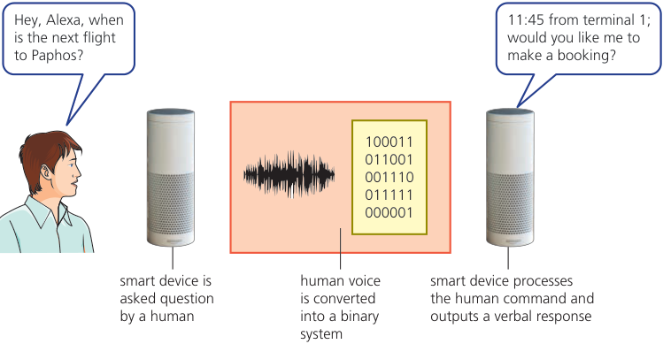

## ▲ **Figure 6.21** Smart home devices 

- **»** use of **chatbots** that interact through instant messaging, artificially replicating patterns of human interactions using AI to respond to typed or voice messages; when a question is asked, the chatbot responds using the information known at the time: 

**Hello! I am the Hodder Education Chatbot. How can I help you?** 

**I ordered the new A Level computer science textbook – when will it be delivered?** 

**Can you give me your order number please and I will check for you?** 

> **Find out more:** The Turing Test is a method to test a machine’s ability to match human intelligence levels. Find out how the _**Turing Test**_ is used. 

## ▲ **Figure 6.22** Chatbots 

- **»** autonomous cars (see Section 6.2) 

- **»** facial expression recognition 

   - algorithms identify key facial landmarks such as the corners of the eyebrows, corners of the mouth, and so on 

   - a combination of these landmarks can be used to map emotions (such as anger, fear, joy and surprise). 

### 6.3.3 AI systems

This section considers two types of AI system: 

- **»** expert system – a computer system that mimics the decision-making ability of a human; expert systems use AI to simulate the judgement and behaviour of a human or organisation that has expert knowledge and experience 

- **»** machine learning – this is the science of training computers with sample data so that they can go on to make predictions about new unseen data, without the need to specifically program them for the new data. 

## **Expert systems** 

**Expert systems** are a form of AI that has been developed to mimic human knowledge and experiences. They use knowledge and inference to solve problems or answer questions that would normally require a human expert. 

For example, suppose the user was investigating a series of symptoms in a patient. The expert system would ask a series of questions, and the answers would lead to its diagnosis. The expert system would explain its reasoning with a statement such as ‘ _impaired vision, lack of coordination, weak muscles, slurred speech and the patient used to work in a paint factory – the diagnosis is mercury poisoning_ ’ – the user could then probe deeper if necessary. 

The expert system will supply a conclusion and any suggested actions to take and it will also give the percentage probability of the accuracy of its conclusions (for example, the following statement could be made ‘ _Based on the information given to me, the probability of finding oil bearing rocks in location 123AD21G is about 21%_ ’). 

There are many applications that use expert systems: 

- **»** oil and mineral prospecting 

- **»** diagnosis of a patient’s illness 

- **»** fault diagnostics in mechanical and electronic equipment 

- **»** tax and financial calculations 

- **»** strategy games, such as chess 

- **»** logistics (efficient routing of parcel deliveries) 

- **»** identification of plants, animals and chemical/biological compounds. 

Expert systems have many advantages: 

- **»** they offer a high level of expertise 

- **»** they offer high accuracy 

- **»** the results are consistent 

- **»** they have the ability to store vast amounts of ideas and facts 

- **»** they can make traceable logical solutions and diagnostics 

- **»** it is possible for an expert system to have multiple expertise 

- **»** they have very fast response times (much quicker than a human expert) 

- **»** they provide unbiased reporting and analysis of the facts 

- **»** they indicate the probability of any suggested solution being correct. 

Expert systems also have disadvantages: 

- **»** users of the expert system need considerable training in its use to ensure the system is being used correctly 

- **»** the set up and maintenance costs are very high 

- **»** they tend to give very ‘cold’ responses that may not be appropriate in certain medical situations 

- **»** they are only as good as the information/facts entered into the system 

- **»** users sometimes make the very dangerous assumption that they are infallible. 

So what makes up an expert system? Figure 6.23 shows the typical structure of an expert system: 

## **Advice** 

**Explanation systems** are not explicitly covered in the syllabus (Figure 6.23). 

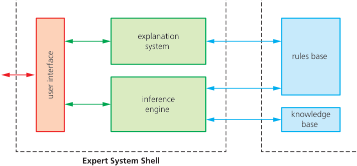

- **Figure 6.23** Expert system structure 

> **Find out more:** Using Figure 6.23, find out how the explanation system works and why it is included in a typical expert system.

## User interface 

- **»** method by which the expert system interacts with a user 

- **»** interaction can be through dialogue boxes, command prompts or other input methods 

- **»** the questions being asked usually only have Yes/No answers and are based on the responses to previous questions. 

## Inference engine 

- **»** this is the main processing element of the expert system 

- **»** the **inference engine** acts like a **search engine** examining the **knowledge base** for information/data that matches the queries 

- **»** it is responsible for gathering information from the user by asking a series of questions and applying responses where necessary; each question being asked is based on the previous responses 

- **»** the inference engine is the problem-solving part of the expert system that makes use of **inference rules** in the **rules base** 

- **»** since the knowledge base is a collection of **objects** and **attributes,** the inference engine attempts to use information gathered from the user to find an object that matches (making use of the rules base to find a match) 

## Knowledge base 

- **»** the knowledge base is a repository of facts 

- **»** it stores all the knowledge about an area of expertise obtained from a number of expert resources 

## **»** it is basically a collection of **objects** and their **attributes** ; for example: 

|**Object**|**Attribute 1**|**Attribute 2**|**Attribute 3**|**Attribute 4**|**Attribute 5**|**Attribute 6**|
|---|---|---|---|---|---|---|
||||||||
|dog|mammal|can be a pet|lives on land|makes bark sounds|body is covered in fur|walks on 4 legs|
|whale|mammal|not a pet|lives in water|makes sonic sound|body covered in skin|swims; no legs|
|duck|bird|not a pet|lives in water|makes quack sounds|body covered in feathers|swims; has two legs|

- **»** so if we had a series of questions: 

– is it a mammal? YES 

- can it be a pet? NO – does it live in water? YES – does it make sonic sounds? YES – is its body covered in skin? YES – does it have any legs? NO 

- conclusion: it is a WHALE. 

## Rules base 

- **»** the rules base is a set of inference rules 

- **»** inference rules are used by the inference engine to draw conclusions (the methods used closely follow human reasoning) 

- **»** they follow logical thinking like the example above; usually involving a series of ‘IF’ statements, for example: 

IF continent = “South America” AND language = “Portuguese” THEN country = “Brazil” 

## Setting up an expert system 

- **»** information needs to be gathered from human experts or from written sources such as textbooks, research papers or the internet 

- **»** information gathered is used to populate the knowledge base that needs to be first created 

- **»** a rules base needs to be created; this is made up of a series of inference rules so that the inference engine can draw conclusions 

- **»** the inference engine itself needs to be set up; it is a complex system since it is the main processing element making reasoned conclusions from data in the knowledge base 

- **»** the user interface needs to be developed to allow the user and the expert system to communicate 

- **»** once the system is set up, it needs to be fully tested; this is done by running the system with known outcomes so that results can be compared and any changes to the expert system made. 

Example use of an expert system (medical diagnosis) 

## **Input screen** 

- First of all an interactive screen is presented to the user • The system asks a series of questions **Expert system** about the patient’s illness • The user answers the questions asked • The inference engine compares the symptoms (either as multiple choice or YES/NO entered with those in the questions) knowledge base  looking for matches • A series of questions are asked based on • The rules base (inference rules) is used in the the user’s responses to previous questions matching process • Once a match is found, the system suggests the probability of the patient’s illness being identified accurately 

- **Output screen** • The expert system also suggests possible solutions and remedies to cure the patient or 

- • The diagnosis can be in the form of text recommendations on what to do next or it may show images of the human • The explanation system will give reasons for its anatomy to indicate where the problem diagnosis so that the user can determine the may be validity of the diagnosis or suggested treatment • The user can request further information from the expert system to narrow down even further the possible illness and its treatment 

   - **Figure 6.24** Use of an expert system 

## **Activity 6.12** 

Which computer terms, connected to AI, are being described below? 

- **a** a repository of facts made up of a collection of objects and their attributes 

- **b** informs the user of the reasoning behind the expert system’s conclusions and recommended actions 

- **c** made up of user interface and inference engine 

- **d** a sub-set of AI where machines mimic human activities and can manipulate objects using end-effectors all the way through to autonomous vehicles 

- **e** contains a set of inference rules. 

## **Machine learning** 

Recall the AI ‘family’ as shown in Figure 6.25. 

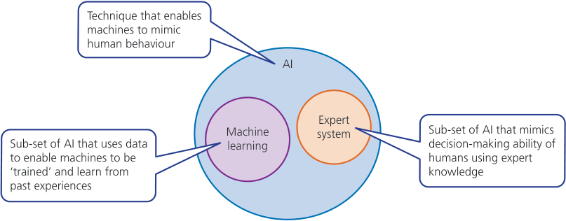

- **Figure 6.25** AI family 

**Machine learning** is a sub-set of artificial intelligence (AI), in which algorithms are ‘trained’ and learn from their past experiences and examples. It is possible for the system to make predictions or even take decisions based on previous scenarios. They can offer fast and accurate outcomes due to very powerful processing capability. One of the key factors is the ability to manage and analyse considerable volumes of complex data; some of the tasks would take humans years to complete without the help of machine learning techniques. One example that uses machine learning are the most sophisticated _**search engines**_ : 

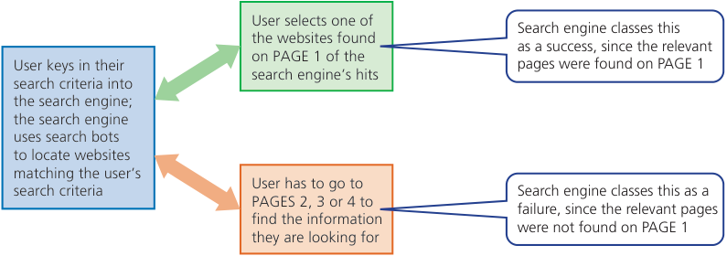

- **Figure 6.26** Search engine success or failure 

The search engine will learn from its past performance, meaning its ability to carry out searches becomes more and more sophisticated and accurate. 

## Differences between AI and machine learning 

- **Table 6.5** Difference between AI and machine learning 

|**AI**|**Machine learning**|
|---|---|
|||
|represents simulated intelligence in machines|this is the practice of getting machines to make decisions without being programmed to do so|
|the aim is to build machines that are capable of thinking like humans|the aim is to make machines that learn through data acquisition, so that they can solve new problems|

Examples of machine learning 

## **Example 1: Categorising email as spam** 

Consider email messages such as ‘ _You have won $2 million in the National Lottery_ ’; how can machine learning determine that this email should be put into your spam folder? 

- **»** A machine learning algorithm collects data about emails, such as email content, headers, senders name/email address and so on. 

- **»** It carries out a ‘cleaning’ process by removing _**stop words**_ (for example, the, and, a) and punctuation, leaving only the relevant data. 

- **»** Certain words/phrases are frequently used in spam (for example, lottery, earn, full-refund) and indicate that the incoming email is very likely to be spam. 

- **»** The machine learning model is built and a ‘training data set’ is used to train the model and make it learn using past email known to be spam. 

- **»** Once it is evaluated, the model is fine-tuned and tested live. 

## **Example 2: Recognising user buying history** 

When you visit an online retailer, such as Amazon, you might receive the message ‘ _customers who bought Hodder Education IGCSE ICT textbook also bought Hodder Education IGCSE Computer Science textbook_ ’. How is machine learning used to establish a user’s buying characteristics? 

- **»** This comes from _**collaboration filtering**_ , which is the process of comparing customers who have similar shopping behaviour to a new customer who has similar shopping behaviour. 

- **»** Suppose customer ‘A’ is very interested in playing football and they also bought a jazz CD, a book on Roman history and some health food. 

- **»** Two weeks later, customer ‘B’ who likes to go cycling also bought a similar jazz CD and a book on ancient Roman history. 

- **»** The machine learning algorithms will then recommend that customer ‘B’ might like to buy some health food due to the similarities between ‘A’ and ‘B’s shopping behaviour. 

- **»** This technique is particularly popular when asking your mobile phone to generate a playlist from your music library based on a few criteria you might select. 

## **Example 3: Detection of fraudulent activity** 

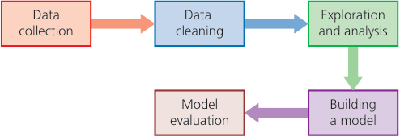

- **Figure 6.27** Machine learning model development 

- **»** Data is gathered by a survey or **web scraping** ; for example, to detect credit card fraud, information about customers is gathered, such as types of transactions (does the customer buy designer clothes?), shopping habits and certain personal data. 

- **»** Redundant data is then removed; this needs to be carefully done to remove the possibility of wrong predictions. 

- **»** The most important machine learning step: the algorithm is trained through real examples of customer purchasing behaviour. 

- **»** A model is built based on learning from the training data, and the machine learning algorithm can now be used to detect fraud (for example, if a customer spends an unusual amount on a piece of jewellery, there is a high chance a fraudulent activity has taken place). 

- **»** The machine learning model is then fully tested with known data and known outcomes; the system is modified if it hasn’t met its criteria to detect fraudulent activity. 

## **Activity 6.13** 

- **1** Use words/phrases from the following list to complete the paragraph below: Word list: 

artificial intelligence expert systems machine learning attributes explanation system robotics cognitive inference engine rules base database inference rules search engine …………………………… is a branch of computer science where the …………………………… function of the human brain is studied. ……………………………. are a branch of AI which mimic the knowledge and experience of humans. The application uses an …………………………….. to explain its reasoning and logic to the user. The main element of this application is an ……………………………. which acts like a ……………………………. by applying ……………………………. to a knowledge base. 

- **2** John has bought an expert system to help him find faults in computer systems. John has been asked to look at a computer that won’t play music through some external speakers, attached to a computer using a USB port. 

   - **»** The music is stored in a file on the solid state drive (SSD). 

   - **»** The computer uses a sound card to output sound. 

   - **»** The external loud speaker is plugged into a USB port. 

   - **a** The expert system asks John a series of questions. Each question is dependent on his response to a previous question. 

      - For example: 

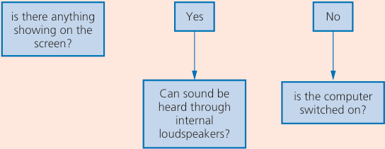

- **Figure 6.28** 

      - Write a further series of questions that helps John identify that there is actually a fault in the external loud speaker plugged into his computer. 

   - **b** Describe three other uses of expert systems. 

- **3 a** Define the term _**machine learning**_ . 

   - **b** Explain how _**machine learning**_ and _**artificial intelligence (AI)**_ differ. 

   - **c** Describe how a search engine might use machine learning to determine the most appropriate results based on a user’s search criteria. 

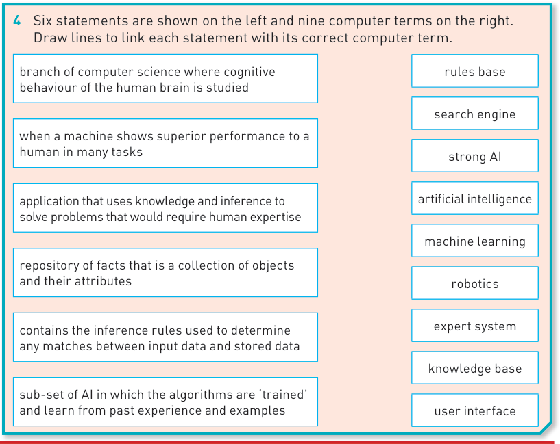

## **Extension** 

For those students considering the study of this subject at A Level, the following section gives some insight into further study on a sub-set of machine learning called deep learning 

## Deep learning 

Deep learning structures algorithms in layers (input layer, output layer and hidden layer(s)) to create an artificial neural network made up of ‘units’ or ‘nodes’, which is essentially based on the human brain (i.e. its interconnections between neurons). Neural network systems are able to process more like a human and their performance improves when trained with more and more data. The hidden layers are where data from the input layer is processed into something that can be sent to the output layer. Artificial neural networks are excellent at tasks that computers normally find hard. For example, they can be used in face recognition: 

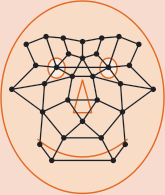

The following diagram shows an artificial neural network (with two hidden layers) – each circle, called a unit or node, is like an ‘artificial neuron’: 

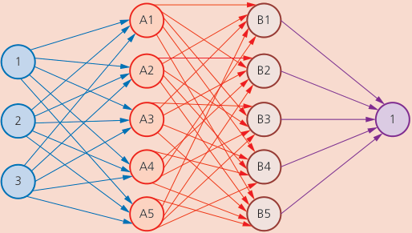

Neural networks are effective at complex visual processing such as recognising birds, for example, by their shape and colour. There are many different sizes, colours and types of bird, and machine learning algorithms struggle to successfully recognise such a wide variety of complex objects. But the hidden layers in an artificial neural network allow a deep learning algorithm to do so. 

A deep learning system can perform visual processing by analysing pixel densities of camera images of objects. Consider the following small section of an image, where each pixel on the left is represented by its RGB value in hexadecimal: 

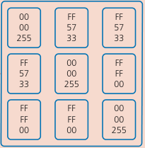

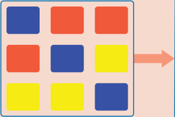

Deep learning using artificial neural networks can be used to recognise objects by looking at the binary codes of each pixel, thus building up a picture of the object. For example, the following image shows a close up of part of a face where each pixel can be assigned its binary value; patterns of binary codes can be recognised by deep learning algorithms as a person’s face. 

## **Link** 

For more on representing pixels in hexadecimal see Section 1.2. 

Example showing how deep learning works: 

|Large amounts of data set (objects) Model is tested using known labelled data Provides the required output The artificial neural network is ‘trained’ using data New data|Large amounts of data set (objects) Model is tested using known labelled data Provides the required output The artificial neural network is ‘trained’ using data New data|Large amounts of data set (objects) Model is tested using known labelled data Provides the required output The artificial neural network is ‘trained’ using data New data|Large amounts of data set (objects) Model is tested using known labelled data Provides the required output The artificial neural network is ‘trained’ using data New data|Large amounts of data set (objects) Model is tested using known labelled data Provides the required output The artificial neural network is ‘trained’ using data New data|Large amounts of data set (objects) Model is tested using known labelled data Provides the required output The artificial neural network is ‘trained’ using data New data|
|---|---|---|---|---|---|
|Large amounts of data set (objects)||The artificial neural network is ‘trained’ using data||Model is tested using known labelled data||

Large amounts of data are input into the model. One of the methods of object recognition, using pixel densities, was described above. The nodes in the artificial neural networks learn certain parameters, based on the training data. Once this has been done, labelled data is entered (this is data which has already been defined and is therefore recognised) into the model to make sure it gives the correct responses. If the output isn’t sufficiently accurate, then the model is refined until it gives satisfactory results – this might mean changing the number of nodes or number of layers. The refinement process may take several ‘adjustments’ until it provides reliable and consistent outputs. 

## Comparison between machine learning and deep learning 

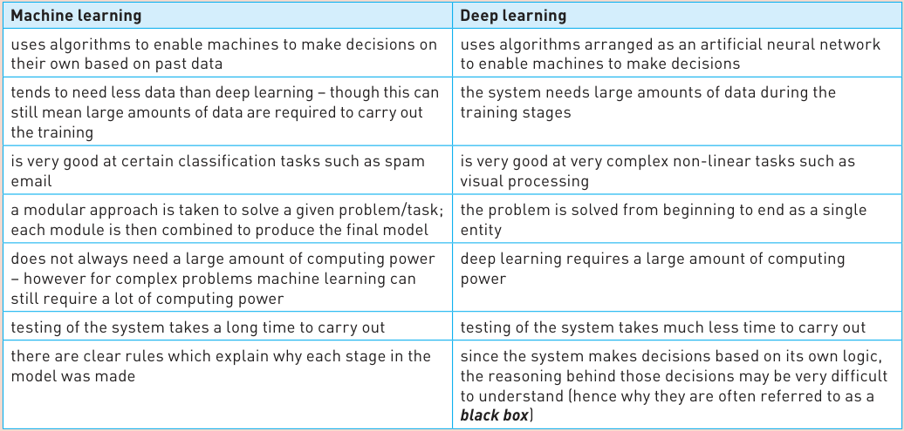

In this chapter, you have learnt about: 

- ✔ use of sensors, microprocessors and actuators in automated systems 

- ✔ the advantages and disadvantages of automated systems in a number of key areas 

- ✔ what is meant by robotics 

- ✔ what characterises a robot 

- ✔ the role of robots in a number of areas 

- ✔ the advantages and disadvantages of robots in these areas 

- ✔ the concept of artificial learning (AI) 

- ✔ the main characteristics of AI 

- ✔ expert systems 

- ✔ machine learning. 

## **Key terms used throughout this chapter** 

**automated system** – a combination of software and hardware designed and programmed to work automatically without the need for any human intervention 

**distributed control system (DCS)** – a powerful computer system programmed to monitor and control a complex process without the need for human interaction 

**adaptive cruise control** – the use of sensors, actuators and microprocessors to ensure that a vehicle keeps a safe distance behind another vehicle 

**accelerometer** – a sensor that measures acceleration and deceleration and that can detect, for example, the orientation of a device 

**robotics** – the branch of (computer) science that encompasses the design, construction and operation of robots 

**robot** – a mechanical device that can carry out tasks normally done by humans 

**autonomous** – able to operate independently without any human input 

**controller** – a microprocessor that is in control of a process **WebCrawler/search bot** – a software robot that roams the internet scanning websites and categorising them; often used by search engines 

**chatbots** – a pop-up robot on a website that appears to enter into a meaningful conversation with a web user 

**end-effector** – an attachment to a robot arm that allows it to carry out a specific task, such as spray painting 

**LiDaR** – a contraction of light detection and ranging; the use of lasers to build up a 3D image of the surroundings 

**phenotyping** – the process of observing the physical characteristics of a plant to assess its health and growth 

**cognitive** – relating to the mental processes of the human brain involved in acquiring knowledge and understanding through thought, experiences and input from the five senses 

**artificial intelligence (AI)** – a collection of rules and data which gives a computer system the ability to reason, learn and adapt to external stimuli 

**expert system** – a form of AI that has been developed to mimic a human’s knowledge and expertise 

**explanation system** – part of an expert system which informs the user of the reasoning behind its conclusions and recommendations 

**inference engine** – a kind of search engine used in an expert system which examines the knowledge base for information that matches the queries 

**inference rules** – rules used by the inference engine and in expert systems to draw conclusions using IF statements 

**knowledge base** – a repository of facts which is a collection of objects and attributes 

**object** – an item stored in the knowledge base 

**attribute** – something that defines the objects stored in a knowledge base 

**rules base** – a collection of inference rules used to draw conclusions 

**machine learning** – a sub-set of AI in which algorithms are trained and learn from past experiences and examples 

**web scraping** – a method of obtaining data from websites 

**drone** – a flying robot that can be autonomous or operated using remote control; a drone can be used for reconnaissance or deliveries 

## Exam-style questions 

- **1** A distribution company has decided to automate its packaging and dispensing of items to online customers. The system is totally automated, where each required item is identified using barcodes. Once found, the item is packaged, an address label applied and then placed in a delivery van. 

   - **a** Describe the advantages and disadvantages to the company of using robots to automatically find, package and load parcels. 

[5] 

   - **b** Some humans will still have to be present in the building to carry out special tasks. Describe what safety systems need to be part of the robot to prevent any risks to the humans when walking around the building. [3] 

- **2** A company is developing a new game for a hand-held console: 

The console is moved in various directions to control movement and speed of a racing car on a television screen. Gear changes can be done using the LCD screen on the device itself. 

Name and describe which sensors would need to be used for the game to be as realistic as possible. [5] 

- **3** A robot is being used to deliver the post around the headquarters of a large company, which is housed in a 20-storey building. 

   - The robot moves around the corridors picking up the post and delivering the post throughout the building. If a person comes close to the robot, it stops and waits until the person is out of range. 

   - **a** Proximity sensors are used to detect how close to a person the robot is. Describe how the microprocessor (which is built into the robot) would ensure the robot stops when it encounters a person. [4] 

   - **b** The lighting throughout the building is controlled by sensors and a computer. 

      - **i** Describe how the lighting in the corridors and offices are controlled by sensors and the computer. 

      - **ii** Describe the advantages and disadvantages of using an automated system to control the building lights. [4] 

- **4** A computer has been designed to do a number of different tasks: 

   - **»** control a process 

   - **»** monitor a process (by taking data samples only) 

   - **»** run an expert system. 

   - **a** The table below shows eight tasks which the computer could be carrying out. Tick ( ) the appropriate box to show if the task is an example of control, monitor or an expert system: 

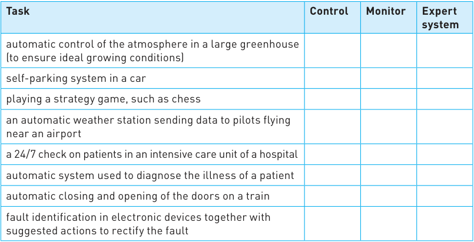

[8] 

   - **b** Name and describe the function of four of the components that make up an expert system. [4] 

- **5** The following schematic shows how sensors, actuators and a computer can be used to control the opening and closing of doors in a train. 

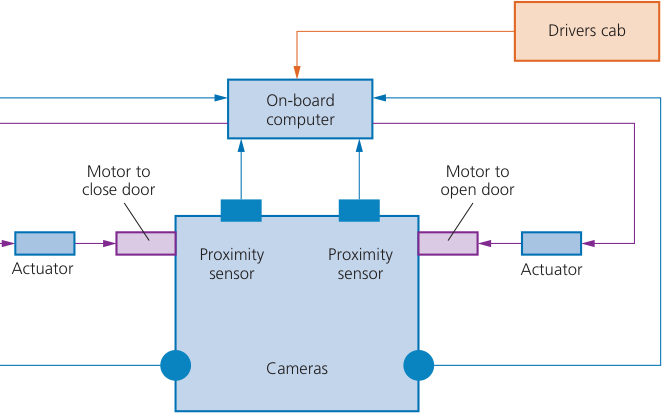

As the train approaches a station and stops, the system automatically opens the doors. Passengers can then get on and off the train. 

After 30 seconds the computer automatically sounds an alarm and starts to close the doors. But if someone is still trying to get on or off the train at this point, then the doors automatically re-open and then try to close again. This is all done under the control of the computer. Cameras and sensors are used to send data back to the computer. The driver of the train is able to monitor the camera images from his cab and take any additional action if necessary. 

- **a** Describe how the sensors, cameras, actuators and computer are all used to safely operate the doors on the train. Name any sensors that you think would be needed. [6] 

||**b**|Explain the advantages and disadvantages of using this computer-||
|---|---|---|---|
|||controlled system.|[4]|
||**c**|Explain why you think camera images are still sent to the driver||
|||in the cab.|[2]|
||**d**|The train company are slowly upgrading all their trains to be autonomous.||
|||**i** Explain the term**_autonomous_**.|[1]|
|||**ii**Describe what additional sensors and actuators may be needed to||
|||allow the trains to be upgraded to autonomous operation.|[4]|
|||**iii**Describe two advantages and two disadvantages of making this||
|||upgrade.|[4]|
|**6**|**a**|Give**three**characteristics needed to define a machine as||
|||a robot.|[3]|
||**b**|Robots can be described as**_dependent_**or**_independent_**.||
|||Explain what is meant by the two types of robot.|[4]|

- **7** Six descriptions are shown on the left and six computer terms are shown on the right. 

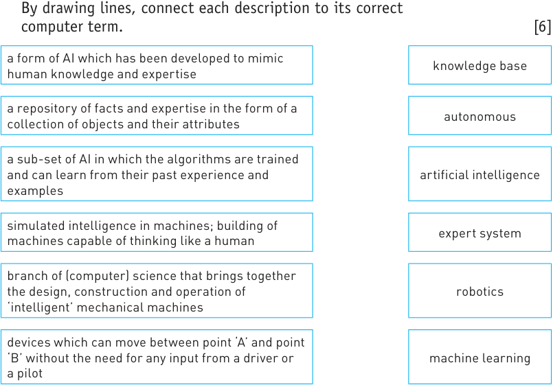

- **8** Which computer terms are being described below? 

   - **a** Attachment to a robot arm which allows it to carry out a specific task, such as spray painting. 

   - **b** A kind of search engine used in an expert system which examines the knowledge base for information that matches the queries. 

   - **c** General name of any robotic device that can operate independently without any human input. 

   - **d** A sub-set of AI in which algorithms are trained and learn from past experiences and examples. 

- **e** A combination of software and hardware designed and programmed to work automatically without the need for any human intervention. 

- **f** A collection of rules and data which leads to the ability to reason, learn and adapt to external stimuli. 

- **g** Pop-up robots found on websites that appear to enter into a meaningful conversation with a web user. 

- **h** Robots that roam the internet scanning all websites and categorising them for search purposes. 

- **i** A branch of (computer) science that brings together the design, construction and operation of intelligent mechanical devices. 

- **j** The mental process of the human brain whereby it acquires knowledge and understanding through thought, experiences and the five senses. 

- **k** Something that defines the objects stored in a knowledge base. 

- **l** A repository of facts which is a collection of objects and attributes. 

- **m** A flying robot that can be autonomous or under remote control; used for reconnaissance or deliveries. 

- **n** The name essentially given to a microprocessor which is in control of a process. 

- Used by the inference engine to draw conclusions using IF statements. 

[15] 

