# CAIE Computer Science IGCSE — Chapter 8: Programming

---

## **In this chapter, you will learn about:** 

- ★ programming concepts: 

   - use of variables and constants 

   - input and output 

   - sequence 

   - selection including nesting 

   - iteration 

   - totalling and counting 

   - string handling 

   - operators – arithmetic, logical and Boolean 

   - procedures and functions including the use of: 

      - parameters 

      - local and global variables 

   - library routines 

   - creating a maintainable program 

- ★ arrays: including one- and two-dimensional arrays, use of indexes, use of iteration for reading from and writing to arrays 

- ★ file handling: including opening, closing, reading from and writing to data and text files. 

The previous chapter enabled you to develop your computational thinking by writing algorithms to perform various tasks. This chapter will show you how to put your computational thinking to the ultimate test by writing computer programs to perform tasks. 

So far you have tested your algorithms by dry-running. Once you have written a program for your algorithm, and when there are no syntax errors (see Chapter 4), you will now use a computer to run the program to complete the task you have specified. The computer will perform the task exactly as you have written it; you may need to make some changes before it works exactly as you intend it to. 

In Chapter 4 you learned that programs could be written in high- or low-level languages then translated and run. This chapter will introduce you to the programming concepts required for practical use of a high-level language. This chapter shows the concepts behind such programming languages but should be used in conjunction with learning the syntax of an appropriate programming language. 

There are many high-level programming languages to choose from. For IGCSE Computer Science the high-level programming languages recommended are Python, Visual Basic or Java. The use of one of these languages is also required for A Level Computer Science. 

Many programming languages need an interactive development environment (IDE) to write and run code. IDEs are free to download and use. 

Programs developed in this chapter will be illustrated using the following freely available languages: 

- **» Python** a general purpose, open source programming language that promotes rapid program development and readable code. The IDE used for screenshots in this chapter is called **IDLE** . 

- **» Visual Basic** , a widely used programming language for Windows. The IDE used for screenshots in this chapter is called **Visual Studio** . 

- **» Java** , a commercial language used by many developers. The IDE used for screenshots in this chapter is called **BlueJ** . 

The traditional introduction to programming in any language is to display the words ‘Hello World’ on a computer screen. The programs look very different, but the output is the same: 

## **Python** 

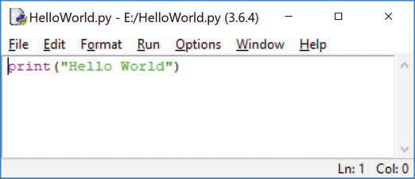

- **Figure 8.1** The editing window for Python 

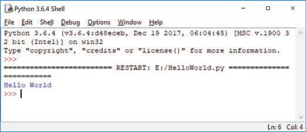

- **Figure 8.2** The runtime window for Python 

## **Visual Basic** 

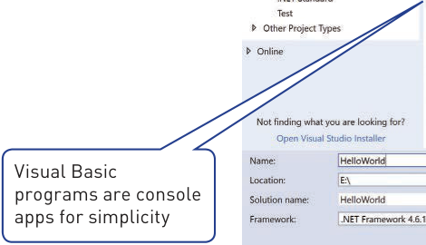

- **Figure 8.3** The Visual Basic program will run in a command line window 

The Console. ReadKey() will ensure that the output remains on screen. 

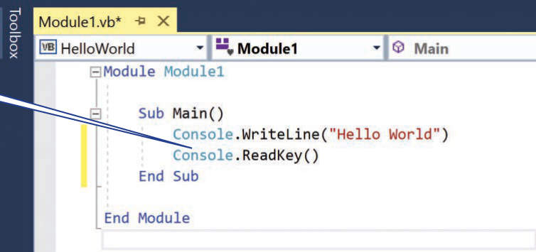

- **Figure 8.4** The editing window for Visual Basic 

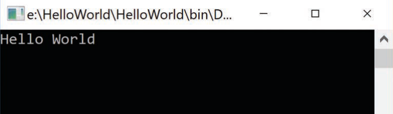

- **Figure 8.5** The runtime window for Visual Basic 

## **Java** 

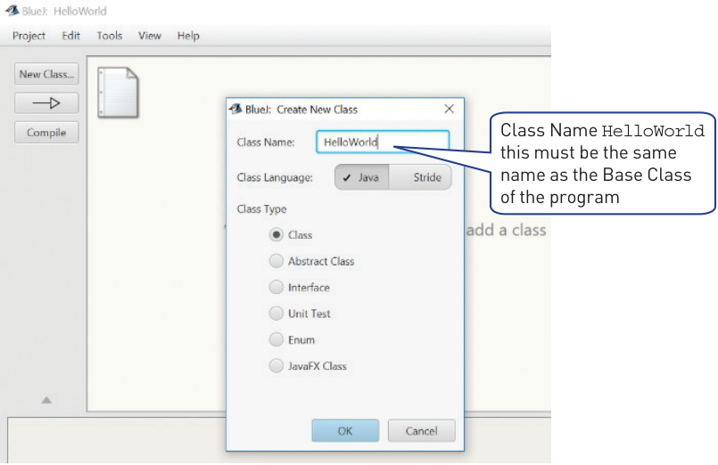

- **Figure 8.6** Setting up the class for Java 

## **8 Programming** 

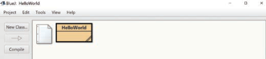

- **Figure 8.7** The project window for Java 

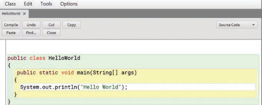

- **Figure 8.8** The editing window for Java 

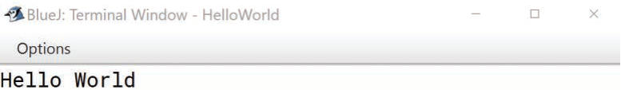

- **Figure 8.9** The terminal window to show the output from the program Java 

## **Activity 8.1** 

Write and test the Hello World program in your chosen programming language. 

> **Find out more:** Find out more about each of the three programming languages Python, Visual Basic and Java. Decide, with the help of your teacher, which programming language will be best to use for your IGCSE work. Programming is a skill that takes time and practice to develop. In the next sections of this chapter, after you have decided which programming language you are going to use, you can just consider the examples for your chosen language.

## 8.1 Programming concepts

There are five basic constructs to use and understand when developing a program: 

- **»** data use – variables, constants and arrays 

- **»** sequence – order of steps in a task 

- **»** selection – choosing a path through a program 

- **»** iteration – repetition of a sequence of steps in a program 

- **»** operator use – arithmetic for calculations, logical and Boolean for decisions. 

### 8.1.1 Variables and constants

In a program, any data used can have a fixed value that does not change while the program is running. 

A **variable** in a computer program is a named data store than contains a value that may change during the execution of a program. In order to make programs understandable to others, variables should be given meaningful names. 

A **constant** in a computer program is a named data store than contains a value that does not change during the execution of a program. As with variables, 

in order to make programs understandable to others, constants should also be given meaningful names. 

Not all programming languages explicitly differentiate between constants and variables, but programmers should be clear which data stores can be changed and which cannot be changed. There are several ways of highlighting a constant, for example: 

Use of capital letters PI = 3.142 Meaningful names that begin with Const ConstPi = 3.142 

It is considered good practice to **declare** the constants and variables to be used in that program. Some languages require explicit declarations, which specifically state what type of data the variable or constant will hold. Other languages require implicit declarations, where the data type is based on the value assigned. Declarations can be at the start of a program or just before the data is used for the first time. 

Here are some sample declaration statements in pseudocode and programming code – just look at the sections for pseudocode and the programming language you are using. 

- **Table 8.1** How to declare variables and constants 

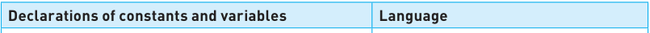

|**Declarations of constants and variables**|**Language**|
|---|---|
|||
|**DECLARE FirstVar : INTEGER** **DECLARE SecondVar : INTEGER** **CONSTANT FirstConst**¨**500** **CONSTANT SecondConst**¨**100**|Pseudocode declarations, variables are explicit but constants are implicit.|
|**FirstVar = 20** **SecondVar = 30** **FIRSTCONST = 500** **SECONDCONST = 100** or **FirstVar, SecondVar = 20, 30** **FirstConst, SecondConst = 500,100**|Python does not require any separate declarations and does not differentiate between constants and variables. Programmers need to keep track of and manage these differences instead.|
|**Dim FirstVar As Integer** **Dim SecondVar As Integer** **Const FirstConst As Integer = 500** **Const SecondConst As Integer = 500** or **Dim FirstVar, SecondVar As Integer** **Const First, Second As Integer = 500,** **100**|In Visual Basic variables are explicitly declared as particular data types before use. Declarations can be single statements or multiple declarations in a single statement. Constants can be explicitly typed as shown or implicitly typed, for example: **Const First = 500** ... which implicitly defines the constant as an integer.|
|**int FirstVar;** **int SecondVar;** **final int FIRSTCONST = 500;** **final int SECONDCONST = 100;**|In Java constant values are declared as variables with a final value so no changes can be made. These final variable names are usually capitalised to show they cannot be changed. Variables are often declared as they are used rather than at the start of the code.|

### 8.1.2 Basic data types

In order for a computer system to process and store data effectively, different kinds of data are formally given different types. This enables: 

- **»** data to be stored in an appropriate way, for example, as numbers or as characters 

- **»** data to be manipulated effectively, for example, numbers with mathematical operators and characters with concatenation 

- **»** automatic validation in some cases. 

The basic data types you will need to use for IGCSE Computer Science are: 

- **»** integer – a positive or negative whole number that can be used with mathematical operators 

- **»** real – a positive or negative number with a fractional part. Real numbers can be used with mathematical operators 

- **»** char – a variable or constant that is a single character 

- **»** string – a variable or constant that is several characters in length. Strings vary in length and may even have no characters (known as an empty string); the characters can be letters and/or digits and/or any other printable symbol (If a number is stored as a string then it cannot be used in calculations.) 

- **»** Boolean – a variable or constant that can have only two values TRUE or FALSE. 

## ▼ **Table 8.2** Examples of data types 

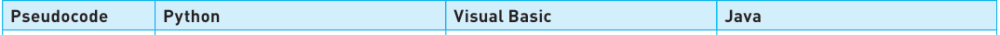

|**Pseudocode**|**Python**|**Visual Basic**|**Java**|
|---|---|---|---|
|||||
|**INTEGER**|**FirstInteger = 25**|**Dim FirstInt As Integer**|**int FirstInt;**or **byte FirstInt;**|
|**REAL**|**FirstReal = 25.0**|**Dim FirstReal As Decimal**|**float FirstReal;**or **double FirstReal;**|
|**CHAR**|**Female = 'F'**or **Female = "F"**|**Dim Female As Char**|**char Female;**|
|**STRING**|**FirstName = 'Emma'**or **FirstName = "Emma"**|**Dim FirstName As String**|**String FirstName;**|
|**BOOLEAN**|**Flag = True**|**Dim Flag As Boolean**|**boolean Flag;**|

## **Activity 8.2** 

In pseudocode and the high-level programming language that your school has chosen to use, declare the variables and constants you would use in an algorithm to find the volume of a cylinder. 

### 8.1.3 Input and output

In order to be able to enter data and output results, programs need to use input and output statements. For IGCSE Computer Science you need to be able to write algorithms and programs that take input from a keyboard and output to a screen. 

For a program to be useful, the user needs to know what they are expected to input, so each input needs to be accompanied by a **prompt** stating the input required. 

Here are examples of inputs in programming code – pseudocode was considered in Chapter 7. Just look at the section for the programming language you are using. 

In a programming language the data type of the input must match the required data type of the variable where the input data is to be stored. All inputs default as strings, so if the input should be an integer or real number, commands are also used to change the data type of the input (for instance, in Python these are **int()** or **float()** ). 

- **Table 8.3** Examples of input statements with prompts 

> **Find out more:** These input statements use a programming technique called casting, which converts variables from one data type to another. Find out more about the use of casting in the programming language that you have decided to use. 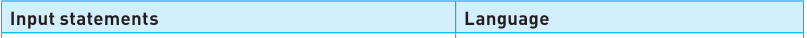 |**Input statements**|**Language**| |---|---| ||| |**radius = float(input("Please enter the** **radius of the cylinder "))**|Python combines the prompt with the input statement.| |**Console.Write("Please enter the radius** **of the cylinder ")** **radius = Decimal.Parse(Console.** **ReadLine())**|Visual Basic uses a separate prompt and input. The input specifies the type of data expected.| |**import java.util.Scanner;** **Scanner myObj = new Scanner(System.in);** **System.out.println("Please enter the** **radius of the cylinder ");** **double radius = myObj.nextDouble();**|In Java the input library has to be imported at the start of the program and an input object is set up. Java uses a separate prompt and input. The input specifies the type and declares the variable of the same type.|

## **Activity 8.2a** 

In the high-level programming language that your school has chosen to use, write expressions that would store user inputs as the data types represented by the following: **»** 12 **»** 12.00 **»** X **»** X marks the spot **»** TRUE. 

For a program to be useful, the user needs to know what results are being output, so each output needs to be accompanied by a **message** explaining the result. If there are several parts to an output statement, then each part is separated by a separator character. 

Here are examples of outputs in programming code – pseudocode was considered in Chapter 7. Just look at the section for the programming language you are using. 

- **Table 8.4** Examples of output statements with messages 

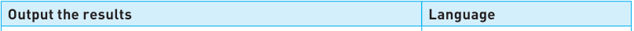

|**Output the results**|**Language**|
|---|---|
|||
|**print("Volume of the cylinder is ", volume)**|Python uses a comma|
|**Console.WriteLine("Volume of the cylinder is "** **& volume)**|VB uses &|
|**System.out.println("Volume of the cylinder is "** **+ volume);**|Java uses +|

## **Activity 8.3** 

In the high-level programming language that your school has chosen to use, write and run your own program that calculates and displays the volume of a cylinder. 

## Examples of the complete programs are shown below: 

## **Python** 

CONSTPI = 3.142 

Radius = float(input("Please enter the radius of the cylinder ")) Length = float(input("Please enter the length of the cylinder ")) Volume = Radius * Radius * Length * CONSTPI print("Volume of the cylinder is ", Volume) 

## **Visual Basic** 

Every console program in VB must contain a Main module. These statements are shown in red. 

**Module Module1 Public Sub Main()** Dim Radius As Decimal Dim Length As Decimal Dim Volume As Decimal Const PI As Decimal = 3.142 Console.Write("Please enter the radius of the cylinder ") Radius = Decimal.Parse(Console.ReadLine()) Console.Write("Please enter the length of the cylinder ") Length = Decimal.Parse(Console.ReadLine()) Volume = Radius * Radius * Length * PI Console.WriteLine("Volume of cylinder is " & volume) Console.ReadKey() **End Sub End Module** 

## **Java** 

import java.util.Scanner; **class Cylinder** Every console **{** program in Java must contain a class with **public static void main(String args[])** the file name and **{** a main procedure. These statements are Scanner myObj = new Scanner(System.in); shown in red. final double PI = 3.142; double Radius; Every statement in Java must have a double Length; semi-colon ; at System.out.println("Please enter the radius of the the end. cylinder "); Radius = myObj.nextDouble(); System.out.println("Please enter the length of the sphere "); Length = myObj.nextDouble(); double Volume = Radius * Radius * Length * PI; System.out.println("Volume of cylinder is " + volume); **} }** 

### 8.1.4 Basic concepts

When writing the steps required to solve a problem, the following concepts need to be used and understood: 

- **»** sequence 

- **»** selection 

- **»** iteration 

- **»** counting and totalling 

- **»** string handling 

- **»** use of operators. 

## 8.1.4(a) Sequence 

The ordering of the steps in an algorithm is very important. An incorrect order can lead to incorrect results and/or extra steps that are not required by the task. 

## **Link** 

For more on **REPEAT...UNTIL** loops in pseudocode see Section 7.2.3. 

## **Worked example** 

For example, the following pseudocode algorithm uses a **REPEAT...UNTIL** loop to calculate and output total marks, average marks and the number of marks entered. 

DECLARE, Total, Average : REAL DECLARE Mark, Counter : INTEGER Total ← 0 Mark ← 0 Counter ← 0 OUTPUT "Enter marks, 999 to finish " REPEAT INPUT Mark Total ← Total + Mark IF Mark = 999 THEN Average ← Total / Counter ENDIF Counter ← Counter + 1 UNTIL Mark = 999 OUTPUT "The total mark is ", Total OUTPUT "The average mark is ", Average OUTPUT "The number of marks is ", Counter 

A trace table is completed using this test data: 

25, 27, 23, 999 

- **Table 8.5** Trace table of dry run for algorithm with an incorrect sequence 

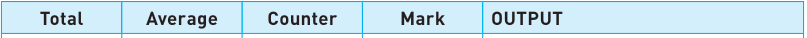

|**Total**|**Average**|**Counter**|**Mark**|**OUTPUT**|
|---|---|---|---|---|
||||||
|**0**|**0**|**0**||**Enter marks, 999 to finish**|
|**25**||**1**|**25**||
|**52**||**2**|**27**||
|**75**||**3**|**23**||
|**1074**|**358**|**4**|**999**||
|||||**The total mark is 1074**|
|||||**The average mark is 358**|
|||||**The number of marks is 4**|

As you can see all the outputs are incorrect. 

However if the order of the steps is changed, and the unnecessary test removed, the algorithm now works. 

DECLARE, Total, Average : REAL DECLARE Mark, Counter : INTEGER Total ← 0 Mark ← 0 Counter starts at −1 to allow the Counter ← -1 extra mark of 999 OUTPUT "Enter marks, 999 to finish " not to be counted. REPEAT Total ← Total + Mark INPUT Mark Average now Counter ← Counter + 1 calculated outside the loop. No need UNTIL Mark = 999 to test if the last OUTPUT "The total mark is ", Total input. Average ← Total / Counter OUTPUT "The average mark is ", Average OUTPUT "The number of marks is ", Counter 

A trace table is completed using the same test data: 

25, 27, 23, 999 

- **Table 8.6** Trace table of dry run for algorithm with a correct sequence 

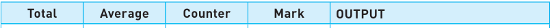

|**Total**|**Average**|**Counter**|**Mark**|**OUTPUT**|
|---|---|---|---|---|
||||||
|**0**|**0**|**−1**||**Enter marks, 999 to finish**|
|**25**||**0**|**25**||
|**52**||**1**|**27**||
|**75**||**2**|**23**||
|||**3**|**999**||
|||||**The total mark is 75**|
||**25**|||**The average mark is 25**|
|||||**The number of marks is 3**|

As you can see all the outputs are now correct. 

> **Find out more:** Write and test a program, in the high-level programming language that your school has chosen to use, including similar steps to the corrected pseudocode algorithm. 309 **8 Programming**

## 8.1.4(b) Selection 

Selection is a very useful technique, allowing different routes through the steps of a program. For example, data items can be picked out according to given criteria, such as: selecting the largest value or smallest value, selecting items over a certain price, selecting everyone who is male. 

Selection was demonstrated in pseudocode with the use of **IF** and **CASE** statements in Chapter 7. 

> **Find out more:** Using the high-level programming language that your school has chosen, find out about the structure of **IF…THEN…ELSE** and **CASE** statements. Not all programming languages include the use of a **CASE** statement.

## **IF statements** 

Look at some of the different types of **IF** statements available in your programming language. 

- **Table 8.7** IF statements single choice 

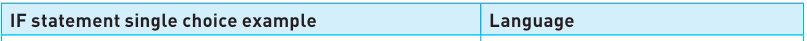

|**IF statement single choice example**|**Language**|
|---|---|
|||
|**IF Age > 17** **THEN** **OUTPUT "You are an adult"** **ENDIF**|Pseudocode|
|**if Age > 17:** **print ("You are an adult")**|Python does not use**THEN**or**ENDIF** just a colon : and indentation|
|**If Age > 17 Then** **Console.WriteLine("You are an adult")** **End If**|Visual Basic uses**Then**and**End If**|
|**If (Age > 17) {** **System.out.println ("You are an adult");** **}**|Java uses curly brackets,**{**, instead of **THEN**and uses**}**instead of**ENDIF**.|

- **Table 8.8** IF statements single choice with alternative 

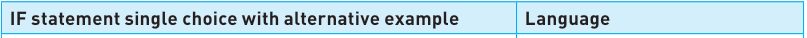

|**IF statement single choice with alternative example**|**Language**|
|---|---|
|||
|**IF Age > 17** **THEN** **OUTPUT "You are an adult"** **ELSE** **OUTPUT "You are a child"** **ENDIF**|Pseudocode|

## ▼ **Table 8.8** ( _Continued_ ) 

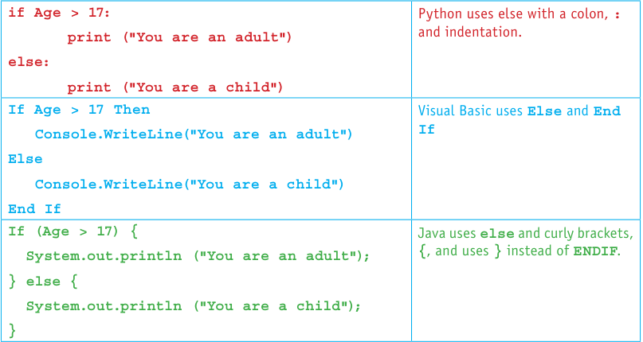

## **Activity 8.4** 

In the high-level programming language that your school has chosen to use, write and run a short program to test if a number input is greater than or equal to 100 or less than 100. 

## **Case statements** 

Case statements are used when there are multiple choices to be made. Different programming languages provide different types of statement to do this. Have a look at the method your programming language uses. 

- **Table 8.9** CASE statements multiple choice 

**Case statement examples Language CASE OF OpValue** Pseudocode **"+" : Answer**[¨] **Number1 + Number2 "-" : Answer**[¨] **Number1 - Number2 "*" : Answer**[¨] **Number1 * Number2 "/" : Answer**[¨] **Number1 / Number2 OTHERWISE OUTPUT "Please enter a valid choice" ENDCASE if OpValue == "+":** Python uses **elif** for **Answer = Number1 + Number2** multiple tests **elif OpValue == "-": Answer = Number1 - Number2 elif OpValue == "*": Answer = Number1 * Number2 elif OpValue == "/": Answer = Number1 - Number2 else: print("invalid operator")** 

## ▼ **Table 8.9** ( _Continued_ ) 

|▼ **Table 8.9**(_Continued_)||
|---|---|
|**Select Case OpValue** **Case "+"** **Answer = Number1 + Number2** **Case "-"** **Answer = Number1 - Number2** **Case "*"** **Answer = Number1 * Number2** **Case "/"** **Answer = Number1 / Number2** **Case Else** **Console.WriteLine("invalid operator")** **End Select**|Visual Basic uses**Select** **Case**and**Case Else** instead of**CASE**and **OTHERWISE**|
|**switch (OpValue) {** **case "+":** **Answer = Number1 + Number2;** **break;** **case "-":** **Answer = Number1 - Number2;** **break;** **case "*":** **Answer = Number1 * Number2;** **break;** **case "/":** **Answer = Number1 / Number2;** **break;** **default:** **System.out.println("invalid operator");** **}**|Java uses**default** instead of**OTHERWISE** and uses**break** to pass control to the end of the code block when a section is finished.|

## **Activity 8.5** 

In the high-level programming language that your school has chosen to use, write and run a short program to input a number and check if that number is equal to 1, 2, 3 or 4 using the **CASE** construct (or alternative where appropriate). 

## 8.1.4(c) Iteration 

As stated in Chapter 7, there are three types of loop structures available to perform iterations so that a section of programming code can be repeated under certain conditions. 

## These are: 

- **»** Count-controlled loops (for a set number of iterations) 

- **»** Pre-condition loops – may have no iterations 

- **»** Post-condition loops – always has at least one iteration. 

> **Find out more:** Find out about the loop structures available in the high-level programming language that your school has chosen to use.

## **Count-controlled loops** 

FOR loops are used when a set number of iterations are required. Look at some of the different types of **FOR** statements with a counter starting at one, finishing at ten and increments by two for every iteration. 

- **Table 8.10** FOR loops 

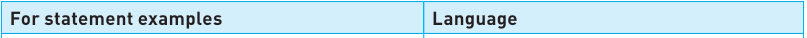

|**For statement examples**|**Language**|
|---|---|
|||
|**for Counter in range (1,11,2):** **print(Counter)**|Python uses the**range**function, a colon to show the start of the**for**loop and indentation of all statements in the**for** loop.|
|**For Counter = 1 To 10 Step 2** **Console.WriteLine(Counter)** **Next**|Visual Basic uses**Step**and**Next**|
|**for (int Counter = 1; Counter <= 10;** **Counter = Counter + 2)** **{** **System.out.println(Counter);** **}**|Java uses**{}**to show the start and end of the **for**loop.|

## **Condition-controlled loops** 

When the number of iterations is not known, there are two options: 

- **»** pre-condition loops which may have no iterations 

**»** post-condition loops which always have at least one iteration. 

Look at some of the different pre- and post-condition loops used in your programming language. 

- **Table 8.11** Pre-condition loops 

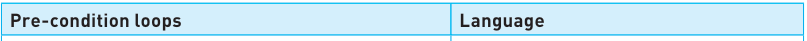

|**Pre-condition loops**|**Language**|
|---|---|
|||
|**while TotalWeight < 100:** **TotalWeight = TotalWeight + Weight**|Python uses a colon to show the start of the**while**loop and indentation to show which statements are in the**while**loop.|
|**While TotalWeight < 100** **TotalWeight = TotalWeight + Weight** **End While**|Visual Basic uses**While**and**End While**|
|**while (TotalWeight < 100)** **{** **TotalWeight = TotalWeight + Weight;** **}**|Java uses**{}**to show the start and end of the**while**loop.|

- **Table 8.12** Post-condition loops 

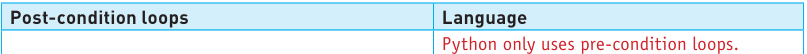

|**Post-condition loops**|**Language**|
|---|---|
||Python only uses pre-condition loops.|
|**Do** **NumberOfItems = NumberOfItems + 1** **Loop Until NumberOfItems > 19**|Visual Basic uses**Do**and**Loop Until**|
|**Do** **{** **NumberOfItems ++;** **}** **while(NumberOfItems <= 20);**|Java uses**do**and**while**so the condition is the opposite of the**until** condition used in Visual Basic. Look at the code carefully to see the difference. Java uses**{}**to show the start and end of the loop.|

## **Activity 8.6** 

In the high-level programming language that your school has chosen to use, write and run two short programs, one using a count-controlled loop and the other a condition-controlled loop. They should each repeat ten times, incrementing the loop counter by three and outputting the value for each iteration. 

## 8.1.4(d) Totalling and counting 

**Totalling** and **counting** were introduced in Chapter 7 as standard methods. Take a look at how these methods are implemented in your programming language. 

Totalling is very similar in all three languages. 

- **Table 8.13** Totalling 

|**Totalling**|**Language**|
|---|---|
|||
|**TotalWeight = TotalWeight + Weight**|Python|
|**TotalWeight = TotalWeight + Weight**|Visual Basic|
|**TotalWeight = TotalWeight + Weight;**|Java|

Counting is also similar in Python and Visual Basic, but Java uses a different type of statement. 

- **Table 8.14** Counting 

|**Counting**|**Language**|
|---|---|
|||
|**NumberOfItems = NumberOfItems + 1** **NumberOfItems +=1**|Python|
|**NumberOfItems = NumberOfItems + 1** **NumberOfItems +=1**|Visual Basic|
|**NumberOfItems ++;** **NumberOfItems = NumberOfItems + 1;**|Java|

## **Activity 8.7** 

In the high-level programming language that your school has chosen to use, write and run a short program using a condition-controlled loop to allow the user to input the weight of sacks of rice and to count the number of sacks the user has input. When the user types in ‘-1’ this should stop the process and the program should then output the number of sacks entered and the total weight. 

## 8.1.4(e) String Handling 

Strings are used to store text. Every string contains a number of characters, from an empty string, which has no characters stored, to a maximum number specified by the programming language. The characters in a string can be labelled by position number. The first character in a string can be in position zero or position one, depending on the language. 

> **Find out more:** Find the maximum number of characters that the high-level programming language that your school has chosen can store in a string. Find out the position number of the first character defined by this programming language. String handling is an important part of programming. As an IGCSE Computer Science student, you will need to write algorithms and programs for these methods: - **» length** – finding the number of characters in the string. For example, the length of the string **"Computer Science"** is 16 characters as spaces are counted as a character. - **» substring** – extracting part of a string. For example, the substring **"Science"** could be extracted from **"Computer Science"** . - **» upper** – converting all the letters in a string to uppercase. For example, the string **"Computer Science"** would become **"COMPUTER SCIENCE"** . - **» lower** – converting all the letters in a string to lowercase. For example, the string **"Computer Science"** would become **"computer science"** . These string manipulation methods are usually provided in programming languages by **library routines** , see later in this chapter for further use of library routines. Most programming languages support many different string handling methods. Have a look at how your programming language would complete each of the four methods you need to be able to use. - **Table 8.15** Find the length of a string 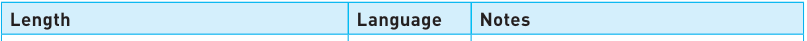 |**Length**|**Language**|**Notes**| |---|---|---| |||| |**LENGTH("Computer Science")** **LENGTH(MyString)**|Pseudocode|Text in quotes can be used or a variable with data type string.| |**len("Computer Science")** **len(MyString)**|Python|Text in quotes can be used or a variable with data type string.| |**"Computer Science".Length()** **MyString.Length()**|Visual Basic|Text in quotes can be used or a variable with data type string.| |**"Computer Science".length();** **MyString.length();**|Java|Text in quotes can be used or a variable with data type string.| 315 **8 Programming**

## ▼ **Table 8.16** Extracting a substring from a string 

|**Substring – to extract the word ‘Science’**|**Language**|**Notes**|
|---|---|---|
||||
|**SUBSTRING("Computer Science", 10, 7)** **SUBSTRING(MyString, 10, 7)**|Pseudocode|Text in quotes can be used or a variable with data type string.  First parameter is the string, second parameter is the position of the start character, third parameter is the length of the required substring. Pseudocode strings start atposition one.|
|**"Computer Science"[9:16]** **MyString[9:16]**|Python|Text in quotes can be used or a variable with data type string. Strings are treated as lists of characters in Python. First index is the start position of the substring. Second index is the end position of the substring. Python strings start atposition zero.|
|**"Computer Science".Substring(9, 7)** **MyString.Substring(9, 7)**|Visual Basic|Text in quotes can be used or a variable with data type string. First parameter is the start position of the substring, second parameter is the length of the substring. Visual Basic strings start atposition zero.|
|**"Computer Science".substring(9,17);** **MyString.substring(9,17);**|Java|Text in quotes can be used or a variable with data type string. First parameter is the start position of the substring, second parameter is the exclusive end position of the substring. ‘Exclusive’ means the position after the last character, i.e. in this example the substring is made from characters 9 to 16. Java strings start atposition zero.|

## ▼ **Table 8.17** Converting a string to upper case 

|**Upper**|**Language**|**Notes**|
|---|---|---|
|**UCASE("Computer Science")** **UCASE(MyString)**|Pseudocode|Text in quotes can be used or a variable with data type string.|
|**"Computer Science".upper()** **MyString.upper()**|Python|Text in quotes can be used or a variable with data type string.|
|**UCase("Computer Science")** **UCase(MyString)**|Visual Basic|Text in quotes can be used or a variable with data type string.|
|**"Computer Science".toUpperCase();** **MyString.toUpperCase();**|Java|Text in quotes can be used or a variable with data type string.|

- **Table 8.18** Converting a string to lower case 

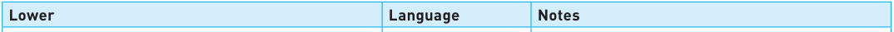

|**Lower**|**Language**|**Notes**|
|---|---|---|
||||
|**LCASE("Computer Science")** **LCASE(MyString)**|Pseudocode|Text in quotes can be used or a variable with data type string.|
|**"Computer Science".lower()** **MyString.lower()**|Python|Text in quotes can be used or a variable with data type string.|
|**LCase("Computer Science")** **LCase(MyString)**|Visual Basic|Text in quotes can be used or a variable with data type string.|
|**"Computer Science".toLowerCase();** **MyString.toLowerCase();**|Java|Text in quotes can be used or a variable with data type string.|

> **Find out more:** Find four more string handling methods that your programming language makes use of.

## **Activity 8.8** 

In the high-level programming language that your school has chosen, write and run a short program to input your full name into a variable, **MyName** , find the length of your name, extract the first three characters of your name and display your name in upper case and in lower case. 

## 8.1.4(f) Arithmetic, logical and Boolean operators 

## **Arithmetic operators** 

All programming languages make use of arithmetic operators to perform calculations. Here are the ones you must be able to use for IGCSE Computer Science. 

- **Table 8.19** Mathematical operators 

## **Advice** 

Expressions using operators can also be grouped together using brackets, for instance: ((x + y) * 3) / PI 

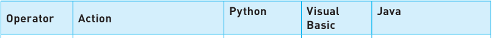

|**Operator**|**Action**|**Python**|**Visual** **Basic**|**Java**|
|---|---|---|---|---|
||||||
|+|Add|+|+|+|
|-|Subtract|-|-|-|
|*|Multiply|*|*|*|
|/|Divide|/|/|/|
|^|Raise to the power of|**|^|import java.lang.Math; Math.pow(x,y)|
|MOD|Remainder division|For more on these see Section 8.1.7 Library routines.|||
|DIV|Integer division||||

## **Activity 8.9** 

In the high-level programming language that your school has chosen to use, write and test a short program to perform all these mathematical operations and output the results: 

**»** Input two numbers, **Number1** and **Number2** 

**»** Calculate **Number1 + Number2** 

**»** Calculate **Number1 - Number2** 

**»** Calculate **Number1 * Number2 »** Calculate **Number1 / Number2 »** Calculate **Number1 ^ Number2** 

**»** Input an integer **Number3 »** Calculate **Number3 * (Number1 + Number2) »** Calculate **Number3 * (Number1 - Number2) »** Calculate **(Number1 + Number2) ^ Number3.** 

## **Logical operators** 

All programming languages make use of logical operators to decide which path to take through a program. Here are the ones you must be able to use for IGCSE Computer Science. 

- **Table 8.20** Logical operators 

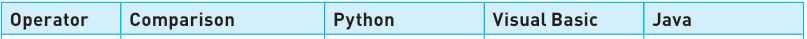

|**Operator**|**Comparison**|**Python**|**Visual Basic**|**Java**|
|---|---|---|---|---|
||||||
|>|Greater than|**>**|**>**|**>**|
|<|Less than|**<**|**<**|**<**|
|=|Equal|**==**|**=**|**==**|
|>=|Greater than or equal|**>=**|**>=**|**>=**|
|<=|Less than or equal|**<=**|**<=**|**<=**|
|<>|Not equal|**!=**|**<>**|**!=**|

## **Boolean operators** 

All programming languages make use of Boolean operators to decide whether an expression is true or false. Here are the ones you must be able to use for IGCSE Computer Science. 

- **Table 8.21** Boolean operators 

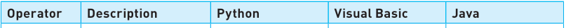

|**Operator**|**Description**|**Python**|**Visual Basic**|**Java**|
|---|---|---|---|---|
||||||
|**AND**|Both True|**and**|**And**|**&&**|
|**OR**|Either True|**or**|**Or**|**||**|
|**NOT**|Not True|**not**|**Not**|**!**|

## **Activity 8.10** 

In the high-level programming language that your school has chosen to use, write and test a short program to perform all these comparisons and output the results. **»** Input two numbers, **Number1** and **Number2** 

- **»** Compare **Number1** and **Number2** : 

   - Output with a suitable message if both numbers are not equal 

   - Output with a suitable message identifying which number is largest 

   - Output with a suitable message identifying which number is smallest 

   - Output with a suitable message if both numbers are equal 

- **»** Input another number **Number3** 

   - Output with a suitable message if all three numbers are not equal 

   - Output with a suitable message identifying which number is largest 

   - Output with a suitable message identifying which number is smallest 

   - Output with a suitable message if all numbers are equal. 

### 8.1.5 Use of nested statements

Selection and iteration statements can be nested one inside the other. This powerful method reduces the amount of code that needs to be written and makes it simpler for a programmer to test their programs. 

One type of construct can be nested within another – for example, selection can be nested within a condition-controlled loop, or one loop can be nested within another loop. 

## **Worked example** 

For example, the following pseudocode algorithm uses nested loops to provide a solution for the problem set out here: 

- **»** calculate and output highest, lowest, and average marks awarded for a class of twenty students 

- **»** calculate and output largest, highest, lowest, and average marks awarded for each student 

- **»** calculate and output largest, highest, lowest, and average marks for each of the six subjects studied by the student; each subject has five tests. 

- **»** assume that all marks input are whole numbers between 0 and 100. 

// Declarations of the variables needed 

DECLARE ClassAverage, StudentAverage, SubjectAverage : REAL DECLARE Student, Subject, Test : INTEGER DECLARE ClassHigh, ClassLow, ClassTotal : INTEGER DECLARE StudentHigh, StudentLow, StudentTotal : INTEGER DECLARE SubjectHigh, SubjectLow, SubjectTotal : INTEGER ClassHigh ← 0 ClassLow ← 100 ClassTotal ← 0 

// Use of constants enables you to easily change the values for testing CONSTANT NumberOfTests = 5 CONSTANT NumberOfSubjects = 6 CONSTANT ClassSize = 20 FOR Student ← 1 TO ClassSize StudentHigh ← 0 You will need to set up these values to use in StudentLow ← 100 your middle loop. StudentTotal ← 0 FOR Subject ← 1 TO NumberOfSubjects SubjectHigh ← 0 You will need to set up these values to use in SubjectLow ← 100 your inner loop. SubjectTotal ← 0 FOR Test ← 1 TO NumberOfTests OUTPUT "Please enter mark " INPUT Mark IF Mark > SubjectHigh THEN SubjectHigh ← Mark ENDIF IF Mark < SubjectLow THEN SubjectLow  ← Mark 

ENDIF You will need to use SubjectTotal ← SubjectTotal + Mark this output from your NEXT Test inner loop. SubjectAverage ← SubjectTotal / NumberOfTests OUTPUT "Average mark for Subject ", Subject, " is ", SubjectAverage OUTPUT "Highest mark for Subject ", Subject, " is ", SubjectHigh OUTPUT "Lowest mark for Subject ", Subject, " is ", SubjectLow IF SubjectHigh > StudentHigh THEN StudentHigh ← SubjectHigh ENDIF IF SubjectLow < StudentLow THEN StudentLow ← SubjectLow ENDIF StudentTotal ← StudentTotal + SubjectTotal NEXT Subject StudentAverage ← StudentTotal / (NumberOfTests * NumberOfSubjects OUTPUT "Average mark for Student ", Student, " is ", StudentAverage OUTPUT "Highest mark for Student ", Student, " is ", StudentHigh OUTPUT "Lowest mark for Student ", Student, " is ", StudentLow IF StudentHigh > ClassHigh THEN You will need to use these outputs from ClassHigh = StudentHigh your middle loop. ENDIF IF StudentLow < ClassLow THEN ClassLow ← StudentLow ENDIF ClassTotal ← ClassTotal + StudentTotal NEXT Student ClassAverage ← ClassTotal / (NumberOfTests * NumberOfSubjects * ClassSize) OUTPUT "Average mark for Class is ", ClassAverage OUTPUT "Highest mark for Class is ", ClassHigh OUTPUT "Lowest mark for Class is ", ClassLow 

Have a look at the pseudocode, start with the inner loop for the number of tests. 

## **Activity 8.11** 

In the high-level programming language that your school has chosen to use, use the pseudocode solution to help you to write and test a short program to calculate and output largest, highest, lowest and average marks for a single subject with five tests taken by a student. 

Hints: 

**»** Look at the other statements and output needed as well as the loop. 

**»** For testing purposes, you can reduce the number of tests to two or three. 

Now look at the middle loop that surrounds the inner loop for the number of students. 

## **Activity 8.12** 

When the single subject program is working, extend it to calculate and output largest, highest, lowest, and average marks for a single student with six subjects studied by a student. 

Hints: 

**»** Look at the other statements and outputs needed as well as the loop. 

**»** For testing purposes reduce the number of subjects to two or three. 

Finally look at the whole program that includes the outer loop for the whole class. 

## **Activity 8.13** 

When the single student program is working, extend your program to complete the task to calculate and output the largest, highest, lowest, and average marks for the whole class of 20 students. 

Hint: 

**»** For testing purposes reduce the class size to two or three. 

### 8.1.6 Procedures and functions

When writing an algorithm, there are often similar tasks to perform that make use of the same groups of statements. Instead of repeating these statements and writing new code every time they are required, many programming languages make use of subroutines, also known as named **procedures** or **functions** . These are defined once and can be called many times within a program. 

## **Procedures, functions and parameters** 

A **procedure** is a set of programming statements grouped together under a single name that can be called to perform a task at any point in a program. 

A **function** is a set of programming statements grouped together under a single name that can be called to perform a task at any point in a program. In contrast to a procedure, a function will return a value back to the main program. 

**Parameters** are the variables that store the values of the arguments passed to a procedure or function. Some but not all procedures and functions will have parameters. 

## **Definition and use of procedures and functions, with or without parameters** 

Procedures without parameters 

Here is an example of a procedure without parameters in pseudocode: 

PROCEDURE Stars OUTPUT"************" ENDPROCEDURE 

The procedure can then be called in the main part of the program as many times as is required in the following way: 

CALL Stars 

Instead of calling them procedures, different terminology is used by each programming language. Procedures are known as: 

- **»** void functions in Python 

- **»** subroutines in VB 

- **»** methods in Java. 

## ▼ **Table 8.22** Procedure calls 

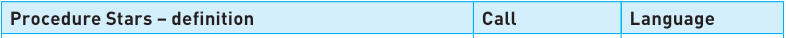

|**Procedure Stars – definition**|**Call**|**Language**|
|---|---|---|
||||
|**def Stars():** **print("************")**|**Stars()**|Python|
|**Sub Stars()** **Console.WriteLine("************")** **End Sub**|**Stars()**|Visual Basic|
|**static void Stars()** **{** **System.out.println("***********");** **}**|**Stars();**|Java|

## **Activity 8.14** 

Write a short program in your chosen programming language to define and use a procedure to display three lines of stars. 

It is often useful to pass a value to a procedure that can be used to modify the action(s) taken. For example, to decide how many stars would be output. This is done by passing an argument when the procedure is called to be used as a parameter by the procedure. 

## Procedures with parameters 

Here is an example of how a procedure with parameters can be defined in pseudocode. 

We can add parameters to a procedure: 

PROCEDURE Stars (Number : INTEGER) Parameter with DECLARE Counter : INTEGER data type FOR Counter ← 1 TO NUMBER OUTPUT "*" NEXT Counter ENDPROCEDURE 

Procedure with parameters are called like this – in this case to print seven stars: 

CALL Stars (7) MyNumber ← 7 CALL stars (MyNumber) 

Or: 

A procedure call must match the procedure definition. This means that when a procedure is defined with parameters, the arguments in the procedure call should match the parameters in the procedure definition. For IGCSE Computer Science the number of parameters used is limited to two. 

## ▼ **Table 8.23** Procedures with parameters 

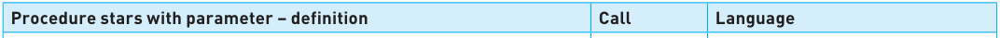

|**Procedure stars with parameter – definition**|**Call**|**Language**|
|---|---|---|
||||
|**def Stars(Number):** **for counter in range (Number):** **print("*", end = "")**|**Stars(7)**|Python Note:**end = ""**ensures that the stars are printed on one line without spaces between them.|
|**Sub Stars(Number As Integer)** **Dim Counter As Integer** **For Counter = 1 To Number** **Console.Write("*")** **Next** **End Sub**|**Stars(7)**|VB|
|**static void Stars(int Number)** **{** **for (int Counter = 1; Counter <= Number; Counter ++)** **{** **System.out.print("*");** **}** **}**|**Stars(7);**|Java|

## **Activity 8.15** 

Extend your short program in your chosen programming language to define and use a procedure that accepts a parameter to write a given number of lines of stars. You will find the following commands useful: **» \n** in Python **» Writeline** in Visual Basic **» Println** in Java. 

## **Functions** 

A function is just like a procedure except it **always** returns a value. Just like a procedure it is defined once and can be called many times within a program. Just like a procedure it can be defined with or without parameters. 

Unlike procedures, function calls are not standalone and instead can be made on the right-hand side of an expression. 

Instead of naming them functions, different terminology is used by some programming languages. Functions are known as: 

**»** fruitful functions in Python 

**»** functions in VB 

- **»** methods with returns in Java. 

The keyword **RETURN** is used as one of the statements in a function to specify the value to be returned. This is usually the last statement in the function definition. 

For example, here is a function written in pseudocode to convert a temperature from Fahrenheit to Celsius: 

Parameter and function return both have defined data types. 

FUNCTION Celsius (Temperature : REAL) RETURNS REAL RETURN (Temperature – 32) / 1.8 ENDFUNCTION 

Because a function returns a value, it can be called by assigning the return value directly into a variable as follows: 

MyTemp ← Celsius(MyTemp) 

## ▼ **Table 8.24** Function definitions 

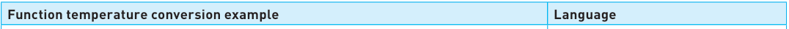

|**Function temperature conversion example**|**Language**|
|---|---|
|||
|**def Celsius(Temperature):** **return (Temperature - 32) / 1.8**|Python – data type of function does not need to be defined|
|**Function Celsius(ByVal Temperature As Decimal) As Decimal** **Return (Temperature - 32) / 1.8** **End Function**|Visual Basic|
|**static double Celsius(double Temperature)** **{** **return (Temperature - 32) / 1.8;** **}**|Java|

Just like with a procedure, a function call must match the function definition. When a function is defined with parameters, the **arguments** in the function call should match the parameters in the procedure definition. For IGCSE Computer Science the number of parameters used is limited to two. 

## **Activity 8.16** 

Write an algorithm in pseudocode as a function, with a parameter, to convert a temperature from Celsius to Fahrenheit. Test your algorithm by writing a short program in your chosen programming language to define and use this function. 

When procedures and functions are defined, the first statement in the definition is a **header** , which contains: 

- **»** the name of the procedure or function 

- **»** any parameters passed to the procedure or function, and their data type 

- **»** the data type of the return value for a function. 

Procedure calls are single standalone statements. Function calls are made as part of an expression, on the right-hand side. 

## **Local and global variables** 

A **global variable** can be used by any part of a program – its **scope** covers the whole program. 

A **local variable** can only be used by the part of the program it has been declared in – its **scope** is restricted to that part of the program. 

For example, in this algorithm the variables **Number1** , **Number2** and **Answer** are declared both locally and globally, whereas Number3 is only declared locally. 

DECLARE Number1, Number2, Answer : INTEGER PROCEDURE Test Global variables DECLARE Number3, Answer : INTEGER Number1 ← 10 Number2 ← 20 Local variables Number3 ← 30 Answer ← Number1 + Number2 OUTPUT "Number1 is now ", Number1 OUTPUT "Number2 is now ", Number2 OUTPUT "Answer is now ", Answer ENDPROCEDURE Number1 ← 50 Number2 ← 100 Answer ← Number1 + Number2 OUTPUT "Number1 is ", Number1 OUTPUT "Number2 is ", Number2 OUTPUT "Answer is ", Answer CALL Test OUTPUT "Number1 is still ", Number1 OUTPUT "Number2 is still ", Number2 OUTPUT "Answer is still ", Answer OUTPUT "Number3 is ", Number3 

## The output is 

Number1 is 50 Number2 is 100 Answer is 150 Number1 is now 10 Number2 is now 20 Answer is now 30 Number1 is still 50 Number2 is still 100 Answer is still 150 ERROR - Number3 is undefined 

The final line is an error because the main program has tried to access the variable **Number3** , which is local to the procedure. 

## **Activity 8.17** 

Write and test a short program for the sample algorithm in your chosen programming language. 

## **Activity 8.18** 

Consider your program for Activity 8.13. State the variables that should be declared and used as local variables if procedures are used for: 

- **»** The calculation of the highest, lowest, and average marks awarded for each subject 

- **»** The calculation of the highest, lowest, and average marks awarded for each student. 

> **Find out more:** As a further challenge rewrite your program for Activity 8.13 using procedures and local and global variables.

## **Advice** 

As well as library routines, typical IDEs also contain an editor, for entering code, and an interpreter and/or a compiler, to run the code. 

### 8.1.7 Library routines

Many programming language development systems include **library routines** that are ready to incorporate into a program. These routines are fully tested and ready for use. A programming language IDE usually includes a standard library of functions and procedures. These standard library routines perform many types of task – such as the string handling discussed in Section 8.1.4. 

Each programming language has many library routines for standard tasks that are commonly required by programs. Sometimes a set of routines needs to be specifically identified in a program. For example, in Java, the statement **import java.lang.String;** is required at the start of a program to provide access to the string handling library. 

You will need to use these library routines in your programs for IGCSE Computer Science: 

- **» MOD** – returns remainder of a division 

- **» DIV** – returns the quotient (i.e. the whole number part) of a division 

- **» ROUND** – returns a value rounded to a given number of decimal places 

- **» RANDOM** – returns a random number. 

Here are some examples of these library routines in pseudocode: 

**Value1**[¨] **MOD(10,3)** returns the remainder of **10** divided by **3** 

**Value2**[¨] **DIV(10,3)** returns the quotient of **10** divided by **3** 

**Value3**[¨] **ROUND(6.97354, 2)** returns the value rounded to **2** decimal places 

**Value4**[¨] **RANDOM()** returns a random number between **0** and **1** inclusive 

## **Activity 8.19** 

Identify the values of the variables **Value1** , **Value2** and **Value3** . 

Here are the same examples, written in each programming language: 

- **Table 8.25** MOD, DIV, ROUND and RANDOM programming examples 

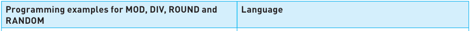

|**Programming examples for MOD, DIV, ROUND and** **RANDOM**|**Language**|
|---|---|
|||
|**Value1 = 10%3** **Value2 = 10//3** **Value = divmod(10,3)** **Value3 = round(6.97354, 2)** **from random import random** **Value4 = random()**|Python – MOD uses the**%**operator and DIV the**//** operator The function**divmod(x,y)**provides both answers where the first answer is DIV and the second answer is MOD RANDOM needs to import the library routine**random**, and then the function:**random()**can be used afterwards|
|**Value1 = 10 Mod 3** **Value2 = 10 \ 3** **Value3 = Math.Round(6.97354, 2)** **Value4 = Rnd()**|Visual Basic – DIV uses the**\**operator|
|**import java.lang.Math;** **Value1 = 10%3;** **Value2 = 10/3;** **Value3 = Math.round(6.97354 * 100)/100.0;** **import java.util.Random;** **Random rand = new Random();** **double Value4 = rand.nextDouble();**|Java – MOD uses the**%**operator DIV uses the normal division operator; if the numbers being divided are both integers then integer division is performed, as shown. Java imports the library routine**Math** **Math.round**only rounds to whole numbers RANDOM needs to import the library routine**Random**|

## **Advice** 

A program written for a real task should be understandable to another programmer. Program code in a structured questions may not always follow these rules, to test your ability to trace the steps in a routine or correct some errors. 

## **Activity 8.20** 

Write and test a short program in your chosen programming language to: **»** input two integers a and b and then find **a MOD b** and **a DIV b** 

- **»** create a random integer between 100 and 300. 

### 8.1.8 Creating a maintainable program

Once a program is written, it may need to be maintained or updated by another programmer at a later date. The programmer may have no documentation other than a copy of the source program. Even a programmer looking at their own program several years later may have forgotten exactly how all the tasks in it were completed! 

A maintainable program should: 

- **»** always use meaningful identifier names for: 

   - variables 

   - constants 

   - arrays 

   - procedures 

   - functions 

   - **»** be divided into modules for each task using: 

      - procedures 

      - functions 

   - **»** be fully commented using your programming language’s commenting feature. 

- **Table 8.26** Programming languages commenting features 

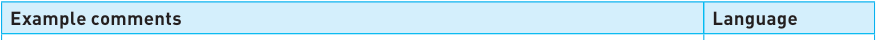

|**Example comments**|**Language**|
|---|---|
|||
|**#Python uses hash to start a comment for every line**|Python|
|**‘Visual Basic uses a single quote to start a comment for** **‘ every line**|Visual Basic|
|**// Java uses a double slash to start a single line comment** **and** **/* to start multiple line comments** **and to end them** ***/**|Java|

## **Activity 8.21** 

Check your last two programs and make sure they could be maintained by another programmer. Swap your program listing with another student and check that they can understand it. 

## 8.2 Arrays

An **array** is a data structure containing several elements of the same data type; these elements can be accessed using the same identifier name. The position of each element in an array is identified using the array’s **index** . 

### 8.2.1 One- and Two-dimensional arrays

Arrays are used to store multiple data items in a uniformly accessible manner; all the data items use the same identifier and each data item can be accessed separately by the use of an index. In this way, lists of items can be stored, searched and put into an order. For example, a list of names can be ordered alphabetically, or a list of temperatures can be searched to find a particular value. 

The first element of an array can have an index of zero or one. However, most programming languages automatically set the first index of an array to zero. 

Arrays can be one-dimensional or multi-dimensional. One-dimensional and two-dimensional arrays are included the IGCSE Computer Science syllabus. 

### 8.2.2 Declaring and populating arrays with iteration

## **One-dimensional arrays** 

A one-dimensional array can be referred to as a list. Here is an example of a list with 10 elements in it where the first element has an index of zero. 

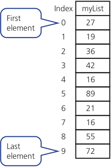

- **Figure 8.10** A one-dimensional array 

When a one-dimensional array is declared in pseudocode: 

- **»** the name of the array 

- **»** the first index value 

- **»** the last index value 

- **»** and the data type 

are included. 

For example, to declare a new array called **MyList** : 

DECLARE MyList : ARRAY[0:9] OF INTEGER 

Each position in the array can be populated in an array by defining the value at each index position. For instance, we can add the number 27 to the fourth position in the array **MyList** as follows: 

MyList[4] ← 27 

To populate the entire array instead we can use a loop: 

OUTPUT "Enter these 10 values in order 27, 19, 36, 42, 16, 89, 21, 16, 55, 72" FOR Counter ← 0 TO 9 OUTPUT "Enter next value " INPUT MyList[Counter] NEXT Counter 

Notice that in this code we have used the variable **Counter** as the array index. 

We can display the data that lies in a particular location in an array as follows: 

OUTPUT MyList[1] 

This would display the value 19. 

## **Activity 8.22** 

In your chosen programming language write a short program to declare and populate the array **MyList** , as shown in Figure 8.10, using a **FOR** loop. 

Arrays can also be populated as they are declared. 

- **Table 8.27** Array population 

|**Array**|**Language**|
|---|---|
|||
|**myList = [27, 19, 36, 42, 16, 89, 21, 16, 55, 72]**|Python|
|**Dim myList = New Integer() {27, 19, 36, 42, 16, 89, 21, 16, 55, 72}**|Visual Basic|
|**int[] myList = {27, 19, 36, 42, 16, 89, 21, 16, 55, 72};**|Java|

## **Two-dimensional arrays** 

A two-dimensional array can be referred to as a table, with rows and columns. Here is an example of a table with 10 rows and 3 columns, which contains 30 elements. The first element is located at position 0,0. 

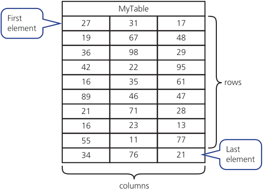

- **Figure 8.11** A two-dimensional array 

When a two-dimensional array is declared in pseudocode: 

- **»** the first index value for rows 

- **»** the last index value for rows 

- **»** the first index value for columns 

- **»** the last index value for columns 

- **»** and the data type 

are included. 

For example: 

DECLARE MyTable : ARRAY[0:9,0:2] OF INTEGER 

The declared array can then be populated using a loop, just like for onedimensional arrays – however this time there need to be two nested loops, one for each index: 

OUTPUT "Enter these values in order 27, 19, 36, 42, 16, 89, 21, 16, 55, 34" OUTPUT "Enter these values in order 31, 67, 98, 22, 35, 46, 71, 23, 11, 76" OUTPUT "Enter these values in order 17, 48, 29, 95, 61, 47, 28, 13, 77, 21" FOR ColumnCounter ← 0 TO 2 FOR RowCounter ← 0 TO 9 OUTPUT "Enter next value " INPUT MyTable[RowCounter, ColumnCounter] NEXT RowCounter NEXT ColumnCounter 

We can display the data that lies in a particular location in a two-dimensional array as follows: 

OUTPUT MyList[2,1] 

This would display the value 98. 

## **Advice** 

## **Notes on Python and arrays** 

Instead of arrays, Python uses another object called a list. The differences you need to know are: 

- **»** a list can contain different data types whereas arrays must all hold the same type of data 

- **»** to achieve the same structure as a two-dimensional array, Python embeds lists within another. 

Two-dimensional arrays are populated in each language as follows: 

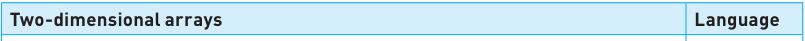

|**Two-dimensional arrays**|**Language**|
|---|---|
|||
|**MyTable = [[27, 31, 17], [19, 67, 48],[36, 98, 29],[42, 22, 95],** **[16, 35, 61], [89, 46, 47], [21, 71, 28], [16, 23, 13],** **[55, 11, 77] [34, 76, 21]]**|Python|
|**Dim MyTable = New Integer(8, 2) {{27, 31, 17}, {19, 67, 48},** **{36, 98, 29}, {42, 22, 95}, {16, 35, 61}, {89, 46, 47},**  **{21, 71, 28}, {16, 23, 13}, {55, 11, 77}, (34, 76, 21)}**|Visual Basic|
|**int[][] MyTable = {{27, 31, 17}, {19, 67, 48},** **{36, 98, 29}, {42, 22, 95}, {16, 35, 61}, {89, 46, 47},**  **{21, 71, 28}, {16, 23, 13}, {55, 11, 77}, {34, 76, 21}};**|Java|

## **Activity 8.23** 

In your chosen programming language, write a program to declare and populate the array **MyTable** , as shown in Figure 8.11, using a nested **FOR** loop. 

## 8.3 File handling

### 8.3.1 Purpose of storing data in a file

Computer programs store data that will be required again in a **file** . While any data stored in RAM will be lost when the computer is switched off, when data is saved to a file it is stored permanently. Data stored in a file can thus be accessed by the same program at a later date or accessed by another program. Data stored in a file can also be sent to be used on other computer(s). The storage of data in files is one of the most used features of programming. 

### 8.3.2 Using files

Every file is identified by its filename. In this section, we are going to look at how to read and write a line of text or a single item of data to a file. 

Here are examples of writing a line of text to a file and reading the line of text back from the file. The pseudocode algorithm has comments to explain each stage of the task. 

## **pseudocode** 

DECLARE TextLine : STRING  // variables are declared as normal DECLARE MyFile : STRING MyFile ← "MyText.txt" // writing the line of text to the file OPEN MyFile FOR WRITE  // opens file for writing OUTPUT "Please enter a line of text" INPUT TextLine WRITEFILE, TextLine  // writes a line of text to the file CLOSEFILE(MyFile)  // closes the file // reading the line of text from the file OUTPUT "The file contains this line of text:" OPEN MyFile FOR READ  // opens file for reading READFILE, TextLine  // reads a line of text from the file OUTPUT TextLine CLOSEFILE(MyFile)  // closes the file 

## **Python** 

# **writing to and reading a line of text from a file MyFile = open ("MyText.txt","w") TextLine = input("Please enter a line of text ") MyFile.write(TextLine) Myfile.close() print("The file contains this line of text") MyFile = open ("MyText.txt","r") TextLine = MyFile.read() print(TextLine) Myfile.close()** 

## **Visual Basic** 

**'writing to and reading from a text file Imports System.IO Module Module1 Sub Main() Dim textLn As String Dim objMyFileWrite As StreamWriter Dim objMyFileRead As StreamReader objMyFileWrite = New StreamWriter("textFile.txt") Console.Write("Please enter a line of text  ") textLn = Console.ReadLine() objMyFileWrite.WriteLine(textLn) objMyFileWrite.Close() Console.WriteLine("The line of text is  ") objMyFileRead = New StreamReader("textFile.txt") textLn = objMyFileRead.ReadLine Console.WriteLine(textLn) objMyFileRead.Close() Console.ReadLine() End Sub End Module** 

## **Java** 

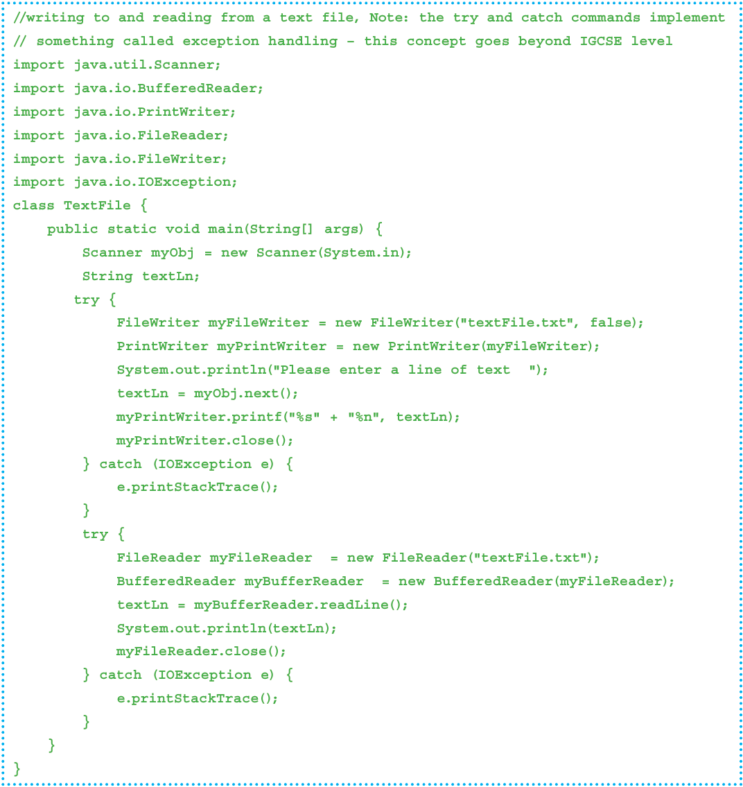

## **Activity 8.24** 

Use the program written in your chosen programming language to write a line of text to a file and read it back from the file. Use the comments in the pseudocode to help you write comments to explain how the file handling works. 

## **Activity 8.25** 

Using pseudocode write an algorithm to copy a line of text from one text file to another text file. 

In this chapter, you have learnt about: 

- ✔ declare, use and identify appropriate data types for variables and constants 

- ✔ understand and use input and outputs 

- ✔ understand and use the programming concepts: sequence, selection, iteration, totalling, counting and string handling 

- ✔ understand and use nested statements 

- ✔ understand and use arithmetic, logical and Boolean operators 

- ✔ understand and use procedures, functions and library routines 

- ✔ write maintainable programs 

- ✔ declare, use, identify appropriate data types for, read and write arrays with one and two dimensions 

- ✔ store data in a file and retrieve data from a file. 

## **Key terms used throughout this chapter** 

**variable** – a named data store that contains a value that may change during the execution of a program 

**constant** – a named data store that contains a value that does not change during the execution of a program 

**declare** – define the value and data type of a variable or constant 

**integer** – a positive or negative whole number that can be used with mathematical operators 

**real number** – a positive or negative number with a fractional part; Real numbers can be used with mathematical operators 

**char** – a variable or constant that is a single character 

**string** – a variable or constant that is several characters in length. Strings vary in length and may even have no characters (an empty string); the characters can be letters and/or digits and/or any other printable symbol 

**sequence** – the order in which the steps in a program are executed 

**selection** – allowing the selection of different paths through the steps of a program 

**iteration** – a section of programming code that can be repeated under certain conditions 

**counting** – keeping track of the number of times an action is performed 

**totalling** – keeping a total that values are added to 

**operator** – a special character or word in a programming language that identifies an action to be performed 

**arithmetic operator** – an operator that is used to perform calculations 

**logical operator** – an operator that is used to decide the path to take through a program if the expression formed is true or false 

**Boolean operator** – an operator that is used with logical operators to form more complex expressions 

**nesting** – the inclusion of one type of code construct inside another 

**procedure** – a set of programming statements grouped together under a single name that can be called to perform a task in a program, rather than including a copy of the code every time the task is performed 

**function** – a set of programming statements grouped together under a single name which can be called to perform a task in a program, rather than including a copy of the code every time; just like a procedure except a function will return a value back to the main program 

**parameters** – the variables in a procedure or function declaration that store the values of the arguments passed from the main program to a procedure or function 

**MOD** – an arithmetic operator that returns the remainder of a division; different languages use different symbols for this operation 

**DIV** – an arithmetic operator that returns the quotient (whole number part) of a division; different languages use different symbols for this operation 

**ROUND** – a library routine that rounds a value to a given number of decimal places 

**RANDOM** – a library routine that generates a random number 

**array** – a data structure containing several elements of the same data type; these elements can be accessed using the same identifier name 

**index** – identifies the position of an element in an array 

**file** – a collection of data stored by a computer program to be used again 

## Exam-style questions 

|**1**|Variables and constants are used for data storage in computer programs.|Variables and constants are used for data storage in computer programs.|Variables and constants are used for data storage in computer programs.||
|---|---|---|---|---|
||Discuss the similarities and differences between these data stores.|||[4]|
|**2**|A programmer is writing a program that stores data about items stored||||
||in a warehouse. Suggest suitable meaningful names and||data types for:||
||**»**Item name||||
||**»**Manufacturer||||
||**»**Description||||
||**»**Number in stock||||
||**»**Reorder level||||
||**»**Whether the item is on order or not.|||[6]|
|**3**|Programming concepts include:||||
||**»**sequence||||
||**»**selection||||
||**»**iteration||||
||**»**totalling||||
||**»**counting.||||
||Describe each concept and provide an example of program code||||
||to show how it is used.|||[10]|
|**4**|Write a short pseudocode algorithm to input a password, check that it||||
||has exactly 8 characters in it, check that all the letters||are upper case,||
||and output the message "Password meets the rules" if both these||||
||conditions are true.|||[6]|
|**5**|Programs can use both local and global variables.||||
||Describe, using examples, the difference between local|and global|||
||variables.|||[6]|
|**6**|Explain why programmers find library routines useful when writing||||
||programs. Include in your answer with**two**examples of||library||
||routines that programmers frequently use.|||[4]|
|**7**|A two-dimensional array stores the first name and family name of ten people.||||
||**a**Write a program in pseudocode to display the first name and||||
||family name of the ten people.|||[3]|
||**b**Extend your program to sort the ten names in order|of family|||
||name before displaying the names.|||[5]|
|**8**|A computer file,**"Message.txt"**, stores a line of text.||||
||Write an algorithm in pseudocode to display this line of||text.|[3]|
|**9**|**a**Describe the purpose of each statement in this algorithm.||||
||FOR I←1 TO 300 INPUT Name[I] NEXT I|||[2]|
||**b**Identify, using pseudocode, another loop structure that the||||
||algorithm in**part a**could have used.|||[1]|

**c** Write an algorithm, using pseudocode, to input a number between 0 and 100 inclusive. The algorithm should prompt for the input and output an error message if the number is outside this range. [3] 

**For IGCSE Computer Science, you should be able to write an understandable algorithm to solve a problem. Your algorithm should be easy to read and understand and may use any of the concepts in this chapter and Chapter 7.** 

**Here are some further problems for you to solve:** 

   - Write a program that meets the following requirements: 

   - **»** uses procedures to display these lists: 

      - staff phone numbers and names in alphabetic order of staff name 

      - members of staff grouped by office number 

   - **»** uses a procedure to display all the details for a member of staff, with the name used as a parameter 

   - **»** uses a procedure to update the details for a member of staff, with the name used as a parameter. 

- You must use program code with local and global variables and add comments to explain how your code works. [15] 

- **11** Use a trace table to test the program you have written in question **10** . [ _If you have used a real programming language to write your program then it is also good practice to run the program to test and help find errors._ ] [5] 

- **12** You can become a member of the town guild if you meet all the following requirements: 

   - **»** aged between 18 and 65 

   - **»** you have lived in the town for 20 years 

      - _or_ you have lived in the town for 5 years and both your parents still live in the town 

_or_ one parent has died and the other parent still lives in the town 

      - _or_ you and a brother or a sister have lived in the town for 10 years 

   - **»** you have half a million dollars in your bank account 

   - **»** you have never been to prison 

   - **»** at least two guild members support your application 

   - **»** if five guild members support your application then you could be excused one of the above requirements, apart from age 

   - Write a program that allows you to input answers to questions to ensure that you meet the requirements, issues a unique membership number if you do or explains all the reasons for failure if you don’t meet the requirements. [15] 

- **13** Use a trace table to test the program you have written in question 12. 

   - [ _If you have used a real programming language to write your program then it is also good practice to run the program to test and help find errors._ ] [5] 

