# CAIE Computer Science IGCSE — Chapter 9: Databases

---

## **In this chapter, you will learn about:** 

- ★ the design and use of single table databases 

   - fields 

   - records 

   - validation 

- ★ the use of basic data types 

   - text/alphanumeric 

   - character 

   - Boolean 

   - integer 

   - real 

   - date/time 

- ★ the identification, purpose and use of primary keys 

- ★ SQL scripts, used to query data stored in a single table database. 

## 9.1 Databases

### 9.1.1 Single-table databases

A **database** is a structured collection of data that allows people to extract information in a way that meets their needs. The data can include text, numbers, pictures; anything that can be stored in a computer. Relational databases will be studied at A Level but for IGCSE only single-table databases will be studied. A **single-table database** contains only one table. 

## **Why are databases useful?** 

Databases prevent problems occurring because: 

- **»** if any changes or additions are made it only has to be done once – data is consistent 

- **»** the same data is used by everyone 

- **»** data is only stored once in relational databases which means no data duplication. 

## **What are databases used for?** 

To store information about people, for instance: 

- **»** patients in a hospital 

- **»** pupils at a school. 

> **Find out more:** Find five more uses for databases, and for each one decide what sort of information is being stored. To store information about things, for instance: - **»** cars to be sold - **»** books in a library. To store information about events, for instance: - **»** hotel bookings - **»** results of races. 339 **9 Databases**

## **Fields and records – the building blocks for any database** 

Inside a database, data is stored in **tables** , which consists of many **records** . Each record consists of several **fields** . The number of records in a table will vary as new records can be added and deleted from a table as required. The number of fields in a table is fixed so each record contains the same number of fields. 

An easy way to remember this is: each record is a row in the table and each field is a column in the table. 

Note: while databases can contain multiple tables, all the databases considered in this chapter will contain a single table. 

## **Table** 

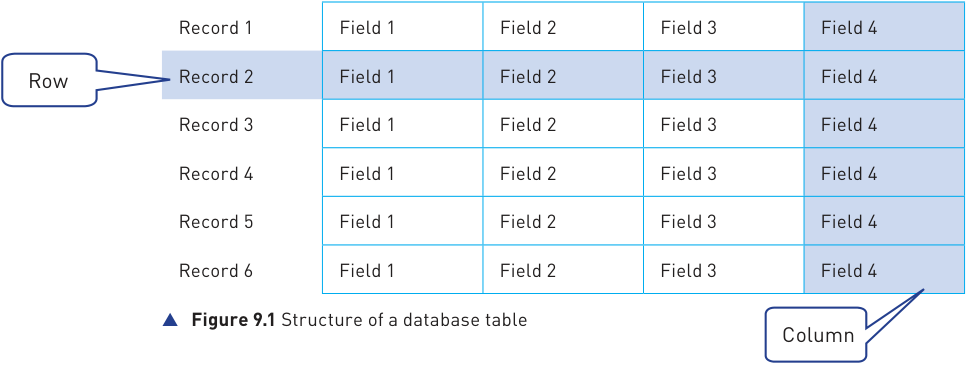

A table contains data about one type of item or person or event, and will be given a meaningful name, for example: 

- **»** a table of patients called **PATIENT** 

- **»** a table of books called **BOOK** 

- **»** a table of doctor’s appointments called **APPOINTMENT** . 

Each record within a table contains data about a single item, person or event, for example: 

- **»** Winnie Sing (a hospital patient) 

- **»** IGCSE Computer Science (a book) 

- **»** 15:45 on January 2020 (an appointment). 

As every record contains the same number of fields, each field in a record contains a specific piece of information about the single item, person or event stored in that record. Each field will have a meaningful name to identify the data stored in it, for example: 

- **»** For a hospital patient the fields could include: 

   - The patient’s first name field called **FirstName** 

   - The patient’s family name field called **FamilyName** 

   - The patient’s date of admission field called **DateOfAdmission** 

- The name of the patient’s consultant field called **Consultant** 

- The patient’s ward number field called **WardNumber** 

- The patient’s bed number field called **BedNumber** , etc. 

The PATIENT table structure could look like this: 

## **PATIENT Table** 

|Record 1 Record 2 Record 3 Record 4 Record 5 Record 6|FirstName|FamilyName|DateOfAdmission|Consultant|WardNumber|BedNumber|
|---|---|---|---|---|---|---|
||FirstName|FamilyName|DateOfAdmission|Consultant|WardNumber|BedNumber|
||FirstName|FamilyName|DateOfAdmission|Consultant|WardNumber|BedNumber|
||FirstName|FamilyName|DateOfAdmission|Consultant|WardNumber|BedNumber|
||FirstName|FamilyName|DateOfAdmission|Consultant|WardNumber|BedNumber|
||FirstName|FamilyName|DateOfAdmission|Consultant|WardNumber|BedNumber|

- **Figure 9.2** Structure of the PATIENT table 

- **»** For the table called BOOK the fields could include: 

   - Title of the book called **Title** 

   - Author of the book called **Author** 

   - **ISBN** , etc. 

## **Activity 9.1** 

State what fields would you expect to find in each record for the doctor’s appointments and give each field a suitable name. 

Note: Field names should be a single word, which should not contain any spaces, for example: **BedNumber** 

## **Validation** 

## **Link** 

The role of validation was discussed in Section 7.5. It may be worth the reader revisiting this part of the book before continuing with this chapter. 

Some validation checks will be automatically provided by the database For more on management software that is used to construct and maintain the database. Other validation see Section 7.5. validation checks need to be set up by the database developer during the construction of the database. 

The practical use of a database management system is strongly recommended for all students. Practical examples will be used throughout this chapter. The database management software used is _Microsoft Access 365_ as Microsoft Access is used by most schools with students studying IGCSE Computer Science. 

For example, the **DateOfAdmission** field will automatically be checked by the software to make sure that any data input is a valid date before it can be stored in the PATIENT table. 

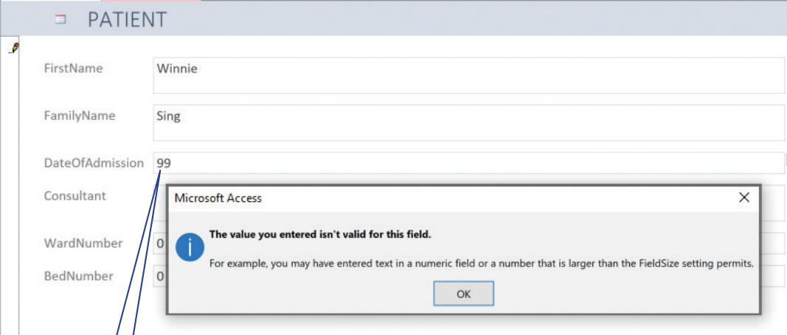

- **Figure 9.3** Automatic validation for entering **DateOfAdmission** in the PATIENT table 

> Invalid date However, the **WardNumber** field validation needs to be set up to allow only 

> automatically rejected values 1 to 10 to be entered. This task needs to be completed by the database developer before the database is used. 

Out of range ward number rejected 

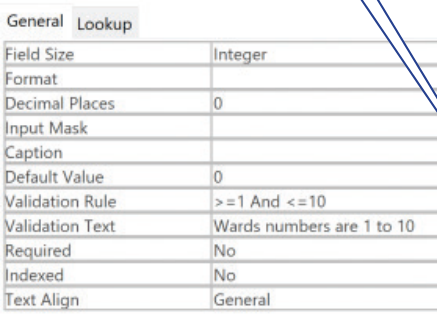

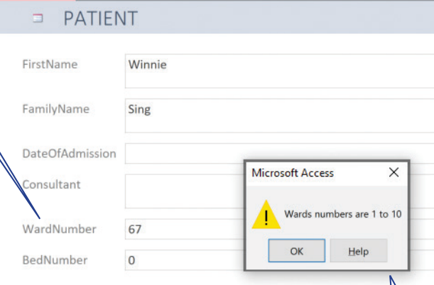

- **Figure 9.4** Validation rule for entering **WardNumber** in the PATIENT table 

### 9.1.2 Basic data types

Error message 

There are six basic data types that you need to be able to use in a database: 

- **»** text/alphanumeric 

- **»** character 

- **»** Boolean 

- **»** integer 

- **»** real 

- **»** date/time. 

## **What is a data type?** 

Each field will require a **data type** to be selected. A data type classifies how the data is stored, displayed and the operations that can be performed on the stored value. For example, a field with an integer data type is stored and displayed as a whole number and the value stored can be used in calculations. 

These database data types are specified in the syllabus. They are available to use as _Access_ data types, but the names _Access_ uses may be different from the terms in the syllabus. 

> **Find out more:** Using Access (or any other suitable database management software) find all the different date and time formats that are available to use.  |**Syllabus data type**|**Description**|**Access data type**| |---|---|---| |||| |text/alphanumeric|A number of characters|short text/longtext| |character|A single character|short text with a field size of one| |Boolean|One of two values: either True or False, 1 or 0, Yes or No|Yes/No| |integer|Whole number|number formatted as fixed with zero decimalplaces| |real|A decimal number|number formatted as decimal| |date/time|Date and/or time|Date/Time|

## **Activity 9.2** 

Using Access (or any other suitable database management software), set up a single table database to store the PATIENT records using the fields given previously: 

**FirstName** , **FamilyName** , **DateOfAdmission** , **Consultant** , **WardNumber** , **BedNumber.** 

- **»** Choose a suitable data type for each field. 

- **»** Include validation checks to make sure that the ward number has whole number values from 1 to 10, and that the bed number has whole number values from 1 to 8. 

- **»** Enter the following data in the PATIENT table: 

Winnie Sing, 12/10/2022, Mr Smith, 6, 8 

Steve Chow, 23/10/2022, Miss Abebe, 6, 3 

Chin Wee, 30/10/2022, Mr Jones, 7, 1 

Min Hoo, 1/11/2022, Mr Smith, 6, 1 

Peter Patel, 12/11/2022, Mr Jones, 7, 8 

Sue Sands, 19/11/2022, Miss Abebe, 6, 2 

Farouk Khan, 22/11/2022, Mr Jones, 7, 4 

Ahmad Teo 22/11/2022, Mr Jones, 7, 2 

You may want to look at the instructions on how to set up the CubScout database later in this chapter if you have not set up a database before. 

### 9.1.3 Primary keys

As each record within a table contains data about a single item, person, or event, it is important to be able to uniquely identify this item. In order to reliably identify an item from the data stored about it in a record there needs to be a field that uniquely identifies the item. This field is called the **primary key** . 

A field that is a primary key must contain data values that are never repeated in the table. 

The primary key can be a field that is already used, provided it is unique, for example the ISBN in the book table. The PATIENT table would need an extra field for each record as all of the existing fields could contain repeated data. To create a primary key, we could add a new field to each record, for example a unique number could be added to each patient’s record. The extra field is: 

- **»** Primary key field called **HospitalNumber** 

## **Activity 9.3** 

Using _Access_ (or any other suitable database management software), add the **HospitalNumber** field to the single table database PATIENT. 

- **»** Choose ‘text’ as the data type for this field. 

- **»** Include validation checks to ensure that 8 characters must be entered starting with **HN** followed by **6 digits** for example **HN123456** . 

- **»** Choose suitable data to store in each primary key field for the 6 patients in the table. 

## **Activity 9.4** 

- **1** Write down **four** database data types. Describe each data type and give an example of a field where it would be a suitable choice. 

- **2** Choose suitable words/phrases from the following list to correctly complete the paragraph that follows: 

Word list: database fields records record table primary key data type validation text char Boolean field 

You will need to use some words more than once. 

A single ……………………….. …………………….. contains one ……………………. . 

Each …………………….. consists of many …………………….. . Every …………………….. has the same number of …………………….. . Every …………………….. is given a …………………….. . Examples of data types are …………………….., …………………….. and …………………….. . Some …………………….. will have …………………….. rules. 

### 9.1.4 SQL

**Structured Query Language (SQL)** is the standard query language for writing scripts to obtain useful information from a database. We will be using SQL to obtain information from single-table databases. This will provide a basic understanding of how to obtain and display only the information required from a database. SQL is pronounced as es-queue-el. 

For example, somebody needing to visit a patient would only require the ward number and the bed number of that patient in order to find where they are in the hospital. Whereas a consultant could need a list of the names of all the patients that they care for. 

## **SQL scripts** 

An **SQL script** is a list of SQL commands that perform a given task, often stored in a file so the script can be reused. 

In order to be able to understand SQL and identify the output from an SQL script, you should have practical experience of writing SQL scripts. You can write scripts using SQL commands in _Access_ . There are many other applications that also allow you to do this – _MySQL_ and _SQLite_ are freely available ones. When using any SQL application, it is important that you check the commands available to use as these may differ slightly from those listed in the syllabus and shown below. 

You will need to be able to understand and identify the output from the following SQL statements. 

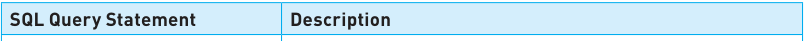

|**SQL Query Statement**|**Description**|
|---|---|
|||
|**SELECT**|Fetches specified fields (columns) from a table; queries always begin with**SELECT**.|
|**FROM**|Identifies the table to use.|
|**WHERE**|Includes only records (rows) in a query that match a given condition.|
|**ORDER BY**|Sorts the results from a query by a given column either alphabeticallyor numerically.|
|**SUM**|Returns the sum of all the values in a field (column). Used with**SELECT**.|
|**COUNT**|Counts the number of records (rows) where the field (column) matches a specified condition. Used with**SELECT**.|

An SQL command: 

Starts with **SELECT FROM** To identify the fields **:** To specify the to be displayed **:** table to be used Ends with **;** To show the end of the command 

Only the **SELECT** and **FROM** commands are mandatory in an SQL script. All other commands are optional. 

A **SELECT** statement takes the form: 

**SELECT Field1, Field2, Field3** , etc. – this specifies the individual fields (columns) to be shown. 

**SELECT *** – this specifies that **all** fields (columns) are to be shown. 

## A **FROM** statement takes the form: 

**FROM TableName** – this specifies the table to use. 

A **WHERE** statement takes the form: 

**WHERE Condition** – this specifies the condition to apply. 

Conditions often include values from fields, these values need to be stated in a form that matches the data type for the field. 

|**Field type**|**Example value**|**General notes**|**Access notes**|
|---|---|---|---|
|||||
|text|**'Mr Smith'**|Text field values should be in enclosed in single quotation marks.|Double quotation marks can also be used.|
|character|**'M'**|Character field values should be in enclosed in single quotation marks.|Double quotation marks can also be used.|
|Boolean|**TRUE**|Boolean can be**TRUE**or**FALSE**|Data type is Yes/No|
|integer|**12**|Integer field values should be whole numbers.|Allows integer or decimal values.|
|real|**12.01**|Real field values should be decimal numbers.|Allows integer or decimal values.|
|Date/time|**'22/11/2022'**|Date/time field values should be in enclosed in single quotation marks.|Date/time field values**must** be in enclosed in hashes (**#**).|

Conditions also require operators to compare values from fields. 

|**Operator**|**Description**|
|---|---|
|||
|**=**|equal to|
|**>**|greater than|
|**<**|less than|
|**>=**|greater than or equal to|
|**<=**|less than equal to|
|**<>**|not equal to|
|**BETWEEN**|between a range of two values|
|**LIKE**|search for apattern|
|**IN**|specifymultiple values|
|**AND**|specifymultiple conditions that must all be true|
|**OR**|specifymultiple conditions where one or more conditions must be true|
|**NOT**|specifya condition that must be false|

An **ORDER BY** statement takes the form: 

**ORDER BY Field1, Field2** , etc. – this specifies a sort in ascending or alphabetical order starting with the first field. 

**ORDER BY Field1, Field2 DESC** – this specifies a sort in descending or reverse alphabetical order starting with the first field. 

## A **SUM** statement takes the form: 

**SELECT SUM (Field)** – this specifies the field (column) for the calculation. The field should be integer or real. 

A **COUNT** statement takes the form: 

**SELECT COUNT (Field)** – this specifies the field (column) to count if the given criterium is met. 

## **Example 1: Display consultant’s patients** 

For example, the following SQL command for the PATIENT single-table database would provide a list of all Mr Smith’s patients showing the hospital number, first name and family name for each of his patients. 

SELECT HospitalNumber, FirstName, FamilyName 

FROM PATIENT WHERE Consultant = 'Mr Smith'; 

would display: 

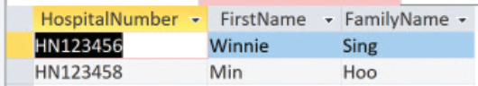

- **Figure 9.5** Output from the PATIENT table showing Mr Smith’s patients 

## **Example 2: Display consultant’s patients in alphabetical order** 

This SQL command sorts the records in alphabetical order of family name: 

SELECT HospitalNumber, FirstName, FamilyName FROM PATIENT WHERE Consultant = 'Mr Smith' ORDER BY FamilyName; 

would display: 

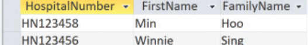

- **Figure 9.6** Output from the PATIENT table showing Mr Smith’s patients in alphabetical order of family name 

## **Activity 9.5** 

- **1** Using the single table database PATIENT you have created. 

   - **a** Write an SQL query to list all Mr Jones’ patients. 

   - **b** Write an SQL query to list all the patients not in ward 6. 

   - **c** Write an SQL query to list all the patients who arrived on 12/11/2022. 

   - **d** Write an SQL query to list all the patients who arrived between 12/10/2022 **AND** 30/10/2022. 

- **2** Write down the output from this SQL query. 

SELECT FirstName, FamilyName, BedNumber 

FROM PATIENT 

WHERE WardNumber = 7; 

## **Activity 9.6** 

- **1** Using the single table database PATIENT you have created. 

   - **a** Write an SQL query to count the number of patients in ward 7. 

   - **b** Write an SQL query to count the number of patients not in ward 7. 

- **2** Write down the output from this SQL query. 

SELECT HospitalNumber, FirstName, FamilyName, Consultant FROM PATIENT ORDER BY Consultant, FamilyName; 

## **Practical use of a database** 

As an IGCSE Computer Science student you need to be able to do the following: 

- **»** define a single-table database from given data storage requirements 

- **»** choose a suitable primary key for a database table 

**»** read, complete and understand SQL scripts. 

In order to do this, you will need to use a database management system. The following case study shows how to set up a database with _Microsoft Access 365_ and complete the tasks described above. 

Boys and girls between the ages of seven and eleven can join a cub scout group. (http://en.wikipedia.org/wiki/Cub_Scout). Each cub scout group needs to keep records about its members. Most groups will keep the following information about each cub in their group: 

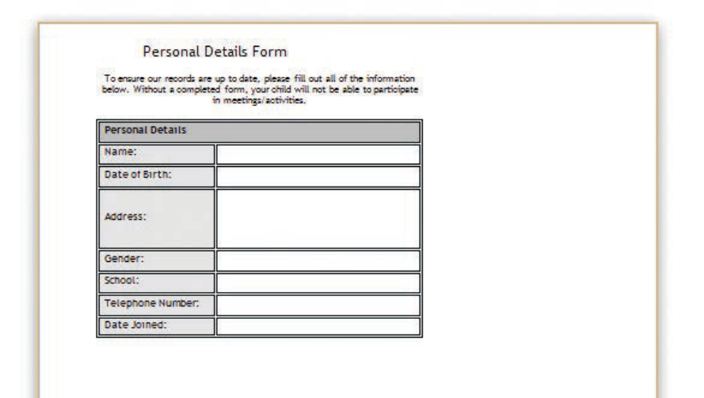

- **Figure 9.7** Enrolment form 

## **Define a single-table database from given data storage requirements and choose a suitable primary key** 

To create the cub scout database, open _Access_ and select the **Blank database** template. 

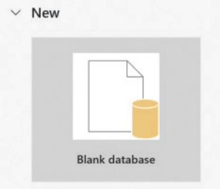

- **Figure 9.8** Blank database template 

Then type the Filename **CubScout** and click the create button. 

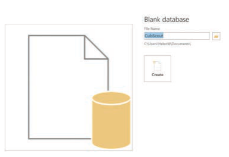

- **Figure 9.9** Creating the CubScout database 

Select the table design view... 

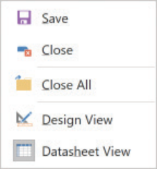

- **Figure 9.10** Design view 

....and name the table **CUB** . 

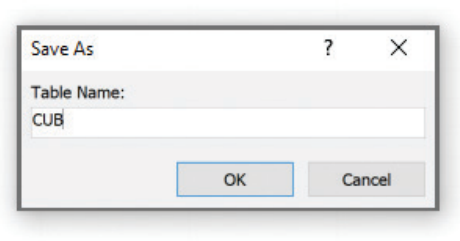

- **Figure 9.11** Naming the table 

Set up the fields to match the data collection form in Figure 9.7 and include an extra field for a primary key. 

Each field will require a meaningful name and a suitable data type must be selected. 

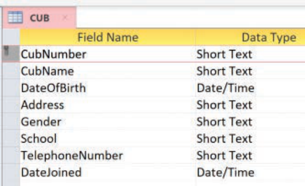

- **Figure 9.12** Fields for the CUB table 

Validation checks need to be built in for each field, for example the **Gender** field. 

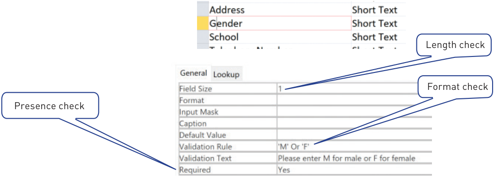

- **Figure 9.13** Validation rules for **Gender** field 

## **Activity 9.7** 

- **1 a** Set up a cub scout database including appropriate validation checks for each field. 

      - Enter data for at least 10 records. 

   - **b** The cub scout leader wants to put each cub into a group called a ‘six’; each ‘six’ can have up to six cubs in it and is given a name for example red, yellow, blue and green. 

      - Add a new text field called Six, and assign each cub to either a red, blue, yellow or green six. 

      - **i** Write an SQL query to pick out any cubs in the red six. **ii** Write an SQL query to pick out any cubs in the red six or the blue six. **iii** Write an SQL query to count the number of cubs in the red six. 

   - **c** The cub scout leader wants to calculate the number of badges that all the cubs have been awarded. Add a new integer field called _Badges_ , enter the number of badges awarded to each cub. 

      - Write an SQL query to count the number of badges awarded to the whole cub group. 

## **Activity 9.8** 

- **1** A database of students is to be set up with the following fields: 

   - **»** Family name 

   - **»** Other names 

   - **»** Student ID 

   - **»** Date of Birth 

   - **»** Date of Entry to School 

   - **»** Current Class 

   - **»** Current school year/grade 

   - **»** Email address. 

   - **a** Select a data type for each field. 

   - **b** Which fields should be validated, and which fields should be verified? 

   - **c** Decide the validation rules for those fields which should be validated. 

   - **d** Which field would you choose for the primary key? 

   - **e** Choose a suitable format for the student ID. 

   - **f** Build a database with at least 10 records; include all your validation checks. Ensure there are at least 3 different classes and 2 different years/grades. 

   - **g** Set up and test SQL scripts to: 

## **Link** 

- **i** Display Other names, Family and Email address in alphabetical order of family name. 

For more on **ii** Select all the students from each class in alphabetical order. verification, see **iii** Select all the students for each year/grade and print Other names, Chapter 7. Family name and Date of Birth, grouping the students by class. 

## **Extension** 

For those students interested in studying Computer Science at A Level, this is an extension of the use of SQL to build and modify a database as well as using SQL scripts to query an existing database. 

AS and A Level covers relational databases that consist of more than one table. 

## Industry standard methods for building and modifying a database 

Database Management Systems (DBMSs) use a **Data Definition Language (DDL)** to create, modify and remove the **data structures** that form a relational database. DDL statements are written as a script that uses syntax similar to a computer program. 

DBMSs also use a **Data Manipulation Language (DML)** to add, modify, delete and retrieve the **data** stored in a relational database. DML statements are written in a script that is similar to a computer program. 

These languages have different functions: DDL is used for working on the relational database structure, whereas DML is used to work with the data stored in the relational database. 

Most DBMSs use **Structured Query Language (SQL)** for both data definition (DDL) and data manipulation (DML). SQL was developed in the 1970s and since then it has been adopted as an industry standard. 

We have already covered some SQL commands used to manipulate data. These are the SQL (DDL) commands used to set up a database. 

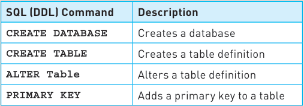

These are the data types used for attributes (fields) in SQL. 

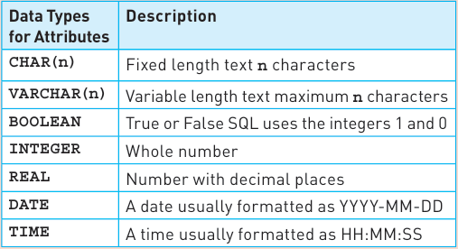

## **Extension Activity** 

Use SQL (DDL) commands to set up the PATIENT database. 

This SQL script could have been used to create the Cub Scout database. 

CREATE DATABASE CubScout CREATE TABLE CUB( CubName VARCHAR(30), DateOfBirth DATE, Address VARCHAR(40), Gender CHAR(1), School VARCHAR(30), TelephoneNumber, CHAR(14) DateJoined DATE); ALTER TABLE CUB ADD PRIMARY KEY (CubNumber); 

In this chapter, you have learnt about: 

- ✔ define a single-table database from a given set of requirements 

- ✔ suggest and use suitable data types for fields 

- ✔ choose an appropriate primary key for a record 

- ✔ understand SQL scripts used to query a single-table database. 

## **Key terms used throughout this chapter** 

**database** – a persistent structured collection of data that allows people to extract information in a way that meets their needs 

**single-table database** – a database contains only one table 

**table** – a collection of related records in a database 

**record** – a collection of fields that describe one item 

**field** – a database table 

**data type** – a classification of how data is stored and displayed, and of which operations that can be performed on the stored value 

**primary key** – a field in a database that uniquely identifies a record 

**Structured Query Language (SQL)** – the standard query language for writing scripts to obtain useful information from a relational database. 

**SQL scripts** – a list of SQL commands that perform a given task, often stored in a file so the script can be reused 

**SELECT** – an SQL command that fetches specified fields (columns) from a table 

**FROM** – an SQL command that identifies the table to use 

**WHERE** – an SQL command to include only those records (rows) in a query that match a given condition 

**ORDER BY** – an SQL command that sorts the results from a query by a given column either alphabetically or numerically 

**SUM** – an SQL command that returns the sum of all the values in a field (column); used with SELECT 

**COUNT** – an SQL command that counts the number of records (rows) in which the field (column) matches a specified condition; used with SELECT 

## Exam-style questions 

- **1** A motor car manufacturer offers various combinations of: 

   - **»** seat colours 

   - **»** seat materials 

   - **»** car paint colours. 

A table, CAR, was set up as single-table database to help customers choose which seat and paint combinations were possible. (NOTE: N = no, Seat materials not a possible combination, Y = yes, combination is possible) and colours 

Paint colours 

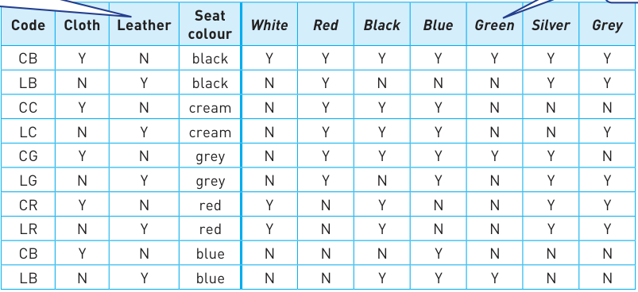

- **a i** State the number of records shown in the table. 

State the number of records shown in the table. [1] **ii** State the number of fields shown in the table. [1] 

   - **iii** State, with a reason, if any of the fields are suitable to use as primary key. [2] 

- **b** The following SQL command was used: 

SELECT Code FROM CAR WHERE SeatColour = 'Red' AND ('White' OR 'silver'); 

Show what will be displayed. 

[2] 

- **c** A customer wanted to know all the possible combinations for a car with leather seats and either silver or grey paint colour. Complete the SQL command required. 

SELECT * FROM ………………………………… WHERE ……………… leather AND (silver ……………… grey); 

[2] 

- **2** A company that sells bicycles keeps records of the items in stock in a table, CYCLE, using a single-table database. For each model of bicycle, the following data is kept: 

   - model number, for example: BY00007 

   - description of model, for example: lady’s shopper 

   - colour of frame, for example: gold and black 

– size of wheels, for example: 700 mm – price of model in $, for example: $309.50 – still being manufactured: Yes or No – number in stock. **a i** State, with a reason for your choice, the data type you would choose for each field in the table. [7] **ii** Identify, with a reason for each, the validation required for each of these fields: – model number – price – number in stock. [3] **iii** State, with a reason, the field that would be suitable to use as primary key. [2] **b** SQL commands are used to extract data from the table. Explain, using examples from your table, how each of these commands could be used: – **SELECT** – **FROM** – **WHERE** – **SUM** – **ORDER BY** [10] 

- **3** A database table, PERFORMANCE, is used to keep a record of the performances at a local theatre. 

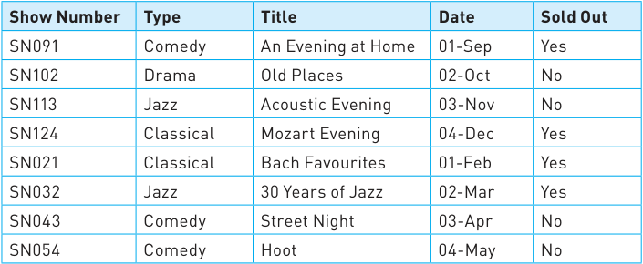

- **a** State the number of fields and records in the table. 

Fields ........................................................................................... 

Records ............................................................................................... [2] 

- **b** Give **two** validation checks that could be performed on the Show Number field. 

Validation check 1 .......................................................................... 

................................................................................................... 

Validation check 2 .......................................................................... 

................................................................................................... [2] 

