# CAIE Computer Science IGCSE — Chapter 10: Boolean logic

---

## **In this chapter, you will learn about:** 

- ★ the identification, definition, symbols and functions of the standard logic gates: NOT, AND, OR, NAND, NOR and XOR 

- ★ how to use logic gates to create logic circuits from: 

   - a given problem 

   - a logic expression 

   - a truth table 

- ★ how to complete truth tables from: 

   - a given problem 

   - a logic expression 

   - a logic circuit 

- ★ how to write a logic expression from: 

   - a given problem 

   - a logic circuit 

   - a truth table. 

## 10.1 Standard logic gate symbols

Electronic circuits in computers, solid state drives and controlling devices are made up of thousands of **logic gates** . Logic gates take binary inputs and produce a binary output. Several logic gates combined together form a **logic circuit** and these circuits are designed to carry out a specific function. 

The checking of the output from a logic gate or logic circuit is done using a **truth table** . 

This chapter will consider the function and role of logic gates, logic circuits and truth tables. Also a number of possible applications of logic circuits will be considered. A reference to **Boolean algebra** will be made throughout the chapter; but this is really outside the scope of this text book. However, Boolean algebra will be seen on many logic gate websites and is included here for completeness, since many students may prefer this notation to logic statements. 

### 10.1.1 Logic gate symbols

Six different logic gates will be considered in this chapter: 

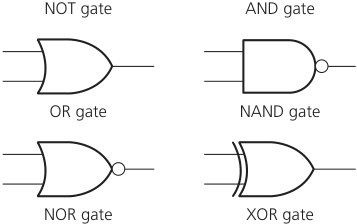

- **Figure 10.1** Logic gate symbols 

## **Truth tables** 

**Truth tables** are used to trace the output from a logic gate or logic circuit. The NOT gate is the only logic gate with one input; the other five gates have two inputs (see Figure 10.1). 

Although each logic gate can only have one or two inputs, the number of inputs to a logic circuit can  be more than 2; for example, three inputs give a possible 2[3] (=8) binary combinations. And for four inputs, the number of possible binary combinations is 2[4] (=16). It is clear that the number of possible binary combinations is a multiple of the number 2 in every case. The possible inputs in a truth table can be summarised as shown in Table 10.1. 

- **Table 10.1** All possible inputs for truth tables with two, three and four inputs 

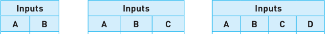

|0|0||0|0|0||0|0|0|0|
|---|---|---|---|---|---|---|---|---|---|---|
|0|1||0|0|1||0|0|0|1|
|1|0||0|1|0||0|0|1|0|
|1|1||0|1|1||0|0|1|1|
||||1|0|0||0|1|0|0|
||||1|0|1||0|1|0|1|
||||1|1|0||0|1|1|0|
||||1|1|1||0|1|1|1|
||||||||1|0|0|0|
||||||||1|0|0|1|
||||||||1|0|1|0|
||||||||1|0|1|1|
||||||||1|1|0|0|
||||||||1|1|0|1|
||||||||1|1|1|0|
||||||||1|1|1|1|

**357** 

As we can see, a truth table will also list the output for every possible combination of inputs. 

## 10.2 The function of the six logic gates

### 10.2.1 NOT gate

- **Figure 10.3** 

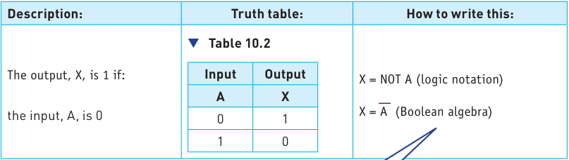

Note the use of Boolean algebra to represent logic gates. This is optional at IGCSE but many students may prefer to use this notation (see NOTE later). 

### 10.2.2 AND gate

|**Description:**|**Truth table:**|**How to write this:**|
|---|---|---|
|The output, X, is 1 if: both inputs, A and B, are 1|▼ **Table 10.3** **Inputs** **Outputs** **A** **B** **X** 0 0 0 0 1 0 1 0 0 1 1 1|X = A AND B (logic notation) X = A**.**B (Boolean algebra)|

### 10.2.3 OR gate

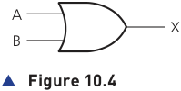

|**Description:**|**Truth table:**|**How to write this:**|
|---|---|---|
|The output, X, is 1 if: either input, A or B, or both, are 1|▼ **Table 10.4** **Inputs** **Output** **A** **B** **X** 0 0 0 0 1 1 1 0 1 1 1 1|X = A OR B (logic notation) X = A + B (Boolean algebra)|

### 10.2.4 NAND gate (NOT AND)

A X B ▲ **Figure 10.5** A X B ▲ **Figure 10.6** 

|**Description:**|**Truth table:**|**How to write this:**|
|---|---|---|
|The output, X, is 1 if: input A AND input B are NOT both 1|▼ **Table 10.5** **Inputs** **Output** **A** **B** **X** 0 0 1 0 1 1 1 0 1 1 1 0|X = A NAND B (logic notation) X = A . B (Boolean algebra)|

### 10.2.5 NOR gate (NOT OR)

|**Description:**|**Truth table:**||**How to write this:**|
|---|---|---|---|
|The output, X, is 1 if: neither input A nor input B is 1|▼ **Table 10.6** **Inputs** **Output** **A** **B** **X** 0 0 1 0 1 0 1 0 0 1 1 0|X = X =|A NOR B (logic notation) A + B (Boolean algebra)|

### 10.2.6 XOR gate

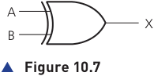

|**Description:**|**Truth table:**|**How to write this:**|
|---|---|---|
|The output, X, is 1 if: (input A is 1 AND input B is 0) **or** (input A is 0 AND input B is 1)|▼ **Table 10.7** **Inputs** **Output** **A** **B** **X** 0 0 0 0 1 1 1 0 1 1 1 0|X = A XOR B (logic notation) X = (A**.**B) + (A**.**B) (Boolean algebra) NOTE: this is sometimes written as: (A + B)**.**(A**.**B)|

## **Activity 10.1** 

Show why X =  (A AND NOT B) OR (NOT A AND B) and Y = (A OR B) AND (NOT (A AND B)) both represent the same logic gate. 

You will notice in the Boolean algebra, three new symbols; these have the following meaning: 

- **» .** represents the AND operation 

- **»** + represents the OR operation 

- **»** a bar (above the letter or letters, e.g. ~~a~~ ) represents the NOT operation. 

## 10.3 Logic circuits, logic expressions, truth tables and problem statements

When logic gates are combined together to carry out a particular function, such as controlling a robot, they form a logic circuit. The following eight examples show how to carry out the following tasks: 

- **»** Create a logic circuit from a: 

   - problem statement (examples 6 and 7) 

   - logic or Boolean expression (examples 3 and 8) 

   - truth table (examples 4 and 5) 

- **»** Complete a truth table from a: 

   - problem statement (examples 6 and 7) 

   - logic or Boolean expression (examples 3 and 8) 

   - logic circuit (example 1) 

- **»** Write a logic or Boolean expression from a: 

   - problem statement (examples 6 and 7) 

   - logic circuit (example 2) 

   - truth table (examples 4 and 5). 

## **Example 1** 

Produce a truth table for the following logic circuit (note the use of black circles at the junctions between wires): 

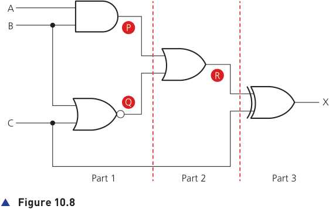

There are three inputs to this logic circuit, therefore, there will be eight possible binary values that can be input. 

To show stepwise how the truth table is produced, the logic circuit has been split up into three parts, as shown by the dotted lines, and intermediate values are shown as P, Q and R. 

## **Part 1** 

This is the first part of the logic circuit; the first task is to find the intermediate values P and Q. 

The value of P is found from the AND gate where the inputs are A and B. The value of Q is found from the NOR gate where the inputs are B and C. An intermediate truth table is produced using the logic function descriptions in Section 10.2. 

## ▼ **Table 10.8** 

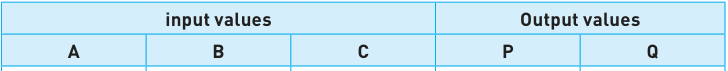

|**input values**|**input values**|**input values**|**Output values**|**Output values**|
|---|---|---|---|---|
|**A**|**B**|**C**|**P**|**Q**|
||||||
|0|0|0|**0**|**1**|
|0|0|1|**0**|**0**|
|0|1|0|**0**|**0**|
|0|1|1|**0**|**0**|
|1|0|0|**0**|**1**|
|1|0|1|**0**|**0**|
|1|1|0|**1**|**0**|
|1|1|1|**1**|**0**|

## **Part 2** 

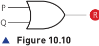

The second part of the logic circuit has P and Q as inputs and the intermediate output, R: 

This produces the following intermediate truth table. (Note: even though there are only two inputs to the logic gate, we have generated eight binary values in part 1 and these must all be used in this second truth table). 

## ▼ **Table 10.9** 

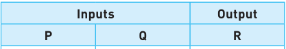

|**Inputs**|**Inputs**|**Output**|
|---|---|---|
|**P**|**Q**|**R**|
||||
|0|1|**1**|
|0|0|**0**|
|0|0|**0**|
|0|0|**0**|
|0|1|**1**|
|0|0|**0**|
|1|0|**1**|
|1|0|**1**|

## **Part 3** 

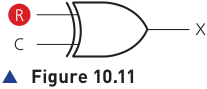

The final part of the logic circuit has R and C as inputs and the final output, X: 

This gives the third intermediate truth table: 

## ▼ **Table 10.10** 

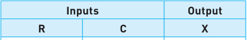

|**Inputs**|**Inputs**|**Output**|
|---|---|---|
|**R**|**C**|**X**|
||||
|1|0|**1**|
|0|1|**1**|
|0|0|**0**|
|0|1|**1**|
|1|0|**1**|
|0|1|**1**|
|1|0|**1**|
|1|1|**0**|

Putting all three intermediate truth tables together produces the final truth table, which represents the original logic circuit: 

## ▼ **Table 10.11** 

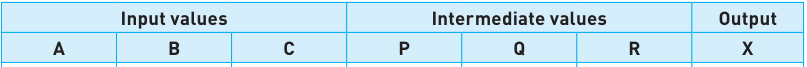

|**Input values**|**Input values**|**Input values**|**Intermediate values**|**Intermediate values**|**Intermediate values**|**Output**|
|---|---|---|---|---|---|---|
|**A**|**B**|**C**|**P**|**Q**|**R**|**X**|
||||||||
|0|0|0|_0_|_1_|_1_|1|
|0|0|1|_0_|_0_|_0_|1|
|0|1|0|_0_|_0_|_0_|0|
|0|1|1|_0_|_0_|_0_|1|
|1|0|0|_0_|_1_|_1_|1|
|1|0|1|_0_|_0_|_0_|1|
|1|1|0|_1_|_0_|_1_|1|
|1|1|1|_1_|_0_|_1_|0|

The intermediate values can be left out of the final truth table, but it is good practice to leave them in until you become confident about producing the truth tables. The final truth table would then look like this: 

## ▼ **Table 10.12** 

|**Input values**|**Input values**|**Input values**|**Output**|
|---|---|---|---|
|**A**|**B**|**C**|**X**|
|0|0|0|1|
|0|0|1|1|
|0|1|0|0|
|0|1|1|1|
|1|0|0|1|
|1|0|1|1|
|1|1|0|1|
|1|1|1|0|

## **Example 2** 

Write logic expressions from the following logic circuits: 

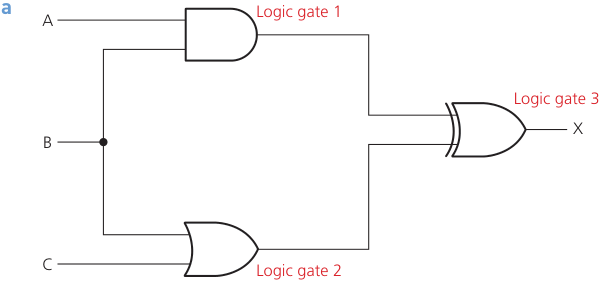

- **Figure 10.12** 

The first action is to look at the gates connected to the inputs A, B and C: 

logic gate 1: (A AND B) logic gate 2: (B OR C) 

We then join these together using logic gate 3: 

[(A AND B)] XOR [(B OR C)]  which gives us the required logic expression. 

(Note: the square brackets “[ ]” in the expression are not necessary and are used here just for clarity.) 

This would be written as: (A AND B) XOR (B OR C) 

**b** 

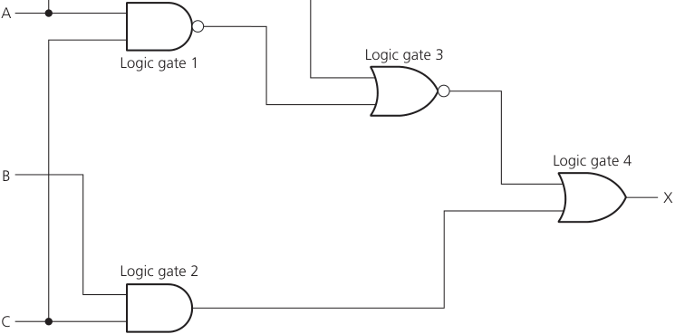

- **Figure 10.13** 

Again, we will do this in the order of logic gates 1 and 2 first (connected to the three inputs): 

logic gate 1: (A NAND C) logic gate 2: (B AND C) 

However, logic gate 3 is also connected to one of the inputs so that should be done next: logic gate 3: (logic gate 1) NOR A 

If we replace (logic gate 1) by the logic expression above, we get: 

((A NAND C) NOR A) 

Finally, we can join all these together using: 

logic gate 4: ((A NAND C) NOR A) OR (B AND C) 

## **Activity 10.2** 

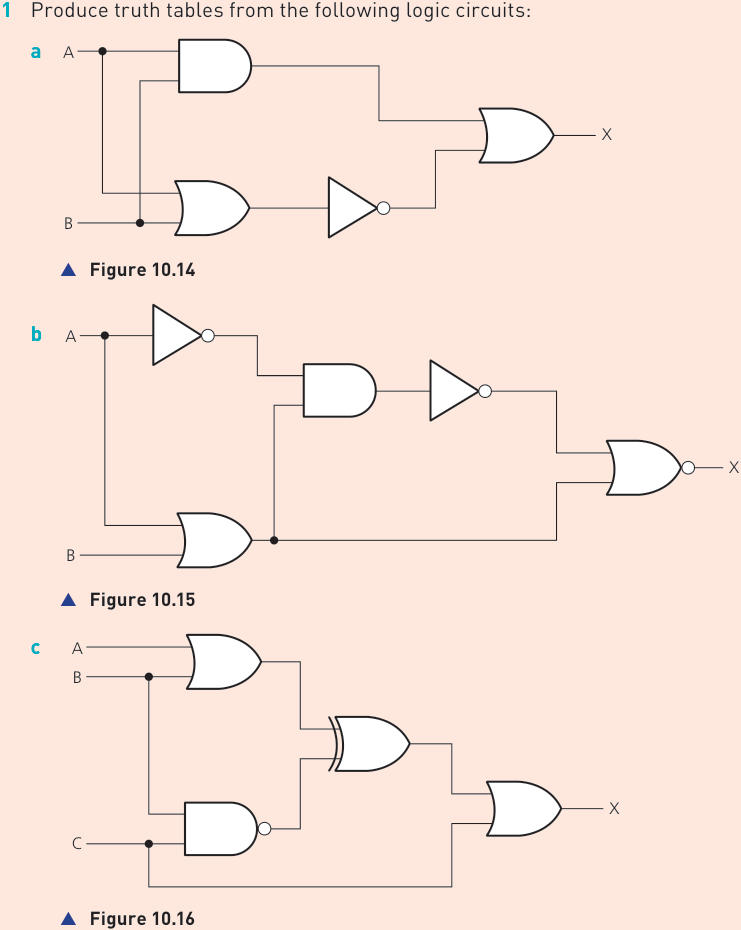

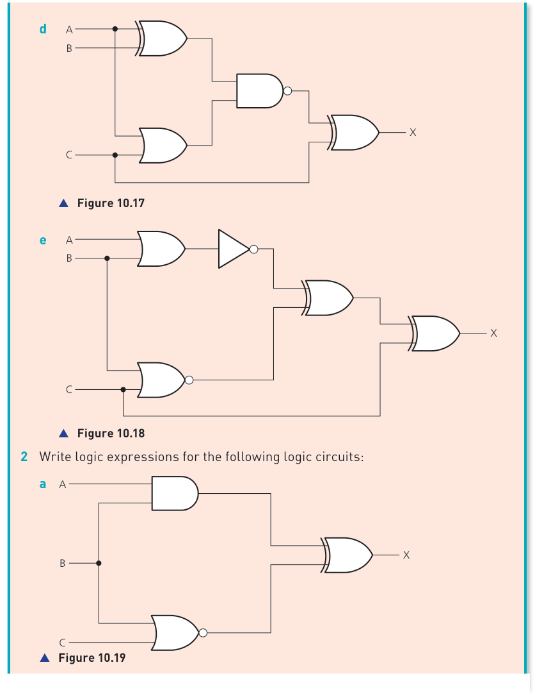

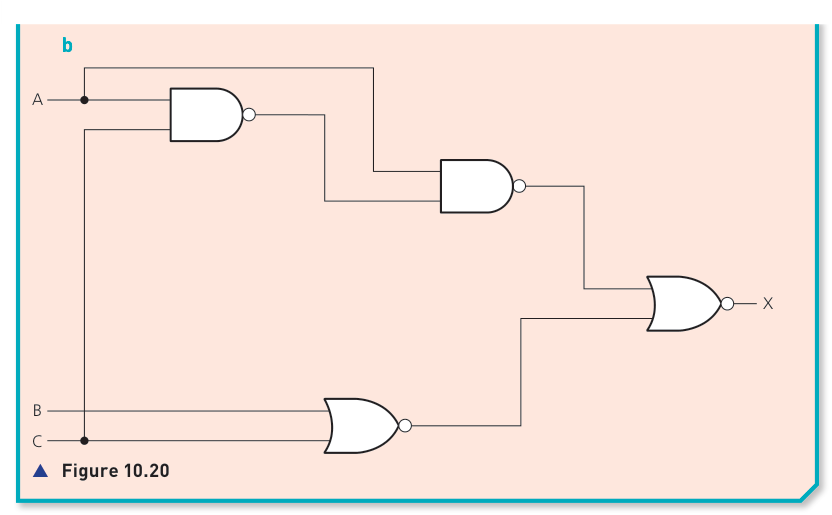

## **Example 3** 

A logic circuit can be represented by the following logic expression: (A XOR C) OR (NOT C NAND B) 

Produce a logic circuit and a truth table from the above statement. 

In this example we have a connecting logic gate which is OR. 

So, if we produce one half of the circuit from (A XOR C) we get: 

## ▲ **Figure 10.21** 

The other half of the circuit is found from (NOT C NAND B): 

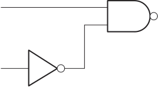

If we now combine these together to form the final logic circuit: 

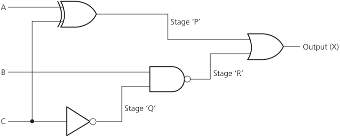

## ▲ **Figure 10.23** 

The truth table is shown: 

## ▼ **Table 10.13** 

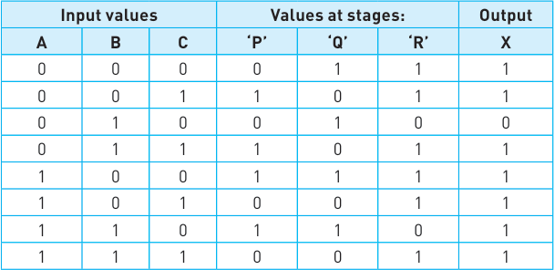

## **Example 4** 

Look at the two truth tables below; in each case produce a logic expression and the corresponding logic circuit: 

**a** 

## ▼ **Table 10.14** 

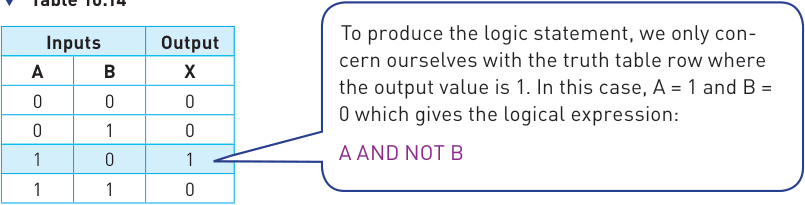

So we have the logic expression: A AND NOT B (Note that this could be written as A **.** B— in Boolean.) It is now possible to draw the corresponding logic circuit: 

A 

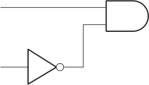

▲ **Figure 10.24** 

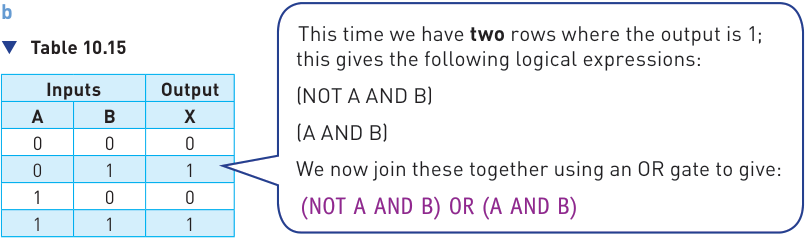

So we have the logic expression: (NOT A AND B) OR (A AND B) — (This could be written as:  A **.** B + A **.** B) 

It is now possible to draw the corresponding logic circuit: 

- B ▲ **Figure 10.25** 

## **Example 5** 

**a** Which Boolean expression is represented by the following truth table? 

## ▼ **Table 10.16** 

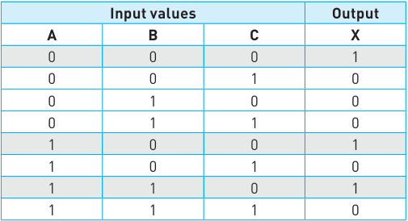

We only need to consider those rows where the output is a 1. This gives us the following three logic expressions: 

(NOT A AND NOT B AND NOT C) (A AND NOT B AND NOT C) (A AND B AND NOT C) 

If we now join the three expressions with an OR gate, we end up with the final logic expression: 

(NOT A AND NOT B AND NOT C) OR (A AND NOT B AND NOT C) OR (A AND B AND NOT C) 

- **b i** Which logic expression is represented by the following truth table? **ii** Show that your logic expression in part **i** is the same as: (B AND C) OR (A AND C) OR (A AND B) 

## ▼ **Table 10.17** 

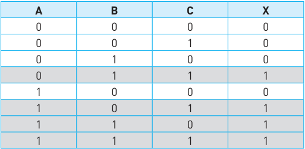

- **i** We only need to consider those rows where the output is a 1. This gives us the following four Boolean expressions: 

(NOT A AND B AND C) (A AND NOT B AND C) (A AND B AND NOT C) (A AND B AND C) 

If we now join the four expressions with an OR gate we end up with the following logic expression: 

(NOT A AND B AND C) OR (A AND NOT B AND C) OR (A AND B AND NOT C) OR (A AND B AND C) 

- **ii** To show that **(B AND C) OR (A AND C) OR (A AND B)** produces the same output as that shown in part **i** we need to produce a new truth table and show that the output is the same as the one in the given truth table: 

## ▼ **Table 10.18** 

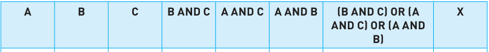

|**A**|**B**|**C**|**B AND C**|**A AND C**|**A AND B**|**(B AND C) OR (A** **AND C) OR (A AND** **B)**|**X**|
|---|---|---|---|---|---|---|---|
|||||||||
|0|0|0|0|0|0|0|0|
|0|0|1|0|0|0|0|0|
|0|1|0|0|0|0|0|0|
|0|1|1|1|0|0|1|1|
|1|0|0|0|0|0|0|0|
|1|0|1|0|1|0|1|1|
|1|1|0|0|0|1|1|1|
|1|1|1|1|1|1|1|1|

As the second truth table shows, the outputs from logic expressions are both the same; thus the logic expression **(B AND C) OR (A AND C) OR (A AND B)** gives the same output as the logic expression in part **i** . 

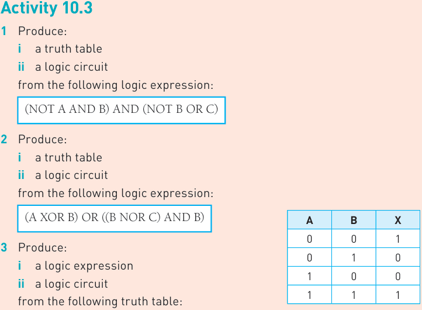

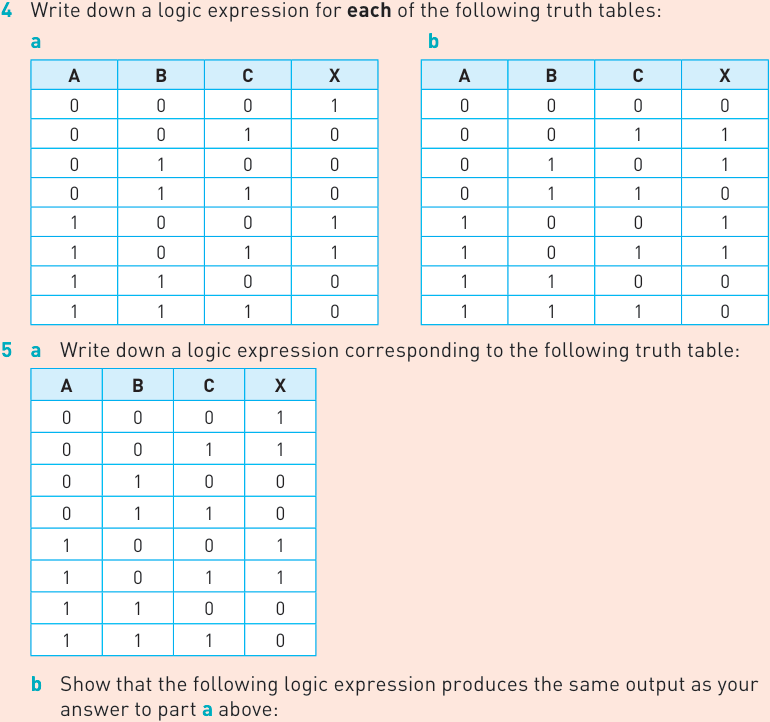

(NOT A AND NOT B) OR (A AND NOT B) 

## **Example 6** 

A safety system uses three inputs to a logic circuit. An alarm, X, sounds if input A represents ON and input B represents OFF; or if input B represents ON and input C represents OFF. 

Produce a logic circuit and truth table to show the conditions that cause the output X to be 1. 

The first thing to do is to write down the logic statement representing the scenario in this example. To do this, it is necessary to recall that ON = 1 and OFF = 0 and also that 0 is usually considered to be NOT 1. 

So we get the following logic expression: 

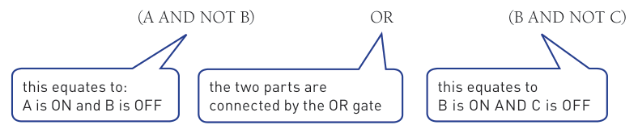

Note: this expression can also be written as follows (Boolean expression): 

(A **.** —B ) + (B **.** C —) 

The logic circuit is made up of two parts as shown in the logic expression. We will produce the logic gate for the first second part. Then join both parts together with the OR gate. 

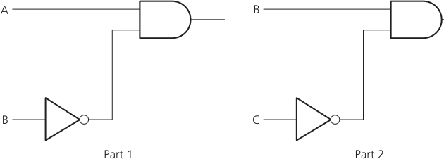

- **Figure 10.26** 

Now combining both parts with the OR gate gives us: 

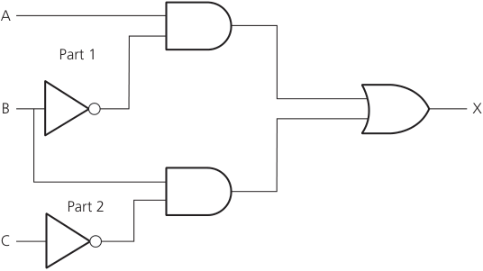

## ▲ **Figure 10.27** 

In order to produce the truth table, there are two ways to do this: 

- **»** trace through the logic circuit using the method described in example 1 (Section 10.3) 

- **»** produce the truth table using the original logic expression; this second method has the advantage that it allows you to check that your logic circuit is correct. 

We will use the second method in this example: 

## ▼ **Table 10.19** 

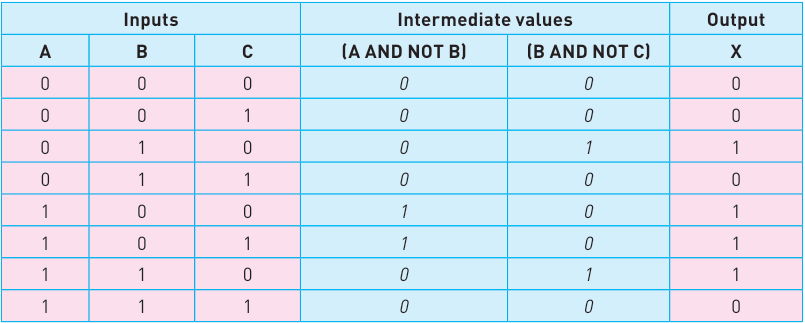

(Note: it is optional whether to leave in the intermediate values or simply remove them giving a 4-column truth table with headings: A, B, C, X) 

## **Example 7** 

A wind turbine has a safety system which uses three inputs to a logic circuit. A certain combination of conditions results in an output, X, from the logic circuit being equal to 1. When the value of X = 1 then the wind turbine is shut down. 

The following table shows which parameters are being monitored and form the three inputs to the logic circuit. 

## ▼ **Table 10.20** 

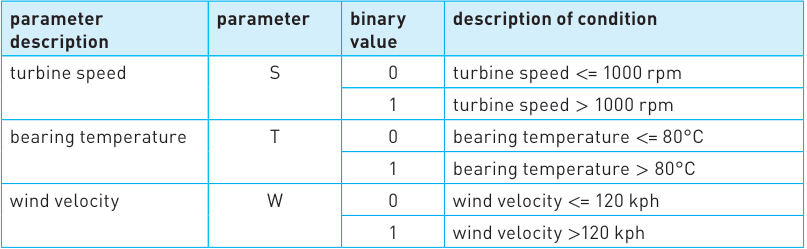

The output, X, will have a value of 1 if any of the following combination of conditions occur: 

**Either** turbine speed <= 1000 rpm and bearing temperature > 80°C **Or** turbine speed > 1000 rpm and wind velocity > 120 kph **Or** bearing temperature <= 80°C and wind velocity > 120 kph 

Design the logic circuit and complete the truth table to produce a value of X = 1 when either of the three conditions above occur. 

In this example, a real situation is given and it is necessary to convert the information into a logic expression and then produce the logic circuit and truth table. It is advisable in problems as complex as this to produce the logic circuit and truth table separately (based on the conditions given) and then check them against each other to see if there are any errors. 

## **Stage 1** 

The first thing to do is to convert each of the three statements into logic expressions. Use the information given in the table and the three condition statements to find how the three parameters S, T and W are linked. We usually look for the key words AND, OR and NOT when converting actual statements into logic. 

We end up with the following three logic expressions: 

- **i** turbine speed <= 1000 rpm and bearing temperature > 80°C logic expression: (NOT S AND T) 

- **ii** turbine speed > 1000 rpm and wind velocity > 120 kph logic expression: (S AND W) 

- **iii** bearing temperature <= 80°C and wind velocity > 120 kph 

   - logic expression: (NOT T AND W) 

## **Stage 2** 

This now produces three intermediate logic circuits: 

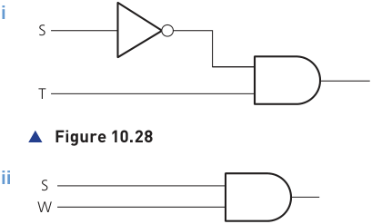

- **Figure 10.29** 

- **Figure 10.30** 

Each of the three original statements were joined together by the word ‘OR’. Thus, we need to join all of the three intermediate logic circuits by two OR gates to get the final logic circuit. 

We will start by joining **i** and **ii** together using an OR gate: 

- **Figure 10.31** 

Finally, we connect the logic circuit in Figure 10.31 to Figure 10.30 to obtain the answer: 

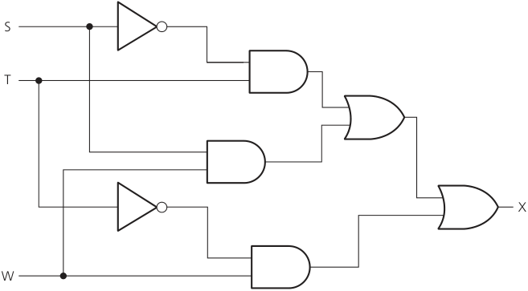

- **Figure 10.32** 

The final part is to produce the truth table. We will do this using the original logic statement. This method has the bonus of allowing an extra check to be made on the logic circuit in Figure 10.32 to see whether or not it is correct. It is possible, however, to produce the truth table straight from the logic circuit in Figure 10.32. 

There were three parts to the problem, so the truth table will first evaluate each part. Then, by applying OR gates, as shown below, the final value, X, is obtained: 

**i** (NOT S AND T) **ii** (S AND W) **iii** (NOT T AND W) 

We find the outputs from parts (i) and (ii) and then OR these two outputs together to obtain a new intermediate, which we will now label part (iv). 

We then OR parts (iii) and (iv) together to get the value of X. 

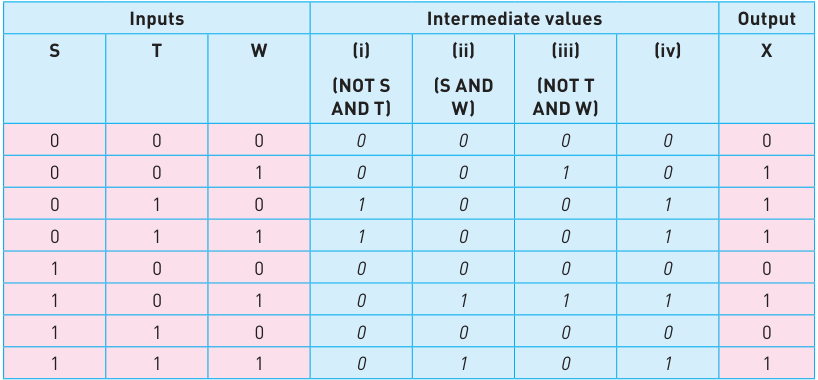

## **Example 8** 

Consider the logic statement: 

((A NOR B) AND C) NAND (A OR NOT B) 

**a** Draw a logic circuit to represent the given logic statement. 

**b** Complete the truth table for the given logic statement. 

## ▼ **Table 10.21** 

|**Input values**|**Input values**|**Input values**|**Working space**|**Output** **X**|
|---|---|---|---|---|
|**A**|**B**|**C**|||
||||||
|0|0|0|||
|0|0|1|||
|0|1|0|||
|0|1|1|||
|1|0|0|||
|1|0|1|||
|1|1|0|||
|1|1|1|||

First, we need to break down the logic statement. Assign: 

**i** P = (A NOR B) 

**ii** Q = (A OR NOT B) 

**iii** R = (P AND C) 

And then note that X = R NAND Q 

Now draw the logic gates for statements **i** to **iii** and connect them together. 

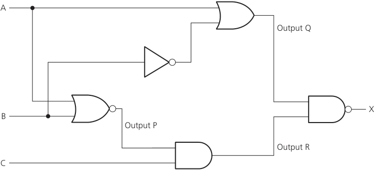

- **Figure 10.33** 

We can then fill out the truth table in stages, starting with P, Q and then R, followed finally by X: 

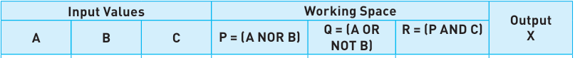

|**Input Values**|**Input Values**|**Input Values**|**Working Space**|**Working Space**|**Working Space**|**Output** **X**|
|---|---|---|---|---|---|---|
|**A**|**B**|**C**|**P = (A NOR B)**|**Q = (A OR** **NOT B)**|**R = (P AND C)**||
||||||||
|0|0|0|1|1|0|1|
|0|0|1|1|1|1|0|
|0|1|0|0|0|0|1|
|0|1|1|0|0|0|1|
|1|0|0|0|1|0|1|
|1|0|1|0|1|0|1|
|1|1|0|0|1|0|1|
|1|1|1|0|1|0|1|

> **Find out more:** Boolean algebra appears throughout this chapter and is the official method for depicting logic statements. Try using truth tables to prove the following pairs of Boolean (logic) statements are the same: **iii** A + A A + (A − **.** B = A + B **.** B) = A **iii** (A + B) **.** (A + C) = A + B **.** C **iv** (A **.** B) = A −−+ B −− **v** A + B = A + B

## **Activity 10.4** 

- **1** Draw the logic circuits and complete the truth tables for the following logic or Boolean expressions: 

   - **a** X = (A OR B)  OR  (NOT A AND B) 

   - **b** Y = (NOT A AND NOT B)  AND  (NOT B OR C) 

   - **c** T = 1 if  (switch K is ON or switch L is ON)  OR  (switch K is ON and switch M is OFF)  OR  (switch M is ON) 

   - **d** X = (A AND NOT B) OR (NOT B AND C) 

   - **e** R = 1 if (switch A is ON and switch B is ON) AND (switch B is ON or switch C is OFF) 

- **2** Produce the logic circuit and complete a truth table to represent the following scenario. A chemical process is protected by a logic circuit. There are three inputs to the logic circuit representing key parameters in the chemical process. An alarm, X, will give an output value of 1 depending on certain conditions in the chemical process. The following table describes the process conditions being monitored: 

|**Parameter description**|**Parameter**|**Binary value**|**Description of condition**|
|---|---|---|---|
|chemical reaction rate|R|0|reaction rate<40 mol/l/sec|
|||1|reaction rate>= 40 mol/l/sec|
|process temperature|T|0|temperature>115°C|
|||1|temperature<= 115°C|
|concentration of chemicals|C|0|concentration<= 4 mol|
|||1|concentration>4 mol|
|An alarm, X, will generate the value 1 if: either reaction rate<40 mol/l/sec or concentration>4 mol AND temperature>115°C or reaction rate>= 40 mol/l/sec AND temperature>115°C||||

- **3** Produce the logic circuit and complete a truth table to represent the following scenario. 

A power station has a safety system controlled by a logic circuit. Three inputs to the logic circuit determine whether the output, S, is 1. When S = 1 the power station shuts down. 

The following table describes the conditions being monitored. 

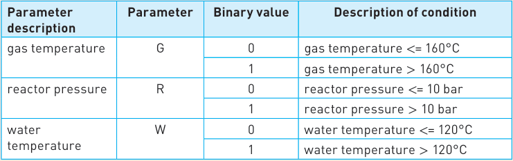

Output, S, will generate a value of 1, if: 

either gas temperature > 160°C AND water temperature <= 120°C or gas temperature <= 160°C AND reactor pressure > 10 bar or water temperature > 120°C AND reactor pressure > 10 bar 

- **4** A car’s engine management system uses three sensors A, B and C. The data from these sensors forms the input to a logic circuit. When the output (X) from the logic circuit is 1 a signal is sent to a warning light on the dash board of the car. 

The following table describes the conditions being monitored. 

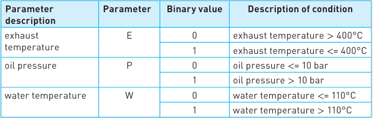

Output, X, will generate a value of 1, if: 

either exhaust temperature > 400°C AND oil pressure > 10 bar 

or oil pressure <= 10 bar AND water temperature > 110 °C or oil pressure > 10 bar AND water temperature > 110 °C Produce: 

**i** a truth table, 

**ii** a logic expression and **iii** a logic circuit 

to represent the above scenario. 

Also confirm that the output from your logic circuit matches the output from your truth table in part **i** . 

|**Advice** Regarding  question 5, XNOR gates are not on the syllabus||**5**The following truth table is for a logic gate called the_XNOR_gate. By completing the truth table below, show that the XNOR gate can be represented by the following logic expression: (A AND B) OR (NOT A AND NOT B)|**5**The following truth table is for a logic gate called the_XNOR_gate. By completing the truth table below, show that the XNOR gate can be represented by the following logic expression: (A AND B) OR (NOT A AND NOT B)|**5**The following truth table is for a logic gate called the_XNOR_gate. By completing the truth table below, show that the XNOR gate can be represented by the following logic expression: (A AND B) OR (NOT A AND NOT B)|**5**The following truth table is for a logic gate called the_XNOR_gate. By completing the truth table below, show that the XNOR gate can be represented by the following logic expression: (A AND B) OR (NOT A AND NOT B)|**5**The following truth table is for a logic gate called the_XNOR_gate. By completing the truth table below, show that the XNOR gate can be represented by the following logic expression: (A AND B) OR (NOT A AND NOT B)|
|---|---|---|---|---|---|---|
|||**A**|**B**|**(A AND B)**|**(NOT A AND** **NOT B)**|**(A AND B) OR** **(NOT A AND NOT B)**|
|||0|0||||
|||0|1||||
|||1|0||||
|||1|1||||

## **Extension** 

The following two exercises are designed to help students thinking of furthering their study in Computer Science at A Level standard. The two topics here are not on the syllabus and merely show how some of the topics in this chapter can be extended to this next level. The two topics extend uses of logic circuits in the real world and the use of full adders and half adders. 

## Topic 1: Logic circuits in the real world 

Anybody reading this chapter with an electronics background will be aware that the design of logic circuits is considerably more complex than has been described. 

This chapter has described in detail some of the fundamental theories used in logic circuit design. This will give the reader sufficient grounding to cover all existing IGCSE and O Level syllabuses. However, it is worth finally discussing some of the other aspects of logic circuit design that will interest any student considering the A Level course. 

Electronics companies need to consider the cost of components, ease of fabrication and time constraints when designing and building logic circuits. We will outline two possible ways electronics companies can standardise logic circuit design: 

- **»** One method is to use ‘off-the-shelf’ logic units and build up the logic circuit as a number of ‘building blocks’ 

- **»** Another method involves simplifying the logic circuit as far as possible; this may be necessary where room is at a premium (for example, in building circuit boards for use in satellites to allow space exploration). 

## Using logic ‘building blocks’ 

One very common ‘building block’ is the NAND gate. It is possible to build up any logic gate, and therefore any logic circuit, by simply linking together a number of NAND gates. For example, the AND, OR and NOT gates can be built from NAND gates as shown here in Figure 10.34: 

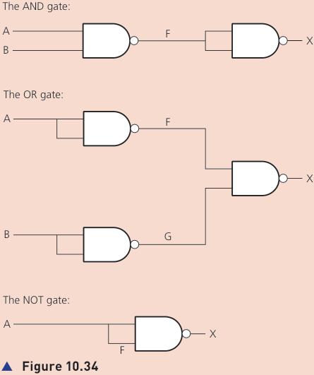

## **Task 1** 

By drawing the truth tables, show that the three circuits in Figure 10.34 can be used to represent AND, OR and NOT gates. 

## **Task 2** 

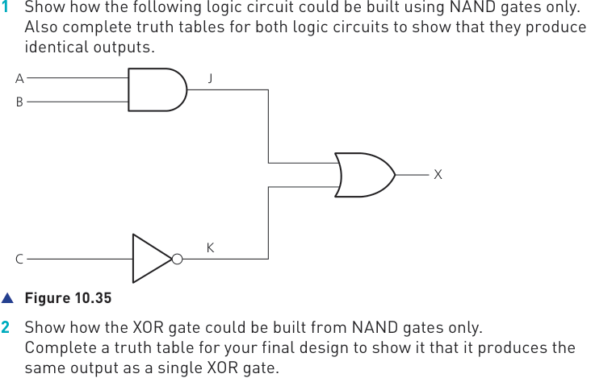

## **Task 3** 

By drawing a truth table, which single logic gate has the same function as the following logic circuit made up of NAND gates only? 

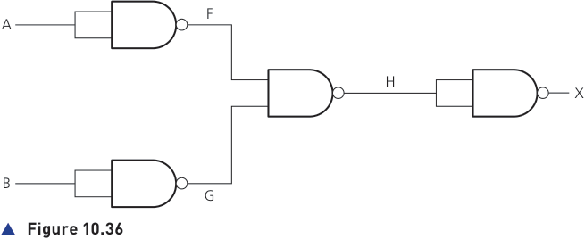

## Topic 2: Half adder and full adder circuits 

In Chapter 10, the use of logic gates to create logic circuits to carry out specific tasks was discussed in much detail. Two important logic circuits used in computers are: 

- **»** the **half adder circuit** 

- **»** the **full adder circuit** . 

## Half adder 

One of the basic operations in any computer is binary addition. The half adder circuit is the simplest circuit; this carries binary addition on 2 bits generating two outputs: 

- **»** the sum bit (S) 

- **»** the carry bit (C). 

If you consider 1 + 1 this will give the result 1 0 (denary value 2). The ‘1’ is the carry and ‘0’ the sum. As a truth table this is: 

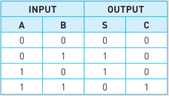

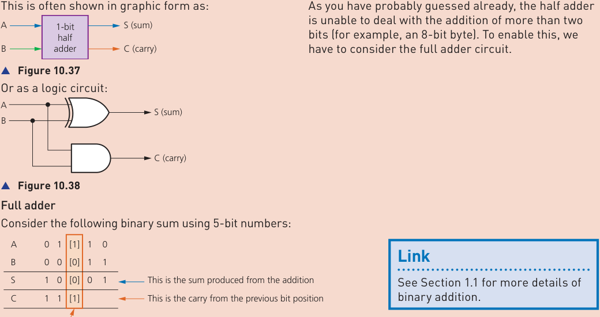

The sum shows how we have to deal with CARRY from the previous column. There are three inputs to consider in this third column, for example, A = 1, B = 0 and C = 1 (S = 0). This is why we need to join two half adders together to form a full adder, as shown in Figure 10.40 

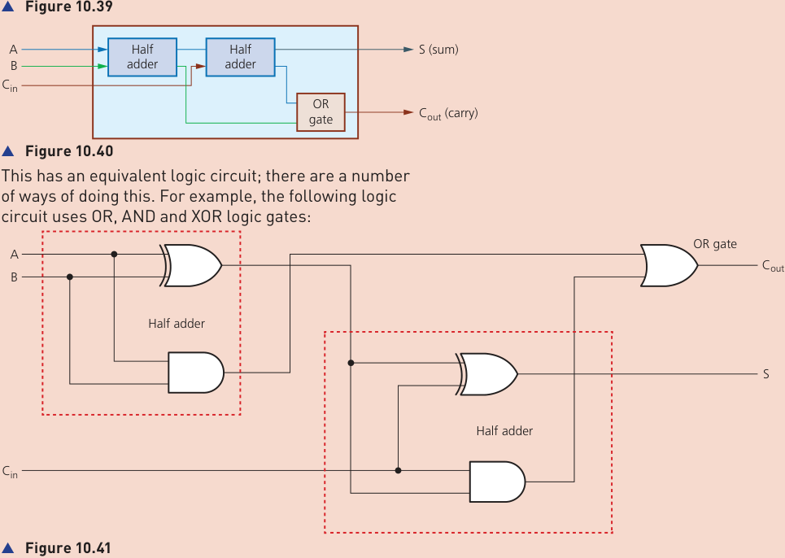

|Truth table for|Truth table for|Truth table for|Truth table for|Truth table for|Truth table for|Truth table for|Truth table for|Truth table for||the full adder circuit:|the full adder circuit:|the full adder circuit:|the full adder circuit:|the full adder circuit:|the full adder circuit:|the full adder circuit:|the full adder circuit:|the full adder circuit:|the full adder circuit:||||||||||||||As|As|with the half adder circuits, different logic gates|
|---|---|---|---|---|---|---|---|---|---|---|---|---|---|---|---|---|---|---|---|---|---|---|---|---|---|---|---|---|---|---|---|---|---|---|---|
||||||||||||||||||||||||||||||||||can be used to produce the full adder circuit.|||
|||||||||**INPUT**|||||||||||||**OUTPUT**|||||||||||||||
|||**A**||||||||**B**|||||**Cin**|||||**S**|||||**Cout**||||||||The full adder is the basic building block for multiple|||
|||0||||||||0|||||0|||||0||||||0|||||||binary additions. For example, the following diagram|||
|||0||||||||0|||||1|||||1||||||0|||||||shows how two 4-bit numbers can be summed using four full adder circuits:|||
|||0||||||||1|||||0|||||1||||||0||||||||||
|||0||||||||1|||||1|||||0||||||1||||||||||
|||1||||||||0|||||0|||||1||||||0||||||||||
|||1||||||||0|||||1|||||0||||||1||||||||||
|||1||||||||1|||||0|||||0||||||1||||||||||
|||1||||||||1|||||1|||||1||||||1||||||||||
|||||A3|||B3||||||A2||B2|||||A1||B1||||||A0||||B0||||
|||||Full adder||||||||Full adder|||||||Full adder|||||||||Full||adder||||||
||C4||||||||||C3||||||C2||||||||C1||||||||||C0|
|||||||S3|||||||||S2|||||||S1||||||||||S0||||
|▲ **Figure 10.42**||||||||||||||||||||||||||||||||||||

In this chapter, you have learnt about: 

- ✔ recognise the functions, symbols and truth tables for the logic gates: NOT, AND, OR, NAND, NOR and XOR 

- ✔ create logic circuits from a given problem, logic expression or truth table 

- ✔ complete a truth table from a given problem, logic (or Boolean) expression or logic circuit 

- ✔ write a logic (or Boolean) expression from a given problem, logic circuit or truth table 

## **Key terms used throughout this chapter** 

**logic gate** – an electronic circuit that relies on ‘on/off’ logic; the most common gates are NOT, AND, OR, NAND, NOR and XOR 

**logic circuit** – these are formed from a combination of logic gates and designed to carry out a particular task; the output from a logic circuit will be 0 or 1 

**truth table** – a method of checking the output from a logic circuit; a truth table lists all the possible binary input combinations and their associated outputs; the number of outputs will depend on the number of inputs; for example, two inputs have 2[2] (4) possible binary combinations, three inputs have 2[3] (8) possible binary combinations, and so on 

**Boolean algebra** – a form of algebra linked to logic circuits and based on TRUE or FALSE 

[4] 

## Exam-style questions 

- **1 a** Produce: **i** a Boolean or logic expression **ii** a logic circuit for the truth table shown: 

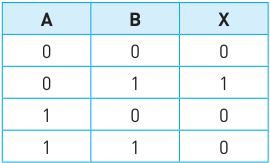

- **b** Produce: 

   - **i** a logic expression **ii** a truth table 

   - for the logic circuit shown below: 

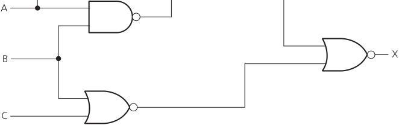

[6] 

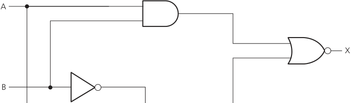

[3] 

- **b** Draw a logic circuit which represents the following Boolean expression: 

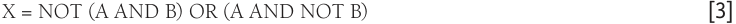

- **c** Complete the truth table for the following logic circuit: 

[4] 

- **3** A motor driving a water pump has a safety system which uses three inputs to a logic circuit. A certain combination of conditions results in an output, X, from the logic circuit being equal to 1. When the value of X = 1 then the motor and pump are shut down. 

   - The following table shows which parameters are being monitored and form the three inputs to the logic circuit. 

The output, X, will have a value of 1 if any of the following combination of conditions occur: 

- **» either** motor speed > 2000 rpm and bearing temperature > 90°C 

- **» or** motor speed <= 2000 rpm and water velocity <= 5 m/s 

- **» or** bearing temperature > 90°C and water velocity <= 5 m/s 

- **a** Design a logic circuit for the above scenario. 

- **b** Complete a truth table for the above scenario. 

[7] [4] 

[1] 

- **4 a** Write a logic expression for the truth table below. 

**b** Draw a logic circuit from the above truth table. [4] 

- **5** A factory manufactures plastic pipes. It uses logic circuits to control the manufacturing process. 

   - **a** Consider the logic gate: 

**Input A Output Input B** 

Complete the truth table for this logic gate. 

|**Input** **A**|**Input** **B**|**Output**|
|---|---|---|
|0|0||
|0|1||
|1|0||
|1|1||

- **b** Consider the truth table: 

|**Input** **A**|**Input** **B**|**Output**|
|---|---|---|
|0|0|0|
|0|1|1|
|1|0|1|
|1|1|0|

State the **single** logic gate that produces the given output. 

- **c** Plastic pipes of various sizes are manufactured by heating the plastic and using pressure. The manufacturing system uses sensors to measure the pressure (P), temperature (T) and speed (S) of production. 

The inputs to the manufacturing system are: 

The system will sound an alarm ( **X** ) when certain conditions are detected. The alarm will sound when: 

temperature is > 200 degrees Celsius and the pressure is <= 5 bar 

## **or** 

speed is > 1 metre per second and the temperature <= 200 degrees Celsius 

- Draw a logic circuit to represent the above alarm system. Logic gates used must have a maximum of **two** inputs. [5] 

- **d** Give **two** benefits of using sensors to monitor the manufacture of the plastic pipes. 

[2] 

- **6** A DVD recorder is protected by three sensors (S, T and P). The output from these sensors forms the inputs to a logic circuit. A certain combination of input values produces an output of 1 from the logic circuit. When this occurs a warning message is shown on the DVD display. The following table shows which parameters are being monitored and form the three inputs to the logic circuit: 

The output X will have a value of 1 if any of the following combination of conditions occurs: 

- **»** either rotation speed >= 1000 rpm and tilt angle < 30° **»** or rotation speed < 1000 rpm and laser power >= 150 mW **»** or tilt angle >= 30° and laser power < 150 mW **a** Write down a logic or Boolean expression for the above system. 

- **b** Draw a logic circuit to monitor the above system. 

- [2] [6] 

## **c** Complete the truth table for the above system: 

[4] 

## Index 

2D scanners   96–7 3D printers   106–7 3D scanners   97, 98 

## **A** 

abnormal data   281 Abstract Data Types (ADTs)   292 accelerometers   112 access levels   198–9 Access Point Mapping   190 accumulator (ACC)   77 acoustic sensors   112, 114 actuators   101, 217 adaptive cruise control   223 address bus   79 administrators   160 adware   193 airplanes, autonomous   235–6 algorithms   264 bubble sort   275–6 counting   272 error identification   285–7 flowcharts   262–4 linear search   274–5 maximum, minimum and averages 273–4 purpose of   271 sequence   307–9 totalling   272 writing and amending   288–91 analogue to digital converters (ADCs) 92, 95, 111 analysis   258–9 AND operator   318, 359 AND gate   358 anti-lock braking systems (ABS)   115 anti-malware   199 anti-virus software   151 application software   148–9 Arithmetic & Logic Unit (ALU)   76 arithmetic operators   317 arrays   329 one-dimensional (lists)   329–31 two-dimensional (tables)   331–2 artificial intelligence (AI)   241–2 deep learning   250–1 expert systems   243–6 machine learning   247–8 ASCII code   25–7 disadvantages   28 extended   27 assemblers   169 assembly language   166, 167–8 assignment statements   265 asymmetric encryption   64–5 authentication   199 biometrics   201–3 

passwords and user names   200 two-step verification   204 auto-completion   173 auto-documenters   173 automated systems   217 agricultural applications   224–5 gaming devices   226 industrial applications   218–20 lighting applications   227–8 in scientific research   228–9 transport applications   221–3 weather stations   225 automatic repeat requests (ARQs)   62 autonomous vehicles   233–6 averages (mean)   274 

## **B** 

backing store   77 back-up software   153–4 bandwidth   34 barcodes   88–90 Binary Coded Decimal (BCD) system 38 binary system   2–3 addition   15–17 conversion from denary   4–6 conversion to denary   3–4, 22–5 conversion to/from hexadecimal 8–9 logical shifts   17–20 negative numbers   20–5 subtraction   38–9 two’s complement   20–5 binder 3D printing   106 biometrics   97, 201 BIOS (Basic Input/Output System)   81, 122, 160–1 bit depth (sampling resolution)   30 bitmap images   30–1 bits   32 blockchains   187–8 Bluetooth   139 Blu-ray discs   127–8 Boolean data type   304, 343 Boolean operators   318 booting up   160 boundary data   282 browsers (web browsers)   181, 182 brute force attacks   189 bubble sort   275–6 buffers   161–3 buses   77, 79 bytes   32 

## **C** 

cables   139 cache memory   81 

capacitive touch screens   98–9 cars adaptive cruise control   223 anti-lock braking systems   115 autonomous   233 embedded systems   84–5 self-parking   221–2 CASE statements programming languages   311–12 pseudocode   266, 268 CDs   126, 128 central heating systems   116 central processing unit (CPU)   75 components of   76–9 Fetch–Decode–Execute cycle 79–80 char data type   304 character sets ASCII code   25–8 Unicode   28 charge couple devices (CCDs)   92 chatbots   242 check digits   59–62, 279 checkouts   89 checksum   59 chemical process control   116, 228–9 ciphertext   63 clock cycle   80 clock speed   80–1 cloud storage   130–1 code editors   171 colour codes, HTML   13–14 colour depth   31 Command Line Interfaces (CLIs)   156, 157 comments   329 comparison operators   267 compilers   150, 168–9, 170 Complementary Metal Oxide Semiconductors (CMOS)   95, 161 computed tomographic (CT) scanners 98 computer architecture   75–80 computer systems   260 conditional statements   266 condition-controlled loops   313–14 constants   302–3 control bus   79 control gate transistors   124, 125 control systems   113–14, 115–17 control unit (CU)   76 controllers   224, 231 cookies   184–6 cores   81 count-controlled loops   313 counting   272, 314 cryptocurrency   187 

**INDEX** 

current instruction register (CIR)   77 cyber security _see_ security cyclic redundancy checks (CRCs)   46 

## **D** 

data bus   79 data compression   34 lossless   35–7 lossy   34–5 data corruption   54 data interception   190 data packets   45–8 data redundancy   130 data storage file size calculations   33 memory size systems   32 data transmission   49 encryption   63–8 error detection   54–62 parallel   51, 52 serial   50, 52 simplex, half-duplex and full-duplex 50 USB   52–3 data types   304, 342–3 Database Management Systems (DBMs)   352 databases   339 fields and records   340–1 practical use   348–50 primary keys   343–4 SQL   344–7 validation   341–2 debuggers   172 declaration statements   302–3 decomposition   258–9, 260–1 deep learning   250–1 defragmentation   151–3 denary system   3 conversion from binary   3–4 conversion to binary   4–6, 22–5 conversion to/from hexadecimal 10–11 

two’s complement format   22 denial of service (DoS) attacks   190–1 device drivers   150, 154–5 digital cameras   92–3 digital currency   186–7 digital light projectors   102, 103 digital to analogue converters (DACs) 109 direct 3D printing   106 disk thrashing   130 distributed control systems (DCS)   219 distributed denial of service (DDoS) attacks   190–1 DIV   317, 327–8 DNS cache poisoning   195 Domain Name Server (DNS)   183 dongles   126 dual core systems   81 DVDs   126, 127, 128 

dynamic IP addressing   135–6 dynamic RAM (DRAM)   121, 122 

## **E** 

echo check   59 EEPROM   161 emails cyber security   205–7 spam filtering   247 embedded systems   83–4 digital cameras   92 examples   84–7 encryption   63 asymmetric   64–5 quantum cryptography   67–8 symmetric   63–4 end-effectors   232 error checking   172 error codes   12 error detection   54 in algorithms   285–7 automatic repeat requests   62 check digits   59–62 checksum   59 echo check   59 parity checking   55–8 ethical hacking   191 expert systems   243–6 extreme data   282 

## **F** 

face recognition   97, 202 Fetch–Decode–Execute cycle   79–80, 174 file handling   333–5 File History utility   153 file management   159 file size calculations   33 fingerprint scans   201–2 firewalls   137, 207–8 firmware   160, 161 flash memory   124–6 flip flops   121 floating gate transistors   124, 125 flow rate sensors   112 flowcharts   262 flow lines   264 symbols   263 FOR loops programming languages   313 pseudocode   269 format checks   279 fragmentation   124 frame QR codes   91 full-duplex data transmission   50 functions   321, 324–5 

## **G** 

gaming devices   226 gas sensors   112 global variables   325–6 

Graphical User Interfaces (GUIs) 156–7 greenhouse environment control   117 

## **H** 

hacking   191 half-duplex data transmission   50 hard disk drives (HDD)   123–4 defragmentation   151–3 hardware management   158 hertz (Hz)   30 heuristic checking   151 hexadecimal system (hex)   7 conversion to/from binary   8–9 conversion to/from denary   10–11 uses   12–14 High-definition Multimedia Interface (HDMI) ports   138 high-level languages   166, 167 hopping   48 human computer interface (HCI)   156–7 humidity sensors   112, 117 HyperText Mark-up Language (HTML) 183 colour codes   13–14 hypertext transfer protocol (http)   181 

## **I** 

IF statements programming languages   310–11 pseudocode   266–8 image representation   30–1 digital cameras   92–3 JPEG files   35 image resolution   31 Immediate Access Store (IAS)   77 inference engines   244 infrared sensors   112, 114 infrared touch screens   99–100 inkjet printers   104, 105 input devices   78 barcode scanners   88–90 at checkouts   89 digital cameras   92–3 keyboards   93–4 microphones   94–5 optical mouse   95–6 scanners   96–8 touch screens   98–101 input statements   270, 304–5 instruction sets   82 integers   304, 343 Integrated Development Environments (IDEs)   170–3, 299–300 internet   180–1 Internet Protocol (IP) addresses   13, 134 dynamic and static   135–6 interpreters   169, 170 interrupt service routine (ISR)   162 interrupts   161–3, 174 irrigation systems   224–5 

ISBN 13   60–1 iteration populating arrays   330 programming languages   312–14 pseudocode   268–70 iterative testing   259 

## **J** 

Java   300, 301–2 JPEG files   35 

## **K** 

keyboards   93–4 knowledge bases   244–5 

## **L** 

laser printers   105 latency   124 least significant bit   18 length checks   277–8 level sensors   112 library routines   327–8 LiDaR (Light Detection and Ranging) 234 light emitting diodes (LEDs) backlighting   107–8 LED screens   107–9 organic (OLED)   108–9 light sensors   112, 115, 117 lighting systems   86, 115, 227–8 linear search   274–5 linkers (link editors)   150 liquid crystal displays (LCDs) projectors   102–3 screens   107–9 lists   329–31 Python   332 local variables   325–6 logic circuits   360–4, 366–8, 371–5 half adder and full adder circuits 379–81 real world applications   378 logic gates   358–9 symbols   357 logical binary shifts   17–20 logical operators   318 loops _see_ iteration lossless file compression   35–7 lossy file compression   34–5 loudspeakers   109–10 low-level languages   166 machine code   165, 166–8 

## **M** 

machine learning   247–8, 251 magnetic field sensors   112, 115 magnetic storage   123–4 maintainable programs   328–9 malware   191–4 maximum values   273–4 Media Access Control (MAC) addresses 13, 133, 134 

memory   78, 119–20 packet trailers   46 applications   123 packets   45–8 cache memory   81 paging   129–30 RAM   77, 120–2 paracetamol manufacture   220 ROM   122 parallel data transmission   51, 52 virtual   128–30 parameters   321–3 memory address register (MAR)   77, 78 parity bits   55 memory data/buffer register (MDR) parity blocks   57–8 77, 78 parity bytes   57–8 memory dumps   12 parity checking   55–8 memory management   157 passwords   189, 200 memory size systems   32 patient monitoring systems   114 memory sticks   125–6 payloads   46 microphones   94–5 performance, influencing factors   79, minimum values   273–4 80–2, 121 MOD   317, 327–8 persistent cookies   184 modulo-11   61–2 prettyprinting   173 moisture sensors   112, 117 pH sensors   112, 116, 117 monitoring systems   113, 114 pharming   195 most significant bit   18 phenotyping   237 MP3 and MP4 files   35 phishing   194–5, 206 multitasking   159–60 piezoelectric crystals   104 pixels   30 **N** plaintext   63 NAND gate   359 ports   138 nested statements   318–20 post-condition loops   314 network interface card (NIC)   133 pre-condition loops   313 networks presence checks   278–9 hardware   133–7 pressure sensors   112, 114 wired and wireless   139 primary keys   343–4 neural networks   250–1 primary memory   119–20 NOR gate   359 applications   123 normal data   281 RAM   120–2 NOT operator   318, 359 ROM   122 NOT gate   358 printers nuclear power stations   219 3D   106–7 inkjet and laser   104–5 **O** privacy settings   199, 209 operating systems (OS)   150, 155–60 procedures   321–3 program counter (PC)   77 optical character recognition (OCR)   97 program development life cycle   258–9 optical mouse   95–6 programming languages   165, 299–300 optical storage devices   126–8 high- and low-level   166–8 OR operator   318, 359 projective capacitive screens   99 OR gate   358 organic light emitting diodes (OLEDs) projectors   102–3 108–9 proximity sensors   112 proxy servers   208 output devices   78 actuators   101 pseudocode   265–70 at checkouts   89 public and private keys   64–5 LED and LCD screens   107–9 Python   300 

## **N** 

NAND gate   359 nested statements   318–20 network interface card (NIC)   133 networks hardware   133–7 wired and wireless   139 neural networks   250–1 NOR gate   359 normal data   281 NOT operator   318, 359 NOT gate   358 nuclear power stations   219 

## **O** 

operating systems (OS)   150, 155–60 optical character recognition (OCR)   97 optical mouse   95–6 optical storage devices   126–8 OR operator   318, 359 OR gate   358 organic light emitting diodes (OLEDs) 108–9 output devices   78 actuators   101 at checkouts   89 LED and LCD screens   107–9 light projectors   102–3 loudspeakers   109–10 printers   104–7 output statements   270, 305 overclocking   81 overflow errors   17 

## **Q** 

QR (quick response) codes   90–1 quad core systems   81 quantum cryptography   67–8 quarantine   151 queues   292–3 

## **P** 

## **R** 

packet headers   46 packet sniffers   190 packet structure   46 packet switching   47–8 

RANDOM   327–8 random access memory (RAM)   77, 120–2 applications   123 

**INDEX** 

range checks   277 ransomware   193–4 READ operation   78 read-only memory (ROM)   122 applications   123 EEPROM   161 real data type   304, 343 registers   77 REPEAT…UNTIL loops   269, 270 repetitive strain injury (RSI)   94 requirements specification   258 resistive touch screens   100–1 retina scans   202–3 robots   230 agricultural applications   236–7 characteristics of   231 domestic applications   238–9 in entertainment   239 industrial applications   232–3 medical applications   238 transport applications   233–6 ROUND   327–8 routers   47, 136–7 run-length encoding (RLE)   36–7 

## **S** 

sampling rate   30 sampling resolution (bit depth)   30 scanners   96–8 screens   107–9 screensavers   154 Secure Sockets Layer (SSL)   209–10 security access levels   198–9 anti-malware   199 authentication   199–204 automatic software updates   204–5 cloud storage   131 emails and URL links   205–7 firewalls   207–8 privacy settings   209 proxy servers   208 Secure Sockets Layer (SSL)   209–10 Transport Layer Security   211 security management   158 security software   154 security systems   85–6, 114, 203 security threats   189–98 selection programming languages   310–12 pseudocode   266–8 sensors   111–12, 217 control applications   113–14, 115–17 monitoring applications   113, 114 sequence   307–9 serial data transmission   50, 52 USB   52–3 session cookies   184 set-top boxes   85 

simplex data transmission   50 skewed data   51, 54 social engineering   196–8 software   147 system and application   148–50 utilities   150–5 software updates   204–5 solenoids   101 solid state drives (SDD)   124–6 sound representation   29–30 MP3 and MP4 files   35 sound sensors   112, 114 sound waves   29 spear phishing   195 spyware   193, 199 SSL certificates   210 stacks   292–3 static IP addressing   135–6 static RAM (SRAM)   121–2 stock control   89–90 storage   119–20, 123 cloud storage   130–1 magnetic   123–4 optical media   126–8 solid state drives   124–6 string handling   315–16 strings   304 structure diagrams   261–2 Structured Query Language (SQL) 344–7, 352 surface capacitive screens   99 symmetric encryption   63–4 system clock   77, 80 system software   148 examples   150 operating systems   155–60 utilities   150–5 

## **T** 

tables   331–2 _see also_ databases temperature sensors   112, 116, 117 test data   281–2 testing   259 error detection   285–7 thermal bubble technology   104 thrash point   130 Time Machine utility   153–4 tomography   98 top-down design   260 totalling   272 programming languages   314 touch screens   98–101 trace tables   283–5 trains, autonomous   234–5 translators   168–70, 171 Transport Layer Security (TLS)   211 Trojan horses   192–3 

truth tables   357, 361–2, 367–9, 372, 374–6 Turing Test   242 two’s complement   20–5 subtraction   38–9 two-step verification   204 type checks   278 typo squatting   206 

## **U** 

Unicode   28 uniform resource locators (URLs)   181 Universal Serial Bus (USB)   52–3, 138 user accounts   160 user interfaces   156–7 user names   200 utility software   150–1, 150–5 back-up software   153–4 defragmentation software   151–3 device drivers   154–5 screensavers   154 security software   154 virus checkers   151 

## **V** 

validation   276–9, 341–2 variables   302–3 local and global   325–6 vending machines   86–7 verification   55–9, 200, 280 two-step   204 virtual memory   128–30 virus checkers (anti-virus software) 151 viruses   191–2 Visual Basic   300–1 voice recognition   202 volatile memory   121 von Neumann architecture   75–6 

## **W** 

wardriving   190 washing machines   87 weather stations   225 web pages, retrieval and location   183 WHILE loops   269, 270 Wi-Fi   139 security issues   190 WIMP (windows icons menu and pointing device) interfaces   156 wired and wireless networks   139–40 World Wide Web (WWW)   180–1 worms   192 WRITE operation   78 

## **X** 

XOR gate   359 

## **Develop understanding of computer systems, the internet and emerging technologies with further practice questions and activities** 

This Workbook provides additional support for Cambridge IGCSE[™] and O Level Computer Science. 

- Become accomplished computer scientists: the workbook provides a series of questions designed to test and develop knowledge of how computer systems and associated technologies work. 

- Develop understanding and build confidence: questions and activities will aid preparation for your course as well as examination. 

## **Develop algorithmic and computational thinking and programming skills with further practice questions and activities** 

This Workbook provides additional support for Cambridge IGCSE[™] and O Level Computer Science. 

- Become accomplished computer scientists: the workbook provides a series of questions designed to test and develop computational thinking skills in order to solve problems. 

- Develop understanding and build confidence: questions will aid preparation for your course as well as examination. 

To purchase your copies visit **www.hoddereducation.com/cambridge-igcse-computerscience** 

